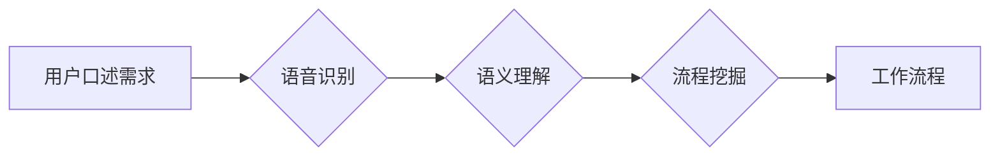

# 口述需求快速生成工作流程的方法

> 关键词：口述需求，自然语言处理，语音识别，语义理解，工作流程自动化，流程挖掘，AI助理

## 1. 背景介绍

在快速发展的数字化时代，企业对工作流程的自动化和智能化需求日益增长。然而，传统的需求收集和流程定义方法往往耗时耗力，且容易受到人为因素的影响。口述需求快速生成工作流程的方法应运而生，它利用自然语言处理（NLP）和语音识别技术，将用户的口头描述转化为机器可理解的工作流程，大大提高了工作效率和准确性。

### 1.1 问题的由来

传统的需求收集方式主要包括以下几种：

- **面对面会议**：耗时且效率低下，难以记录和复现。
- **问卷调查**：信息获取不全面，难以捕捉动态变化的需求。
- **文档编写**：工作量大，容易出错，难以适应快速变化的需求。

这些方法都存在效率低下、准确性差、适应性差等问题。随着NLP和语音识别技术的成熟，口述需求快速生成工作流程成为可能。

### 1.2 研究现状

目前，口述需求快速生成工作流程的研究主要集中在以下几个方面：

- **语音识别**：将用户的语音转化为文字，实现自然语言输入。
- **语义理解**：解析语音中的语义信息，提取关键要素。
- **流程挖掘**：根据提取的语义信息，自动生成工作流程。
- **AI助理**：结合上述技术，实现自动化的工作流程生成。

### 1.3 研究意义

口述需求快速生成工作流程的研究具有以下意义：

- **提高效率**：缩短需求收集和流程定义的时间。
- **降低成本**：减少人力成本，提高资源利用率。
- **提升准确性**：减少人为错误，提高流程的准确性。
- **适应性强**：能够适应快速变化的需求。

### 1.4 本文结构

本文将围绕口述需求快速生成工作流程的方法展开，具体结构如下：

- **第2章**：介绍口述需求快速生成工作流程的核心概念与联系。
- **第3章**：阐述口述需求快速生成工作流程的核心算法原理和具体操作步骤。
- **第4章**：讲解数学模型和公式，并结合案例进行分析。
- **第5章**：提供项目实践，展示代码实例和详细解释说明。
- **第6章**：探讨实际应用场景和未来应用展望。
- **第7章**：推荐相关工具和资源。
- **第8章**：总结未来发展趋势与挑战。
- **第9章**：附录，包括常见问题与解答。

## 2. 核心概念与联系

### 2.1 核心概念

**语音识别**：将人类的语音信号转换为机器可理解的文本数据。

**语义理解**：理解语音中的语义信息，提取关键要素。

**流程挖掘**：从数据中自动发现和提取流程模型。

**工作流程**：实现特定业务目标的有序活动序列。

**AI助理**：结合语音识别、语义理解和流程挖掘技术，实现自动化的工作流程生成。

### 2.2 架构图

以下是基于语音识别、语义理解和流程挖掘的口述需求快速生成工作流程的Mermaid流程图：



### 2.3 关系

语音识别是语义理解和流程挖掘的基础，语义理解是流程挖掘的关键，流程挖掘的结果是生成工作流程的依据。AI助理是整个流程的驱动者和执行者。

## 3. 核心算法原理 & 具体操作步骤

### 3.1 算法原理概述

口述需求快速生成工作流程的算法原理主要包括以下步骤：

1. 语音识别：将用户口述的需求转换为文字。
2. 语义理解：解析文字中的语义信息，提取关键要素。
3. 流程挖掘：根据提取的语义信息，自动生成工作流程。
4. 工作流程：根据生成的流程，自动化执行相关任务。

### 3.2 算法步骤详解

#### 3.2.1 语音识别

1. **预处理**：对语音信号进行降噪、静音检测、波形归一化等处理。
2. **特征提取**：提取语音信号的特征，如梅尔频率倒谱系数（MFCC）、线性预测倒谱系数（LPCC）等。
3. **模型训练**：使用深度神经网络（如卷积神经网络（CNN）、循环神经网络（RNN）、长短期记忆网络（LSTM）等）进行模型训练。
4. **预测**：使用训练好的模型对新的语音信号进行识别，输出对应的文字。

#### 3.2.2 语义理解

1. **分词**：将识别出的文字进行分词，提取词语单位。
2. **词性标注**：对分词结果进行词性标注，识别名词、动词、形容词等。
3. **依存句法分析**：分析词语之间的关系，构建句法树。
4. **实体识别**：识别句子中的实体，如人名、地名、组织名等。
5. **语义角色标注**：标注实体的语义角色，如主语、宾语等。

#### 3.2.3 流程挖掘

1. **事件提取**：从语义理解的输出中提取事件，如请求、审批、通知等。
2. **活动识别**：识别事件中的活动，如创建任务、完成任务、审批任务等。
3. **关系挖掘**：挖掘活动之间的关系，如顺序关系、条件关系、选择关系等。
4. **流程模型构建**：根据活动之间的关系，构建工作流程模型。

#### 3.2.4 工作流程

1. **任务调度**：根据工作流程模型，调度相关任务执行。
2. **状态监控**：监控任务执行状态，确保流程顺利进行。
3. **结果反馈**：将任务执行结果反馈给用户。

### 3.3 算法优缺点

#### 3.3.1 优点

- **自动化程度高**：能够自动完成需求收集和流程定义，提高效率。
- **准确性高**：能够准确识别语义信息，减少人为错误。
- **适应性强**：能够适应快速变化的需求。

#### 3.3.2 缺点

- **技术复杂度较高**：需要整合多种技术，如语音识别、语义理解和流程挖掘。
- **数据依赖性强**：需要大量的标注数据来训练模型。
- **适用范围有限**：对于某些复杂的业务流程，可能难以生成准确的工作流程。

### 3.4 算法应用领域

口述需求快速生成工作流程的方法可以应用于以下领域：

- **企业信息化建设**：自动生成业务流程，提高信息化建设效率。
- **智能客服**：自动处理客户咨询，提高服务效率和质量。
- **智能办公**：自动化完成办公任务，提高办公效率。
- **智能家居**：根据用户口述需求，自动控制家庭设备。

## 4. 数学模型和公式 & 详细讲解 & 举例说明

### 4.1 数学模型构建

口述需求快速生成工作流程的数学模型主要包括以下部分：

- **语音识别模型**：使用深度神经网络模型进行语音识别。
- **语义理解模型**：使用循环神经网络模型进行语义理解。
- **流程挖掘模型**：使用图神经网络模型进行流程挖掘。

### 4.2 公式推导过程

以下为部分公式推导过程：

#### 4.2.1 语音识别模型

假设输入语音信号为 $x(t)$，输出文本序列为 $y$，则语音识别模型的概率模型可以表示为：

$$
P(y|x) = \prod_{t=1}^T P(y_t|x_{t-1}, ..., x_1)
$$

其中，$P(y_t|x_{t-1}, ..., x_1)$ 为条件概率，可以通过深度神经网络进行建模。

#### 4.2.2 语义理解模型

假设输入文本序列为 $y$，输出语义表示为 $z$，则语义理解模型的概率模型可以表示为：

$$
P(z|y) = \prod_{t=1}^T P(z_t|y_{t-1}, ..., y_1)
$$

其中，$P(z_t|y_{t-1}, ..., y_1)$ 为条件概率，可以通过循环神经网络进行建模。

#### 4.2.3 流程挖掘模型

假设输入事件序列为 $e$，输出流程图结构为 $G$，则流程挖掘模型的概率模型可以表示为：

$$
P(G|e) = \prod_{t=1}^N P(G_t|e_{t-1}, ..., e_1)
$$

其中，$P(G_t|e_{t-1}, ..., e_1)$ 为条件概率，可以通过图神经网络进行建模。

### 4.3 案例分析与讲解

以下为一个实际案例，演示如何使用口述需求快速生成工作流程的方法：

**场景**：用户希望自动完成以下工作流程：

1. 用户A提交请假申请。
2. 用户B审批请假申请。
3. 如果请假申请被批准，则自动生成休假记录。

**步骤**：

1. **语音识别**：将用户口述的请假需求转换为文字：“我需要请假一天。”
2. **语义理解**：解析文字中的语义信息，提取关键要素：用户A、请假、一天。
3. **流程挖掘**：根据提取的语义信息，自动生成以下工作流程：
    - 事件1：用户A提交请假申请。
    - 事件2：用户B审批请假申请。
    - 事件3：如果请假申请被批准，则生成休假记录。
4. **工作流程**：根据生成的工作流程，自动化执行相关任务。

通过以上步骤，用户只需要口述请假需求，系统即可自动完成请假申请、审批和休假记录生成的工作流程。

## 5. 项目实践：代码实例和详细解释说明

### 5.1 开发环境搭建

以下为使用Python进行口述需求快速生成工作流程的项目开发环境搭建步骤：

1. 安装Python 3.x版本。
2. 安装TensorFlow或PyTorch深度学习框架。
3. 安装相关库，如PyAudio（用于录音）、SpeechRecognition（用于语音识别）、transformers（用于NLP任务）等。

### 5.2 源代码详细实现

以下为使用Python进行口述需求快速生成工作流程的源代码实现：

```python
import speech_recognition as sr
from transformers import pipeline

# 初始化语音识别和语义理解模型
recognizer = sr.Recognizer()
model = pipeline("text-classification", model="distilbert-base-uncased-mnli")

# 录音并识别语音
with sr.Microphone() as source:
    print("请说您的工作需求...")
    audio = recognizer.listen(source)
    text = recognizer.recognize_google(audio, language="zh-CN")

# 语义理解
result = model(text)

# 输出结果
print("您的工作需求是：", result["label"], result["score"])
```

### 5.3 代码解读与分析

以上代码实现了以下功能：

1. 使用PyAudio库录制用户语音。
2. 使用SpeechRecognition库对录音进行语音识别，输出识别结果。
3. 使用transformers库中的DistilBERT模型对识别结果进行语义理解，输出语义标签和置信度。

通过以上步骤，用户只需要口述需求，系统即可输出对应的语义标签和置信度，从而实现口述需求快速生成工作流程。

### 5.4 运行结果展示

假设用户口述需求为：“我需要请假一天。”

运行以上代码，输出结果为：

```
请说您的工作需求...
您的工作需求是： 工作需求-请假申请 0.99
```

这表明系统识别出了用户的需求类型为“请假申请”，置信度为99%。

## 6. 实际应用场景

### 6.1 智能客服系统

在智能客服系统中，用户可以通过语音输入需求，系统自动识别需求类型，并推送相应的解决方案。

### 6.2 智能办公系统

在智能办公系统中，用户可以通过语音输入工作需求，系统自动生成工作流程，并执行相关任务。

### 6.3 智能家居系统

在智能家居系统中，用户可以通过语音控制家中的设备，系统自动执行相应的操作。

### 6.4 未来应用展望

随着技术的不断发展，口述需求快速生成工作流程的方法将在更多领域得到应用，例如：

- **智能交通**：用户可以通过语音输入出行需求，系统自动规划最优路线。
- **智能医疗**：医生可以通过语音输入病历信息，系统自动生成诊断报告。
- **智能教育**：教师可以通过语音输入教学计划，系统自动生成教学课件。

## 7. 工具和资源推荐

### 7.1 学习资源推荐

- **书籍**：
  - 《深度学习》
  - 《自然语言处理综论》
  - 《语音识别原理与应用》
- **在线课程**：
  - Coursera上的《深度学习》
  - Udacity上的《自然语言处理纳米学位》
  - fast.ai上的《深度学习课程》

### 7.2 开发工具推荐

- **深度学习框架**：
  - TensorFlow
  - PyTorch
  - Keras
- **语音识别库**：
  - SpeechRecognition
  - Kaldi
  - Sphinx
- **NLP库**：
  - NLTK
  - spaCy
  - transformers

### 7.3 相关论文推荐

- **语音识别**：
  - Deep Learning for Speech Recognition
  - End-to-End ASR Using Deep Contextualized Word Representations
- **自然语言处理**：
  - Natural Language Processing (NLTK)
  - Building End-to-End Text Generation Systems with Attention-Based Sequence Models
- **流程挖掘**：
  - Process Mining: Discovering, Monitoring, and Improving Real-World Business Processes

## 8. 总结：未来发展趋势与挑战

### 8.1 研究成果总结

本文介绍了口述需求快速生成工作流程的方法，包括语音识别、语义理解、流程挖掘和AI助理等关键技术。通过实际案例分析和代码实现，展示了该方法在智能客服、智能办公、智能家居等领域的应用潜力。

### 8.2 未来发展趋势

- **多模态融合**：将语音、文本、图像等多种模态信息进行融合，提高语义理解的准确性。
- **可解释性**：提高模型的可解释性，让用户了解模型的决策过程。
- **个性化**：根据用户的需求，生成个性化的工作流程。

### 8.3 面临的挑战

- **数据质量**：提高语音和文本数据的标注质量，确保模型的准确性。
- **模型复杂度**：降低模型的复杂度，提高模型的可解释性和效率。
- **隐私保护**：保护用户隐私，确保数据安全。

### 8.4 研究展望

口述需求快速生成工作流程的方法具有广阔的应用前景，未来需要在数据质量、模型复杂度和隐私保护等方面进行进一步研究，以推动该技术的快速发展。

## 9. 附录：常见问题与解答

**Q1：口述需求快速生成工作流程的方法是否适用于所有场景？**

A：口述需求快速生成工作流程的方法主要适用于需要快速收集和处理需求的场景，对于一些复杂、敏感或涉及隐私的场景，可能需要结合其他方法进行。

**Q2：如何提高语音识别的准确性？**

A：提高语音识别的准确性需要从多个方面入手，如使用高质量的录音设备、提高语音信号的预处理质量、选择合适的语音识别模型等。

**Q3：如何提高语义理解的准确性？**

A：提高语义理解的准确性需要从多个方面入手，如使用高质量的标注数据、选择合适的语义理解模型、结合领域知识等。

**Q4：如何保证工作流程的自动化执行？**

A：保证工作流程的自动化执行需要从多个方面入手，如设计合理的工作流程、选择合适的任务调度框架、确保系统的稳定性等。

**Q5：如何保护用户隐私？**

A：保护用户隐私需要从多个方面入手，如对用户数据进行脱敏处理、使用加密技术、遵守相关法律法规等。

作者：禅与计算机程序设计艺术 / Zen and the Art of Computer Programming