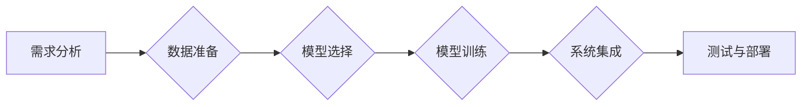

> 人工智能，垂直行业软件，定制化解决方案，数据驱动，业务流程自动化

# 垂直行业软件与AI的结合

在数字化转型的浪潮中，垂直行业软件与人工智能（AI）的结合成为了提高行业效率和竞争力的关键。本文将探讨如何将AI技术融入垂直行业软件，以及这一结合带来的机遇和挑战。

## 1. 背景介绍

### 1.1 数字化转型趋势

随着互联网、云计算、大数据等技术的发展，全球范围内都在经历着一场数字化转型。企业通过数字化手段优化业务流程，提高运营效率，增强客户体验，从而在激烈的市场竞争中脱颖而出。

### 1.2 垂直行业软件的重要性

垂直行业软件针对特定行业的需求进行定制化开发，能够更好地解决行业痛点和提升行业效率。例如，金融行业的风险管理软件、医疗行业的电子病历系统、制造行业的生产管理系统等。

### 1.3 人工智能在垂直行业中的应用

AI技术在图像识别、自然语言处理、预测分析等方面取得了显著进展，为垂直行业软件提供了强大的技术支持。将AI技术与垂直行业软件结合，可以进一步提升行业智能化水平。

## 2. 核心概念与联系

### 2.1 垂直行业软件

垂直行业软件是指针对特定行业需求开发的软件系统，具有行业特色和定制化特点。

### 2.2 人工智能

人工智能（AI）是指模拟、延伸和扩展人的智能的理论、方法、技术及应用系统。

### 2.3 结合流程

垂直行业软件与AI的结合流程如下：

1. **需求分析**：深入了解行业需求，确定AI应用场景。
2. **数据准备**：收集、清洗和标注行业数据。
3. **模型选择**：选择合适的AI模型，如机器学习、深度学习等。
4. **模型训练**：使用行业数据进行模型训练，优化模型性能。
5. **系统集成**：将AI模型集成到垂直行业软件中。
6. **测试与部署**：对集成后的软件进行测试，确保稳定运行。



## 3. 核心算法原理 & 具体操作步骤

### 3.1 算法原理概述

AI技术在垂直行业软件中的应用主要包括以下几种：

- **图像识别**：通过计算机视觉技术识别图像中的物体、场景等。
- **自然语言处理（NLP）**：解析和生成自然语言文本，如语义理解、机器翻译等。
- **预测分析**：根据历史数据预测未来趋势，如销量预测、风险评估等。
- **决策树、神经网络等机器学习算法**：对行业数据进行分类、回归等任务。

### 3.2 算法步骤详解

1. **需求分析**：与行业专家沟通，明确AI应用的目标和预期效果。
2. **数据准备**：收集行业数据，包括历史数据、实时数据等，并进行数据清洗和标注。
3. **模型选择**：根据应用场景和数据特点选择合适的AI模型。
4. **模型训练**：使用标注数据对AI模型进行训练，调整模型参数，优化模型性能。
5. **系统集成**：将训练好的AI模型集成到垂直行业软件中，实现业务功能。
6. **测试与部署**：对集成后的软件进行测试，确保稳定运行，并部署到生产环境中。

### 3.3 算法优缺点

**优点**：

- **提高效率**：自动化处理重复性工作，提高业务处理效率。
- **优化决策**：提供数据驱动的决策支持，提高决策质量。
- **增强用户体验**：提供个性化服务，提升用户满意度。

**缺点**：

- **数据依赖**：AI模型效果依赖于数据质量，数据不足或质量差可能导致模型性能下降。
- **技术复杂**：AI技术实现复杂，需要专业知识和技术支持。
- **成本高昂**：模型训练、硬件设备等成本较高。

### 3.4 算法应用领域

- **金融行业**：风险管理、欺诈检测、客户画像等。
- **医疗行业**：疾病诊断、患者管理、临床试验等。
- **制造行业**：生产优化、设备预测性维护、供应链管理等。
- **零售行业**：需求预测、库存管理、客户服务等。

## 4. 数学模型和公式 & 详细讲解 & 举例说明

### 4.1 数学模型构建

以预测分析为例，常见的数学模型包括：

- **线性回归**：$\hat{y} = \beta_0 + \beta_1x_1 + \beta_2x_2 + \dots + \beta_nx_n + \epsilon$
- **逻辑回归**：$\hat{P}(y=1) = \frac{1}{1 + e^{-(\beta_0 + \beta_1x_1 + \beta_2x_2 + \dots + \beta_nx_n)}}$

### 4.2 公式推导过程

以线性回归为例，推导过程如下：

- **最小二乘法**：最小化损失函数$J(\beta) = \frac{1}{2}\sum_{i=1}^n(y_i - \hat{y}_i)^2$
- **求导**：$J'(\beta) = \sum_{i=1}^n(y_i - \hat{y}_i)x_i$
- **令导数为0**：$J'(\beta) = 0 \Rightarrow \beta = \left( X^T X \right)^{-1}X^T y$

### 4.3 案例分析与讲解

以某电商平台商品销量预测为例，使用线性回归模型进行预测。

- **数据**：某电商平台过去一个月的每日销量数据。
- **特征**：日期、商品类别、促销信息等。
- **模型**：线性回归模型。

通过训练模型，可以得到预测销量公式$\hat{y} = \beta_0 + \beta_1x_1 + \beta_2x_2 + \dots + \beta_nx_n$。

## 5. 项目实践：代码实例和详细解释说明

### 5.1 开发环境搭建

使用Python进行AI应用开发，需要安装以下环境：

- Python 3.x
- PyTorch
- Pandas
- NumPy

### 5.2 源代码详细实现

以下是一个使用PyTorch进行线性回归模型预测销量的代码示例：

```python
import torch
import torch.nn as nn
import torch.optim as optim
import pandas as pd

# 加载数据
data = pd.read_csv('sales_data.csv')
x = data[['date', 'category', 'promotion']].values
y = data['sales'].values

# 转换为张量
x_tensor = torch.tensor(x, dtype=torch.float32)
y_tensor = torch.tensor(y, dtype=torch.float32)

# 定义模型
class LinearRegression(nn.Module):
    def __init__(self, input_size, output_size):
        super(LinearRegression, self).__init__()
        self.linear = nn.Linear(input_size, output_size)

    def forward(self, x):
        out = self.linear(x)
        return out

model = LinearRegression(x.shape[1], 1)

# 定义损失函数和优化器
criterion = nn.MSELoss()
optimizer = optim.SGD(model.parameters(), lr=0.01)

# 训练模型
num_epochs = 100
for epoch in range(num_epochs):
    optimizer.zero_grad()
    outputs = model(x_tensor)
    loss = criterion(outputs, y_tensor)
    loss.backward()
    optimizer.step()

    if epoch % 10 == 0:
        print(f'Epoch {epoch+1}, Loss: {loss.item()}')

# 测试模型
with torch.no_grad():
    test_loss = criterion(model(x_tensor), y_tensor)
    print(f'Test Loss: {test_loss.item()}')
```

### 5.3 代码解读与分析

- **数据加载**：使用Pandas读取销量数据，并将特征和标签转换为PyTorch张量。
- **模型定义**：定义一个线性回归模型，包含一个线性层。
- **损失函数和优化器**：定义均方误差损失函数和随机梯度下降优化器。
- **训练模型**：通过循环迭代，不断更新模型参数，最小化损失函数。
- **测试模型**：在测试集上评估模型性能。

## 6. 实际应用场景

### 6.1 金融行业

- **欺诈检测**：利用图像识别技术识别可疑的交易行为，提高欺诈检测效率。
- **风险管理**：通过预测分析技术预测市场风险，帮助金融机构制定合理的风险控制策略。
- **客户画像**：利用NLP技术分析客户评论、社交媒体数据等，构建客户画像，提供个性化服务。

### 6.2 医疗行业

- **疾病诊断**：利用深度学习技术辅助医生进行疾病诊断，提高诊断准确率。
- **患者管理**：利用自然语言处理技术分析病历、医嘱等，实现患者信息管理自动化。
- **临床试验**：利用机器学习技术优化临床试验设计，提高临床试验效率。

### 6.3 制造行业

- **生产优化**：利用预测分析技术预测生产需求，优化生产计划。
- **设备预测性维护**：利用图像识别技术分析设备运行状态，实现设备预测性维护。
- **供应链管理**：利用NLP技术分析供应链数据，优化供应链管理。

## 7. 工具和资源推荐

### 7.1 学习资源推荐

- 《Python深度学习》
- 《深度学习》
- 《统计学习方法》

### 7.2 开发工具推荐

- PyTorch
- TensorFlow
- Pandas
- NumPy

### 7.3 相关论文推荐

- "Deep Learning for Natural Language Processing"
- "Deep Learning for Computer Vision"
- "Reinforcement Learning: An Introduction"

## 8. 总结：未来发展趋势与挑战

### 8.1 研究成果总结

本文探讨了垂直行业软件与AI结合的背景、核心概念、算法原理、实际应用场景等，为读者提供了全面的技术参考。

### 8.2 未来发展趋势

- **模型轻量化**：开发轻量级AI模型，降低计算资源需求。
- **模型可解释性**：提高模型可解释性，增强用户信任。
- **多模态融合**：融合多种模态数据，提高模型性能。

### 8.3 面临的挑战

- **数据质量**：数据质量对AI模型性能至关重要。
- **技术复杂性**：AI技术实现复杂，需要专业人才。
- **伦理问题**：AI技术在应用过程中可能引发伦理问题。

### 8.4 研究展望

未来，垂直行业软件与AI的结合将更加紧密，为各行各业带来更多创新应用。同时，需要关注数据质量、技术复杂性和伦理问题，确保AI技术在健康发展。

---

作者：禅与计算机程序设计艺术 / Zen and the Art of Computer Programming