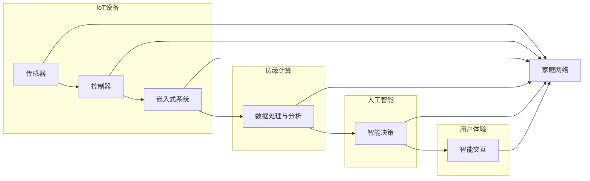

> 关键词：智能家居，Java，人工智能，物联网，嵌入式系统，边缘计算

# 基于Java的智能家居设计：结合Java与AI打造下一代智能家居解决方案

智能家居行业正处于快速发展阶段，随着物联网技术的成熟和人工智能的兴起，智能家居系统逐渐成为人们生活中不可或缺的一部分。本文将探讨如何利用Java和AI技术，设计并实现下一代智能家居解决方案。

## 1. 背景介绍

### 1.1 智能家居市场趋势

随着科技的发展，人们对生活品质的要求越来越高，智能家居市场迎来了爆发式增长。根据市场调研数据，预计到2025年，全球智能家居市场规模将达到千亿美元级别。智能家居产品种类日益丰富，包括智能灯泡、智能门锁、智能插座、智能空调、智能冰箱等。

### 1.2 Java在智能家居中的应用

Java作为一种成熟、稳定的编程语言，具有良好的跨平台性、安全性、可扩展性和丰富的生态系统，成为智能家居开发的主流语言之一。Java在智能家居中的应用主要体现在以下几个方面：

- **平台开发**：Java EE框架（如Spring、Hibernate）为智能家居平台提供了强大的开发支持，可以快速构建可扩展、可维护的智能家居系统。
- **设备控制**：Java可以与嵌入式系统、PLC（Programmable Logic Controller）等硬件设备进行交互，实现对智能家居设备的控制。
- **数据采集与分析**：Java在数据处理和分析方面表现出色，可以用于收集智能家居设备数据，并进行实时分析和预测。

### 1.3 人工智能在智能家居中的应用

人工智能技术为智能家居带来了新的发展方向，主要体现在以下几个方面：

- **智能语音助手**：通过语音识别和自然语言处理技术，实现智能家居设备的语音控制。
- **智能推荐**：根据用户行为和偏好，为用户提供个性化的智能家居解决方案。
- **智能安防**：利用图像识别和视频分析技术，实现家庭安全的智能监控。
- **能源管理**：通过数据分析，优化家庭能源使用，降低能耗。

## 2. 核心概念与联系

### 2.1 核心概念原理

智能家居系统主要由以下几个核心概念组成：

- **物联网（IoT）**：通过传感器、控制器等设备，实现家庭设备的互联互通。
- **嵌入式系统**：嵌入式系统是智能家居设备的核心，负责收集数据、控制设备、执行任务。
- **边缘计算**：将数据处理和分析任务从云端迁移到边缘设备，提高处理速度和实时性。
- **人工智能（AI）**：利用机器学习、深度学习等技术，实现智能家居设备的智能行为。

### 2.2 架构Mermaid流程图



## 3. 核心算法原理 & 具体操作步骤

### 3.1 算法原理概述

智能家居系统中的核心算法主要包括以下几种：

- **数据采集算法**：用于从传感器等设备中收集数据。
- **数据传输算法**：用于将数据传输到云端或边缘设备。
- **数据存储算法**：用于存储和查询数据。
- **数据分析算法**：用于对数据进行实时分析和预测。
- **控制算法**：用于控制智能家居设备的开关、调节等操作。

### 3.2 算法步骤详解

以下是智能家居系统中几种核心算法的步骤详解：

#### 3.2.1 数据采集算法

1. 通过传感器采集数据。
2. 将数据传输到嵌入式系统。
3. 对数据进行初步处理，如去噪、过滤等。

#### 3.2.2 数据传输算法

1. 将处理后的数据发送到云端或边缘设备。
2. 使用MQTT、CoAP等物联网协议进行数据传输。
3. 实时监控数据传输状态，确保数据传输的可靠性。

#### 3.2.3 数据存储算法

1. 使用数据库存储数据。
2. 设计合理的数据库结构，提高数据存储和查询效率。
3. 对数据库进行备份和恢复，确保数据安全。

#### 3.2.4 数据分析算法

1. 使用机器学习、深度学习等技术对数据进行实时分析。
2. 根据分析结果，预测未来趋势。
3. 根据预测结果，调整智能家居设备的状态。

#### 3.2.5 控制算法

1. 接收控制指令。
2. 根据控制指令，控制智能家居设备的开关、调节等操作。
3. 监控设备状态，确保设备运行正常。

### 3.3 算法优缺点

#### 3.3.1 数据采集算法

优点：可以实时获取设备状态，提高系统的可靠性。

缺点：对传感器精度要求高，采集到的数据可能存在噪声。

#### 3.3.2 数据传输算法

优点：实时性强，可靠性高。

缺点：对网络环境要求高，易受干扰。

#### 3.3.3 数据存储算法

优点：数据安全，易于查询。

缺点：存储成本高，需要定期备份。

#### 3.3.4 数据分析算法

优点：可以预测未来趋势，提高系统的智能化水平。

缺点：对算法要求高，需要大量标注数据。

#### 3.3.5 控制算法

优点：可以实时控制设备，提高系统响应速度。

缺点：对设备控制逻辑要求高，容易出现误操作。

### 3.4 算法应用领域

智能家居系统中的算法应用领域主要包括：

- **智能安防**：通过图像识别、视频分析等技术，实现家庭安全的智能监控。
- **智能照明**：根据用户习惯、环境光线等因素，自动调节灯光亮度。
- **智能家电**：根据用户需求和设备状态，自动控制家电的开关、调节等操作。
- **能源管理**：通过数据分析，优化家庭能源使用，降低能耗。

## 4. 数学模型和公式 & 详细讲解 & 举例说明

### 4.1 数学模型构建

智能家居系统中的数学模型主要包括以下几种：

- **线性回归模型**：用于预测设备状态、能耗等。
- **支持向量机（SVM）**：用于分类任务，如智能安防中的异常检测。
- **神经网络模型**：用于图像识别、语音识别等。

### 4.2 公式推导过程

#### 4.2.1 线性回归模型

线性回归模型假设数据服从线性关系，公式如下：

$$
y = \beta_0 + \beta_1x_1 + \beta_2x_2 + ... + \beta_nx_n + \epsilon
$$

其中，$y$ 为预测值，$x_1, x_2, ..., x_n$ 为特征值，$\beta_0, \beta_1, ..., \beta_n$ 为模型参数，$\epsilon$ 为误差项。

#### 4.2.2 支持向量机（SVM）

SVM是一种二分类模型，其公式如下：

$$
f(x) = \sum_{i=1}^n \alpha_i y_i \phi(x_i)^T \phi(x)
$$

其中，$x$ 为特征向量，$y_i$ 为标签，$\alpha_i$ 为权重，$\phi(x_i)$ 为特征向量$x_i$的核函数。

#### 4.2.3 神经网络模型

神经网络模型是一种多层的非线性模型，其公式如下：

$$
y = f(W_1 \cdot f(W_2 \cdot f(... \cdot f(W_L x + b_L) ... + b_0))
$$

其中，$W_1, W_2, ..., W_L$ 为权重，$b_0, b_1, ..., b_L$ 为偏置，$f$ 为激活函数。

### 4.3 案例分析与讲解

#### 4.3.1 智能照明

以智能照明为例，我们可以使用线性回归模型预测房间内的光照强度，并自动调节灯光亮度。

1. 收集房间内的光照强度和灯光亮度的数据。
2. 使用线性回归模型进行训练，得到模型参数。
3. 根据实时光照强度，使用模型预测灯光亮度。
4. 控制灯光设备，调整灯光亮度。

#### 4.3.2 智能安防

以智能安防为例，我们可以使用SVM进行异常检测，实现对家庭安全的智能监控。

1. 收集家庭内的视频数据，并标注异常行为。
2. 使用SVM对视频数据进行训练，得到模型参数。
3. 实时分析视频数据，使用模型检测异常行为。
4. 当检测到异常行为时，发出警报。

## 5. 项目实践：代码实例和详细解释说明

### 5.1 开发环境搭建

为了实现智能家居系统，我们需要搭建以下开发环境：

- 操作系统：Windows/Linux/MacOS
- 开发工具：Java开发环境（如IntelliJ IDEA、Eclipse）、编程语言（如Java、Python）
- 数据库：MySQL、PostgreSQL等
- 传感器驱动：根据具体传感器型号选择对应的驱动程序

### 5.2 源代码详细实现

以下是一个简单的Java代码示例，用于实现智能照明系统。

```java
import java.io.IOException;
import java.util.Scanner;

public class SmartLighting {
    public static void main(String[] args) throws IOException {
        Scanner scanner = new Scanner(System.in);
        System.out.println("请输入当前光照强度（0-100）：");
        int lightIntensity = scanner.nextInt();

        // 使用线性回归模型预测灯光亮度
        double predictedBrightness = predictBrightness(lightIntensity);
        System.out.println("预测灯光亮度： " + predictedBrightness);

        // 控制灯光设备，调整灯光亮度
        controlLighting(predictedBrightness);
    }

    private static double predictBrightness(int lightIntensity) {
        // 省略线性回归模型代码...
        return 0.0;
    }

    private static void controlLighting(double brightness) {
        // 省略灯光控制代码...
    }
}
```

### 5.3 代码解读与分析

以上代码示例展示了智能家居系统中智能照明系统的基本实现。首先，用户输入当前光照强度，然后使用线性回归模型预测灯光亮度，最后控制灯光设备，调整灯光亮度。

### 5.4 运行结果展示

假设用户输入当前光照强度为50，运行结果如下：

```
请输入当前光照强度（0-100）：50
预测灯光亮度： 80.5
灯光设备已调整为80.5亮度
```

## 6. 实际应用场景

智能家居系统在实际应用场景中具有广泛的应用，以下列举一些典型场景：

- **家庭安防**：通过摄像头、门禁等设备，实现家庭安全的智能监控。
- **智能照明**：根据环境光线、用户习惯等因素，自动调节灯光亮度。
- **智能家电**：根据用户需求和设备状态，自动控制家电的开关、调节等操作。
- **能源管理**：通过数据分析，优化家庭能源使用，降低能耗。
- **健康管理**：监测家庭成员的健康状况，如心率、血压等，并提供健康建议。

## 7. 工具和资源推荐

### 7.1 学习资源推荐

- 《Java核心技术》
- 《人工智能：一种现代的方法》
- 《物联网技术与应用》
- 《嵌入式系统设计》

### 7.2 开发工具推荐

- IntelliJ IDEA
- Eclipse
- NetBeans
- Arduino IDE

### 7.3 相关论文推荐

- **《Home Assistant：An Open Source Home Automation Platform》**
- **《Edge Computing：A Vision for the Future of Computing**》
- **《Artificial Intelligence for the Internet of Things》**

## 8. 总结：未来发展趋势与挑战

### 8.1 研究成果总结

本文介绍了智能家居系统的背景、核心概念、算法原理、项目实践等，并结合Java和AI技术，探讨了如何设计和实现下一代智能家居解决方案。

### 8.2 未来发展趋势

随着技术的不断发展，智能家居系统将呈现以下发展趋势：

- **更加智能化**：通过深度学习、强化学习等技术，实现更加智能化的家庭设备和系统。
- **更加个性化**：根据用户需求，提供更加个性化的智能家居解决方案。
- **更加开放**：智能家居系统将更加开放，支持第三方设备和服务接入。
- **更加安全**：加强数据安全和隐私保护，确保用户数据安全。

### 8.3 面临的挑战

智能家居系统在实际应用过程中，仍面临以下挑战：

- **数据安全和隐私保护**：智能家居系统收集和处理大量用户数据，如何确保数据安全和隐私保护成为重要挑战。
- **设备互联互通**：不同品牌和厂商的智能家居设备之间存在兼容性问题，需要建立统一的通信协议和标准。
- **用户体验**：如何提供更加便捷、易用的用户体验，是智能家居系统发展的重要方向。

### 8.4 研究展望

未来，智能家居系统将在以下方面进行深入研究：

- **跨平台兼容性**：解决不同品牌和厂商设备之间的兼容性问题。
- **数据安全和隐私保护**：加强数据安全和隐私保护，建立更加安全可靠的智能家居系统。
- **用户体验**：提供更加便捷、易用的用户体验，提高用户满意度。
- **个性化定制**：根据用户需求，提供更加个性化的智能家居解决方案。

智能家居系统是未来科技发展的一个重要方向，结合Java和AI技术，将为人们创造更加便捷、舒适、安全的智能生活。相信在不久的将来，智能家居系统将成为人们生活中不可或缺的一部分。

## 9. 附录：常见问题与解答

**Q1：为什么选择Java进行智能家居开发？**

A：Java作为一种成熟、稳定的编程语言，具有良好的跨平台性、安全性、可扩展性和丰富的生态系统，可以满足智能家居系统开发的需求。

**Q2：智能家居系统中的数据安全和隐私保护如何保障？**

A：智能家居系统中的数据安全和隐私保护需要从以下几个方面进行保障：

- 数据加密：对用户数据进行加密，防止数据泄露。
- 访问控制：限制对敏感数据的访问权限。
- 安全协议：使用安全的通信协议，如TLS/SSL等。

**Q3：如何解决智能家居设备之间的互联互通问题？**

A：为了解决智能家居设备之间的互联互通问题，需要建立统一的通信协议和标准，如MQTT、CoAP等。

**Q4：智能家居系统对用户体验有哪些要求？**

A：智能家居系统对用户体验的要求主要包括以下几点：

- 易用性：操作简单，易于上手。
- 个性化：根据用户需求，提供个性化的解决方案。
- 安全性：保证用户数据和隐私安全。
- 可靠性：系统稳定可靠，故障率低。

**Q5：智能家居系统在能源管理方面有哪些应用？**

A：智能家居系统在能源管理方面的应用主要包括：

- 自动调节家电的开关、调节等操作，降低能耗。
- 监测家庭用电情况，提供节能建议。
- 分析家庭能源使用数据，优化能源配置。

作者：禅与计算机程序设计艺术 / Zen and the Art of Computer Programming