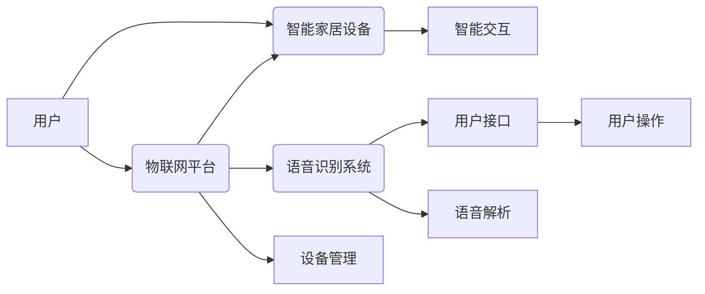

# 基于Java的智能家居设计：集成语音识别功能到智能家居系统

> 关键词：智能家居，Java，语音识别，自然语言处理，物联网，多智能体系统，API，框架设计

## 1. 背景介绍

随着物联网(IoT)技术的飞速发展，智能家居系统逐渐成为现代家庭生活的重要组成部分。智能家居系统能够通过互联网技术将家庭中的各种设备连接起来，实现远程控制、自动化管理等功能，为用户提供更加便捷、舒适的生活方式。而语音识别技术的兴起，为智能家居系统提供了更加人性化的交互方式。本文将探讨如何利用Java技术，将语音识别功能集成到智能家居系统中，构建一个智能化的家居环境。

### 1.1 家居自动化趋势

近年来，智能家居市场持续增长，用户对智能家居系统的需求日益多样化。以下是一些推动家居自动化趋势的关键因素：

- **生活节奏加快**：现代生活节奏快，人们需要更加高效的方式管理家务和日常活动。
- **科技普及**：随着科技的普及，越来越多的人开始接受智能家居产品。
- **物联网技术的成熟**：物联网技术的成熟为智能家居系统的开发提供了技术支持。
- **智能设备的增多**：智能设备的增多为智能家居系统的功能扩展提供了更多可能性。

### 1.2 语音识别技术的发展

语音识别技术作为人工智能领域的重要分支，近年来取得了显著的进展。以下是语音识别技术发展的几个关键点：

- **语音识别准确率的提升**：随着深度学习技术的发展，语音识别的准确率越来越高。
- **自然语言处理(NLP)的进步**：NLP技术的发展使得语音识别系统能够更好地理解自然语言。
- **端到端模型的应用**：端到端模型的应用简化了语音识别系统的开发过程。
- **云服务和边缘计算的融合**：云服务和边缘计算的融合为语音识别系统的部署提供了更多选择。

## 2. 核心概念与联系

智能家居系统的设计涉及多个核心概念，包括：

- **智能家居设备**：包括智能灯泡、智能插座、智能门锁、智能摄像头等。
- **物联网平台**：用于连接和管理智能家居设备，实现设备间的通信和数据交换。
- **语音识别系统**：用于将用户的语音指令转换为机器指令，控制智能家居设备。
- **用户接口**：包括语音助手、移动应用、Web界面等，用于用户与智能家居系统交互。

以下是基于Java的智能家居系统架构的Mermaid流程图：



## 3. 核心算法原理 & 具体操作步骤

### 3.1 算法原理概述

智能家居系统中的语音识别功能通常基于以下算法原理：

- **语音信号采集**：通过麦克风采集用户的语音信号。
- **语音信号预处理**：对采集到的语音信号进行降噪、去静音等处理。
- **特征提取**：从预处理后的语音信号中提取特征，如梅尔频率倒谱系数(MFCC)。
- **模型训练**：使用深度学习技术训练语音识别模型。
- **语音识别**：将用户的语音指令转换为文本指令。
- **指令解析**：解析文本指令，生成设备控制命令。
- **设备控制**：将控制命令发送给智能家居设备，执行相应操作。

### 3.2 算法步骤详解

以下是语音识别算法的具体操作步骤：

1. **语音信号采集**：通过麦克风采集用户的语音指令。
2. **语音信号预处理**：对采集到的语音信号进行降噪、去静音等处理，提高信号质量。
3. **特征提取**：从预处理后的语音信号中提取特征，如MFCC、线性预测系数(LPC)等。
4. **模型训练**：使用深度学习技术，如循环神经网络(RNN)、卷积神经网络(CNN)或Transformer，训练语音识别模型。
5. **语音识别**：将提取的特征输入训练好的模型，输出识别结果。
6. **指令解析**：解析识别结果，生成设备控制命令。
7. **设备控制**：将控制命令发送给智能家居设备，执行相应操作。

### 3.3 算法优缺点

**优点**：

- **用户体验良好**：语音识别技术可以实现自然语言交互，为用户提供更加便捷的操作体验。
- **适用场景广泛**：语音识别技术适用于各种场景，如家庭、办公室、公共场所等。
- **集成方便**：许多语音识别库和框架支持多种编程语言，方便集成到现有系统中。

**缺点**：

- **识别准确率有限**：在噪声环境下，语音识别的准确率可能受到影响。
- **计算资源消耗大**：深度学习模型通常需要大量的计算资源进行训练和推理。
- **隐私安全问题**：语音识别系统需要收集用户的语音数据，可能存在隐私泄露的风险。

### 3.4 算法应用领域

语音识别技术在智能家居系统中的应用领域包括：

- **设备控制**：用户可以通过语音指令控制智能家居设备，如开关灯、调节空调温度等。
- **信息查询**：用户可以通过语音指令查询智能家居设备的状态，如家电使用情况、室内环境参数等。
- **娱乐互动**：用户可以通过语音指令与智能家居系统进行娱乐互动，如播放音乐、讲故事等。

## 4. 数学模型和公式 & 详细讲解 & 举例说明

### 4.1 数学模型构建

语音识别的数学模型通常是基于深度学习技术，以下是一些常用的数学模型：

- **HMM（隐马尔可夫模型）**：用于语音信号建模，用于对语音信号进行概率建模。
- **RNN（循环神经网络）**：用于处理序列数据，如语音信号。
- **CNN（卷积神经网络）**：用于提取语音信号的特征。
- **Transformer**：用于端到端的语音识别任务。

以下是一个基于HMM的语音识别模型的简化公式：

$$
P(O|Q) = \prod_{i=1}^{N} P(o_i|q_i)
$$

其中，$O$ 表示观测序列，$Q$ 表示隐藏状态序列，$o_i$ 表示第 $i$ 个观测值，$q_i$ 表示第 $i$ 个隐藏状态。

### 4.2 公式推导过程

HMM模型由以下组件构成：

- **状态转移概率矩阵**：$A = [a_{ij}]_{i,j=1,...,N}$，表示从状态 $i$ 转移到状态 $j$ 的概率。
- **观测概率矩阵**：$B = [b_{ij}]_{i,j=1,...,N}$，表示在状态 $i$ 下观测到观测值 $j$ 的概率。
- **初始状态概率分布**：$\pi = [\pi_1, \pi_2, ..., \pi_N]^T$，表示初始状态为 $i$ 的概率。
- **观测序列**：$O = [o_1, o_2, ..., o_N]^T$，表示观测到的序列。

HMM模型的概率计算公式如下：

- **前向概率**：$P(O|Q) = \prod_{i=1}^{N} P(o_i|q_i)$
- **后向概率**：$P(Q|O) = \prod_{i=1}^{N} P(q_i|o_i, Q)$
- **状态路径概率**：$P(Q|O) = \sum_{q_1, q_2, ..., q_{N-1}} P(q_1|O)P(q_2|q_1, O) ... P(q_N|q_{N-1}, O)$

### 4.3 案例分析与讲解

以下是一个基于RNN的语音识别模型的案例：

假设我们有一个简单的RNN模型，用于识别数字。输入是数字的语音信号，输出是数字的文本表示。

1. **输入**：数字"123"的语音信号。
2. **处理**：RNN模型将语音信号转换为数字序列，如$(1, 2, 3)$。
3. **输出**：数字序列$(1, 2, 3)$被解码为文本"123"。

## 5. 项目实践：代码实例和详细解释说明

### 5.1 开发环境搭建

以下是使用Java进行智能家居系统开发的环境搭建步骤：

1. 安装Java开发工具包(JDK)。
2. 安装IDE，如Eclipse、IntelliJ IDEA等。
3. 安装Java语音识别库，如CMU Sphinx、IBM Speech to Text等。
4. 安装Java物联网平台，如thingsboard、ThingsBoard等。

### 5.2 源代码详细实现

以下是一个简单的Java代码示例，演示如何使用IBM Speech to Text库进行语音识别：

```java
import com.ibm.watson.speech_to_text.v1.SpeechToTextService;
import com.ibm.watson.speech_to_text.v1.model.RecognitionResults;

public class SpeechRecognitionExample {

    public static void main(String[] args) {
        // 创建SpeechToTextService实例
        SpeechToTextService speechToTextService = new SpeechToTextService();
        speechToTextService.setEndPoint("https://api.us-south.speech-to-text.watson.cloud.ibm.com");
        speechToTextService.setApiKey("your-api-key");

        // 创建语音识别请求
        SpeechToTextService.RecognizeOptions options = new SpeechToTextService.RecognizeOptions.Builder()
                .audioFile(new File("path/to/your/audio/file.wav"))
                .build();

        // 发送请求并获取结果
        RecognitionResults results = speechToTextService.recognize(options).execute();

        // 打印识别结果
        for (RecognitionResults.RecognitionResult result : results.getResults()) {
            System.out.println("Transcript: " + result.getAlternatives().get(0).getTranscript());
        }
    }
}
```

### 5.3 代码解读与分析

上述代码演示了如何使用IBM Speech to Text库进行语音识别。首先创建`SpeechToTextService`实例，并设置API端点和API密钥。然后创建`RecognizeOptions`实例，指定音频文件路径。最后，调用`recognize`方法发送请求，并遍历结果中的识别结果，打印出识别的文本。

### 5.4 运行结果展示

当用户输入音频文件时，系统将输出识别的文本，例如：

```
Transcript: your spoken text
```

## 6. 实际应用场景

### 6.1 家庭自动化

智能家居系统可以通过语音识别技术实现以下功能：

- **控制家电**：用户可以通过语音指令控制智能灯泡、智能插座、智能空调等家电。
- **获取信息**：用户可以通过语音指令查询天气预报、新闻资讯等。
- **娱乐互动**：用户可以通过语音指令播放音乐、讲故事、进行游戏等。

### 6.2 工商业应用

智能家居系统在工商业应用中也有广泛的应用，例如：

- **智能办公**：通过语音识别技术实现智能会议、语音邮件等功能。
- **智能工厂**：通过语音识别技术实现设备监控、故障诊断等功能。
- **智能酒店**：通过语音识别技术实现客房服务、智能迎宾等功能。

## 7. 工具和资源推荐

### 7.1 学习资源推荐

- 《Java语音识别编程》
- 《智能家居系统设计与实现》
- 《物联网技术原理与应用》

### 7.2 开发工具推荐

- Eclipse
- IntelliJ IDEA
- IBM Speech to Text API
- thingsboard

### 7.3 相关论文推荐

- 《Speech Recognition: A Tutorial》
- 《Speech Recognition Using Hidden Markov Models》
- 《Deep Learning for Speech Recognition》

## 8. 总结：未来发展趋势与挑战

### 8.1 研究成果总结

本文介绍了如何利用Java技术将语音识别功能集成到智能家居系统中。通过分析智能家居系统的设计、核心算法原理、具体操作步骤、数学模型和公式，以及项目实践，展示了语音识别技术在智能家居系统中的应用。

### 8.2 未来发展趋势

- **多模态交互**：智能家居系统将融合语音、视觉、触觉等多模态交互方式，为用户提供更加丰富的体验。
- **个性化定制**：智能家居系统将根据用户的需求和习惯进行个性化定制，提供更加智能化的服务。
- **边缘计算**：智能家居系统将采用边缘计算技术，降低延迟，提高实时性。

### 8.3 面临的挑战

- **数据安全和隐私**：智能家居系统涉及用户隐私和数据安全，需要采取措施保护用户数据。
- **设备兼容性**：智能家居设备种类繁多，需要解决设备兼容性问题。
- **自然语言理解**：语音识别系统的自然语言理解能力需要进一步提高。

### 8.4 研究展望

未来，智能家居系统将朝着更加智能化、个性化、安全化的方向发展。语音识别技术将作为智能家居系统的重要组成部分，为用户提供更加便捷、舒适的生活方式。

## 9. 附录：常见问题与解答

**Q1：如何选择合适的语音识别库？**

A：选择语音识别库时，需要考虑以下因素：

- **准确率**：选择准确率高的语音识别库。
- **易用性**：选择易于使用的语音识别库。
- **支持的语言**：选择支持所需语言的语音识别库。
- **集成方式**：选择易于集成的语音识别库。

**Q2：如何提高语音识别系统的准确率？**

A：提高语音识别系统的准确率可以从以下几个方面入手：

- **提高语音信号质量**：使用高质量的麦克风和降噪技术。
- **提高模型精度**：使用更先进的语音识别模型。
- **增加训练数据**：增加训练数据，提高模型的泛化能力。

**Q3：智能家居系统如何保证用户数据安全？**

A：智能家居系统可以采取以下措施保证用户数据安全：

- **数据加密**：对用户数据进行加密存储和传输。
- **访问控制**：设置访问控制策略，限制对用户数据的访问。
- **数据匿名化**：对用户数据进行匿名化处理，保护用户隐私。

**Q4：智能家居系统的未来发展有哪些趋势？**

A：智能家居系统的未来发展趋势包括：

- **多模态交互**：融合语音、视觉、触觉等多模态交互方式。
- **个性化定制**：根据用户需求进行个性化定制。
- **边缘计算**：采用边缘计算技术，降低延迟，提高实时性。

---

作者：禅与计算机程序设计艺术 / Zen and the Art of Computer Programming