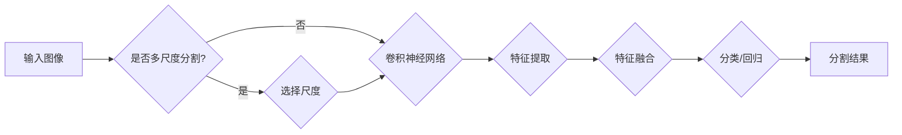

# 基于深度学习的图像分割算法研究

> 关键词：深度学习，图像分割，卷积神经网络，U-Net，Mask R-CNN，语义分割，实例分割，多尺度分割，金字塔网络

## 1. 背景介绍

图像分割是计算机视觉领域的一个重要分支，旨在将图像划分为若干个互不相交的区域，每个区域对应图像中的一个对象或者背景。图像分割在医学图像分析、自动驾驶、遥感图像处理等领域有着广泛的应用。随着深度学习技术的快速发展，基于深度学习的图像分割算法逐渐成为研究的热点，并在精度和效率上取得了显著的突破。

## 2. 核心概念与联系

### 2.1 核心概念

- **图像分割**：将图像划分为若干个互不相交的区域，每个区域代表图像中的一个对象或背景。
- **深度学习**：一种基于神经网络的学习方法，通过模拟人脑神经网络结构和功能来实现特征提取和模式识别。
- **卷积神经网络（CNN）**：一种特殊的神经网络，特别适用于图像和视频等数据类型的处理。
- **语义分割**：将图像中的每个像素点都分类为不同的语义类别，如前景和背景。
- **实例分割**：不仅将图像分割为不同的语义区域，还将同一实例内的像素点进行分割，区分不同实例。
- **多尺度分割**：在不同的尺度上对图像进行分割，以获得更丰富的特征信息。

### 2.2 核心概念原理和架构的 Mermaid 流程图



## 3. 核心算法原理 & 具体操作步骤

### 3.1 算法原理概述

基于深度学习的图像分割算法主要分为以下几类：

- **基于全卷积网络（FCN）的分割算法**：将全连接层替换为卷积层，实现对图像的全局和局部特征提取。
- **基于U-Net的分割算法**：引入了跳跃连接，将编码器和解码器连接起来，在解码器中利用编码器提取的特征进行解码，从而提高分割精度。
- **基于Mask R-CNN的分割算法**：在R-CNN的基础上，引入了Region Proposal Network（RPN）和分割网络，实现了实例分割。

### 3.2 算法步骤详解

1. **数据预处理**：对图像进行缩放、裁剪、旋转等操作，以提高模型的泛化能力。
2. **特征提取**：使用卷积神经网络提取图像特征。
3. **特征融合**：将不同尺度的特征进行融合，以获得更丰富的特征信息。
4. **分类/回归**：使用全连接层对特征进行分类或回归，得到分割结果。

### 3.3 算法优缺点

#### 基于FCN的分割算法

**优点**：

- 结构简单，易于实现。
- 能够学习到丰富的特征。

**缺点**：

- 分割精度较低。
- 难以处理复杂场景。

#### 基于U-Net的分割算法

**优点**：

- 分割精度较高。
- 能够处理复杂场景。

**缺点**：

- 训练时间较长。
- 对参数敏感。

#### 基于Mask R-CNN的分割算法

**优点**：

- 能够实现实例分割。
- 分割精度高。

**缺点**：

- 训练数据量大。
- 计算复杂度高。

### 3.4 算法应用领域

基于深度学习的图像分割算法在以下领域有着广泛的应用：

- **医学图像分析**：如肿瘤检测、病变识别、器官分割等。
- **自动驾驶**：如车辆检测、行人检测、车道线识别等。
- **遥感图像处理**：如目标检测、地物分类、灾害检测等。

## 4. 数学模型和公式 & 详细讲解 & 举例说明

### 4.1 数学模型构建

基于深度学习的图像分割算法通常采用以下数学模型：

$$
\hat{y} = f(x; \theta)
$$

其中，$\hat{y}$ 为模型预测的分割结果，$x$ 为输入图像，$\theta$ 为模型参数。

### 4.2 公式推导过程

以下以U-Net为例，介绍图像分割算法的公式推导过程。

**U-Net结构**：

U-Net结构由编码器和解码器组成，编码器负责提取特征，解码器负责解码特征并进行分割。

**编码器**：

编码器采用卷积神经网络，卷积层和池化层交替出现，卷积层用于提取特征，池化层用于降采样。

**解码器**：

解码器采用转置卷积层，将编码器提取的特征进行上采样，并与编码器对应层的特征进行拼接。

**损失函数**：

U-Net的损失函数通常采用交叉熵损失函数：

$$
L = -\frac{1}{N}\sum_{i=1}^N \sum_{j=1}^M y_j \log(\hat{y}_j)
$$

其中，$N$ 为数据集中的样本数量，$M$ 为每个样本的像素数量，$y_j$ 为真实标签，$\hat{y}_j$ 为模型预测的分割结果。

### 4.3 案例分析与讲解

以下以肿瘤检测为例，介绍基于U-Net的图像分割算法在实际应用中的案例分析。

**数据集**：

使用公开的肿瘤检测数据集，包含正常组织和肿瘤组织图像。

**模型**：

采用U-Net模型进行分割。

**训练过程**：

- 将图像进行预处理，如缩放、裁剪、旋转等。
- 使用交叉熵损失函数进行训练。
- 调整学习率、批大小等参数。

**结果**：

模型在测试集上取得了较高的分割精度，能够有效地检测出肿瘤组织。

## 5. 项目实践：代码实例和详细解释说明

### 5.1 开发环境搭建

1. 安装Python 3.x。
2. 安装PyTorch深度学习框架。
3. 安装必要的库，如NumPy、PIL等。

### 5.2 源代码详细实现

以下以U-Net模型为例，给出基于PyTorch的图像分割代码实现：

```python
import torch
import torch.nn as nn
import torch.optim as optim

# U-Net模型
class UNet(nn.Module):
    def __init__(self):
        super(UNet, self).__init__()
        # 编码器
        self.encoder = nn.Sequential(
            nn.Conv2d(3, 64, kernel_size=3, padding=1),
            nn.ReLU(),
            nn.Conv2d(64, 64, kernel_size=3, padding=1),
            nn.ReLU(),
            nn.MaxPool2d(kernel_size=2, stride=2),
            # ...
        )
        # 解码器
        self.decoder = nn.Sequential(
            nn.ConvTranspose2d(128, 64, kernel_size=2, stride=2),
            nn.ReLU(),
            nn.Conv2d(64, 64, kernel_size=3, padding=1),
            nn.ReLU(),
            # ...
        )
        # 输出层
        self.output = nn.Conv2d(64, 1, kernel_size=1)

    def forward(self, x):
        # 编码器
        features = self.encoder(x)
        # 解码器
        decoded_features = self.decoder(features)
        # 输出层
        output = self.output(decoded_features)
        return output

# 训练
model = UNet()
criterion = nn.BCEWithLogitsLoss()
optimizer = optim.Adam(model.parameters(), lr=1e-4)

for epoch in range(10):
    for data, target in dataloader:
        optimizer.zero_grad()
        output = model(data)
        loss = criterion(output, target)
        loss.backward()
        optimizer.step()
```

### 5.3 代码解读与分析

以上代码实现了U-Net模型，包括编码器、解码器和输出层。训练过程使用交叉熵损失函数，并采用Adam优化器进行优化。

### 5.4 运行结果展示

运行上述代码，可以在训练集和测试集上评估模型的分割精度，并可视化分割结果。

## 6. 实际应用场景

### 6.1 医学图像分析

基于深度学习的图像分割技术在医学图像分析中有着广泛的应用，如：

- **肿瘤检测**：通过分割医学图像中的肿瘤区域，帮助医生进行诊断和手术规划。
- **病变识别**：通过分割医学图像中的病变区域，帮助医生进行早期诊断和治疗。
- **器官分割**：通过分割医学图像中的器官区域，帮助医生进行器官功能的评估和监测。

### 6.2 自动驾驶

基于深度学习的图像分割技术在自动驾驶中有着广泛的应用，如：

- **车辆检测**：通过检测图像中的车辆，帮助自动驾驶系统进行路径规划和避障。
- **行人检测**：通过检测图像中的行人，帮助自动驾驶系统进行行人保护。
- **车道线识别**：通过识别图像中的车道线，帮助自动驾驶系统进行路径规划。

### 6.3 遥感图像处理

基于深度学习的图像分割技术在遥感图像处理中有着广泛的应用，如：

- **目标检测**：通过检测遥感图像中的目标，帮助进行目标识别和跟踪。
- **地物分类**：通过对遥感图像进行分类，帮助进行土地利用变化监测和资源调查。
- **灾害检测**：通过对遥感图像进行分析，帮助进行灾害监测和评估。

## 7. 工具和资源推荐

### 7.1 学习资源推荐

- 《深度学习》（Goodfellow, Bengio, Courville著）
- 《深度学习卷积神经网络》（Ian Goodfellow著）
- 《计算机视觉：算法与应用》（Richard Szeliski著）

### 7.2 开发工具推荐

- PyTorch深度学习框架
- TensorFlow深度学习框架
- Keras深度学习库

### 7.3 相关论文推荐

- "U-Net: Convolutional Networks for Biomedical Image Segmentation" (Ronneberger et al., 2015)
- "Mask R-CNN" (He et al., 2017)
- "DeepLab: Semantic Segmentation with Deep Convolutional Nets, Atrous Convolution, and Fully Connected CRFs" (Chen et al., 2018)

## 8. 总结：未来发展趋势与挑战

### 8.1 研究成果总结

基于深度学习的图像分割算法在近年来取得了显著的进展，在精度和效率上都有了很大的提升。U-Net、Mask R-CNN等算法在多个数据集上取得了SOTA性能。

### 8.2 未来发展趋势

- **多尺度分割**：在多个尺度上进行分割，以获得更丰富的特征信息。
- **实例分割**：不仅将图像分割为不同的语义区域，还将同一实例内的像素点进行分割。
- **交互式分割**：用户与模型进行交互，指导模型进行分割。
- **轻量化模型**：设计轻量化模型，降低计算复杂度，提高推理速度。

### 8.3 面临的挑战

- **数据标注**：数据标注成本高，数据量有限。
- **计算复杂度**：模型计算复杂度高，推理速度慢。
- **可解释性**：模型可解释性不足，难以理解模型的决策过程。

### 8.4 研究展望

基于深度学习的图像分割算法在未来的发展中，需要解决以上挑战，并朝着更加智能化、高效化、可解释化的方向发展。

## 9. 附录：常见问题与解答

**Q1：图像分割算法有哪些类型？**

A：图像分割算法主要分为基于传统方法和基于深度学习的方法。基于传统方法包括基于区域的方法、基于边缘的方法和基于图的方法。基于深度学习的方法包括基于卷积神经网络的方法。

**Q2：U-Net和Mask R-CNN有什么区别？**

A：U-Net是一种用于医学图像分割的卷积神经网络，具有编码器和解码器结构。Mask R-CNN是一种用于实例分割的卷积神经网络，在R-CNN的基础上增加了区域提议网络（RPN）和分割网络。

**Q3：如何提高图像分割算法的精度？**

A：提高图像分割算法的精度可以从以下几个方面入手：
- 使用更强大的模型。
- 使用更多的训练数据。
- 对训练数据进行增强。
- 对模型进行优化。

**Q4：如何提高图像分割算法的推理速度？**

A：提高图像分割算法的推理速度可以从以下几个方面入手：
- 使用轻量化模型。
- 使用GPU加速。
- 使用模型压缩技术。

**Q5：如何解决图像分割算法的可解释性问题？**

A：解决图像分割算法的可解释性问题可以从以下几个方面入手：
- 使用可解释性模型。
- 解释模型的决策过程。
- 对模型进行可视化分析。

作者：禅与计算机程序设计艺术 / Zen and the Art of Computer Programming