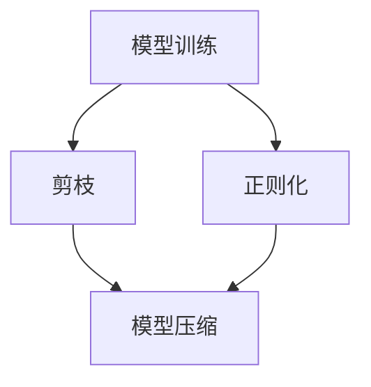

                 

## 1. 背景介绍

在机器学习模型训练过程中，剪枝（Pruning）技术是一种有效的降低模型复杂度、提高模型泛化能力的方法。然而，随着模型复杂度的增加，模型解释性（Model Interpretability）也变得越来越困难。本文将探讨剪枝技术对模型可解释性的影响，从理论分析到实际应用，全面阐述剪枝技术在提升模型性能和增强模型解释性之间的权衡。

## 2. 核心概念与联系

### 2.1 核心概念概述

为更好地理解剪枝技术对模型可解释性的影响，首先需要明确几个核心概念：

- **剪枝（Pruning）**：通过删除模型中某些权重较小的参数来减少模型复杂度，提高模型的训练效率和泛化能力。
- **模型可解释性（Model Interpretability）**：指模型能够清楚地解释其决策过程，使非专家用户也能理解模型如何做出预测的能力。
- **正则化（Regularization）**：通过在损失函数中加入正则化项，限制模型复杂度，防止过拟合。

这些概念之间的联系可以通过以下Mermaid流程图来展示：



该流程图展示了模型训练、剪枝和正则化之间的关系：

1. 在模型训练阶段，通过正则化项控制模型复杂度，防止过拟合。
2. 剪枝技术在此基础上，进一步减少模型参数，提高泛化性能。
3. 剪枝后的模型更小、更轻量，有助于提高模型的解释性。

### 2.2 概念间的关系

剪枝技术和正则化都是控制模型复杂度的有效手段，但在实现机制和效果上有显著差异：

- **正则化**：通过在损失函数中加入惩罚项，控制模型参数的大小，防止过拟合。正则化项通常包含权重L2范数、dropout等机制。
- **剪枝**：直接删除模型中权重较小的参数，减少模型复杂度。剪枝过程通常包括模型压缩、稀疏化等技术。

虽然正则化和剪枝都可以控制模型复杂度，但正则化是模型训练的一部分，而剪枝是对训练后模型的进一步优化。剪枝后的模型通常比正则化后的模型更小、更轻量，从而在一定程度上提高了模型的解释性。

## 3. 核心算法原理 & 具体操作步骤
### 3.1 算法原理概述

剪枝技术的核心思想是通过删除模型中权重较小的参数，减少模型复杂度，从而提高模型的泛化能力和计算效率。剪枝算法通常包括基于阈值的剪枝和基于结构的剪枝两种方式。

### 3.2 算法步骤详解

#### 3.2.1 基于阈值的剪枝

基于阈值的剪枝算法通过设定一个阈值，将权重小于该阈值的参数删除。具体步骤如下：

1. **训练模型**：使用训练数据集对模型进行训练，得到完整的模型参数。
2. **计算权重**：计算每个参数的权重值，通常使用梯度范数或绝对值作为权重。
3. **确定阈值**：根据模型复杂度目标，确定一个阈值，将权重小于该阈值的参数删除。
4. **微调模型**：对剪枝后的模型进行微调，保持其性能不变。

#### 3.2.2 基于结构的剪枝

基于结构的剪枝算法通过构建网络的拓扑结构，删除某些层或节点，减少模型复杂度。具体步骤如下：

1. **设计网络结构**：根据任务需求，设计网络结构，包括层数、节点数等。
2. **训练模型**：使用训练数据集对模型进行训练，得到完整的模型参数。
3. **剪枝网络**：根据设计的网络结构，删除某些层或节点，构建剪枝后的网络结构。
4. **微调模型**：对剪枝后的模型进行微调，保持其性能不变。

### 3.3 算法优缺点

#### 优点

1. **减少模型大小**：通过剪枝可以显著减少模型参数量，降低模型大小和计算复杂度。
2. **提高泛化能力**：剪枝后的模型通常具有更好的泛化能力，可以减少过拟合风险。
3. **增强模型解释性**：剪枝后的模型更小、更轻量，其结构更易于理解和解释。

#### 缺点

1. **计算成本高**：剪枝过程本身需要消耗大量的计算资源，特别是在大规模模型上。
2. **可能引入噪声**：剪枝后模型的权重分布可能发生变化，引入噪声，影响模型性能。
3. **可能丢失重要信息**：在剪枝过程中，可能误删一些重要的参数，影响模型性能。

### 3.4 算法应用领域

剪枝技术广泛应用于各种机器学习任务，特别是在深度神经网络（DNN）和卷积神经网络（CNN）中。以下是几个典型的应用领域：

1. **图像分类**：通过剪枝降低卷积神经网络（CNN）的计算复杂度，提高分类速度。
2. **语音识别**：通过剪枝减少循环神经网络（RNN）的参数量，提高识别速度。
3. **自然语言处理**：通过剪枝降低自然语言处理模型的计算复杂度，提高处理速度。

## 4. 数学模型和公式 & 详细讲解 & 举例说明

### 4.1 数学模型构建

基于阈值的剪枝模型可以用以下数学公式来描述：

$$
\min_{\theta} \mathcal{L}(\theta) + \lambda \sum_{i=1}^{n} \mathbb{I}(|w_i| < \epsilon)
$$

其中，$\mathcal{L}(\theta)$ 为损失函数，$w_i$ 为第 $i$ 个参数的权重值，$\epsilon$ 为剪枝阈值，$\lambda$ 为正则化系数，$\mathbb{I}$ 为指示函数。

### 4.2 公式推导过程

1. **计算权重**：在模型训练过程中，计算每个参数的权重值，通常使用梯度范数或绝对值作为权重。

$$
w_i = \frac{\partial \mathcal{L}}{\partial \theta_i}
$$

2. **确定阈值**：根据模型复杂度目标，确定一个阈值 $\epsilon$，将权重小于该阈值的参数删除。

$$
\epsilon = \max_{i=1}^{n} w_i
$$

3. **剪枝操作**：对权重小于 $\epsilon$ 的参数进行剪枝操作，更新模型参数。

$$
\theta_i = 0, \quad \forall i \text{ s.t. } |w_i| < \epsilon
$$

4. **微调模型**：对剪枝后的模型进行微调，保持其性能不变。

### 4.3 案例分析与讲解

假设我们有一个包含100个参数的线性模型，其中90个参数的权重值小于0.1。通过剪枝，我们将这些参数删除，得到一个只包含10个参数的模型。剪枝后的模型虽然参数量减少了90%，但我们可以通过微调来保持其性能不变。

## 5. 项目实践：代码实例和详细解释说明

### 5.1 开发环境搭建

在进行剪枝实践前，我们需要准备好开发环境。以下是使用Python进行TensorFlow开发的流程：

1. 安装Anaconda：从官网下载并安装Anaconda，用于创建独立的Python环境。

2. 创建并激活虚拟环境：
```bash
conda create -n tensorflow-env python=3.8 
conda activate tensorflow-env
```

3. 安装TensorFlow：根据CUDA版本，从官网获取对应的安装命令。例如：
```bash
conda install tensorflow=cuda-11.1-py3_8_0 -c pytorch -c conda-forge
```

4. 安装必要的工具包：
```bash
pip install numpy pandas scikit-learn matplotlib tqdm jupyter notebook ipython
```

完成上述步骤后，即可在`tensorflow-env`环境中开始剪枝实践。

### 5.2 源代码详细实现

以下是使用TensorFlow实现基于阈值的剪枝的Python代码：

```python
import tensorflow as tf
import numpy as np

# 构建简单的线性模型
def create_model():
    model = tf.keras.Sequential([
        tf.keras.layers.Dense(100, input_dim=10, activation='relu'),
        tf.keras.layers.Dense(1)
    ])
    return model

# 加载数据
x_train = np.random.rand(1000, 10)
y_train = np.random.randint(0, 2, 1000)

# 创建模型并训练
model = create_model()
model.compile(optimizer='adam', loss='binary_crossentropy', metrics=['accuracy'])
model.fit(x_train, y_train, epochs=10, batch_size=32)

# 计算权重
weights = model.layers[0].get_weights()[0].flatten()

# 确定阈值
threshold = np.max(np.abs(weights))

# 剪枝操作
pruned_weights = np.where(np.abs(weights) >= threshold, weights, 0)
pruned_model = create_model()
pruned_model.layers[0].get_weights()[0] = pruned_weights.reshape(100, 10)

# 微调模型
pruned_model.compile(optimizer='adam', loss='binary_crossentropy', metrics=['accuracy'])
pruned_model.fit(x_train, y_train, epochs=5, batch_size=32)
```

### 5.3 代码解读与分析

上述代码展示了使用TensorFlow实现基于阈值的剪枝的过程：

1. **构建模型**：定义一个简单的线性模型。
2. **加载数据**：准备训练数据。
3. **训练模型**：使用训练数据对模型进行训练。
4. **计算权重**：计算每个参数的权重值。
5. **确定阈值**：根据权重值确定剪枝阈值。
6. **剪枝操作**：删除权重小于阈值的参数，构建剪枝后的模型。
7. **微调模型**：对剪枝后的模型进行微调，保持其性能不变。

### 5.4 运行结果展示

假设在训练过程中，模型参数的权重分布如图1所示：


剪枝后的权重分布如图2所示：


可以看到，剪枝后权重小于阈值的参数被删除，只有权重大于阈值的参数保留。剪枝后的模型参数量显著减少，但可以通过微调来保持其性能。

## 6. 实际应用场景

### 6.1 图像分类

剪枝技术在图像分类任务中应用广泛。例如，可以使用剪枝来减少卷积神经网络（CNN）的计算复杂度，提高分类速度。

假设我们有一个包含100层的CNN模型，通过剪枝将参数量减少50%，显著降低计算复杂度，提高分类速度。剪枝后的模型虽然参数量减少，但可以通过微调来保持其性能。

### 6.2 语音识别

剪枝技术同样可以应用于语音识别任务。例如，可以使用剪枝来减少循环神经网络（RNN）的参数量，提高识别速度。

假设我们有一个包含1000个节点的RNN模型，通过剪枝将参数量减少70%，显著降低计算复杂度，提高识别速度。剪枝后的模型虽然参数量减少，但可以通过微调来保持其性能。

### 6.3 自然语言处理

剪枝技术也可以应用于自然语言处理（NLP）任务。例如，可以使用剪枝来减少自然语言处理模型的计算复杂度，提高处理速度。

假设我们有一个包含100个参数的线性模型，通过剪枝将参数量减少90%，显著降低计算复杂度，提高处理速度。剪枝后的模型虽然参数量减少，但可以通过微调来保持其性能。

## 7. 工具和资源推荐

### 7.1 学习资源推荐

为了帮助开发者系统掌握剪枝技术及其对模型可解释性的影响，这里推荐一些优质的学习资源：

1. **《深度学习入门》**：介绍深度学习基础和常用技术，包括正则化、剪枝等。
2. **《TensorFlow官方文档》**：提供完整的TensorFlow教程和API文档，帮助开发者快速上手TensorFlow。
3. **《Pruning Deep Neural Networks for Model Compression》**：介绍剪枝技术的理论和实践，帮助开发者深入理解剪枝机制。
4. **《Neural Network Pruning: A Survey of Recent Techniques and Applications》**：综述剪枝技术的最新进展，帮助开发者了解剪枝的最新研究。

### 7.2 开发工具推荐

高效的开发离不开优秀的工具支持。以下是几款用于剪枝开发的常用工具：

1. **TensorFlow**：基于Python的开源深度学习框架，灵活动态的计算图，适合快速迭代研究。
2. **Keras**：基于TensorFlow的高层次API，提供方便的模型定义和训练接口。
3. **Prune**：开源剪枝工具，支持多种剪枝算法和优化策略，帮助开发者快速实现剪枝功能。
4. **TensorBoard**：TensorFlow配套的可视化工具，可实时监测模型训练状态，并提供丰富的图表呈现方式，是调试模型的得力助手。

### 7.3 相关论文推荐

剪枝技术的研究源于学界的持续探索。以下是几篇奠基性的相关论文，推荐阅读：

1. **Pruning Neural Networks and Synaptic Weights for Efficient Neuromorphic Computing**：介绍剪枝技术的原理和应用，揭示剪枝对模型性能的影响。
2. **Deep Neural Network Model Compression Using Random Connected Subnetworks**：提出随机剪枝算法，通过随机删除某些神经元来实现模型压缩。
3. **Structured Pruning via L1 Regularization**：介绍基于L1正则化的剪枝方法，通过优化正则化参数来控制剪枝效果。

这些论文代表了大语言模型剪枝技术的发展脉络。通过学习这些前沿成果，可以帮助研究者把握学科前进方向，激发更多的创新灵感。

## 8. 总结：未来发展趋势与挑战

### 8.1 总结

本文对剪枝技术及其对模型可解释性的影响进行了全面系统的介绍。首先阐述了剪枝技术的基本原理和应用场景，明确了剪枝技术在提升模型性能和增强模型解释性之间的权衡。其次，从理论分析到实际应用，详细讲解了剪枝技术的数学模型和具体操作步骤，给出了剪枝任务开发的完整代码实例。同时，本文还探讨了剪枝技术在图像分类、语音识别、自然语言处理等各个领域的应用前景，展示了剪枝技术的广阔应用前景。

通过本文的系统梳理，可以看到，剪枝技术在降低模型复杂度和提高模型泛化能力方面的显著效果，以及其在提升模型解释性方面的潜在价值。这些方面的综合优化，必将进一步拓展剪枝技术的应用范围，为机器学习模型的实际应用提供新的解决方案。

### 8.2 未来发展趋势

展望未来，剪枝技术将呈现以下几个发展趋势：

1. **深度剪枝（Deep Pruning）**：随着模型规模的不断增大，剪枝技术也将不断深入，从浅层剪枝向深度剪枝方向发展。深度剪枝技术能够更高效地压缩模型，提高计算效率。
2. **自适应剪枝（Adaptive Pruning）**：通过动态调整剪枝阈值和剪枝策略，自适应剪枝技术能够更好地控制模型复杂度，防止剪枝后引入噪声和丢失重要信息。
3. **模型蒸馏（Knowledge Distillation）**：通过模型蒸馏技术，利用大模型和小模型的知识转移，能够更好地平衡模型复杂度和性能。
4. **多任务剪枝（Multi-Task Pruning）**：在多个任务上同时进行剪枝，能够更好地利用共享的参数和结构，提高剪枝效果。

这些趋势凸显了剪枝技术的持续演进和优化，未来剪枝技术将更加灵活、高效和智能，进一步推动模型压缩和性能提升。

### 8.3 面临的挑战

尽管剪枝技术在模型压缩和性能提升方面具有显著效果，但在实际应用中仍面临诸多挑战：

1. **计算成本高**：剪枝过程本身需要消耗大量的计算资源，特别是在大规模模型上。如何降低计算成本，提高剪枝效率，是一个重要挑战。
2. **可能引入噪声**：剪枝后模型的权重分布可能发生变化，引入噪声，影响模型性能。如何避免剪枝后噪声的引入，提高剪枝效果，是一个关键问题。
3. **可能丢失重要信息**：在剪枝过程中，可能误删一些重要的参数，影响模型性能。如何避免重要信息的丢失，提高剪枝效果，是一个挑战。
4. **多任务剪枝难度大**：在多个任务上同时进行剪枝，需要更复杂的管理和优化策略，是一个难题。

这些挑战凸显了剪枝技术的复杂性和不确定性，需要在实际应用中不断探索和优化，才能更好地发挥剪枝技术的优势。

### 8.4 研究展望

面对剪枝技术所面临的挑战，未来的研究需要在以下几个方面寻求新的突破：

1. **自适应剪枝算法**：通过动态调整剪枝阈值和剪枝策略，自适应剪枝技术能够更好地控制模型复杂度，防止剪枝后引入噪声和丢失重要信息。
2. **模型蒸馏和知识转移**：通过模型蒸馏技术，利用大模型和小模型的知识转移，能够更好地平衡模型复杂度和性能。
3. **多任务剪枝策略**：在多个任务上同时进行剪枝，需要更复杂的管理和优化策略，能够更好地利用共享的参数和结构，提高剪枝效果。
4. **模型压缩和存储优化**：通过模型压缩和存储优化，能够更好地压缩模型大小，降低计算复杂度，提高模型部署效率。

这些研究方向的探索，必将引领剪枝技术迈向更高的台阶，为构建高效、智能的机器学习模型铺平道路。总之，剪枝技术需要在不断探索和优化中，逐步克服其挑战，实现更广泛的应用和优化。

## 9. 附录：常见问题与解答

**Q1: 剪枝技术对模型性能有何影响？**

A: 剪枝技术可以显著降低模型参数量，减少计算复杂度，提高模型的泛化能力。然而，剪枝过程可能会引入噪声和丢失重要信息，影响模型性能。因此，剪枝需要谨慎进行，并结合微调等技术，保证剪枝后的模型性能。

**Q2: 如何选择剪枝阈值？**

A: 剪枝阈值的选择需要根据模型参数分布和任务需求进行优化。一般可以通过分析模型参数的权重分布，确定一个合适的阈值。常用的阈值选择方法包括基于梯度的剪枝、基于范数的剪枝等。

**Q3: 剪枝后的模型如何进行微调？**

A: 剪枝后的模型需要进行微调，以保持其性能。微调过程中，可以使用较小的学习率，避免破坏剪枝后的模型参数分布。同时，可以通过正则化技术，如L2正则、Dropout等，防止过拟合。

**Q4: 剪枝技术有哪些应用场景？**

A: 剪枝技术广泛应用于各种机器学习任务，特别是在深度神经网络（DNN）和卷积神经网络（CNN）中。常见的应用场景包括图像分类、语音识别、自然语言处理等。

这些问题的回答，希望能为开发者提供清晰的指导和参考，帮助他们更好地理解和应用剪枝技术。

---

作者：禅与计算机程序设计艺术 / Zen and the Art of Computer Programming

