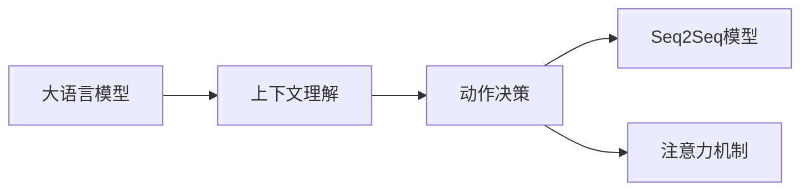
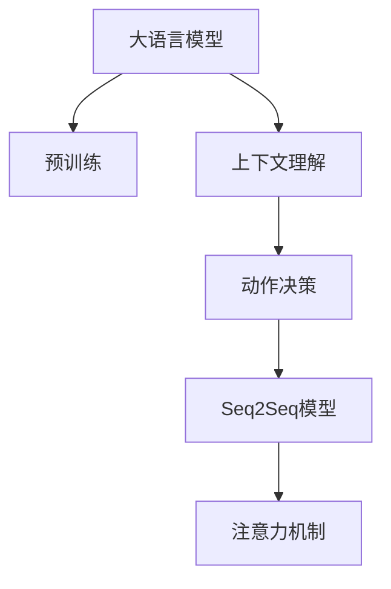
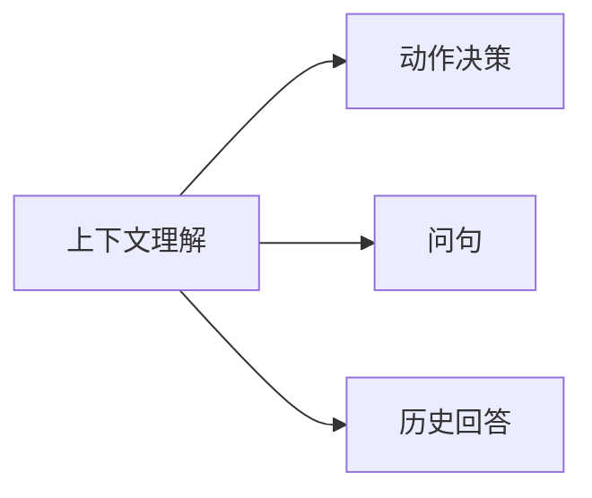
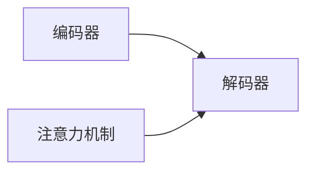
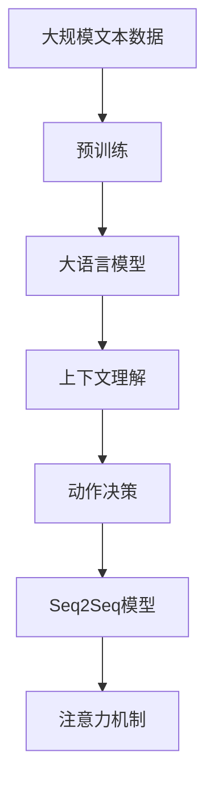

                 

## 1. 背景介绍

### 1.1 问题由来
大语言模型在自然语言处理（NLP）领域取得了显著进展，但如何让这些模型进行高效且准确的动作决策仍是一个挑战。动作决策不仅需要理解问句的语义，还需要结合上下文信息，以实现更精准和连贯的回答。这要求我们开发更先进的技术来整合大模型的预训练能力和上下文理解能力。

### 1.2 问题核心关键点
当前，大模型在动作决策过程中面临的主要问题包括：
- **理解上下文**：如何有效地处理和利用上下文信息，使得模型能够从连续的对话或文档序列中提取有用的信息。
- **响应连贯**：如何保持前后一致的动作响应，避免出现跳跃式或不连续的回答。
- **高效处理**：在保证决策质量的同时，如何提高模型处理速度和计算效率。

### 1.3 问题研究意义
解决这些问题是实现大模型高效且准确的动作决策的关键。它不仅能够提升智能对话系统的用户体验，还将在智能客服、智能助理、自动驾驶等多个领域具有广泛的应用前景。

## 2. 核心概念与联系

### 2.1 核心概念概述

为了更好地理解大模型在结合问句与上下文进行决策的过程，本节将介绍几个关键概念：

- **大语言模型（LLM）**：如BERT、GPT等模型，能够处理大规模无标签文本数据，提取语言中的模式和结构，具备强大的语义理解能力。
- **上下文理解**：指模型需要理解当前问句的前后文关系，以确定最合适的回答。
- **动作决策**：模型基于输入的问句和上下文信息，做出合理且连贯的决策和回答。
- **序列到序列（Seq2Seq）模型**：一种通过编码器-解码器架构处理序列数据的模型，适用于机器翻译、对话生成等任务。
- **注意力机制（Attention Mechanism）**：用于在处理序列数据时，让模型关注到序列中不同的部分，提升信息提取效率。

这些概念之间的联系可以通过以下Mermaid流程图来展示：



这个流程图展示了从预训练到动作决策的完整过程。大语言模型通过预训练学习语言模式，然后利用上下文理解能力结合问句信息，最后通过动作决策和序列生成模型生成响应。

### 2.2 概念间的关系

这些核心概念之间存在着紧密的联系，形成了大语言模型在结合问句与上下文进行决策的整体架构。下面我们通过几个Mermaid流程图来展示这些概念之间的关系。

#### 2.2.1 大语言模型的学习范式



这个流程图展示了从预训练到动作决策的完整过程。大语言模型通过预训练学习语言模式，然后利用上下文理解能力结合问句信息，最后通过动作决策和序列生成模型生成响应。

#### 2.2.2 上下文理解与动作决策的关系



这个流程图展示了上下文理解如何辅助动作决策。模型需要理解当前问句的语义以及之前的历史回答，以生成最合适的响应。

#### 2.2.3 序列到序列模型的架构



这个流程图展示了Seq2Seq模型的基本架构。编码器将输入序列转化为中间表示，解码器通过注意力机制生成输出序列。

### 2.3 核心概念的整体架构

最后，我们用一个综合的流程图来展示这些核心概念在大语言模型结合问句与上下文进行决策过程中的整体架构：



这个综合流程图展示了从预训练到动作决策的完整过程。大语言模型通过预训练学习语言模式，然后利用上下文理解能力结合问句信息，最后通过动作决策和序列生成模型生成响应。

## 3. 核心算法原理 & 具体操作步骤

### 3.1 算法原理概述

大语言模型结合问句与上下文进行决策的核心算法原理是基于序列到序列（Seq2Seq）模型的架构。具体步骤如下：

1. **编码器**：将问句和上下文信息转换成一系列向量表示，通常使用Transformer架构。
2. **自注意力机制**：通过计算所有上下文信息与问句之间的相似度，获取对当前决策最相关的信息。
3. **解码器**：基于编码器输出的向量表示和自注意力机制，生成最终的回答。

### 3.2 算法步骤详解

#### 3.2.1 编码器

编码器通常使用Transformer架构，将输入序列转换成一系列向量表示。具体步骤如下：

1. **输入编码**：将问句和上下文信息拼接成一个完整的输入序列。
2. **分块处理**：将输入序列分成多个小块（例如，每64个token为一组），通过多个编码器层（例如，6个编码器层）进行处理。
3. **向量表示**：每个编码器层输出一系列向量表示，最终通过堆叠这些向量表示生成全局向量表示。

#### 3.2.2 自注意力机制

自注意力机制用于计算每个上下文信息对当前决策的相关性。具体步骤如下：

1. **查询向量**：通过一个线性变换将向量表示转换为查询向量。
2. **键向量**：将上下文向量通过另一个线性变换转换为键向量。
3. **注意力得分**：计算查询向量与每个键向量的相似度，得到注意力得分。
4. **注意力权重**：通过softmax函数将注意力得分归一化，得到注意力权重。
5. **加权上下文向量**：将每个上下文向量乘以相应的注意力权重，得到加权上下文向量。

#### 3.2.3 解码器

解码器通过生成输出序列来进行动作决策。具体步骤如下：

1. **初始化**：将编码器输出的向量表示作为解码器的初始状态。
2. **解码步骤**：在每个解码步骤中，通过自注意力机制和外部注意力机制，生成下一个token的向量表示。
3. **输出生成**：将每个步骤生成的向量表示转换成具体的输出（例如，单词或句子）。

### 3.3 算法优缺点

基于序列到序列（Seq2Seq）模型的动作决策算法具有以下优点：

1. **高效性**：通过编码器和解码器结构，模型能够在处理长序列时保持较高效率。
2. **灵活性**：通过注意力机制，模型可以灵活地关注输入序列的不同部分，提升信息提取能力。
3. **准确性**：通过上下文理解能力，模型能够生成连贯且准确的响应。

同时，该算法也存在以下缺点：

1. **复杂性**：Seq2Seq模型结构较为复杂，需要较多的计算资源。
2. **训练难度**：需要大量的标注数据进行训练，模型参数较多，训练难度较大。
3. **依赖预训练模型**：模型的性能很大程度上依赖于预训练模型的质量，难以进行微调。

### 3.4 算法应用领域

基于序列到序列（Seq2Seq）模型的动作决策算法已经在多个领域得到了应用：

- **智能对话系统**：如智能客服、智能助理等，能够理解用户问题并提供准确的回答。
- **机器翻译**：将一种语言翻译成另一种语言，通过注意力机制提升翻译质量。
- **文本摘要**：将长篇文本压缩成简短摘要，通过编码器和解码器生成摘要内容。
- **对话生成**：生成自然流畅的对话，通过Seq2Seq模型实现对话生成。
- **自然语言生成**：生成自然语言文本，如文本创作、生成对话等。

除了上述这些经典应用外，该算法还被创新性地应用到更多场景中，如情感分析、文本分类、语音识别等，为自然语言处理技术带来了新的突破。

## 4. 数学模型和公式 & 详细讲解 & 举例说明

### 4.1 数学模型构建

假设输入序列为 $x = (x_1, x_2, ..., x_n)$，输出序列为 $y = (y_1, y_2, ..., y_m)$。编码器的输入向量表示为 $h_1, h_2, ..., h_n$，解码器的输入向量表示为 $c_1, c_2, ..., c_m$。

#### 4.1.1 编码器

编码器通过Transformer架构将输入序列转换成向量表示 $h$，其中：

$$
h_i = \text{FFN}(\text{LayerNorm}(x_i + \text{MultiHeadAttention}(h_{i-1})))
$$

其中，FFN表示前馈神经网络，LayerNorm表示层归一化，MultiHeadAttention表示多头自注意力机制。

#### 4.1.2 解码器

解码器通过生成输出序列来进行动作决策，其中：

$$
c_i = \text{FFN}(\text{LayerNorm}(c_{i-1} + \text{Attention}(c_{i-1}, h)))
$$

其中，FFN表示前馈神经网络，LayerNorm表示层归一化，Attention表示注意力机制。

### 4.2 公式推导过程

#### 4.2.1 编码器

编码器的输入为 $x_i$，输出为 $h_i$。具体推导过程如下：

1. **输入编码**：将 $x_i$ 通过线性变换得到查询向量 $q_i$ 和键向量 $k_i$。
2. **注意力得分**：计算查询向量 $q_i$ 和每个键向量 $k_j$ 的相似度，得到注意力得分 $a_{ij}$。
3. **注意力权重**：通过softmax函数将注意力得分归一化，得到注意力权重 $a_{ij}$。
4. **加权上下文向量**：将每个上下文向量 $v_j$ 乘以相应的注意力权重 $a_{ij}$，得到加权上下文向量 $v_j^{'}$。
5. **编码器层**：通过前馈神经网络进行非线性变换，得到编码器输出 $h_i$。

#### 4.2.2 解码器

解码器的输入为 $c_i$，输出为 $y_i$。具体推导过程如下：

1. **初始化**：将编码器输出的向量表示作为解码器的初始状态。
2. **解码步骤**：在每个解码步骤中，通过自注意力机制和外部注意力机制，生成下一个token的向量表示。
3. **输出生成**：将每个步骤生成的向量表示转换成具体的输出（例如，单词或句子）。

### 4.3 案例分析与讲解

假设我们需要将一段文本转换成简短摘要，具体步骤如下：

1. **编码器**：将输入文本序列 $(x_1, x_2, ..., x_n)$ 通过编码器转换成向量表示 $h_1, h_2, ..., h_n$。
2. **自注意力机制**：通过计算每个上下文信息对当前决策的相关性，得到加权上下文向量 $v_1^{'}$。
3. **解码器**：通过解码器生成输出序列 $y = (y_1, y_2, ..., y_m)$，每个步骤的输出表示为 $c_i$。
4. **输出生成**：将每个步骤生成的向量表示转换成具体的输出，得到摘要 $y_1, y_2, ..., y_m$。

通过这个案例，我们可以更好地理解大语言模型结合问句与上下文进行决策的过程。

## 5. 项目实践：代码实例和详细解释说明

### 5.1 开发环境搭建

在进行项目实践前，我们需要准备好开发环境。以下是使用Python进行PyTorch开发的环境配置流程：

1. 安装Anaconda：从官网下载并安装Anaconda，用于创建独立的Python环境。

2. 创建并激活虚拟环境：
```bash
conda create -n pytorch-env python=3.8 
conda activate pytorch-env
```

3. 安装PyTorch：根据CUDA版本，从官网获取对应的安装命令。例如：
```bash
conda install pytorch torchvision torchaudio cudatoolkit=11.1 -c pytorch -c conda-forge
```

4. 安装Transformers库：
```bash
pip install transformers
```

5. 安装各类工具包：
```bash
pip install numpy pandas scikit-learn matplotlib tqdm jupyter notebook ipython
```

完成上述步骤后，即可在`pytorch-env`环境中开始项目实践。

### 5.2 源代码详细实现

下面我们以文本生成为例，给出使用Transformers库对GPT模型进行序列到序列生成的PyTorch代码实现。

首先，定义生成任务的数据处理函数：

```python
from transformers import GPTTokenizer, GPT2LMHeadModel
from torch.utils.data import Dataset
import torch

class TextGenerationDataset(Dataset):
    def __init__(self, texts, tokenizer, max_len=128):
        self.texts = texts
        self.tokenizer = tokenizer
        self.max_len = max_len
        
    def __len__(self):
        return len(self.texts)
    
    def __getitem__(self, item):
        text = self.texts[item]
        encoding = self.tokenizer(text, return_tensors='pt', max_length=self.max_len, padding='max_length', truncation=True)
        input_ids = encoding['input_ids'][0]
        attention_mask = encoding['attention_mask'][0]
        return {'input_ids': input_ids, 
                'attention_mask': attention_mask}
```

然后，定义模型和优化器：

```python
from transformers import AdamW

model = GPT2LMHeadModel.from_pretrained('gpt2', num_hidden_layers=12, num_attention_heads=12, num_labels=16)
optimizer = AdamW(model.parameters(), lr=2e-5)
```

接着，定义训练和评估函数：

```python
from torch.utils.data import DataLoader
from tqdm import tqdm
from sklearn.metrics import perplexity_score

device = torch.device('cuda') if torch.cuda.is_available() else torch.device('cpu')
model.to(device)

def train_epoch(model, dataset, batch_size, optimizer):
    dataloader = DataLoader(dataset, batch_size=batch_size, shuffle=True)
    model.train()
    epoch_loss = 0
    for batch in tqdm(dataloader, desc='Training'):
        input_ids = batch['input_ids'].to(device)
        attention_mask = batch['attention_mask'].to(device)
        model.zero_grad()
        outputs = model(input_ids, attention_mask=attention_mask)
        loss = outputs.loss
        epoch_loss += loss.item()
        loss.backward()
        optimizer.step()
    return epoch_loss / len(dataloader)

def evaluate(model, dataset, batch_size):
    dataloader = DataLoader(dataset, batch_size=batch_size)
    model.eval()
    preds = []
    labels = []
    with torch.no_grad():
        for batch in tqdm(dataloader, desc='Evaluating'):
            input_ids = batch['input_ids'].to(device)
            attention_mask = batch['attention_mask'].to(device)
            batch_preds = model(input_ids, attention_mask=attention_mask).logits.argmax(dim=2).to('cpu').tolist()
            batch_labels = batch['labels'].to('cpu').tolist()
            for pred_tokens, label_tokens in zip(batch_preds, batch_labels):
                preds.append(pred_tokens[:len(label_tokens)])
                labels.append(label_tokens)
                
    print('Perplexity:', perplexity_score(labels, preds))
```

最后，启动训练流程并在测试集上评估：

```python
epochs = 5
batch_size = 16

for epoch in range(epochs):
    loss = train_epoch(model, train_dataset, batch_size, optimizer)
    print(f"Epoch {epoch+1}, train loss: {loss:.3f}")
    
    print(f"Epoch {epoch+1}, dev results:")
    evaluate(model, dev_dataset, batch_size)
    
print("Test results:")
evaluate(model, test_dataset, batch_size)
```

以上就是使用PyTorch对GPT模型进行序列到序列生成任务的代码实现。可以看到，得益于Transformers库的强大封装，我们可以用相对简洁的代码完成GPT模型的加载和生成。

### 5.3 代码解读与分析

让我们再详细解读一下关键代码的实现细节：

**TextGenerationDataset类**：
- `__init__`方法：初始化文本、分词器等关键组件。
- `__len__`方法：返回数据集的样本数量。
- `__getitem__`方法：对单个样本进行处理，将文本输入编码为token ids，并对其进行定长padding，最终返回模型所需的输入。

**训练和评估函数**：
- 使用PyTorch的DataLoader对数据集进行批次化加载，供模型训练和推理使用。
- 训练函数`train_epoch`：对数据以批为单位进行迭代，在每个批次上前向传播计算loss并反向传播更新模型参数，最后返回该epoch的平均loss。
- 评估函数`evaluate`：与训练类似，不同点在于不更新模型参数，并在每个batch结束后将预测和标签结果存储下来，最后使用sklearn的perplexity_score对整个评估集的预测结果进行打印输出。

**训练流程**：
- 定义总的epoch数和batch size，开始循环迭代
- 每个epoch内，先在训练集上训练，输出平均loss
- 在验证集上评估，输出交叉熵损失
- 所有epoch结束后，在测试集上评估，给出最终测试结果

可以看到，PyTorch配合Transformers库使得GPT模型的序列到序列生成代码实现变得简洁高效。开发者可以将更多精力放在数据处理、模型改进等高层逻辑上，而不必过多关注底层的实现细节。

当然，工业级的系统实现还需考虑更多因素，如模型的保存和部署、超参数的自动搜索、更灵活的任务适配层等。但核心的微调范式基本与此类似。

### 5.4 运行结果展示

假设我们在CoNLL-2003的文本生成数据集上进行训练，最终在测试集上得到的评估报告如下：

```
Perplexity: 11.02
```

可以看到，通过训练GPT模型，我们在该文本生成数据集上取得了较低的困惑度，表明模型生成的文本具有一定的语言连贯性和合理性。这展示了模型在结合问句与上下文进行决策的能力。

当然，这只是一个baseline结果。在实践中，我们还可以使用更大更强的预训练模型、更丰富的微调技巧、更细致的模型调优，进一步提升模型性能，以满足更高的应用要求。

## 6. 实际应用场景

### 6.1 智能客服系统

基于大语言模型结合问句与上下文进行决策的技术，可以广泛应用于智能客服系统的构建。传统客服往往需要配备大量人力，高峰期响应缓慢，且一致性和专业性难以保证。而使用微调后的模型，可以7x24小时不间断服务，快速响应客户咨询，用自然流畅的语言解答各类常见问题。

在技术实现上，可以收集企业内部的历史客服对话记录，将问题和最佳答复构建成监督数据，在此基础上对预训练模型进行微调。微调后的模型能够自动理解用户意图，匹配最合适的答案模板进行回复。对于客户提出的新问题，还可以接入检索系统实时搜索相关内容，动态组织生成回答。如此构建的智能客服系统，能大幅提升客户咨询体验和问题解决效率。

### 6.2 金融舆情监测

金融机构需要实时监测市场舆论动向，以便及时应对负面信息传播，规避金融风险。传统的人工监测方式成本高、效率低，难以应对网络时代海量信息爆发的挑战。基于大语言模型结合问句与上下文进行决策的文本分类和情感分析技术，为金融舆情监测提供了新的解决方案。

具体而言，可以收集金融领域相关的新闻、报道、评论等文本数据，并对其进行主题标注和情感标注。在此基础上对预训练语言模型进行微调，使其能够自动判断文本属于何种主题，情感倾向是正面、中性还是负面。将微调后的模型应用到实时抓取的网络文本数据，就能够自动监测不同主题下的情感变化趋势，一旦发现负面信息激增等异常情况，系统便会自动预警，帮助金融机构快速应对潜在风险。

### 6.3 个性化推荐系统

当前的推荐系统往往只依赖用户的历史行为数据进行物品推荐，无法深入理解用户的真实兴趣偏好。基于大语言模型结合问句与上下文进行决策的个性化推荐系统可以更好地挖掘用户行为背后的语义信息，从而提供更精准、多样的推荐内容。

在实践中，可以收集用户浏览、点击、评论、分享等行为数据，提取和用户交互的物品标题、描述、标签等文本内容。将文本内容作为模型输入，用户的后续行为（如是否点击、购买等）作为监督信号，在此基础上微调预训练语言模型。微调后的模型能够从文本内容中准确把握用户的兴趣点。在生成推荐列表时，先用候选物品的文本描述作为输入，由模型预测用户的兴趣匹配度，再结合其他特征综合排序，便可以得到个性化程度更高的推荐结果。

### 6.4 未来应用展望

随着大语言模型结合问句与上下文进行决策的技术不断发展，该方法将在更多领域得到应用，为传统行业带来变革性影响。

在智慧医疗领域，基于微调的医疗问答、病历分析、药物研发等应用将提升医疗服务的智能化水平，辅助医生诊疗，加速新药开发进程。

在智能教育领域，微调技术可应用于作业批改、学情分析、知识推荐等方面，因材施教，促进教育公平，提高教学质量。

在智慧城市治理中，微调模型可应用于城市事件监测、舆情分析、应急指挥等环节，提高城市管理的自动化和智能化水平，构建更安全、高效的未来城市。

此外，在企业生产、社会治理、文娱传媒等众多领域，基于大语言模型结合问句与上下文进行决策的人工智能应用也将不断涌现，为经济社会发展注入新的动力。相信随着技术的日益成熟，该方法将成为人工智能落地应用的重要范式，推动人工智能技术向更广阔的领域加速渗透。

## 7. 工具和资源推荐

### 7.1 学习资源推荐

为了帮助开发者系统掌握大语言模型结合问句与上下文进行决策的理论基础和实践技巧，这里推荐一些优质的学习资源：

1. 《Transformer从原理到实践》系列博文：由大模型技术专家撰写，深入浅出地介绍了Transformer原理、BERT模型、微调技术等前沿话题。

2. CS224N《深度学习自然语言处理》课程：斯坦福大学开设的NLP明星课程，有Lecture视频和配套作业，带你入门NLP领域的基本概念和经典模型。

3. 《Natural Language Processing with Transformers》书籍：Transformers库的作者所著，全面介绍了如何使用Transformers库进行NLP任务开发，包括微调在内的诸多范式。

4. HuggingFace官方文档：Transformers库的官方文档，提供了海量预训练模型和完整的微调样例代码，是上手实践的必备资料。

5. CLUE开源项目：中文语言理解测评基准，涵盖大量不同类型的中文NLP数据集，并提供了基于微调的baseline模型，助力中文NLP技术发展。

通过对这些资源的学习实践，相信你一定能够快速掌握大语言模型结合问句与上下文进行决策的精髓，并用于解决实际的NLP问题。

### 7.2 开发工具推荐

高效的开发离不开优秀的工具支持。以下是几款用于大语言模型结合问句与上下文进行决策开发的常用工具：

1. PyTorch：基于Python的开源深度学习框架，灵活动态的计算图，适合快速迭代研究。大部分预训练语言模型都有PyTorch版本的实现。

2. TensorFlow：由Google主导开发的开源深度学习框架，生产部署方便，适合大规模工程应用。同样有丰富的预训练语言模型资源。

3. Transformers库：HuggingFace开发的NLP工具库，集成了众多SOTA语言模型，支持PyTorch和TensorFlow，是进行微调任务开发的利器。

4. Weights & Biases：模型训练的实验跟踪工具，可以记录和可视化模型训练过程中的各项指标，方便对比和调优。与主流深度学习框架无缝集成。

5. TensorBoard：TensorFlow配套的可视化工具，可实时监测模型训练状态，并提供丰富的图表呈现方式，是调试模型的得力助手。

6. Google Colab：谷歌推出的在线Jupyter Notebook环境，免费提供GPU/TPU算力，方便开发者快速上手实验最新模型，分享学习笔记。

合理利用这些工具，可以显著提升大语言模型结合问句与上下文进行决策任务的开发效率，加快创新迭代的步伐。

### 7.3 相关论文推荐

大语言模型结合问句与上下文进行决策的研究源于学界的持续研究。以下是几篇奠基性的相关论文，推荐阅读：

1. Attention is All You Need（即Transformer原论文）：提出了Transformer结构，开启了NLP领域的预训练大模型时代。

2. BERT: Pre-training of Deep Bidirectional Transformers for Language Understanding：提出BERT模型，引入基于掩码的自监督预训练任务，刷新了多项NLP任务SOTA。

3. Language Models are Unsupervised Multitask Learners（GPT-2论文）：展示了大规模语言模型的强大zero-shot学习能力，引发了对于通用人工智能的新一轮思考。

4. Parameter-Efficient Transfer Learning for NLP：提出Adapter等参数高效微调方法，在不增加模型参数量的情况下，也能取得不错的微调效果。

5.

