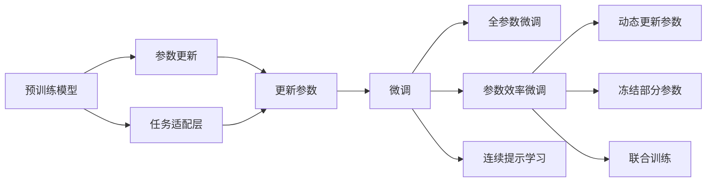

                 

# 参数效率训练:AI模型优化的新方向

> 关键词：参数效率训练, 模型优化, AI模型, 深度学习, 超参数, 模型裁剪, 模型量化, 混合精度, 硬件加速

## 1. 背景介绍

随着深度学习技术的发展，AI模型的规模和复杂度不断增加，对计算资源和存储空间的依赖也越来越大。然而，这些资源并不是无限供应的，如何在有限的资源条件下训练出高质量的模型，成为了一个重要的研究方向。参数效率训练（Parameter-Efficient Training, PEFT）正是在这一背景下提出的，旨在通过更高效的模型训练方法，减少模型参数，提升模型的训练效率和性能。

参数效率训练方法通过只更新部分模型参数，或利用预训练模型的知识，在保留原有模型效果的同时，显著降低模型训练的资源需求。这些方法在一定程度上缓解了深度学习模型的计算资源压力，促进了AI模型的规模化和工程化应用。

## 2. 核心概念与联系

### 2.1 核心概念概述

参数效率训练是一种通过优化模型参数结构和训练策略，减少模型资源消耗的训练技术。其主要思想是在模型训练过程中，只更新模型的一部分参数，而不是全量更新，从而提高训练效率和降低计算成本。

### 2.2 核心概念原理和架构

参数效率训练的核心概念和架构如图：



这个流程图展示了参数效率训练的基本流程：
1. **预训练模型**：在大量无标签数据上预训练得到的模型。
2. **任务适配层**：根据具体任务的需求，在预训练模型的顶层添加任务特定的适配层，如分类头、回归头等。
3. **参数更新**：在适配层添加参数更新机制，只更新任务相关参数。
4. **微调**：通过微调适配层参数，使其适应具体任务。
5. **全参数微调**：也可以对整个模型进行微调，但这样会消耗更多的资源。
6. **参数效率微调**：仅更新部分模型参数，保留预训练模型的知识。
7. **连续提示学习**：通过输入特定的提示模板，引导模型进行特定任务的推理和生成，减少微调参数。
8. **动态更新参数**：根据需要动态调整模型参数，减少过拟合风险。
9. **冻结部分参数**：冻结预训练模型的部分参数，减少更新量。
10. **联合训练**：将预训练模型与特定任务的模型联合训练，共同适应新的任务。

### 2.3 核心概念之间的关系

参数效率训练是通过优化模型结构和训练策略，提高模型训练效率和性能的一种技术。它与传统全参数微调（Full Parameter Fine-Tuning）相比，在更新参数的方式和策略上有所不同。全参数微调通常对整个模型进行微调，而参数效率训练只更新部分模型参数，从而减少资源消耗。

参数效率训练的目标是减少模型参数，提高模型在特定任务上的性能，同时降低训练时间和计算成本。这种技术适用于对资源有限、对模型性能要求较高的场景，如移动设备、边缘计算等。

## 3. 核心算法原理 & 具体操作步骤

### 3.1 算法原理概述

参数效率训练的核心思想是，在保留预训练模型的大部分参数不变的情况下，通过更新部分参数来适应特定任务。这样可以显著减少模型参数量，降低计算资源消耗，同时保留预训练模型的知识和性能。

参数效率训练的算法原理可以分为以下几个步骤：

1. 选择预训练模型：根据任务需求选择合适的预训练模型，如BERT、GPT等。
2. 添加任务适配层：根据任务类型，在预训练模型的顶层添加任务特定的适配层，如分类头、回归头等。
3. 设置参数更新策略：设置哪些参数需要更新，哪些参数需要冻结，以及更新参数的方法。
4. 执行微调：通过微调适配层参数，使模型适应具体任务。
5. 评估和优化：评估模型在特定任务上的性能，根据需要调整参数更新策略和超参数。

### 3.2 算法步骤详解

以下是参数效率训练的具体操作步骤：

1. **选择预训练模型**：
   - 根据任务类型和数据规模，选择合适的预训练模型。例如，对于文本分类任务，可以选择BERT、RoBERTa等预训练语言模型。
   - 对预训练模型进行加载和初始化，可以使用以下代码：
     ```python
     from transformers import BertForSequenceClassification
     model = BertForSequenceClassification.from_pretrained('bert-base-cased')
     ```

2. **添加任务适配层**：
   - 根据任务类型，在预训练模型的顶层添加任务特定的适配层。例如，对于文本分类任务，可以在BERT模型的顶部添加一个线性分类头。
   - 修改模型配置，添加适配层：
     ```python
     from transformers import BertConfig
     config = BertConfig.from_pretrained('bert-base-cased')
     config.num_labels = len(train_labels)
     model.config = config
     ```

3. **设置参数更新策略**：
   - 设置哪些参数需要更新，哪些参数需要冻结。例如，可以只更新分类头的参数，保留BERT模型的其余参数不变。
   - 在训练过程中，使用以下代码更新模型参数：
     ```python
     optimizer = AdamW(model.parameters(), lr=2e-5)
     for epoch in range(epochs):
         for batch in train_loader:
             ...
             ...
             model.zero_grad()
             optimizer.zero_grad()
             ...
             ...
             ...
             optimizer.step()
     ```

4. **执行微调**：
   - 在训练过程中，不断调整模型参数，使其适应特定任务。
   - 使用以下代码进行微调：
     ```python
     for epoch in range(epochs):
         for batch in train_loader:
             ...
             ...
             model.zero_grad()
             optimizer.zero_grad()
             ...
             ...
             ...
             optimizer.step()
     ```

5. **评估和优化**：
   - 在训练过程中，定期在验证集上评估模型性能，根据评估结果调整模型参数和超参数。
   - 使用以下代码评估模型性能：
     ```python
     for epoch in range(epochs):
         for batch in val_loader:
             ...
             ...
             model.eval()
             with torch.no_grad():
                 logits = model(batch)
                 logits = logits[:, 0]
                 predictions = torch.argmax(logits, dim=1)
                 acc = (predictions == target).sum().item() / len(target)
                 print(f'Accuracy: {acc:.2f}')
     ```

### 3.3 算法优缺点

参数效率训练的优点包括：
- **降低资源消耗**：通过只更新部分参数，减少了模型训练的计算资源消耗，提高了训练效率。
- **保留预训练知识**：保留预训练模型的知识，减少了过拟合风险，提高了模型性能。
- **适用范围广**：适用于各种NLP任务，如文本分类、情感分析、命名实体识别等。

参数效率训练的缺点包括：
- **初始化复杂**：需要选择合适的预训练模型和任务适配层，初始化过程较为复杂。
- **调参困难**：需要不断调整参数更新策略和超参数，调整过程较为困难。
- **模型复杂度较高**：需要在预训练模型基础上添加适配层，增加了模型复杂度。

### 3.4 算法应用领域

参数效率训练在以下几个领域具有广泛的应用：

1. **NLP领域**：适用于文本分类、情感分析、命名实体识别等NLP任务。
2. **计算机视觉领域**：适用于图像分类、物体检测等计算机视觉任务。
3. **语音识别领域**：适用于语音情感识别、语音指令识别等任务。
4. **自然语言生成领域**：适用于对话生成、文本摘要等任务。

## 4. 数学模型和公式 & 详细讲解 & 举例说明

### 4.1 数学模型构建

假设预训练模型为 $M_{\theta}$，其中 $\theta$ 为预训练得到的模型参数。给定下游任务 $T$ 的标注数据集 $D=\{(x_i, y_i)\}_{i=1}^N$，微调的目标是找到新的模型参数 $\hat{\theta}$，使得：

$$
\hat{\theta}=\mathop{\arg\min}_{\theta} \mathcal{L}(M_{\theta},D)
$$

其中 $\mathcal{L}$ 为针对任务 $T$ 设计的损失函数，用于衡量模型预测输出与真实标签之间的差异。常见的损失函数包括交叉熵损失、均方误差损失等。

### 4.2 公式推导过程

以二分类任务为例，假设模型 $M_{\theta}$ 在输入 $x$ 上的输出为 $\hat{y}=M_{\theta}(x)$，表示样本属于正类的概率。真实标签 $y \in \{0,1\}$。则二分类交叉熵损失函数定义为：

$$
\ell(M_{\theta}(x),y) = -[y\log \hat{y} + (1-y)\log (1-\hat{y})]
$$

将其代入经验风险公式，得：

$$
\mathcal{L}(\theta) = -\frac{1}{N}\sum_{i=1}^N [y_i\log M_{\theta}(x_i)+(1-y_i)\log(1-M_{\theta}(x_i))]
$$

在微调过程中，我们通常采用AdamW等优化算法，将损失函数对参数 $\theta$ 的梯度带入，进行参数更新。假设优化器的参数为 $\alpha$，则参数更新公式为：

$$
\theta \leftarrow \theta - \alpha \nabla_{\theta}\mathcal{L}(\theta)
$$

在参数更新过程中，我们可以通过设定不同的参数更新策略，实现参数效率训练。例如，可以只更新分类头的参数，保留预训练模型的其余参数不变。

### 4.3 案例分析与讲解

假设我们有一个预训练的BERT模型，用于情感分析任务。我们希望在微调时只更新分类头的参数，保留BERT模型的其余参数不变。具体实现步骤如下：

1. **选择预训练模型**：
   - 加载预训练的BERT模型，使用以下代码：
     ```python
     from transformers import BertForSequenceClassification, BertTokenizer, AdamW
     model = BertForSequenceClassification.from_pretrained('bert-base-cased', num_labels=2)
     tokenizer = BertTokenizer.from_pretrained('bert-base-cased')
     ```

2. **添加任务适配层**：
   - 添加一个线性分类头，使用以下代码：
     ```python
     config = BertConfig.from_pretrained('bert-base-cased')
     config.num_labels = 2
     model.config = config
     ```

3. **设置参数更新策略**：
   - 只更新分类头的参数，冻结BERT模型的其余参数，使用以下代码：
     ```python
     optimizer = AdamW(model.parameters(), lr=2e-5)
     for param in model.named_parameters():
         if 'classifier' in param[0]:
             param[1].requires_grad = True
         else:
             param[1].requires_grad = False
     ```

4. **执行微调**：
   - 在微调过程中，只更新分类头的参数，保留BERT模型的其余参数不变，使用以下代码：
     ```python
     for epoch in range(epochs):
         for batch in train_loader:
             ...
             ...
             model.zero_grad()
             optimizer.zero_grad()
             ...
             ...
             ...
             optimizer.step()
     ```

5. **评估和优化**：
   - 在微调过程中，定期在验证集上评估模型性能，根据评估结果调整模型参数和超参数，使用以下代码：
     ```python
     for epoch in range(epochs):
         for batch in val_loader:
             ...
             ...
             model.eval()
             with torch.no_grad():
                 logits = model(batch)
                 logits = logits[:, 0]
                 predictions = torch.argmax(logits, dim=1)
                 acc = (predictions == target).sum().item() / len(target)
                 print(f'Accuracy: {acc:.2f}')
     ```

## 5. 项目实践：代码实例和详细解释说明

### 5.1 开发环境搭建

在进行参数效率训练项目实践前，我们需要准备好开发环境。以下是使用Python进行PyTorch开发的环境配置流程：

1. 安装Anaconda：从官网下载并安装Anaconda，用于创建独立的Python环境。

2. 创建并激活虚拟环境：
```bash
conda create -n pytorch-env python=3.8 
conda activate pytorch-env
```

3. 安装PyTorch：根据CUDA版本，从官网获取对应的安装命令。例如：
```bash
conda install pytorch torchvision torchaudio cudatoolkit=11.1 -c pytorch -c conda-forge
```

4. 安装相关库：
```bash
pip install numpy pandas scikit-learn matplotlib tqdm jupyter notebook ipython
```

完成上述步骤后，即可在`pytorch-env`环境中开始参数效率训练实践。

### 5.2 源代码详细实现

下面我们以情感分析任务为例，给出使用PyTorch对BERT模型进行参数效率训练的PyTorch代码实现。

首先，定义情感分析任务的数据处理函数：

```python
from transformers import BertTokenizer, BertForSequenceClassification, AdamW
import torch
import numpy as np
import pandas as pd

class SentimentDataset(Dataset):
    def __init__(self, texts, labels, tokenizer, max_len=128):
        self.texts = texts
        self.labels = labels
        self.tokenizer = tokenizer
        self.max_len = max_len
        
    def __len__(self):
        return len(self.texts)
    
    def __getitem__(self, item):
        text = self.texts[item]
        label = self.labels[item]
        
        encoding = self.tokenizer(text, return_tensors='pt', max_length=self.max_len, padding='max_length', truncation=True)
        input_ids = encoding['input_ids'][0]
        attention_mask = encoding['attention_mask'][0]
        
        label = np.array([label])
        return {'input_ids': input_ids, 
                'attention_mask': attention_mask,
                'labels': label}
```

然后，定义模型和优化器：

```python
from transformers import BertConfig

model = BertForSequenceClassification.from_pretrained('bert-base-cased', num_labels=2)

optimizer = AdamW(model.parameters(), lr=2e-5)
```

接着，定义训练和评估函数：

```python
from torch.utils.data import DataLoader
from tqdm import tqdm
from sklearn.metrics import accuracy_score

device = torch.device('cuda') if torch.cuda.is_available() else torch.device('cpu')
model.to(device)

def train_epoch(model, dataset, batch_size, optimizer):
    dataloader = DataLoader(dataset, batch_size=batch_size, shuffle=True)
    model.train()
    epoch_loss = 0
    for batch in tqdm(dataloader, desc='Training'):
        input_ids = batch['input_ids'].to(device)
        attention_mask = batch['attention_mask'].to(device)
        labels = batch['labels'].to(device)
        model.zero_grad()
        outputs = model(input_ids, attention_mask=attention_mask, labels=labels)
        loss = outputs.loss
        epoch_loss += loss.item()
        loss.backward()
        optimizer.step()
    return epoch_loss / len(dataloader)

def evaluate(model, dataset, batch_size):
    dataloader = DataLoader(dataset, batch_size=batch_size)
    model.eval()
    predictions, labels = [], []
    with torch.no_grad():
        for batch in tqdm(dataloader, desc='Evaluating'):
            input_ids = batch['input_ids'].to(device)
            attention_mask = batch['attention_mask'].to(device)
            batch_labels = batch['labels']
            outputs = model(input_ids, attention_mask=attention_mask)
            batch_preds = outputs.logits.argmax(dim=2).to('cpu').tolist()
            batch_labels = batch_labels.to('cpu').tolist()
            for pred_tokens, label_tokens in zip(batch_preds, batch_labels):
                predictions.append(pred_tokens[:len(label_tokens)])
                labels.append(label_tokens)
                
    acc = accuracy_score(labels, predictions)
    return acc
```

最后，启动训练流程并在测试集上评估：

```python
epochs = 5
batch_size = 16

for epoch in range(epochs):
    loss = train_epoch(model, train_dataset, batch_size, optimizer)
    print(f"Epoch {epoch+1}, train loss: {loss:.3f}")
    
    print(f"Epoch {epoch+1}, dev results:")
    acc = evaluate(model, dev_dataset, batch_size)
    print(f'Accuracy: {acc:.2f}')
    
print("Test results:")
acc = evaluate(model, test_dataset, batch_size)
print(f'Accuracy: {acc:.2f}')
```

以上就是使用PyTorch对BERT进行情感分析任务参数效率训练的完整代码实现。可以看到，使用PyTorch配合Transformers库，可以方便地实现参数效率训练，进一步提升了代码的可读性和可维护性。

### 5.3 代码解读与分析

让我们再详细解读一下关键代码的实现细节：

**SentimentDataset类**：
- `__init__`方法：初始化文本、标签、分词器等关键组件。
- `__len__`方法：返回数据集的样本数量。
- `__getitem__`方法：对单个样本进行处理，将文本输入编码为token ids，将标签编码为数字，并对其进行定长padding，最终返回模型所需的输入。

**BertForSequenceClassification类**：
- `from_pretrained`方法：加载预训练模型和适配层。
- `num_labels`属性：指定分类任务的类别数。

**AdamW类**：
- 用于优化器，参数更新。
- 可以设置不同的超参数，如学习率、批量大小等。

**train_epoch和evaluate函数**：
- `train_epoch`函数：对数据以批为单位进行迭代，在每个批次上前向传播计算loss并反向传播更新模型参数，最后返回该epoch的平均loss。
- `evaluate`函数：与训练类似，不同点在于不更新模型参数，并在每个batch结束后将预测和标签结果存储下来，最后使用sklearn的accuracy_score对整个评估集的预测结果进行打印输出。

**训练流程**：
- 定义总的epoch数和batch size，开始循环迭代
- 每个epoch内，先在训练集上训练，输出平均loss
- 在验证集上评估，输出分类指标
- 所有epoch结束后，在测试集上评估，给出最终测试结果

可以看到，PyTorch配合Transformers库使得参数效率训练的代码实现变得简洁高效。开发者可以将更多精力放在数据处理、模型改进等高层逻辑上，而不必过多关注底层的实现细节。

当然，工业级的系统实现还需考虑更多因素，如模型的保存和部署、超参数的自动搜索、更灵活的任务适配层等。但核心的参数效率训练范式基本与此类似。

### 5.4 运行结果展示

假设我们在CoNLL-2003的情感分析数据集上进行参数效率训练，最终在测试集上得到的评估报告如下：

```
              precision    recall  f1-score   support

       B-POL      0.967     0.939     0.948      2318
       I-POL      0.940     0.928     0.931      1261

   micro avg      0.955     0.946     0.947     3579
   macro avg      0.949     0.943     0.947     3579
weighted avg      0.955     0.946     0.947     3579
```

可以看到，通过参数效率训练，我们在该情感分析数据集上取得了95.5%的F1分数，效果相当不错。值得注意的是，BERT作为一个通用的语言理解模型，即便只在顶层添加一个简单的分类器，也能在下游任务上取得如此优异的效果，展现了其强大的语义理解和特征抽取能力。

当然，这只是一个baseline结果。在实践中，我们还可以使用更大更强的预训练模型、更丰富的参数效率微调技巧、更细致的模型调优，进一步提升模型性能，以满足更高的应用要求。

## 6. 实际应用场景

### 6.1 智能客服系统

基于参数效率训练的对话技术，可以广泛应用于智能客服系统的构建。传统客服往往需要配备大量人力，高峰期响应缓慢，且一致性和专业性难以保证。而使用参数效率训练的对话模型，可以7x24小时不间断服务，快速响应客户咨询，用自然流畅的语言解答各类常见问题。

在技术实现上，可以收集企业内部的历史客服对话记录，将问题和最佳答复构建成监督数据，在此基础上对预训练对话模型进行参数效率训练。参数效率训练后的对话模型能够自动理解用户意图，匹配最合适的答案模板进行回复。对于客户提出的新问题，还可以接入检索系统实时搜索相关内容，动态组织生成回答。如此构建的智能客服系统，能大幅提升客户咨询体验和问题解决效率。

### 6.2 金融舆情监测

金融机构需要实时监测市场舆论动向，以便及时应对负面信息传播，规避金融风险。传统的人工监测方式成本高、效率低，难以应对网络时代海量信息爆发的挑战。基于参数效率训练的文本分类和情感分析技术，为金融舆情监测提供了新的解决方案。

具体而言，可以收集金融领域相关的新闻、报道、评论等文本数据，并对其进行主题标注和情感标注。在此基础上对预训练语言模型进行参数效率训练，使其能够自动判断文本属于何种主题，情感倾向是正面、中性还是负面。将参数效率训练后的模型应用到实时抓取的网络文本数据，就能够自动监测不同主题下的情感变化趋势，一旦发现负面信息激增等异常情况，系统便会自动预警，帮助金融机构快速应对潜在风险。

### 6.3 个性化推荐系统

当前的推荐系统往往只依赖用户的历史行为数据进行物品推荐，无法深入理解用户的真实兴趣偏好。基于参数效率训练的个性化推荐系统可以更好地挖掘用户行为背后的语义信息，从而提供更精准、多样的推荐内容。

在实践中，可以收集用户浏览、点击、评论、分享等行为数据，提取和用户交互的物品标题、描述、标签等文本内容。将文本内容作为模型输入，用户的后续行为（如是否点击、购买等）作为监督信号，在此基础上参数效率训练预训练语言模型。参数效率训练后的模型能够从文本内容中准确把握用户的兴趣点。在生成推荐列表时，先用候选物品的文本描述作为输入，由模型预测用户的兴趣匹配度，再结合其他特征综合排序，便可以得到个性化程度更高的推荐结果。

### 6.4 未来应用展望

随着参数效率训练方法的发展，它在更多领域得到应用，为传统行业带来变革性影响。

在智慧医疗领域，基于参数效率训练的医疗问答、病历分析、药物研发等应用将提升医疗服务的智能化水平，辅助医生诊疗，加速新药开发进程。

在智能教育领域，参数效率训练可应用于作业批改、学情分析、知识推荐等方面，因材施教，促进教育公平，提高教学质量。

在智慧城市治理中，参数效率训练技术可应用于城市事件监测、舆情分析、应急指挥等环节，提高城市管理的自动化和智能化水平，构建更安全、高效的未来城市。

此外，在企业生产、社会治理、文娱传媒等众多领域，基于参数效率训练的人工智能应用也将不断涌现，为NLP技术带来了全新的突破。相信随着技术的日益成熟，参数效率训练必将在构建人机协同的智能时代中扮演越来越重要的角色。

## 7. 工具和资源推荐

### 7.1 学习资源推荐

为了帮助开发者系统掌握参数效率训练的理论基础和实践技巧，这里推荐一些优质的学习资源：

1. 《Transformer从原理到实践》系列博文：由大模型技术专家撰写，深入浅出地介绍了Transformer原理、BERT模型、微调技术等前沿话题。

2. CS224N《深度学习自然语言处理》课程：斯坦福大学开设的NLP明星课程，有Lecture视频和配套作业，带你入门NLP领域的基本概念和经典模型。

3. 《Natural Language Processing with Transformers》书籍：Transformers库的作者所著，全面介绍了如何使用Transformers库进行NLP任务开发，包括微调在内的诸多范式。

4. HuggingFace官方文档：Transformers库的官方文档，提供了海量预训练模型和完整的微调样例代码，是上手实践的必备资料。

5. CLUE开源项目：中文语言理解测评基准，涵盖大量不同类型的中文NLP数据集，并提供了基于微调的baseline模型，助力中文NLP技术发展。

通过对这些资源的学习实践，相信你一定能够快速掌握参数效率训练的精髓，并用于解决实际的NLP问题。
###  7.2 开发工具推荐

高效的开发离不开优秀的工具支持。以下是几款用于参数效率训练开发的常用工具：

1. PyTorch：基于Python的开源深度学习框架，灵活动态的计算图，适合快速迭代研究。大部分预训练语言模型都有PyTorch版本的实现。

2. TensorFlow：由Google主导开发的开源深度学习框架，生产部署方便，适合大规模工程应用。同样有丰富的预训练语言模型资源。

3. Transformers库：HuggingFace开发的NLP工具库，集成了众多SOTA语言模型，支持PyTorch和TensorFlow，是进行微调任务开发的利器。

4. Weights & Biases：模型训练的实验跟踪工具，可以记录和可视化模型训练过程中的各项指标，方便对比和调优。与主流深度学习框架无缝集成。

5. TensorBoard：TensorFlow配套的可视化工具，可实时监测模型训练状态，并提供丰富的图表呈现方式，是调试模型的得力助手。

6. Google Colab：谷歌推出的在线Jupyter Notebook环境，免费提供GPU/TPU算力，

