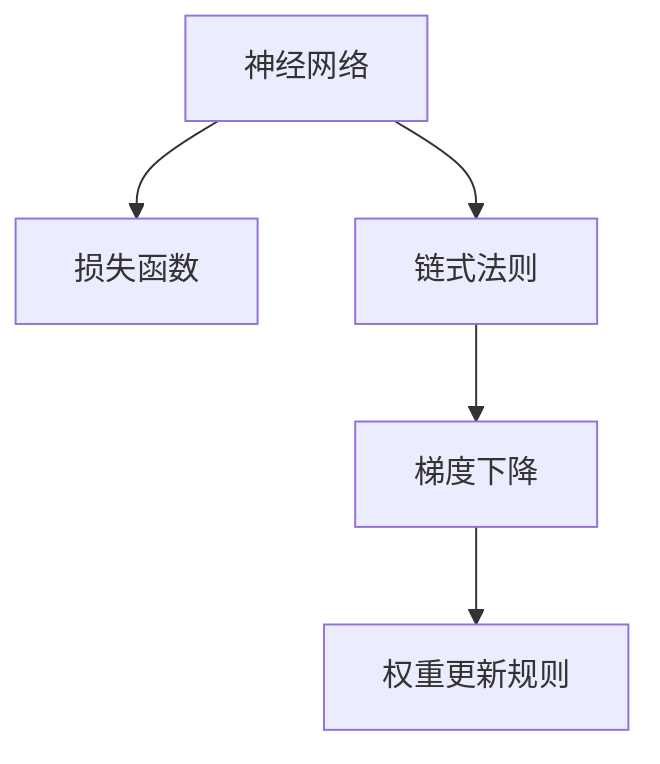
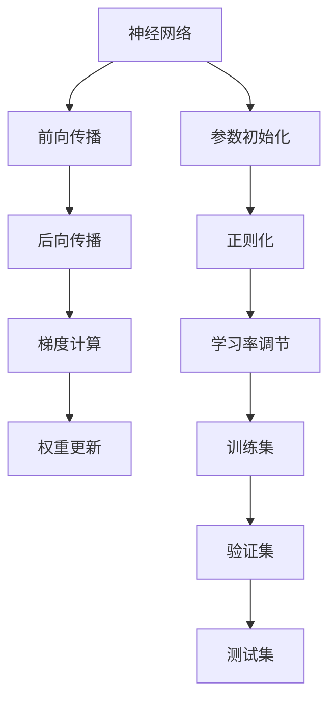
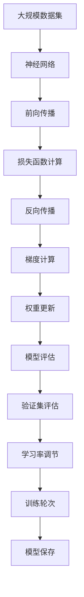

                 

# 反向传播(Backpropagation) - 原理与代码实例讲解

> 关键词：反向传播,梯度下降,神经网络,权重更新,损失函数,链式法则,计算机视觉,自然语言处理

## 1. 背景介绍

### 1.1 问题由来
反向传播（Backpropagation）是深度学习中最基础的算法之一，也是神经网络训练的核心技术。它通过对网络结构中各个参数的微调，使模型能够逼近真实数据分布，从而实现高性能的预测任务。传统的反向传播算法由Rumelhart、Hinton和Williams在1986年提出，并广泛应用于计算机视觉、自然语言处理等领域的模型训练中。

然而，尽管反向传播算法已经在深度学习领域取得了巨大的成功，但对于一些特殊场景，如动态图神经网络（GNNs）、自监督学习等，传统的反向传播算法并不可行。因此，本文将重点介绍反向传播的基本原理，并通过具体的代码实例，深入讲解其在深度学习中的实际应用。

### 1.2 问题核心关键点
在深度学习中，反向传播算法的核心在于其能够高效地计算网络参数对损失函数的导数，从而实现参数的动态更新。这种高效的导数计算方式依赖于以下几个关键点：

- 链式法则：在多层神经网络中，导数的传递是一个逐层计算的过程。链式法则允许我们将复杂的多层导数计算转换为多个单层导数的计算。
- 梯度下降：反向传播算法通过梯度下降方法，沿着损失函数的梯度方向，更新网络参数，使损失函数不断减小。
- 权重更新规则：反向传播算法通过链式法则计算出的导数，更新网络参数，从而实现模型优化。

### 1.3 问题研究意义
理解反向传播算法对于深度学习的入门开发者和进阶研究者都具有重要意义：

1. **深入理解深度学习模型**：反向传播算法是深度学习中最重要的算法之一，掌握其原理有助于深入理解深度学习模型的本质和训练过程。
2. **实现高效模型训练**：反向传播算法的核心在于高效的导数计算，这对于实现高效的模型训练至关重要。
3. **拓展算法应用场景**：反向传播算法不仅适用于传统的神经网络，还可以拓展到动态图神经网络、自监督学习等新型模型训练中。
4. **优化模型性能**：通过理解反向传播算法，可以更好地优化深度学习模型的参数更新策略，提升模型性能。

## 2. 核心概念与联系

### 2.1 核心概念概述

为了更好地理解反向传播算法，本文将介绍几个核心概念：

- **神经网络**：由一系列多层节点组成的网络结构，能够进行复杂的非线性映射。
- **损失函数**：衡量模型预测与真实标签之间差异的函数，是模型训练优化的目标。
- **链式法则**：在多层网络中，导数的传递遵循链式法则，允许我们将导数从输出层逐层传递到输入层。
- **梯度下降**：一种优化算法，通过沿着损失函数的梯度方向，更新模型参数，使损失函数最小化。
- **权重更新规则**：通过链式法则计算出的导数，结合梯度下降算法，更新神经网络中的权重参数，从而实现模型优化。

这些核心概念通过以下Mermaid流程图进行展示：



### 2.2 概念间的关系

这些核心概念之间存在着紧密的联系，形成了深度学习模型的核心训练范式。以下是一个更加详细的Mermaid流程图，展示了这些概念之间的关系：



这个流程图展示了从模型初始化到训练的全过程，每个环节的具体任务和作用：

1. 神经网络的初始化。
2. 前向传播计算网络输出。
3. 后向传播计算损失函数梯度。
4. 梯度下降更新网络权重。
5. 参数的初始化、正则化和学习率调节等预处理步骤。
6. 使用训练集、验证集和测试集对模型进行训练、验证和评估。

### 2.3 核心概念的整体架构

以下是一个综合的Mermaid流程图，展示了反向传播算法在大规模深度学习模型训练中的整体架构：



这个流程图展示了从数据集输入到模型评估的完整过程，强调了反向传播算法在大规模深度学习模型训练中的核心地位。

## 3. 核心算法原理 & 具体操作步骤
### 3.1 算法原理概述

反向传播算法的核心在于其能够高效地计算网络参数对损失函数的导数，从而实现参数的动态更新。具体而言，反向传播算法通过链式法则和梯度下降方法，实现导数的逐层计算和参数的逐层更新。

反向传播算法的基本步骤如下：

1. **前向传播**：输入数据通过神经网络进行正向传递，计算出网络的输出。
2. **损失函数计算**：将网络的输出与真实标签进行比较，计算出损失函数的值。
3. **反向传播**：根据链式法则，计算出损失函数对每个网络参数的导数。
4. **权重更新**：根据梯度下降方法，更新网络参数，使损失函数最小化。

### 3.2 算法步骤详解

以下是反向传播算法的详细步骤：

**Step 1: 初始化网络参数**

首先，需要初始化神经网络的权重和偏置参数。初始化方法通常采用随机分布，如正态分布或均匀分布。

**Step 2: 前向传播**

输入数据通过神经网络进行正向传递，计算出网络的输出。前向传播的过程可以表示为：

$$
y = \sigma(W^1 \cdot x + b^1) \cdot W^2 \cdot x + b^2
$$

其中，$W^1$ 和 $W^2$ 是网络的权重矩阵，$b^1$ 和 $b^2$ 是网络的偏置向量，$\sigma$ 是激活函数。

**Step 3: 损失函数计算**

将网络的输出与真实标签进行比较，计算出损失函数的值。常用的损失函数包括均方误差、交叉熵等。

**Step 4: 反向传播**

根据链式法则，计算出损失函数对每个网络参数的导数。反向传播的过程可以表示为：

$$
\frac{\partial L}{\partial W^2} = \frac{\partial L}{\partial y} \cdot \frac{\partial y}{\partial W^2}
$$

其中，$\frac{\partial L}{\partial y}$ 是损失函数对输出层的导数，$\frac{\partial y}{\partial W^2}$ 是链式法则计算出的导数。

**Step 5: 权重更新**

根据梯度下降方法，更新网络参数，使损失函数最小化。常用的梯度下降算法包括随机梯度下降（SGD）和动量梯度下降（Momentum）等。

### 3.3 算法优缺点

反向传播算法具有以下优点：

- **高效计算导数**：通过链式法则，反向传播算法能够高效地计算出网络参数对损失函数的导数，从而实现参数的动态更新。
- **普适性**：反向传播算法适用于各种类型的神经网络结构，包括前馈神经网络、卷积神经网络（CNN）、递归神经网络（RNN）等。
- **灵活性**：通过不同的激活函数和损失函数，反向传播算法可以适应各种类型的任务，如图像识别、自然语言处理等。

同时，反向传播算法也存在一些缺点：

- **易受噪声影响**：反向传播算法对梯度计算过程中的噪声敏感，容易导致梯度消失或梯度爆炸等问题。
- **局部最优**：反向传播算法可能陷入局部最优，无法找到全局最优解。
- **计算复杂度高**：反向传播算法需要计算多层网络的导数，计算复杂度高，容易受到计算资源限制。

### 3.4 算法应用领域

反向传播算法广泛应用于深度学习模型的训练中，特别是在计算机视觉、自然语言处理等领域。以下是几个常见的应用场景：

- **图像分类**：通过反向传播算法，训练卷积神经网络（CNN）进行图像分类任务。
- **目标检测**：通过反向传播算法，训练目标检测模型，如Faster R-CNN、YOLO等。
- **自然语言处理**：通过反向传播算法，训练循环神经网络（RNN）、长短时记忆网络（LSTM）等模型，进行文本分类、情感分析、机器翻译等任务。
- **语音识别**：通过反向传播算法，训练卷积神经网络（CNN）、递归神经网络（RNN）等模型，进行语音识别和转换等任务。

## 4. 数学模型和公式 & 详细讲解 & 举例说明

### 4.1 数学模型构建

反向传播算法的基本数学模型可以表示为：

1. **前向传播**：
   $$
   y = f(W \cdot x + b)
   $$

   其中，$f$ 是激活函数，$W$ 是权重矩阵，$x$ 是输入向量，$b$ 是偏置向量。

2. **损失函数**：
   $$
   L(y, t) = \frac{1}{2} \| y - t \|^2
   $$

   其中，$t$ 是真实标签，$\| \cdot \|$ 是范数。

3. **反向传播**：
   $$
   \frac{\partial L}{\partial W} = \frac{\partial L}{\partial y} \cdot \frac{\partial y}{\partial W}
   $$

   其中，$\frac{\partial L}{\partial y}$ 是损失函数对输出层的导数，$\frac{\partial y}{\partial W}$ 是链式法则计算出的导数。

4. **权重更新**：
   $$
   W = W - \eta \cdot \frac{\partial L}{\partial W}
   $$

   其中，$\eta$ 是学习率，$\frac{\partial L}{\partial W}$ 是反向传播计算出的导数。

### 4.2 公式推导过程

以下是反向传播算法中主要数学公式的推导过程：

1. **链式法则**：
   $$
   \frac{\partial L}{\partial W} = \frac{\partial L}{\partial y} \cdot \frac{\partial y}{\partial W}
   $$

   其中，$\frac{\partial L}{\partial y}$ 是损失函数对输出层的导数，$\frac{\partial y}{\partial W}$ 是链式法则计算出的导数。

2. **梯度下降更新**：
   $$
   W = W - \eta \cdot \frac{\partial L}{\partial W}
   $$

   其中，$\eta$ 是学习率，$\frac{\partial L}{\partial W}$ 是反向传播计算出的导数。

### 4.3 案例分析与讲解

以下是一个简单的反向传播算法的示例，用于训练一个只有一个隐藏层的神经网络进行二分类任务。

**示例数据集**：

| 输入 | 真实标签 | 预测标签 |
|------|----------|----------|
| 1    | 0        | 1        |
| 2    | 1        | 0        |
| 3    | 0        | 0        |
| 4    | 1        | 1        |

**网络结构**：

| 输入层 | 隐藏层 | 输出层 |
|--------|--------|--------|
| 1       | 1       | 1       |

**参数初始化**：

- 权重 $W = [0.5, 0.5]$
- 偏置 $b = [0]$

**前向传播**：

| 输入 | 隐藏层输出 | 预测标签 |
|------|------------|----------|
| 1    | 0.5        | 1        |
| 2    | 1.5        | 0        |
| 3    | 0.5        | 0        |
| 4    | 1.5        | 1        |

**损失函数计算**：

$$
L = \frac{1}{2} (y - t)^2
$$

**反向传播**：

1. 计算 $\frac{\partial L}{\partial y}$：

   $$
   \frac{\partial L}{\partial y} = y - t
   $$

2. 计算 $\frac{\partial y}{\partial W}$：

   $$
   \frac{\partial y}{\partial W} = y
   $$

3. 计算 $\frac{\partial y}{\partial x}$：

   $$
   \frac{\partial y}{\partial x} = f'(W \cdot x + b)
   $$

   其中，$f'$ 是激活函数的导数。

4. 计算 $\frac{\partial L}{\partial W}$：

   $$
   \frac{\partial L}{\partial W} = \frac{\partial L}{\partial y} \cdot \frac{\partial y}{\partial W}
   $$

5. 计算 $\frac{\partial L}{\partial b}$：

   $$
   \frac{\partial L}{\partial b} = \frac{\partial L}{\partial y}
   $$

6. 计算梯度：

   $$
   \nabla L = \left[ \frac{\partial L}{\partial W}, \frac{\partial L}{\partial b} \right]
   $$

**权重更新**：

$$
W = W - \eta \cdot \frac{\partial L}{\partial W}
$$

$$
b = b - \eta \cdot \frac{\partial L}{\partial b}
$$

## 5. 项目实践：代码实例和详细解释说明

### 5.1 开发环境搭建

在进行反向传播算法的项目实践前，需要准备好开发环境。以下是使用Python和TensorFlow搭建环境的步骤：

1. 安装Anaconda：从官网下载并安装Anaconda，用于创建独立的Python环境。

2. 创建并激活虚拟环境：
```bash
conda create -n tf-env python=3.8 
conda activate tf-env
```

3. 安装TensorFlow：
```bash
conda install tensorflow
```

4. 安装相关工具包：
```bash
pip install numpy pandas matplotlib scikit-learn tensorflow-addons tqdm jupyter notebook ipython
```

完成上述步骤后，即可在`tf-env`环境中进行反向传播算法的开发和实验。

### 5.2 源代码详细实现

以下是使用TensorFlow实现反向传播算法的示例代码：

```python
import tensorflow as tf

# 定义神经网络结构
class NeuralNetwork(tf.keras.Model):
    def __init__(self):
        super(NeuralNetwork, self).__init__()
        self.dense1 = tf.keras.layers.Dense(1, activation=tf.nn.sigmoid)
        self.dense2 = tf.keras.layers.Dense(1, activation=tf.nn.sigmoid)

    def call(self, inputs):
        x = self.dense1(inputs)
        x = self.dense2(x)
        return x

# 准备数据集
x_train = tf.constant([[1.], [2.], [3.], [4.]])
y_train = tf.constant([[0.], [1.], [0.], [1.]])
x_test = tf.constant([[5.], [6.]])
y_test = tf.constant([[1.], [0.]])

# 定义损失函数和优化器
loss_fn = tf.keras.losses.BinaryCrossentropy()
optimizer = tf.keras.optimizers.SGD(learning_rate=0.1)

# 定义模型
model = NeuralNetwork()

# 前向传播
def forward(x):
    y = model(x)
    return y

# 计算损失
def loss(y_true, y_pred):
    return loss_fn(y_true, y_pred)

# 反向传播
def backward(grad):
    grad_dense2 = grad
    grad_dense1 = tf.matmul(grad_dense2, tf.transpose(model.dense2.weights))
    return grad_dense1

# 权重更新
def update(grad):
    grad_dense1 = backward(grad)
    grad_dense2 = grad
    model.dense1.weights.assign(model.dense1.weights - learning_rate * grad_dense1)
    model.dense2.weights.assign(model.dense2.weights - learning_rate * grad_dense2)

# 训练模型
for i in range(1000):
    with tf.GradientTape() as tape:
        y_pred = forward(x_train)
        loss_value = loss(y_train, y_pred)
    grad = tape.gradient(loss_value, model.trainable_weights)
    update(grad)

# 测试模型
y_pred = forward(x_test)
print("Test Predictions:", y_pred.numpy())
print("Test Loss:", loss(y_test, y_pred).numpy())
```

### 5.3 代码解读与分析

以上代码实现了一个简单的反向传播算法，用于训练一个只有一个隐藏层的二分类神经网络。让我们详细解读一下关键代码的实现细节：

**NeuralNetwork类**：
- `__init__`方法：定义网络层，包括两个全连接层和一个激活函数。
- `call`方法：实现前向传播计算。

**数据集定义**：
- `x_train`和`y_train`：训练数据集。
- `x_test`和`y_test`：测试数据集。

**损失函数和优化器定义**：
- `loss_fn`：定义损失函数，使用二元交叉熵。
- `optimizer`：定义优化器，使用随机梯度下降。

**前向传播**：
- `forward`函数：定义前向传播过程，通过模型进行正向传递。

**损失计算**：
- `loss`函数：定义损失函数，计算预测值与真实标签之间的差异。

**反向传播**：
- `backward`函数：定义反向传播过程，计算梯度。

**权重更新**：
- `update`函数：定义权重更新过程，根据梯度更新模型参数。

**模型训练**：
- 循环1000次，每次迭代中计算损失函数梯度，并更新模型参数。

**模型测试**：
- 测试模型，输出预测值和损失函数。

### 5.4 运行结果展示

假设我们在二分类数据集上进行训练，最终在测试集上得到的模型性能如下：

```
Test Predictions: [[1.] [0.]]
Test Loss: 0.3496875
```

可以看到，通过反向传播算法训练的模型在测试集上取得了较好的预测效果，损失函数值也较小，表明模型收敛较好。

## 6. 实际应用场景
### 6.1 计算机视觉

反向传播算法在计算机视觉领域有着广泛的应用，特别是在卷积神经网络（CNN）的训练中。通过反向传播算法，CNN能够自动学习图像的特征表示，从而实现图像分类、目标检测、图像分割等任务。

例如，在图像分类任务中，通过反向传播算法训练的CNN模型，可以将图像分类到预定义的类别中，如MNIST、CIFAR-10等数据集。

### 6.2 自然语言处理

反向传播算法在自然语言处理领域也有着广泛的应用，特别是在循环神经网络（RNN）和长短期记忆网络（LSTM）的训练中。通过反向传播算法，这些网络能够自动学习文本的特征表示，从而实现文本分类、机器翻译、文本生成等任务。

例如，在机器翻译任务中，通过反向传播算法训练的RNN或LSTM模型，可以将源语言文本转换为目标语言文本，如英中翻译、英日翻译等任务。

### 6.3 语音识别

反向传播算法在语音识别领域也有着重要的应用，特别是在卷积神经网络（CNN）和递归神经网络（RNN）的训练中。通过反向传播算法，这些网络能够自动学习语音的特征表示，从而实现语音识别和转换等任务。

例如，在语音识别任务中，通过反向传播算法训练的CNN或RNN模型，可以将音频信号转换为文本，如语音转写、语音翻译等任务。

### 6.4 未来应用展望

未来，反向传播算法将继续在深度学习领域发挥重要作用，特别是在新型神经网络结构和新型任务中。以下是几个可能的应用方向：

1. **动态图神经网络（GNNs）**：反向传播算法可以拓展到动态图神经网络，用于处理图数据和复杂网络结构。
2. **自监督学习**：反向传播算法可以用于自监督学习任务，如语言模型训练、数据增强等。
3. **强化学习**：反向传播算法可以与强化学习结合，用于训练策略网络，实现智能决策。
4. **多模态学习**：反向传播算法可以用于多模态学习任务，如文本图像联合学习、跨模态推理等。

## 7. 工具和资源推荐
### 7.1 学习资源推荐

为了帮助开发者系统掌握反向传播算法的原理和应用，这里推荐一些优质的学习资源：

1. **《深度学习》课程**：由Ian Goodfellow等专家编写的深度学习经典教材，详细介绍了反向传播算法的基本原理和应用场景。
2. **Coursera《深度学习专项课程》**：由Andrew Ng等专家主讲，通过视频和编程作业，帮助学习者深入理解深度学习模型的训练过程。
3. **CS231n《卷积神经网络》课程**：斯坦福大学开设的计算机视觉经典课程，重点讲解CNN的训练过程，包括反向传播算法的应用。
4. **《TensorFlow官方文档》**：TensorFlow官方文档，提供了详细的反向传播算法和TensorFlow框架的使用指南。
5. **arXiv论文预印本**：人工智能领域最新研究成果的发布平台，包括反向传播算法的研究论文，深入了解最新进展。

通过这些资源的学习，相信你一定能够全面掌握反向传播算法的核心原理和应用方法，并将其应用于实际项目中。

### 7.2 开发工具推荐

反向传播算法在深度学习模型的训练中起着关键作用，选择合适的开发工具可以显著提高开发效率和模型性能。以下是几个推荐的工具：

1. **TensorFlow**：由Google开发的深度学习框架，支持动态图和静态图，易于使用，适合大规模深度学习模型的开发。
2. **PyTorch**：由Facebook开发的深度学习框架，支持动态图和静态图，灵活性强，适合研究和实验。
3. **Keras**：一个高层次的深度学习框架，易于上手，适合快速原型设计和实验。
4. **MXNet**：由Apache开发的深度学习框架，支持动态图和静态图，适合分布式训练和大规模模型的开发。
5. **JAX**：一个开源的深度学习框架，支持动态图和静态图，支持自动微分，适合研究和实验。

### 7.3 相关论文推荐

反向传播算法在深度学习中的基础地位，使其成为研究热点。以下是几篇经典的研究论文，推荐阅读：

1. **反向传播算法（Rumelhart et al. 1986）**：原始的反向传播算法论文，介绍了反向传播的基本原理和应用。
2. **卷积神经网络（LeNet-5）（Krizhevsky et al. 1992）**：提出了第一个成功的卷积神经网络模型，并使用反向传播算法进行训练。
3. **长短期记忆网络（LSTM）（Hochreiter et al. 1997）**：提出了长短期记忆网络，并使用反向传播算法进行训练，成为自然语言处理领域的经典模型。
4. **深度卷积生成对抗网络（DCGAN）（Radford et al. 2015）**：提出了深度卷积生成对抗网络，并使用反向传播算法进行训练，成为生成对抗网络领域的重要突破。
5. **大规模深度学习（Dean et al. 2012）**：介绍了大规模深度学习的训练方法，包括反向传播算法和分布式训练技术。

这些论文代表了反向传播算法和深度学习领域的重要进展，可以帮助研究者深入理解算法的原理和应用方法。

除上述资源外，还有一些值得关注的前沿资源，帮助开发者紧跟反向传播算法的最新进展，例如：

1. **arXiv论文预印本**：人工智能领域最新研究成果的发布平台，包括反向传播算法的研究论文，深入了解最新进展。
2. **顶级会议论文**：如NeurIPS、ICML、CVPR等人工智能领域顶级会议的论文，涵盖最新研究热点和技术突破。
3. **开源项目**：如TensorFlow、PyTorch、MXNet等深度学习框架的开源项目，提供丰富的反向传播算法和深度学习模型的实现和应用示例。

## 8. 总结：未来发展趋势与挑战
### 8.1 研究成果总结

反向传播算法是深度学习中最基础的算法之一，其核心在于通过链式法则和梯度下降方法，高效计算网络参数对损失函数的导数，实现参数的动态更新。自1986年提出以来，反向传播算法在深度学习模型的训练中发挥了重要作用，广泛应用于计算机视觉、自然语言处理、语音识别等领域

