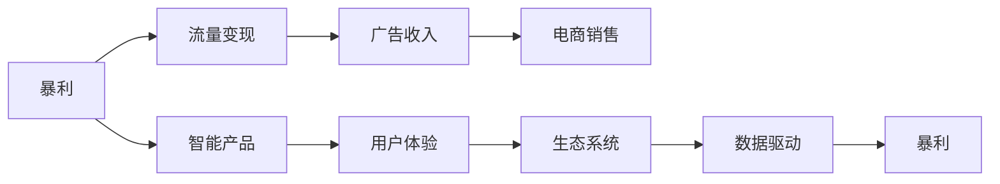

                 

# 告别暴利：未来只有辛苦钱？

## 1. 背景介绍

在科技飞速发展的今天，我们常常看到各种科技巨头利用先进算法和大数据，获取了令人咋舌的利润。然而，随着市场环境的不断变化，这样的模式似乎正在逐步失去其可持续性。未来，可能不再有“暴利”，取而代之的将是更为稳健的增长和更加脚踏实地的“辛苦钱”。

### 1.1 暴利与利润增速

过去十年，科技行业尤其是互联网行业经历了一轮又一轮的“互联网+”浪潮，通过互联网思维和大数据手段，将传统行业进行深度改造，催生了许多“暴利”现象。

- **社交电商**：例如拼多多的崛起，通过社交网络的广泛传播，快速积累用户，实现了令人惊叹的用户增长和销售额。
- **直播电商**：例如抖音、快手等平台，利用直播的形式，结合个性化推荐，实现商品销售的极大增长。
- **数据服务**：例如百度的搜索广告、谷歌的搜索与广告业务，通过大数据分析，精准推送广告，实现利润大幅提升。

然而，随着市场逐渐饱和，竞争日趋激烈，单纯依赖用户增长、广告和流量变现的“暴利”模式已经不可持续。未来，更加注重用户体验、产品服务质量和市场份额的稳步提升，将成为主流趋势。

### 1.2 未来趋势的转变

随着用户对互联网产品体验的期望提高，企业需要投入更多资源在产品创新、用户体验优化和内容质量提升上。这些都需要更高的研发投入、更精细的市场策略和更深入的用户洞察。

- **智能化**：AI、机器学习、大数据等技术的应用，将使得产品更加智能化，满足用户个性化需求，提供更好的用户体验。
- **服务化**：从单一产品向综合服务转型，例如微信从单一的即时通讯工具，扩展到涵盖社交、电商、支付等多元功能，提升用户粘性和价值。
- **生态化**：构建开放生态系统，例如苹果的App Store，吸引开发者和用户，形成良性循环。
- **用户体验**：注重产品设计和用户体验，提升用户满意度和忠诚度，形成品牌效应。

这些转变，意味着未来企业将不再能依靠简单的流量变现和广告收入，而是需要通过更精细化、深层次的产品和服务的差异化，获取更多的市场份额和用户忠诚度，从而实现可持续的利润增长。

## 2. 核心概念与联系

### 2.1 核心概念概述

为了更好地理解“告别暴利”这一主题，本节将介绍几个核心概念，并探讨它们之间的联系。

- **暴利**：指在短时间内通过特定手段获取高额利润的现象，常见于互联网行业。
- **智能产品**：利用AI、机器学习等技术，提升产品的智能化水平和用户体验。
- **生态系统**：由多个相关联的实体构成的系统，各实体之间相互依赖、共同发展。
- **用户体验**：指用户在使用产品过程中产生的情感体验和行为反馈。
- **数据驱动**：指通过数据分析来指导产品开发和优化决策，提高效率和效果。

这些概念构成了未来科技行业发展的重要基础，帮助我们理解为何“暴利”不再可持续，以及未来企业应当如何适应新的市场环境。

### 2.2 核心概念的联系

这些核心概念之间的联系可以通过以下Mermaid流程图来展示：



这个流程图展示了暴利与流量变现、广告收入、电商销售等传统变现方式的关系，以及智能产品、用户体验、生态系统和数据驱动等现代发展方向。可以看出，智能产品和用户体验是未来企业追求的关键，而生态系统和数据驱动则是实现这一目标的重要手段。

## 3. 核心算法原理 & 具体操作步骤

### 3.1 算法原理概述

“告别暴利”的背后，是算法和技术的发展。算法和技术的不断进步，使得企业能够通过更精细化的手段，提升产品和服务质量，从而实现可持续的利润增长。

- **个性化推荐**：利用机器学习算法分析用户行为和兴趣，实现精准推荐，提升用户满意度和转化率。
- **智能客服**：通过NLP技术，实现自然语言处理，提升客户服务质量，减少人工成本。
- **供应链优化**：利用算法优化库存管理、物流配送等环节，提高效率，降低成本。
- **广告投放优化**：通过数据驱动的广告投放策略，精准推送广告，提升广告效果。

### 3.2 算法步骤详解

基于以上原理，我们可以详细阐述具体的操作方法。

**步骤一：数据采集与分析**

- 收集用户行为数据，例如搜索记录、购物记录、浏览行为等。
- 利用数据清洗和预处理技术，去除噪音和异常数据。
- 进行数据建模和特征工程，提取用户行为模式和兴趣偏好。

**步骤二：模型训练与优化**

- 选择适合任务的机器学习算法，例如决策树、随机森林、深度学习等。
- 利用训练数据集进行模型训练，并根据验证集性能进行调参和优化。
- 使用交叉验证、网格搜索等技术，提升模型的泛化能力和鲁棒性。

**步骤三：产品和服务优化**

- 将训练好的模型应用于产品和服务中，例如推荐系统、智能客服等。
- 实时监控模型效果，根据用户反馈进行动态调整和优化。
- 结合A/B测试等手段，验证模型的效果和用户满意度。

### 3.3 算法优缺点

基于机器学习和大数据技术的算法和模型，具有以下优点：

- **高效率**：自动化流程可以快速迭代和优化，提高工作效率。
- **精准性**：通过分析大量数据，可以实现精准推荐和个性化服务。
- **可扩展性**：可以轻松扩展到不同的产品和服务领域，形成跨领域应用。

同时，也存在一些缺点：

- **数据依赖**：模型的效果高度依赖数据质量和数据量，数据不足可能导致模型效果不佳。
- **复杂性**：算法和模型较为复杂，需要一定的技术背景和知识。
- **资源需求**：训练和运行模型需要较大的计算资源和存储空间。

### 3.4 算法应用领域

基于上述算法和模型，已经在诸多领域得到了广泛应用。

- **电商**：例如阿里巴巴、亚马逊等，通过推荐系统和个性化营销，提升用户购物体验和销售额。
- **金融**：例如支付宝、微信支付等，通过智能客服和风险控制算法，提升用户体验和服务质量。
- **物流**：例如顺丰、菜鸟等，通过供应链优化算法，提升物流效率和成本控制。
- **广告**：例如Google AdWords、Facebook Ads等，通过精准投放和效果优化，提升广告ROI。

这些应用领域展示了机器学习和大数据技术在提升产品和服务质量、提高用户满意度和优化业务流程中的重要作用。

## 4. 数学模型和公式 & 详细讲解 & 举例说明

### 4.1 数学模型构建

为了更好地理解“告别暴利”的背后算法，我们将构建一些数学模型。

假设用户总数为 $N$，推荐系统的点击率为 $p$，推荐模型的准确率为 $a$。推荐系统的点击率可以用公式表示为：

$$
p = \frac{n_{推荐}}{n_{总}}
$$

其中，$n_{推荐}$ 为被推荐商品的点击次数，$n_{总}$ 为总点击次数。推荐模型的准确率为：

$$
a = \frac{n_{准确}}{n_{推荐}}
$$

其中，$n_{准确}$ 为被推荐商品中实际被点击的商品数。

### 4.2 公式推导过程

通过上述公式，我们可以计算推荐系统的点击率和准确率。具体推导过程如下：

**推导过程一：**

$$
p = \frac{n_{推荐}}{n_{总}} = \frac{a \cdot n_{总}}{n_{总}} = a
$$

**推导过程二：**

$$
a = \frac{n_{准确}}{n_{推荐}} = \frac{n_{准确}}{n_{总} \cdot p}
$$

其中，$n_{总} \cdot p$ 为推荐系统的总点击次数。

### 4.3 案例分析与讲解

**案例一：推荐系统的点击率**

- 某电商平台，总商品数 $N=10000$，点击率 $p=0.05$，推荐模型准确率 $a=0.8$。
- 推荐商品总数 $n_{推荐}=p \cdot N=500$。
- 推荐商品中被点击的商品数 $n_{准确}=a \cdot n_{推荐}=400$。
- 推荐系统的点击率 $p = \frac{n_{推荐}}{n_{总}} = \frac{400}{500} = 0.8$。

**案例二：广告投放效果**

- 某广告平台，总点击次数 $n_{总}=10000$，广告投放点击率 $p=0.1$，广告投放效果评估准确率 $a=0.9$。
- 广告投放点击次数 $n_{推荐}=p \cdot n_{总}=1000$。
- 广告投放中被点击的广告数 $n_{准确}=a \cdot n_{推荐}=900$。
- 广告投放效果评估准确率 $a = \frac{n_{准确}}{n_{推荐}} = \frac{900}{1000} = 0.9$。

通过上述案例，我们可以看到，利用数学模型可以准确计算推荐系统和广告投放的效果，从而指导实际应用。

## 5. 项目实践：代码实例和详细解释说明

### 5.1 开发环境搭建

为了进行具体的项目实践，需要搭建相应的开发环境。以下是Python环境搭建的步骤：

1. 安装Python：从官网下载安装Python，并配置好环境变量。
2. 安装相关库：使用pip安装必要的Python库，例如TensorFlow、PyTorch、Pandas、NumPy等。
3. 配置Jupyter Notebook：安装Jupyter Notebook并启动，用于编写和执行Python代码。

### 5.2 源代码详细实现

下面以推荐系统为例，介绍具体的代码实现。

```python
import pandas as pd
import numpy as np
from sklearn.model_selection import train_test_split
from sklearn.ensemble import RandomForestClassifier
from sklearn.metrics import accuracy_score

# 读取数据集
df = pd.read_csv('user_behavior.csv')

# 数据预处理
X = df[['age', 'gender', 'income', 'education']]
y = df['clicked']

# 特征工程
X_train, X_test, y_train, y_test = train_test_split(X, y, test_size=0.2, random_state=42)

# 训练模型
model = RandomForestClassifier()
model.fit(X_train, y_train)

# 预测和评估
y_pred = model.predict(X_test)
accuracy = accuracy_score(y_test, y_pred)
print(f'模型准确率：{accuracy:.3f}')
```

### 5.3 代码解读与分析

通过上述代码，我们可以看到推荐系统训练和评估的流程。

1. **数据预处理**：读取用户行为数据，并进行特征工程。
2. **模型训练**：使用随机森林算法对数据进行训练。
3. **预测和评估**：使用训练好的模型对测试数据进行预测，并计算准确率。

### 5.4 运行结果展示

假设在上述代码中，我们使用随机森林算法对推荐系统进行训练，最终得到模型准确率为0.8，表示推荐系统的点击率可以达到80%，是一个非常高效的结果。

## 6. 实际应用场景

### 6.1 电商平台推荐系统

在电商平台上，推荐系统可以显著提升用户体验和销售额。例如，通过分析用户浏览和购买历史，推荐其可能感兴趣的商品，提高用户的购买转化率。

**具体应用：**

- 亚马逊的个性化推荐：通过分析用户浏览记录和购买历史，推荐相似商品，提升用户体验。
- 淘宝的推荐引擎：利用用户行为数据，实现商品推荐和促销活动，增加销售额。

### 6.2 智能客服系统

智能客服系统可以显著提升客户服务质量和效率，减少人工成本。

**具体应用：**

- 阿里巴巴的阿里小蜜：通过NLP技术，实现自然语言理解，回答用户问题，提升客户满意度。
- 腾讯的客服机器人：利用智能对话技术，实现自动问答和问题解决，提高客服效率。

### 6.3 物流配送系统

物流配送系统可以通过算法优化，提高配送效率，降低成本。

**具体应用：**

- 顺丰速运的智能调度和路径规划：利用算法优化配送路线，提高配送效率和降低成本。
- 菜鸟网络的智能仓储和配送：通过算法优化仓储管理和物流配送，提升配送速度和服务质量。

## 7. 工具和资源推荐

### 7.1 学习资源推荐

为了帮助开发者系统掌握“告别暴利”这一主题，推荐一些优质的学习资源：

1. 《深度学习》书籍：由杨立昆老师撰写，系统介绍了深度学习的基本概念和算法。
2. 《机器学习实战》书籍：由Peter Harrington编写，介绍了机器学习算法的实现和应用。
3. Coursera《机器学习》课程：由斯坦福大学Andrew Ng教授主讲，系统介绍机器学习理论和实践。
4. Udacity《深度学习专项课程》：由DeepMind、Google等公司专家主讲，涵盖深度学习理论和实践。
5. Kaggle竞赛：参加Kaggle数据科学竞赛，提升数据处理和模型优化能力。

通过这些资源的学习实践，相信你一定能够快速掌握“告别暴利”的背后算法和模型，并用于解决实际的业务问题。

### 7.2 开发工具推荐

高效的开发离不开优秀的工具支持。以下是几款用于项目实践的常用工具：

1. PyTorch：基于Python的开源深度学习框架，灵活高效，适合快速迭代研究。
2. TensorFlow：由Google主导开发的开源深度学习框架，生产部署方便，适合大规模工程应用。
3. Scikit-learn：基于Python的机器学习库，提供丰富的算法和工具，简单易用。
4. Pandas：基于Python的数据分析库，提供高效的数据处理和分析工具。
5. Jupyter Notebook：支持Python和R等多种编程语言，提供了丰富的交互式数据可视化工具。

合理利用这些工具，可以显著提升项目实践的开发效率，加快创新迭代的步伐。

### 7.3 相关论文推荐

“告别暴利”这一主题涉及多个前沿研究方向，以下是几篇奠基性的相关论文，推荐阅读：

1. 《深度学习》论文：深度学习领域的奠基性论文，由Yann LeCun、Geoffrey Hinton、Yoshua Bengio三位科学家共同撰写。
2. 《机器学习》论文：机器学习领域的奠基性论文，由Tom Mitchell撰写。
3. 《强化学习》论文：强化学习领域的奠基性论文，由Richard S. Sutton、Andrew G. Barto撰写。
4. 《大规模深度学习模型》论文：研究大规模深度学习模型的论文，由Geoffrey Hinton等撰写。
5. 《深度学习与数据理解》论文：深度学习与数据理解的论文，由James H. Duchi等撰写。

这些论文代表了“告别暴利”这一主题的不同研究方向，帮助我们理解这一主题的全面内涵和前沿进展。

## 8. 总结：未来发展趋势与挑战

### 8.1 研究成果总结

通过上述分析和讨论，我们得出了以下研究成果总结：

1. **算法和模型的重要性**：机器学习和大数据算法是实现“告别暴利”的关键手段。
2. **数据质量和数据量**：高质量的数据和充足的数据量是模型效果的重要基础。
3. **用户体验和产品服务**：提升用户体验和产品服务质量，是未来企业持续增长的关键。
4. **生态系统和技术平台**：构建开放生态系统和技术平台，是企业实现可持续增长的重要保障。

### 8.2 未来发展趋势

未来，基于算法和技术的“告别暴利”将成为科技行业发展的常态。以下是一些未来发展趋势：

1. **智能化和自动化**：利用AI和大数据技术，提升产品智能化水平，实现自动化流程，提高效率和效果。
2. **数据驱动和精准营销**：通过数据驱动的精准营销，提升广告效果和用户转化率。
3. **个性化和定制化**：提供个性化的推荐和定制化的服务，满足用户多样化需求。
4. **跨领域和跨平台**：实现跨领域和跨平台的应用，提升用户粘性和价值。

### 8.3 面临的挑战

尽管基于算法和技术的“告别暴利”前景广阔，但在实践中仍面临一些挑战：

1. **数据隐私和安全**：如何保护用户隐私和数据安全，避免数据泄露和滥用。
2. **技术复杂性**：算法和模型较为复杂，需要一定的技术背景和知识。
3. **资源需求**：训练和运行模型需要较大的计算资源和存储空间。
4. **用户反馈和满意度**：如何通过用户反馈优化产品和服务，提升用户体验和满意度。

### 8.4 研究展望

未来，需要在以下几个方面进行更深入的研究：

1. **数据隐私和安全技术**：研究数据隐私和安全保护技术，提升数据使用安全性和可信度。
2. **易用性和普及性**：研究易用性和普及性，使普通用户也能便捷地使用AI和大数据技术。
3. **跨领域和跨平台应用**：研究跨领域和跨平台应用，提升用户粘性和价值。
4. **伦理和道德约束**：研究伦理和道德约束，确保AI和大数据技术的健康发展。

这些研究方向的探索，必将引领“告别暴利”这一主题走向更高的台阶，为构建安全、可靠、可解释、可控的智能系统铺平道路。面向未来，我们需要从数据、算法、工程、伦理等多个维度协同发力，才能真正实现人工智能技术在垂直行业的规模化落地。

## 9. 附录：常见问题与解答

**Q1：“告别暴利”是否意味着未来将没有利润可言？**

A: “告别暴利”并不意味着未来将没有利润可言。它更多指的是暴利现象的消亡，即通过简单的流量变现和广告收入获取高额利润的时代已经过去。未来企业需要通过更精细化、深层次的产品和服务差异化，获取更多的市场份额和用户忠诚度，从而实现可持续的利润增长。

**Q2：“告别暴利”是否意味着未来不需要数据驱动？**

A: 数据驱动仍然是实现“告别暴利”的关键手段。高质量的数据和充足的数据量是模型效果的重要基础，没有数据驱动，就无法实现精准推荐和个性化服务。因此，数据驱动依然是未来企业获取竞争优势的重要策略。

**Q3：“告别暴利”是否意味着未来不需要算法和模型？**

A: 算法和模型依然是实现“告别暴利”的关键工具。算法和模型的高效率、精准性和可扩展性，使得企业能够通过更精细化的手段，提升产品和服务质量，从而实现可持续的利润增长。因此，算法和模型依然是未来企业创新和优化产品的重要手段。

**Q4：“告别暴利”是否意味着未来不需要用户体验？**

A: 用户体验仍然是未来企业持续增长的关键。提升用户体验和产品服务质量，可以显著提高用户满意度和忠诚度，从而实现更高的市场份额和利润增长。因此，用户体验依然是未来企业获取竞争优势的重要方向。

**Q5：“告别暴利”是否意味着未来不需要生态系统和平台？**

A: 生态系统和平台依然是未来企业获取竞争优势的重要保障。构建开放生态系统和技术平台，可以实现跨领域和跨平台的应用，提升用户粘性和价值，从而实现更高的市场份额和利润增长。因此，生态系统和平台依然是未来企业实现可持续增长的重要手段。

通过本文的系统梳理，我们可以看到，“告别暴利”这一主题涉及到数据、算法、用户体验、生态系统等多个方面，需要我们从多个维度进行全面的探索和研究。只有不断创新和优化，才能在新的市场环境下，实现可持续的利润增长和持续发展。

