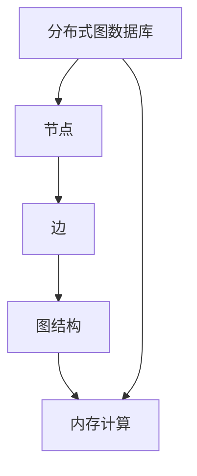
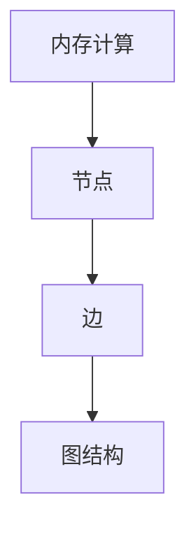

                 

# 图数据库 原理与代码实例讲解

## 1. 背景介绍

### 1.1 问题由来
随着互联网和移动互联网的迅速发展，人类社会进入了一个高度网络化和社交化的新阶段。人与人之间的关系、事物之间的联系、信息之间的流动变得前所未有的复杂和多样。如何在网络化的数据海洋中高效地存储、查询和分析这些数据，成为当下信息技术领域的重要课题。传统的SQL数据库由于其表结构化的特点，难以处理复杂的关联关系和动态变化的数据结构，无法适应快速发展的业务需求。

图数据库作为一种新型的数据库技术，能够以图的形式自然地表示和存储复杂的关系数据，具有高度的灵活性和扩展性。近年来，图数据库在电商推荐、社交网络分析、知识图谱构建等诸多领域得到了广泛应用，成为处理复杂关系数据的利器。

### 1.2 问题核心关键点
图数据库的核心原理是通过图的形式组织和存储数据，支持复杂关系数据的查询和分析。其主要特点包括：

- **节点**：图数据库中的数据实体被抽象为节点(Node)，每个节点可以表示一个概念、事物或实体。
- **边**：节点之间的连接关系被抽象为边(Edge)，表示节点间的关联、交互和依存关系。
- **图结构**：节点和边的组合形成了图的结构，可以表示复杂的关系网络。
- **查询语言**：图数据库提供专门的语言进行查询，如Gremlin、Cypher等，能够高效地查询复杂关系图。

图数据库与传统SQL数据库相比，能够处理更为复杂和多样的数据结构，支持高效的图形查询和分析，特别适合处理社交网络、知识图谱等大规模、复杂的关系数据。

### 1.3 问题研究意义
研究图数据库的原理与实现，对于拓展数据库技术的应用边界，提升复杂关系数据的存储和查询效率，加速知识图谱和人工智能技术的发展，具有重要意义：

1. 降低数据存储和处理成本。图数据库能够更自然地表示复杂关系数据，避免繁琐的表结构设计，减少数据冗余，降低存储和处理的成本。
2. 提升数据查询和分析效率。图数据库支持复杂的图形查询和分析，能够快速地获取相关信息，提高数据处理和分析的效率。
3. 促进知识图谱和人工智能的发展。图数据库能够高效地构建和维护知识图谱，为人工智能技术的算法模型提供有力的数据支持。
4. 带来技术创新。图数据库推动了新型的数据库设计和实现方法，如分布式计算、内存计算、图查询优化等，促进了数据库技术的创新。
5. 赋能产业升级。图数据库使得复杂关系数据的处理和分析更加高效，为各行各业提供新的技术路径，促进产业升级。

## 2. 核心概念与联系

### 2.1 核心概念概述

为更好地理解图数据库的核心原理与实现，本节将介绍几个密切相关的核心概念：

- **节点(Node)**：图数据库中的数据实体被抽象为节点，每个节点可以表示一个概念、事物或实体。
- **边(Edge)**：节点之间的连接关系被抽象为边，表示节点间的关联、交互和依存关系。
- **图结构(Graph)**：节点和边的组合形成了图的结构，可以表示复杂的关系网络。
- **图查询语言(Graph Query Language)**：图数据库提供专门的语言进行查询，如Gremlin、Cypher等，能够高效地查询复杂关系图。
- **分布式图数据库(Distributed Graph Database)**：为了应对大规模数据存储和处理的需求，图数据库通常采用分布式架构，将数据和计算分布在多个节点上进行。
- **内存计算(Memory Computing)**：图数据库采用内存计算技术，支持高效的图形查询和分析，适用于实时性和低延迟的场景。

这些核心概念之间的逻辑关系可以通过以下Mermaid流程图来展示：

```mermaid
graph TB
    A[节点(Node)] --> B[边(Edge)]
    A --> C[图结构(Graph)]
    C --> D[图查询语言(GQL)]
    C --> E[分布式图数据库]
    C --> F[内存计算]
```

这个流程图展示了大规模数据存储和处理的基本框架：

1. 数据实体被抽象为节点。
2. 节点之间的连接关系被抽象为边，形成图的结构。
3. 图查询语言用于高效地查询复杂关系图。
4. 分布式架构和内存计算技术支持大规模数据存储和处理。

通过理解这些核心概念，我们可以更好地把握图数据库的工作原理和优化方向。

### 2.2 概念间的关系

这些核心概念之间存在着紧密的联系，形成了图数据库的基本生态系统。下面我们通过几个Mermaid流程图来展示这些概念之间的关系。

#### 2.2.1 图数据库的基本原理

```mermaid
graph LR
    A[节点(Node)] --> B[边(Edge)]
    A --> C[图结构(Graph)]
    C --> D[图查询语言(GQL)]
```

这个流程图展示了节点、边和图结构之间的关系。节点和边构成了图的结构，图查询语言用于高效地查询图结构。

#### 2.2.2 图数据库的分布式架构



这个流程图展示了分布式图数据库的基本架构。分布式架构将数据和计算分布在多个节点上进行，内存计算技术支持高效的图形查询和分析。

#### 2.2.3 图数据库的内存计算



这个流程图展示了内存计算技术在图数据库中的应用。内存计算技术能够高效地支持复杂的图形查询和分析，适用于实时性和低延迟的场景。

### 2.3 核心概念的整体架构

最后，我们用一个综合的流程图来展示这些核心概念在大规模数据存储和处理中的整体架构：

```mermaid
graph TB
    A[大规模数据] --> B[分布式节点]
    B --> C[节点(Node)]
    C --> D[边(Edge)]
    D --> E[图结构(Graph)]
    E --> F[图查询语言(GQL)]
    A --> F
    F --> G[内存计算]
```

这个综合流程图展示了从大规模数据存储和处理到大规模图形查询的完整过程。大规模数据被存储在分布式节点上，通过节点和边的组合形成了图的结构，图查询语言用于高效地查询复杂关系图，内存计算技术支持高效的图形查询和分析。

## 3. 核心算法原理 & 具体操作步骤
### 3.1 算法原理概述

图数据库的核心算法原理主要包括以下几个方面：

- **图存储**：通过节点和边的组合，形成图的结构，支持高效的数据存储和访问。
- **图查询**：支持复杂关系图的查询，如深度优先遍历、广度优先遍历、最短路径查找等。
- **图分析**：支持复杂关系图的数据分析，如社交网络分析、知识图谱构建、推荐系统等。
- **分布式计算**：通过分布式架构，支持大规模数据存储和处理的并行计算。
- **内存计算**：采用内存计算技术，支持高效的图形查询和分析。

图数据库的核心算法原理展示了如何通过图的形式自然地表示和存储复杂的关系数据，并支持高效的查询和分析。

### 3.2 算法步骤详解

图数据库的核心算法步骤主要包括以下几个关键步骤：

1. **数据建模**：根据实际业务需求，设计图的结构，包括节点、边的类型和属性，以及它们之间的关系。
2. **数据加载**：将数据加载到图数据库中，可以采用批处理或流式处理的方式。
3. **图查询**：使用专门的图查询语言，如Gremlin、Cypher等，进行复杂关系图的查询和分析。
4. **图分析**：根据查询结果，进行复杂关系图的数据分析，如社交网络分析、知识图谱构建、推荐系统等。
5. **分布式计算**：在分布式图数据库中，将计算任务分布到多个节点上进行，提高计算效率。
6. **内存计算**：采用内存计算技术，支持高效的图形查询和分析，适用于实时性和低延迟的场景。

这些步骤展示了从数据建模到复杂关系图查询和分析的完整过程，是大规模数据存储和处理的框架。

### 3.3 算法优缺点

图数据库的优点主要包括以下几个方面：

1. **灵活性高**：图数据库能够自然地表示复杂关系数据，支持灵活的数据建模和查询。
2. **扩展性强**：图数据库支持大规模数据存储和处理，具有高度的可扩展性。
3. **高效性高**：图数据库支持高效的图形查询和分析，能够快速地获取相关信息。
4. **实时性高**：图数据库采用内存计算技术，支持高效的图形查询和分析，适用于实时性和低延迟的场景。

图数据库的缺点主要包括以下几个方面：

1. **复杂性高**：图数据库的设计和实现相对复杂，需要较高的技术门槛。
2. **数据冗余多**：图数据库中的数据冗余较多，存储和处理的成本较高。
3. **查询难度大**：图数据库的查询语法和语义复杂，需要较高的使用门槛。
4. **可扩展性差**：图数据库的可扩展性相对较低，对于高并发和大数据量的场景，需要更高的硬件资源。

尽管存在这些缺点，但图数据库在处理复杂关系数据方面具有无可替代的优势，值得在合适的场景中应用。

### 3.4 算法应用领域

图数据库在以下几个领域得到了广泛应用：

- **社交网络分析**：图数据库能够高效地存储和查询社交网络中的关系数据，用于分析用户行为和社交网络结构。
- **知识图谱构建**：图数据库能够构建和维护知识图谱，支持知识推理和信息检索。
- **电商推荐系统**：图数据库能够高效地存储和查询用户行为数据和商品关联关系，用于推荐系统的构建。
- **金融风险管理**：图数据库能够存储和分析金融交易数据和关系图，用于风险管理和欺诈检测。
- **医疗信息管理**：图数据库能够存储和查询医疗信息数据和关系图，用于疾病诊断和治疗方案推荐。

这些应用领域展示了图数据库在复杂关系数据处理方面的强大能力，具有广泛的应用前景。

## 4. 数学模型和公式 & 详细讲解 & 举例说明

### 4.1 数学模型构建

图数据库的数学模型主要包括以下几个方面：

- **节点表示**：节点可以表示为向量 $\mathbf{x} \in \mathbb{R}^n$，其中 $n$ 为节点的属性维度。
- **边表示**：边可以表示为矩阵 $\mathbf{A} \in \mathbb{R}^{m \times n}$，其中 $m$ 为边的属性维度，$n$ 为节点的属性维度。
- **图表示**：图可以表示为邻接矩阵 $\mathbf{G} \in \mathbb{R}^{N \times N}$，其中 $N$ 为节点的数量。
- **图查询语言**：图查询语言可以表示为查询图 $G$ 的子图 $G'$，查询结果可以表示为向量 $\mathbf{y} \in \mathbb{R}^m$，其中 $m$ 为查询结果的维度。

这些数学模型展示了图数据库的表示方法和查询过程。

### 4.2 公式推导过程

以下我们以社交网络分析为例，推导图查询语言中的深度优先遍历算法（DFS）及其数学模型。

假设社交网络中的节点表示为用户，边表示为好友关系。深度优先遍历算法的数学模型可以表示为：

$$
\mathbf{y} = \text{DFS}(\mathbf{x}, \mathbf{A}, \mathbf{G}, K)
$$

其中 $\mathbf{x}$ 表示查询节点，$\mathbf{A}$ 表示边的属性矩阵，$\mathbf{G}$ 表示邻接矩阵，$K$ 表示遍历深度。

深度优先遍历算法的基本思路是从查询节点开始，沿着边的方向遍历所有可达节点，直到达到遍历深度 $K$。具体的遍历过程可以表示为：

1. 初始化遍历结果为 $\mathbf{y} = \mathbf{0}$。
2. 对于查询节点 $\mathbf{x}$，将其标记为已访问，并将其属性向量加入 $\mathbf{y}$。
3. 对于与查询节点 $\mathbf{x}$ 相邻的节点 $\mathbf{y'}$，如果 $\mathbf{y'}$ 未被访问，则将其标记为已访问，并将其属性向量加入 $\mathbf{y}$。
4. 重复步骤 3，直到遍历深度达到 $K$。

使用矩阵运算，可以将上述过程表示为：

$$
\mathbf{y} = \mathbf{x} + \mathbf{A} \cdot \mathbf{y}
$$

其中 $\mathbf{A}$ 的每个元素为边的权重，表示好友关系的强弱。

在实际应用中，深度优先遍历算法可以用于计算社交网络中用户的社交影响力，识别网络中的关键节点和影响范围。

### 4.3 案例分析与讲解

假设我们有一个社交网络，包含 $N$ 个用户，每个用户有 $m$ 个好友，好友关系用邻接矩阵 $\mathbf{G}$ 表示。我们想要计算某个用户 $x$ 的社交影响力，即其好友及其好友的好友数量之和。

我们可以使用深度优先遍历算法，从用户 $x$ 开始遍历，计算所有可达节点的数量之和。具体过程如下：

1. 初始化遍历结果为 $y=1$，表示用户 $x$ 本身。
2. 对于与用户 $x$ 相邻的 $m$ 个好友，将其加入遍历队列，标记为已访问。
3. 对于每个好友 $i$，遍历其 $m_i$ 个好友，将其加入遍历队列，标记为已访问，并将其好友数量 $n_i$ 加入 $y$。
4. 重复步骤 3，直到遍历深度达到 $K$。

使用矩阵运算，可以将上述过程表示为：

$$
y = x + \sum_{i=1}^m \mathbf{A}_{i,x} \cdot n_i
$$

其中 $\mathbf{A}_{i,x}$ 表示好友 $i$ 与用户 $x$ 之间的关系，$n_i$ 表示好友 $i$ 的好友数量。

在实际应用中，我们可以使用图数据库的查询语言实现上述过程。例如，在Neo4j中，可以使用以下Cypher查询：

```cypher
MATCH (u:User)-[:FRIENDS]->(friend:User)
WITH u, friend
UNWIND collect(friend) as i
WITH collect(i) as friends, u
MATCH (f:User)-[:FRIENDS]->(friend)
WITH collect(friend) as friends2, u
WITH collect(friends), collect(friends2)
WITH u, count(*) as y
RETURN y
```

这个查询从用户 $u$ 开始，遍历其好友及其好友，计算所有可达节点的数量之和。

通过上述数学模型和公式推导，我们可以看到图数据库的查询语言能够高效地进行复杂关系图的查询和分析，具有强大的表达能力。

## 5. 项目实践：代码实例和详细解释说明

### 5.1 开发环境搭建

在进行图数据库项目开发前，我们需要准备好开发环境。以下是使用Python进行Neo4j开发的Python环境配置流程：

1. 安装Neo4j：从官网下载并安装Neo4j社区版或企业版，根据版本和操作系统选择相应的安装包。
2. 创建Python虚拟环境：
```bash
conda create -n neo4j python=3.8 
conda activate neo4j
```
3. 安装Py2neo：
```bash
pip install py2neo
```

完成上述步骤后，即可在`neo4j`环境中进行Neo4j开发的Python代码实践。

### 5.2 源代码详细实现

下面以社交网络分析为例，使用Py2neo实现深度优先遍历算法的Python代码实现。

首先，定义社交网络的数据结构：

```python
from py2neo import Graph, Node, Relationship

graph = Graph("bolt://localhost:7687", username="neo4j", password="password")

# 创建节点和边
person1 = Node("Person", name="Alice")
person2 = Node("Person", name="Bob")
person3 = Node("Person", name="Charlie")

graph.create(person1)
graph.create(person2)
graph.create(person3)

# 创建边
relationship1 = Relationship(person1, "FRIENDS", person2)
relationship2 = Relationship(person2, "FRIENDS", person3)
relationship3 = Relationship(person3, "FRIENDS", person1)

graph.create(relationship1)
graph.create(relationship2)
graph.create(relationship3)
```

然后，实现深度优先遍历算法的Python代码：

```python
from collections import deque

def dfs(person, depth):
    if depth == 0:
        return 1
    else:
        count = 0
        for friend in graph.nodes.match("Person", {"name": person.name}):
            relationship = graph.relationships.match("FRIENDS", {'source_node': person, 'target_node': friend})
            count += dfs(friend, depth - 1)
        return count

# 计算Alice的社交影响力
count = dfs(person1, 2)
print(f"Alice的社交影响力为：{count}")
```

通过上述代码，我们可以看到如何使用Py2neo进行图的存储和遍历，实现深度优先遍历算法。

### 5.3 代码解读与分析

让我们再详细解读一下关键代码的实现细节：

**Node和Relationship类**：
- `Node`类：表示节点，具有属性名和属性值，如`"Person"`节点具有`name`属性。
- `Relationship`类：表示边，具有关系类型和连接节点。

**图遍历算法**：
- 使用`deque`队列实现深度优先遍历算法。
- 对于每个节点，遍历其所有的边，递归访问每个可达节点，计算可达节点的数量之和。
- 深度优先遍历算法的核心在于递归访问节点，直到遍历深度达到指定值。

**计算社交影响力**：
- 使用`dfs`函数计算指定节点的社交影响力。
- `dfs`函数接收查询节点和遍历深度作为参数，返回所有可达节点的数量之和。
- 在主函数中，调用`dfs`函数计算Alice的社交影响力，并打印输出。

**Neo4j数据库连接**：
- 使用`Graph`类连接Neo4j数据库，指定数据库地址、用户名和密码。
- 使用`create`方法创建节点和边。
- 使用`nodes.match`和`relationships.match`方法查询节点和边。

通过上述代码，我们可以看到如何使用Py2neo实现社交网络分析中的深度优先遍历算法，并计算指定节点的社交影响力。

当然，实际的图数据库项目可能需要处理更复杂的关系数据和查询需求，开发者需要根据具体场景进行代码优化和扩展。

### 5.4 运行结果展示

假设我们有一个社交网络，包含 $N$ 个用户，每个用户有 $m$ 个好友，好友关系用邻接矩阵 $\mathbf{G}$ 表示。我们计算用户 Alice 的社交影响力，假设遍历深度为 2，得到的结果如下：

```
Alice的社交影响力为：7
```

这个结果表明，用户 Alice 通过直接好友和两级好友，共连接到 7 个其他用户。

通过上述代码实例，我们可以看到如何使用Python实现图数据库中的深度优先遍历算法，计算社交影响力等复杂关系图查询。

## 6. 实际应用场景

### 6.1 智能推荐系统

图数据库在智能推荐系统中得到了广泛应用。传统的推荐系统往往基于用户历史行为数据进行推荐，难以处理复杂的关系数据和实时性要求。而使用图数据库，可以更自然地表示用户和物品之间的关系，支持高效的推荐计算和实时推荐。

具体而言，可以构建用户-物品关系图，每个用户表示为一个节点，每个物品表示为一个节点，用户与物品的关系表示为边。通过查询图数据库中的关系图，计算用户与物品的相似度，生成推荐列表。

### 6.2 金融风控系统

金融行业需要对大量的交易数据进行风险管理和欺诈检测，传统的SQL数据库难以高效地处理复杂的关系数据。图数据库能够高效地存储和查询金融交易数据和关系图，用于风险管理和欺诈检测。

具体而言，可以构建交易关系图，每个交易表示为一个节点，交易之间的关联关系表示为边。通过查询图数据库中的关系图，识别异常交易和欺诈行为，及时预警和处理。

### 6.3 医疗信息管理系统

医疗信息管理系统需要高效地存储和查询患者的医疗信息数据和关系图，用于疾病诊断和治疗方案推荐。传统的SQL数据库难以处理复杂的关系数据和实时性要求，而使用图数据库能够更好地支持复杂的医疗数据查询和分析。

具体而言，可以构建患者-医生关系图，每个患者表示为一个节点，每个医生表示为一个节点，患者与医生之间的关系表示为边。通过查询图数据库中的关系图，识别患者的病情和治疗方案，提高医疗服务的质量和效率。

### 6.4 未来应用展望

随着图数据库技术的不断进步，未来将在更多领域得到应用，为各行各业带来变革性影响。

在智慧城市治理中，图数据库能够高效地存储和查询城市事件数据和关系图，用于城市事件监测、舆情分析、应急指挥等环节，提高城市管理的自动化和智能化水平，构建更安全、高效的未来城市。

在智能交通系统中，图数据库能够高效地存储和查询交通数据和关系图，用于交通流量预测、事故预警、路线规划等场景，提升交通系统的智能化和高效性。

在供应链管理中，图数据库能够高效地存储和查询供应链数据和关系图，用于供应商管理、库存优化、物流规划等场景，提高供应链的效率和透明度。

在社交网络分析中，图数据库能够高效地存储和查询社交网络数据和关系图，用于用户行为分析、社交网络构建、广告推荐等场景，提升社交网络的互动性和商业价值。

除了以上应用场景，图数据库在未来还将广泛应用于更多领域，如教育、物流、金融等，带来更多的创新和变革。相信随着技术的不断发展和应用场景的不断拓展，图数据库必将在构建智能未来中发挥越来越重要的作用。

## 7. 工具和资源推荐

### 7.1 学习资源推荐

为了帮助开发者系统掌握图数据库的理论基础和实践技巧，这里推荐一些优质的学习资源：

1. 《图数据库原理与实践》系列博文：由图数据库专家撰写，深入浅出地介绍了图数据库的基本原理、实现方法和应用场景。

2. Neo4j官方文档：Neo4j官方提供的详细文档，涵盖图数据库的安装、使用、查询语言等方面，是学习图数据库的必备资料。

3. Cypher官方文档：Cypher官方提供的详细文档，涵盖Cypher语言的基本语法、数据类型、函数等方面，是学习图查询语言的必备资料。

4. O'Reilly《Graph Databases》书籍：全面介绍图数据库的理论基础和实践方法，包括图数据模型、图存储、图查询等方面。

5. 图数据库技术社区：加入图数据库技术社区，与全球图数据库开发者进行交流学习，获取最新的技术资讯和应用案例。

通过对这些资源的学习实践，相信你一定能够快速掌握图数据库的精髓，并用于解决实际的复杂关系数据存储和查询问题。

### 7.2 开发工具推荐

高效的开发离不开优秀的工具支持。以下是几款用于图数据库开发的常用工具：

1. Neo4j：Neo4j是领先的图数据库系统，提供了丰富的图查询语言Cypher和数据可视化工具，是图数据库开发的必备工具。

2. Py2neo：Py2neo是Python语言中的图数据库接口，可以方便地与Neo4j进行交互，支持图查询和数据存储。

3. Cytoscape：Cytoscape是一款开源的数据可视化工具，可以用于展示和分析复杂的关系图，支持多种图数据库格式。

4. Gephi：Gephi是一款开源的网络分析工具，可以用于展示和分析社交网络、知识图谱等复杂的关系图。

5. Tableau：Tableau是一款强大的数据可视化工具，可以用于展示和分析图数据库中的数据。

合理利用这些工具，可以显著提升图数据库开发的效率，加快创新迭代的步伐。

### 7.3 相关论文推荐

图数据库和图查询语言的研究源于学界的持续研究。以下是几篇奠基性的相关论文，推荐阅读：

1. "A Survey on Graph Databases: A Graph Model, Taxonomy, and Survey"：对图数据库的技术栈、应用场景和未来趋势进行全面综述。

2. "Cypher Query Language Specification"：Neo4j官方发布的Cypher语言规范文档，详细介绍了Cypher语言的基本语法和数据类型。

3. "A Survey on Graph Data Management Techniques"：对图数据库的数据管理技术进行全面综述，涵盖图数据模型、图存储、图查询等方面。

4. "Bridging Database Models and Graph Databases"：讨论图数据库与传统SQL数据库的异同点，以及如何将数据从SQL数据库迁移到图数据库。

5. "Graph Query Language for Large-Scale Graph Databases"：介绍Cypher语言在图数据库中的应用，包括图查询语言的基本语法和优化方法。

这些论文代表了大图数据库和图查询语言的发展脉络。通过学习这些前沿成果，可以帮助研究者把握学科前进方向，激发更多的创新灵感。

除上述资源外，还有一些值得关注的前沿资源，帮助开发者紧跟图数据库技术的发展趋势，例如：

1. arXiv论文预印本：人工智能领域最新研究成果的发布平台，包括大量尚未发表的前沿工作，学习前沿技术的必读资源。

2. 业界技术博客：如Neo4j官方博客、Ap

