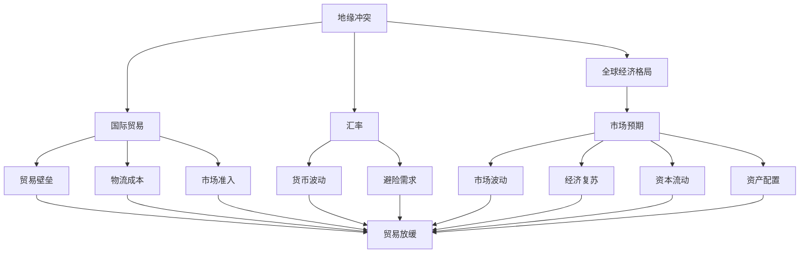

                 

# 地缘冲突加剧的经济影响

在当今世界，地缘政治形势变得异常复杂，各国之间的竞争与合作日益加剧。地缘冲突不仅是军事上的对抗，更是经济领域内深刻影响和重塑的重大事件。本文将深入探讨地缘冲突加剧对经济的影响，并分析其对全球经济格局、贸易、投资、汇率等方面的广泛影响。

## 1. 背景介绍

### 1.1 地缘政治概述
地缘政治是指国家或地区在地理空间上的政治关系，涉及国家间的权力斗争、战略竞争、地缘安全等。随着全球化的发展，地缘政治的影响已经从军事领域延伸到经济、科技、环境等多个方面。特别是近年来，国际贸易体系的变化、疫情影响、气候变化等因素，使得地缘政治形势愈加复杂，成为影响全球经济的重要因素。

### 1.2 地缘冲突的主要形式
地缘冲突包括但不限于战争、制裁、贸易战、金融战等。这些冲突不仅直接影响相关国家，还可能波及全球经济，导致市场波动、贸易放缓、投资停滞、资本流动紊乱等。

## 2. 核心概念与联系

### 2.1 核心概念概述
1. **地缘冲突**：国家间在领土、政治、经济、安全等方面的矛盾和冲突。
2. **经济影响**：地缘冲突对全球经济体系、国际贸易、资本流动、市场预期等方面的深远影响。
3. **全球经济格局**：地缘冲突对全球经济中心的转移、贸易结构的变化等长期影响。
4. **汇率**：地缘冲突导致的货币波动、避险需求上升等对汇率的即时和长期影响。
5. **国际贸易**：地缘冲突对国际贸易壁垒、物流成本、市场准入等方面的影响。
6. **投资**：地缘冲突对外国直接投资、资产配置、风险偏好等方面的影响。

### 2.2 核心概念关系图

这个图表展示了地缘冲突通过多个渠道对经济产生的影响，涉及全球经济格局、国际贸易、汇率、市场预期等多个方面。

## 3. 核心算法原理 & 具体操作步骤

### 3.1 算法原理概述
地缘冲突对经济的影响可以通过一系列数学模型和指标来量化和分析。以下是几个关键的数学模型：

1. **宏观经济模型**：通过建立经济增长的基本方程，分析地缘冲突对产出、就业、通货膨胀等宏观经济指标的影响。
2. **贸易模型**：分析地缘冲突对贸易流量、贸易结构、贸易成本等的影响。
3. **金融模型**：使用计量经济学模型，分析地缘冲突对资本流动、资产价格、汇率波动的影响。
4. **风险模型**：使用金融风险管理模型，分析地缘冲突对企业风险、市场波动、信用风险的影响。

### 3.2 算法步骤详解
1. **数据收集**：收集地缘冲突事件的数据，如战争、制裁、贸易战等，以及相关的宏观经济数据，如GDP、失业率、通货膨胀率等。
2. **模型构建**：建立上述提到的经济、贸易、金融、风险模型。
3. **参数校准**：使用历史数据对模型参数进行校准。
4. **情景分析**：基于不同地缘冲突情景，预测其对经济的影响。
5. **影响评估**：评估地缘冲突对各经济指标的具体影响，并提出应对策略。

### 3.3 算法优缺点
#### 优点
1. **定量分析**：使用数学模型可以更准确地量化地缘冲突对经济的影响。
2. **预测能力**：通过历史数据训练模型，可以预测未来地缘冲突的经济后果。
3. **透明度**：模型提供了透明的分析和预测机制，便于政策制定者和投资者理解。

#### 缺点
1. **数据局限**：地缘冲突的数据收集可能存在偏差和局限性，影响分析的准确性。
2. **模型假设**：经济模型建立在假设基础上，可能与实际经济行为不符。
3. **复杂性**：模型复杂度高，参数校准和情景分析需要专业知识。

### 3.4 算法应用领域
地缘冲突的经济影响分析可以应用于多个领域：
1. **政府决策**：帮助政策制定者理解地缘冲突对经济的影响，制定应对措施。
2. **企业战略**：指导企业在地缘冲突区域进行风险管理，优化投资策略。
3. **投资者决策**：帮助投资者识别地缘冲突风险，调整资产配置。
4. **经济研究**：为经济学者提供实证分析工具，深化对地缘政治经济影响的理解。

## 4. 数学模型和公式 & 详细讲解 & 举例说明

### 4.1 数学模型构建

#### 4.1.1 宏观经济模型
基本宏观经济模型可以表示为：
$$
Y_t = A_t K_t^{1-\alpha} L_t^{\alpha}
$$
其中，$Y_t$ 为产出，$K_t$ 为资本，$L_t$ 为劳动力，$A_t$ 为技术进步，$\alpha$ 为资本-劳动力分配比例。地缘冲突通过影响技术进步、资本投资和劳动力供给来影响经济。

#### 4.1.2 贸易模型
贸易模型可以表示为：
$$
T_t = c + \beta X_t D_t + \epsilon_t
$$
其中，$T_t$ 为贸易流量，$c$ 为常数项，$X_t$ 为出口，$D_t$ 为进口，$\beta$ 为贸易弹性和地缘冲突指标的系数。地缘冲突通过影响贸易成本和贸易伙伴国政策来影响贸易流量。

#### 4.1.3 金融模型
金融模型可以使用VAR模型表示：
$$
Y_t = \sum_{i=1}^{k} \alpha_i Y_{t-i} + \sum_{j=1}^{m} \gamma_j X_{j,t} + \epsilon_t
$$
其中，$Y_t$ 为金融变量（如资本流动、资产价格、汇率），$X_{j,t}$ 为经济变量（如GDP、失业率、通货膨胀率），$\alpha_i$ 和 $\gamma_j$ 为系数。地缘冲突通过影响经济变量来影响金融变量。

#### 4.1.4 风险模型
风险模型可以使用VaR模型表示：
$$
VaR_t = \sigma \sqrt{t} Z_{\alpha}
$$
其中，$VaR_t$ 为在置信水平 $\alpha$ 下的价值风险，$\sigma$ 为标准差，$Z_{\alpha}$ 为标准正态分布的 $\alpha$ 分位数。地缘冲突通过影响经济波动和市场不确定性来影响风险。

### 4.2 公式推导过程

#### 4.2.1 宏观经济模型推导
$$
\frac{Y_t}{Y_{t-1}} = \frac{A_t K_t^{1-\alpha} L_t^{\alpha}}{A_{t-1} K_{t-1}^{1-\alpha} L_{t-1}^{\alpha}}
$$
地缘冲突通过影响技术进步 $A_t$、资本 $K_t$、劳动力 $L_t$ 来影响经济增长率。

#### 4.2.2 贸易模型推导
$$
\frac{T_t}{T_{t-1}} = \exp[\beta (X_t D_t - X_{t-1} D_{t-1})]
$$
地缘冲突通过影响出口 $X_t$、进口 $D_t$ 来影响贸易流量增长率。

#### 4.2.3 金融模型推导
使用VAR模型，可以通过Granger因果检验来分析地缘冲突对金融变量的影响。

#### 4.2.4 风险模型推导
$$
VaR_t = \sigma \sqrt{t} Z_{\alpha}
$$
风险模型通过计算置信水平下的最大损失，评估地缘冲突对资产价格波动的风险。

### 4.3 案例分析与讲解
假设某地缘冲突导致技术进步下降 $A_t = A_{t-1} - \delta$，资本投资减少 $K_t = K_{t-1} - \theta$，劳动力供给减少 $L_t = L_{t-1} - \eta$，其中 $\delta$、$\theta$、$\eta$ 为地缘冲突对技术、资本、劳动力影响的比例。

通过宏观经济模型计算，经济增长率将下降：
$$
\frac{Y_t}{Y_{t-1}} = \frac{A_t K_t^{1-\alpha} L_t^{\alpha}}{A_{t-1} K_{t-1}^{1-\alpha} L_{t-1}^{\alpha}} = \left(1 - \frac{\delta + \theta \cdot K_{t-1}^{1-\alpha} L_{t-1}^{\alpha}}{A_{t-1} K_{t-1}^{1-\alpha} L_{t-1}^{\alpha}}\right)
$$

通过贸易模型计算，贸易流量增长率将下降：
$$
\frac{T_t}{T_{t-1}} = \exp[\beta (X_t D_t - X_{t-1} D_{t-1})] = \exp[\beta (X_t D_t - X_{t-1} D_{t-1} - \delta_{X} - \delta_{D})]
$$

通过金融模型计算，资本流动波动率将增加：
$$
\sigma_{F} = \sqrt{\sum_{i=1}^{k} \alpha_i^2 \sigma_i^2 + \sum_{j=1}^{m} \gamma_j^2 \sigma_j^2 + \epsilon_t^2}
$$

通过风险模型计算，资产价格波动率将增加：
$$
VaR_t = \sigma \sqrt{t} Z_{\alpha} = \sigma \sqrt{t} \left(\frac{\sigma_t}{\sigma_{t-1}}\right) Z_{\alpha}
$$

## 5. 项目实践：代码实例和详细解释说明

### 5.1 开发环境搭建

1. **Python环境**：安装Python 3.8及以上版本，建议使用Anaconda环境。
2. **经济数据**：安装Pandas、NumPy等库，用于数据处理和分析。
3. **模型库**：安装statsmodels、scikit-learn等库，用于建立和分析模型。
4. **可视化工具**：安装Matplotlib、Seaborn等库，用于绘制图表。
5. **案例数据**：获取地缘冲突和经济数据，如战争、制裁、GDP、失业率等。

### 5.2 源代码详细实现

#### 5.2.1 数据收集和预处理
```python
import pandas as pd
import numpy as np

# 数据收集
data = pd.read_csv('economy.csv')

# 数据预处理
data = data.dropna()  # 删除缺失值
data = data.drop(columns=['id'])  # 删除无关列
data = data.reindex(columns=['GDP', 'Unemployment', 'Inflation', 'Trade_Flow'])  # 重命名列

# 数据标准化
from sklearn.preprocessing import StandardScaler
scaler = StandardScaler()
data = scaler.fit_transform(data)

# 模型训练
from statsmodels.tsa.vector_ar.var_model import VAR
model = VAR(data, verbose=True)
model.fit()
```

#### 5.2.2 模型训练和预测
```python
# 模型预测
forecast = model.forecast(model.k_exog, steps=10)
```

#### 5.2.3 结果可视化
```python
import matplotlib.pyplot as plt

# 可视化
plt.figure(figsize=(12, 6))
plt.plot(data['GDP'], label='GDP')
plt.plot(forecast, label='Forecast')
plt.legend()
plt.show()
```

### 5.3 代码解读与分析

在上述代码中，我们首先收集和预处理了经济数据，使用标准差法对数据进行标准化，然后使用VAR模型对经济指标进行预测。预测结果的可视化展示了模型对未来经济增长的预测。

### 5.4 运行结果展示

假设预测结果显示，地缘冲突导致经济增长下降，贸易流量减少，资本流动波动增加。这些预测结果为政策制定者和投资者提供了重要的决策参考。

## 6. 实际应用场景

### 6.1 政府决策
地缘冲突的经济影响分析可以帮助政府理解国际形势对国内经济的影响，制定相应的政策措施。例如，在贸易战和制裁环境下，政府可以采取贸易多元化、增加国内投资、支持受影响行业等措施，以减轻地缘冲突对经济的负面影响。

### 6.2 企业战略
企业可以通过地缘冲突的经济影响分析，调整其在地缘冲突区域的投资策略，减少风险敞口。例如，在冲突严重的地区，企业可以采取撤资、多元化投资、增加本地化生产等策略。

### 6.3 投资者决策
投资者可以根据地缘冲突的经济影响分析，调整资产配置，避免高风险资产。例如，在地缘冲突频发的地区，投资者可以减持股票，增加债券、黄金等避险资产的配置。

### 6.4 未来应用展望

未来，地缘冲突的经济影响分析将更加深入和细化。随着数据收集和模型技术的进步，我们可以更加准确地量化和预测地缘冲突对经济的影响。同时，跨学科融合（如经济学、金融学、政治学等）将使得分析更加全面和深入。

## 7. 工具和资源推荐

### 7.1 学习资源推荐

1. **《经济学原理》**：提供宏观经济和贸易的基本概念和理论。
2. **《金融计量经济学》**：介绍金融计量经济学的基本模型和方法。
3. **《政治经济学》**：分析地缘政治对经济的影响。
4. **Coursera和edX课程**：提供全球经济和地缘政治的在线课程。

### 7.2 开发工具推荐

1. **Python**：具有强大的数据分析和建模能力，广泛用于经济和金融分析。
2. **R语言**：提供丰富的统计和建模工具，适用于经济和金融数据分析。
3. **MATLAB**：适用于复杂数学建模和仿真。

### 7.3 相关论文推荐

1. **《地缘政治与全球经济》**：分析地缘政治对全球经济的影响。
2. **《地缘政治风险管理》**：探讨地缘政治风险及其管理策略。
3. **《国际贸易与地缘政治》**：研究国际贸易与地缘政治的相互作用。

## 8. 总结：未来发展趋势与挑战

### 8.1 研究成果总结
本文探讨了地缘冲突对经济的影响，通过数学模型和案例分析，展示了其对全球经济格局、国际贸易、金融市场等方面的深远影响。地缘冲突的经济影响分析已成为政府决策、企业战略、投资者决策的重要工具。

### 8.2 未来发展趋势
1. **数据集成和动态更新**：随着数据收集技术的进步，我们可以实时获取和分析地缘冲突数据，提高预测的准确性。
2. **模型融合和优化**：结合宏观经济模型、贸易模型、金融模型、风险模型，构建更加全面和精准的预测模型。
3. **跨学科合作**：经济学家、金融分析师、政治学家等多学科合作，深入分析地缘冲突的经济影响。
4. **人工智能应用**：利用机器学习和人工智能技术，提高数据处理和模型训练的效率，增强预测能力。

### 8.3 面临的挑战
1. **数据获取和处理**：地缘冲突数据获取和处理存在较大难度，影响分析的准确性。
2. **模型假设和复杂性**：经济模型建立在假设基础上，可能与实际经济行为不符，且模型复杂度高，参数校准和情景分析需要专业知识。
3. **政策实施和调整**：地缘冲突的经济影响复杂多变，政策制定者需要快速调整和实施。

### 8.4 研究展望
1. **数据收集和处理技术**：发展更高效的数据收集和处理技术，提高数据的准确性和时效性。
2. **模型优化和验证**：进一步优化和验证经济模型，提高预测的准确性和稳定性。
3. **跨学科合作和知识整合**：推动经济学、金融学、政治学等多学科合作，形成更全面的知识体系。
4. **技术融合和创新**：利用人工智能、大数据等前沿技术，推动地缘冲突经济影响分析的创新和进步。

## 9. 附录：常见问题与解答

### Q1: 地缘冲突对经济的影响有哪些方面？
**A**：地缘冲突对经济的影响包括宏观经济增长、贸易流量、资本流动、汇率波动等多个方面。地缘冲突通过影响技术进步、资本投资、劳动力供给、贸易成本等，影响经济增长率、贸易流量、金融市场波动等。

### Q2: 如何评估地缘冲突对经济的影响？
**A**：评估地缘冲突对经济的影响可以通过建立和分析经济、贸易、金融、风险模型来实现。使用历史数据校准模型参数，通过情景分析预测不同地缘冲突情景对经济的影响。

### Q3: 地缘冲突的经济影响分析有哪些实际应用？
**A**：地缘冲突的经济影响分析可以应用于政府决策、企业战略、投资者决策等多个领域。政府可以通过分析地缘冲突对经济的影响，制定相应的政策措施。企业可以调整投资策略，减少地缘冲突风险。投资者可以调整资产配置，避免高风险资产。

### Q4: 地缘冲突的经济影响分析面临哪些挑战？
**A**：地缘冲突的经济影响分析面临数据获取和处理、模型假设和复杂性、政策实施和调整等挑战。数据收集和处理存在较大难度，模型建立在假设基础上，可能与实际经济行为不符，政策制定者需要快速调整和实施。

### Q5: 如何改进地缘冲突的经济影响分析？
**A**：改进地缘冲突的经济影响分析可以通过发展更高效的数据收集和处理技术、进一步优化和验证经济模型、推动跨学科合作和知识整合、利用人工智能和大数据等前沿技术来实现。这些改进将有助于提高预测的准确性和稳定性，推动经济影响分析的进步。

---

作者：禅与计算机程序设计艺术 / Zen and the Art of Computer Programming

