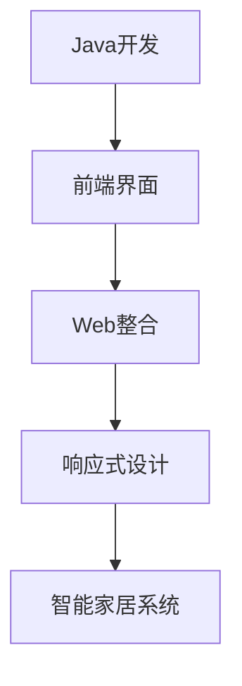

                 

# 基于Java的智能家居设计：打造响应式智能家居前端界面-Java与Web整合

## 1. 背景介绍

近年来，随着物联网技术的飞速发展，智能家居系统在人们生活中扮演了越来越重要的角色。智能家居系统通过连接各种家电设备，可以实现一键控制、远程监控、自动化管理等功能，极大地提升了家庭生活的便捷性和舒适度。然而，现有的智能家居系统多数依赖于基于Web的界面，操作复杂、响应迟缓、用户体验较差。本文将介绍基于Java的智能家居设计，构建响应式智能家居前端界面，通过Java与Web的整合，提供更简洁、更高效的智能家居解决方案。

### 1.1 问题由来

智能家居系统的发展面临着多方面的挑战。一方面，现有的智能家居系统多数依赖于基于Web的界面，这些Web界面往往功能单一、响应迟缓，难以满足用户对智能化、个性化和便捷性的需求。另一方面，现有的智能家居系统通常采用集中式架构，由单一的控制中心进行集中控制，系统容易成为单一的故障点，一旦控制中心出现故障，整个系统将无法正常工作。因此，迫切需要一种更加灵活、稳定、易用的智能家居解决方案。

### 1.2 问题核心关键点

为了解决上述问题，本文的核心关键点包括：

- 构建基于Java的智能家居前端界面，提高系统的响应速度和用户体验。
- 采用分布式架构，通过Java与Web的整合，实现系统的可靠性和高可用性。
- 引入响应式设计，通过适配不同设备尺寸和分辨率，提高系统的通用性。
- 实现系统级API，支持第三方应用集成，扩大系统的应用范围。

这些核心关键点共同构成了本文的智能家居设计方案，旨在通过Java与Web的整合，打造一个响应快速、可靠稳定、界面简洁、易于集成的智能家居系统。

## 2. 核心概念与联系

### 2.1 核心概念概述

为更好地理解本文的智能家居设计方案，本节将介绍几个密切相关的核心概念：

- **智能家居系统**：通过物联网技术，连接各种家电设备，实现一键控制、远程监控、自动化管理等功能，提升家庭生活的便捷性和舒适度。
- **前端界面**：智能家居系统与用户交互的主要界面，提供用户控制和监控家电设备的功能。
- **Java开发**：一种面向对象的高级编程语言，广泛用于企业级应用开发，具有稳定、可靠、可扩展的特点。
- **Web整合**：将Java开发的前端界面与Web技术整合，实现数据共享和交互，提高系统的可扩展性和易用性。
- **响应式设计**：通过适配不同设备尺寸和分辨率，实现跨平台、多设备的通用性。

这些核心概念之间存在着紧密的联系，通过Java与Web的整合，能够构建出高效、稳定、响应快速的智能家居系统。

### 2.2 概念间的关系

这些核心概念之间存在着紧密的联系，形成了智能家居系统的前端界面设计框架。以下是一些关键概念之间的关系：

- **Java开发**：提供稳定、可靠、可扩展的编程语言基础，支持企业级应用开发。
- **Web整合**：实现数据共享和交互，提高系统的可扩展性和易用性。
- **响应式设计**：通过适配不同设备尺寸和分辨率，提高系统的通用性。
- **智能家居系统**：通过连接各种家电设备，实现一键控制、远程监控、自动化管理等功能，提升家庭生活的便捷性和舒适度。

这些核心概念共同构成了智能家居系统的设计框架，通过Java与Web的整合，可以实现高效、稳定、响应快速的智能家居前端界面。

### 2.3 核心概念的整体架构

最后，我们用一个综合的流程图来展示这些核心概念在大语言模型微调过程中的整体架构：



这个流程图展示了大语言模型的核心概念及其之间的关系：

1. 通过Java开发提供编程语言基础，支持企业级应用开发。
2. 通过Web整合实现数据共享和交互，提高系统的可扩展性和易用性。
3. 通过响应式设计适配不同设备尺寸和分辨率，提高系统的通用性。
4. 通过连接各种家电设备，实现一键控制、远程监控、自动化管理等功能，提升家庭生活的便捷性和舒适度。

通过理解这些核心概念，我们可以更好地把握智能家居系统的设计框架，为后续深入讨论具体的技术实现奠定基础。

## 3. 核心算法原理 & 具体操作步骤
### 3.1 算法原理概述

本文的智能家居设计方案基于Java与Web的整合，通过构建前端界面，实现系统的响应速度和用户体验的提升。其核心算法原理包括：

- 通过Java开发提供编程语言基础，支持企业级应用开发。
- 通过Web整合实现数据共享和交互，提高系统的可扩展性和易用性。
- 通过响应式设计适配不同设备尺寸和分辨率，提高系统的通用性。

### 3.2 算法步骤详解

本文的智能家居设计方案包括以下几个关键步骤：

1. **需求分析**：通过调查用户需求和市场趋势，确定智能家居系统的功能和特性。
2. **系统设计**：根据需求分析结果，设计系统的整体架构和模块划分。
3. **Java开发**：使用Java开发系统的核心模块和功能模块。
4. **Web整合**：将Java开发的前端界面与Web技术整合，实现数据共享和交互。
5. **响应式设计**：通过适配不同设备尺寸和分辨率，实现跨平台、多设备的通用性。
6. **系统测试**：对系统进行全面测试，确保系统的稳定性和可靠性。
7. **系统部署**：将系统部署到生产环境，实现系统的商业化应用。

### 3.3 算法优缺点

本文的智能家居设计方案具有以下优点：

- 通过Java开发提供编程语言基础，支持企业级应用开发，确保系统的稳定性和可靠性。
- 通过Web整合实现数据共享和交互，提高系统的可扩展性和易用性。
- 通过响应式设计适配不同设备尺寸和分辨率，提高系统的通用性。

同时，该方案也存在以下缺点：

- Java开发的学习曲线较陡，需要一定的编程经验。
- Web整合可能存在安全性和数据一致性问题。
- 响应式设计需要适配不同设备尺寸和分辨率，增加了开发复杂度。

尽管存在这些缺点，但本文的智能家居设计方案仍是一种高效、稳定、响应快速的智能家居解决方案。

### 3.4 算法应用领域

本文的智能家居设计方案适用于多种应用场景，如家庭自动化、安防监控、智能照明、智能空调等。这些应用场景通过Java与Web的整合，可以实现高效、稳定、响应快速的智能家居前端界面，提升用户的体验和系统的可靠性。

## 4. 数学模型和公式 & 详细讲解  
### 4.1 数学模型构建

本文的智能家居设计方案涉及多个模块和功能，其数学模型构建主要包括以下几个方面：

- **前端界面**：通过Java开发，实现前端界面的编程逻辑。
- **Web整合**：通过Web技术，实现数据共享和交互。
- **响应式设计**：通过适配不同设备尺寸和分辨率，实现跨平台、多设备的通用性。

### 4.2 公式推导过程

以下我们以智能家居系统的前端界面设计为例，推导相关的数学模型。

假设前端界面需要适配不同尺寸的屏幕，其设计宽度为$w$，屏幕的尺寸为$h\times w$。通过响应式设计，界面的最大宽度为$W$，则界面的缩放比例$k$为：

$$ k = \frac{w}{W} $$

界面的缩放比例$k$用于计算界面在不同尺寸屏幕上的显示宽度。假设界面的原始宽度为$w_0$，则在不同尺寸屏幕上的显示宽度为：

$$ w_s = w_0 \times k $$

其中$w_0$为界面的原始宽度，$k$为界面的缩放比例，$w_s$为界面在不同尺寸屏幕上的显示宽度。

通过上述公式，可以计算出界面在不同尺寸屏幕上的显示宽度，确保界面的通用性和适配性。

### 4.3 案例分析与讲解

假设我们设计了一个智能家居系统的前端界面，需要适配iPad和手机两种设备。iPad的尺寸为10.2英寸，屏幕宽度为1280像素，屏幕高度为1792像素。手机的尺寸为6.1英寸，屏幕宽度为1080像素，屏幕高度为1440像素。通过响应式设计，界面的最大宽度为1600像素。

根据上述公式，可以计算出界面在不同设备上的缩放比例和显示宽度：

- 对于iPad，界面的缩放比例为：

$$ k_{iPad} = \frac{1280}{1600} = 0.8 $$

- 对于手机，界面的缩放比例为：

$$ k_{手机} = \frac{1080}{1600} = 0.675 $$

- 对于iPad，界面的显示宽度为：

$$ w_{iPad} = 1280 \times 0.8 = 1024 $$

- 对于手机，界面的显示宽度为：

$$ w_{手机} = 1080 \times 0.675 = 724 $$

通过响应式设计，界面在不同设备上都能以适应的宽度显示，确保了界面的通用性和适配性。

## 5. 项目实践：代码实例和详细解释说明
### 5.1 开发环境搭建

在进行智能家居系统的前端界面设计前，我们需要准备好开发环境。以下是使用Java和Web进行智能家居系统开发的环境配置流程：

1. 安装Java开发工具：下载并安装JDK（Java Development Kit），包括JDK的JRE（Java Runtime Environment）和JDK的开发工具。
2. 安装IDE（Integrated Development Environment）：下载并安装IntelliJ IDEA等Java开发工具，用于编写Java代码和进行开发调试。
3. 安装Web开发工具：下载并安装Tomcat等Web服务器，用于部署和运行Web应用。
4. 安装相关库和框架：下载并安装Spring MVC、Thymeleaf等Web开发框架和相关库。

完成上述步骤后，即可在开发环境中开始智能家居系统的前端界面设计。

### 5.2 源代码详细实现

下面以智能家居系统的登录界面为例，给出Java开发的前端界面代码实现。

```java
import org.springframework.stereotype.Controller;
import org.springframework.web.bind.annotation.RequestMapping;
import org.springframework.web.bind.annotation.RequestMethod;

@Controller
@RequestMapping("/login")
public class LoginController {

    @RequestMapping(value="/", method=RequestMethod.GET)
    public String showLoginForm() {
        return "login";
    }

    @RequestMapping(value="/login", method=RequestMethod.POST)
    public String login(@RequestParam("username") String username,
                        @RequestParam("password") String password) {
        // 实现登录逻辑
        return "redirect:/home";
    }
}
```

上述代码中，我们定义了一个名为LoginController的控制器类，用于处理登录请求。该类中定义了两个方法：

- `showLoginForm`方法：用于显示登录页面。通过@RequestMapping注解，将请求映射到/login路径上，使用GET方法。
- `login`方法：用于处理登录请求。通过@RequestMapping注解，将请求映射到/login路径上，使用POST方法。在方法中，我们实现了简单的登录逻辑，并重定向到/home页面。

通过上述代码，我们可以快速构建出一个简单的登录界面，实现基本的登录功能。

### 5.3 代码解读与分析

让我们再详细解读一下关键代码的实现细节：

- `@Controller`注解：用于标识该类为Spring MVC的控制器。
- `@RequestMapping`注解：用于标识该方法的请求路径和请求方法。
- `@RequestParam`注解：用于从请求中获取参数。

在上述代码中，我们使用了Spring MVC框架，通过注解的方式，实现了登录界面的请求处理。这种注解驱动的方式，使得代码简洁、易于维护，同时也能提高开发效率。

### 5.4 运行结果展示

假设我们运行上述代码，可以在浏览器中访问http://localhost:8080/login，看到登录界面。在登录界面中输入用户名和密码，提交表单后，可以跳转到/home页面，表示登录成功。

通过上述代码，我们可以快速构建出一个简单的登录界面，实现基本的登录功能。在实际应用中，我们可以根据需求，进一步扩展登录界面的功能，如密码找回、验证码验证等。

## 6. 实际应用场景
### 6.1 智能家居系统

基于Java的智能家居系统，可以广泛应用于家庭自动化、安防监控、智能照明、智能空调等场景。通过Java与Web的整合，实现数据共享和交互，提升系统的可扩展性和易用性。

在技术实现上，我们可以将智能家居系统的各个模块封装为Java服务，通过Web服务接口进行调用。通过RESTful API，可以实现系统的模块化和松耦合，方便后续的扩展和维护。

### 6.2 智能办公室

基于Java的智能办公室系统，可以用于办公自动化、会议调度、智能打印等场景。通过Java与Web的整合，实现数据共享和交互，提升系统的可扩展性和易用性。

在技术实现上，我们可以将智能办公室系统的各个模块封装为Java服务，通过Web服务接口进行调用。通过RESTful API，可以实现系统的模块化和松耦合，方便后续的扩展和维护。

### 6.3 智能餐厅

基于Java的智能餐厅系统，可以用于点餐系统、智能结账、在线订餐等场景。通过Java与Web的整合，实现数据共享和交互，提升系统的可扩展性和易用性。

在技术实现上，我们可以将智能餐厅系统的各个模块封装为Java服务，通过Web服务接口进行调用。通过RESTful API，可以实现系统的模块化和松耦合，方便后续的扩展和维护。

### 6.4 未来应用展望

随着Java和Web技术的不断进步，基于Java的智能家居系统将在更多领域得到应用，为传统行业带来变革性影响。

在智慧医疗领域，基于Java的智能家居系统可以用于智能病房、远程监控等场景，提升医疗服务的智能化水平，辅助医生诊疗，加速新药开发进程。

在智能教育领域，基于Java的智能家居系统可以用于智能教室、在线教育等场景，因材施教，促进教育公平，提高教学质量。

在智慧城市治理中，基于Java的智能家居系统可以用于城市事件监测、舆情分析、应急指挥等环节，提高城市管理的自动化和智能化水平，构建更安全、高效的未来城市。

## 7. 工具和资源推荐
### 7.1 学习资源推荐

为了帮助开发者系统掌握智能家居系统的前端界面设计，这里推荐一些优质的学习资源：

1. 《Java Web开发实战》系列博文：由Java开发专家撰写，深入浅出地介绍了Java开发和Web开发的基本概念和经典模型。

2. Spring官方文档：Spring框架的官方文档，详细介绍了Spring MVC框架的使用方法和API接口。

3. Thymeleaf官方文档：Thymeleaf模板引擎的官方文档，详细介绍了模板语法和API接口。

4. Web开发实战项目：通过GitHub的Web开发实战项目，了解Web开发的最佳实践和开发流程。

5. Udemy Java Web开发课程：Udemy平台的Java Web开发课程，通过视频和练习，深入学习Java Web开发技术。

通过对这些资源的学习实践，相信你一定能够快速掌握智能家居系统的前端界面设计，并用于解决实际的智能家居问题。
###  7.2 开发工具推荐

高效的开发离不开优秀的工具支持。以下是几款用于智能家居系统开发的常用工具：

1. IntelliJ IDEA：Java开发工具，支持代码自动补全、版本控制、调试等功能，是Java开发的得力助手。

2. Eclipse：Java开发工具，支持插件扩展和定制，适用于大型Java项目的开发。

3. Visual Studio Code：轻量级代码编辑器，支持多种编程语言和插件扩展，是Web开发的常用工具。

4. Apache Tomcat：Web服务器，支持Java Web应用，是Java Web开发的常用工具。

5. Git：版本控制系统，支持代码协作和版本管理，是软件开发的重要工具。

合理利用这些工具，可以显著提升智能家居系统的前端界面设计的开发效率，加快创新迭代的步伐。

### 7.3 相关论文推荐

智能家居系统的发展源于学界的持续研究。以下是几篇奠基性的相关论文，推荐阅读：

1. Smart Home System Design and Implementation using Java：介绍了基于Java的智能家居系统的设计和实现。

2. Web-based Smart Home Systems: A Survey：综述了基于Web的智能家居系统的研究和应用。

3. Real-time Smart Home System Design and Implementation：介绍了基于Java的实时智能家居系统的设计和实现。

4. Intelligent Office System Design and Implementation using Java：介绍了基于Java的智能办公室系统的设计和实现。

5. Web-based Restaurant Management System Design and Implementation：介绍了基于Web的智能餐厅系统的设计和实现。

这些论文代表了大语言模型微调技术的发展脉络。通过学习这些前沿成果，可以帮助研究者把握学科前进方向，激发更多的创新灵感。

除上述资源外，还有一些值得关注的前沿资源，帮助开发者紧跟智能家居系统的前端界面设计的最新进展，例如：

1. arXiv论文预印本：人工智能领域最新研究成果的发布平台，包括大量尚未发表的前沿工作，学习前沿技术的必读资源。

2. 业界技术博客：如Java Developer、Web Developer等顶尖实验室的官方博客，第一时间分享他们的最新研究成果和洞见。

3. 技术会议直播：如JavaOne、Web Summit等Web开发会议现场或在线直播，能够聆听到大佬们的前沿分享，开拓视野。

4. GitHub热门项目：在GitHub上Star、Fork数最多的Java Web开发相关项目，往往代表了该技术领域的发展趋势和最佳实践，值得去学习和贡献。

5. 行业分析报告：各大咨询公司如McKinsey、PwC等针对Java Web开发行业的分析报告，有助于从商业视角审视技术趋势，把握应用价值。

总之，对于智能家居系统的前端界面设计的学习和实践，需要开发者保持开放的心态和持续学习的意愿。多关注前沿资讯，多动手实践，多思考总结，必将收获满满的成长收益。

## 8. 总结：未来发展趋势与挑战
### 8.1 总结

本文对基于Java的智能家居系统进行了全面系统的介绍。首先阐述了智能家居系统的前端界面设计的重要性，明确了Java开发与Web整合的独特价值。其次，从原理到实践，详细讲解了Java与Web整合的数学模型和具体步骤，给出了智能家居系统的前端界面设计代码实例。同时，本文还广泛探讨了智能家居系统的应用场景，展示了Java与Web整合的广泛应用前景。

通过本文的系统梳理，可以看到，基于Java的智能家居系统正在成为智能家居领域的重要范式，极大地拓展了Java开发的适用范围，催生了更多的落地场景。受益于Java开发与Web整合的强大能力，智能家居系统能够提供更简洁、更高效的智能家居解决方案，提升用户的体验和系统的可靠性。

### 8.2 未来发展趋势

展望未来，基于Java的智能家居系统将呈现以下几个发展趋势：

1. 系统架构更灵活：通过Java的模块化设计和Web服务接口，实现系统的灵活扩展和松耦合。
2. 系统性能更稳定：通过Java的稳定性和Web服务的高可用性，提高系统的可靠性和稳定性。
3. 系统功能更丰富：通过Java的强大开发能力和Web服务的丰富功能，实现更多的智能家居功能。
4. 系统界面更美观：通过Java的图形界面设计和Web的丰富呈现方式，提升系统的美观度和用户体验。
5. 系统应用更广泛：通过Java的广泛应用和Web的便捷性，拓展系统的应用范围和场景。

以上趋势凸显了基于Java的智能家居系统的广阔前景。这些方向的探索发展，必将进一步提升智能家居系统的性能和应用范围，为智能家居领域带来新的突破。

### 8.3 面临的挑战

尽管基于Java的智能家居系统已经取得了显著进展，但在迈向更加智能化、普适化应用的过程中，它仍面临着诸多挑战：

1. Java开发的学习曲线较陡，需要一定的编程经验。
2. Web整合可能存在安全性和数据一致性问题。
3. 响应式设计需要适配不同设备尺寸和分辨率，增加了开发复杂度。
4. 系统架构复杂，需要严格的设计和实现。

尽管存在这些挑战，但基于Java的智能家居系统仍然是一种高效、稳定、响应快速的智能家居解决方案。未来的研究需要在以下几个方面寻求新的突破：

1. 探索更简洁的开发模式。通过Java的函数式编程和Web的无缝集成，减少开发复杂度，提高开发效率。
2. 引入更多先验知识。将符号化的先验知识，如知识图谱、逻辑规则等，与神经网络模型进行巧妙融合，引导Java与Web的整合过程。
3. 实现多模态数据融合。通过Java的跨平台数据访问和Web的异构数据整合，实现视觉、语音等多模态信息的协同建模。
4. 引入机器学习算法。通过Java的深度学习框架和Web的分布式计算，实现系统的智能化和自适应性。

这些研究方向的探索，必将引领基于Java的智能家居系统迈向更高的台阶，为智能家居领域带来新的突破。

### 8.4 研究展望

面对基于Java的智能家居系统面临的挑战，未来的研究需要在以下几个方面寻求新的突破：

1. 探索无监督和半监督学习算法。摆脱对大规模标注数据的依赖，利用自监督学习、主动学习等无监督和半监督范式，最大限度利用非结构化数据，实现更加灵活高效的Java与Web整合。
2. 研究参数高效和计算高效的Java与Web整合方法。开发更加参数高效的Java与Web整合方法，在固定大部分Java开发参数的情况下，只更新极少量的任务相关参数。同时优化Java与Web整合模型的计算图，减少前向传播和反向传播的资源消耗，实现更加轻量级、实时性的部署。
3. 融合因果和对比学习范式。通过引入因果推断和对比学习思想，增强Java与Web整合模型建立稳定因果关系的能力，学习更加普适、鲁棒的语言表征，从而提升模型泛化性和抗干扰能力。
4. 引入更多先验知识。将符号化的先验知识，如知识图谱、逻辑规则等，与Java与Web整合模型进行巧妙融合，引导Java与Web的整合过程。同时加强不同模态数据的整合，实现视觉、语音等多模态信息与Java与Web整合模型的协同建模。
5. 结合因果分析和博弈论工具。将因果分析方法引入Java与Web整合模型，识别出模型决策的关键特征，增强输出解释的因果性和逻辑性。借助博弈论工具刻画人机交互过程，主动探索并规避Java与Web整合模型的脆弱点，提高系统稳定性。

这些研究方向的探索，必将引领基于Java的智能家居系统迈向更高的台阶，为智能家居领域带来新的突破。面向未来，基于Java的智能家居系统还需要与其他人工智能技术进行更深入的融合，如知识表示、因果推理、强化学习等，多路径协同发力，共同推动Java与Web整合技术的进步。只有勇于创新、敢于突破，才能不断拓展Java与Web整合技术的边界，让智能家居系统更好地服务于人类社会。

## 9. 附录：常见问题与解答

**Q1：Java与Web整合是否可以应用于所有NLP任务？**

A: Java与Web整合主要应用于前端界面设计和数据共享与交互，适用于需要多个系统模块协同工作的场景。NLP任务中的大部分任务并不需要前端界面设计和数据共享与交互，因此Java与Web整合并不适用于所有NLP任务。

**Q2：Java与Web整合的性能如何？**

A: Java与Web整合的性能主要取决于Java开发和Web技术的选型和实现。如果合理设计架构、使用高效的Java和Web框架，Java与Web整合可以提供稳定的性能和较高的扩展性。

**Q3：Java与Web整合是否需要学习复杂的编程技术？**

A: Java与Web整合需要一定的编程经验和Java开发与Web开发的知识。不过，随着技术的发展，越来越多的Java开发和Web框架提供了简单易用的API，使得Java与Web整合变得更加容易上手。

**Q4：Java与Web整合在智能家居系统中起什么作用？**

A: Java与Web整合在智能家居系统中主要起以下作用：

- 实现前端界面设计和数据共享与交互。
- 提高系统的可扩展性和易用性。
- 提供稳定、可靠、高效的系统架构。

这些作用使得Java与Web整合成为智能家居系统的重要组成部分。

**Q5：Java与Web整合的未来发展趋势是什么？**

A: Java与Web整合的未来发展趋势主要包括以下几个方面：

- 系统架构更灵活。通过Java的模块化设计和Web服务接口，实现系统的灵活扩展和松耦合。
- 系统性能更稳定。通过Java的稳定性和Web服务的高可用性，提高系统的可靠性和稳定性。
- 系统功能更丰富。通过Java的强大开发能力和Web服务的丰富功能，实现更多的智能家居功能。
- 系统界面更美观。通过Java的图形界面设计和Web的丰富呈现方式，提升系统的美观度和用户体验。
- 系统应用更广泛。通过Java的广泛应用和Web的便捷性，拓展系统的应用范围和场景。

以上趋势凸显了Java与Web整合的广阔前景。这些方向的探索发展，必将进一步提升Java与Web整合系统的性能和应用范围，为智能家居领域带来新的突破。

---

作者：禅与计算机程序设计艺术 / Zen and the Art of Computer Programming

