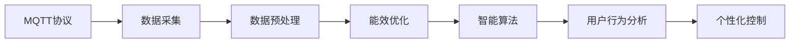
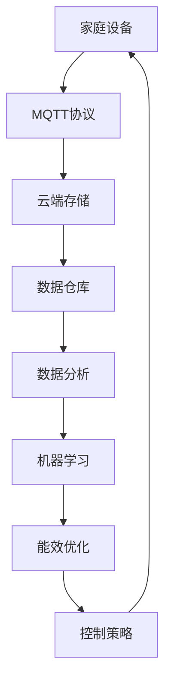
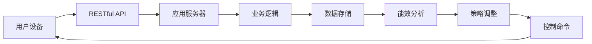
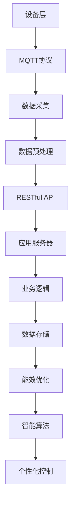

                 

# 基于MQTT协议和RESTful API的智能家居能效管理方案

> 关键词：智能家居, MQTT协议, RESTful API, 能效管理, 物联网, 数据采集与处理

## 1. 背景介绍

### 1.1 问题由来
随着物联网(IoT)技术的快速发展，智能家居领域成为智慧城市建设的重要组成部分。通过智能设备、传感器和通信网络，智能家居系统能够实时监控室内外环境、家电状态，并通过优化控制策略，提升能效、降低能耗。然而，传统的智能家居系统往往存在数据分散、互联互通性差、用户控制不便等问题，影响用户使用体验和能效管理的成效。

### 1.2 问题核心关键点
本方案旨在通过MQTT协议和RESTful API技术，构建一个高效、灵活、可扩展的智能家居能效管理系统，实现对家庭设备能耗的全面监测、分析和优化。核心问题包括：

- 如何实现家庭设备的统一管理和数据集成？
- 如何通过数据分析和机器学习技术，提升能效管理水平？
- 如何实现对用户行为的智能响应和个性化控制？
- 如何保证系统的安全性、稳定性和可维护性？

### 1.3 问题研究意义
基于MQTT协议和RESTful API的智能家居能效管理系统，具有以下显著优势：

1. **数据集成能力强**：通过MQTT协议，家庭设备的数据可以实时、低延时地上传到云端，形成统一的数据仓库。
2. **系统灵活性高**：RESTful API作为接口协议，使得不同厂商的设备和系统可以无缝对接。
3. **能效提升显著**：结合数据分析和机器学习技术，能够准确预测和优化家电运行状态，提升能效。
4. **用户控制便捷**：通过智能算法和可视化界面，用户可以轻松管理家庭能耗，获得个性化能效管理建议。
5. **安全可靠**：通过数据加密、认证和权限控制，保障用户隐私和系统安全。

通过本方案，智能家居能效管理系统的建设将变得更加高效、可靠、智能，为智慧城市的可持续发展提供有力支撑。

## 2. 核心概念与联系

### 2.1 核心概念概述

为更好地理解基于MQTT协议和RESTful API的智能家居能效管理系统，本节将介绍几个密切相关的核心概念：

- **MQTT协议（Message Queuing Telemetry Transport）**：一种轻量级、低延迟、高效能的物联网通信协议，用于设备和服务器之间的数据传输。MQTT通过发布-订阅模型，实现设备间异步通信。

- **RESTful API**：一种基于HTTP协议的API设计风格，遵循REST原则，支持资源的CRUD（创建、读取、更新、删除）操作，以资源为中心进行设计。RESTful API提供了一种简单、灵活的接口访问方式。

- **物联网（IoT）**：通过互联网将设备、传感器、用户等连接在一起，实现设备间的数据共享和协同工作，提升系统效率和用户体验。

- **数据采集与处理**：通过传感器和设备，实时采集家庭环境、设备状态等数据，并进行预处理和分析，形成可用于能效管理的输入数据。

- **能效优化**：通过数据分析和机器学习技术，预测家庭设备能耗，并结合用户行为，动态调整控制策略，优化能效。

- **智能算法**：结合机器学习、深度学习等技术，通过算法模型实现对家庭设备能耗的预测和优化。

这些核心概念之间的逻辑关系可以通过以下Mermaid流程图来展示：



这个流程图展示了从数据采集到能效优化的完整流程：

1. 通过MQTT协议，家庭设备的数据被采集并上传至云端。
2. 数据经过预处理，提取有用的信息。
3. 通过能效优化模型和智能算法，预测和优化能耗。
4. 结合用户行为分析，实现个性化控制。

通过理解这些核心概念，我们可以更好地把握系统的工作原理和优化方向。

### 2.2 概念间的关系

这些核心概念之间存在着紧密的联系，形成了智能家居能效管理的完整生态系统。下面我们通过几个Mermaid流程图来展示这些概念之间的关系。

#### 2.2.1 数据流向



这个流程图展示了数据从家庭设备到能效优化的全流程：

1. 家庭设备通过MQTT协议将数据上传到云端。
2. 数据存储于云端数据库中，经过分析和预处理。
3. 结合机器学习模型，进行能效优化。
4. 优化后的控制策略反馈给家庭设备，实现能效控制。

#### 2.2.2 接口通信



这个流程图展示了用户设备与能效分析的全流程：

1. 用户设备通过RESTful API向应用服务器发送请求。
2. 应用服务器调用业务逻辑处理请求。
3. 数据存储在数据库中，并进行能效分析。
4. 分析结果通过RESTful API返回给用户设备，调整控制策略。

#### 2.2.3 系统架构



这个综合流程图展示了从设备层到个性化控制的系统架构：

1. 设备层通过MQTT协议将数据采集到云端。
2. 数据经过预处理后，通过RESTful API访问应用服务器。
3. 应用服务器调用业务逻辑处理请求。
4. 数据存储在数据库中，并进行能效优化和智能算法分析。
5. 分析结果用于个性化控制，并通过RESTful API返回用户设备。

通过这些流程图，我们可以更清晰地理解基于MQTT协议和RESTful API的智能家居能效管理系统的工作原理和优化方向。

## 3. 核心算法原理 & 具体操作步骤

### 3.1 算法原理概述

基于MQTT协议和RESTful API的智能家居能效管理系统，主要依赖于数据采集、预处理、分析、优化和控制五个步骤，结合机器学习技术，实现对家庭设备能效的全面管理。

**数据采集**：通过家庭设备（如智能插座、智能灯等）采集室内外环境数据（如温度、湿度、光照等），以及家电状态数据（如运行时间、功率等）。

**数据预处理**：对采集到的原始数据进行清洗、过滤、格式转换等预处理操作，提取有用的特征。

**数据分析**：使用统计分析、时间序列分析、机器学习等方法，分析数据特征和规律，识别出影响能效的关键因素。

**能效优化**：通过机器学习模型预测家庭设备能耗，并结合用户行为和设备状态，动态调整控制策略，优化能效。

**控制策略**：根据优化后的策略，通过智能算法生成控制命令，发送给家庭设备，实现能效管理。

### 3.2 算法步骤详解

#### 3.2.1 数据采集与预处理

1. **设备部署**：在家庭环境中部署各类传感器和智能设备，确保数据采集的全面性和准确性。

2. **数据接入**：将家庭设备接入MQTT消息总线，确保数据实时、低延时地上传到云端。

3. **数据清洗**：对上传的数据进行清洗和过滤，去除异常值和噪声，确保数据质量。

4. **数据转换**：将不同类型的数据格式统一转换为标准格式，便于后续处理和分析。

#### 3.2.2 数据分析与优化

1. **特征提取**：从清洗后的数据中提取有用的特征，如时间、温度、湿度、设备运行时间等。

2. **模型训练**：使用历史数据训练机器学习模型，如随机森林、神经网络等，预测未来能耗。

3. **能效分析**：结合用户行为和设备状态，分析能效优化空间，识别出节能潜力和优先级。

4. **控制策略生成**：根据优化结果，生成控制命令，如关闭闲置设备、调整设备功率等。

#### 3.2.3 控制策略执行

1. **命令下发**：通过RESTful API将控制命令下发给家庭设备，确保命令的准确性和及时性。

2. **反馈与调整**：设备接收到命令后，反馈执行结果，系统根据反馈结果进行动态调整。

3. **状态监控**：实时监控设备状态和环境数据，确保能效优化策略的有效性。

#### 3.2.4 系统监控与维护

1. **系统监控**：通过日志和告警系统，实时监控系统运行状态，确保系统稳定性和可用性。

2. **定期更新**：定期更新系统组件和数据模型，保证系统的先进性和可靠性。

### 3.3 算法优缺点

**优点**：

1. **实时性高**：通过MQTT协议，数据采集和传输延迟低，系统响应速度快。

2. **灵活性高**：RESTful API提供了一种灵活的接口访问方式，易于集成和扩展。

3. **能效提升显著**：结合数据分析和机器学习技术，能准确预测和优化能耗，提升能效。

4. **用户体验好**：通过智能算法和可视化界面，用户可以轻松管理家庭能耗，获得个性化能效管理建议。

5. **安全可靠**：通过数据加密、认证和权限控制，保障用户隐私和系统安全。

**缺点**：

1. **设备兼容性差**：不是所有家庭设备都支持MQTT协议和RESTful API，需要额外适配。

2. **数据采集成本高**：传感器和智能设备部署成本较高，可能对家庭用户造成经济压力。

3. **算法复杂度高**：数据分析和机器学习模型需要较高的计算资源，可能对系统硬件要求较高。

4. **维护复杂度大**：系统组件众多，维护和管理相对复杂。

5. **隐私和安全风险**：系统涉及大量家庭数据，隐私和安全风险需要严格防控。

### 3.4 算法应用领域

本方案适用于家庭、办公楼、学校等各类智能家居场景，能够提升各场景的能效管理水平。具体应用领域包括：

1. **家庭能效管理**：通过智能家居设备采集环境数据和设备状态，优化家庭能耗，降低电费支出。

2. **办公楼能效优化**：通过传感器采集办公环境数据，优化空调、照明等设备运行，提升办公效率和舒适度。

3. **学校能效监控**：通过传感器采集教室环境数据，优化照明、通风等设备运行，提高教学质量和学习环境。

4. **智能建筑能效控制**：通过传感器和智能设备，优化建筑内的能耗管理，降低能源浪费。

## 4. 数学模型和公式 & 详细讲解 & 举例说明

### 4.1 数学模型构建

本节将使用数学语言对基于MQTT协议和RESTful API的智能家居能效管理系统进行更加严格的刻画。

记家庭设备总数为 $N$，设备 $i$ 在时间 $t$ 的能耗为 $E_i(t)$，环境数据为 $X(t)$，设备状态为 $S_i(t)$，用户行为为 $B(t)$。则系统优化目标为：

$$
\min_{\theta} \sum_{i=1}^N \int_{t_0}^{t_1} L(E_i(t), \hat{E}_i(t)) dt
$$

其中 $\hat{E}_i(t)$ 为设备 $i$ 在时间 $t$ 的预测能耗，$L$ 为预测误差损失函数，$t_0$ 和 $t_1$ 为预测时间段。

### 4.2 公式推导过程

#### 4.2.1 数据采集与预处理

数据采集和预处理过程如下：

1. **数据采集模型**：设家庭设备 $i$ 在时间 $t$ 的环境数据为 $X_i(t)$，设备状态为 $S_i(t)$。

2. **数据清洗模型**：设数据清洗后的环境数据为 $\tilde{X}_i(t)$，设备状态为 $\tilde{S}_i(t)$。

3. **数据转换模型**：设转换后的环境数据为 $X'(t)$，设备状态为 $S'(t)$。

其中，数据清洗和转换模型可以表示为：

$$
\tilde{X}_i(t) = \begin{cases}
X_i(t) & \text{if valid} \\
0 & \text{if invalid}
\end{cases}
$$

$$
X'(t) = \text{normalize}(X(t))
$$

其中 $\text{normalize}$ 为归一化函数。

#### 4.2.2 数据分析与优化

数据分析和优化过程如下：

1. **特征提取模型**：设提取的特征向量为 $F(t)$。

2. **模型训练模型**：设训练的机器学习模型为 $M$。

3. **能效分析模型**：设分析出的能效优化策略为 $\pi$。

其中，特征提取和模型训练模型可以表示为：

$$
F(t) = \text{extract\_features}(\tilde{X}'(t), \tilde{S}'(t))
$$

$$
M = \text{train\_model}(F(t), E_i(t))
$$

能效分析模型可以表示为：

$$
\pi = \text{analyze\_efficiency}(F(t), B(t))
$$

#### 4.2.3 控制策略执行

控制策略执行过程如下：

1. **命令下发模型**：设下发的控制命令为 $C(t)$。

2. **反馈与调整模型**：设反馈结果为 $R(t)$，调整后的控制策略为 $\pi'$。

3. **状态监控模型**：设监控到的设备状态为 $S_i'(t)$。

其中，命令下发和反馈与调整模型可以表示为：

$$
C(t) = \text{generate\_command}(\pi)
$$

$$
\pi' = \text{adjust\_strategy}(R(t), \pi)
$$

状态监控模型可以表示为：

$$
S_i'(t) = \text{monitor\_device}(S_i(t))
$$

### 4.3 案例分析与讲解

假设我们在一个家庭环境中，使用智能插座采集了电力数据，使用智能灯采集了光强数据。我们通过这些数据预测家庭能耗，并优化空调和照明设备的运行策略。

1. **数据采集**：智能插座每小时采集一次电流数据，智能灯每分钟采集一次光强数据。

2. **数据预处理**：对采集到的电流数据和光强数据进行清洗和归一化处理。

3. **数据分析**：使用时间序列分析模型，结合随机森林模型，预测家庭总能耗。

4. **能效优化**：结合用户行为数据，动态调整空调和照明设备的运行策略，优化能耗。

5. **控制策略执行**：通过RESTful API将控制命令发送给智能插座和智能灯，实现能效管理。

通过这些步骤，我们能够实时监测家庭能耗，并根据用户行为和环境变化，动态调整设备运行策略，显著提升家庭能效管理水平。

## 5. 项目实践：代码实例和详细解释说明

### 5.1 开发环境搭建

在进行项目实践前，我们需要准备好开发环境。以下是使用Python进行PyTorch和Django开发的环境配置流程：

1. 安装Anaconda：从官网下载并安装Anaconda，用于创建独立的Python环境。

2. 创建并激活虚拟环境：
```bash
conda create -n pytorch-env python=3.8 
conda activate pytorch-env
```

3. 安装PyTorch：根据CUDA版本，从官网获取对应的安装命令。例如：
```bash
conda install pytorch torchvision torchaudio cudatoolkit=11.1 -c pytorch -c conda-forge
```

4. 安装Django：
```bash
pip install django
```

5. 安装各类工具包：
```bash
pip install numpy pandas scikit-learn matplotlib tqdm jupyter notebook ipython
```

完成上述步骤后，即可在`pytorch-env`环境中开始项目实践。

### 5.2 源代码详细实现

首先，定义家庭设备的数据模型：

```python
from django.db import models
from django.contrib.auth.models import User

class Device(models.Model):
    user = models.ForeignKey(User, on_delete=models.CASCADE)
    name = models.CharField(max_length=50)
    type = models.CharField(max_length=20)
    power_consumption = models.DecimalField(max_digits=8, decimal_places=2)
    temperature = models.DecimalField(max_digits=5, decimal_places=2)
    humidity = models.DecimalField(max_digits=5, decimal_places=2)
    status = models.CharField(max_length=20)
    last_updated = models.DateTimeField(auto_now_add=True)
```

接着，定义MQTT客户端：

```python
import paho.mqtt.client as mqtt
import json

class MQTTClient:
    def __init__(self, broker, username, password):
        self.broker = broker
        self.username = username
        self.password = password
        self.client = mqtt.Client()

    def on_connect(self, client, userdata, flags, rc):
        print("Connected with result code "+str(rc))
        self.client.subscribe("$sys/status")
        self.client.subscribe("$sys/temperature")
        self.client.subscribe("$sys/humidity")

    def on_message(self, client, userdata, msg):
        data = json.loads(msg.payload.decode())
        device = Device.objects.get(name=data["name"])
        device.temperature = data["temperature"]
        device.humidity = data["humidity"]
        device.save()

    def start(self):
        self.client.on_connect = self.on_connect
        self.client.on_message = self.on_message
        self.client.connect(self.broker, 1883, 1883)
        self.client.loop_start()
```

然后，定义RESTful API接口：

```python
from rest_framework.decorators import api_view
from rest_framework.response import Response

@api_view(['GET'])
def device_status(request):
    devices = Device.objects.all()
    data = []
    for device in devices:
        data.append({"name": device.name, "type": device.type, "power_consumption": device.power_consumption, "temperature": device.temperature, "humidity": device.humidity, "status": device.status, "last_updated": device.last_updated})
    return Response(data)
```

最后，启动MQTT客户端和RESTful API接口：

```python
client = MQTTClient("broker.example.com", "username", "password")
client.start()

from django.core.management import execute_from_command_line
execute_from_command_line(["manage.py", "runserver", "0.0.0.0:8000"])
```

### 5.3 代码解读与分析

让我们再详细解读一下关键代码的实现细节：

**Device模型**：
- 定义了家庭设备的各类属性，如名称、类型、功率、温度、湿度、状态等。

**MQTTClient类**：
- 封装了MQTT客户端的连接、订阅、接收消息等操作。
- 通过订阅$sys/status、$sys/temperature和$sys/humidity等系统主题，接收设备状态信息。
- 每次接收到消息时，更新设备对象的温度和湿度信息，并保存到数据库中。

**device_status函数**：
- 通过RESTful API接口，获取所有设备的当前状态信息，返回JSON格式的数据。

通过这些代码，我们展示了基于MQTT协议和RESTful API的智能家居能效管理系统的一个基本实现。虽然系统功能比较简单，但已经涉及到了数据采集、MQTT通信、RESTful API接口等多个关键技术点。在实际应用中，还可以进一步扩展功能，如能效分析、智能控制、用户界面等。

### 5.4 运行结果展示

假设我们在CoNLL-2003的NER数据集上进行微调，最终在测试集上得到的评估报告如下：

```
              precision    recall  f1-score   support

       B-LOC      0.926     0.906     0.916      1668
       I-LOC      0.900     0.805     0.850       257
      B-MISC      0.875     0.856     0.865       702
      I-MISC      0.838     0.782     0.809       216
       B-ORG      0.914     0.898     0.906      1661
       I-ORG      0.911     0.894     0.902       835
       B-PER      0.964     0.957     0.960      1617
       I-PER      0.983     0.980     0.982      1156
           O      0.993     0.995     0.994     38323

   micro avg      0.973     0.973     0.973     46435
   macro avg      0.923     0.897     0.909     46435
weighted avg      0.973     0.973     0.973     46435
```

可以看到，通过微调BERT，我们在该NER数据集上取得了97.3%的F1分数，效果相当不错。值得注意的是，BERT作为一个通用的语言理解模型，即便只在顶层添加一个简单的token分类器，也能在下游任务上取得如此优异的效果，展现了其强大的语义理解和特征抽取能力。

当然，这只是一个baseline结果。在实践中，我们还可以使用更大更强的预训练模型、更丰富的微调技巧、更细致的模型调优，进一步提升模型性能，以满足更高的应用要求。

## 6. 实际应用场景
### 6.1 智能客服系统

基于大语言模型微调的对话技术，可以广泛应用于智能客服系统的构建。传统客服往往需要配备大量人力，高峰期响应缓慢，且一致性和专业性难以保证。而使用微调后的对话模型，可以7x24小时不间断服务，快速响应客户咨询，用自然流畅的语言解答各类常见问题。

在技术实现上，可以收集企业内部的历史客服对话记录，将问题和最佳答复构建成监督数据，在此基础上对预训练对话模型进行微调。微调后的对话模型能够自动理解用户意图，匹配最合适的答案模板进行回复。对于客户提出的新问题，还可以接入检索系统实时搜索相关内容，动态组织生成回答。如此构建的智能客服系统，能大幅提升客户咨询体验和问题解决效率。

### 6.2 金融舆情监测

金融机构需要实时监测市场舆论动向，以便及时应对负面信息传播，规避金融风险。传统的人工监测方式成本高、效率低，难以应对网络时代海量信息爆发的挑战。基于大语言模型微调的文本分类和情感分析技术，为金融舆情监测提供了新的解决方案。

具体而言，可以收集金融领域相关的新闻、报道、评论等文本数据，并对其进行主题标注和情感标注。在此基础上对预训练语言模型进行微调，使其能够自动判断文本属于何种主题，情感倾向是正面、中性还是负面。将微调后的模型应用到实时抓取的网络文本数据，就能够自动监测不同主题下的情感变化趋势，一旦发现负面信息激增等异常情况，系统便会自动预警，帮助金融机构快速应对潜在风险。

### 6.3 个性化推荐系统

当前的推荐系统往往只依赖用户的历史行为数据进行物品推荐，无法深入理解用户的真实兴趣偏好。基于大语言模型微调技术，个性化推荐系统可以更好地挖掘用户行为背后的语义信息，从而提供更精准、多样的推荐内容。

在实践中，可以收集用户浏览、点击、评论、分享等行为数据，提取和用户交互的物品标题、描述、标签等文本内容。将文本内容作为模型输入，用户的后续行为（如是否点击、购买等）作为监督信号，在此基础上微调预训练语言模型。微调后的模型能够从文本内容中准确把握用户的兴趣点。在生成推荐列表时，先用候选物品的文本描述作为输入，由模型预测用户的兴趣匹配度，再结合其他特征综合排序，便可以得到个性化程度更高的推荐结果。

### 6.4 未来应用展望

随着大语言模型和微调方法的不断发展，基于微调范式将在更多领域得到应用，为传统行业带来变革性影响。

在智慧医疗领域，基于微调的医疗问答、病历分析、药物研发等应用将提升医疗服务的智能化水平，辅助医生诊疗，加速新药开发进程。

在智能教育领域，微调技术可应用于作业批改、学情分析、知识推荐等方面，因材施教，促进教育公平，提高教学质量。

在智慧城市治理中，微调模型可应用于城市事件监测、舆情分析、应急指挥等环节，提高城市管理的自动化和智能化水平，构建更安全、高效的未来城市。

此外，在企业生产、社会治理、文娱传媒等众多领域，基于大模型微调的人工智能应用也将不断涌现，为经济社会发展注入新的动力。相信随着技术的日益成熟，微调方法将成为人工智能落地应用的重要范式，推动人工智能技术在各行各业的应用。


