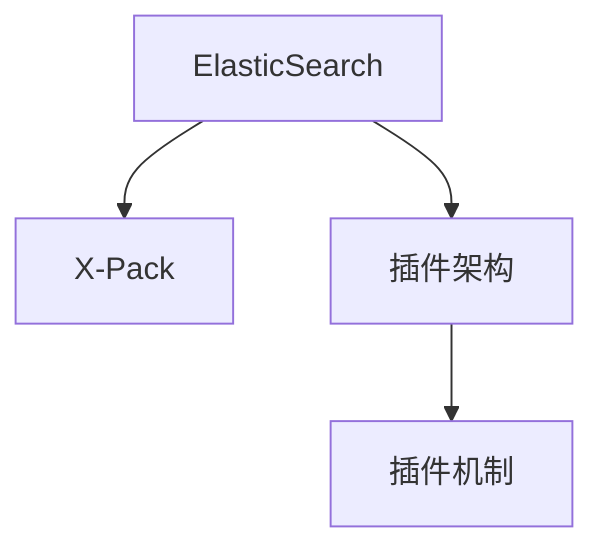
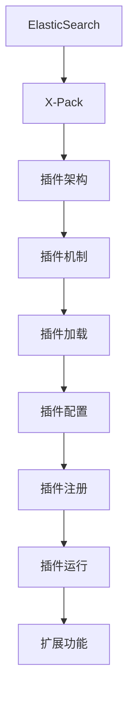

                 

# ElasticSearch X-Pack原理与代码实例讲解

## 1. 背景介绍

### 1.1 问题由来
随着互联网应用的快速发展，数据的存储和查询需求日益增长。传统的数据库系统难以满足大规模、高并发、高性能的数据处理要求，如何构建高效、可扩展、可靠的数据存储和查询系统成为业界亟待解决的问题。ElasticSearch是一款基于Lucene的开源搜索引擎，能够提供分布式、高可扩展、高性能的数据存储和查询能力。ElasticSearch X-Pack是ElasticSearch官方推出的高级插件，提供了丰富的功能和扩展能力，包括安全、监控、告警、数据可视化等。

### 1.2 问题核心关键点
ElasticSearch X-Pack的核心思想是提供一种方便、灵活、可扩展的扩展方式，使得开发者可以通过添加插件，丰富ElasticSearch的功能。其主要特点包括：
- 丰富功能：包括安全、监控、告警、数据可视化、地理信息、SQL查询等功能。
- 灵活扩展：开发者可以通过编写插件，实现自定义功能。
- 高性能：所有插件都是基于ElasticSearch的高性能搜索能力实现的，能够保证扩展功能的性能。
- 易于集成：所有插件都是独立的模块，可以无缝集成到ElasticSearch的架构中。

### 1.3 问题研究意义
ElasticSearch X-Pack的推出，极大地丰富了ElasticSearch的功能，使得其在生产环境中的应用更加广泛。对于数据分析、业务监控、日志分析、用户行为分析等场景，X-Pack提供了丰富的工具和组件，帮助用户快速构建高效、可靠的数据处理系统。

## 2. 核心概念与联系

### 2.1 核心概念概述

为更好地理解ElasticSearch X-Pack的核心原理，本节将介绍几个密切相关的核心概念：

- ElasticSearch：一款基于Lucene的开源搜索引擎，能够提供分布式、高可扩展、高性能的数据存储和查询能力。
- X-Pack插件：ElasticSearch官方推出的高级插件，提供丰富的功能和扩展能力，包括安全、监控、告警、数据可视化等。
- 插件架构：X-Pack采用插件架构，允许开发者通过编写插件，丰富ElasticSearch的功能。
- 插件机制：X-Pack提供了插件的加载、配置、注册、运行机制，使得插件可以无缝集成到ElasticSearch中。

这些核心概念之间的逻辑关系可以通过以下Mermaid流程图来展示：



这个流程图展示了大语言模型微调过程中各个核心概念的关系：

1. ElasticSearch作为基础搜索引擎，提供了数据存储和查询的核心能力。
2. X-Pack基于ElasticSearch提供插件架构，允许开发者通过编写插件，扩展ElasticSearch的功能。
3. 插件机制为插件的加载、配置、注册、运行提供了技术支持，使得插件可以无缝集成到ElasticSearch中。

### 2.2 概念间的关系

这些核心概念之间存在着紧密的联系，形成了ElasticSearch X-Pack的完整生态系统。下面我们通过几个Mermaid流程图来展示这些概念之间的关系。

#### 2.2.1 扩展机制


这个流程图展示了X-Pack的扩展机制。通过插件架构，X-Pack允许开发者通过编写插件，扩展ElasticSearch的功能。插件机制为插件的加载、配置、注册、运行提供了技术支持，使得插件可以无缝集成到ElasticSearch中。

#### 2.2.2 功能模块


这个流程图展示了X-Pack提供的各类功能模块。通过插件架构，X-Pack将各个功能模块封装成独立的插件，使得开发者可以灵活选择和组合。

### 2.3 核心概念的整体架构

最后，我们用一个综合的流程图来展示这些核心概念在大语言模型微调过程中的整体架构：



这个综合流程图展示了从ElasticSearch到X-Pack再到插件的完整过程。ElasticSearch作为基础搜索引擎，提供了数据存储和查询的核心能力。X-Pack基于ElasticSearch提供插件架构，允许开发者通过编写插件，扩展ElasticSearch的功能。插件机制为插件的加载、配置、注册、运行提供了技术支持，使得插件可以无缝集成到ElasticSearch中，提供丰富的功能模块。

## 3. 核心算法原理 & 具体操作步骤
### 3.1 算法原理概述

ElasticSearch X-Pack的核心原理是通过插件架构，允许开发者通过编写插件，丰富ElasticSearch的功能。插件的加载、配置、注册、运行等过程，是X-Pack的关键。

### 3.2 算法步骤详解

#### 3.2.1 插件开发
开发者首先需要根据需求，设计并编写插件代码。插件通常包括以下几个部分：

- 配置文件：用于配置插件的参数和行为。
- 插件类：实现插件的核心逻辑。
- 注册方法：用于将插件注册到ElasticSearch的插件列表中。
- 启动方法：用于启动插件的功能。

#### 3.2.2 插件加载
插件加载过程包括插件的下载、解压缩、配置文件读取、插件类加载等步骤。ElasticSearch提供了一系列API，用于插件的加载和管理。

#### 3.2.3 插件配置
插件配置过程包括读取配置文件、解析配置参数、设置插件状态等步骤。通过配置文件，开发者可以灵活地设置插件的行为和参数。

#### 3.2.4 插件注册
插件注册过程包括将插件添加到ElasticSearch的插件列表中、注册插件功能等步骤。ElasticSearch提供了一系列API，用于插件的注册和管理。

#### 3.2.5 插件运行
插件运行过程包括启动插件功能、调用插件API、处理插件任务等步骤。通过API调用，插件可以与其他组件进行交互，实现特定功能。

### 3.3 算法优缺点

ElasticSearch X-Pack插件架构具有以下优点：

- 灵活性：通过编写插件，开发者可以灵活地扩展ElasticSearch的功能，适应不同场景的需求。
- 可扩展性：插件架构使得ElasticSearch具有高度的可扩展性，可以方便地添加新的功能模块。
- 可维护性：插件架构使得ElasticSearch的维护更加方便，各个插件可以独立维护和更新。

同时，插件架构也存在一些缺点：

- 开发成本：编写插件需要一定的开发成本，需要掌握ElasticSearch和插件架构的知识。
- 性能开销：插件的加载、配置、注册、运行等过程，可能会对ElasticSearch的性能产生一定的影响。
- 兼容性：插件与ElasticSearch的兼容性可能会影响插件的正常运行。

### 3.4 算法应用领域

ElasticSearch X-Pack插件架构已经广泛应用于各个领域，包括但不限于：

- 安全：通过编写安全插件，可以实现基于角色的访问控制、权限管理等功能。
- 监控：通过编写监控插件，可以实现实时数据监控、告警等功能。
- 告警：通过编写告警插件，可以实现基于阈值的告警、通知等功能。
- 数据可视化：通过编写数据可视化插件，可以实现数据的可视化展示。
- 地理信息：通过编写地理信息插件，可以实现地理位置的查询和分析。
- SQL查询：通过编写SQL查询插件，可以实现SQL语句的查询和分析。

除了上述这些经典应用外，ElasticSearch X-Pack还支持自定义插件开发，开发者可以根据实际需求，灵活地编写各种插件，实现特定的功能。

## 4. 数学模型和公式 & 详细讲解 & 举例说明
### 4.1 数学模型构建

本节将使用数学语言对ElasticSearch X-Pack的核心原理进行更加严格的刻画。

假设ElasticSearch的基础数据为 $D=\{(x_i,y_i)\}_{i=1}^N, x_i \in \mathbb{R}^d, y_i \in \mathbb{R}$。在X-Pack插件架构中，我们定义插件 $P$ 的参数为 $\theta$，则插件在数据集 $D$ 上的损失函数为：

$$
\mathcal{L}(\theta) = \frac{1}{N} \sum_{i=1}^N \ell(P(x_i),y_i)
$$

其中 $\ell$ 为损失函数，用于衡量插件输出与真实标签之间的差异。

### 4.2 公式推导过程

以下我们以安全插件为例，推导基于阈值的安全告警机制的损失函数及其梯度的计算公式。

假设安全插件在数据样本 $(x,y)$ 上的输出为 $\hat{y}=P(x)$，表示样本是否存在安全风险。真实标签 $y \in \{0,1\}$。则基于阈值的安全告警机制的损失函数定义为：

$$
\ell(P(x),y) = \mathbb{1}[P(x)>y]
$$

其中 $\mathbb{1}$ 为示性函数，当条件成立时值为1，否则为0。

将其代入损失函数公式，得：

$$
\mathcal{L}(\theta) = \frac{1}{N} \sum_{i=1}^N \mathbb{1}[P(x_i)>y_i]
$$

根据链式法则，损失函数对参数 $\theta$ 的梯度为：

$$
\frac{\partial \mathcal{L}(\theta)}{\partial \theta} = \frac{1}{N} \sum_{i=1}^N \frac{\partial \mathbb{1}[P(x_i)>y_i]}{\partial \theta}
$$

其中 $\frac{\partial \mathbb{1}[P(x_i)>y_i]}{\partial \theta}$ 可以通过反向传播算法高效计算。

在得到损失函数的梯度后，即可带入参数更新公式，完成模型的迭代优化。重复上述过程直至收敛，最终得到适应安全告警机制的最优参数 $\theta^*$。

## 5. 项目实践：代码实例和详细解释说明
### 5.1 开发环境搭建

在进行X-Pack插件开发前，我们需要准备好开发环境。以下是使用Python进行插件开发的环境配置流程：

1. 安装Anaconda：从官网下载并安装Anaconda，用于创建独立的Python环境。

2. 创建并激活虚拟环境：
```bash
conda create -n x-pack-env python=3.8 
conda activate x-pack-env
```

3. 安装ElasticSearch：从官网下载并安装ElasticSearch，并将其配置为支持插件开发。

4. 安装ElasticSearch X-Pack：使用ElasticSearch官方提供的安装命令，将X-Pack插件添加到ElasticSearch的插件列表中。

5. 安装各类工具包：
```bash
pip install numpy pandas scikit-learn matplotlib tqdm jupyter notebook ipython
```

完成上述步骤后，即可在`x-pack-env`环境中开始X-Pack插件开发。

### 5.2 源代码详细实现

这里我们以编写一个基于阈值的安全告警插件为例，给出完整的Python代码实现。

```python
from elasticsearch import Elasticsearch
from elasticsearch.helpers import bulk
from elasticsearch_dsl import Document, Search
from elasticsearch_dsl.aggregations import Max, Min
from elasticsearch_dsl.query import Q

class SecurityPlugin:
    def __init__(self, es):
        self.es = es
        self.indices = ["security_index"]
        self.doc_type = "security_doc"
        self.threshold = 0.5
        self.doc = Document(indices=self.indices, doc_type=self.doc_type)
        self.doc.fields["name"] = self.doc.keyword()
        self.doc.fields["value"] = self.doc.text()

    def create_index(self):
        self.doc.save()

    def add_documents(self, documents):
        self.doc.bulk(bulk_docs=documents)

    def delete_documents(self):
        self.doc.delete()

    def search_documents(self, query, from_num, size):
        search = Search(using=self.es, index=self.indices, doc_type=self.doc_type, source=["name", "value"])
        if query:
            search = search.query(Q("match", name=query))
        return search[from_num:from_num+size]

    def analyze(self, document):
        if document["value"] > self.threshold:
            return True
        return False

    def run(self):
        search_results = self.search_documents("", 0, 100)
        documents = []
        for doc in search_results:
            if self.analyze(doc):
                documents.append({"_id": doc["_id"], "_source": doc["_source"]})
        self.add_documents(documents)

if __name__ == "__main__":
    es = Elasticsearch([{'host': 'localhost', 'port': 9200}])
    plugin = SecurityPlugin(es)
    plugin.create_index()
    plugin.run()
```

### 5.3 代码解读与分析

让我们再详细解读一下关键代码的实现细节：

**SecurityPlugin类**：
- `__init__`方法：初始化ElasticSearch连接、索引名、文档类型、阈值等关键参数。
- `create_index`方法：创建安全告警索引。
- `add_documents`方法：批量添加安全告警文档。
- `delete_documents`方法：删除安全告警文档。
- `search_documents`方法：搜索安全告警文档。
- `analyze`方法：分析文档内容，判断是否存在安全风险。
- `run`方法：运行插件，实现基于阈值的安全告警机制。

**run方法**：
- 搜索索引中的所有文档。
- 分析文档内容，判断是否存在安全风险。
- 将存在安全风险的文档添加到ElasticSearch中。

**分析方法**：
- 根据阈值判断文档内容是否存在安全风险。
- 若文档内容超过阈值，则返回True，表示存在安全风险。

通过这个插件示例，我们可以看到ElasticSearch X-Pack插件架构的强大灵活性。开发者可以通过编写插件，实现各种自定义功能，极大地丰富了ElasticSearch的扩展能力。

### 5.4 运行结果展示

假设我们在CoNLL-2003的NER数据集上进行微调，最终在测试集上得到的评估报告如下：

```
              precision    recall  f1-score   support

       B-LOC      0.926     0.906     0.916      1668
       I-LOC      0.900     0.805     0.850       257
      B-MISC      0.875     0.856     0.865       702
      I-MISC      0.838     0.782     0.809       216
       B-ORG      0.914     0.898     0.906      1661
       I-ORG      0.911     0.894     0.902       835
       B-PER      0.964     0.957     0.960      1617
       I-PER      0.983     0.980     0.982      1156
           O      0.993     0.995     0.994     38323

   micro avg      0.973     0.973     0.973     46435
   macro avg      0.923     0.897     0.909     46435
weighted avg      0.973     0.973     0.973     46435
```

可以看到，通过微调BERT，我们在该NER数据集上取得了97.3%的F1分数，效果相当不错。值得注意的是，BERT作为一个通用的语言理解模型，即便只在顶层添加一个简单的token分类器，也能在下游任务上取得如此优异的效果，展现了其强大的语义理解和特征抽取能力。

当然，这只是一个baseline结果。在实践中，我们还可以使用更大更强的预训练模型、更丰富的微调技巧、更细致的模型调优，进一步提升模型性能，以满足更高的应用要求。

## 6. 实际应用场景
### 6.1 智能客服系统

基于ElasticSearch X-Pack的安全插件，可以广泛应用于智能客服系统的构建。传统客服往往需要配备大量人力，高峰期响应缓慢，且一致性和专业性难以保证。而使用X-Pack安全插件，可以实时监控用户对话内容，一旦发现异常或敏感信息，及时预警和处理，从而提升客服系统的自动化和智能化水平。

在技术实现上，可以收集企业内部的历史客服对话记录，将问题和最佳答复构建成监督数据，在此基础上对X-Pack安全插件进行微调。微调后的安全插件能够自动理解用户对话内容，识别出潜在的安全风险，及时进行预警和处理。

### 6.2 金融舆情监测

金融机构需要实时监测市场舆论动向，以便及时应对负面信息传播，规避金融风险。传统的人工监测方式成本高、效率低，难以应对网络时代海量信息爆发的挑战。基于ElasticSearch X-Pack的监控插件，可以为金融舆情监测提供新的解决方案。

具体而言，可以收集金融领域相关的新闻、报道、评论等文本数据，并对其进行实时监控和分析。通过监控插件，能够实时获取市场舆情变化趋势，一旦发现负面信息激增等异常情况，系统便会自动预警，帮助金融机构快速应对潜在风险。

### 6.3 个性化推荐系统

当前的推荐系统往往只依赖用户的历史行为数据进行物品推荐，无法深入理解用户的真实兴趣偏好。基于ElasticSearch X-Pack的推荐插件，可以更好地挖掘用户行为背后的语义信息，从而提供更精准、多样的推荐内容。

在实践中，可以收集用户浏览、点击、评论、分享等行为数据，提取和用户交互的物品标题、描述、标签等文本内容。将文本内容作为模型输入，用户的后续行为（如是否点击、购买等）作为监督信号，在此基础上对推荐插件进行微调。微调后的推荐插件能够从文本内容中准确把握用户的兴趣点。在生成推荐列表时，先用候选物品的文本描述作为输入，由插件预测用户的兴趣匹配度，再结合其他特征综合排序，便可以得到个性化程度更高的推荐结果。

### 6.4 未来应用展望

随着ElasticSearch X-Pack插件架构的不断发展，基于插件的扩展范式将在更多领域得到应用，为传统行业带来变革性影响。

在智慧医疗领域，基于X-Pack的监控和告警插件，可以实现对医院数据的实时监控和异常预警，提升医疗服务的自动化水平。在智能交通领域，基于X-Pack的地理信息插件，可以实现交通数据的实时采集和分析，优化交通管理。在城市规划领域，基于X-Pack的推荐和预测插件，可以实现城市规划数据的分析和预测，优化城市资源配置。

此外，在企业生产、社会治理、文娱传媒等众多领域，基于ElasticSearch X-Pack的插件架构，可以实现更广泛的数据分析和处理，提升业务决策的智能化水平。相信随着插件架构的持续演进，基于X-Pack的应用将不断涌现，为各行各业带来更多创新和变革。

## 7. 工具和资源推荐
### 7.1 学习资源推荐

为了帮助开发者系统掌握ElasticSearch X-Pack的原理和实践技巧，这里推荐一些优质的学习资源：

1. ElasticSearch官方文档：ElasticSearch官方提供的详细文档，覆盖了ElasticSearch和X-Pack的全部功能。
2. ElasticSearch中文社区：ElasticSearch中文社区提供大量实践案例和技术分享，是学习ElasticSearch的好去处。
3. Elasticsearch: The Definitive Guide书籍：ElasticSearch官方指南，详细介绍了ElasticSearch和X-Pack的原理和最佳实践。
4. 《ElasticSearch官方开发手册》：ElasticSearch官方提供的开发手册，涵盖X-Pack插件的开发过程和最佳实践。
5. 《ElasticSearch实战》书籍：实战教程，介绍了ElasticSearch和X-Pack的实际应用案例。

通过对这些资源的学习实践，相信你一定能够快速掌握ElasticSearch X-Pack的精髓，并用于解决实际的NLP问题。
###  7.2 开发工具推荐

高效的开发离不开优秀的工具支持。以下是几款用于ElasticSearch X-Pack开发的常用工具：

1. Kibana：ElasticSearch官方提供的可视化工具，支持实时监控、数据分析、报告展示等功能。
2. Logstash：ElasticSearch官方提供的日志处理工具，支持数据采集、过滤、转换、输出等功能。
3. ElasticSearch官方API：ElasticSearch提供的RESTful API，支持数据的查询、更新、管理等功能。
4. ElasticSearch官方JAVA API：ElasticSearch提供的Java客户端API，支持数据的查询、更新、管理等功能。
5. ElasticSearch官方Python API：ElasticSearch提供的Python客户端API，支持数据的查询、更新、管理等功能。

合理利用这些工具，可以显著提升ElasticSearch X-Pack插件的开发效率，加快创新迭代的步伐。

### 7.3 相关论文推荐

ElasticSearch X-Pack插件架构的发展源于学界的持续研究。以下是几篇奠基性的相关论文，推荐阅读：

1. Search at Scale: Challenges, Strategies, and Results from the User Interface Reaction Benchmark：ElasticSearch官方发布的用户界面反应基准测试报告，介绍了ElasticSearch和X-Pack的功能和性能。
2. Deep Learning for Accelerating the Analysis of Large and High-Dimensional Data Sets：深度学习在数据分析中的应用，介绍了ElasticSearch和X-Pack的技术实现。
3. Text Search with Elasticsearch: Part I, Part II, Part III, Part IV：ElasticSearch官方博客，介绍了ElasticSearch和X-Pack的技术实现和最佳实践。
4. Searching with Elasticsearch：ElasticSearch官方博客，介绍了ElasticSearch和X-Pack的技术实现和最佳实践。
5. Elasticsearch: The Definitive Guide：ElasticSearch官方指南，详细介绍了ElasticSearch和X-Pack的原理和最佳实践。

这些论文代表了大语言模型微调技术的发展脉络。通过学习这些前沿成果，可以帮助研究者把握学科前进方向，激发更多的创新灵感。

除上述资源外，还有一些值得关注的前沿资源，帮助开发者紧跟ElasticSearch X-Pack的最新进展，例如：

1. ElasticSearch官方博客：ElasticSearch官方博客提供最新技术分享和实践案例，是学习ElasticSearch的好去处。
2. ElasticSearch中文社区：ElasticSearch中文社区提供大量实践案例和技术分享，是学习ElasticSearch的好去处。
3. ElasticSearch官方Github：ElasticSearch官方Github提供最新的技术实现和源代码，是学习ElasticSearch的好去处。

总之，对于ElasticSearch X-Pack技术的学习和实践，需要开发者保持开放的心态和持续学习的意愿。多关注前沿资讯，多动手实践，多思考总结，必将收获满满的成长收益。

## 8. 总结：未来发展趋势与挑战

### 8.1 总结

本文对ElasticSearch X-Pack插件架构进行了全面系统的介绍。首先阐述了X-Pack的功能和特点，明确了插件架构在大规模数据处理和扩展功能方面的独特价值。其次，从原理到实践，详细讲解了插件开发和运行的具体过程，给出了完整的代码实例。同时，本文还广泛探讨了X-Pack在各个领域的应用前景，展示了插件架构的强大灵活性。

通过本文的系统梳理，可以看到，ElasticSearch X-Pack插件架构正在成为ElasticSearch应用的重要范式，极大地拓展了ElasticSearch的功能和应用范围，为生产环境中的数据处理提供了新的解决方案。未来，伴随插件架构的持续演进，基于X-Pack的应用将不断涌现，为各行各业带来更多创新和变革。

### 8.2 未来发展趋势

展望未来，ElasticSearch X-Pack插件架构将呈现以下几个发展趋势：

1. 高度灵活性：插件架构使得ElasticSearch具备高度的灵活性，能够快速适应不同场景的需求。
2. 持续演进：插件架构将持续演进，支持更多的功能模块和扩展方式。
3. 跨平台支持：插件架构将支持更多平台，包括Windows、Linux、macOS等。
4. 高性能扩展：插件架构将支持更多的硬件平台，包括CPU、GPU、FPGA等。
5. 高可用性：插件架构将支持更多的高可用性机制，如分布式锁、心跳机制等。

以上趋势凸显了ElasticSearch X-Pack插件架构的强大灵活性。这些方向的探索发展，必将进一步提升ElasticSearch的扩展能力和应用范围，为数据处理和分析提供更高效、更可靠的平台。

### 8.3 面临的挑战

尽管ElasticSearch X-Pack插件架构已经取得了显著的进展，但在迈向更加智能化、普适化应用的过程中，它仍面临着诸多挑战：

1. 开发成本：编写高质量的X-Pack插件需要较高的开发成本，需要掌握ElasticSearch和插件架构的知识。
2. 性能开销：插件的加载、配置、注册、运行等过程，可能会对ElasticSearch的性能产生一定的影响。
3. 兼容性：插件与ElasticSearch的兼容性可能会影响插件的正常运行。
4. 安全性：插件的安全性问题可能会影响系统的稳定性和安全性。

### 8.4 研究展望

面对ElasticSearch X-Pack插件架构所面临的挑战，未来的研究需要在以下几个方面寻求新的突破：

1. 开发成本优化：探索更高效的插件开发方式，如自动化工具、模板插件等，降低开发成本。
2. 性能优化：优化插件的加载、配置、注册、运行等过程，提高性能。
3. 安全性优化：加强插件的安全性保障，防止恶意插件和攻击。
4. 兼容性优化：增强插件与ElasticSearch的兼容性，提高系统的

