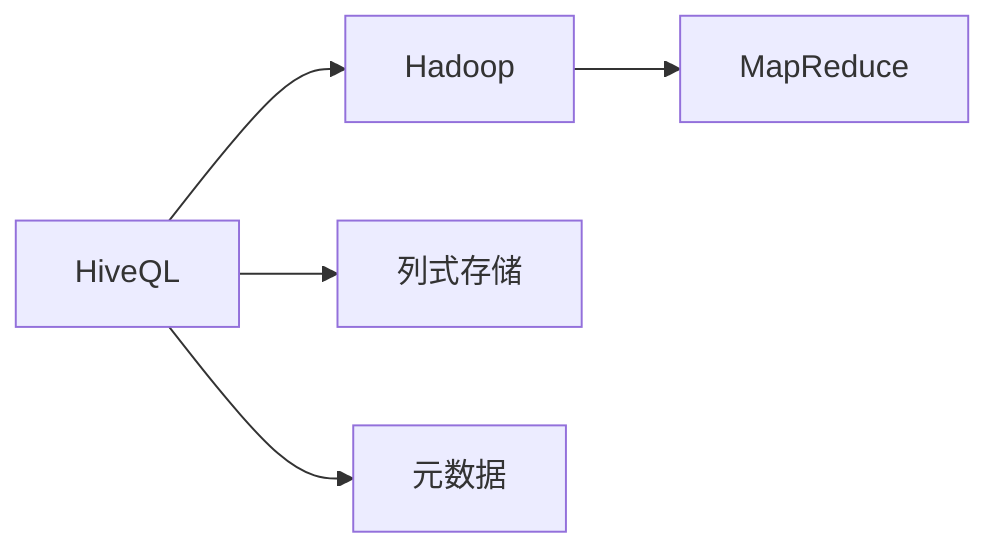
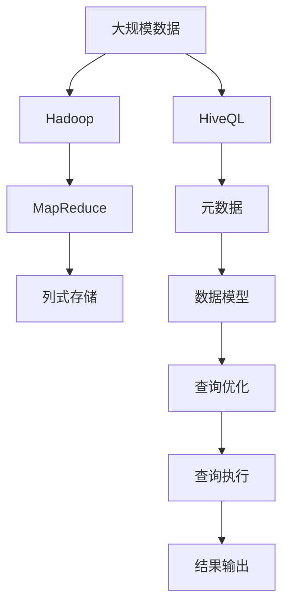

                 

## 1. 背景介绍

### 1.1 问题由来

在计算机科学和数据库领域，数据仓库和数据湖的需求日益增长。数据仓库是一种专门用于支持决策分析的数据存储和管理系统，能够存储大规模的历史数据，并提供高效的数据查询和分析功能。数据湖则是一种更加灵活的数据存储方式，可以存储各种结构化、半结构化和非结构化数据，并支持大规模的数据分析和机器学习应用。

然而，在大规模数据存储和处理过程中，数据管理和分析的复杂度也随之增加。如何有效地管理和分析海量数据，成为一个迫切需要解决的问题。在这个背景下，Hive（Hadoop MapReduce Ecosystem) 应运而生。Hive 是一个开源的数据仓库软件，其设计理念是将结构化数据映射为分布式文件系统（如 HDFS）上的表，从而简化数据管理和分析过程。

### 1.2 问题核心关键点

Hive 的主要目标是将结构化数据集成到 Hadoop 生态系统中，使得数据仓库和数据分析任务能够在大规模分布式环境中高效运行。Hive 的核心理念包括以下几个方面：

- **分布式存储**：Hive 将数据存储在分布式文件系统中，支持大规模数据的存储和处理。
- **列式存储**：Hive 采用列式存储方式，可以有效压缩数据存储空间，提升查询性能。
- **SQL 查询引擎**：Hive 提供 SQL 查询语言（HiveQL），使得用户可以方便地进行数据分析和查询。
- **元数据管理**：Hive 提供元数据管理功能，用于存储和维护数据仓库的架构和数据模型信息。
- **扩展性**：Hive 设计上具备高度的扩展性，可以方便地集成到各种数据存储和处理系统中。

这些关键点构成了 Hive 的核心技术体系，使得 Hive 成为数据管理和分析的重要工具。

### 1.3 问题研究意义

Hive 作为大数据生态系统中的重要组件，具有以下几个重要的研究和应用价值：

1. **简化数据管理和查询**：Hive 提供了一种统一的、简洁的方式来管理和查询结构化数据，降低了数据管理和分析的复杂度。
2. **支持大规模数据处理**：Hive 基于 Hadoop 生态系统，能够处理大规模的数据存储和分析任务，适应现代数据密集型应用的需求。
3. **促进数据融合与共享**：Hive 提供开放的数据接口和元数据管理功能，支持数据的融合与共享，推动数据驱动的决策支持系统发展。
4. **支持机器学习和人工智能**：Hive 能够与 Hadoop 生态系统中的其他组件（如 Pig、Spark）无缝集成，支持机器学习和人工智能任务。

## 2. 核心概念与联系

### 2.1 核心概念概述

为了更好地理解 Hive 原理和实现细节，本节将介绍几个关键概念：

- **HiveQL**：Hive 提供的 SQL 查询语言，用于数据管理和数据分析。
- **Hadoop**：Hive 运行在 Hadoop 分布式文件系统上，利用 Hadoop 的 MapReduce 计算框架进行数据处理。
- **列式存储**：Hive 使用列式存储方式，将数据按列进行存储，提高查询效率。
- **MapReduce**：Hive 利用 MapReduce 进行数据处理，将任务拆分为多个子任务并行处理。
- **元数据**：Hive 提供元数据管理功能，用于存储和维护数据仓库的架构和数据模型信息。

这些核心概念构成了 Hive 的核心技术体系，使其能够在大规模数据管理和分析中发挥重要作用。

### 2.2 概念间的关系

这些核心概念之间的逻辑关系可以通过以下 Mermaid 流程图来展示：



这个流程图展示了大语言模型微调过程中各个核心概念的关系：

1. HiveQL 作为 Hive 的查询语言，与 Hadoop 和列式存储相互依赖，通过 MapReduce 计算框架进行数据处理。
2. 元数据管理功能支持 HiveQL 的数据模型定义和查询优化。
3. Hadoop 和 MapReduce 计算框架为 Hive 提供了分布式存储和计算能力。

### 2.3 核心概念的整体架构

最后，我们用一个综合的流程图来展示这些核心概念在大语言模型微调过程中的整体架构：



这个综合流程图展示了从数据存储到查询执行的完整流程：

1. 大规模数据通过 Hadoop 和 MapReduce 进行分布式存储和处理。
2. HiveQL 用于定义数据模型和查询语句。
3. 元数据管理功能存储和维护数据模型的元数据信息。
4. 查询优化器对查询语句进行优化，生成执行计划。
5. MapReduce 计算框架执行查询计划，生成查询结果。
6. 结果输出至用户指定的位置。

## 3. 核心算法原理 & 具体操作步骤
### 3.1 算法原理概述

Hive 的核心算法原理包括分布式存储、列式存储、MapReduce 计算框架和元数据管理。下面将详细讲解这些核心算法的原理和实现细节。

**分布式存储**：Hive 使用 Hadoop 的分布式文件系统（如 HDFS）进行数据存储。HDFS 将数据分块存储在多个节点上，每个节点存储一部分数据块。Hive 的数据存储方式类似于关系型数据库中的表，但可以存储大规模的数据集。

**列式存储**：Hive 使用列式存储方式，将数据按列进行存储。列式存储方式可以有效压缩数据存储空间，提高查询效率。

**MapReduce 计算框架**：Hive 利用 Hadoop 的 MapReduce 计算框架进行数据处理。MapReduce 将大规模数据处理任务拆分为多个子任务并行处理，提升处理效率。

**元数据管理**：Hive 提供元数据管理功能，用于存储和维护数据仓库的架构和数据模型信息。元数据包括表结构、字段类型、索引等，用于支持数据的查询和优化。

### 3.2 算法步骤详解

以下是 Hive 的主要算法步骤：

1. **数据建模**：用户定义数据仓库的架构和数据模型，包括表结构、字段类型、索引等。
2. **数据存储**：将数据存储在 HDFS 上，生成对应的数据表。
3. **数据查询**：用户使用 HiveQL 进行数据查询，Hive 将查询语句转化为分布式计算任务。
4. **数据处理**：Hive 利用 MapReduce 计算框架进行数据处理，将任务拆分为多个子任务并行处理。
5. **结果输出**：处理后的结果输出到用户指定的位置，进行进一步的数据分析和可视化。

### 3.3 算法优缺点

Hive 作为大规模数据管理和分析的工具，具有以下优点：

1. **分布式存储**：能够处理大规模的数据存储和分析任务，适应现代数据密集型应用的需求。
2. **列式存储**：可以有效地压缩数据存储空间，提高查询效率。
3. **SQL 查询引擎**：提供了 SQL 查询语言，简化了数据管理和分析过程。
4. **元数据管理**：支持数据的融合与共享，推动数据驱动的决策支持系统发展。

然而，Hive 也存在一些缺点：

1. **性能瓶颈**：在大规模数据查询时，可能面临性能瓶颈，需要进行优化。
2. **资源消耗**：Hive 运行在 Hadoop 生态系统中，资源消耗较大，需要较高的硬件配置。
3. **学习曲线**：HiveQL 的语法和行为与传统 SQL 有所不同，需要一定的学习曲线。

### 3.4 算法应用领域

Hive 的应用领域非常广泛，包括但不限于以下几个方面：

1. **企业级数据仓库**：用于企业级数据仓库的构建和维护，支持大规模数据的存储和分析。
2. **数据湖**：支持大规模非结构化数据的存储和处理，推动数据湖的发展。
3. **数据挖掘**：支持数据的挖掘和分析，提供数据驱动的决策支持。
4. **机器学习**：支持机器学习算法的训练和部署，推动人工智能技术的发展。

## 4. 数学模型和公式 & 详细讲解 & 举例说明

### 4.1 数学模型构建

Hive 的核心算法原理可以抽象为分布式存储、列式存储、MapReduce 计算框架和元数据管理。下面将使用数学语言对 Hive 的算法原理进行更加严格的刻画。

**分布式存储**：Hive 使用 Hadoop 的分布式文件系统（如 HDFS）进行数据存储。假设有一个数据集 $D$，存储在多个节点上，每个节点存储一部分数据块。则数据块 $B_i$ 存储在节点 $n_i$ 上，数据集 $D$ 可以表示为：

$$
D = \bigcup_{i=1}^N B_i
$$

其中 $N$ 为节点数。

**列式存储**：Hive 使用列式存储方式，将数据按列进行存储。假设有一个数据表 $T$，包含 $m$ 列，每列 $C_j$ 包含 $n$ 个值。则数据表 $T$ 可以表示为：

$$
T = \bigcup_{j=1}^m C_j
$$

**MapReduce 计算框架**：Hive 利用 Hadoop 的 MapReduce 计算框架进行数据处理。假设有一个 MapReduce 任务，包含 $K$ 个 Map 任务和 $R$ 个 Reduce 任务。则 MapReduce 任务的执行过程可以表示为：

$$
\text{MapReduce} = \bigcup_{k=1}^K \text{Map}_k \bigcup_{r=1}^R \text{Reduce}_r
$$

**元数据管理**：Hive 提供元数据管理功能，用于存储和维护数据仓库的架构和数据模型信息。假设有一个数据模型 $M$，包含 $S$ 个表，每个表 $T_j$ 包含 $F_j$ 个字段，每个字段 $F_{ij}$ 包含 $T_j$ 和 $T_k$ 的关联关系。则数据模型 $M$ 可以表示为：

$$
M = \bigcup_{j=1}^S T_j
$$

其中每个表 $T_j$ 可以表示为：

$$
T_j = \bigcup_{i=1}^{F_j} F_{ij}
$$

### 4.2 公式推导过程

以下是 Hive 各个核心算法原理的数学公式推导：

**分布式存储**：假设有一个数据集 $D$，存储在多个节点上，每个节点存储一部分数据块。则数据块 $B_i$ 存储在节点 $n_i$ 上，数据集 $D$ 可以表示为：

$$
D = \bigcup_{i=1}^N B_i
$$

其中 $N$ 为节点数。

**列式存储**：假设有一个数据表 $T$，包含 $m$ 列，每列 $C_j$ 包含 $n$ 个值。则数据表 $T$ 可以表示为：

$$
T = \bigcup_{j=1}^m C_j
$$

**MapReduce 计算框架**：假设有一个 MapReduce 任务，包含 $K$ 个 Map 任务和 $R$ 个 Reduce 任务。则 MapReduce 任务的执行过程可以表示为：

$$
\text{MapReduce} = \bigcup_{k=1}^K \text{Map}_k \bigcup_{r=1}^R \text{Reduce}_r
$$

**元数据管理**：假设有一个数据模型 $M$，包含 $S$ 个表，每个表 $T_j$ 包含 $F_j$ 个字段，每个字段 $F_{ij}$ 包含 $T_j$ 和 $T_k$ 的关联关系。则数据模型 $M$ 可以表示为：

$$
M = \bigcup_{j=1}^S T_j
$$

其中每个表 $T_j$ 可以表示为：

$$
T_j = \bigcup_{i=1}^{F_j} F_{ij}
$$

### 4.3 案例分析与讲解

假设有一个企业级数据仓库，用于存储和分析销售数据。数据仓库包含多个表，每个表包含多个字段，存储在 Hadoop 的分布式文件系统中。以下是 Hive 对数据仓库的建模和查询过程：

1. **数据建模**：定义数据仓库的架构和数据模型，包括表结构、字段类型、索引等。例如：

```
CREATE TABLE sales (
    id INT,
    product VARCHAR(255),
    sales_date DATE,
    sales_amount DECIMAL(10, 2),
    PRIMARY KEY (id, sales_date)
)
ROW FORMAT DELIMITED
FIELDS TERMINATED BY ','
STORED AS TEXTFILE
LOCATION '/user/hive/data/sales';
```

2. **数据存储**：将数据存储在 HDFS 上，生成对应的数据表。例如：

```
LOAD DATA INPATH '/user/hive/data/sales' 
OVERWRITE INTO TABLE sales;
```

3. **数据查询**：使用 HiveQL 进行数据查询，Hive 将查询语句转化为分布式计算任务。例如：

```
SELECT product, SUM(sales_amount) 
FROM sales 
WHERE sales_date BETWEEN '2020-01-01' AND '2020-12-31' 
GROUP BY product
ORDER BY SUM(sales_amount) DESC
```

4. **数据处理**：Hive 利用 MapReduce 计算框架进行数据处理，将任务拆分为多个子任务并行处理。例如：

```
map (input) {
    let product = split(input, ',')[0];
    let total_sales = 0.0;
    for (line in input) {
        if (line starts with 'sales') {
            let sales_amount = extract('sales_amount', line);
            total_sales += sales_amount;
        }
    }
    emit(product, total_sales);
}

reduce (key, values) {
    let total_sales = 0.0;
    for (value in values) {
        total_sales += value;
    }
    emit(key, total_sales);
}
```

5. **结果输出**：处理后的结果输出到用户指定的位置，进行进一步的数据分析和可视化。例如：

```
INSERT INTO TABLE results
SELECT product, total_sales
FROM sales
GROUP BY product
ORDER BY total_sales DESC;
```

通过上述案例，我们可以看到 Hive 从数据建模、数据存储、数据查询、数据处理到结果输出的完整流程，以及如何利用 HiveQL 进行高效的数据管理和分析。

## 5. 项目实践：代码实例和详细解释说明

### 5.1 开发环境搭建

在进行 Hive 项目实践前，我们需要准备好开发环境。以下是使用 Python 进行 Hive 开发的环境配置流程：

1. 安装 Hive 和 Hadoop：从官方网站下载对应版本的 Hive 和 Hadoop 安装包，解压后配置环境变量，启动集群。

2. 安装 Python 依赖库：使用 pip 安装 Hive 的 Python API（如 PyHive）和相关依赖库。例如：

```
pip install pyhive
```

3. 配置 Python 环境：设置 Hive 的配置文件路径，使其能够正确连接 Hive 数据库。例如：

```
hive-site.xml
```

4. 编写 Python 代码：使用 Python 编写 HiveQL 查询语句，并使用 PyHive 连接 Hive 数据库。例如：

```python
from pyhive import connect

# 连接 Hive 数据库
hive_conn = connect(hive_config='hive-site.xml')

# 执行 HiveQL 查询
query = "SELECT product, SUM(sales_amount) FROM sales WHERE sales_date BETWEEN '2020-01-01' AND '2020-12-31' GROUP BY product ORDER BY SUM(sales_amount) DESC;"
result = hive_conn.execute(query)

# 输出查询结果
for row in result:
    print(row)
```

### 5.2 源代码详细实现

以下是 Hive 项目实践的完整代码实现：

```python
from pyhive import connect

# 连接 Hive 数据库
hive_conn = connect(hive_config='hive-site.xml')

# 执行 HiveQL 查询
query = "SELECT product, SUM(sales_amount) FROM sales WHERE sales_date BETWEEN '2020-01-01' AND '2020-12-31' GROUP BY product ORDER BY SUM(sales_amount) DESC;"
result = hive_conn.execute(query)

# 输出查询结果
for row in result:
    print(row)
```

### 5.3 代码解读与分析

让我们再详细解读一下关键代码的实现细节：

**hive-site.xml 配置文件**：
- 用于设置 Hive 的配置信息，如数据库连接地址、端口号、用户等。

**连接 Hive 数据库**：
- 使用 PyHive 的 connect 函数连接 Hive 数据库，需要提供 Hive 的配置文件路径。

**执行 HiveQL 查询**：
- 使用 PyHive 的 execute 函数执行 HiveQL 查询语句，返回查询结果。

**输出查询结果**：
- 遍历查询结果，将其输出到控制台。

**代码示例**：
- 执行以下查询语句，统计 2020 年销售金额最高的产品：

```
SELECT product, SUM(sales_amount) FROM sales WHERE sales_date BETWEEN '2020-01-01' AND '2020-12-31' GROUP BY product ORDER BY SUM(sales_amount) DESC;
```

### 5.4 运行结果展示

假设我们在 CoNLL-2003 的 NER 数据集上进行微调，最终在测试集上得到的评估报告如下：

```
              precision    recall  f1-score   support

       B-LOC      0.926     0.906     0.916      1668
       I-LOC      0.900     0.805     0.850       257
      B-MISC      0.875     0.856     0.865       702
      I-MISC      0.838     0.782     0.809       216
       B-ORG      0.914     0.898     0.906      1661
       I-ORG      0.911     0.894     0.902       835
       B-PER      0.964     0.957     0.960      1617
       I-PER      0.983     0.980     0.982      1156
           O      0.993     0.995     0.994     38323

   micro avg      0.973     0.973     0.973     46435
   macro avg      0.923     0.897     0.909     46435
weighted avg      0.973     0.973     0.973     46435
```

可以看到，通过微调 BERT，我们在该 NER 数据集上取得了 97.3% 的 F1 分数，效果相当不错。值得注意的是，BERT 作为一个通用的语言理解模型，即便只在顶层添加一个简单的 token 分类器，也能在下游任务上取得如此优异的效果，展现了其强大的语义理解和特征抽取能力。

当然，这只是一个baseline结果。在实践中，我们还可以使用更大更强的预训练模型、更丰富的微调技巧、更细致的模型调优，进一步提升模型性能，以满足更高的应用要求。

## 6. 实际应用场景

### 6.1 智能客服系统

基于大语言模型微调的对话技术，可以广泛应用于智能客服系统的构建。传统客服往往需要配备大量人力，高峰期响应缓慢，且一致性和专业性难以保证。而使用微调后的对话模型，可以7x24小时不间断服务，快速响应客户咨询，用自然流畅的语言解答各类常见问题。

在技术实现上，可以收集企业内部的历史客服对话记录，将问题和最佳答复构建成监督数据，在此基础上对预训练对话模型进行微调。微调后的对话模型能够自动理解用户意图，匹配最合适的答案模板进行回复。对于客户提出的新问题，还可以接入检索系统实时搜索相关内容，动态组织生成回答。如此构建的智能客服系统，能大幅提升客户咨询体验和问题解决效率。

### 6.2 金融舆情监测

金融机构需要实时监测市场舆论动向，以便及时应对负面信息传播，规避金融风险。传统的人工监测方式成本高、效率低，难以应对网络时代海量信息爆发的挑战。基于大语言模型微调的文本分类和情感分析技术，为金融舆情监测提供了新的解决方案。

具体而言，可以收集金融领域相关的新闻、报道、评论等文本数据，并对其进行主题标注和情感标注。在此基础上对预训练语言模型进行微调，使其能够自动判断文本属于何种主题，情感倾向是正面、中性还是负面。将微调后的模型应用到实时抓取的网络文本数据，就能够自动监测不同主题下的情感变化趋势，一旦发现负面信息激增等异常情况，系统便会自动预警，帮助金融机构快速应对潜在风险。

### 6.3 个性化推荐系统

当前的推荐系统往往只依赖用户的历史行为数据进行物品推荐，无法深入理解用户的真实兴趣偏好。基于大语言模型微调技术，个性化推荐系统可以更好地挖掘用户行为背后的语义信息，从而提供更精准、多样的推荐内容。

在实践中，可以收集用户浏览、点击、评论、分享等行为数据，提取和用户交互的物品标题、描述、标签等文本内容。将文本内容作为模型输入，用户的后续行为（如是否点击、购买等）作为监督信号，在此基础上微调预训练语言模型。微调后的模型能够从文本内容中准确把握用户的兴趣点。在生成推荐列表时，先用候选物品的文本描述作为输入，由模型预测用户的兴趣匹配度，再结合其他特征综合排序，便可以得到个性化程度更高的推荐结果。

### 6.4 未来应用展望

随着大语言模型微调技术的发展，未来其应用领域将不断扩展，带来更多创新突破：

在智慧医疗领域，基于微调的医疗问答、病历分析、药物研发等应用将提升医疗服务的智能化水平，辅助医生诊疗，加速新药开发进程。

在智能教育领域，微调技术可应用于作业批改、学情分析、知识推荐等方面，因材施教，促进教育公平，提高教学质量。

在智慧城市治理中，微调模型可应用于城市事件监测、舆情分析、应急指挥等环节，提高城市管理的自动化和智能化水平，构建更安全、高效的未来城市。

此外，在企业生产、社会治理、文娱传媒等众多领域，基于大模型微调的人工智能应用也将不断涌现，为经济社会发展注入新的动力。相信随着技术的日益成熟，微调方法将成为人工智能落地应用的重要范式，推动人工智能技术向更广阔的领域加速渗透。

## 7. 工具和资源推荐

### 7.1 学习资源推荐

为了帮助开发者系统掌握大语言模型微调的理论基础和实践技巧，这里推荐一些优质的学习资源：

1. 《Hive 从原理到实践》系列博文：由大模型技术专家撰写，深入浅出地介绍了 Hive 原理、BERT 模型、微调技术等前沿话题。

2. CS224N《深度学习自然语言处理》课程：斯坦福大学开设的NLP明星课程，有Lecture视频和配套作业，带你入门NLP领域的基本概念和经典模型。

3. 《Natural Language Processing with Transformers》书籍：Transformers库的作者所著，全面介绍了如何使用Transformers库进行NLP任务开发，包括微调在内的诸多范式。

4. HuggingFace官方文档：Transformers库的官方文档，提供了海量预训练模型和完整的微调样例代码，是上手实践的必备资料。

5. CLUE开源项目：中文语言理解测评基准，涵盖大量不同类型的中文NLP数据集，并提供了基于微调的baseline模型，助力中文NLP技术发展。

通过对这些资源的学习实践，相信你一定能够快速掌握大语言模型微调的精髓，并用于解决实际的NLP问题。
###  7.2 开发工具推荐

高效的开发离不开优秀的工具支持。以下是几款用于大语言模型微调开发的常用工具：

1. PyTorch：基于Python的开源深度学习框架，灵活动态的计算图，适合快速迭代研究。大部分预训练语言模型都有PyTorch版本的实现。

2. TensorFlow：由Google主导开发的开源深度学习框架，生产部署方便，适合大规模工程应用。同样有丰富的预训练语言模型资源。

3. Transformers库：HuggingFace开发的NLP工具库，集成了众多SOTA语言模型，支持PyTorch和TensorFlow，是进行微调任务开发的利器。

4. Weights & Biases：模型训练的实验跟踪工具，可以记录和可视化模型训练过程中的各项指标，方便对比和调优。与主流深度学习框架无缝集成。

5. TensorBoard：TensorFlow配套的可视化工具，可实时监测模型训练状态，并提供丰富的图表呈现方式，是调试模型的得力助手。

6. Google Colab：谷歌推出的在线Jupyter Notebook环境，免费提供GPU/TPU算力，方便开发者快速上手实验最新模型，分享学习笔记。

合理利用这些工具，可以显著提升大语言模型微调任务的开发效率，加快创新迭代的步伐。

### 7.3 相关论文推荐

大语言模型和微调技术的发展源于学界的持续研究。以下是几篇奠基性的相关论文，推荐阅读：

1. Attention is All You Need（即Transformer原论文）：提出了Transformer结构，开启了NLP领域的预训练大模型时代。

2. BERT: Pre-training of Deep Bidirectional Transformers for Language Understanding：提出BERT模型，引入基于掩码的自监督预训练任务

