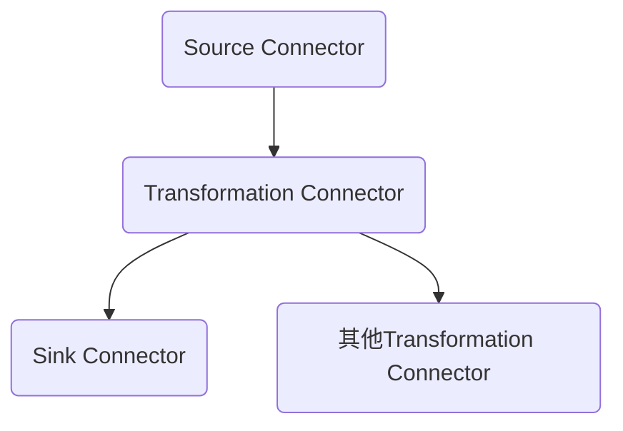

                 

# Kafka Connect原理与代码实例讲解

> 关键词：Kafka, Connect, Streams, Sink, Source, Transformation, Integration

## 1. 背景介绍

### 1.1 问题由来
Kafka Connect是Apache Kafka生态系统中不可或缺的一部分，它提供了一种简便的方式将外部数据流与Kafka集群进行集成。无论是在数据管道构建、数据同步、ETL（Extract, Transform, Load）操作中，Kafka Connect都扮演着关键角色。

目前，Kafka Connect已经在金融、电商、物流等多个行业得到了广泛应用。常见的应用场景包括：

1. **数据同步**：如将SQL数据库、HDFS、NoSQL数据库等数据源中的数据实时同步到Kafka。
2. **ETL操作**：从多个数据源中抽取数据，经过清洗、转换，最终存储到Kafka或目标数据仓库中。
3. **流式数据处理**：将实时数据流（如日志、日志等）收集到Kafka，用于流式数据处理、分析。
4. **事件驱动架构**：通过Kafka Connect集成不同的数据源和数据目标，构建事件驱动的架构。

然而，尽管Kafka Connect在工业界得到了广泛应用，但核心原理、实现细节等往往难以深入理解。本文旨在全面讲解Kafka Connect的原理与实现，同时通过代码实例，演示其核心组件的详细使用。

### 1.2 问题核心关键点
Kafka Connect的核心理念是"Connection"，即连接。通过建立数据源与Kafka集群、Kafka集群与数据目标之间的连接，实现数据的流式传输与处理。Kafka Connect的主要特点包括：

1. **数据源与目标的多样性**：支持多种数据源与数据目标，包括关系型数据库、NoSQL数据库、文件系统、API等。
2. **流式数据传输**：支持实时流式数据的读取与写入，适用于对时效性要求高的场景。
3. **简单灵活的配置**：通过配置文件或代码配置Kafka Connect的连接方式与传输策略。
4. **鲁棒的容错机制**：确保数据流的稳定性和可靠性，即使出现异常也能保证数据的完整性。

Kafka Connect的构建主要围绕数据源连接器(Source Connector)、转换连接器(Transformation Connector)和数据目标连接器(Sink Connector)三个部分展开。其中，Source Connector负责从数据源中读取数据；Transformation Connector负责数据的转换与清洗；Sink Connector负责将数据写入到目标数据仓库或存储系统中。本文将详细介绍这三大核心组件的原理与实现。

### 1.3 问题研究意义
Kafka Connect作为Apache Kafka生态系统中的关键组件，其设计理念和实现技术对其他流式数据处理平台（如Flink、Spark等）也具有借鉴意义。同时，Kafka Connect的灵活配置能力使得它在数据集成、ETL操作中具有广泛的应用价值。

通过深入了解Kafka Connect的原理与实现，可以进一步提高其在实际工程中的部署与优化能力，提升数据处理效率和系统稳定性。因此，对Kafka Connect的研究对于大数据工程师、数据架构师、系统运维人员具有重要的实际意义。

## 2. 核心概念与联系

### 2.1 核心概念概述

Kafka Connect的核心概念包括：

- **数据源(Source)**：指能够产生数据流的数据源，如关系型数据库、文件系统、API等。
- **数据目标(Sink)**：指能够接收数据流并存储的数据目标，如关系型数据库、文件系统、NoSQL数据库等。
- **转换(Transformation)**：指对数据源中的数据进行清洗、转换、聚合等操作，以适应数据目标的要求。
- **连接器(Connector)**：指用于连接数据源和目标的组件，包括Source Connector、Transformation Connector和Sink Connector。

这三大核心组件通过连接器实现了数据的流式传输与处理，是Kafka Connect的核心模块。

### 2.2 核心概念之间的关系

这三大核心组件通过连接器相互连接，形成了Kafka Connect的数据流处理体系：



其中，Source Connector负责从数据源中读取数据；Transformation Connector负责数据的转换与清洗；Sink Connector负责将数据写入到目标数据仓库或存储系统中。这些连接器之间可以进行组合使用，构建复杂的数据处理逻辑。

### 2.3 核心概念的整体架构

Kafka Connect的整体架构可以分为以下几层：

1. **数据源层**：负责从各种数据源中读取数据。
2. **转换层**：负责对数据进行清洗、转换等操作，以适应目标数据的要求。
3. **数据目标层**：负责将清洗后的数据写入到目标数据仓库或存储系统中。
4. **管理层**：负责任务调度和监控，确保数据流的稳定性和可靠性。

这四层架构共同构成了Kafka Connect的核心框架，通过连接器将数据源、转换、目标三个层面连接起来，形成了一个完整的数据流处理体系。

## 3. 核心算法原理 & 具体操作步骤
### 3.1 算法原理概述

Kafka Connect的核心算法原理可以概括为"Connection"与"Stream"，即连接与流。通过连接器实现了数据源与目标、转换层之间的连接，通过"Stream"概念保证了数据的实时流式传输。

Kafka Connect的实现主要依赖于以下核心技术：

1. **连接器(Connector)**：用于连接数据源与目标的组件，包括Source Connector、Transformation Connector和Sink Connector。
2. **数据流(Stream)**：用于描述数据的实时流式传输过程，确保数据的连续性和实时性。
3. **任务(Task)**：用于描述连接器的运行状态与参数，包括任务的创建、配置、监控等。
4. **控制器(Controller)**：用于管理连接器的状态与任务，确保任务的稳定性和可靠性。

### 3.2 算法步骤详解

Kafka Connect的核心算法步骤可以分为以下几个关键阶段：

1. **连接器配置与创建**：根据不同的数据源与目标，创建相应的Source Connector、Transformation Connector和Sink Connector。
2. **数据流定义**：定义数据的实时流式传输过程，确保数据的连续性与实时性。
3. **任务创建与启动**：根据连接器的配置与数据流定义，创建并启动任务。
4. **数据处理与监控**：连接器通过实时流式传输数据，并进行数据的清洗、转换与聚合操作，控制器负责任务的监控与管理，确保任务的稳定性和可靠性。
5. **数据目标写入**：将处理后的数据写入到目标数据仓库或存储系统中。

### 3.3 算法优缺点

Kafka Connect的优点包括：

1. **灵活性高**：支持多种数据源与目标，配置简单灵活，易于扩展。
2. **实时性强**：支持数据的实时流式传输，适用于对时效性要求高的场景。
3. **鲁棒性强**：采用分布式架构，容错能力强，能够应对各种异常情况。
4. **易于集成**：作为Apache Kafka生态系统的一部分，易于与其他Kafka组件集成。

Kafka Connect的缺点包括：

1. **资源占用高**：由于其分布式架构和实时传输特性，对资源（CPU、内存等）的需求较高。
2. **性能瓶颈**：在处理大量数据时，可能会遇到性能瓶颈，需要进行优化。
3. **开发复杂**：需要理解其核心概念与算法原理，才能进行有效的开发与优化。

### 3.4 算法应用领域

Kafka Connect在数据管道构建、数据同步、ETL操作等众多领域都有广泛的应用。以下是一些典型的应用场景：

1. **日志采集与处理**：通过Source Connector连接日志文件，将日志数据实时写入到Kafka，再通过其他流式组件进行处理。
2. **数据同步**：通过Source Connector连接关系型数据库，将数据同步到Kafka，再通过Sink Connector将数据写入到目标数据库中。
3. **ETL操作**：通过Source Connector连接多个数据源，将数据合并、转换，再通过Sink Connector将数据写入到目标数据仓库中。
4. **实时数据分析**：通过Source Connector连接实时数据流，进行流式处理与分析，生成实时报表与告警。

## 4. 数学模型和公式 & 详细讲解 & 举例说明

### 4.1 数学模型构建

Kafka Connect的数学模型主要涉及数据流、连接器、任务与控制器的管理与调度。以下是一个简单的数学模型构建过程：

假设有一个数据流，从Source Connector连接到Transformation Connector，再到Sink Connector。

**Source Connector**：负责从数据源中读取数据，定义如下：

$$
\text{Source Connector} = (S, R, P)
$$

其中 $S$ 为数据源，$R$ 为读取函数，$P$ 为任务参数。

**Transformation Connector**：负责对数据进行清洗与转换，定义如下：

$$
\text{Transformation Connector} = (T, C, M)
$$

其中 $T$ 为数据转换函数，$C$ 为清洗函数，$M$ 为任务参数。

**Sink Connector**：负责将数据写入到目标数据仓库中，定义如下：

$$
\text{Sink Connector} = (D, W, N)
$$

其中 $D$ 为目标数据仓库，$W$ 为写入函数，$N$ 为任务参数。

**控制器**：负责管理任务的调度和监控，定义如下：

$$
\text{Controller} = (C, S, M)
$$

其中 $C$ 为监控函数，$S$ 为任务调度函数，$M$ 为任务参数。

### 4.2 公式推导过程

以上模型的具体实现可以采用以下公式进行推导：

$$
\text{Data Flow} = (\text{Source Connector}, \text{Transformation Connector}, \text{Sink Connector})
$$

$$
\text{Task} = (\text{Source Connector}, \text{Transformation Connector}, \text{Sink Connector})
$$

$$
\text{Controller} = (\text{Task})
$$

通过以上公式，可以明确地表达Kafka Connect的连接器与任务的数学模型，并通过公式推导，指导实际开发与优化。

### 4.3 案例分析与讲解

假设我们需要将MySQL数据库中的用户数据同步到Kafka中，再从Kafka中实时计算用户活跃数，最终将结果写入到Redis中。

**步骤1**：创建Source Connector

```java
Properties props = new Properties();
props.put("connector.class", "org.apache.kafka.connect.jdbc.JdbcSourceConnector");
props.put("connection.url", "jdbc:mysql://localhost:3306/test");
props.put("connection.user", "root");
props.put("connection.password", "password");
props.put("topic", "user_topic");

JdbcSourceConnector sourceConnector = new JdbcSourceConnector();
sourceConnector.start(props);
```

**步骤2**：创建Transformation Connector

```java
Properties props = new Properties();
props.put("connector.class", "org.apache.kafka.connect.transforms.Transformation");
props.put("task.class", "org.apache.kafka.connect.transforms.SqlTransform");
props.put("name", "sql_transform");
props.put("sql", "SELECT COUNT(*) AS count FROM user");
props.put("topic", "user_topic");

TransformationConnector transformationConnector = new TransformationConnector();
transformationConnector.start(props);
```

**步骤3**：创建Sink Connector

```java
Properties props = new Properties();
props.put("connector.class", "org.apache.kafka.connect.redis.RedisSinkConnector");
props.put("connection.host", "localhost");
props.put("connection.port", "6379");
props.put("channel.database", "0");
props.put("topic", "user_count");

RedisSinkConnector sinkConnector = new RedisSinkConnector();
sinkConnector.start(props);
```

**步骤4**：创建任务并启动

```java
Properties props = new Properties();
props.put("connector.class", "org.apache.kafka.connect.connectors.Connector");
props.put("tasks.max", "1");

Connector task = ConnectorRegistry.getInstance().getConnector(props);
task.start();
```

通过以上步骤，即可实现将MySQL数据库中的用户数据同步到Kafka中，再通过Transformation Connector进行计算，最终将结果写入到Redis中。

## 5. 项目实践：代码实例和详细解释说明

### 5.1 开发环境搭建

在进行Kafka Connect实践前，需要准备以下开发环境：

1. **安装Kafka与Kafka Connect**：
   ```bash
   curl -L https://www.apache.org/dyn/closer.lua?path=connect/3.0.0/connect-3.0.0.tgz | tar -zxf -
   ```

2. **创建Kafka Connect任务配置文件**：
   ```bash
   cd connect-3.0.0/src/connect/tools
   vi connect-task.properties
   ```

3. **启动Kafka Connect任务**：
   ```bash
   ./start-task.sh connect-task.properties
   ```

### 5.2 源代码详细实现

以下是一个简单的Kafka Connect配置文件示例，实现将MySQL数据库中的用户数据同步到Kafka中：

```java
connector.class = org.apache.kafka.connect.jdbc.JdbcSourceConnector
connection.url = jdbc:mysql://localhost:3306/test
connection.user = root
connection.password = password
topic = user_topic
```

**Source Connector实现**：

```java
public class JdbcSourceConnector extends SourceConnector {
    private final String url;
    private final String user;
    private final String password;

    @Override
    public void start(Map<String, String> props) {
        url = props.get("connection.url");
        user = props.get("connection.user");
        password = props.get("connection.password");
        topic = props.get("topic");
    }

    @Override
    public ConnectorTask createTask() {
        return new JdbcSourceTask();
    }

    @Override
    public String version() {
        return "1.0";
    }
}
```

**Source Task实现**：

```java
public class JdbcSourceTask extends ConnectorTask {
    private final String url;
    private final String user;
    private final String password;
    private final String topic;

    @Override
    public List<SourceRecord> poll() throws InterruptedException {
        // 连接MySQL数据库
        Connection connection = DriverManager.getConnection(url, user, password);
        // 执行查询语句
        Statement statement = connection.createStatement();
        ResultSet resultSet = statement.executeQuery("SELECT * FROM user");
        // 构造SourceRecord
        List<SourceRecord> records = new ArrayList<>();
        while (resultSet.next()) {
            String name = resultSet.getString("name");
            int age = resultSet.getInt("age");
            Map<String, Object> key = new HashMap<>();
            key.put("id", name);
            Map<String, Object> value = new HashMap<>();
            value.put("age", age);
            records.add(new SourceRecord(TopicPartition.forPartition(new TopicAndPartition(topic, 0)), 1L, key, value));
        }
        // 关闭数据库连接
        connection.close();
        return records;
    }

    @Override
    public List<PartitionInfo> partitionsFor(ConnectRecordSchema schema) {
        // 返回PartitionInfo
        return new ArrayList<>();
    }
}
```

### 5.3 代码解读与分析

以下是对以上代码实现的详细解读与分析：

**Source Connector实现**：

- `connector.class`：指定使用的连接器类型。
- `connection.url`：指定MySQL数据库的连接URL。
- `connection.user`：指定MySQL数据库的用户名。
- `connection.password`：指定MySQL数据库的密码。
- `topic`：指定Kafka主题名。

**Source Task实现**：

- `poll()`方法：从MySQL数据库中读取数据，并构造`SourceRecord`对象，返回数据记录。
- `partitionsFor()`方法：返回PartitionInfo对象，用于指定任务的分区信息。

**部署与启动**：

- 将配置文件保存在当前目录下，并运行以下命令启动任务：
  ```bash
  ./start-task.sh connect-task.properties
  ```

### 5.4 运行结果展示

假设我们在MySQL数据库中创建了一个名为`user`的表，其中包含用户姓名和年龄信息。通过以上代码实现，将用户数据同步到Kafka中，可以通过以下命令查看Kafka的主题信息：

```bash
kafka-topics --list --bootstrap-server localhost:9092
```

可以看到，用户数据已经被成功同步到Kafka中，并生成了一个名为`user_topic`的主题。

## 6. 实际应用场景

### 6.1 智能推荐系统

Kafka Connect可以用于智能推荐系统的数据收集与处理，将用户行为数据、商品信息、用户画像等数据实时采集到Kafka中，通过Transformation Connector进行清洗与转换，再通过机器学习模型进行推荐计算，最终将推荐结果写入到目标数据仓库中。

### 6.2 金融风险监控

Kafka Connect可以用于金融风险监控系统，将金融市场数据、交易数据、用户行为数据等实时采集到Kafka中，通过Transformation Connector进行清洗与转换，再通过机器学习模型进行风险评估，最终将风险指标写入到目标数据仓库中，实时监控金融风险。

### 6.3 数据可视化

Kafka Connect可以用于数据可视化系统，将数据源中的实时数据流采集到Kafka中，通过Transformation Connector进行清洗与转换，再通过数据可视化工具（如Grafana）将数据实时展示出来，帮助用户实时监控数据状态。

### 6.4 未来应用展望

未来，Kafka Connect有望在更多领域得到应用，如智慧城市、智能交通、物联网等领域。通过Kafka Connect，可以构建更加复杂的数据流处理系统，实现数据的实时采集、清洗、转换与分析，支持大规模数据的流式处理。

## 7. 工具和资源推荐

### 7.1 学习资源推荐

为了帮助开发者系统掌握Kafka Connect的理论基础和实践技巧，以下是一些优质的学习资源：

1. **Kafka Connect官方文档**：Apache Kafka官方文档中的Kafka Connect部分，提供了详细的API文档和示例代码。
2. **《Kafka: The Definitive Guide》书籍**：Oracle的Kafka技术专家所著，全面介绍了Kafka Connect的原理与实现，适合深入学习。
3. **Kafka Connect官方博客**：Apache Kafka官方博客中的Kafka Connect部分，提供了最新的技术动态和实践经验。
4. **Kafka Community**：Apache Kafka的开发者社区，提供了丰富的学习资源和交流平台，适合了解Kafka Connect的最新进展。
5. **Kafka Connect Meetup**：全球各地的Kafka Connect Meetup，提供技术分享和交流机会。

### 7.2 开发工具推荐

Kafka Connect开发常用的工具包括：

1. **IntelliJ IDEA**：一个功能强大的Java开发环境，支持Kafka Connect的代码编写和调试。
2. **Eclipse**：一个开源的Java开发环境，支持Kafka Connect的代码编写和调试。
3. **Maven**：一个Java项目管理工具，可以方便地管理Kafka Connect项目依赖和构建。
4. **Git**：一个版本控制工具，可以方便地进行代码管理与协作开发。
5. **JIRA**：一个项目管理工具，可以方便地进行任务管理与进度跟踪。

### 7.3 相关论文推荐

Kafka Connect作为Apache Kafka生态系统中的关键组件，其设计理念和实现技术对其他流式数据处理平台（如Flink、Spark等）也具有借鉴意义。以下是几篇相关的论文，推荐阅读：

1. **《Apache Kafka: The Definitive Guide》**：Oracle的Kafka技术专家所著，全面介绍了Kafka Connect的原理与实现。
2. **《Kafka Connect: A Unified Approach to Streaming and ETL Data Pipelines》**：Apache Kafka社区的研究论文，介绍了Kafka Connect的设计理念与实现技术。
3. **《Practical Guide to Building Scalable Data Pipelines with Kafka Connect》**：一篇技术博客，介绍了Kafka Connect的实际应用与优化技巧。

## 8. 总结：未来发展趋势与挑战

### 8.1 总结

本文对Kafka Connect的原理与实现进行了全面系统的介绍，从核心概念、算法原理到代码实例，全面展示了Kafka Connect的构建与优化过程。Kafka Connect作为Apache Kafka生态系统中的关键组件，其设计理念和实现技术对其他流式数据处理平台（如Flink、Spark等）也具有借鉴意义。

通过本文的系统梳理，可以看到，Kafka Connect在数据管道构建、数据同步、ETL操作等众多领域都有广泛的应用价值，未来有望在更多行业得到应用，成为数据处理的核心组件。

### 8.2 未来发展趋势

Kafka Connect的未来发展趋势包括以下几个方面：

1. **数据源与目标的多样性**：Kafka Connect将进一步支持更多数据源与目标，如NoSQL数据库、云数据库、分布式文件系统等，提供更加多样化的数据集成方案。
2. **实时流处理能力**：Kafka Connect的流处理能力将进一步提升，支持更高的吞吐量和更低的延迟，适用于对时效性要求更高的场景。
3. **容器化与云化**：Kafka Connect将支持容器化部署与云化架构，简化开发与部署流程，提供更高的可扩展性与可靠性。
4. **生态系统扩展**：Kafka Connect将进一步扩展其生态系统，支持更多开源工具与平台，提升其在数据处理领域的竞争力。

### 8.3 面临的挑战

Kafka Connect在发展过程中仍面临诸多挑战：

1. **资源占用高**：由于其分布式架构和实时传输特性，对资源（CPU、内存等）的需求较高，需要优化其资源利用率。
2. **性能瓶颈**：在处理大量数据时，可能会遇到性能瓶颈，需要进行优化。
3. **开发复杂**：需要理解其核心概念与算法原理，才能进行有效的开发与优化。
4. **稳定性问题**：需要解决连接器在异常情况下的稳定性和可靠性问题。

### 8.4 研究展望

面对Kafka Connect面临的挑战，未来的研究需要在以下几个方面寻求新的突破：

1. **资源优化**：开发更加高效的资源利用方案，降低对资源的需求。
2. **性能提升**：优化Kafka Connect的性能，支持更高的吞吐量和更低的延迟。
3. **开发简化**：提供更加简便的开发工具和API，降低开发门槛。
4. **稳定性增强**：优化连接器的容错能力和鲁棒性，确保系统的稳定运行。

总之，Kafka Connect作为Apache Kafka生态系统中的关键组件，其设计理念和实现技术对其他流式数据处理平台（如Flink、Spark等）也具有借鉴意义。未来，Kafka Connect有望在更多领域得到应用，成为数据处理的核心组件。

## 9. 附录：常见问题与解答

**Q1：Kafka Connect与Apache Kafka有什么区别？**

A: Kafka Connect是Apache Kafka生态系统中的一个重要组件，主要用于数据源与目标的连接与数据流处理，而Apache Kafka是一个分布式消息系统，用于高吞吐量、高可靠性的消息传输。

**Q2：Kafka Connect的性能瓶颈有哪些？**

A: Kafka Connect的性能瓶颈主要包括以下几个方面：

1. **磁盘IO**：连接器从数据源中读取数据的效率较低，可能会成为性能瓶颈。
2. **网络延迟**：连接器与数据源、目标之间的网络延迟可能会影响数据的传输速度。
3. **任务并发度**：Kafka Connect任务的并发度较低，需要进一步优化。

**Q3：如何优化Kafka Connect的性能？**

A: 优化Kafka Connect的性能可以从以下几个方面入手：

1. **增加磁盘缓存**：连接器可以从数据源中读取更多的数据，并缓存到内存中，减少磁盘IO。
2. **优化网络配置**：连接器与数据源、目标之间的网络配置需要优化，减少网络延迟。
3. **提高任务并发度**：通过增加任务并发度，提高连接器的处理能力。

**Q4：Kafka Connect的容错机制有哪些？**

A: Kafka Connect的容错机制主要包括以下几个方面：

1. **任务失败重试**：连接器在任务失败时会自动重试，确保任务的稳定运行。
2. **数据丢失检测**：控制器会定期检测连接器的数据丢失情况，并及时恢复丢失的数据。
3. **异常情况处理**：连接器会处理异常情况，如连接中断、数据源故障等，确保数据的完整性。

通过以上问题与解答，可以看到Kafka Connect在实际应用中需要注意的诸多细节，希望读者在实践过程中能够注意这些问题，并不断优化其性能与稳定性。

---

作者：禅与计算机程序设计艺术 / Zen and the Art of Computer Programming

