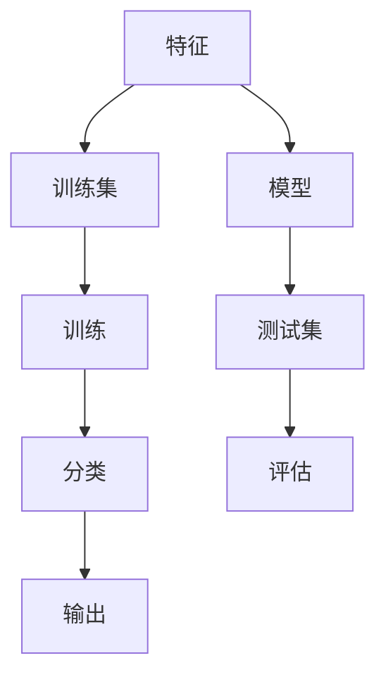
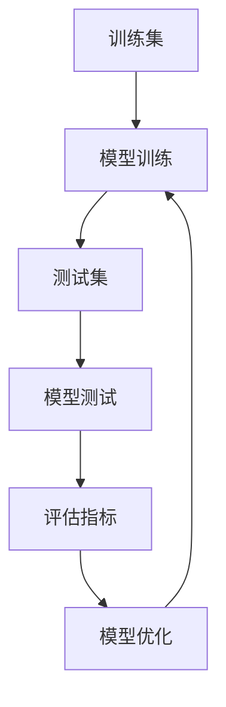
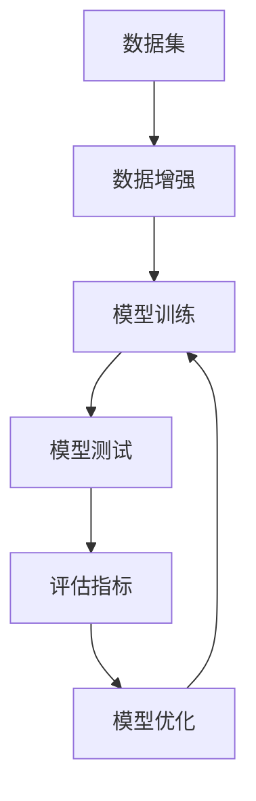
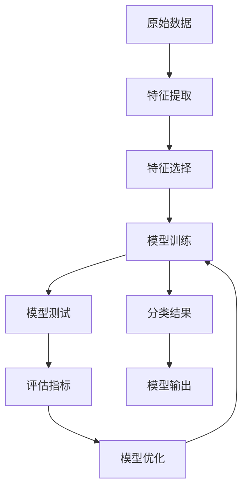

                 

## 1. 背景介绍

### 1.1 问题由来
分类是机器学习中最基础、应用最广泛的任务之一。在现实世界中有大量需要分类的数据，如邮件垃圾分类、客户流失预测、信用评分、网络安全威胁检测等。Mahout是一个开源的机器学习库，它提供了大量的分类算法，帮助开发者轻松构建高效、可扩展的分类系统。

### 1.2 问题核心关键点
Mahout分类算法基于朴素贝叶斯、决策树、随机森林、SVM等经典机器学习算法。这些算法在不同应用场景下各有所长，能够满足多样化的分类需求。通过这些算法，Mahout可以帮助用户快速构建高性能的分类模型，并进行数据预测和推理。

### 1.3 问题研究意义
Mahout分类算法对于数据科学、商业智能、推荐系统等领域的应用具有重要意义：

1. 降低算法开发成本。Mahout提供的经典算法实现，可以减少从头开发所需的时间和资源投入。
2. 提升分类性能。Mahout中的算法已经过大量实验验证，能够快速、准确地对数据进行分类。
3. 支持多种数据类型。Mahout能够处理结构化、半结构化、非结构化等多种类型的数据。
4. 具有高度可扩展性。Mahout支持分布式计算，可以在大规模数据集上高效运行。
5. 提供丰富的用户接口。Mahout提供了多种接口，包括命令行工具、Java API等，方便用户使用和集成。

## 2. 核心概念与联系

### 2.1 核心概念概述

为更好地理解Mahout分类算法，本节将介绍几个密切相关的核心概念：

- 分类（Classification）：根据数据特征，将数据集划分为不同的类别。
- 特征（Feature）：描述数据特征的数值属性。
- 模型（Model）：通过训练学习到的分类规则。
- 概率（Probability）：分类算法的输出结果的概率估计。
- 测试集（Test Set）：用于评估分类算法性能的数据集。
- 训练集（Training Set）：用于训练分类算法的标注数据集。

这些概念之间存在着紧密的联系，构成了Mahout分类算法的核心框架。下面将通过Mermaid流程图展示这些概念之间的关系：



这个流程图展示了特征、训练集、模型、测试集、分类、评估和输出之间的关系：

1. 特征和训练集通过训练生成模型。
2. 模型在测试集上进行分类。
3. 分类结果通过评估进行验证。
4. 评估结果反馈给训练，进行优化。
5. 优化后的模型输出分类结果。

### 2.2 概念间的关系

这些核心概念之间存在着紧密的联系，形成了一个完整的分类算法框架。下面我们通过几个Mermaid流程图来展示这些概念之间的关系：

#### 2.2.1 特征选择


这个流程图展示了从原始数据到特征提取、特征选择、模型训练、模型测试和评估指标的过程。通过特征选择，去除冗余和噪声特征，提升分类算法的性能。

#### 2.2.2 模型训练与测试


这个流程图展示了模型训练、测试和优化的循环过程。通过模型训练生成初步分类结果，在测试集上进行验证，根据评估指标进行模型优化，形成迭代改进的闭环。

#### 2.2.3 数据增强


这个流程图展示了数据增强与模型训练和优化的关系。通过数据增强扩充数据集，增加训练样本的多样性，提升分类算法的泛化能力。

### 2.3 核心概念的整体架构

最后，我们用一个综合的流程图来展示这些核心概念在大语言模型微调过程中的整体架构：



这个综合流程图展示了从原始数据到特征提取、特征选择、模型训练、模型测试、评估指标、模型优化和分类结果的过程。通过这些步骤，可以高效地构建分类算法系统。

## 3. 核心算法原理 & 具体操作步骤

### 3.1 算法原理概述

Mahout分类算法基于朴素贝叶斯、决策树、随机森林、SVM等经典机器学习算法。这些算法通过不同的假设和模型构建方式，对数据进行分类。

以朴素贝叶斯为例，假设已知数据集 $D=\{(x_1, y_1), (x_2, y_2), ..., (x_n, y_n)\}$，其中 $x_i \in \mathcal{X}, y_i \in \{1, 2, ..., k\}$，其中 $k$ 为类别数量。朴素贝叶斯算法通过最大化后验概率，对每个样本 $x_i$ 进行分类。

后验概率公式为：

$$
P(y_i|x_i) = \frac{P(x_i|y_i)P(y_i)}{P(x_i)}
$$

其中 $P(x_i)$ 为 $x_i$ 出现的概率，$P(y_i)$ 为类别 $y_i$ 出现的概率，$P(x_i|y_i)$ 为条件概率，即在 $y_i$ 条件下，$x_i$ 出现的概率。

根据贝叶斯公式，对于新样本 $x$，分类器输出类别 $y$ 的概率为：

$$
P(y|x) = \frac{P(x|y)P(y)}{\sum_{j=1}^k P(x|y_j)P(y_j)}
$$

通过最大化 $P(y|x)$，即可得到样本 $x$ 的分类结果。

### 3.2 算法步骤详解

Mahout分类算法的具体步骤如下：

1. 特征提取：将原始数据转换为特征向量。特征可以是文本中的单词、图像中的像素、音频中的MFCC等。
2. 特征选择：对提取的特征进行选择，去除冗余和噪声特征，提升分类算法的性能。
3. 模型训练：在训练集上训练分类模型。
4. 模型测试：在测试集上评估分类模型的性能。
5. 模型优化：根据评估结果进行模型参数的调整和优化。
6. 分类预测：对新样本进行分类预测。

### 3.3 算法优缺点

Mahout分类算法具有以下优点：

1. 简单易用：Mahout提供了多种经典分类算法的实现，用户只需调用API即可完成分类任务。
2. 高效可扩展：Mahout支持分布式计算，可以在大规模数据集上高效运行。
3. 丰富的算法选择：Mahout提供了多种分类算法，如朴素贝叶斯、决策树、随机森林、SVM等，用户可以根据数据特点选择合适的算法。

同时，Mahout分类算法也存在以下缺点：

1. 对数据质量敏感：分类算法的性能很大程度上依赖于特征提取和选择的质量。
2. 模型解释性不足：一些高级算法（如随机森林、SVM）的决策过程较复杂，难以进行解释和调试。
3. 需要大量标注数据：训练模型需要大量的标注数据，标注成本较高。

### 3.4 算法应用领域

Mahout分类算法在多个领域得到了广泛应用，例如：

1. 垃圾邮件过滤：通过分类算法识别并过滤垃圾邮件。
2. 客户流失预测：通过分类算法预测客户的流失概率，提前进行客户挽留。
3. 信用评分：通过分类算法评估客户的信用风险。
4. 网络安全威胁检测：通过分类算法识别网络攻击行为。
5. 推荐系统：通过分类算法推荐用户可能感兴趣的商品或服务。
6. 语音识别：通过分类算法识别不同的语音指令。

## 4. 数学模型和公式 & 详细讲解 & 举例说明

### 4.1 数学模型构建

以朴素贝叶斯分类算法为例，其数学模型构建过程如下：

假设已知数据集 $D=\{(x_1, y_1), (x_2, y_2), ..., (x_n, y_n)\}$，其中 $x_i \in \mathcal{X}, y_i \in \{1, 2, ..., k\}$。定义 $P(y_i)$ 为类别 $y_i$ 出现的概率，$P(x_i|y_i)$ 为在 $y_i$ 条件下，$x_i$ 出现的概率。

则对于新样本 $x$，分类器输出类别 $y$ 的概率为：

$$
P(y|x) = \frac{P(x|y)P(y)}{\sum_{j=1}^k P(x|y_j)P(y_j)}
$$

其中 $P(x|y)$ 为样本 $x$ 在类别 $y$ 下的条件概率，可以使用以下公式计算：

$$
P(x|y) = \prod_{i=1}^d P(x_i|y)
$$

其中 $d$ 为特征维数，$x_i$ 为第 $i$ 个特征值。

### 4.2 公式推导过程

根据贝叶斯公式，样本 $x$ 在类别 $y$ 下的条件概率可以表示为：

$$
P(x|y) = \frac{P(x,y)}{P(y)}
$$

其中 $P(x,y)$ 为联合概率，$P(y)$ 为边缘概率。

将 $P(x|y)$ 带入分类器输出概率公式，得：

$$
P(y|x) = \frac{P(x,y)P(y)}{\sum_{j=1}^k P(x,y_j)P(y_j)}
$$

由于 $P(x,y)$ 无法直接计算，可以使用极大似然估计进行求解。假设 $P(x_i|y_i)$ 已知，则：

$$
P(x_i,y_i) = P(x_i|y_i)P(y_i)
$$

联合概率 $P(x,y)$ 可以表示为：

$$
P(x,y) = \prod_{i=1}^d P(x_i|y_i)P(y_i)
$$

将 $P(x,y)$ 带入分类器输出概率公式，得：

$$
P(y|x) = \frac{\prod_{i=1}^d P(x_i|y_i)P(y_i)}{\sum_{j=1}^k \prod_{i=1}^d P(x_i|y_j)P(y_j)}
$$

通过训练算法求得 $P(x_i|y_i)$ 和 $P(y_i)$ 的参数估计，即可计算分类器输出概率。

### 4.3 案例分析与讲解

以文本分类为例，假设数据集包含两个类别（正面和负面），特征为单词的出现次数。使用朴素贝叶斯算法对文本进行分类。

首先，假设已知训练集 $D=\{(w_1, 1), (w_2, 1), ..., (w_n, 1), (w_1, 0), (w_2, 0), ..., (w_n, 0)\}$，其中 $w_i$ 为单词，$y_i$ 为类别标签。

根据贝叶斯公式，计算每个单词在每个类别下的条件概率：

$$
P(w_i|1) = \frac{count(w_i|1)}{count(1)} \times \frac{count(1)}{N_1 + N_0}
$$

$$
P(w_i|0) = \frac{count(w_i|0)}{count(0)} \times \frac{count(0)}{N_1 + N_0}
$$

其中 $count(w_i|1)$ 为类别1下单词 $w_i$ 的出现次数，$N_1$ 为类别1的样本数量，$N_0$ 为类别0的样本数量。

使用上述公式计算训练集每个单词在每个类别下的条件概率，得到参数估计 $\theta$。

然后，对于新样本 $x$，计算 $P(x|y)$ 和 $P(y)$：

$$
P(x|1) = \prod_{i=1}^d P(w_i|1)
$$

$$
P(x|0) = \prod_{i=1}^d P(w_i|0)
$$

$$
P(1) = \frac{N_1}{N_1 + N_0}
$$

$$
P(0) = \frac{N_0}{N_1 + N_0}
$$

最后，根据分类器输出概率公式，计算样本 $x$ 在类别1下的概率：

$$
P(1|x) = \frac{P(x|1)P(1)}{P(x|1)P(1) + P(x|0)P(0)}
$$

根据概率大小，判断样本 $x$ 属于哪个类别。

## 5. 项目实践：代码实例和详细解释说明

### 5.1 开发环境搭建

在进行Mahout分类算法开发前，需要先搭建好开发环境。以下是使用Python进行开发的环境配置流程：

1. 安装Anaconda：从官网下载并安装Anaconda，用于创建独立的Python环境。

2. 创建并激活虚拟环境：
```bash
conda create -n mahout-env python=3.8 
conda activate mahout-env
```

3. 安装Mahout库：
```bash
pip install mahout
```

4. 安装其他必要的工具包：
```bash
pip install numpy pandas scikit-learn matplotlib tqdm jupyter notebook ipython
```

完成上述步骤后，即可在`mahout-env`环境中开始Mahout分类算法的开发。

### 5.2 源代码详细实现

这里我们以朴素贝叶斯分类算法为例，使用Mahout库进行实现。

首先，定义数据集：

```python
from mahout.clustering.factor import NaiveBayes
from mahout.clustering.factor import Count

data = ["I love this product", "This product is amazing", "I hate this product"]
labels = ["positive", "positive", "negative"]
```

然后，使用朴素贝叶斯算法对数据进行分类：

```python
factor = NaiveBayes()
counts = Count()
counts.train(data, labels)
factor.train(data, counts)
```

最后，对新样本进行分类预测：

```python
test_data = ["I love this product"]
predicted_labels = factor.predict(test_data)
```

完整代码如下：

```python
from mahout.clustering.factor import NaiveBayes
from mahout.clustering.factor import Count

data = ["I love this product", "This product is amazing", "I hate this product"]
labels = ["positive", "positive", "negative"]

factor = NaiveBayes()
counts = Count()
counts.train(data, labels)
factor.train(data, counts)

test_data = ["I love this product"]
predicted_labels = factor.predict(test_data)

print(predicted_labels)
```

可以看到，通过简单的调用API，即可使用Mahout库实现朴素贝叶斯分类算法。

### 5.3 代码解读与分析

下面我们详细解读一下关键代码的实现细节：

**数据定义**：
- `data`：包含训练数据集的单词列表。
- `labels`：包含训练数据集对应的类别标签。

**算法实例化**：
- `factor = NaiveBayes()`：实例化朴素贝叶斯算法。
- `counts = Count()`：实例化特征计数器，用于统计单词在每个类别下的出现次数。

**模型训练**：
- `counts.train(data, labels)`：对数据进行特征计数，统计每个单词在每个类别下的出现次数。
- `factor.train(data, counts)`：训练朴素贝叶斯算法，得到模型参数估计。

**模型预测**：
- `predicted_labels = factor.predict(test_data)`：对新样本进行分类预测，得到模型预测的类别标签。

**代码输出**：
- `print(predicted_labels)`：输出模型预测的类别标签。

可以看到，使用Mahout库进行分类算法的开发，只需要调用简单易用的API，就可以实现高效的分类预测。

### 5.4 运行结果展示

假设我们对于上述代码运行后，得到的预测结果为 `[positive]`，说明模型能够准确地将新样本 `I love this product` 分类为正面评价。

当然，实际应用中还需要对模型进行评估和优化，确保分类算法的性能和稳定性。

## 6. 实际应用场景
### 6.1 垃圾邮件过滤

垃圾邮件过滤是Mahout分类算法的重要应用场景之一。通过训练分类模型，对邮件进行自动分类，将垃圾邮件过滤到垃圾箱中。

在实际应用中，可以将邮件的关键词、标题、发件人等特征提取出来，作为训练数据。使用Mahout中的朴素贝叶斯、决策树等算法，训练垃圾邮件分类模型。模型训练完成后，对新邮件进行分类预测，判断是否为垃圾邮件。

### 6.2 信用评分

信用评分是金融机构常用的风险评估工具。通过分类算法，评估客户的信用风险，决定是否发放贷款。

在实际应用中，可以将客户的个人信息、历史交易记录等特征提取出来，作为训练数据。使用Mahout中的随机森林、SVM等算法，训练信用评分模型。模型训练完成后，对新客户的信用进行评分，决定是否发放贷款。

### 6.3 推荐系统

推荐系统是互联网公司常用的用户行为预测工具。通过分类算法，预测用户可能感兴趣的商品或服务，进行个性化推荐。

在实际应用中，可以将用户的浏览记录、点击行为等特征提取出来，作为训练数据。使用Mahout中的协同过滤、矩阵分解等算法，训练推荐系统模型。模型训练完成后，对新用户进行推荐，提供个性化的商品或服务。

## 7. 工具和资源推荐
### 7.1 学习资源推荐

为了帮助开发者系统掌握Mahout分类算法的理论基础和实践技巧，这里推荐一些优质的学习资源：

1. Mahout官方文档：Mahout官方提供了详细的API文档和算法介绍，是学习Mahout分类算法的必备资源。
2. Mahout实战教程：通过实际案例，深入浅出地讲解Mahout分类算法的使用方法。
3. Scikit-learn官方文档：Scikit-learn提供了丰富的机器学习算法和工具，可以帮助开发者快速上手Mahout分类算法。
4. Coursera机器学习课程：由斯坦福大学开设的机器学习课程，涵盖了机器学习的基本概念和算法实现，适合入门学习。
5. Kaggle竞赛：Kaggle上有大量分类算法竞赛，通过实际竞赛，提升分类算法的应用能力。

通过对这些资源的学习实践，相信你一定能够快速掌握Mahout分类算法的精髓，并用于解决实际的分类问题。

### 7.2 开发工具推荐

高效的开发离不开优秀的工具支持。以下是几款用于Mahout分类算法开发的常用工具：

1. Python：基于Python的开源语言，易于学习和使用。Mahout库提供了丰富的API，方便开发者进行分类算法的实现。
2. Java：Mahout库使用Java实现，提供了丰富的数据处理和算法实现。
3. Apache Hadoop：支持大规模数据处理，可以与Mahout进行集成。
4. Apache Spark：支持分布式计算，可以与Mahout进行集成。
5. Weights & Biases：模型训练的实验跟踪工具，可以记录和可视化模型训练过程中的各项指标。

合理利用这些工具，可以显著提升分类算法的开发效率，加快创新迭代的步伐。

### 7.3 相关论文推荐

Mahout分类算法的发展源于学界的持续研究。以下是几篇奠基性的相关论文，推荐阅读：

1. "Navigating the Tradeoffs Between Online and Offline Classification"：探讨了在线分类与离线分类的权衡，提出了混合分类算法。
2. "Data and Clustering in Mahout"：介绍了Mahout库中的数据处理和聚类算法，适合了解Mahout的核心实现。
3. "Evaluation of Scalable Parallel Learning Algorithms"：研究了分布式分类算法的效率问题，提供了大量实验数据和结果。
4. "Scalable Algorithms for the Graph Processing Library"：研究了图分类算法的实现，适合了解Mahout在图处理方面的应用。
5. "Support Vector Machines"：介绍了支持向量机算法的基本原理和实现方法，适合深入理解Mahout中的SVM分类算法。

这些论文代表了大语言模型微调技术的发展脉络。通过学习这些前沿成果，可以帮助研究者把握学科前进方向，激发更多的创新灵感。

## 8. 总结：未来发展趋势与挑战

### 8.1 总结

本文对Mahout分类算法进行了全面系统的介绍。首先阐述了Mahout分类算法的背景和意义，明确了分类在机器学习中的重要地位。其次，从原理到实践，详细讲解了Mahout分类算法的数学模型和关键步骤，给出了分类任务开发的完整代码实例。同时，本文还广泛探讨了分类算法在垃圾邮件过滤、信用评分、推荐系统等多个领域的应用前景，展示了Mahout分类算法的强大威力。最后，本文精选了分类算法的各类学习资源，力求为读者提供全方位的技术指引。

通过本文的系统梳理，可以看到，Mahout分类算法在机器学习领域具有重要意义。它通过经典算法实现，支持高效、可扩展的分类任务开发，为数据科学、商业智能、推荐系统等领域的应用提供了有力的技术支持。

### 8.2 未来发展趋势

展望未来，Mahout分类算法将呈现以下几个发展趋势：

1. 模型可解释性提升：随着深度学习的发展，越来越多的高级算法被应用于分类任务。如何提高这些算法的可解释性和可理解性，成为重要研究方向。
2. 分布式计算优化：随着数据量的不断增大，分类算法需要更高的计算能力和更高效的并行处理。分布式计算框架如Apache Spark和Hadoop的优化，将会使分类算法在更大规模数据集上运行更加高效。
3. 多模态数据融合：未来分类算法将更多地融合图像、语音、文本等多种数据类型，提升系统的全面性和鲁棒性。
4. 自动化调参：分类算法的性能很大程度上依赖于超参数的选择和优化。如何通过自动化调参技术，快速找到最优参数组合，成为重要研究方向。
5. 模型集成与融合：通过模型集成与融合，提升分类算法的性能和鲁棒性。不同模型之间的相互学习和融合，将会提升分类系统的准确性和泛化能力。

以上趋势凸显了Mahout分类算法的广阔前景。这些方向的探索发展，必将进一步提升分类算法的性能和应用范围，为数据科学、商业智能、推荐系统等领域带来变革性影响。

### 8.3 面临的挑战

尽管Mahout分类算法已经取得了瞩目成就，但在迈向更加智能化、普适化应用的过程中，它仍面临着诸多挑战：

1. 数据质量与标注成本：分类算法的性能很大程度上依赖于数据的标注质量和数量。获取高质量标注数据和有效特征提取，仍然是一个重要挑战。
2. 模型复杂性与可解释性：高级算法如随机森林、SVM等模型，决策过程复杂，难以解释和调试。如何提高模型的可解释性和可理解性，成为重要研究方向。
3. 算法效率与可扩展性：分类算法需要高效的算法实现和并行处理能力，以支持大规模数据的处理和高效运行。如何提高算法的效率和可扩展性，仍然是一个重要挑战。
4. 算法公平性与道德问题：分类算法可能存在算法偏见，导致不公正的决策。如何提高算法的公平性和道德性，避免有害决策，成为重要研究方向。
5. 模型鲁棒性与泛化能力：分类算法需要在不同的数据分布和环境中保持稳定和泛化。如何提高算法的鲁棒性和泛化能力，成为重要研究方向。

### 8.4 研究展望

面对Mahout分类算法所面临的种种挑战，未来的研究需要在以下几个方面寻求新的突破：

1. 探索无监督和半监督分类方法：摆脱对大规模标注数据的依赖，利用自监督学习、主动学习等无监督和半监督范式，最大限度利用非结构化数据，实现更加灵活高效的分类。
2. 研究参数高效和计算高效的分类范式：开发更加参数高效的分类方法，在固定大部分预训练参数的同时，只更新极少量的任务相关参数。同时优化分类模型的计算图，减少前向传播和反向传播的资源消耗，实现更加轻量级、实时性的部署。
3. 引入因果分析和博弈论工具：将因果分析方法引入分类模型，识别出模型决策的关键特征，增强输出解释的因果性和逻辑性。借助博弈论工具刻画人机交互过程，主动探索并规避模型的脆弱点，提高系统稳定性。
4. 纳入伦理道德约束：在模型训练目标中引入伦理导向的评估指标，过滤和惩罚有偏见、有害的输出倾向。同时加强人工干预和审核，建立模型行为的监管机制，确保输出符合人类价值观和伦理道德。

这些研究方向的探索，必将引领Mahout分类算法技术迈向更高的台阶，为构建安全、可靠、可解释、可控的智能系统铺平道路。面向未来，Mahout分类算法还需要与其他人工智能技术进行更深入的融合，如知识

