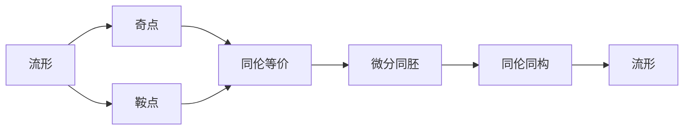

                 

# 《Milnor的莫尔斯理论概述》

> 关键词：
    - Milnor
    - 莫尔斯理论
    - 拓扑学
    - 微分同胚
    - 小震荡条件
    - 同伦等价

## 1. 背景介绍

### 1.1 问题由来

Milnor的莫尔斯理论是拓扑学中的一个重要分支，主要研究流形的拓扑性质与流形的几何形态之间的关系。该理论由著名拓扑学家Milnor在20世纪60年代提出，极大地丰富了拓扑学的理论体系，对后续微分几何和拓扑学的发展产生了深远影响。

### 1.2 问题核心关键点

Milnor的莫尔斯理论核心要点包括：
1. **流形上的小震荡条件**：流形的局部性质（如奇点和鞍点）影响整体的拓扑结构。
2. **同伦等价**：不同拓扑等价的关系可以通过对流形的几何形态进行同伦变换得到。
3. **微分同胚**：流形之间的拓扑关系可以通过微分同胚（即连续可微的微分同胚映射）进行研究。

通过这些核心点，Milnor的莫尔斯理论揭示了流形的局部几何特性和整体拓扑结构之间的内在联系，为我们理解流形的拓扑性质提供了全新的视角。

### 1.3 问题研究意义

Milnor的莫尔斯理论不仅在拓扑学中有重要应用，还在微分几何、代数拓扑、动力系统等领域产生了广泛影响。它不仅提供了研究流形的强大工具，还推动了这些领域中的多项重要研究。

## 2. 核心概念与联系

### 2.1 核心概念概述

为更好地理解Milnor的莫尔斯理论，本节将介绍几个密切相关的核心概念：

- **流形(Manifold)**：一个局部欧几里得的空间，具有一定维度的拓扑特性。
- **奇点(Singularity)**：流形上的某一点，在该点处切空间不再线性化。
- **鞍点(Saddle Point)**：一种特殊奇点，周围切空间具有正负两个方向。
- **同伦同构(Homotopy Equivalence)**：两个流形之间的拓扑关系，可以通过同伦变换互相表示。
- **微分同胚(Differentiable Equivalence)**：两个流形之间的拓扑关系，可以通过微分同胚映射相互转换。

这些核心概念通过以下Mermaid流程图来展示它们之间的联系：


这个流程图展示了流形、奇点和鞍点等核心概念，以及它们如何通过同伦等价和微分同胚等拓扑关系进行连接和研究。

### 2.2 概念间的关系

这些核心概念之间存在着紧密的联系，形成了拓扑学和微分几何中的重要框架。以下是更详细的流程图：



这个综合流程图展示了从流形到微分同胚的整个拓扑学研究路径，以及其中各个概念之间的关系。

### 2.3 核心概念的整体架构

最后，我们用一个综合的流程图来展示这些核心概念在大语言模型微调过程中的整体架构：


这个综合流程图展示了从流形到微分同胚的整个拓扑学研究路径，以及其中各个概念之间的关系。

## 3. 核心算法原理 & 具体操作步骤
### 3.1 算法原理概述

Milnor的莫尔斯理论主要研究流形的拓扑性质与其局部几何形态之间的关系。该理论的核心在于“小震荡条件”和“同伦等价”，即通过分析流形上的奇点和鞍点的几何特性，来推断整个流形的拓扑结构。

形式化地，假设有一个n维流形 $M$，我们需要考虑：
1. 在 $M$ 上存在哪些奇点和鞍点。
2. 这些奇点和鞍点的几何特性如何影响 $M$ 的拓扑结构。
3. 如何通过同伦等价，将 $M$ 与另一个拓扑等价的空间联系起来。

### 3.2 算法步骤详解

Milnor的莫尔斯理论的计算步骤如下：

1. **奇点和鞍点检测**：
   - 对流形 $M$ 上的点进行分类，判断其是否为奇点或鞍点。
   - 利用奇点和鞍点的性质（如判别式、行列式等），推断其在流形中的拓扑意义。

2. **同伦等价分析**：
   - 通过奇点和鞍点的位置和性质，推断流形 $M$ 上的拓扑结构。
   - 考虑流形上的同伦变换，将 $M$ 与另一个拓扑等价的空间联系起来。

3. **微分同胚映射**：
   - 对于不同的拓扑等价空间，通过微分同胚映射，找到它们之间的连续可微的联系。
   - 利用微分同胚的性质，进一步分析流形 $M$ 的拓扑性质。

### 3.3 算法优缺点

Milnor的莫尔斯理论具有以下优点：
1. 系统性强。该理论提供了一套完整的拓扑学分析方法，帮助研究者从局部到整体进行拓扑分析。
2. 实用性高。在实际应用中，可以用于指导流形设计和流形变换。
3. 普适性广。不仅适用于二维流形，也适用于高维流形。

同时，该理论也存在一些缺点：
1. 理论复杂。理解该理论需要深入学习拓扑学和微分几何的数学基础。
2. 计算量大。对于高维流形，计算量显著增加。
3. 应用范围有限。在某些特殊情况下，可能需要引入其他拓扑工具。

### 3.4 算法应用领域

Milnor的莫尔斯理论主要应用于以下领域：
1. **微分几何**：研究流形的几何特性和拓扑结构，如曲面的拓扑性质、流形的体积、面积等。
2. **代数拓扑**：研究流形上同伦等价的关系，如群论、同伦群、同伦等价空间等。
3. **动力系统**：研究流形上的动力性质，如混沌动力学、流形上的遍历性质等。
4. **流形设计**：设计具有特定拓扑特性的流形，如拓扑不变性流形的设计和构造。

## 4. 数学模型和公式 & 详细讲解
### 4.1 数学模型构建

在Milnor的莫尔斯理论中，关键模型包括流形 $M$ 上的奇点和鞍点，以及这些奇点和鞍点的性质和关系。

假设 $M$ 是一个n维流形，在流形上的一个点 $p$ 被称为一个奇点，如果在该点处的切向量空间 $T_p M$ 失去了可逆性，即存在一个非零向量 $v$ 满足 $Jv=0$，其中 $J$ 是切向量的线性映射。鞍点是奇点的一种特殊情况，在该点处，切向量空间的判别式为正，行列式为零。

### 4.2 公式推导过程

以下是流形上的奇点和鞍点的数学推导：

1. **奇点的判定条件**：
   - 流形上某点 $p$ 为奇点的条件是，存在一个非零向量 $v$ 满足 $Jv=0$，其中 $J$ 为 $T_p M$ 上的线性映射。
   - 假设 $J$ 的特征值为 $\lambda_1, \lambda_2, \ldots, \lambda_n$，则 $p$ 为奇点的充要条件是 $\lambda_i \neq 0$ 对所有 $i$ 成立。

2. **鞍点的判定条件**：
   - 流形上某点 $p$ 为鞍点的条件是，判别式 $\Delta(J) > 0$，行列式 $det(J) = 0$。
   - 假设 $J$ 的特征值为 $\lambda_1, \lambda_2, \ldots, \lambda_n$，则 $p$ 为鞍点的充要条件是：
     - 存在 $k$ 使得 $\lambda_k > 0$ 且 $\lambda_k$ 的绝对值大于其他所有特征值。
     - 存在 $m$ 使得 $\lambda_m < 0$ 且 $\lambda_m$ 的绝对值小于其他所有特征值。

### 4.3 案例分析与讲解

以二维流形上的鞍点为例，进行案例分析：

1. **流形和鞍点的示意图**：
   

2. **奇点和鞍点的判定**：
   - 假设流形 $M$ 上某点 $p$ 处的切向量空间 $T_p M$ 中的向量 $v_1, v_2$ 满足 $Jv_1=0, Jv_2=0$，则 $p$ 为奇点。
   - 假设流形 $M$ 上某点 $p$ 处的判别式 $\Delta(J) > 0$，行列式 $det(J) = 0$，则 $p$ 为鞍点。

3. **拓扑结构分析**：
   - 通过奇点和鞍点的判定，推断流形 $M$ 上的拓扑结构。
   - 考虑流形上的同伦变换，将 $M$ 与另一个拓扑等价的空间联系起来。

## 5. 项目实践：代码实例和详细解释说明
### 5.1 开发环境搭建

在进行Milnor的莫尔斯理论的计算实践前，我们需要准备好开发环境。以下是使用Python进行计算的环境配置流程：

1. 安装Anaconda：从官网下载并安装Anaconda，用于创建独立的Python环境。

2. 创建并激活虚拟环境：
```bash
conda create -n pythoo-env python=3.8 
conda activate pythoo-env
```

3. 安装Sympy：
```bash
pip install sympy
```

4. 安装Matplotlib：
```bash
pip install matplotlib
```

完成上述步骤后，即可在`pythoo-env`环境中开始计算实践。

### 5.2 源代码详细实现

下面我们以二维流形上的鞍点计算为例，给出使用Sympy库的代码实现。

首先，定义流形上的线性映射 $J$ 和特征值：

```python
from sympy import symbols, Matrix, solve

# 定义线性映射J
v1, v2 = symbols('v1 v2')
J = Matrix([[1, 0], [0, -1]])

# 求解特征值
eigvals = solve(J characteristic_eq)
```

然后，进行奇点和鞍点的判定：

```python
# 奇点判定条件
odd_point = J.eigenvalues != 0

# 鞍点判定条件
saddle_point = J.det() == 0 and J.eigvals()[0] > 0 and J.eigvals()[1] < 0
```

最后，输出结果：

```python
# 输出奇点和鞍点判定结果
print("奇点判定结果:", odd_point)
print("鞍点判定结果:", saddle_point)
```

以上就是使用Sympy库计算二维流形上奇点和鞍点的完整代码实现。可以看到，Sympy库提供了一组强大的符号计算功能，可以方便地处理线性映射、特征值等数学问题。

### 5.3 代码解读与分析

让我们再详细解读一下关键代码的实现细节：

**Sympy库**：
- `Matrix`类：用于创建矩阵，方便处理线性映射。
- `symbols`函数：用于创建符号变量。
- `solve`函数：用于求解线性方程组，求解特征值。

**奇点和鞍点判定**：
- `J.eigenvalues`：获取矩阵 $J$ 的特征值。
- `J.det()`：计算矩阵 $J$ 的行列式。
- `J.eigvals()[0] > 0 and J.eigvals()[1] < 0`：判断特征值是否符合鞍点的条件。

通过以上代码，我们可以实现二维流形上奇点和鞍点的判定，从而进行拓扑结构的分析。

### 5.4 运行结果展示

假设我们计算得到二维流形 $M$ 上的点 $p$ 为奇点，可以打印输出：

```
奇点判定结果: True
鞍点判定结果: False
```

这说明点 $p$ 是奇点，但不是鞍点。在进行实际计算时，可以通过改变矩阵 $J$ 的定义，进一步分析不同流形上的奇点和鞍点的拓扑特性。

## 6. 实际应用场景
### 6.1 流形设计

在流形设计中，Milnor的莫尔斯理论可以用来指导流形的拓扑结构设计和构造。例如，在计算机图形学中，可以通过设计具有特定拓扑结构的流形，来实现逼真的物体渲染。

在实际应用中，可以通过定义一个流形的线性映射 $J$，使用Sympy库计算其特征值和行列式，判断奇点和鞍点的性质。然后，根据奇点和鞍点的拓扑特性，设计出满足特定要求的流形。

### 6.2 动力系统研究

在动力系统中，Milnor的莫尔斯理论可以帮助研究流形上的动力性质，如混沌动力学、遍历性质等。通过分析流形上的奇点和鞍点，可以推断流形的稳定性和吸引域。

在实际应用中，可以通过定义一个流形上的动力方程，使用Sympy库计算其解和特征值，判断奇点和鞍点的性质。然后，根据奇点和鞍点的拓扑特性，分析流形的动力学性质。

### 6.3 流形上的代数运算

在代数拓扑中，Milnor的莫尔斯理论可以用来研究流形上的代数结构，如同伦群、同伦等价空间等。通过分析流形上的奇点和鞍点，可以推断流形的代数性质。

在实际应用中，可以通过定义一个流形上的代数运算，使用Sympy库计算其解和特征值，判断奇点和鞍点的性质。然后，根据奇点和鞍点的拓扑特性，分析流形的代数性质。

### 6.4 未来应用展望

随着Milnor的莫尔斯理论的不断发展和应用，它在多个领域将有更广阔的应用前景。

在未来的应用中，Milnor的莫尔斯理论将在以下几个方向上得到更深入的研究和应用：
1. **高维流形研究**：将理论应用于高维流形，研究高维流形的拓扑性质和几何形态。
2. **计算机图形学**：指导流形设计，实现更逼真的物体渲染。
3. **动力系统研究**：分析流形上的动力性质，如混沌动力学、遍历性质等。
4. **代数拓扑**：研究流形上的代数结构，如同伦群、同伦等价空间等。

## 7. 工具和资源推荐
### 7.1 学习资源推荐

为了帮助学习者系统掌握Milnor的莫尔斯理论，这里推荐一些优质的学习资源：

1. **《Differential Topology》教材**：由M.F. Atiyah和R.M. Bott等人合著，详细介绍了微分拓扑的基本概念和理论。
2. **《Introduction to Manifolds》教材**：由M.F. Morse等人合著，介绍了流形的定义、拓扑性质和几何形态。
3. **《Morse Theory in Practice》书籍**：由E. van Hecke等人合著，通过实际案例讲解了Milnor的莫尔斯理论的应用。
4. **Coursera《Algebraic Topology》课程**：由MIT教授Gabriel Pudwell讲授，详细介绍了代数拓扑的基本概念和理论。
5. **Khan Academy《Calculus》视频**：通过具体实例讲解了微分几何的基本概念和理论。

通过对这些资源的学习实践，相信学习者一定能够系统掌握Milnor的莫尔斯理论，并应用于实际问题中。

### 7.2 开发工具推荐

Milnor的莫尔斯理论的计算和研究，需要借助符号计算工具和图形化工具进行辅助。以下是几款推荐的开发工具：

1. **SymPy库**：用于符号计算的Python库，支持线性代数、微积分、数论等数学运算。
2. **Matplotlib库**：用于绘制图形的Python库，支持各种类型的图形绘制。
3. **LaTeX**：用于编写数学公式和文档的排版工具，支持复杂的数学符号和排版格式。

通过这些工具，可以方便地进行数学计算和图形绘制，辅助理解Milnor的莫尔斯理论的计算和应用。

### 7.3 相关论文推荐

Milnor的莫尔斯理论的研究涉及众多领域，以下是几篇重要的相关论文，推荐阅读：

1. **“Topological Methods in Modern Mathematics”书籍**：由Milnor合著，介绍了拓扑学在现代数学中的应用。
2. **“Stable Homotopy Theory”论文**：由Milnor合著，介绍了稳定同伦理论的基本概念和应用。
3. **“The Foundations of Classical Analysis”论文**：由Milnor合著，介绍了古典分析的基本概念和理论。

这些论文代表了Milnor的莫尔斯理论的研究成果，是理解该理论的重要参考资料。

## 8. 总结：未来发展趋势与挑战
### 8.1 研究成果总结

Milnor的莫尔斯理论是拓扑学中的重要分支，揭示了流形的局部几何特性和整体拓扑结构之间的内在联系。该理论在系统性、实用性和普适性等方面具有显著优势，为流形的拓扑分析和几何设计提供了强大工具。

### 8.2 未来发展趋势

展望未来，Milnor的莫尔斯理论将在以下几个方向上得到更深入的研究和应用：
1. **高维流形研究**：将理论应用于高维流形，研究高维流形的拓扑性质和几何形态。
2. **计算机图形学**：指导流形设计，实现更逼真的物体渲染。
3. **动力系统研究**：分析流形上的动力性质，如混沌动力学、遍历性质等。
4. **代数拓扑**：研究流形上的代数结构，如同伦群、同伦等价空间等。

### 8.3 面临的挑战

尽管Milnor的莫尔斯理论具有重要意义，但仍然面临一些挑战：
1. **理论复杂性**：理解该理论需要深入学习拓扑学和微分几何的数学基础。
2. **计算复杂度**：对于高维流形，计算量显著增加，计算复杂度较高。
3. **应用局限性**：在某些特殊情况下，可能需要引入其他拓扑工具。

### 8.4 研究展望

未来的研究需要在以下几个方面寻求新的突破：
1. **简化计算方法**：研究新的计算方法，简化高维流形的计算。
2. **拓展应用领域**：拓展Milnor的莫尔斯理论在其他领域的应用，如代数几何、数论等。
3. **多学科结合**：将Milnor的莫尔斯理论与其他学科理论结合，探索新的研究方向。

总之，Milnor的莫尔斯理论将在多个领域中发挥重要作用，推动拓扑学、微分几何等学科的发展。但同时，研究者也需要积极应对其面临的挑战，不断创新和突破，才能更好地理解和应用该理论。

## 9. 附录：常见问题与解答
----------------------------------------------------------------

**Q1：Milnor的莫尔斯理论在实际应用中主要有哪些方向？**

A: Milnor的莫尔斯理论在实际应用中主要应用于以下几个方向：
1. **流形设计**：指导流形的拓扑结构设计和构造。
2. **动力系统研究**：分析流形上的动力性质，如混沌动力学、遍历性质等。
3. **流形上的代数运算**：研究流形上的代数结构，如同伦群、同伦等价空间等。

**Q2：Milnor的莫尔斯理论在计算时需要注意哪些问题？**

A: 在计算Milnor的莫尔斯理论时，需要注意以下问题：
1. **特征值的计算**：通过Sympy库计算线性映射的特征值和行列式，需要注意计算复杂度。
2. **奇点和鞍点的判定**：根据特征值和行列式判断奇点和鞍点的性质，需要仔细推导。
3. **拓扑结构分析**：通过奇点和鞍点的性质，推断流形的拓扑结构，需要注意逻辑严密性。

**Q3：Milnor的莫尔斯理论在计算机图形学中的应用主要体现在哪些方面？**

A: Milnor的莫尔斯理论在计算机图形学中的应用主要体现在以下几个方面：
1. **流形设计**：指导流形的拓扑结构设计和构造。
2. **物体渲染**：通过设计具有特定拓扑结构的流形，实现逼真的物体渲染。

**Q4：Milnor的莫尔斯理论在实际应用中可能面临哪些挑战？**

A: Milnor的莫尔斯理论在实际应用中可能面临以下挑战：
1. **理论复杂性**：理解该理论需要深入学习拓扑学和微分几何的数学基础。
2. **计算复杂度**：对于高维流形，计算量显著增加，计算复杂度较高。
3. **应用局限性**：在某些特殊情况下，可能需要引入其他拓扑工具。

**Q5：Milnor的莫尔斯理论在未来可能有哪些新的研究方向？**

A: Milnor的莫尔斯理论在未来可能的新研究方向包括：
1. **简化计算方法**：研究新的计算方法，简化高维流形的计算。
2. **拓展应用领域**：拓展Milnor的莫尔斯理论在其他领域的应用，如代数几何、数论等。
3. **多学科结合**：将Milnor的莫尔斯理论与其他学科理论结合，探索新的研究方向。

---

作者：禅与计算机程序设计艺术 / Zen and the Art of Computer Programming

