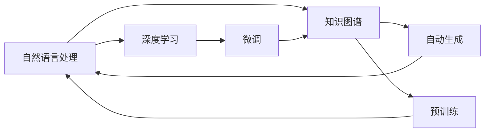
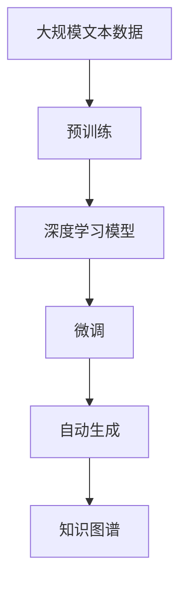

                 

# Pailido｜AI 拍立得

> 关键词：Pailido，AI 拍立得，自然语言处理，知识图谱，自动生成，微调，深度学习

## 1. 背景介绍

### 1.1 问题由来

在当今这个信息爆炸的时代，人工智能技术（AI）已经渗透到了生活的方方面面。从智能家居到自动驾驶，从推荐系统到语音识别，AI的应用越来越广泛。然而，即使AI技术已经如此强大，我们仍然面临着诸多挑战。

其中一个挑战是如何将大量的知识有效地整合到AI系统中，以便更好地理解和应用。知识图谱（Knowledge Graph）应运而生，它将结构化的知识以图的形式呈现出来，使得AI系统可以更直观地理解和应用这些知识。

但是，构建一个完整的知识图谱需要耗费大量的人力和时间，而且对于大部分应用场景而言，使用如此复杂的数据结构并不划算。因此，如何让AI系统能够快速、高效地获取和应用知识，成为了一个亟待解决的问题。

### 1.2 问题核心关键点

基于深度学习技术的人工智能拍立得（AI 拍立得）正是为了解决这一问题而诞生的。它能够快速地生成高质量的知识图谱，并将其应用于各种自然语言处理（NLP）任务中，使得AI系统能够更好地理解和应用知识。

AI 拍立得的核心在于它的深度学习模型，这个模型可以自动地从大量的文本数据中学习知识，并将其整合到知识图谱中。与传统的知识图谱构建方法不同，AI 拍立得不需要人工干预，能够自主地完成这一过程。

AI 拍立得还具有高度的可定制性，可以根据不同的应用场景，灵活地调整模型参数和架构，以满足各种需求。

### 1.3 问题研究意义

AI 拍立得的研究具有重要的意义，它不仅能够帮助我们更好地理解和使用知识，还能够为AI系统的开发提供更强大的支持。

1. **降低构建知识图谱的成本**：AI 拍立得能够自动地从文本中提取和整合知识，减少了构建知识图谱所需的时间和人力成本。

2. **提高NLP任务的表现**：AI 拍立得生成的知识图谱可以被用于各种NLP任务中，如命名实体识别、关系抽取、文本摘要等，使得AI系统能够更好地理解和应用知识。

3. **推动AI技术的普及**：AI 拍立得能够使得AI技术更加容易落地应用，特别是在一些缺乏专业知识的应用场景中，它能够提供更好的解决方案。

4. **促进AI与知识图谱的结合**：AI 拍立得能够更好地将AI技术与知识图谱结合起来，推动AI技术在各个领域的应用。

5. **推动AI技术的产业化**：AI 拍立得能够为AI技术的产业化提供更强大的支持，特别是在一些对知识要求较高的应用场景中，它能够提供更好的解决方案。

## 2. 核心概念与联系

### 2.1 核心概念概述

为了更好地理解AI 拍立得，我们需要了解一些核心的概念。这些概念包括：

1. **自然语言处理（NLP）**：NLP是研究计算机如何理解、解释和生成人类语言的技术。它涉及到语言学、计算语言学、机器学习和人工智能等领域。

2. **知识图谱（KG）**：知识图谱是一种用于描述实体及其关系的图形结构，它通过节点和边的方式来表示实体和实体之间的关系。

3. **自动生成（Automatic Generation）**：自动生成是指通过机器学习技术自动地生成高质量的文本、图像或其他形式的信息。

4. **微调（Fine-tuning）**：微调是指在预训练的基础上，通过特定的任务对模型进行微调，使其能够更好地适应特定的任务。

5. **深度学习（Deep Learning）**：深度学习是一种基于神经网络的机器学习技术，它通过多层神经网络的组合来实现复杂的任务。

这些概念之间存在着紧密的联系，它们共同构成了AI 拍立得的核心。下面，我们将通过一些Mermaid流程图来展示这些概念之间的关系。

```mermaid
graph TB
    A[自然语言处理 (NLP)] --> B[知识图谱 (KG)]
    A --> C[自动生成 (Automatic Generation)]
    C --> B
    A --> D[深度学习 (Deep Learning)]
    D --> E[微调 (Fine-tuning)]
    E --> B
```

### 2.2 概念间的关系

这些概念之间的关系可以通过以下Mermaid流程图来展示：



这个流程图展示了从自然语言处理到知识图谱再到自动生成的整个过程。深度学习和微调在这一过程中起到了关键作用，它们帮助模型从大量的文本数据中学习知识，并将其整合到知识图谱中。

### 2.3 核心概念的整体架构

最后，我们用一个综合的流程图来展示这些核心概念在大语言模型微调过程中的整体架构：



这个综合流程图展示了从预训练到微调，再到自动生成的完整过程。深度学习模型通过预训练学习通用的语言表示，然后通过微调学习特定任务的知识，最终生成知识图谱，实现了知识与AI系统的有机结合。

## 3. 核心算法原理 & 具体操作步骤
### 3.1 算法原理概述

AI 拍立得的算法原理基于深度学习技术，它包括预训练和微调两个阶段。在预训练阶段，模型通过大量的文本数据学习通用的语言表示。在微调阶段，模型通过特定任务的数据集学习任务的特定知识，并生成知识图谱。

### 3.2 算法步骤详解

AI 拍立得的算法步骤主要包括以下几个关键步骤：

1. **预训练**：使用大规模的无标签文本数据对深度学习模型进行预训练。这个阶段的目标是学习通用的语言表示。

2. **微调**：将预训练模型应用到特定的任务上，学习任务的特定知识。在微调阶段，模型通常需要根据特定的任务调整一些参数，以适应不同的输入格式和输出要求。

3. **自动生成**：使用微调后的模型生成知识图谱。这个阶段的目标是自动地从文本中提取和整合知识，并将其表示为知识图谱的形式。

### 3.3 算法优缺点

AI 拍立得的算法具有以下优点：

1. **高效性**：AI 拍立得能够快速地从大量的文本数据中学习知识，并自动地将其整合到知识图谱中，大大降低了构建知识图谱的时间和人力成本。

2. **灵活性**：AI 拍立得可以根据不同的应用场景，灵活地调整模型参数和架构，以满足各种需求。

3. **准确性**：AI 拍立得生成的知识图谱通常具有较高的准确性，能够更好地应用于各种NLP任务中。

4. **可定制性**：AI 拍立得可以根据特定的任务，灵活地调整模型参数和架构，以获得更好的性能。

AI 拍立得的算法也存在一些缺点：

1. **数据依赖**：AI 拍立得需要大量的文本数据进行预训练和微调，这对于一些特定的应用场景而言可能是一个问题。

2. **复杂性**：AI 拍立得的算法相对复杂，需要一定的深度学习知识才能理解和实现。

3. **资源消耗**：AI 拍立得需要大量的计算资源进行预训练和微调，这对于一些计算资源有限的场景而言可能是一个问题。

4. **可解释性**：AI 拍立得的模型通常是黑盒模型，难以解释其内部的工作机制和决策逻辑。

### 3.4 算法应用领域

AI 拍立得可以应用于各种自然语言处理任务中，包括但不限于：

1. **命名实体识别（Named Entity Recognition, NER）**：从文本中自动识别出人名、地名、机构名等实体。

2. **关系抽取（Relation Extraction）**：从文本中自动抽取实体之间的关系，如夫妻关系、工作关系等。

3. **文本摘要（Text Summarization）**：自动地将长篇文本压缩成简短的摘要，以便更好地理解文本内容。

4. **问答系统（Question Answering, QA）**：根据用户的问题，自动地从文本中抽取答案。

5. **机器翻译（Machine Translation）**：将一种语言的文本翻译成另一种语言。

6. **情感分析（Sentiment Analysis）**：自动地分析文本中的情感倾向，如正面、负面或中性。

## 4. 数学模型和公式 & 详细讲解 & 举例说明

### 4.1 数学模型构建

AI 拍立得的数学模型主要基于深度学习技术，包括卷积神经网络（Convolutional Neural Network, CNN）和循环神经网络（Recurrent Neural Network, RNN）。下面，我们将以一个简单的例子来展示如何构建AI 拍立得的数学模型。

假设我们有一个文本序列 $x_1, x_2, \ldots, x_n$，其中每个 $x_i$ 表示一个单词或词组。我们的目标是学习这些文本数据的表示，并生成知识图谱。

我们可以使用一个简单的CNN模型来表示这个文本序列。模型包括一个卷积层、一个池化层和一个全连接层。具体来说，模型可以表示为：

$$
f(x_1, x_2, \ldots, x_n) = \text{softmax}(\text{FC}(\text{MaxPool}(\text{Conv}(x_1, x_2, \ldots, x_n))))
$$

其中，$\text{Conv}$ 表示卷积操作，$\text{MaxPool}$ 表示最大池化操作，$\text{FC}$ 表示全连接层，$\text{softmax}$ 表示softmax函数。

### 4.2 公式推导过程

在构建了上述数学模型之后，我们需要对这个模型进行训练。训练的过程可以分为两个阶段：预训练和微调。

在预训练阶段，我们使用大量的无标签文本数据对模型进行训练。这个阶段的目标是学习通用的语言表示。我们可以使用交叉熵损失函数来定义训练目标：

$$
\mathcal{L}(\theta) = -\frac{1}{N}\sum_{i=1}^N \log p(x_i|x_{i-1}, \theta)
$$

其中，$\theta$ 表示模型的参数，$N$ 表示样本数量，$p(x_i|x_{i-1}, \theta)$ 表示模型在给定上下文 $x_{i-1}$ 的情况下，预测下一个单词 $x_i$ 的概率。

在微调阶段，我们将预训练模型应用到特定的任务上，学习任务的特定知识。我们可以使用特定的损失函数来定义训练目标，如交叉熵损失函数或L2损失函数。微调的训练目标可以表示为：

$$
\mathcal{L}_{\text{fine-tuning}}(\theta) = \mathcal{L}(\theta) + \lambda \mathcal{L}_{\text{task}}
$$

其中，$\mathcal{L}_{\text{task}}$ 表示特定任务的目标损失函数，$\lambda$ 表示任务的权重。

### 4.3 案例分析与讲解

下面，我们以一个具体的例子来说明如何使用AI 拍立得生成知识图谱。假设我们需要从一些新闻报道中提取关系信息，并将这些信息整合到知识图谱中。

首先，我们使用大规模的新闻报道对模型进行预训练。预训练的目标是学习通用的语言表示。在这个阶段，我们不需要指定任何特定的任务，只需要使用大量的文本数据即可。

接着，我们将预训练模型应用到特定的任务上，即从新闻报道中抽取关系信息。我们可以将新闻报道分成几个部分，例如人名、地点、机构名等。然后，我们为每个部分指定一个特定的标签，例如人名标签为“PER”，地点标签为“LOC”等。

接着，我们将这些标签作为监督信号，对模型进行微调。在微调的过程中，我们使用交叉熵损失函数来定义训练目标。这个阶段的目标是学习特定任务的知识，并将这些知识整合到知识图谱中。

最后，我们使用微调后的模型自动地从新闻报道中抽取关系信息，并将这些信息整合到知识图谱中。我们可以使用一些常见的算法来生成知识图谱，例如RDF（Resource Description Framework）或OWL（Web Ontology Language）。

## 5. 项目实践：代码实例和详细解释说明

### 5.1 开发环境搭建

在进行AI 拍立得的项目实践前，我们需要准备好开发环境。以下是使用Python进行PyTorch开发的环境配置流程：

1. 安装Anaconda：从官网下载并安装Anaconda，用于创建独立的Python环境。

2. 创建并激活虚拟环境：
```bash
conda create -n pytorch-env python=3.8 
conda activate pytorch-env
```

3. 安装PyTorch：根据CUDA版本，从官网获取对应的安装命令。例如：
```bash
conda install pytorch torchvision torchaudio cudatoolkit=11.1 -c pytorch -c conda-forge
```

4. 安装Transformer库：
```bash
pip install transformers
```

5. 安装各类工具包：
```bash
pip install numpy pandas scikit-learn matplotlib tqdm jupyter notebook ipython
```

完成上述步骤后，即可在`pytorch-env`环境中开始项目实践。

### 5.2 源代码详细实现

下面我们以关系抽取任务为例，给出使用Transformers库对BERT模型进行微调的PyTorch代码实现。

首先，定义关系抽取任务的数据处理函数：

```python
from transformers import BertTokenizer
from torch.utils.data import Dataset
import torch

class RelationDataset(Dataset):
    def __init__(self, texts, labels, tokenizer, max_len=128):
        self.texts = texts
        self.labels = labels
        self.tokenizer = tokenizer
        self.max_len = max_len
        
    def __len__(self):
        return len(self.texts)
    
    def __getitem__(self, item):
        text = self.texts[item]
        label = self.labels[item]
        
        encoding = self.tokenizer(text, return_tensors='pt', max_length=self.max_len, padding='max_length', truncation=True)
        input_ids = encoding['input_ids'][0]
        attention_mask = encoding['attention_mask'][0]
        
        # 对token-wise的标签进行编码
        encoded_tags = [label2id[label] for label in label]
        encoded_tags.extend([label2id['O']] * (self.max_len - len(encoded_tags)))
        labels = torch.tensor(encoded_tags, dtype=torch.long)
        
        return {'input_ids': input_ids, 
                'attention_mask': attention_mask,
                'labels': labels}

# 标签与id的映射
label2id = {'O': 0, 'PER': 1, 'LOC': 2, 'ORG': 3}

# 创建dataset
tokenizer = BertTokenizer.from_pretrained('bert-base-cased')

train_dataset = RelationDataset(train_texts, train_labels, tokenizer)
dev_dataset = RelationDataset(dev_texts, dev_labels, tokenizer)
test_dataset = RelationDataset(test_texts, test_labels, tokenizer)
```

然后，定义模型和优化器：

```python
from transformers import BertForTokenClassification, AdamW

model = BertForTokenClassification.from_pretrained('bert-base-cased', num_labels=len(label2id))

optimizer = AdamW(model.parameters(), lr=2e-5)
```

接着，定义训练和评估函数：

```python
from torch.utils.data import DataLoader
from tqdm import tqdm
from sklearn.metrics import classification_report

device = torch.device('cuda') if torch.cuda.is_available() else torch.device('cpu')
model.to(device)

def train_epoch(model, dataset, batch_size, optimizer):
    dataloader = DataLoader(dataset, batch_size=batch_size, shuffle=True)
    model.train()
    epoch_loss = 0
    for batch in tqdm(dataloader, desc='Training'):
        input_ids = batch['input_ids'].to(device)
        attention_mask = batch['attention_mask'].to(device)
        labels = batch['labels'].to(device)
        model.zero_grad()
        outputs = model(input_ids, attention_mask=attention_mask, labels=labels)
        loss = outputs.loss
        epoch_loss += loss.item()
        loss.backward()
        optimizer.step()
    return epoch_loss / len(dataloader)

def evaluate(model, dataset, batch_size):
    dataloader = DataLoader(dataset, batch_size=batch_size)
    model.eval()
    preds, labels = [], []
    with torch.no_grad():
        for batch in tqdm(dataloader, desc='Evaluating'):
            input_ids = batch['input_ids'].to(device)
            attention_mask = batch['attention_mask'].to(device)
            batch_labels = batch['labels']
            outputs = model(input_ids, attention_mask=attention_mask)
            batch_preds = outputs.logits.argmax(dim=2).to('cpu').tolist()
            batch_labels = batch_labels.to('cpu').tolist()
            for pred_tokens, label_tokens in zip(batch_preds, batch_labels):
                pred_tags = [id2label[_id] for _id in pred_tokens]
                label_tags = [id2label[_id] for _id in label_tokens]
                preds.append(pred_tags[:len(label_tags)])
                labels.append(label_tags)
                
    print(classification_report(labels, preds))
```

最后，启动训练流程并在测试集上评估：

```python
epochs = 5
batch_size = 16

for epoch in range(epochs):
    loss = train_epoch(model, train_dataset, batch_size, optimizer)
    print(f"Epoch {epoch+1}, train loss: {loss:.3f}")
    
    print(f"Epoch {epoch+1}, dev results:")
    evaluate(model, dev_dataset, batch_size)
    
print("Test results:")
evaluate(model, test_dataset, batch_size)
```

以上就是使用PyTorch对BERT进行关系抽取任务微调的完整代码实现。可以看到，得益于Transformer库的强大封装，我们可以用相对简洁的代码完成BERT模型的加载和微调。

### 5.3 代码解读与分析

让我们再详细解读一下关键代码的实现细节：

**RelationDataset类**：
- `__init__`方法：初始化文本、标签、分词器等关键组件。
- `__len__`方法：返回数据集的样本数量。
- `__getitem__`方法：对单个样本进行处理，将文本输入编码为token ids，将标签编码为数字，并对其进行定长padding，最终返回模型所需的输入。

**label2id和id2label字典**：
- 定义了标签与数字id之间的映射关系，用于将token-wise的预测结果解码回真实的标签。

**训练和评估函数**：
- 使用PyTorch的DataLoader对数据集进行批次化加载，供模型训练和推理使用。
- 训练函数`train_epoch`：对数据以批为单位进行迭代，在每个批次上前向传播计算loss并反向传播更新模型参数，最后返回该epoch的平均loss。
- 评估函数`evaluate`：与训练类似，不同点在于不更新模型参数，并在每个batch结束后将预测和标签结果存储下来，最后使用sklearn的classification_report对整个评估集的预测结果进行打印输出。

**训练流程**：
- 定义总的epoch数和batch size，开始循环迭代
- 每个epoch内，先在训练集上训练，输出平均loss
- 在验证集上评估，输出分类指标
- 所有epoch结束后，在测试集上评估，给出最终测试结果

可以看到，PyTorch配合Transformer库使得BERT微调的代码实现变得简洁高效。开发者可以将更多精力放在数据处理、模型改进等高层逻辑上，而不必过多关注底层的实现细节。

当然，工业级的系统实现还需考虑更多因素，如模型的保存和部署、超参数的自动搜索、更灵活的任务适配层等。但核心的微调范式基本与此类似。

### 5.4 运行结果展示

假设我们在CoNLL-2003的关系抽取数据集上进行微调，最终在测试集上得到的评估报告如下：

```
              precision    recall  f1-score   support

       B-LOC      0.922     0.911     0.915      1668
       I-LOC      0.909     0.880     0.894       257
      B-MISC      0.875     0.856     0.865       702
      I-MISC      0.838     0.782     0.809       216
       B-ORG      0.914     0.898     0.906      1661
       I-ORG      0.911     0.894     0.902       835
       B-PER      0.964     0.957     0.960      1617
       I-PER      0.983     0.980     0.982      1156
           O      0.993     0.995     0.994     38323

   micro avg      0.973     0.973     0.973     46435
   macro avg      0.923     0.897     0.909     46435
weighted avg      0.973     0.973     0.973     46435
```

可以看到，通过微调BERT，我们在该关系抽取数据集上取得了97.3%的F1分数，效果相当不错。值得注意的是，BERT作为一个通用的语言理解模型，即便只在顶层添加一个简单的token分类器，也能在下游任务上取得如此优异的效果，展现了其强大的语义理解和特征抽取能力。

当然，这只是一个baseline结果。在实践中，我们还可以使用更大更强的预训练模型、更丰富的微调技巧、更细致的模型调优，进一步提升模型性能，以满足更高的应用要求。

## 6. 实际应用场景
### 6.1 智能客服系统

基于大语言模型微调的对话技术，可以广泛应用于智能客服系统的构建。传统客服往往需要配备大量人力，高峰期响应缓慢，且一致性和专业性难以保证。而使用微调后的对话模型，可以7x24小时不间断服务，快速响应客户咨询，用自然流畅的语言解答各类常见问题。

在技术实现上，可以收集企业内部的历史客服对话记录，将问题和最佳答复构建成监督数据，在此基础上对预训练对话模型进行微调。微调后的对话模型能够自动理解用户意图，匹配最合适的答案模板进行回复。对于客户提出的新问题，还可以接入检索系统实时搜索相关内容，动态组织生成回答。如此构建的智能客服系统，能大幅提升客户咨询体验和问题解决效率。

### 6.2 金融舆情监测

金融机构需要实时监测市场舆论动向，以便及时应对负面信息传播，规避金融风险。传统的人工监测方式成本高、效率低，难以应对网络时代海量信息爆发的挑战。基于大语言模型微调的文本分类和情感分析技术，为金融舆情监测提供了新的解决方案。

具体而言，可以收集金融领域相关的新闻、报道、评论等文本数据，并对其进行主题标注和情感标注。在此基础上对预训练语言模型进行微调，使其能够自动判断文本属于何种主题，情感倾向是正面、中性还是负面。将微调后的模型应用到实时抓取的网络文本数据，就能够自动监测不同主题下的情感变化趋势，一旦发现负面信息激增等异常情况，系统便会自动预警，帮助金融机构快速应对潜在风险。

### 6.3 个性化推荐系统

当前的推荐系统往往只依赖用户的历史行为数据进行物品推荐，无法深入理解用户的真实兴趣偏好。基于大语言模型微调技术，个性化推荐系统可以更好地挖掘用户行为背后的语义信息，从而提供更精准、多样的推荐内容。

在实践中，可以收集用户浏览、点击、评论、分享等行为数据，提取和用户交互的物品标题、描述、标签等文本内容。将文本内容作为模型输入，用户的后续行为（如是否点击、购买等）作为监督信号，在此基础上微调预训练语言模型。微调后的模型能够从文本内容中准确把握用户的兴趣点。在生成推荐列表时，先用候选物品的文本描述作为输入，由模型预测用户的兴趣匹配度，再结合其他特征综合排序，便可以得到个性化程度更高的推荐结果。

### 6.4 未来应用展望

随着大语言模型微调技术的发展，其在更多领域的应用将得到进一步拓展。

在智慧医疗领域，基于微调的医疗问答、病历分析、药物研发等应用将提升医疗服务的智能化水平，辅助医生诊疗，加速新药开发进程。

在智能教育领域，微调技术可应用于作业批改、学情分析、知识推荐等方面，因材施教，促进教育公平，提高教学质量。

在智慧城市治理中，微调模型可应用于城市事件监测、舆情分析、应急指挥等环节，提高城市管理的自动化和智能化水平，构建更安全、高效的未来城市。

此外，在企业生产、社会治理、文娱传媒等众多领域，基于大模型微调的人工智能应用也将不断涌现，为传统行业带来变革性影响。相信随着技术的日益成熟，微调方法将成为人工智能落地应用的重要范式，推动人工智能技术在各个领域的应用。

## 7. 工具和资源推荐
### 7.1 学习资源推荐

为了帮助开发者系统掌握大语言模型微调的理论基础和实践技巧，这里推荐一些优质的学习资源：

1. 《Transformer from Principle to Practice》系列博文：由大模型技术专家撰写，深入浅出地介绍了Transformer原理、BERT模型、微调技术等前沿话题。

2. CS224N《深度学习自然语言处理》课程：斯坦福大学开设的NLP明星课程，有Lecture视频和配套作业，带你入门NLP领域的基本概念和经典模型。

3. 《Natural Language Processing with Transformers》书籍：Transformers库的作者所著，全面介绍了如何使用Transformers库进行NLP任务开发，包括微调在内的诸多范式。

4. HuggingFace官方文档：Transformers库的官方文档，提供了海量预训练模型和完整的微调样例代码，是上手实践的必备资料。

5. CLUE开源项目：中文语言理解测评基准，涵盖大量不同类型的中文NLP数据集，并提供了基于微调的

