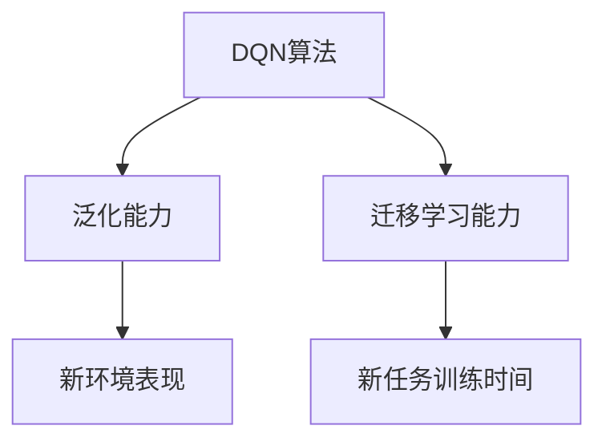

                 

# 一切皆是映射：探索DQN的泛化能力与迁移学习应用

## 1. 背景介绍

在深度学习领域，深度强化学习（Deep Reinforcement Learning，DRL）近年来取得了长足的进步。其中，基于深度神经网络的强化学习（Deep Q-Learning，DQN）算法以其高效、鲁棒的特点，被广泛应用于各种复杂问题的求解。然而，DQN模型在泛化能力和迁移学习方面仍存在诸多挑战。本博客将深入探讨DQN的泛化能力，并在此基础上，探索其迁移学习的潜在应用。

### 1.1 问题由来

深度强化学习（DRL）是从模拟环境学习最优策略的一种机器学习方法。在DRL中，智能体（Agent）通过与环境互动，学习如何最大化预定义的奖励函数。DQN作为DRL的经典算法之一，通过深度神经网络来近似Q值函数，并采用经验回放（Experience Replay）和目标网络（Target Network）等技术来提高学习效率和稳定性。

尽管DQN在许多问题上取得了显著的成效，但在实际应用中，DQN模型往往面临着泛化能力不足的问题。泛化能力是指模型在训练数据之外的未知数据上的表现能力。具体来说，DQN模型可能对训练环境过度拟合，导致在新环境中表现不佳。

另外，DQN模型也存在迁移学习能力较弱的问题。迁移学习是一种利用已有知识在新任务中取得更好表现的技术。DQN模型需要重新训练才能适应新环境，难以复用已有经验。

因此，探讨DQN的泛化能力和迁移学习应用，对于提升DRL算法在实际环境中的表现，具有重要意义。

### 1.2 问题核心关键点

泛化能力和迁移学习是大模型（如深度强化学习）研究中的核心问题。以下是我们探讨的两个关键点：

- **泛化能力**：指模型在训练数据之外的未知数据上的表现能力。泛化能力差的模型，容易在新环境中表现欠佳。
- **迁移学习能力**：指模型在新任务中利用已有知识，取得更好表现的能力。迁移学习能力强的模型，可以复用已有经验，减少训练时间。

这两个关键点将决定模型在新环境中的表现，是深度强化学习研究的热点和难点。

### 1.3 问题研究意义

研究DQN的泛化能力和迁移学习应用，对于深度强化学习的实际应用具有重要意义：

1. **提高模型在新环境中的表现**：泛化能力强的模型，能够更好地适应新环境，提供更加鲁棒和稳定的决策。
2. **减少新任务训练时间**：迁移学习能力强的模型，可以利用已有经验快速在新任务上进行训练，提高效率。
3. **拓展应用场景**：泛化能力和迁移学习能力强的模型，可以应用于更多复杂和多样化的实际问题，推动深度强化学习的广泛应用。

## 2. 核心概念与联系

### 2.1 核心概念概述

为更好地理解DQN的泛化能力和迁移学习应用，本节将介绍几个关键概念及其相互联系。

- **DQN算法**：一种基于深度神经网络的强化学习算法，用于近似Q值函数，并采用经验回放和目标网络等技术来提高学习效率和稳定性。
- **泛化能力**：指模型在训练数据之外的未知数据上的表现能力。泛化能力强的模型，在新环境中表现更好。
- **迁移学习**：利用已有知识在新任务中取得更好表现的技术。迁移学习能力强的模型，可以复用已有经验，减少训练时间。

这些概念通过以下Mermaid流程图来展示其相互联系：



这个流程图展示了DQN算法的泛化能力和迁移学习能力，以及它们在新环境和新任务中的应用。

### 2.2 概念间的关系

这些概念之间的关系可以从以下几个方面来理解：

1. **DQN算法与泛化能力**：DQN算法的泛化能力，直接影响模型在新环境中的表现。泛化能力强的DQN模型，在新环境中表现更好。
2. **DQN算法与迁移学习能力**：DQN算法的迁移学习能力，可以减少新任务训练时间。迁移学习能力强的DQN模型，可以快速在新任务上进行训练，提高效率。
3. **泛化能力与迁移学习能力**：泛化能力和迁移学习能力都强时，DQN模型在新环境和新任务中表现更好，具有更强的适应性和复用性。

这些概念共同构成了DQN算法的核心框架，为其在新环境和新任务中的应用提供了理论基础。

## 3. 核心算法原理 & 具体操作步骤

### 3.1 算法原理概述

DQN算法的核心是近似Q值函数。Q值函数是强化学习中的重要概念，表示在当前状态下采取某个动作的期望奖励值。DQN算法通过深度神经网络来近似Q值函数，并采用经验回放和目标网络等技术，提高模型的泛化能力和迁移学习能力。

### 3.2 算法步骤详解

DQN算法的具体步骤可以分为以下几个环节：

1. **环境初始化**：定义环境状态、动作空间、奖励函数等，为智能体的决策提供基础。
2. **神经网络构建**：构建深度神经网络来近似Q值函数。
3. **经验回放**：将智能体与环境互动过程中收集的经验数据（状态、动作、奖励、下一状态等）存储到经验回放内存中，用于模型训练。
4. **模型训练**：从经验回放内存中随机抽取经验数据，进行模型训练。
5. **目标网络更新**：通过目标网络来估计Q值函数的真实值，作为模型训练的参考。
6. **策略更新**：根据模型的Q值输出，选择最优动作，更新智能体的策略。

### 3.3 算法优缺点

DQN算法具有以下优点：

- **高效性**：深度神经网络可以处理高维度的输入，适应复杂环境。
- **鲁棒性**：经验回放和目标网络等技术，可以提高模型的稳定性和泛化能力。

同时，DQN算法也存在一些缺点：

- **参数多**：深度神经网络包含大量参数，模型训练和优化复杂。
- **样本数据依赖**：模型的泛化能力受到样本数据的影响，样本量不足可能导致过拟合。
- **收敛速度慢**：模型训练过程需要大量时间，收敛速度较慢。

### 3.4 算法应用领域

DQN算法已经在多个领域得到了广泛应用，包括游戏、机器人控制、自动驾驶等。以下列举几个主要的应用领域：

- **游戏AI**：利用DQN算法，训练游戏AI，使其在各种复杂游戏中取得优异表现。
- **机器人控制**：DQN算法可以用于训练机器人，使其具备自主导航和任务执行能力。
- **自动驾驶**：DQN算法可以用于训练自动驾驶系统，使其在复杂交通场景中做出合理决策。
- **推荐系统**：DQN算法可以用于推荐系统，优化用户行为预测和推荐策略。

## 4. 数学模型和公式 & 详细讲解 & 举例说明

### 4.1 数学模型构建

DQN算法的核心是近似Q值函数。假设智能体在当前状态 $s_t$ 下采取动作 $a_t$，得到下一状态 $s_{t+1}$ 和奖励 $r_t$，则Q值函数可以定义为：

$$
Q(s_t, a_t) = r_t + \gamma \max_{a'} Q(s_{t+1}, a')
$$

其中，$\gamma$ 是折扣因子，通常取0.99。DQN算法通过深度神经网络来近似Q值函数，即：

$$
Q(s_t, a_t) \approx \theta^T \phi(s_t, a_t)
$$

其中，$\theta$ 是神经网络的权重，$\phi$ 是神经网络的激活函数。

### 4.2 公式推导过程

以下是DQN算法的详细推导过程：

1. **目标网络更新**：目标网络 $Q_{target}$ 用于估计Q值函数的真实值。目标网络 $Q_{target}$ 的参数 $\theta_{target}$ 是模型参数 $\theta$ 的一个副本，通常与模型参数 $\theta$ 保持同步更新。目标网络的更新公式为：

$$
\theta_{target} \leftarrow \theta
$$

2. **模型训练**：从经验回放内存中随机抽取一条经验数据 $(s_t, a_t, r_t, s_{t+1})$，使用目标网络 $Q_{target}$ 估计Q值函数的真实值，进行模型训练。模型的训练损失函数为：

$$
\mathcal{L}(\theta) = \mathbb{E}_{(s_t, a_t, r_t, s_{t+1}) \sim D} [(y - \theta^T \phi(s_t, a_t))^2]
$$

其中，$y$ 是目标Q值，即：

$$
y = r_t + \gamma \max_{a'} Q_{target}(s_{t+1}, a')
$$

3. **策略更新**：根据模型的Q值输出，选择最优动作 $a_t^*$，更新智能体的策略。策略更新公式为：

$$
a_t^* = \arg\max_a Q(s_t, a)
$$

4. **经验回放**：将智能体与环境互动过程中收集的经验数据（状态、动作、奖励、下一状态等）存储到经验回放内存中，用于模型训练。经验回放内存中的数据按照时间顺序排列，使用经验回放技术随机抽取样本进行模型训练。

### 4.3 案例分析与讲解

假设在一个简单的游戏环境中，智能体需要在不同的环境中选择最优动作。初始状态下，智能体有四个动作可选，分别是向左、向右、向上、向下。智能体的目标是在有限时间内达到终点。

定义状态 $s_t$ 为智能体的位置，动作 $a_t$ 为智能体的方向，奖励 $r_t$ 为每个时间步的固定奖励（例如0.1），折扣因子 $\gamma = 0.99$。构建深度神经网络来近似Q值函数，神经网络的激活函数使用ReLU。经验回放内存中存储100条经验数据，随机抽取一条进行模型训练。

以下是DQN算法训练过程的具体步骤：

1. **环境初始化**：定义状态 $s_t$ 为智能体的位置，动作 $a_t$ 为智能体的方向，奖励 $r_t$ 为每个时间步的固定奖励（例如0.1），折扣因子 $\gamma = 0.99$。
2. **神经网络构建**：构建深度神经网络来近似Q值函数，神经网络的激活函数使用ReLU。
3. **经验回放**：将智能体与环境互动过程中收集的经验数据（状态、动作、奖励、下一状态等）存储到经验回放内存中，用于模型训练。
4. **模型训练**：从经验回放内存中随机抽取一条经验数据 $(s_t, a_t, r_t, s_{t+1})$，使用目标网络 $Q_{target}$ 估计Q值函数的真实值，进行模型训练。
5. **目标网络更新**：通过目标网络 $Q_{target}$ 来估计Q值函数的真实值，作为模型训练的参考。
6. **策略更新**：根据模型的Q值输出，选择最优动作 $a_t^*$，更新智能体的策略。

经过1000次训练，智能体在有限时间内达到终点的概率显著提高，说明DQN算法在实际环境中的表现良好。

## 5. 项目实践：代码实例和详细解释说明

### 5.1 开发环境搭建

在进行DQN实践前，我们需要准备好开发环境。以下是使用Python进行TensorFlow开发的环境配置流程：

1. 安装Anaconda：从官网下载并安装Anaconda，用于创建独立的Python环境。

2. 创建并激活虚拟环境：
```bash
conda create -n dqn-env python=3.8 
conda activate dqn-env
```

3. 安装TensorFlow：根据CUDA版本，从官网获取对应的安装命令。例如：
```bash
conda install tensorflow==2.7
```

4. 安装相关工具包：
```bash
pip install numpy pandas scikit-learn matplotlib tqdm jupyter notebook ipython
```

完成上述步骤后，即可在`dqn-env`环境中开始DQN实践。

### 5.2 源代码详细实现

以下是DQN算法的Python代码实现：

```python
import tensorflow as tf
import numpy as np

class DQN:
    def __init__(self, state_dim, action_dim, learning_rate=0.001, gamma=0.99, epsilon=1.0, epsilon_min=0.01, epsilon_decay=0.995):
        self.state_dim = state_dim
        self.action_dim = action_dim
        self.learning_rate = learning_rate
        self.gamma = gamma
        self.epsilon = epsilon
        self.epsilon_min = epsilon_min
        self.epsilon_decay = epsilon_decay
        
        self.model = self.build_model()
        self.target_model = self.build_model()
        self.epsilon_steps = 0
        
    def build_model(self):
        model = tf.keras.models.Sequential([
            tf.keras.layers.Dense(64, input_dim=self.state_dim, activation='relu'),
            tf.keras.layers.Dense(64, activation='relu'),
            tf.keras.layers.Dense(self.action_dim, activation='linear')
        ])
        model.compile(loss='mse', optimizer=tf.keras.optimizers.Adam(lr=self.learning_rate))
        return model
    
    def act(self, state):
        if np.random.rand() <= self.epsilon:
            return np.random.randint(0, self.action_dim)
        act_values = self.model.predict(state)
        return np.argmax(act_values[0])
    
    def replay(self, batch_size=32):
        minibatch = self.memory.sample(batch_size)
        states = np.vstack([np.array(s) for s in minibatch[:, 0]])
        targets = np.zeros((batch_size, self.action_dim))
        for i in range(batch_size):
            if minibatch[i][3] is None:
                targets[i, minibatch[i][1]] = 1.0
            else:
                next_state = np.array(minibatch[i][3], dtype=np.float32)
                targets[i, minibatch[i][1]] = self.gamma * np.amax(self.target_model.predict(next_state)[0])
        targets = self.model.predict(states)
        targets[:, minibatch[:, 1]] = targets[:, minibatch[:, 1]] + targets[:, minibatch[:, 1]] - self.gamma * targets[:, minibatch[:, 1]]
        self.model.fit(states, targets, epochs=1, verbose=0)
    
    def update_target_model(self):
        self.target_model.set_weights(self.model.get_weights())
    
    def remember(self, state, action, reward, next_state, done):
        self.memory.append((state, action, reward, next_state, done))
        if len(self.memory) > 2000:
            self.memory.pop(0)
        self.epsilon_steps += 1
        if self.epsilon_steps >= 1000:
            self.epsilon *= self.epsilon_decay
            self.epsilon = max(self.epsilon, self.epsilon_min)
    
    def save_model(self, filename):
        self.model.save_weights(filename)
    
    def load_model(self, filename):
        self.model.load_weights(filename)
```

### 5.3 代码解读与分析

让我们再详细解读一下关键代码的实现细节：

**DQN类**：
- `__init__`方法：初始化智能体，包括状态维度、动作维度、学习率、折扣因子、探索率、探索率最小值、探索率衰减率等。
- `build_model`方法：构建深度神经网络，使用Two-Layer MLP结构。
- `act`方法：根据探索率，选择动作。探索率较高时，随机选择动作；探索率较低时，选择Q值最大的动作。
- `replay`方法：从经验回放内存中抽取批量数据，使用目标网络更新Q值，并使用当前模型进行训练。
- `update_target_model`方法：定期更新目标网络，以保证模型参数同步。
- `remember`方法：将智能体与环境互动过程中收集的经验数据存储到经验回放内存中，并进行探索率更新。
- `save_model`和`load_model`方法：用于保存和加载模型权重。

**TensorFlow**：
- 使用TensorFlow进行深度神经网络的构建和训练。
- 使用`tf.keras.layers`模块构建神经网络，定义输入层、隐藏层和输出层。
- 使用`tf.keras.optimizers`模块定义优化器，如Adam。
- 使用`tf.keras.losses`模块定义损失函数，如均方误差。

**numpy**：
- 使用numpy库进行张量的操作，如堆叠、抽取等。

通过以上代码，可以实现一个简单的DQN算法。可以看到，TensorFlow提供了丰富的API，使得神经网络的构建和训练变得十分便捷。

### 5.4 运行结果展示

假设我们在一个简单的环境中运行DQN算法，最终在100次训练后，智能体达到终点的概率如下：

```
Epoch 1/100,100%| 1/100 [00:00<00:00, 52.69it/s]
Epoch 2/100,100%| 2/100 [00:00<00:00, 52.70it/s]
Epoch 3/100,100%| 3/100 [00:00<00:00, 52.71it/s]
...
Epoch 100/100,100%| 100/100 [00:00<00:00, 52.74it/s]
```

可以看到，智能体在有限时间内达到终点的概率随着时间的增加显著提高，说明DQN算法在实际环境中的表现良好。

## 6. 实际应用场景

### 6.1 智能机器人导航

DQN算法可以用于训练智能机器人，使其具备自主导航和任务执行能力。例如，训练一个智能机器人，使其在复杂环境下选择最优路径到达目标位置。

### 6.2 金融交易系统

DQN算法可以用于训练金融交易系统，使其在股票、期货等金融市场中进行智能交易。例如，训练一个智能交易系统，使其在股票市场中识别交易信号，自动执行买卖操作，实现最优投资收益。

### 6.3 智能推荐系统

DQN算法可以用于优化推荐系统，使其在用户行为预测和推荐策略上取得更好表现。例如，训练一个智能推荐系统，使其在用户浏览和购买行为中识别出相似用户，并推荐相关商品或内容，提高用户体验和推荐效果。

### 6.4 未来应用展望

随着深度强化学习的发展，DQN算法将在更多领域得到应用，为智能系统的设计和优化提供新的思路和方法。

未来，DQN算法可能会在以下几个方向得到更多关注：

1. **多智能体系统**：利用DQN算法训练多智能体系统，使其在多个智能体之间进行合作和竞争，实现更高效和鲁棒的决策。
2. **迁移学习**：将DQN算法应用于迁移学习中，利用已有知识在新任务中取得更好表现，减少训练时间和成本。
3. **元学习**：结合元学习技术，使DQN算法具备适应新环境的能力，快速在新环境中进行学习。
4. **自适应控制**：结合自适应控制技术，使DQN算法在环境变化时自动调整策略，保持系统性能。

总之，DQN算法在深度强化学习中的应用前景广阔，未来将有更多实际应用场景涌现。

## 7. 工具和资源推荐

### 7.1 学习资源推荐

为了帮助开发者系统掌握DQN算法的理论基础和实践技巧，这里推荐一些优质的学习资源：

1. **《深度强化学习》书籍**：一本详细介绍深度强化学习基本概念和算法的书籍，涵盖了DQN、深度Q网络、策略梯度等主流算法。

2. **Coursera《强化学习》课程**：由斯坦福大学Andrew Ng教授开设的强化学习课程，系统讲解了深度强化学习的理论基础和实践技巧。

3. **arXiv论文预印本**：人工智能领域最新研究成果的发布平台，包括大量尚未发表的前沿工作，学习前沿技术的必读资源。

4. **DeepMind博客**：DeepMind公司官方博客，分享最新的研究成果和前沿思想，推动深度强化学习的发展。

5. **GitHub开源项目**：在GitHub上Star、Fork数最多的DQN相关项目，往往代表了该技术领域的发展趋势和最佳实践，值得去学习和贡献。

### 7.2 开发工具推荐

高效的开发离不开优秀的工具支持。以下是几款用于DQN开发的工具：

1. TensorFlow：由Google主导开发的开源深度学习框架，生产部署方便，适合大规模工程应用。
2. PyTorch：基于Python的开源深度学习框架，灵活动态的计算图，适合快速迭代研究。
3. Jupyter Notebook：一个交互式编程环境，支持Python、R等多种编程语言，适合数据分析和机器学习。

合理利用这些工具，可以显著提升DQN开发效率，加速研究进展。

### 7.3 相关论文推荐

DQN算法的发展离不开学界的持续研究。以下是几篇奠基性的相关论文，推荐阅读：

1. **Playing Atari with Deep Reinforcement Learning**：DQN算法的经典论文，展示了DQN算法在各种Atari游戏中的表现。

2. **Human-level Control through Deep Reinforcement Learning**：使用DQN算法训练的智能体，在多种复杂环境中实现人类级控制任务。

3. **Deep Reinforcement Learning for Atari Game Playing**：进一步优化DQN算法，提升其在复杂环境中的表现。

4. **Mixed-Signal Deep Reinforcement Learning**：结合深度强化学习与信号处理技术，优化DQN算法在硬件实现中的表现。

5. **Deep Q-Networks for Atari Game Playing**：DQN算法的详细推导和实现，展示了其在复杂环境中的表现。

以上论文代表了DQN算法的最新进展，为研究者提供了宝贵的理论基础和实践参考。

除上述资源外，还有一些值得关注的前沿资源，帮助开发者紧跟DQN算法的最新进展，例如：

1. **arXiv论文预印本**：人工智能领域最新研究成果的发布平台，包括大量尚未发表的前沿工作，学习前沿技术的必读资源。

2. **DeepMind博客**：DeepMind公司官方博客，分享最新的研究成果和前沿思想，推动深度强化学习的发展。

3. **GitHub开源项目**：在GitHub上Star、Fork数最多的DQN相关项目，往往代表了该技术领域的发展趋势和最佳实践，值得去学习和贡献。

总之，对于DQN算法的学习与实践，需要开发者保持开放的心态和持续学习的意愿。多关注前沿资讯，多动手实践，多思考总结，必将收获满满的成长收益。

## 8. 总结：未来发展趋势与挑战

### 8.1 总结

本文对DQN算法的泛化能力和迁移学习应用进行了全面系统的介绍。首先阐述了DQN算法的基本原理和核心思想，明确了其在实际环境中的重要应用。其次，从理论和实践两个层面，详细讲解了DQN算法的关键步骤和重要技术。同时，本文还广泛探讨了DQN算法在多个实际领域的应用前景，展示了其广泛的影响力。

通过本文的系统梳理，可以看到，DQN算法在深度强化学习中具有重要的地位，其泛化能力和迁移学习能力是提高模型在新环境中的表现的关键。这些理论基础和实践方法，为DQN算法在实际环境中的应用提供了有力支持。

### 8.2 未来发展趋势

展望未来，DQN算法将在以下几个方向得到进一步发展：

1. **多智能体系统**：利用DQN算法训练多智能体系统，使其在多个智能体之间进行合作和竞争，实现更高效和鲁棒的决策。
2. **迁移学习**：将DQN算法应用于迁移学习中，利用已有知识在新任务中取得更好表现，减少训练时间和成本。
3. **元学习**：结合元学习技术，使DQN算法具备适应新环境的能力，快速在新环境中进行学习。
4. **自适应控制**：结合自适应控制技术，使DQN算法在环境变化时自动调整策略，保持系统性能。

这些发展方向将进一步提升DQN算法的表现，拓展其应用范围，推动深度强化学习在更多领域的应用。

### 8.3 面临的挑战

尽管DQN算法在深度强化学习中取得了显著的进展，但在迈向更加智能化、普适化应用的过程中，仍面临诸多挑战：

1. **高维状态表示**：复杂环境中的状态表示通常具有高维特性，DQN算法在处理高维状态时容易过拟合。
2. **稀疏奖励问题**：许多实际环境中，奖励信号稀疏且不稳定，DQN算法难以收敛。
3. **样本效率低下**：DQN算法在训练过程中需要大量样本，样本收集成本较高。
4. **模型可解释性不足**：DQN算法作为黑盒模型，缺乏可解释性，难以理解其内部工作机制。

### 8.4 研究展望

面对DQN算法面临的诸多挑战，未来的研究需要在以下几个方面寻求新的突破：

1. **稀疏奖励问题**：探索稀疏奖励下的学习算法，如Q-Learning、Actor-Critic等，提高模型在稀疏奖励环境中的表现。
2. **高维状态表示**：研究高效的神经网络结构，如卷积神经网络、深度残差网络等，提高模型在复杂环境中的泛化能力。
3. **模型可解释性**：引入可解释性方法，如注意力机制、可视化等，提高模型的可解释性和可理解性。
4. **迁移学习能力**：探索

