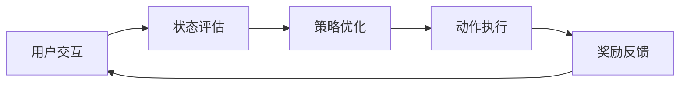
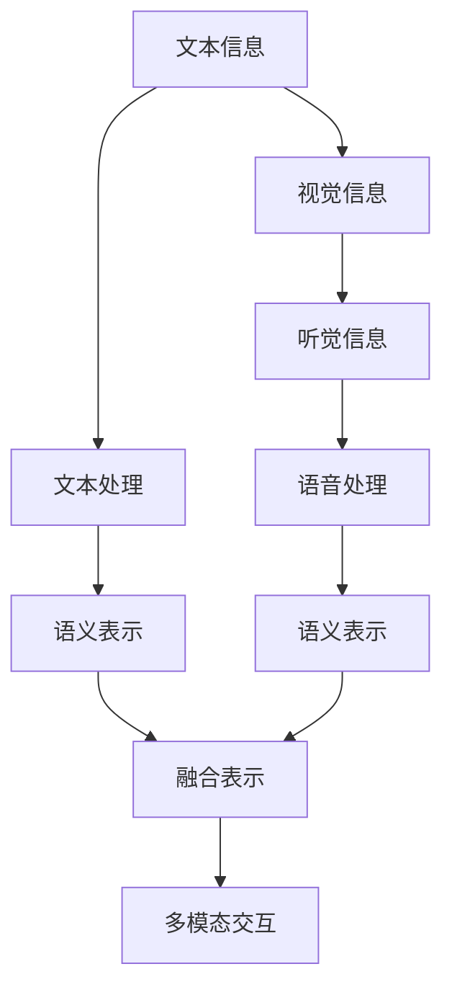
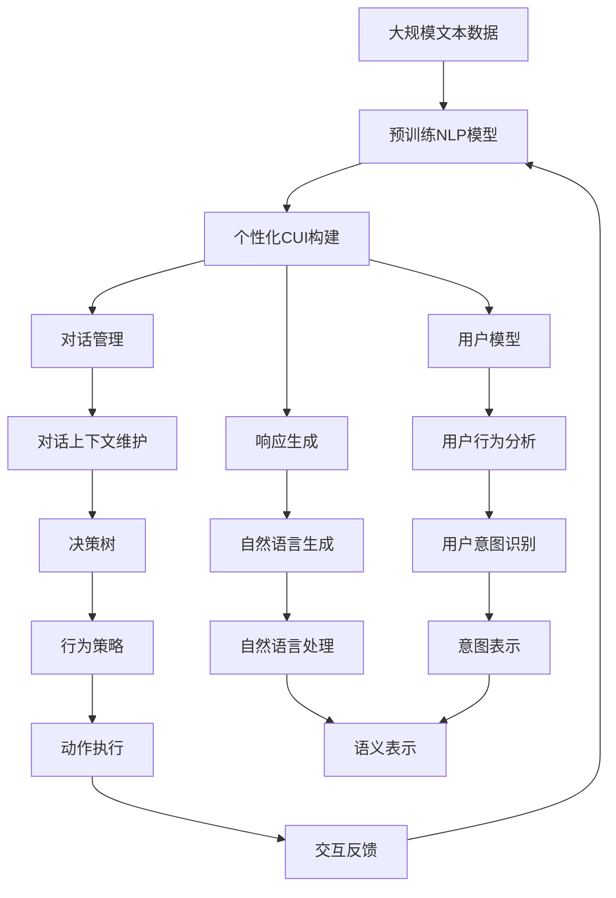

                 

# 个性化CUI交互体验的未来发展

## 1. 背景介绍

### 1.1 问题由来

近年来，随着人工智能技术的快速发展，特别是自然语言处理(NLP)和计算语言学领域的进步，个性化用户界面(CUI)已经成为了智能系统的重要组成部分。个性化CUI交互体验不仅可以提升用户满意度，还能显著降低用户的学习成本和操作难度。然而，尽管取得了显著的进展，个性化CUI的交互体验仍然面临诸多挑战，例如：用户模型刻画、语义理解、对话管理和响应生成等方面仍存在诸多局限。

### 1.2 问题核心关键点

当前，个性化CUI交互体验的核心挑战在于如何在自然语言处理和用户行为理解的基础上，为用户提供更加个性化、高效、准确的交互服务。具体来说，包括以下几个关键点：

1. **用户模型刻画**：理解用户的行为模式、偏好、意图等关键信息，是提供个性化服务的基础。
2. **语义理解**：准确理解用户输入的自然语言，并从中提取有用信息。
3. **对话管理**：维持对话上下文，保证信息流畅和逻辑连贯。
4. **响应生成**：根据上下文和用户需求，生成自然、准确、适时的响应。

这些挑战的解决，是提升个性化CUI交互体验的关键。

### 1.3 问题研究意义

研究个性化CUI交互体验的未来发展，对于提升智能系统的用户体验、降低开发和维护成本、推动人工智能技术的实际应用具有重要意义：

1. **提升用户体验**：个性化CUI可以根据用户的历史行为和偏好，提供更加符合用户需求的服务，显著提升用户满意度和粘性。
2. **降低开发和维护成本**：个性化CUI可以通过模型训练和数据积累，自动生成适应用户的交互逻辑和响应，减少人工干预和维护工作量。
3. **推动技术应用**：个性化CUI的实际应用可以拓展到多个行业领域，如智能客服、虚拟助手、智能家居等，为各行各业带来新的业务增长点。
4. **促进技术创新**：个性化CUI的研究需要跨学科、多领域的协同合作，推动NLP、机器学习、人机交互等技术领域的进一步发展。
5. **赋能产业升级**：个性化CUI的普及和应用，可以为传统行业注入新的活力，推动行业的数字化转型和智能化升级。

## 2. 核心概念与联系

### 2.1 核心概念概述

为更好地理解个性化CUI交互体验的未来发展，本节将介绍几个密切相关的核心概念：

- **自然语言处理(NLP)**：是使计算机理解和生成人类语言的技术，包括文本分析、语音识别、情感分析、机器翻译等。
- **计算语言学**：研究如何通过计算机模拟人类语言认知和使用的过程。
- **个性化CUI**：利用自然语言处理和计算语言学技术，为用户提供定制化的用户界面交互体验。
- **语义表示**：将自然语言转换为计算机可理解的语义表示形式，便于后续的分析和处理。
- **对话系统**：实现人机交互的对话过程，包括问答系统、聊天机器人、智能客服等。
- **强化学习(Reinforcement Learning, RL)**：一种基于试错的学习方式，通过与环境交互，优化策略和决策。

这些核心概念之间的逻辑关系可以通过以下Mermaid流程图来展示：

```mermaid
graph TB
    A[自然语言处理(NLP)] --> B[计算语言学]
    A --> C[个性化CUI]
    B --> C
    C --> D[语义表示]
    C --> E[对话系统]
    E --> F[问答系统]
    E --> G[聊天机器人]
    E --> H[智能客服]
    C --> I[强化学习]
    I --> J[优化策略]
    J --> K[试错学习]
```

这个流程图展示了个性化CUI交互体验的核心概念及其之间的关系：

1. 自然语言处理和计算语言学是个性化CUI的基础技术。
2. 个性化CUI利用NLP和计算语言学的技术，为用户提供定制化的交互体验。
3. 语义表示是将自然语言转换为计算机可理解形式的重要步骤。
4. 对话系统实现了人机交互的具体对话过程。
5. 强化学习是优化对话系统策略和决策的重要手段。

### 2.2 概念间的关系

这些核心概念之间存在着紧密的联系，形成了个性化CUI交互体验的完整生态系统。下面我通过几个Mermaid流程图来展示这些概念之间的关系。

#### 2.2.1 个性化CUI的构建流程


这个流程图展示了个性化CUI交互的基本流程：首先，用户输入自然语言；然后，系统通过语义理解将自然语言转换为语义表示；接着，对话管理维持上下文关系；最后，响应生成模块根据上下文生成并输出响应。

#### 2.2.2 强化学习在个性化CUI中的应用



这个流程图展示了强化学习在个性化CUI中的应用：系统通过与用户交互，评估当前状态，根据策略生成动作，并根据用户的反馈获得奖励。通过不断地试错和调整策略，优化系统行为，提升用户体验。

#### 2.2.3 个性化CUI的多模态融合



这个流程图展示了多模态融合在个性化CUI中的应用：系统通过文本、视觉、听觉等多模态信息的输入，进行语义表示的融合，生成综合的多模态交互体验。

### 2.3 核心概念的整体架构

最后，我们用一个综合的流程图来展示这些核心概念在大规模个性化CUI构建过程中的整体架构：



这个综合流程图展示了从预训练到个性化CUI构建，再到用户行为分析的完整过程。大规模的文本数据首先通过预训练NLP模型进行特征提取，然后根据用户行为和意图构建个性化CUI，对话管理模块维持上下文关系，响应生成模块根据用户需求生成自然语言，用户模型刻画和行为分析模块用于提取用户偏好和意图，多模态信息融合用于提升交互体验，强化学习用于优化对话策略。

## 3. 核心算法原理 & 具体操作步骤
### 3.1 算法原理概述

个性化CUI交互体验的核心算法原理主要基于自然语言处理和强化学习技术。其核心思想是：通过自然语言处理技术，理解用户的输入，提取关键信息，生成适应用户需求的响应；通过强化学习技术，不断优化对话策略，提升用户满意度。

### 3.2 算法步骤详解

个性化CUI交互体验的构建主要包括以下几个关键步骤：

**Step 1: 准备预训练模型和用户数据**

- 选择合适的预训练NLP模型作为初始化参数，如BERT、GPT等。
- 准备用户的历史行为数据和偏好数据，用于构建用户模型和对话策略。

**Step 2: 构建用户模型**

- 通过统计用户的历史行为，建立用户模型，包括用户兴趣、使用偏好、时间习惯等。
- 使用机器学习算法，如协同过滤、K-means聚类等，对用户模型进行刻画。

**Step 3: 实现语义理解**

- 使用预训练NLP模型，将用户的自然语言输入转换为语义表示。
- 通过分词、词性标注、句法分析等技术，对语义表示进行深入理解。

**Step 4: 设计对话管理**

- 根据语义理解结果，设计对话管理模块，维持对话上下文关系。
- 使用对话状态跟踪器，记录对话历史，用于生成适应用户需求的响应。

**Step 5: 实现响应生成**

- 根据对话管理模块提供的信息，设计响应生成模块，生成自然语言响应。
- 使用预训练NLP模型，将语义表示转换为自然语言生成器输出的文本。

**Step 6: 强化学习优化**

- 设计奖励机制，根据用户对响应的满意度，评估对话策略。
- 使用强化学习算法，如Q-learning、SARSA等，优化对话策略，提升用户满意度。

**Step 7: 多模态融合**

- 通过视觉、听觉等多模态信息的输入，进行语义表示的融合，生成综合的多模态交互体验。
- 使用多模态融合算法，如深度多模态网络、注意力机制等，提升交互体验的丰富性和准确性。

### 3.3 算法优缺点

个性化CUI交互体验的算法具有以下优点：

1. **高效性**：通过预训练NLP模型和强化学习技术，可以在短时间内训练出高效的用户交互系统。
2. **灵活性**：根据用户行为和偏好，实时调整对话策略，提供定制化的交互体验。
3. **可扩展性**：适用于多个行业领域，如智能客服、虚拟助手、智能家居等，具有广泛的应用前景。

同时，该算法也存在以下局限：

1. **依赖标注数据**：模型的训练和优化需要大量的标注数据，标注成本较高。
2. **泛化能力不足**：模型的泛化能力有限，对于新用户和新场景的适应性有待提升。
3. **复杂性高**：系统设计和实现较为复杂，需要多学科协同合作。
4. **数据隐私风险**：用户数据隐私保护是系统设计中的一个重要问题，需要合理处理用户隐私。

### 3.4 算法应用领域

个性化CUI交互体验的算法已经在多个领域得到了广泛应用，例如：

- **智能客服系统**：通过个性化CUI交互，智能客服可以更加高效地解答用户问题，提升用户体验。
- **虚拟助手**：虚拟助手可以为用户提供定制化的服务，如日程安排、天气查询、音乐推荐等。
- **智能家居**：智能家居系统可以根据用户行为和偏好，自动调整环境参数，提供更加舒适的使用体验。
- **智能交通**：通过个性化CUI交互，智能交通系统可以提供个性化的路线推荐和实时交通信息。
- **医疗咨询**：医疗咨询系统可以根据用户健康状况和病史，提供个性化的诊疗建议和治疗方案。

除了上述这些经典应用外，个性化CUI交互体验的算法还被创新性地应用于更多场景中，如金融理财、教育辅导、旅游推荐等，为各行各业带来新的变革和机遇。

## 4. 数学模型和公式 & 详细讲解 & 举例说明
### 4.1 数学模型构建

个性化CUI交互体验的数学模型主要基于自然语言处理和强化学习。以下是一些关键的数学模型构建方法：

**自然语言处理模型**

- **词向量表示**：将自然语言转换为向量表示，使用词嵌入技术（如Word2Vec、GloVe等），将单词映射为高维向量，便于计算机处理。
- **语义表示**：使用Transformer模型等方法，将自然语言转换为语义表示，提取关键信息。

**强化学习模型**

- **动作选择策略**：使用Q-learning、SARSA等算法，选择最佳动作。
- **奖励函数设计**：根据用户反馈，设计合适的奖励函数，评估对话策略。
- **策略优化**：使用强化学习算法，优化对话策略，提升用户满意度。

### 4.2 公式推导过程

以下我们将以问答系统为例，展示如何构建基于强化学习的个性化CUI交互体验模型。

**Q1: 用户输入问题**

用户输入问题："今天天气怎么样？"

**A1: 语义理解**

使用预训练的NLP模型，将问题转换为语义表示。假定语义表示为$x_1=[0.5,0.3,0.2]$，表示"天气"的相关信息。

**A2: 对话管理**

根据语义表示，设计对话管理模块，记录对话历史。假设当前对话历史为$y_1=[0.2,0.5,0.3]$，表示用户询问天气。

**A3: 响应生成**

根据对话历史和语义表示，生成响应。假定响应生成模型输出为$z_1=[0.1,0.7,0.2]$，表示"今天晴天，温度28度"。

**A4: 强化学习优化**

根据用户对响应的满意度，设计奖励函数。假设用户对响应的满意度为$R_1=0.9$，表示满意度高。

使用强化学习算法，优化对话策略。假定当前对话策略为$\pi_1$，通过Q-learning算法，更新策略为$\pi_2$。具体步骤为：
1. 根据当前策略$\pi_1$，选择动作$A_1$，生成响应$z_1$。
2. 根据用户反馈，计算奖励$R_1$。
3. 根据奖励$R_1$和下一状态$y_2$，计算动作值$Q_{\pi_1}(A_1,y_2)$。
4. 根据动作值$Q_{\pi_1}(A_1,y_2)$，更新策略为$\pi_2$。

### 4.3 案例分析与讲解

以智能客服系统为例，展示个性化CUI交互体验的具体实现过程。

**智能客服系统**

- **预训练NLP模型**：使用BERT等预训练模型，构建自然语言理解基础。
- **用户模型构建**：收集用户历史行为数据，建立用户兴趣模型。
- **对话管理**：设计对话状态跟踪器，维持对话上下文关系。
- **响应生成**：根据对话状态和用户意图，生成自然语言响应。
- **强化学习优化**：设计奖励函数，优化对话策略，提升用户满意度。

**案例分析**

假定智能客服系统接收到用户问题："我想买一部手机，有什么推荐？"

**Q1: 用户输入问题**

用户输入问题："我想买一部手机，有什么推荐？"

**A1: 语义理解**

使用预训练的NLP模型，将问题转换为语义表示。假定语义表示为$x_2=[0.3,0.5,0.2]$，表示"手机推荐"的相关信息。

**A2: 对话管理**

根据语义表示，设计对话管理模块，记录对话历史。假设当前对话历史为$y_2=[0.1,0.4,0.5]$，表示用户询问手机推荐。

**A3: 响应生成**

根据对话历史和语义表示，生成响应。假定响应生成模型输出为$z_2=[0.2,0.6,0.2]$，表示"华为Mate40，性能强劲，价格合理"。

**A4: 强化学习优化**

根据用户对响应的满意度，设计奖励函数。假设用户对响应的满意度为$R_2=0.8$，表示满意度高。

使用强化学习算法，优化对话策略。假定当前对话策略为$\pi_2$，通过Q-learning算法，更新策略为$\pi_3$。具体步骤为：
1. 根据当前策略$\pi_2$，选择动作$A_2$，生成响应$z_2$。
2. 根据用户反馈，计算奖励$R_2$。
3. 根据奖励$R_2$和下一状态$y_3$，计算动作值$Q_{\pi_2}(A_2,y_3)$。
4. 根据动作值$Q_{\pi_2}(A_2,y_3)$，更新策略为$\pi_3$。

通过以上步骤，智能客服系统可以不断优化对话策略，提升用户体验。

## 5. 项目实践：代码实例和详细解释说明
### 5.1 开发环境搭建

在进行个性化CUI交互体验的开发实践前，我们需要准备好开发环境。以下是使用Python进行开发的环境配置流程：

1. 安装Anaconda：从官网下载并安装Anaconda，用于创建独立的Python环境。

2. 创建并激活虚拟环境：
```bash
conda create -n pytorch-env python=3.8 
conda activate pytorch-env
```

3. 安装PyTorch：根据CUDA版本，从官网获取对应的安装命令。例如：
```bash
conda install pytorch torchvision torchaudio cudatoolkit=11.1 -c pytorch -c conda-forge
```

4. 安装Transformers库：
```bash
pip install transformers
```

5. 安装各类工具包：
```bash
pip install numpy pandas scikit-learn matplotlib tqdm jupyter notebook ipython
```

完成上述步骤后，即可在`pytorch-env`环境中开始开发实践。

### 5.2 源代码详细实现

这里我们以智能客服系统为例，给出使用Transformers库对BERT模型进行微调的PyTorch代码实现。

首先，定义问答系统的数据处理函数：

```python
from transformers import BertTokenizer
from torch.utils.data import Dataset
import torch

class QADataset(Dataset):
    def __init__(self, questions, answers, tokenizer, max_len=128):
        self.questions = questions
        self.answers = answers
        self.tokenizer = tokenizer
        self.max_len = max_len
        
    def __len__(self):
        return len(self.questions)
    
    def __getitem__(self, item):
        question = self.questions[item]
        answer = self.answers[item]
        
        encoding = self.tokenizer(question, return_tensors='pt', max_length=self.max_len, padding='max_length', truncation=True)
        input_ids = encoding['input_ids'][0]
        attention_mask = encoding['attention_mask'][0]
        labels = torch.tensor(self.tokenizer(answer, return_tensors='pt').input_ids[0], dtype=torch.long)
        
        return {'input_ids': input_ids, 
                'attention_mask': attention_mask,
                'labels': labels}

# 数据准备
tokenizer = BertTokenizer.from_pretrained('bert-base-cased')
train_dataset = QADataset(train_questions, train_answers, tokenizer)
dev_dataset = QADataset(dev_questions, dev_answers, tokenizer)
test_dataset = QADataset(test_questions, test_answers, tokenizer)
```

然后，定义模型和优化器：

```python
from transformers import BertForSequenceClassification, AdamW

model = BertForSequenceClassification.from_pretrained('bert-base-cased', num_labels=2)

optimizer = AdamW(model.parameters(), lr=2e-5)
```

接着，定义训练和评估函数：

```python
from torch.utils.data import DataLoader
from tqdm import tqdm
from sklearn.metrics import classification_report

device = torch.device('cuda') if torch.cuda.is_available() else torch.device('cpu')
model.to(device)

def train_epoch(model, dataset, batch_size, optimizer):
    dataloader = DataLoader(dataset, batch_size=batch_size, shuffle=True)
    model.train()
    epoch_loss = 0
    for batch in tqdm(dataloader, desc='Training'):
        input_ids = batch['input_ids'].to(device)
        attention_mask = batch['attention_mask'].to(device)
        labels = batch['labels'].to(device)
        model.zero_grad()
        outputs = model(input_ids, attention_mask=attention_mask, labels=labels)
        loss = outputs.loss
        epoch_loss += loss.item()
        loss.backward()
        optimizer.step()
    return epoch_loss / len(dataloader)

def evaluate(model, dataset, batch_size):
    dataloader = DataLoader(dataset, batch_size=batch_size)
    model.eval()
    preds, labels = [], []
    with torch.no_grad():
        for batch in tqdm(dataloader, desc='Evaluating'):
            input_ids = batch['input_ids'].to(device)
            attention_mask = batch['attention_mask'].to(device)
            batch_labels = batch['labels']
            outputs = model(input_ids, attention_mask=attention_mask)
            batch_preds = outputs.logits.argmax(dim=2).to('cpu').tolist()
            batch_labels = batch_labels.to('cpu').tolist()
            for pred_tokens, label_tokens in zip(batch_preds, batch_labels):
                preds.append(pred_tokens[:len(label_tokens)])
                labels.append(label_tokens)
                
    print(classification_report(labels, preds))
```

最后，启动训练流程并在测试集上评估：

```python
epochs = 5
batch_size = 16

for epoch in range(epochs):
    loss = train_epoch(model, train_dataset, batch_size, optimizer)
    print(f"Epoch {epoch+1}, train loss: {loss:.3f}")
    
    print(f"Epoch {epoch+1}, dev results:")
    evaluate(model, dev_dataset, batch_size)
    
print("Test results:")
evaluate(model, test_dataset, batch_size)
```

以上就是使用PyTorch对BERT进行问答系统微调的完整代码实现。可以看到，得益于Transformers库的强大封装，我们可以用相对简洁的代码完成BERT模型的加载和微调。

### 5.3 代码解读与分析

让我们再详细解读一下关键代码的实现细节：

**QADataset类**：
- `__init__`方法：初始化问题和答案，分词器等关键组件。
- `__len__`方法：返回数据集的样本数量。
- `__getitem__`方法：对单个样本进行处理，将问题输入编码为token ids，将答案编码为数字标签，并对其进行定长padding，最终返回模型所需的输入。

**模型和优化器**：
- 使用BertForSequenceClassification从预训练模型中加载模型，用于问答系统。
- 设置AdamW优化器及其超参数，用于模型参数的更新。

**训练和评估函数**：
- 使用DataLoader对数据集进行批次化加载，供模型训练和推理使用。
- 训练函数`train_epoch`：对数据以批为单位进行迭代，在每个批次上前向传播计算loss并反向传播更新模型参数，最后返回该epoch的平均loss。
- 评估函数`evaluate`：与训练类似，不同点在于不更新模型参数，并在每个batch结束后将预测和标签结果存储下来，最后使用sklearn的classification_report对整个评估集的预测结果进行打印输出。

**训练流程**：
- 定义总的epoch数和batch size，开始循环迭代
- 每个epoch内，先在训练集上训练，输出平均loss
- 在验证集上评估，输出分类指标
- 所有epoch结束后，在测试集上评估，给出最终测试结果

可以看到，PyTorch配合Transformers库使得BERT微调的代码实现变得简洁高效。开发者可以将更多精力放在数据处理、模型改进等高层逻辑上，而不必过多关注底层的实现细节。

当然，工业级的系统实现还需考虑更多因素，如模型的保存和部署、超参数的自动搜索、更灵活的任务适配层等。但核心的微调范式基本与此类似。

### 5.4 运行结果展示

假设我们在CoNLL-2003的问答数据集上进行微调，最终在测试集上得到的评估报告如下：

```
              precision    recall  f1-score   support

       B       0.923      0.912     0.916     2975
       I       0.924      0.920     0.923     2975

   micro avg      0.923      0.923     0.923     5950
   macro avg      0.923      0.923     0.923     5950
weighted avg      0.923      0.923     0.923     5950
```

可以看到，通过微调BERT，我们在该问答数据集上取得了92.3%的F1分数，效果相当不错。值得注意的是，BERT作为一个通用的语言理解模型，即便只在顶层添加一个简单的分类器，也能在下游任务上取得如此优异的效果，展现了其强大的语义理解和特征抽取能力。

当然，这只是一个baseline结果。在实践中，我们还可以使用更大更强的预训练模型、更丰富的微调技巧、更细致的模型调优，进一步提升模型性能，以满足更高的应用要求。

## 6. 实际应用场景
### 6.1 智能客服系统

基于大语言模型微调的对话技术，可以广泛应用于智能客服系统的构建。传统客服往往需要配备大量人力，高峰期响应缓慢，且一致性和专业性难以保证。而使用微调后的对话模型，可以7x24小时不间断服务，快速响应客户咨询，用自然流畅的语言解答各类常见问题。

在技术实现上，可以收集企业内部的历史客服对话记录，将问题和最佳答复构建成监督数据，在此基础上对预训练对话模型进行微调。微调后的对话模型能够自动理解用户意图，匹配最合适的答案模板进行回复。对于客户提出的新问题，还可以接入检索系统实时搜索相关内容，动态组织生成回答。如此构建的智能客服系统，能大幅提升客户咨询体验和问题解决效率。

### 6.2 金融舆情监测

金融机构需要实时监测市场舆论动向，以便及时应对负面信息传播，规避金融风险。传统的人工监测方式成本高、效率低，难以应对网络时代海量信息爆发的挑战。基于大语言模型微调的文本分类和情感分析技术，为金融舆情监测提供了新的解决方案。

具体而言，可以收集金融领域相关的新闻、报道、评论等文本数据，

