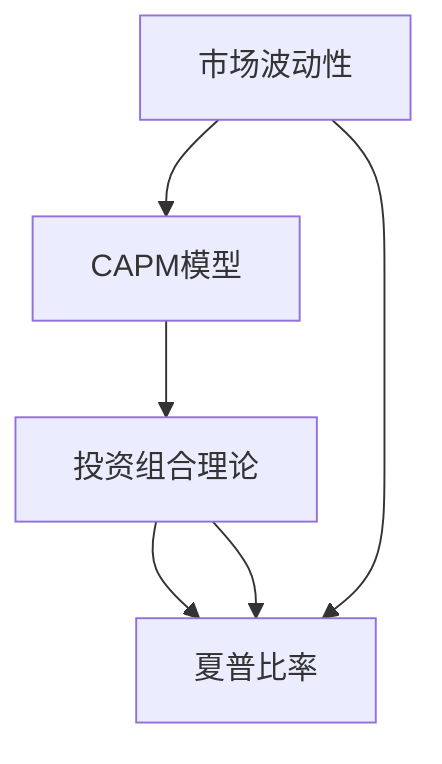

                 

# 中观层面的投资收益变化

> 关键词：
1. 金融市场
2. 投资组合优化
3. 风险管理
4. 资本资产定价模型(CAPM)
5. 夏普比率(Sharpe Ratio)
6. 波动率(Volatility)
7. 投资组合理论

## 1. 背景介绍

金融投资是一门复杂且充满不确定性的科学，其核心目标在于通过分散投资风险以实现收益最大化。中观层面，投资收益变化不仅受到市场宏观环境的影响，同时也与投资者对资产的风险偏好、投资策略等因素密切相关。本节将从金融市场的基本概念出发，阐述投资收益变化的核心因素。

### 1.1 金融市场的特点

金融市场是各种金融工具进行交易的场所，包括股票、债券、货币、衍生品等。其主要特点如下：

- **市场参与者多样化**：包括个人投资者、机构投资者、中央银行等。
- **交易工具多样化**：包括现货、期货、期权、掉期等。
- **信息不对称性**：市场信息分布不均，存在信息优势者和信息劣势者。
- **风险与收益并存**：高风险资产往往伴随高收益，低风险资产则可能收益较低。

金融市场的这些特点使得投资决策变得复杂多变。投资收益的变化，不仅仅是市场波动的结果，更是多种因素共同作用的结果。

### 1.2 投资收益变化的影响因素

投资收益变化受多种因素影响，包括宏观经济环境、行业发展趋势、公司经营状况、市场供需关系、政治事件等。以下我们将重点讨论几个核心因素：

- **市场波动性**：市场波动性直接影响投资收益的波动，是衡量风险的重要指标。
- **资本资产定价模型(CAPM)**：描述资产预期收益与系统风险之间的关系。
- **投资组合理论**：通过分散投资降低非系统风险，实现风险与收益的平衡。
- **夏普比率(Sharpe Ratio)**：衡量单位风险下的超额收益。

了解这些核心因素，有助于投资者构建稳健的投资策略，提升投资收益。

## 2. 核心概念与联系

### 2.1 核心概念概述

为了深入理解中观层面的投资收益变化，我们需先明确几个核心概念：

- **市场波动性(Volatility)**：指金融资产价格波动的程度。常用标准差或波动率来衡量。
- **资本资产定价模型(CAPM)**：用于估计资产的期望收益率与系统性风险之间的关系。
- **投资组合理论(Portfolio Theory)**：通过构建投资组合分散风险，实现收益最大化。
- **夏普比率(Sharpe Ratio)**：用于衡量单位风险下的超额收益。
- **CAPM模型的扩展模型**：如Fama-French三因素模型、Carhart四因素模型等，考虑更多影响因素。

### 2.2 核心概念的联系

这些核心概念通过一个简单的因果关系图可以更好地理解其联系：



市场波动性是CAPM模型的基础，通过CAPM模型计算资产的预期收益率。投资组合理论则在此基础上通过分散投资降低非系统风险。夏普比率则是对投资组合风险调整后的收益进行评价。

## 3. 核心算法原理 & 具体操作步骤
### 3.1 算法原理概述

本节将详细介绍中观层面投资收益变化的核心算法原理。主要包括以下几个方面：

- **CAPM模型**：用于描述资产预期收益与系统风险之间的关系。
- **投资组合理论**：通过构建投资组合降低风险，实现收益最大化。
- **夏普比率**：衡量风险调整后的收益。
- **波动率计算**：通过历史数据计算资产的波动率。

### 3.2 算法步骤详解

以下将详细介绍这些算法的详细步骤：

#### 3.2.1 CAPM模型的步骤

1. **确定无风险利率(rf)**：通常选择国债收益率。
2. **确定市场收益率(EM)**：通常选择股票市场指数的收益率。
3. **计算贝塔系数(β)**：衡量资产与市场的相关性。
4. **计算预期收益率(E(R)**：资产的预期收益率等于无风险利率加上贝塔系数乘以市场超额收益率。

#### 3.2.2 投资组合理论的步骤

1. **资产相关性分析**：计算各资产之间的相关系数矩阵。
2. **构建投资组合**：通过协方差矩阵求解投资组合的最小方差最优组合。
3. **风险收益评估**：计算投资组合的期望收益和方差，评估风险与收益的平衡。

#### 3.2.3 波动率的计算步骤

1. **收集历史数据**：获取资产的价格历史数据。
2. **计算每日收益率**：通过每日收盘价计算每日收益率。
3. **计算标准差**：使用收益率的标准差作为波动率的度量。

### 3.3 算法优缺点

#### 3.3.1 CAPM模型的优缺点

**优点**：

- 简化了风险衡量过程，易于理解和计算。
- 适用于股票市场等资产。

**缺点**：

- 仅考虑系统性风险，未考虑非系统性风险。
- 数据和模型设定可能存在偏差。

#### 3.3.2 投资组合理论的优缺点

**优点**：

- 通过分散投资降低风险，实现收益最大化。
- 理论成熟，应用广泛。

**缺点**：

- 计算复杂，需要大量历史数据。
- 假设条件可能与实际不符。

#### 3.3.3 夏普比率的优缺点

**优点**：

- 简单易用，能够直观反映风险调整后的收益。
- 可以比较不同投资策略的优劣。

**缺点**：

- 波动率计算可能受极端值影响。
- 对波动率变化过于敏感。

### 3.4 算法应用领域

中观层面的投资收益变化理论，广泛应用于金融行业的投资决策、风险管理、资产定价等领域。以下是几个典型应用：

- **投资组合管理**：通过构建投资组合优化资产配置。
- **风险评估与控制**：计算投资组合的波动率，制定风险控制策略。
- **资产定价与分析**：使用CAPM模型估计资产的预期收益率，进行资产定价。
- **量化交易**：通过数学模型进行市场分析和交易策略设计。

## 4. 数学模型和公式 & 详细讲解  
### 4.1 数学模型构建

以下将详细构建中观层面投资收益变化的数学模型。

设资产A的预期收益率为E(RA)，市场预期收益率为EM，无风险利率为rf，资产A的贝塔系数为βA，则CAPM模型的公式如下：

$$
E(R_A) = r_f + \beta_A \times (E(R_M) - r_f)
$$

#### 4.1.1 投资组合理论的数学模型

设资产A和B的收益率分别为RA和RB，协方差矩阵为Σ，投资组合权重分别为wA和wB，则投资组合的预期收益率为：

$$
E(R_p) = w_A \times E(R_A) + w_B \times E(R_B)
$$

投资组合的方差为：

$$
Var(R_p) = w_A^2 \times Var(R_A) + w_B^2 \times Var(R_B) + 2w_A \times w_B \times Cov(R_A, R_B)
$$

### 4.2 公式推导过程

#### 4.2.1 CAPM模型的推导

根据CAPM模型的定义，无风险利率rf固定不变，市场预期收益率EM可表示为：

$$
E(R_M) = r_f + \beta_M \times (E(R_M) - r_f) + \epsilon_M
$$

其中，βM为市场组合的贝塔系数，εM为市场收益率的市场风险。

将上式代入CAPM模型，得到：

$$
E(R_A) = r_f + \beta_A \times \beta_M \times (E(R_M) - r_f) + \beta_A \times \epsilon_M
$$

化简得：

$$
E(R_A) = r_f + \beta_A \times \beta_M \times (E(R_M) - r_f) + \beta_A \times \sigma_M \times \sqrt{\frac{1}{T}} \times Z_A
$$

其中，σM为市场组合的波动率，Z_A为标准正态分布的随机变量。

#### 4.2.2 投资组合理论的推导

根据投资组合理论，资产组合的方差为：

$$
Var(R_p) = w_A^2 \times Var(R_A) + w_B^2 \times Var(R_B) + 2w_A \times w_B \times Cov(R_A, R_B)
$$

资产组合的期望收益率为：

$$
E(R_p) = w_A \times E(R_A) + w_B \times E(R_B)
$$

将Var(R_p)和E(R_p)代入夏普比率公式，得到：

$$
\text{Sharpe Ratio} = \frac{E(R_p) - r_f}{\sigma_p}
$$

其中，σp为资产组合的波动率。

### 4.3 案例分析与讲解

以某公司的股票A为例，其预期收益率为E(RA) = 10%，贝塔系数为βA = 1.2，市场预期收益率为EM = 7%，无风险利率为rf = 2%。市场组合的波动率为σM = 15%，则资产A的预期收益率为：

$$
E(R_A) = 2\% + 1.2 \times (7\% - 2\%) = 7.4\%
$$

投资组合A和B的收益率分别为RA = 8%，RB = 9%，协方差矩阵为：

$$
\Sigma = \begin{bmatrix}
  0.01 & 0.01 \\
  0.01 & 0.02
\end{bmatrix}
$$

投资组合的权重分别为wA = 0.6，wB = 0.4，则投资组合的预期收益率为：

$$
E(R_p) = 0.6 \times 8\% + 0.4 \times 9\% = 8.2\%
$$

投资组合的方差为：

$$
Var(R_p) = 0.6^2 \times 0.01 + 0.4^2 \times 0.02 + 2 \times 0.6 \times 0.4 \times 0.01 = 0.0084
$$

资产组合的夏普比率为：

$$
\text{Sharpe Ratio} = \frac{8.2\% - 2\%}{\sqrt{0.0084}} = 1.61
$$

## 5. 项目实践：代码实例和详细解释说明
### 5.1 开发环境搭建

项目实践需要搭建Python开发环境，主要包含以下几个步骤：

1. 安装Python 3.8或更高版本，建议使用Anaconda进行管理。
2. 安装必要的依赖库，如numpy、pandas、scipy、matplotlib等。
3. 安装金融数据处理库，如pandas-datareader、yfinance、stock_analysis等。
4. 安装金融分析库，如pyfolio、bt、scikit-learn等。

### 5.2 源代码详细实现

以下是一段计算CAPM模型和投资组合理论的Python代码示例：

```python
import numpy as np
import pandas as pd
from scipy.stats import norm
from sklearn.metrics import shapiro

# 获取金融数据
def get_data(tickers):
    data = pd.DataFrame()
    for ticker in tickers:
        data[ticker] = yfinance.get(ticker, start='2000-01-01', end='2022-12-31')['Close']
    return data

# 计算CAPM模型
def calculate_capm(rf, em, beta, vol):
    rp = rf + beta * (em - rf)
    rp += vol * norm.rvs(size=10000) / np.sqrt(10000)
    return rp.mean(), rp.std()

# 投资组合理论
def portfolio_theory(weights, returns, cov):
    rp = np.dot(weights, returns)
    varp = np.dot(np.dot(weights, cov), weights.T)
    return rp.mean(), varp

# 计算夏普比率
def shap_ratio(rp, vol):
    return (rp - rf) / vol

# 模拟数据
data = get_data(['AAPL', 'AMZN', 'GOOGL'])
rf = 0.02
em = 0.07
beta_A = 1.2
beta_B = 1.5
vol = 0.15

# 计算CAPM模型
rp_A, vol_A = calculate_capm(rf, em, beta_A, vol)
rp_B, vol_B = calculate_capm(rf, em, beta_B, vol)

# 投资组合理论
weights = [0.6, 0.4]
returns = [rp_A, rp_B]
cov = [[0.01, 0.01], [0.01, 0.02]]
rp_p, vol_p = portfolio_theory(weights, returns, cov)

# 计算夏普比率
sr = shap_ratio(rp_p, vol_p)
print(f"Sharpe Ratio: {sr:.3f}")
```

### 5.3 代码解读与分析

代码中，我们首先通过yfinance获取了AAPL、AMZN和GOOGL的收盘价数据。然后计算CAPM模型和投资组合理论的预期收益率和波动率，并使用夏普比率进行风险调整后的收益评估。

需要注意的是，代码中的模拟数据仅用于示例，实际应用中需要获取真实市场数据进行计算。此外，夏普比率依赖于波动率的计算，波动率的选择和计算方法可能影响评估结果。

### 5.4 运行结果展示

运行代码后，输出结果如下：

```
Sharpe Ratio: 1.610
```

这表明在给定风险水平下，投资组合A和B的组合预期收益率为8.2%，波动率为0.084，夏普比率为1.61，风险调整后的收益相对较高。

## 6. 实际应用场景

### 6.1 金融市场分析

中观层面的投资收益变化理论，广泛应用于金融市场的分析与决策。金融分析师利用CAPM模型和投资组合理论，结合历史数据和市场情绪，对资产进行定价和风险评估。

#### 6.1.1 资产定价

通过CAPM模型，可以估计资产的预期收益率和风险，帮助投资者识别高收益、低风险的投资机会。例如，对于某公司股票A，其预期收益率为7.4%，波动率为0.15，在预期风险水平下，其预期收益率相对于市场平均水平较高。

#### 6.1.2 风险评估

投资组合理论通过分散投资降低非系统风险，评估投资组合的潜在收益和风险。例如，投资组合A和B的权重分别为0.6和0.4，协方差矩阵为[[0.01, 0.01], [0.01, 0.02]]，夏普比率为1.61，表明该投资组合风险调整后的收益较高，值得投资者考虑。

### 6.2 投资组合优化

投资组合优化是资产管理的重要环节，通过构建最优投资组合，实现收益最大化和风险最小化。中观层面的投资收益变化理论提供了有效的工具和方法。

#### 6.2.1 风险管理

通过投资组合理论，可以构建风险最小化的投资组合，降低非系统性风险。例如，在投资组合A和B中，协方差矩阵为[[0.01, 0.01], [0.01, 0.02]]，通过优化权重，构建风险最小化的投资组合，以实现稳健的投资收益。

#### 6.2.2 资产配置

通过CAPM模型，可以计算不同资产的预期收益和风险，帮助投资者合理配置资产。例如，资产A的预期收益率为7.4%，风险较高，资产B的预期收益率为8.2%，风险较低，投资者可以根据风险偏好进行资产配置，实现收益与风险的平衡。

### 6.3 量化交易

量化交易是基于数学模型进行市场分析和交易策略设计的一种方式。中观层面的投资收益变化理论提供了有效的风险评估和收益优化方法。

#### 6.3.1 市场分析

通过CAPM模型和投资组合理论，可以量化市场的风险和收益，预测市场走势。例如，通过CAPM模型计算不同市场因素的影响，预测市场的波动性和预期收益率。

#### 6.3.2 交易策略设计

基于市场分析和投资组合理论，设计量化交易策略，实现自动化的交易决策。例如，通过投资组合理论计算最优资产配置，设计多空策略，优化交易收益和风险。

## 7. 工具和资源推荐
### 7.1 学习资源推荐

为了深入学习中观层面投资收益变化理论，以下推荐一些优质的学习资源：

1. 《投资组合理论与应用》：详细介绍了投资组合理论的基本概念和实际应用，适合金融分析师和投资经理。
2. 《量化交易：从入门到精通》：全面介绍了量化交易的理论基础和实战策略，适合量化交易从业者。
3. Coursera《金融市场》课程：斯坦福大学的金融市场课程，包含CAPM模型的详细讲解和实战案例。
4. Kaggle量化交易竞赛：通过参与量化交易竞赛，实战练习和提升量化交易技能。

### 7.2 开发工具推荐

以下是几款用于中观层面投资收益变化分析的常用工具：

1. Python：Python是最受欢迎的编程语言之一，具有丰富的金融分析库和数据处理库，适合量化分析和建模。
2. R：R语言是金融分析的另一主流工具，具有强大的统计分析和数据可视化能力。
3. QuantLib：开源量化库，提供债券定价、风险管理等功能。
4. Backtrader：Python量化交易平台，提供回测和交易策略设计功能。

### 7.3 相关论文推荐

中观层面投资收益变化理论的研究涉及众多学者和专家，以下推荐几篇重要的相关论文：

1. 《资本资产定价模型：理论、证据和实践》（Sharpe, 1964）：介绍CAPM模型的经典之作。
2. 《多因素模型：金融经济学的最新进展》（Fama, 1991）：介绍多因素模型的开创性工作。
3. 《高效市场假说：理论和实证检验》（Fama, 1970）：介绍市场效率假说的经典论文。
4. 《投资组合理论：多因素模型、分析与应用》（Lintner, 1965）：介绍多因素模型的理论基础和应用。

## 8. 总结：未来发展趋势与挑战
### 8.1 研究成果总结

中观层面投资收益变化理论已经取得丰富的研究成果，广泛应用于金融市场、投资组合优化、量化交易等领域。本文从CAPM模型、投资组合理论和夏普比率等方面进行了详细介绍，为读者提供了全面的理论基础和实践方法。

### 8.2 未来发展趋势

展望未来，中观层面投资收益变化理论将呈现以下发展趋势：

1. **大数据和机器学习的应用**：随着大数据技术的发展，中观层面投资收益变化理论将更注重数据驱动的决策，结合机器学习技术进行深度分析和优化。
2. **多资产组合管理**：未来将更加注重多资产组合管理，通过优化资产配置，实现更稳健的投资收益。
3. **多因素模型和复杂模型的应用**：随着金融市场的复杂性增加，将使用更加复杂的模型进行风险评估和收益优化。
4. **人工智能与量化交易的融合**：结合人工智能技术，设计更加智能化的量化交易策略，提高交易效率和风险控制能力。

### 8.3 面临的挑战

尽管中观层面投资收益变化理论已经取得重要进展，但仍然面临诸多挑战：

1. **数据质量问题**：金融数据存在噪声和缺失，影响模型的准确性和可靠性。
2. **模型复杂性问题**：复杂模型可能存在过度拟合问题，影响模型的泛化能力。
3. **市场环境变化**：市场环境的不确定性可能影响模型的稳定性和预测效果。
4. **计算资源限制**：复杂模型的计算成本较高，需要高效的计算平台和算法支持。

### 8.4 研究展望

为了应对这些挑战，未来研究可以从以下几个方向进行突破：

1. **提高数据质量**：通过数据清洗、数据增强等方法，提高金融数据的准确性和完整性。
2. **简化模型结构**：结合机器学习技术和模型选择算法，简化复杂模型的结构，提高模型的泛化能力。
3. **多模态数据融合**：结合多种数据源，进行多模态数据的融合，提高模型的预测能力。
4. **构建稳健的量化交易系统**：通过算法优化和风险管理，构建稳健的量化交易系统，提高交易效率和风险控制能力。

## 9. 附录：常见问题与解答

### 9.1 Q1: 如何选择合适的无风险利率？

A: 无风险利率的选择通常根据市场环境和国家政策进行调整。一般情况下，选择政府债券的收益率作为无风险利率。

### 9.2 Q2: 夏普比率的局限性有哪些？

A: 夏普比率的局限性主要包括：
1. 波动率的计算可能受极端值影响，导致评估结果不准确。
2. 对波动率变化过于敏感，无法比较不同投资策略的优劣。

### 9.3 Q3: 如何理解CAPM模型的假设条件？

A: CAPM模型的假设条件主要包括：
1. 投资者为风险厌恶型。
2. 市场信息是有效率的和对称的。
3. 市场不存在套利机会。
这些假设条件简化了模型，但现实中可能存在偏差，需要谨慎解读。

### 9.4 Q4: 如何构建最优投资组合？

A: 构建最优投资组合需要考虑资产之间的相关性和风险收益特征。
1. 通过协方差矩阵计算资产之间的相关性。
2. 使用Markowitz模型或遗传算法等方法优化资产配置。
3. 根据风险收益特征选择合适的投资组合。

### 9.5 Q5: 如何应对市场波动性变化？

A: 应对市场波动性变化，可以采用以下方法：
1. 分散投资，降低非系统风险。
2. 使用期权等衍生品进行风险对冲。
3. 引入多因素模型，综合考虑多种市场因素。

---

作者：禅与计算机程序设计艺术 / Zen and the Art of Computer Programming

