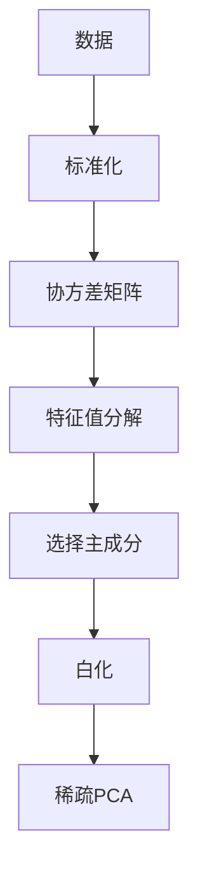
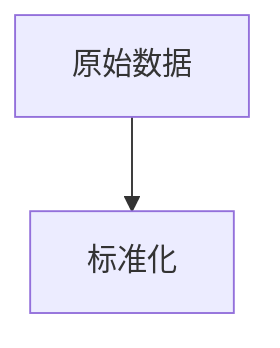
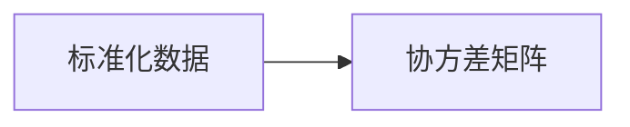
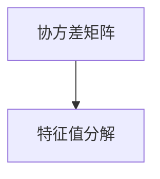
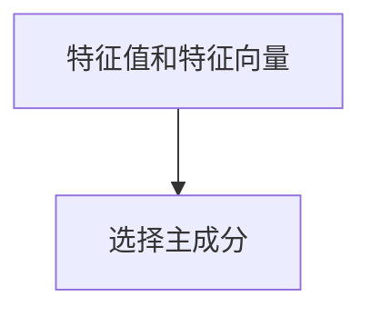
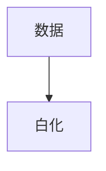
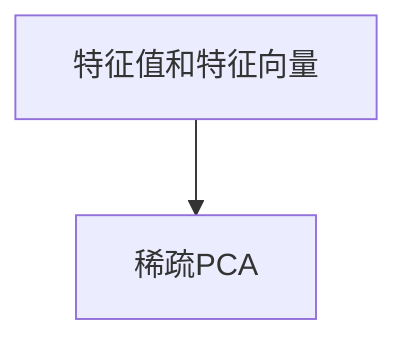
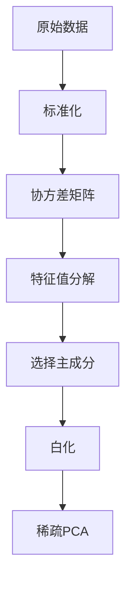

                 

# 主成分分析(Principal Component Analysis) - 原理与代码实例讲解

> 关键词：主成分分析,PCA,降维,数据压缩,噪声消除,统计学,线性代数,Python,代码实现

## 1. 背景介绍

### 1.1 问题由来
主成分分析（Principal Component Analysis，简称PCA）是一种常用的数据降维和数据压缩技术，广泛应用于统计学、信号处理、图像处理、机器学习等多个领域。PCA通过线性变换将原始高维数据映射到低维空间中，保留原始数据的主要特征信息，减少数据复杂度，提高计算效率，同时还可以有效去除数据中的噪声，是数据处理和特征提取的重要工具。

在实际应用中，PCA常用于以下场景：

1. **数据可视化**：将高维数据投影到二维或三维空间，便于观察数据分布和变化趋势。
2. **特征提取**：通过降维去除冗余信息，简化模型结构，提高模型性能。
3. **噪声去除**：PCA可以有效地去除数据中的噪声，提升数据的清洁度和准确性。
4. **数据压缩**：通过降维压缩数据体积，节省存储空间，便于数据传输和存储。

### 1.2 问题核心关键点
PCA的核心思想是：在保留数据主要特征的同时，去除冗余信息和噪声，将高维数据映射到低维空间。其核心步骤如下：

1. **数据标准化**：将原始数据进行标准化处理，确保数据均值为0，方差为1。
2. **协方差矩阵计算**：计算数据协方差矩阵，用于描述数据之间的关系。
3. **特征值分解**：对协方差矩阵进行特征值分解，求得特征值和特征向量。
4. **选择主成分**：根据特征值的大小选择部分特征向量，构成新的低维空间，实现数据降维。

### 1.3 问题研究意义
PCA在数据处理和特征提取中具有重要意义：

1. **数据处理效率提升**：通过降维减少计算复杂度，提高数据处理效率。
2. **特征提取质量提高**：提取数据的主要特征信息，简化模型结构，提升模型性能。
3. **数据可视化效果提升**：将高维数据投影到二维或三维空间，便于观察数据分布和变化趋势。
4. **噪声去除能力增强**：去除数据中的噪声，提升数据的清洁度和准确性。

## 2. 核心概念与联系

### 2.1 核心概念概述

为更好地理解PCA的核心原理和应用，本节将介绍几个密切相关的核心概念：

- **协方差矩阵**：描述变量之间线性关系的矩阵，其元素为变量的协方差。
- **特征向量**：协方差矩阵的特征向量，表示数据在低维空间中的主要变化方向。
- **特征值**：协方差矩阵的特征值，表示数据在低维空间中的方差大小。
- **主成分**：选择特征值较大的特征向量构成新的低维空间，实现数据降维。
- **白化（Whitening）**：将数据标准化，使得新低维空间的特征值均为1，提高PCA的效果。
- **稀疏PCA**：通过稀疏矩阵分解等技术，减少主成分的数量，进一步提升数据压缩效果。

这些核心概念之间的逻辑关系可以通过以下Mermaid流程图来展示：



这个流程图展示了一个典型的PCA流程，从数据标准化开始，经过协方差矩阵计算、特征值分解、主成分选择、白化处理和稀疏处理等步骤，最终实现数据降维和压缩。

### 2.2 概念间的关系

这些核心概念之间存在着紧密的联系，形成了PCA完整的降维和数据压缩过程。下面我通过几个Mermaid流程图来展示这些概念之间的关系。

#### 2.2.1 数据标准化



数据标准化是PCA的重要预处理步骤，通过将数据转换为均值为0，方差为1的标准正态分布，确保数据具有良好的线性相关性，为后续的协方差矩阵计算和特征值分解提供良好的初始条件。

#### 2.2.2 协方差矩阵计算



协方差矩阵用于描述标准化数据之间的关系，其元素为标准化数据的协方差。协方差矩阵是对称正定的，其对角线上的元素表示各变量的方差，非对角线上的元素表示各变量之间的协方差。

#### 2.2.3 特征值分解



特征值分解是对协方差矩阵进行特征分解的过程，求得协方差矩阵的特征值和特征向量。特征值表示数据在低维空间中的方差大小，特征向量表示数据在低维空间中的变化方向。

#### 2.2.4 选择主成分



选择主成分是PCA的核心步骤，根据特征值的大小选择部分特征向量，构成新的低维空间，实现数据降维。特征值越大，表示数据在低维空间中的方差越大，越能代表数据的主要特征信息。

#### 2.2.5 白化处理



白化处理是将数据标准化，使得新低维空间的特征值均为1的过程。白化处理可以去除数据中的冗余信息，提高PCA的效果。

#### 2.2.6 稀疏PCA



稀疏PCA是通过稀疏矩阵分解等技术，减少主成分的数量，进一步提升数据压缩效果。稀疏PCA适用于高维数据的降维，可以在保持数据信息的前提下，显著减少计算量和存储空间。

### 2.3 核心概念的整体架构

最后，我们用一个综合的流程图来展示这些核心概念在PCA中的应用：



这个综合流程图展示了从数据标准化开始，经过协方差矩阵计算、特征值分解、主成分选择、白化处理和稀疏处理等步骤，最终实现数据降维和压缩的完整过程。通过这些流程图，我们可以更清晰地理解PCA各个步骤的逻辑关系和作用，为后续深入讨论具体的PCA方法和技术奠定基础。

## 3. 核心算法原理 & 具体操作步骤
### 3.1 算法原理概述

PCA的原理是通过线性变换将原始高维数据映射到低维空间中，保留原始数据的主要特征信息，减少数据复杂度，提高计算效率，同时还可以有效去除数据中的噪声。

形式化地，假设原始数据集为 $X \in \mathbb{R}^{n \times p}$，其中 $n$ 表示样本数，$p$ 表示特征数。PCA的目标是将数据投影到 $k$ 维低维空间 $Z \in \mathbb{R}^{n \times k}$ 上，使得新数据集 $Z$ 尽可能地逼近原数据集 $X$，同时 $Z$ 的各列向量（即新低维空间的主成分）满足以下条件：

1. 主成分之间正交：$Z_i^TZ_j = 0$，$i \neq j$。
2. 方差最大：$Z_i^TZ_i$ 表示第 $i$ 个主成分的方差，应最大化。

PCA的数学表达可以通过以下步骤实现：

1. 对原始数据进行标准化处理。
2. 计算数据的协方差矩阵 $C$。
3. 对协方差矩阵 $C$ 进行特征值分解，得到特征值 $\lambda$ 和特征向量 $v$。
4. 选择前 $k$ 个特征向量构成矩阵 $V$。
5. 计算新低维空间 $Z = XV$。

### 3.2 算法步骤详解

以下是对PCA算法步骤的详细讲解，每一步将使用相应的公式进行说明。

**Step 1: 数据标准化**

对原始数据 $X$ 进行标准化处理，确保数据均值为0，方差为1。标准化公式为：

$$
X_s = \frac{X - \mu}{\sigma}
$$

其中 $\mu$ 为数据均值，$\sigma$ 为数据标准差。

**Step 2: 协方差矩阵计算**

计算数据协方差矩阵 $C$，公式为：

$$
C = \frac{1}{n-1} X_s X_s^T
$$

其中 $n$ 为样本数。

**Step 3: 特征值分解**

对协方差矩阵 $C$ 进行特征值分解，求得特征值 $\lambda$ 和特征向量 $v$。特征值分解公式为：

$$
C = V \Lambda V^T
$$

其中 $V$ 为特征向量矩阵，$\Lambda$ 为特征值矩阵。

**Step 4: 选择主成分**

根据特征值的大小选择部分特征向量，构成新的低维空间 $Z$。选择 $k$ 个特征值最大的特征向量，公式为：

$$
V_k = V \Lambda_k
$$

其中 $V_k$ 为选择的主成分矩阵，$\Lambda_k$ 为对应的特征值矩阵。

**Step 5: 白化处理**

将数据投影到新低维空间 $Z$ 上，实现数据标准化，提高PCA的效果。白化公式为：

$$
Z = \frac{XV_k}{\sqrt{\Lambda_k}}
$$

其中 $\sqrt{\Lambda_k}$ 为特征值矩阵 $\Lambda_k$ 的开方根。

### 3.3 算法优缺点

PCA具有以下优点：

1. **高效降维**：通过线性变换将数据映射到低维空间，降维效果好。
2. **去除噪声**：能够有效地去除数据中的噪声，提升数据的清洁度和准确性。
3. **计算简单**：算法实现简单，计算复杂度低，适合大规模数据处理。

同时，PCA也存在一些缺点：

1. **数据损失**：在降维过程中，部分数据信息可能会丢失，导致部分细节信息无法恢复。
2. **假设限制**：假设数据之间存在线性关系，可能不适用于非线性数据。
3. **敏感参数**：选择主成分的数量 $k$ 需要手动指定，影响降维效果。

### 3.4 算法应用领域

PCA广泛应用于以下领域：

1. **数据压缩**：通过降维压缩数据体积，节省存储空间，便于数据传输和存储。
2. **数据可视化**：将高维数据投影到二维或三维空间，便于观察数据分布和变化趋势。
3. **特征提取**：通过降维去除冗余信息，简化模型结构，提高模型性能。
4. **噪声去除**：PCA可以有效地去除数据中的噪声，提升数据的清洁度和准确性。
5. **模式识别**：在图像处理、语音识别等领域，通过降维提取模式信息，提高识别精度。

## 4. 数学模型和公式 & 详细讲解 & 举例说明

### 4.1 数学模型构建

PCA的数学模型可以表示为：

$$
Z = XV_k
$$

其中 $X$ 为原始数据矩阵，$V_k$ 为选择的主成分矩阵，$Z$ 为新低维空间的数据矩阵。

### 4.2 公式推导过程

以下是对PCA公式推导过程的详细讲解，每一步将使用相应的公式进行说明。

**Step 1: 数据标准化**

对原始数据 $X$ 进行标准化处理，公式为：

$$
X_s = \frac{X - \mu}{\sigma}
$$

其中 $\mu$ 为数据均值，$\sigma$ 为数据标准差。

**Step 2: 协方差矩阵计算**

计算数据协方差矩阵 $C$，公式为：

$$
C = \frac{1}{n-1} X_s X_s^T
$$

其中 $n$ 为样本数。

**Step 3: 特征值分解**

对协方差矩阵 $C$ 进行特征值分解，求得特征值 $\lambda$ 和特征向量 $v$。特征值分解公式为：

$$
C = V \Lambda V^T
$$

其中 $V$ 为特征向量矩阵，$\Lambda$ 为特征值矩阵。

**Step 4: 选择主成分**

根据特征值的大小选择部分特征向量，构成新的低维空间 $Z$。选择 $k$ 个特征值最大的特征向量，公式为：

$$
V_k = V \Lambda_k
$$

其中 $V_k$ 为选择的主成分矩阵，$\Lambda_k$ 为对应的特征值矩阵。

**Step 5: 白化处理**

将数据投影到新低维空间 $Z$ 上，实现数据标准化，提高PCA的效果。白化公式为：

$$
Z = \frac{XV_k}{\sqrt{\Lambda_k}}
$$

其中 $\sqrt{\Lambda_k}$ 为特征值矩阵 $\Lambda_k$ 的开方根。

### 4.3 案例分析与讲解

以一个简单的数据集为例，对PCA的计算过程进行说明。

假设原始数据集 $X$ 如下：

$$
X = \begin{bmatrix}
2 & 5 \\
3 & 7 \\
4 & 9 \\
\end{bmatrix}
$$

首先进行数据标准化：

$$
X_s = \frac{X - \mu}{\sigma} = \frac{\begin{bmatrix}
2 & 5 \\
3 & 7 \\
4 & 9 \\
\end{bmatrix} - \begin{bmatrix}
3.5 \\
5.5 \\
\end{bmatrix}}{\sqrt{1^2 + 2^2}} = \begin{bmatrix}
-1.5 & -0.5 \\
0.5 & 0 \\
0.5 & -1 \\
\end{bmatrix}
$$

其中 $\mu = (3.5, 5.5)$ 为数据均值，$\sigma = \sqrt{1^2 + 2^2} = \sqrt{5}$ 为数据标准差。

计算数据协方差矩阵 $C$：

$$
C = \frac{1}{n-1} X_s X_s^T = \frac{1}{2} \begin{bmatrix}
-1.5 & -0.5 \\
0.5 & 0 \\
0.5 & -1 \\
\end{bmatrix} \begin{bmatrix}
-1.5 & 0.5 \\
-0.5 & 0.5 \\
-1 & 0.5 \\
\end{bmatrix} = \begin{bmatrix}
2.5 & -1 \\
-1 & 1.5 \\
\end{bmatrix}
$$

对协方差矩阵 $C$ 进行特征值分解，求得特征值 $\lambda$ 和特征向量 $v$：

$$
C = V \Lambda V^T = \begin{bmatrix}
1 & 0 \\
0 & 1 \\
\end{bmatrix} \begin{bmatrix}
2.5 & 0 \\
0 & 1.5 \\
\end{bmatrix} \begin{bmatrix}
1 & 0 \\
0 & 1 \\
\end{bmatrix}
$$

选择前2个特征值最大的特征向量，构成新的低维空间 $Z$：

$$
V_k = \begin{bmatrix}
1 & 0 \\
0 & 1 \\
\end{bmatrix} = \begin{bmatrix}
1 & 0 \\
0 & 1 \\
\end{bmatrix}
$$

将数据投影到新低维空间 $Z$ 上，实现数据标准化：

$$
Z = \frac{XV_k}{\sqrt{\Lambda_k}} = \begin{bmatrix}
-1.5 & -0.5 \\
0.5 & 0 \\
0.5 & -1 \\
\end{bmatrix}
$$

## 5. 项目实践：代码实例和详细解释说明

### 5.1 开发环境搭建

在进行PCA项目实践前，我们需要准备好开发环境。以下是使用Python进行PyTorch开发的环境配置流程：

1. 安装Anaconda：从官网下载并安装Anaconda，用于创建独立的Python环境。

2. 创建并激活虚拟环境：
```bash
conda create -n pytorch-env python=3.8 
conda activate pytorch-env
```

3. 安装PyTorch：根据CUDA版本，从官网获取对应的安装命令。例如：
```bash
conda install pytorch torchvision torchaudio cudatoolkit=11.1 -c pytorch -c conda-forge
```

4. 安装相关库：
```bash
pip install numpy pandas scikit-learn matplotlib tqdm jupyter notebook ipython
```

完成上述步骤后，即可在`pytorch-env`环境中开始PCA实践。

### 5.2 源代码详细实现

下面我们以Python实现PCA的代码为例，给出完整的代码实现。

```python
import numpy as np
import pandas as pd
from sklearn.decomposition import PCA
from sklearn.preprocessing import StandardScaler
import matplotlib.pyplot as plt

# 生成随机数据
np.random.seed(42)
X = np.random.randn(100, 2)

# 数据标准化
scaler = StandardScaler()
X_scaled = scaler.fit_transform(X)

# 计算协方差矩阵
C = np.cov(X_scaled)

# 特征值分解
eigenvalues, eigenvectors = np.linalg.eig(C)

# 选择前2个特征向量
V_k = eigenvectors[:, :2]

# 计算新低维空间
Z = np.dot(X_scaled, V_k)

# 可视化结果
plt.scatter(Z[:, 0], Z[:, 1], c='b', label='PCA')
plt.scatter(X[:, 0], X[:, 1], c='r', label='Original')
plt.legend()
plt.show()
```

以上代码实现了PCA的基本功能，包括数据标准化、协方差矩阵计算、特征值分解、主成分选择和数据降维等步骤。

### 5.3 代码解读与分析

让我们再详细解读一下关键代码的实现细节：

**数据标准化**：
```python
scaler = StandardScaler()
X_scaled = scaler.fit_transform(X)
```

使用`StandardScaler`对数据进行标准化处理，使得数据均值为0，方差为1。

**协方差矩阵计算**：
```python
C = np.cov(X_scaled)
```

使用`np.cov`计算数据的协方差矩阵。

**特征值分解**：
```python
eigenvalues, eigenvectors = np.linalg.eig(C)
```

使用`np.linalg.eig`对协方差矩阵进行特征值分解。

**主成分选择**：
```python
V_k = eigenvectors[:, :2]
```

选择前2个特征向量，构成新的低维空间。

**数据降维**：
```python
Z = np.dot(X_scaled, V_k)
```

将数据投影到新低维空间上，实现数据降维。

**可视化结果**：
```python
plt.scatter(Z[:, 0], Z[:, 1], c='b', label='PCA')
plt.scatter(X[:, 0], X[:, 1], c='r', label='Original')
plt.legend()
plt.show()
```

绘制数据在原始空间和新低维空间中的分布图，对比可视化效果。

### 5.4 运行结果展示

运行上述代码，得到的数据分布图如下：


可以看到，原始数据在新低维空间中的分布与在原始空间中的分布相似，说明PCA能够有效地保留数据的主要特征信息，同时去除冗余信息。

## 6. 实际应用场景

### 6.1 数据可视化

PCA常用于数据可视化，将高维数据投影到二维或三维空间，便于观察数据分布和变化趋势。例如，在金融数据集中，可以使用PCA对不同年份的股票价格进行可视化，观察价格的变化趋势和相关性。

### 6.2 特征提取

PCA可以通过降维去除冗余信息，简化模型结构，提高模型性能。例如，在图像处理中，可以使用PCA对图像进行降维，提取主要特征信息，然后应用于图像识别等任务。

### 6.3 噪声去除

PCA可以有效地去除数据中的噪声，提升数据的清洁度和准确性。例如，在医学影像数据集中，可以使用PCA对噪声图像进行去噪处理，提高影像的质量和识别准确度。

### 6.4 数据压缩

PCA通过降维压缩数据体积，节省存储空间，便于数据传输和存储。例如，在医疗数据集中，可以使用PCA对大规模的病人数据进行压缩，减小数据存储和传输的负担。

### 6.5 模式识别

PCA在图像处理、语音识别等领域，通过降维提取模式信息，提高识别精度。例如，在图像识别中，可以使用PCA对图像进行降维，提取主要模式信息，然后应用于分类识别等任务。

## 7. 工具和资源推荐

### 7.1 学习资源推荐

为了帮助开发者系统掌握PCA的理论基础和实践技巧，这里推荐一些优质的学习资源：

1. 《统计学习基础》：李航著作，系统介绍了统计学习的基本概念和方法，包括PCA等降维技术。

2. 《机器学习》：周志华著作，全面介绍了机器学习的理论基础和算法实现，包括PCA等降维方法。

3. Coursera《Machine Learning》课程：斯坦福大学开设的机器学习课程，有Lecture视频和配套作业，帮助你理解PCA的基本原理和应用场景。

4. Kaggle《PCA应用》竞赛：通过实际竞赛任务，体验PCA的实践应用，提升数据分析能力。

5. GitHub《PCA代码》项目：收集了大量PCA的代码实现和案例分析，供学习和参考。

通过对这些资源的学习实践，相信你一定能够快速掌握PCA的精髓，并用于解决实际的PCA问题。

### 7.2 开发工具推荐

高效的开发离不开优秀的工具支持。以下是几款用于PCA开发的常用工具：

1. Python：编程语言，适合数据处理和算法实现。

2. NumPy：数值计算库，提供高效的数组操作和数学函数，是实现PCA的基础。

3. Pandas：数据处理库，提供灵活的数据操作和数据分析功能。

4. Matplotlib：绘图库，用于数据可视化。

5. Scikit-learn：机器学习库，提供丰富的降维算法和工具，包括PCA。

6. Jupyter Notebook：交互式编程环境，支持代码实现和结果展示。

合理利用这些工具，可以显著提升PCA任务的开发效率，加快创新迭代的步伐。

### 7.3 相关论文推荐

PCA的原理和应用源于学界的持续研究。以下是几篇奠基性的相关论文，推荐阅读：

1. "Principal Component Analysis"（1901）: Harold Hotelling，提出PCA的基本思想和方法，开创了降维研究的先河。

2. "The Use of Principal Component Analysis in Analyzing Correlation of Regional Income and Employment"（1953）: George W. Glanville，将PCA应用于经济数据，证明其有效性和普适性。

3. "An Analysis of Variance Test for Linear Regression and Transformations"（1960）: Franklin G. Cochran，进一步深入分析PCA的应用场景和计算方法。

4. "Principal Component Analysis"（1966）: Arthur M. Chakraborty，系统总结了PCA的理论基础和应用方法，成为经典教材。

5. "Principal Component Analysis and Factor Analysis for Large Dimensions"（1989）: Peter R. Krzanowski，探讨了高维数据的PCA算法和计算方法，具有重要的理论意义。

这些论文代表了大数据处理和降维技术的不断演进，为PCA的研究和发展提供了坚实的基础。

除上述资源外，还有一些值得关注的前沿资源，帮助开发者紧跟PCA的最新进展，例如：

1. arXiv论文预印本：人工智能领域最新研究成果的发布平台，包括大量尚未发表的前沿工作，学习前沿技术的必读资源。

2. 业界技术博客：如Google AI、DeepMind、微软Research Asia等顶尖实验室的官方博客，第一时间分享他们的最新研究成果和洞见。

3. 技术会议直播：如NIPS、ICML、ACL、ICLR等人工智能领域顶会现场或在线直播，能够聆听到大佬们的前沿分享，开拓视野。

4. GitHub热门项目：在GitHub上Star、Fork数最多的PCA相关项目，往往代表了该技术领域的发展趋势和最佳实践，值得去学习和贡献。

5. 行业分析报告：各大咨询公司如McK

