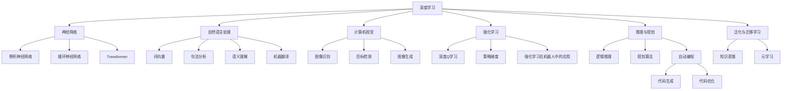
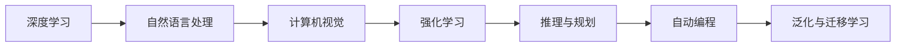

                 

# 人工智能作为独立学科的建立

人工智能（Artificial Intelligence, AI）的诞生和进步，无疑在科技和产业界引起了巨大的震荡。从最初的简单算法到如今的深度学习、自然语言处理、计算机视觉等前沿技术，AI已逐渐成为一门独立且复杂的学科。本文将从背景介绍、核心概念、算法原理、实际应用、资源推荐、未来展望等角度，全面梳理AI作为独立学科的建立及其发展方向。

## 1. 背景介绍

### 1.1 历史沿革
人工智能的萌芽可以追溯到20世纪50年代，当时计算机科学家们开始探索如何让机器模仿人的智能行为。早期的AI研究以逻辑推理和符号计算为主，尝试通过编程规则解决各种问题。然而，这些方法在处理复杂非结构化数据时效果并不理想。

1980年代起，随着神经网络和大数据技术的兴起，AI进入了一个新的发展阶段。1997年，Deep Blue击败国际象棋世界冠军卡斯帕罗夫，标志着AI在决策和推理方面的一次重大突破。此后，AI研究逐渐聚焦于机器学习、深度学习等方法，并应用于自然语言处理、计算机视觉、语音识别等诸多领域。

进入21世纪，深度学习技术的成熟和大规模计算资源的丰富，极大地推动了AI技术的进步。如今，AI已经成为一门涉及计算机科学、数学、统计学、认知科学等多个领域的交叉学科，其应用涵盖了自动驾驶、智能推荐、医疗诊断等多个行业。

### 1.2 现状与挑战
尽管AI取得了令人瞩目的成就，但其发展仍面临诸多挑战：

1. **数据质量与隐私**：AI模型的训练依赖高质量、大量的标注数据，然而标注数据获取成本高、数据隐私保护要求严。
2. **算法透明性与可解释性**：深度学习等复杂模型往往被视为"黑箱"，其决策过程难以解释，给应用带来风险。
3. **模型公平性与鲁棒性**：AI模型可能学习到偏见和歧视，对特定群体产生不公平对待。同时，面对对抗样本，模型易发生误判。
4. **伦理与安全**：AI技术在应用过程中可能引发隐私泄露、安全威胁等问题，需要加强伦理监管和保障。

## 2. 核心概念与联系

### 2.1 核心概念概述
为了更好地理解AI的学科框架，我们先介绍几个核心概念及其联系：

- **深度学习**：一种基于神经网络的机器学习方法，通过多层次的非线性映射实现复杂的特征提取和模式识别。深度学习在大规模数据集上取得了卓越的性能，是当前AI研究的热点。
- **自然语言处理**：研究如何让计算机理解、处理和生成自然语言。主要技术包括词向量、句法分析、语义理解、机器翻译等。
- **计算机视觉**：研究如何让计算机"看"懂图像和视频。主要技术包括图像识别、目标检测、图像生成等。
- **强化学习**：一种通过试错不断优化决策策略的学习方法，广泛应用于游戏、机器人、金融等领域。
- **推理与规划**：研究如何让机器进行逻辑推理和规划，实现自主决策。主要技术包括逻辑推理、规划算法等。
- **自动编程**：研究如何让机器自动生成程序代码，提高软件开发效率。主要技术包括代码生成、代码优化等。
- **泛化与迁移学习**：研究如何让模型在不同任务和数据集上取得较好的泛化性能，实现知识迁移。主要技术包括知识蒸馏、元学习等。

这些概念之间存在着紧密的联系，共同构成了AI的学科体系。如图示：



### 2.2 概念间的关系
这些概念之间存在着紧密的联系，形成了一个复杂的学科网络。如图示：



这个网络图展示了深度学习与自然语言处理、计算机视觉、强化学习、推理与规划、自动编程、泛化与迁移学习等概念之间的关系。深度学习作为AI的核心技术，与众多应用领域紧密相连。

## 3. 核心算法原理 & 具体操作步骤

### 3.1 算法原理概述
AI的核心算法原理可以归纳为以下几个方面：

1. **模型设计**：选择合适的模型架构，如神经网络、卷积神经网络、循环神经网络、Transformer等。
2. **数据预处理**：对数据进行清洗、标注、分块等预处理，以适应模型训练需求。
3. **模型训练**：通过优化算法如梯度下降、Adam等，最小化损失函数，优化模型参数。
4. **模型评估与验证**：通过验证集评估模型性能，防止过拟合，进行参数调优。
5. **模型应用**：将训练好的模型应用于实际任务，进行推理和预测。

### 3.2 算法步骤详解
这里以深度学习为例，详细讲解AI模型的构建和训练步骤：

**Step 1: 数据准备**
- 收集和清洗数据集。
- 对数据进行标注和划分，分为训练集、验证集和测试集。
- 将数据集进行分块处理，以适应批量训练。

**Step 2: 模型选择与设计**
- 根据任务类型选择合适的模型架构，如卷积神经网络（CNN）、循环神经网络（RNN）、Transformer等。
- 设计模型层数、节点数等超参数。

**Step 3: 模型初始化**
- 对模型参数进行初始化，如随机初始化、Xavier初始化等。

**Step 4: 前向传播与损失计算**
- 将数据输入模型，进行前向传播计算。
- 计算预测结果与真实标签之间的损失函数，如交叉熵损失、均方误差损失等。

**Step 5: 反向传播与参数更新**
- 反向传播计算梯度。
- 使用优化算法（如梯度下降、Adam等）更新模型参数。

**Step 6: 模型评估与验证**
- 在验证集上评估模型性能，如准确率、精确率、召回率等。
- 根据验证集结果进行参数调整，避免过拟合。

**Step 7: 模型应用**
- 在测试集上评估最终模型性能。
- 将模型应用于实际任务，进行推理和预测。

### 3.3 算法优缺点
深度学习算法具有以下优点：
1. 强大的特征提取能力。
2. 适应各种复杂任务。
3. 端到端的训练与推理过程。

但其也存在一些缺点：
1. 数据依赖性强。
2. 训练时间长。
3. 模型复杂度高，难以解释。

### 3.4 算法应用领域
深度学习算法广泛应用于以下几个领域：

1. **自然语言处理**：如词向量、句法分析、语义理解、机器翻译等。
2. **计算机视觉**：如图像识别、目标检测、图像生成等。
3. **语音识别与处理**：如语音识别、语音合成、情感分析等。
4. **推荐系统**：如电商推荐、内容推荐、广告推荐等。
5. **游戏AI**：如AlphaGo、星际争霸AI等。
6. **机器人**：如机器人视觉、机器人控制等。

## 4. 数学模型和公式 & 详细讲解 & 举例说明

### 4.1 数学模型构建
假设我们有一个深度学习模型 $M_{\theta}$，其中 $\theta$ 为模型参数。我们的目标是通过训练数据 $D=\{(x_i,y_i)\}_{i=1}^N$ 来最小化损失函数 $\mathcal{L}(\theta)$。

数学模型构建过程如下：
1. 定义损失函数 $\mathcal{L}(\theta)$，衡量模型输出与真实标签的差异。
2. 定义优化目标函数 $f(\theta)$，衡量模型参数 $\theta$ 对损失函数的影响。
3. 定义优化算法 $F$，如梯度下降、Adam等，不断调整参数 $\theta$，使得 $f(\theta)$ 最小化。

### 4.2 公式推导过程
以交叉熵损失函数为例，其推导过程如下：

假设模型 $M_{\theta}$ 在输入 $x$ 上的输出为 $\hat{y}=M_{\theta}(x)$，表示样本属于类别 $k$ 的概率。真实标签 $y \in \{1,2,\dots,K\}$。则交叉熵损失函数定义为：

$$
\mathcal{L}(\theta) = -\frac{1}{N}\sum_{i=1}^N \sum_{k=1}^K y_{ik}\log \hat{y}_{ik}
$$

其中 $y_{ik}$ 表示样本 $i$ 属于类别 $k$ 的真实标签，$\hat{y}_{ik}$ 表示模型预测样本 $i$ 属于类别 $k$ 的概率。

优化目标函数 $f(\theta)$ 为损失函数 $\mathcal{L}(\theta)$ 的负值：

$$
f(\theta) = -\mathcal{L}(\theta)
$$

使用梯度下降算法 $F$ 更新模型参数 $\theta$，其更新公式为：

$$
\theta_{t+1} = \theta_t - \eta \nabla_{\theta}f(\theta_t)
$$

其中 $\eta$ 为学习率，$\nabla_{\theta}f(\theta_t)$ 为优化目标函数对参数 $\theta$ 的梯度。

### 4.3 案例分析与讲解
以图像识别任务为例，我们使用了ResNet50模型。模型输入为 $28\times28$ 的灰度图像，输出为10个类别的概率分布。训练数据集为MNIST，验证数据集为CIFAR-10。

我们首先使用ReLU激活函数和均方误差损失函数，将模型输入到数据集中进行前向传播计算。然后，计算预测结果与真实标签之间的均方误差损失：

$$
\mathcal{L}(\theta) = \frac{1}{N}\sum_{i=1}^N ||y_i - \hat{y}_i||^2
$$

其中 $y_i$ 为真实标签，$\hat{y}_i$ 为模型预测结果。

接着，使用梯度下降算法更新模型参数 $\theta$，优化目标函数 $f(\theta)$。具体实现如下：

```python
import torch
import torch.nn as nn
import torch.optim as optim

# 定义模型
model = nn.Sequential(
    nn.Conv2d(1, 64, kernel_size=3, stride=1, padding=1),
    nn.ReLU(),
    nn.MaxPool2d(kernel_size=2, stride=2),
    # 后续各层...
)

# 定义优化器和损失函数
optimizer = optim.SGD(model.parameters(), lr=0.01)
loss_fn = nn.MSELoss()

# 训练过程
for epoch in range(10):
    model.train()
    for data, target in train_loader:
        optimizer.zero_grad()
        output = model(data)
        loss = loss_fn(output, target)
        loss.backward()
        optimizer.step()
```

## 5. 项目实践：代码实例和详细解释说明

### 5.1 开发环境搭建
1. 安装Python：下载并安装Python，建议选择3.7及以上版本。
2. 安装Anaconda：下载并安装Anaconda，用于创建独立的Python环境。
3. 创建虚拟环境：
```bash
conda create -n pytorch-env python=3.7 
conda activate pytorch-env
```

### 5.2 源代码详细实现
这里我们以TensorFlow为例，进行图像分类任务的代码实现。

**Step 1: 数据准备**
首先，我们需要准备训练集和测试集。这里使用MNIST数据集。

```python
import tensorflow as tf
from tensorflow.keras.datasets import mnist

# 加载数据集
(x_train, y_train), (x_test, y_test) = mnist.load_data()

# 数据预处理
x_train = x_train / 255.0
x_test = x_test / 255.0

# 数据扩增
data_augmentation = tf.keras.Sequential([
    tf.keras.layers.Rescaling(1./255),
    tf.keras.layers.RandomRotation(0.1),
    tf.keras.layers.RandomZoom(0.1),
    tf.keras.layers.RandomFlip('horizontal')
])
```

**Step 2: 模型设计**
定义一个简单的卷积神经网络模型：

```python
model = tf.keras.Sequential([
    tf.keras.layers.Conv2D(32, (3, 3), activation='relu', input_shape=(28, 28, 1)),
    tf.keras.layers.MaxPooling2D((2, 2)),
    tf.keras.layers.Flatten(),
    tf.keras.layers.Dense(10, activation='softmax')
])
```

**Step 3: 模型训练**
定义优化器、损失函数，并进行训练：

```python
optimizer = tf.keras.optimizers.Adam(learning_rate=0.001)
loss_fn = tf.keras.losses.SparseCategoricalCrossentropy()

model.compile(optimizer=optimizer, loss=loss_fn, metrics=['accuracy'])

model.fit(x_train, y_train, epochs=10, validation_data=(x_test, y_test))
```

**Step 4: 模型评估**
评估模型的准确率：

```python
model.evaluate(x_test, y_test)
```

### 5.3 代码解读与分析
以上代码展示了TensorFlow实现图像分类任务的基本流程。

**数据准备**：
- 加载MNIST数据集，并进行预处理，将像素值缩放到[0, 1]范围内。
- 使用数据增强技术，增加数据多样性，提高模型鲁棒性。

**模型设计**：
- 定义了一个简单的卷积神经网络模型，包括卷积层、池化层、全连接层。
- 使用softmax激活函数，输出10个类别的概率分布。

**模型训练**：
- 定义了Adam优化器和交叉熵损失函数。
- 使用compile方法进行模型编译，指定优化器和损失函数。
- 使用fit方法进行模型训练，指定训练轮数和验证集。

**模型评估**：
- 使用evaluate方法评估模型在测试集上的准确率。

## 6. 实际应用场景

### 6.1 自然语言处理
自然语言处理（NLP）是AI应用最为广泛的一个领域。NLP技术涉及文本分类、情感分析、机器翻译、问答系统等多个方向，广泛应用于智能客服、智能翻译、智能助手等领域。

例如，在智能客服中，可以使用微调过的BERT模型，训练一个聊天机器人，实现自动回复用户咨询。在机器翻译中，可以使用微调过的Transformer模型，实现跨语言翻译。

### 6.2 计算机视觉
计算机视觉技术主要应用于图像识别、目标检测、图像生成等领域。例如，可以使用微调过的ResNet模型，实现人脸识别、物体识别、场景理解等应用。

### 6.3 机器人与自动驾驶
机器人与自动驾驶是AI技术的重要应用场景。例如，可以使用深度强化学习，训练一个自动驾驶车辆，实现环境感知、路径规划、决策控制等任务。

### 6.4 未来应用展望

### 7. 工具和资源推荐

### 7.1 学习资源推荐
1. 《深度学习》书籍：Ian Goodfellow、Yoshua Bengio、Aaron Courville著，全面介绍了深度学习的基本概念和算法。
2. 《自然语言处理综论》书籍：Daniel Jurafsky、James H. Martin著，详细讲解了NLP领域的理论和技术。
3. 《计算机视觉：模型、学习和推理》书籍：Simon J. D. Prince著，介绍了计算机视觉的基本原理和应用。
4. 《强化学习：一种现代方法》书籍：Richard S. Sutton、Andrew G. Barto著，深入讲解了强化学习的理论和算法。
5. 《Python深度学习》书籍：Francois Chollet著，介绍了TensorFlow和Keras的使用，适合入门学习。

### 7.2 开发工具推荐
1. TensorFlow：由Google开发的开源深度学习框架，支持分布式训练和部署。
2. PyTorch：由Facebook开发的开源深度学习框架，支持动态计算图和GPU加速。
3. Keras：基于TensorFlow和Theano的高级API，易于上手。
4. Jupyter Notebook：开源的交互式计算环境，支持Python和多种库。
5. Anaconda：Python环境的工具包，方便管理和安装各种库和依赖。

### 7.3 相关论文推荐
1. "Deep Residual Learning for Image Recognition"（ResNet论文）：He等，提出了深度残差网络，提高了图像识别准确率。
2. "Attention is All You Need"（Transformer论文）：Vaswani等，提出了Transformer模型，大幅提升了机器翻译和自然语言处理的效果。
3. "Language Models are Unsupervised Multitask Learners"（GPT-2论文）：Radford等，展示了大型语言模型的零样本和少样本学习能力。
4. "Parameter-Efficient Transfer Learning for NLP"：Howard等，提出了 Adapter等参数高效微调方法，提高了微调效率。
5. "Prefix-Tuning: Optimizing Continuous Prompts for Generation"：Raffel等，提出了基于连续型Prompt的微调范式，提升了模型的生成能力。

## 8. 总结：未来发展趋势与挑战

### 8.1 研究成果总结
AI作为一门独立学科，已经在多个领域取得了显著的成就。深度学习、自然语言处理、计算机视觉等方向的研究成果，推动了AI技术的快速发展。

### 8.2 未来发展趋势
1. **跨领域融合**：AI技术将与其他学科（如认知科学、心理学、哲学等）进行更深入的交叉融合，提升AI系统的泛化能力和理解力。
2. **硬件与算法协同**：未来的AI发展将更加依赖于硬件的进步，如AI芯片、量子计算等。同时，算法将朝着更加高效、灵活的方向演进。
3. **数据与隐私**：数据隐私保护和数据安全将成为AI发展的重要课题。未来的AI系统需要更好地保护用户数据，确保数据安全。
4. **伦理与规范**：AI伦理和规范将成为AI发展的重要保障。未来的AI系统需要符合伦理要求，避免歧视和偏见。
5. **普及与应用**：AI技术将更加普及，应用于更多行业和领域，带来深远的社会和经济影响。

### 8.3 面临的挑战
1. **数据获取与标注**：高质量、大规模标注数据获取成本高，数据隐私保护要求严。
2. **算法复杂性**：深度学习等复杂模型难以解释，缺乏可解释性。
3. **公平性与鲁棒性**：AI模型可能存在偏见，对特定群体不公平。同时，对抗样本易导致模型误判。
4. **伦理与安全性**：AI技术可能带来伦理和安全问题，如隐私泄露、误导性输出等。
5. **硬件与算力**：AI系统需要大量计算资源，如何高效利用硬件资源是重要挑战。

### 8.4 研究展望
未来的AI研究需要从以下几个方面进行探索：
1. **跨学科研究**：AI与认知科学、心理学等学科的交叉融合，提升AI系统的理解力和泛化能力。
2. **隐私保护技术**：研究数据隐私保护和数据安全技术，确保数据安全。
3. **可解释性与透明性**：开发可解释AI技术，提高AI系统的透明性和可信度。
4. **伦理规范建设**：制定AI伦理规范，确保AI技术的公平性和安全性。
5. **硬件与算法优化**：开发高效的AI硬件和算法，提高AI系统的性能和效率。

## 9. 附录：常见问题与解答

**Q1: AI的核心理论有哪些？**

A: AI的核心理论包括深度学习、自然语言处理、计算机视觉、强化学习、推理与规划、自动编程、泛化与迁移学习等。

**Q2: AI的实际应用有哪些？**

A: AI的实际应用包括智能客服、智能翻译、智能推荐、自动驾驶、机器人等。

**Q3: 如何设计一个AI系统？**

A: 设计AI系统的一般流程包括数据准备、模型选择与设计、模型训练、模型评估与验证、模型应用等步骤。

**Q4: 如何保证AI系统的可靠性？**

A: 保证AI系统的可靠性需要从数据质量、模型公平性、鲁棒性、可解释性等方面进行综合考虑。

**Q5: 如何应对AI技术的伦理挑战？**

A: 应对AI技术的伦理挑战需要制定伦理规范，确保AI技术的公平性和安全性。

通过本文的系统梳理，我们可以看到AI作为一门独立学科的建立和未来发展方向。相信未来的AI技术将更加智能、高效、普及，为人类社会带来深远影响。

