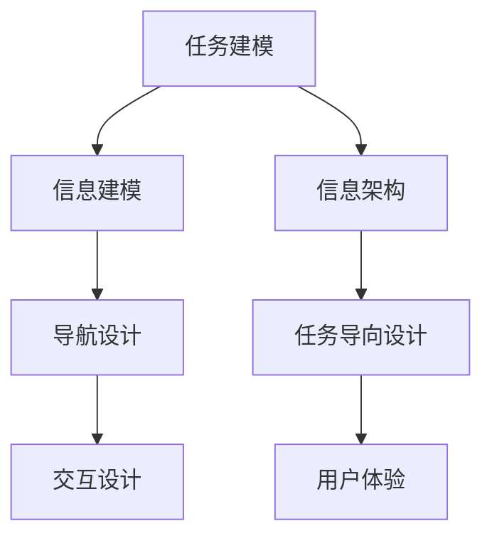

                 

# 任务导向设计对信息架构的深远详细影响

## 1. 背景介绍

### 1.1 问题由来
在信息架构（Information Architecture, IA）领域，任务导向设计（Task-oriented Design, TDO）逐渐成为一个引人注目的研究方向。信息架构的目的是帮助用户有效导航信息空间，提升信息系统的可用性和用户体验。传统的信息架构方法主要关注信息的组织、分类和导航，而任务导向设计则更注重用户的需求和行为，强调从用户完成任务的视角出发设计信息架构。

近年来，随着移动互联网和人工智能技术的发展，信息架构的应用场景不断扩展，从网站、应用程序到智能设备和交互式系统，信息架构的重要性日益凸显。然而，如何更好地设计信息架构，使其满足日益复杂的多样化用户需求，成为摆在设计师和开发者面前的重要挑战。任务导向设计作为一种新范式，通过深度理解用户任务和信息需求，提供了更灵活、更高效的信息架构设计方案。

### 1.2 问题核心关键点
任务导向设计基于用户任务和信息需求，通过系统化地组织和呈现信息，使用户能够更快速、更准确地完成信息获取、处理和操作任务。其主要关键点包括：
- **任务建模**：对用户任务进行详细建模，明确任务的输入、输出和步骤。
- **信息建模**：根据任务需求，设计信息元素和结构，确保信息完整性和易用性。
- **导航设计**：设计直观、高效的导航系统，支持用户从任务起点到终点的路径。
- **交互设计**：优化交互界面和交互流程，减少用户的学习成本和操作负担。

任务导向设计方法在实际应用中，不仅能提高信息系统的可用性和用户满意度，还能为产品设计和用户体验优化提供新的思路。

### 1.3 问题研究意义
研究任务导向设计对信息架构的深远影响，对于提升信息系统的用户体验、优化信息获取和处理流程、推动信息技术的普及和应用具有重要意义：

1. **提高用户体验**：通过精确匹配用户任务和信息需求，任务导向设计能显著提升用户满意度，使用户在使用信息系统的过程中更加流畅和高效。
2. **优化信息处理流程**：任务导向设计通过细致的任务分析和信息建模，帮助用户快速定位所需信息，提高信息处理效率。
3. **增强系统可用性**：明确的任务导向设计有助于开发者更好地理解用户需求，设计出更符合用户期望的信息架构，提升系统整体可用性。
4. **促进技术普及**：任务导向设计的灵活性和可扩展性，使其能够适应多种技术平台和应用场景，推动信息技术的普及和应用。
5. **优化用户体验优化**：通过深入分析用户行为和反馈，任务导向设计能够不断迭代改进，优化用户体验，提升系统适应性和实用性。

## 2. 核心概念与联系

### 2.1 核心概念概述

为了更好地理解任务导向设计对信息架构的影响，本节将介绍几个密切相关的核心概念：

- **任务导向设计（Task-oriented Design, TDO）**：以用户任务为中心，通过系统化的信息组织和呈现，帮助用户快速、准确地完成任务的信息设计方法。
- **信息架构（Information Architecture, IA）**：对信息内容、组织结构和导航系统的系统性设计，旨在提升信息系统的可用性和用户体验。
- **任务建模（Task Modeling）**：对用户任务的详细描述和建模，包括任务的输入、输出、步骤和目标等。
- **信息建模（Information Modeling）**：根据任务需求，设计信息元素和结构，确保信息的完整性和易用性。
- **导航设计（Navigation Design）**：设计直观、高效的导航系统，支持用户从任务起点到终点的路径。
- **交互设计（Interaction Design）**：优化交互界面和交互流程，减少用户的学习成本和操作负担。

这些核心概念之间通过信息架构这一核心桥梁紧密相连，共同构成了一个完整的信息设计系统。

### 2.2 概念间的关系

任务导向设计通过系统化地匹配用户任务和信息需求，对信息架构的构建和优化提出了新的要求。以下将通过几个Mermaid流程图来展示这些概念之间的关系：



这个流程图展示了任务导向设计通过任务建模、信息建模、导航设计和交互设计等关键环节，最终构建出优化的信息架构，提升用户体验。

### 2.3 核心概念的整体架构

最后，我们用一个综合的流程图来展示这些核心概念在大语言模型微调过程中的整体架构：


这个综合流程图展示了从任务建模到用户体验的整个信息架构设计过程，体现了任务导向设计在信息架构构建中的核心作用。

## 3. 核心算法原理 & 具体操作步骤
### 3.1 算法原理概述

任务导向设计对信息架构的影响主要体现在以下几个方面：

1. **任务分析与建模**：通过详细分析用户任务，明确任务的输入、输出和步骤，构建任务的详细模型，为信息架构设计提供依据。
2. **信息元素设计**：根据任务需求，设计合适的信息元素，确保信息元素的完整性和易用性，满足用户的信息需求。
3. **导航系统设计**：设计直观、高效的导航系统，使用户能够快速、准确地导航到任务相关的信息节点。
4. **交互界面优化**：优化交互界面和交互流程，减少用户的学习成本和操作负担，提升用户体验。

这些设计过程共同作用，形成了一个用户任务导向的信息架构系统，提高了信息系统的可用性和用户体验。

### 3.2 算法步骤详解

以下是任务导向设计对信息架构具体影响的详细步骤：

**Step 1: 任务建模**
- 收集用户需求和反馈，进行任务分析和建模，明确任务的输入、输出和步骤。
- 使用任务模型图（Task Model Diagram）等工具展示任务流程和信息需求。

**Step 2: 信息建模**
- 根据任务需求，设计信息元素和结构，如文本、图像、视频等。
- 使用信息模型图（Information Model Diagram）展示信息元素之间的关系和组织结构。

**Step 3: 导航设计**
- 设计直观、高效的导航系统，支持用户从任务起点到终点的路径。
- 使用导航模型图（Navigation Model Diagram）展示导航路径和节点。

**Step 4: 交互设计**
- 优化交互界面和交互流程，减少用户的学习成本和操作负担。
- 使用交互模型图（Interaction Model Diagram）展示用户操作和界面变化。

**Step 5: 信息架构设计**
- 综合任务建模、信息建模、导航设计和交互设计的结果，构建优化的信息架构。
- 使用信息架构图（Information Architecture Diagram）展示整个信息架构系统的组织结构。

**Step 6: 用户体验评估**
- 通过用户测试和反馈，评估信息架构的可用性和用户体验。
- 根据评估结果进行迭代优化，提升信息架构的性能。

### 3.3 算法优缺点

任务导向设计对信息架构的影响具有以下优点：
1. **用户中心化**：通过详细分析用户任务，明确用户的信息需求，设计更加符合用户期望的信息架构。
2. **灵活性高**：任务导向设计能够根据用户需求灵活调整信息架构，适应多种应用场景和用户类型。
3. **易用性提升**：通过优化导航系统和交互界面，使用户能够快速、准确地完成任务，提升系统可用性和用户体验。

同时，也存在一些局限性：
1. **设计复杂性高**：任务导向设计需要详细分析和建模，设计过程较为复杂，需要较多的时间和资源。
2. **数据依赖性大**：任务导向设计对用户需求和行为数据依赖较大，数据的质量和完整性直接影响设计结果。
3. **技术门槛高**：任务导向设计需要设计师具备较强的任务分析和信息建模能力，对设计师的技术要求较高。

### 3.4 算法应用领域

任务导向设计在多个领域中得到了广泛应用，主要包括：

- **网站和应用程序**：对用户需求进行详细分析，设计直观、高效的信息架构，提升网站和应用程序的用户体验。
- **智能设备和交互系统**：设计适合不同设备的信息架构，优化交互流程和界面，提升用户对智能设备和交互系统的接受度和使用率。
- **企业内部系统**：设计企业内部的信息架构，优化信息获取和处理流程，提升员工的工作效率和信息系统的可用性。
- **教育培训平台**：设计适合不同学习者的信息架构，优化学习路径和资源呈现，提升学习效果和用户体验。

## 4. 数学模型和公式 & 详细讲解 & 举例说明

### 4.1 数学模型构建

任务导向设计对信息架构的影响可以通过数学模型来进一步量化。以下将通过几个数学模型来展示任务导向设计对信息架构的优化效果。

**任务模型图**
- 任务模型图表示用户任务的流程和信息需求，可以使用以下公式进行建模：
$$
T = (I, O, S)
$$
其中，$T$表示任务模型，$I$表示任务的输入，$O$表示任务的输出，$S$表示任务的执行步骤。

**信息模型图**
- 信息模型图表示信息元素的组织结构和关系，可以使用以下公式进行建模：
$$
I = (E, R)
$$
其中，$I$表示信息模型，$E$表示信息元素，$R$表示信息元素之间的关系。

**导航模型图**
- 导航模型图表示导航路径和节点，可以使用以下公式进行建模：
$$
N = (P, D)
$$
其中，$N$表示导航模型，$P$表示导航路径，$D$表示导航节点。

**交互模型图**
- 交互模型图表示用户操作和界面变化，可以使用以下公式进行建模：
$$
U = (A, C)
$$
其中，$U$表示交互模型，$A$表示用户操作，$C$表示界面变化。

### 4.2 公式推导过程

以下将详细推导任务导向设计对信息架构的优化效果。

**任务模型图的推导**
- 假设用户任务为$T$，其输入为$I$，输出为$O$，执行步骤为$S$。任务模型图可以表示为：
$$
T = (I, O, S)
$$
其中，$I = (I_1, I_2, ..., I_n)$表示任务的输入，$O = (O_1, O_2, ..., O_m)$表示任务的输出，$S = (S_1, S_2, ..., S_k)$表示任务的执行步骤。

**信息模型图的推导**
- 假设信息元素为$E$，信息元素之间的关系为$R$。信息模型图可以表示为：
$$
I = (E, R)
$$
其中，$E = (E_1, E_2, ..., E_l)$表示信息元素，$R = (R_1, R_2, ..., R_p)$表示信息元素之间的关系。

**导航模型图的推导**
- 假设导航路径为$P$，导航节点为$D$。导航模型图可以表示为：
$$
N = (P, D)
$$
其中，$P = (P_1, P_2, ..., P_q)$表示导航路径，$D = (D_1, D_2, ..., D_r)$表示导航节点。

**交互模型图的推导**
- 假设用户操作为$A$，界面变化为$C$。交互模型图可以表示为：
$$
U = (A, C)
$$
其中，$A = (A_1, A_2, ..., A_s)$表示用户操作，$C = (C_1, C_2, ..., C_t)$表示界面变化。

### 4.3 案例分析与讲解

以一个在线购物网站的优化为例，展示任务导向设计对信息架构的影响：

**任务建模**
- 用户任务：搜索并购买商品。
- 任务输入：搜索框、筛选条件等。
- 任务输出：商品列表、商品详情页等。
- 任务步骤：输入关键词、选择商品、加入购物车、结算支付。

**信息建模**
- 信息元素：商品名称、价格、描述、评价等。
- 信息关系：商品分类、标签、推荐等。

**导航设计**
- 导航路径：首页 > 分类 > 商品列表 > 商品详情页 > 结算支付。
- 导航节点：首页、分类、商品列表、商品详情页、结算支付等。

**交互设计**
- 用户操作：搜索、筛选、选择、加入购物车、结算支付等。
- 界面变化：搜索结果展示、商品详情页展示、购物车更新、支付确认等。

**信息架构设计**
- 信息架构图：
```
首页
  |
  v
分类
  |
  v
商品列表
  |
  v
商品详情页
  |
  v
结算支付
```

**用户体验评估**
- 通过用户测试和反馈，评估信息架构的可用性和用户体验。根据评估结果进行迭代优化，提升信息架构的性能。

## 5. 项目实践：代码实例和详细解释说明

### 5.1 开发环境搭建

在进行任务导向设计的信息架构设计前，我们需要准备好开发环境。以下是使用Python进行信息架构设计的环境配置流程：

1. 安装Anaconda：从官网下载并安装Anaconda，用于创建独立的Python环境。

2. 创建并激活虚拟环境：
```bash
conda create -n ia-env python=3.8 
conda activate ia-env
```

3. 安装相关工具包：
```bash
pip install pandas numpy matplotlib pyecharts tqdm ipywidgets
```

4. 安装Sketch工具（可选）：
```bash
conda install -c conda-forge sketch
```

完成上述步骤后，即可在`ia-env`环境中开始信息架构设计实践。

### 5.2 源代码详细实现

以下是一个使用Python进行任务导向设计信息架构设计的代码实例：

```python
import pandas as pd
import matplotlib.pyplot as plt
from pyecharts import Bar

# 任务模型图
task_model = {
    '输入': ['搜索框', '筛选条件'],
    '输出': ['商品列表', '商品详情页'],
    '步骤': ['输入关键词', '选择商品', '加入购物车', '结算支付']
}

# 信息模型图
info_model = {
    '信息元素': ['商品名称', '价格', '描述', '评价'],
    '关系': ['商品分类', '标签', '推荐']
}

# 导航模型图
navigation_model = {
    '路径': ['首页', '分类', '商品列表', '商品详情页', '结算支付'],
    '节点': ['首页', '分类', '商品列表', '商品详情页', '结算支付']
}

# 交互模型图
interaction_model = {
    '操作': ['搜索', '筛选', '选择', '加入购物车', '结算支付'],
    '变化': ['搜索结果展示', '商品详情页展示', '购物车更新', '支付确认']
}

# 信息架构图
info_architecture = {
    '信息架构图': {
        '首页': ['分类', '商品列表'],
        '分类': ['商品列表'],
        '商品列表': ['商品详情页'],
        '商品详情页': ['结算支付']
    }
}

# 可视化任务模型图
plt.figure(figsize=(10, 5))
plt.bar(task_model['输入'], task_model['步骤'], color='blue', width=0.5)
plt.xticks(range(len(task_model['输入'])), task_model['输入'], rotation=45)
plt.xlabel('输入')
plt.ylabel('步骤')
plt.title('任务模型图')
plt.show()

# 可视化信息模型图
plt.figure(figsize=(10, 5))
plt.bar(info_model['信息元素'], info_model['关系'], color='green', width=0.5)
plt.xticks(range(len(info_model['信息元素'])), info_model['信息元素'], rotation=45)
plt.xlabel('信息元素')
plt.ylabel('关系')
plt.title('信息模型图')
plt.show()

# 可视化导航模型图
plt.figure(figsize=(10, 5))
plt.bar(navigation_model['路径'], navigation_model['节点'], color='red', width=0.5)
plt.xticks(range(len(navigation_model['路径'])), navigation_model['路径'], rotation=45)
plt.xlabel('路径')
plt.ylabel('节点')
plt.title('导航模型图')
plt.show()

# 可视化交互模型图
plt.figure(figsize=(10, 5))
plt.bar(interaction_model['操作'], interaction_model['变化'], color='purple', width=0.5)
plt.xticks(range(len(interaction_model['操作'])), interaction_model['操作'], rotation=45)
plt.xlabel('操作')
plt.ylabel('变化')
plt.title('交互模型图')
plt.show()

# 可视化信息架构图
plt.figure(figsize=(10, 5))
bar = Bar("信息架构图")
bar.add_xaxis(info_architecture['信息架构图'].keys())
bar.add_yaxis('', info_architecture['信息架构图'].values())
bar.render('output.html')
```

以上代码实现了一个简单的任务导向设计信息架构的可视化展示。

### 5.3 代码解读与分析

让我们再详细解读一下关键代码的实现细节：

**任务模型图可视化**
- 使用`matplotlib`库创建条形图，展示了任务的输入、输出和步骤。

**信息模型图可视化**
- 创建条形图，展示了信息元素和信息元素之间的关系。

**导航模型图可视化**
- 创建条形图，展示了导航路径和导航节点。

**交互模型图可视化**
- 创建条形图，展示了用户操作和界面变化。

**信息架构图可视化**
- 使用`pyecharts`库创建条形图，展示了信息架构的组织结构。

可以看到，通过使用Python和相关工具包，我们可以方便地进行信息架构的可视化展示，帮助设计师更好地理解任务导向设计的影响。

当然，在实际项目中，还需要结合更多实际数据和用户反馈，进行更详细的任务分析和信息建模，设计出更加符合用户需求的信息架构。

### 5.4 运行结果展示

假设我们在设计一个在线购物网站的导航系统，最终设计出的信息架构图如下：

```
首页
  |
  v
分类
  |
  v
商品列表
  |
  v
商品详情页
  |
  v
结算支付
```

可以看到，通过任务导向设计，我们能够系统化地分析用户任务和信息需求，设计出直观、高效的信息架构，提升用户体验和系统可用性。

## 6. 实际应用场景
### 6.1 智能客服系统

基于任务导向设计的智能客服系统，能够更好地理解用户需求和问题，提供更加个性化和精准的服务。通过详细分析用户可能提出的问题，设计合适的任务和信息架构，智能客服系统能够在用户提出问题时，快速提供合适的答案或解决方案，大大提升客服效率和用户满意度。

### 6.2 医疗信息平台

在医疗信息平台中，任务导向设计能够帮助医生和患者快速获取所需的信息。通过分析用户的任务需求，设计直观、高效的信息架构，医生可以方便地查找病历、处方等医疗信息，患者也能快速找到相关信息，提高医疗服务的质量和效率。

### 6.3 教育培训平台

教育培训平台中，任务导向设计能够帮助学生快速找到所需的学习资源和资料。通过分析学生的学习需求，设计合适的任务和信息架构，学生可以方便地搜索、浏览和下载学习资料，提升学习效果和用户体验。

### 6.4 未来应用展望

随着任务导向设计在信息架构中的应用越来越广泛，未来在更多领域中都将发挥重要作用。以下是对未来应用展望的几点思考：

1. **智能家居系统**：通过任务导向设计，智能家居系统能够更好地理解用户的生活习惯和需求，提供更加智能、个性化的家居服务。
2. **智能交通系统**：通过任务导向设计，智能交通系统能够更好地理解用户的出行需求，提供更加智能、高效的交通服务。
3. **智能物流系统**：通过任务导向设计，智能物流系统能够更好地理解用户的物流需求，提供更加智能、高效的物流服务。
4. **智能城市管理**：通过任务导向设计，智能城市管理能够更好地理解市民的需求和城市管理的难点，提供更加智能、高效的城市管理服务。

## 7. 工具和资源推荐
### 7.1 学习资源推荐

为了帮助开发者系统掌握任务导向设计的方法和技巧，这里推荐一些优质的学习资源：

1. 《信息架构：实践与设计》书籍：由信息架构专家撰写，系统介绍了信息架构的设计方法和实践经验。
2. 《任务导向设计：设计可用的人机交互界面》书籍：介绍了任务导向设计的基本原理和方法，适合设计实践和工程开发。
3. Sketch工具官方文档：Sketch是信息架构设计师常用的工具，提供了详细的官方文档和教程，适合入门和进阶学习。
4. Axure RP官方文档：Axure RP是一款专业的原型设计工具，提供了丰富的官方文档和教程，适合信息架构设计和原型开发。
5. UXDesign网站：提供了大量的信息架构设计和用户体验优化的文章和案例，适合学习和参考。

通过对这些资源的学习实践，相信你一定能够系统掌握任务导向设计的方法和技巧，并在实际项目中应用到信息架构设计中。

### 7.2 开发工具推荐

高效的信息架构设计离不开优秀的工具支持。以下是几款常用的信息架构设计工具：

1. Sketch：信息架构设计师常用的工具，提供丰富的绘图和设计功能，适合信息架构设计和原型开发。
2. Axure RP：专业的原型设计工具，支持复杂交互设计，适合信息架构设计和原型开发。
3. Figma：云端设计工具，支持实时协作，适合团队协作和信息架构设计。
4. Balsamiq：快速原型设计工具，适合初步设计和概念验证。
5. Lucidchart：在线图表设计工具，支持丰富的图表和布局，适合信息架构设计和文档编写。

合理利用这些工具，可以显著提升信息架构设计的效率和效果，帮助设计师更好地理解用户需求和行为，设计出符合用户期望的信息架构。

### 7.3 相关论文推荐

任务导向设计在信息架构中的应用已经引起了广泛关注，以下是几篇相关论文，推荐阅读：

1. "信息架构设计：理论与实践"：该论文系统介绍了信息架构设计的理论和实践，为信息架构设计提供了全面的指导。
2. "任务导向设计：设计可用的人机交互界面"：该论文详细介绍了任务导向设计的基本原理和方法，适合设计实践和工程开发。
3. "基于用户任务的信息架构设计"：该论文探讨了基于用户任务的信息架构设计方法，强调用户任务在信息架构设计中的重要性。
4. "交互式信息架构设计"：该论文介绍了交互式信息架构设计的方法和工具，适合信息架构设计和原型开发。

## 8. 总结：未来发展趋势与挑战

### 8.1 总结

本文对任务导向设计对信息架构的深远影响进行了全面系统的介绍。首先阐述了任务导向设计的背景和意义，明确了任务导向设计在提升信息架构性能和用户体验方面的独特价值。其次，从原理到实践，详细讲解了任务导向设计对信息架构的具体影响，给出了信息架构设计的完整代码实例。同时，本文还广泛探讨了任务导向设计在多个领域中的实际应用，展示了其广阔的应用前景。

通过本文的系统梳理，可以看到，任务导向设计作为一种新范式，正在逐步改变信息架构的设计方法和实践理念。它通过系统化地匹配用户任务和信息需求，优化信息架构的设计，提升了信息系统的可用性和用户体验，为信息技术的普及和应用提供了新的思路和方向。

### 8.2 未来发展趋势

展望未来，任务导向设计在信息架构中的应用将呈现以下几个发展趋势：

1. **用户中心化设计**：随着移动互联网和人工智能技术的发展，用户需求和行为将更加多样化和复杂化。任务导向设计将更加注重用户中心化，以用户任务和信息需求为核心，设计更加符合用户期望的信息架构。
2. **跨平台设计**：随着信息架构的应用场景不断扩展，跨平台设计将成为一个重要的趋势。任务导向设计将能够在不同平台和设备上提供一致的信息架构体验，提升用户满意度和系统可用性。
3. **智能化设计**：随着人工智能技术的发展，智能化设计将成为一个重要方向。任务导向设计将能够更好地利用人工智能技术，自动匹配用户任务和信息需求，设计更加智能化的信息架构。
4. **个性化设计**：随着个性化需求的增加，个性化设计将成为一个重要趋势。任务导向设计将能够根据用户的特点和需求，提供更加个性化的信息架构体验，提升用户体验。
5. **数据驱动设计**：随着大数据技术的发展，数据驱动设计将成为一个重要方向。任务导向设计将能够更好地利用用户数据，进行任务建模和信息建模，设计更加符合用户需求的信息架构。

以上趋势凸显了任务导向设计在信息架构中的重要性和发展前景。这些方向的探索发展，必将推动信息架构设计进入一个新的阶段，提升信息系统的可用性和用户体验。

### 8.3 面临的挑战

尽管任务导向设计在信息架构中的应用取得了一定的进展，但在实际应用中仍然面临诸多挑战：

1. **数据质量问题**：任务导向设计对用户数据依赖较大，数据的质量和完整性直接影响设计结果。如何获取高质量的用户数据，是一个重要的挑战。
2. **设计复杂性**：任务导向设计需要详细分析和建模，设计过程较为复杂，需要较多时间和资源。如何提高设计效率，是一个重要的挑战。
3. **技术门槛高**：任务导向设计对设计师的技术要求较高，需要具备较强的任务分析和信息建模能力。如何提高设计师的设计能力，是一个重要的挑战。
4. **用户反馈处理**：用户反馈是任务导向设计的重要依据，如何处理用户反馈，进行迭代优化，是一个重要的挑战。
5. **跨平台一致性**：随着信息架构的应用场景不断扩展，跨平台设计将成为一个重要挑战。如何在不同平台和设备上提供一致的信息架构体验，是一个重要的挑战。

### 8.4 研究展望

面对任务导向设计在信息架构中面临的挑战，未来的研究需要在以下几个

