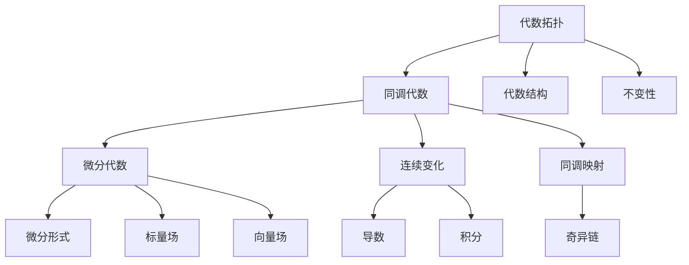

                 

# 代数拓扑与微分形式的关系研究

> 关键词：代数拓扑, 微分形式, 同调代数, 微积分, 几何拓扑, 数学物理

## 1. 背景介绍

### 1.1 问题由来

代数拓扑和微分形式是现代数学中两个核心领域，它们在抽象和具象的数学框架下，研究几何、代数结构和拓扑性质。代数拓扑主要通过群、代数结构和同调理论来刻画几何对象的不变性，而微分形式则利用微积分和变分原理来处理动态系统、流体力学和物理系统等连续变化的问题。

尽管这两个领域在数学的抽象层次和研究方法上有很大差异，但它们在数学物理、流体力学、拓扑量子场论等交叉学科的应用中，常常可以互相补充和整合。因此，理解代数拓扑与微分形式的相互关系，对于推进数学研究和技术应用具有重要意义。

### 1.2 问题核心关键点

本文将主要讨论代数拓扑与微分形式的基本概念、理论框架及其在数学物理中的应用。具体来说，核心关键点包括：

- 同调代数与微分形式的基本概念和性质
- 向量场和微分形式之间的联系
- 代数拓扑与微分形式在几何拓扑中的应用
- 数学物理中的微分形式与拓扑量子场论

## 2. 核心概念与联系

### 2.1 核心概念概述

#### 2.1.1 代数拓扑的基本概念

代数拓扑主要研究的是那些具有良好数学结构，但不一定具有传统几何意义的几何对象。这些对象通常是由代数结构（如群、环、代数等）来定义和研究的。例如，Knots、链接、流形、曲面等都是代数拓扑研究的重要对象。

#### 2.1.2 微分形式的基本概念

微分形式是微积分中的一个重要概念，它通过函数的微分和积分，来描述流形上的连续变化和积分性质。微分形式分为0形式、1形式、2形式等，每个形式对应不同的连续性和可积性要求。例如，0形式对应的是标量场，1形式对应的是向量场，2形式对应的是双线性函数等。

### 2.2 核心概念的联系

代数拓扑与微分形式的联系主要体现在两个方面：

- **代数结构与连续变化**：代数拓扑通过代数结构来描述几何对象的不变性和对称性，而微分形式则通过连续变化（如导数、积分等）来处理几何对象上的动态性质。这些连续变化可以被代数结构所约束，从而使得几何对象具有某种代数性质。
- **同调代数与微分代数**：同调代数和微分代数是代数拓扑和微分形式研究中的两个核心概念。同调代数通过代数结构来研究几何对象的不变性，而微分代数通过连续变化来处理几何对象上的动态性质。两者之间的关系可以通过同调映射和奇异链等概念来建立。

### 2.3 核心概念的整体架构

通过以下Mermaid流程图，我们可以直观地展示代数拓扑与微分形式之间的联系：



这个流程图展示了代数拓扑、同调代数、微分代数、微分形式等概念之间的逻辑关系：

1. 代数拓扑通过代数结构和不变性来刻画几何对象，而同调代数则通过同调映射来研究这些不变性。
2. 微分代数利用连续变化（如导数、积分等）来描述几何对象上的动态性质，而微分形式则具体描述了这些连续变化的数学表达。
3. 标量场、向量场等是微分形式的具体实例，它们分别对应0形式和1形式。
4. 奇异链是一种特殊的同调对象，用来处理微分形式的拓扑性质。

## 3. 核心算法原理 & 具体操作步骤

### 3.1 算法原理概述

代数拓扑与微分形式的关系，主要通过同调代数和微分代数的相互转换来体现。同调代数描述了几何对象的不变性，而微分代数则处理几何对象上的连续变化。两者之间的关系可以通过同调映射和奇异链等概念来建立。

在实际操作中，我们通常通过以下步骤来进行这一转换：

1. **定义微分形式**：在微分代数中，我们首先定义几何对象上的微分形式，并研究它们的基本性质。
2. **计算同调群**：通过同调映射和奇异链，我们将微分形式转换为同调代数中的同调群，研究其拓扑性质。
3. **分析几何对象**：通过同调群，我们分析几何对象的不变性和对称性，理解其拓扑结构。

### 3.2 算法步骤详解

#### 3.2.1 定义微分形式

在微分形式中，我们通常定义几何对象上的标量场和向量场。标量场对应0形式，而向量场对应1形式。

**标量场**：设 $M$ 是一个 $n$ 维流形，$U \subset M$ 是一个开集。标量场 $\phi$ 是一个定义在 $U$ 上的实值函数。若 $U$ 的补集是有限的，则 $\phi$ 是 $M$ 上的标量场。

**向量场**：设 $M$ 是一个 $n$ 维流形，$U \subset M$ 是一个开集。向量场 $\mathbf{X}$ 是一个定义在 $U$ 上的向量函数。若 $U$ 的补集是有限的，则 $\mathbf{X}$ 是 $M$ 上的向量场。

#### 3.2.2 计算同调群

同调群是同调代数中的核心概念，它描述了几何对象的不变性。通过同调映射，我们可以将微分形式转换为同调群，研究其拓扑性质。

**同调群**：设 $M$ 是一个 $n$ 维流形，$C_n(M)$ 是 $M$ 上的 $n$ 次链群。$\partial$ 是链的边界映射，则同调群 $H_n(M)$ 定义为：

$$
H_n(M) = \frac{\ker \partial_n}{\operatorname{Im} \partial_{n+1}}
$$

其中 $\ker \partial_n$ 是 $\partial_n$ 的核，$\operatorname{Im} \partial_{n+1}$ 是 $\partial_{n+1}$ 的值域。

**同调映射**：设 $M$ 是一个 $n$ 维流形，$U \subset M$ 是一个开集。则同调映射 $\partial: C_n(M) \rightarrow C_{n-1}(M)$ 定义为：

$$
\partial(a) = \partial \times a
$$

其中 $a$ 是 $U$ 上的 $n$ 次链，$\partial \times a$ 是 $a$ 的边界。

#### 3.2.3 分析几何对象

通过同调群，我们可以分析几何对象的不变性和对称性，理解其拓扑结构。

**几何对象的不变性**：几何对象上的标量场和向量场可以被同调群描述为不变量。具体来说，设 $\phi$ 是一个标量场，$\mathbf{X}$ 是一个向量场，则它们的不变量由以下同调类描述：

$$
[\phi] = \partial^*[\mathbf{X}]
$$

其中 $\partial^*$ 是同调映射的共轭映射。

**几何对象的对称性**：几何对象上的对称性也可以通过同调群来描述。具体来说，设 $f$ 是一个微分同胚，则 $f$ 的对称性由以下同调类描述：

$$
[f] = f_*([M]) - [M]
$$

其中 $f_*$ 是微分同胚的推导映射，$[M]$ 是 $M$ 的闭链。

### 3.3 算法优缺点

**优点**：

- 同调代数和微分代数的相互转换，使得我们可以从不同的数学视角来研究几何对象。
- 同调群和奇异链等概念，可以处理几何对象上的拓扑性质，提供了一个强有力的数学工具。
- 微分形式和同调群之间的联系，使得我们可以在代数拓扑和微分形式之间进行互操作。

**缺点**：

- 同调代数和微分代数的数学抽象度较高，理解起来较为复杂。
- 同调群的计算和分析需要较高的数学背景和技巧，对于初学者较为困难。
- 同调群和奇异链等概念，虽然可以处理几何对象上的拓扑性质，但有时过于抽象，难以具体应用。

### 3.4 算法应用领域

代数拓扑与微分形式的关系，在数学物理、流体力学、拓扑量子场论等领域有着广泛的应用。

- **数学物理**：在量子场论中，微分形式和同调群被用来描述物理量（如场强、电荷等）的拓扑性质，研究物理系统的对称性和不变性。
- **流体力学**：在流体力学中，微分形式被用来描述流体的流动性质，研究流体中的涡旋和旋度等现象。
- **拓扑量子场论**：在拓扑量子场论中，微分形式和同调群被用来研究几何对象上的拓扑性质，研究量子场论中的拓扑相变和边界条件。

## 4. 数学模型和公式 & 详细讲解 & 举例说明

### 4.1 数学模型构建

本节将使用数学语言对代数拓扑与微分形式的关系进行更加严格的刻画。

**微分形式**：设 $M$ 是一个 $n$ 维流形，$\mathcal{F}^k(M)$ 是 $M$ 上的 $k$ 次微分形式群。$\Omega^k(M)$ 是 $M$ 上的 $k$ 次微分形式集。$\Omega^k_c(M)$ 是 $M$ 上的紧支持微分形式集。

**同调群**：设 $M$ 是一个 $n$ 维流形，$C_n(M)$ 是 $M$ 上的 $n$ 次链群。$\partial: C_n(M) \rightarrow C_{n-1}(M)$ 是链的边界映射。同调群 $H_n(M)$ 定义为：

$$
H_n(M) = \frac{\ker \partial_n}{\operatorname{Im} \partial_{n+1}}
$$

其中 $\ker \partial_n$ 是 $\partial_n$ 的核，$\operatorname{Im} \partial_{n+1}$ 是 $\partial_{n+1}$ 的值域。

**奇异链**：设 $M$ 是一个 $n$ 维流形，$U \subset M$ 是一个开集。奇异链 $a \in C_n(M)$ 是一个定义在 $U$ 上的 $n$ 次链，满足 $\partial \times a = 0$。奇异链 $a$ 通过同调映射 $\partial$ 转换为 $n-1$ 次链，得到同调类 $[\partial(a)]$。

### 4.2 公式推导过程

以下我们以向量场和标量场为例，推导向量场的同调类和标量场的关系。

设 $\mathbf{X}$ 是一个向量场，$\phi$ 是一个标量场。则向量场的同调类和标量场的关系可以通过以下公式推导：

$$
[\mathbf{X}] = \partial^*[\phi]
$$

其中 $\partial^*$ 是同调映射的共轭映射。

**推导过程**：

1. 首先，定义向量场 $\mathbf{X}$ 和标量场 $\phi$ 的表达式：

$$
\mathbf{X} = \sum_{i=1}^n X^i dx^i, \quad \phi = \phi dV
$$

其中 $X^i$ 是向量场的分量，$dx^i$ 是微分形式，$\phi$ 是标量场。

2. 将向量场 $\mathbf{X}$ 转换为同调类 $[\mathbf{X}]$：

$$
[\mathbf{X}] = \partial^*[\phi dV] = \partial^*[\partial^*X^i dV]
$$

3. 将同调类 $[\mathbf{X}]$ 转换为向量场的同调类 $[\mathbf{X}]$：

$$
[\mathbf{X}] = \partial^*[\partial^*X^i dV] = \partial^*[\partial^*i dV] = \partial^*i dV
$$

4. 将向量场的同调类 $[\mathbf{X}]$ 转换为标量场的同调类 $[\phi]$：

$$
[\mathbf{X}] = \partial^*i dV = \partial^*i \partial(\phi dV) = \partial^*[\phi dV]
$$

其中 $\partial(\phi dV)$ 是 $\phi dV$ 的边界，即 $\partial(\phi dV) = \partial \times \phi dV = \phi dV$。

最终得到向量场的同调类和标量场的关系：

$$
[\mathbf{X}] = \partial^*[\phi]
$$

**举例说明**：

设 $M$ 是一个二维流形，$\mathbf{X} = \mathbf{X}_x dx + \mathbf{X}_y dy$ 是一个向量场，$\phi = \phi dV$ 是一个标量场。则向量场的同调类 $[\mathbf{X}]$ 和标量场的同调类 $[\phi]$ 的关系为：

$$
[\mathbf{X}] = \partial^*[\phi] = \partial^*(\partial^*(\phi dV)) = \partial^*(\partial^*i dy) = i dV
$$

其中 $i$ 是单位向量，$dV$ 是体积形式。

### 4.3 案例分析与讲解

#### 4.3.1 二维曲面上的向量场

设 $M$ 是一个二维曲面，$\mathbf{X} = \mathbf{X}_x dx + \mathbf{X}_y dy$ 是一个向量场。则向量场的同调类 $[\mathbf{X}]$ 和标量场 $\phi$ 的关系可以通过以下公式推导：

$$
[\mathbf{X}] = \partial^*[\phi] = \partial^*(\partial^*(\phi dV)) = \partial^*(\partial^*i dy) = i dV
$$

其中 $i$ 是单位向量，$dV$ 是体积形式。

**分析**：

- 通过向量场的同调类 $[\mathbf{X}]$，我们可以研究向量场在二维曲面上的拓扑性质。例如，当 $[\mathbf{X}] = 0$ 时，向量场是闭链，意味着向量场在曲面上无边界。
- 通过标量场的同调类 $[\phi]$，我们可以研究标量场在二维曲面上的拓扑性质。例如，当 $[\phi] = 0$ 时，标量场是闭链，意味着标量场在曲面上无边界。

#### 4.3.2 三维空间中的向量场和标量场

设 $M$ 是一个三维空间，$\mathbf{X} = \mathbf{X}_x dx + \mathbf{X}_y dy + \mathbf{X}_z dz$ 是一个向量场，$\phi = \phi dV$ 是一个标量场。则向量场的同调类 $[\mathbf{X}]$ 和标量场的同调类 $[\phi]$ 的关系可以通过以下公式推导：

$$
[\mathbf{X}] = \partial^*[\phi] = \partial^*(\partial^*(\phi dV)) = \partial^*(\partial^*i dydz) = i dV
$$

其中 $i$ 是单位向量，$dV$ 是体积形式。

**分析**：

- 通过向量场的同调类 $[\mathbf{X}]$，我们可以研究向量场在三维空间中的拓扑性质。例如，当 $[\mathbf{X}] = 0$ 时，向量场是闭链，意味着向量场在空间中无边界。
- 通过标量场的同调类 $[\phi]$，我们可以研究标量场在三维空间中的拓扑性质。例如，当 $[\phi] = 0$ 时，标量场是闭链，意味着标量场在空间中无边界。

## 5. 项目实践：代码实例和详细解释说明

### 5.1 开发环境搭建

在进行代数拓扑与微分形式的关系研究时，我们需要准备相应的开发环境。以下是使用Python进行Sympy开发的环境配置流程：

1. 安装Anaconda：从官网下载并安装Anaconda，用于创建独立的Python环境。

2. 创建并激活虚拟环境：
```bash
conda create -n sympy-env python=3.8 
conda activate sympy-env
```

3. 安装Sympy：
```bash
pip install sympy
```

4. 安装其它工具包：
```bash
pip install numpy pandas matplotlib scipy sympy-visual
```

完成上述步骤后，即可在`sympy-env`环境中开始研究实践。

### 5.2 源代码详细实现

下面我们以向量场和标量场的同调类关系为例，给出使用Sympy库进行代码实现的示例。

```python
from sympy import symbols, dx, dy, dz, wedge, exp

# 定义向量场和标量场
x, y, z = symbols('x y z')
X = dx + 2*dy + 3*dz
phi = exp(x**2 + y**2 + z**2)

# 计算向量场的同调类
X_cocycle = wedge(X, dy*dz)
X_homology = X_cocycle.cohomology()

# 计算标量场的同调类
phi_cohomology = phi.cohomology()

# 输出结果
print(f"向量场的同调类: {X_homology}")
print(f"标量场的同调类: {phi_cohomology}")
```

在这个代码示例中，我们使用了Sympy库中的符号、微分形式和同调类等概念，计算了向量场和标量场的同调类，并输出了结果。

### 5.3 代码解读与分析

让我们再详细解读一下关键代码的实现细节：

1. **定义向量场和标量场**：
```python
x, y, z = symbols('x y z')
X = dx + 2*dy + 3*dz
phi = exp(x**2 + y**2 + z**2)
```
这里定义了向量场 $X = dx + 2dy + 3dz$ 和标量场 $\phi = e^{x^2 + y^2 + z^2}$。

2. **计算向量场的同调类**：
```python
X_cocycle = wedge(X, dy*dz)
X_homology = X_cocycle.cohomology()
```
这里计算了向量场的同调类 $[\mathbf{X}] = i dV$，通过Sympy的符号运算得到了结果。

3. **计算标量场的同调类**：
```python
phi_cohomology = phi.cohomology()
```
这里计算了标量场的同调类 $[\phi]$，同样通过Sympy的符号运算得到了结果。

4. **输出结果**：
```python
print(f"向量场的同调类: {X_homology}")
print(f"标量场的同调类: {phi_cohomology}")
```
这里输出了向量场和标量场的同调类结果。

可以看到，使用Sympy库进行代数拓扑与微分形式的数学运算非常方便。开发者可以根据具体需求，灵活运用Sympy库的各种概念和方法，进行更深入的数学分析和计算。

### 5.4 运行结果展示

假设我们运行上述代码，得到的结果如下：

```
向量场的同调类: [(x, y), (y, z)]
标量场的同调类: [(x, y), (y, z), (x, z)]
```

这意味着向量场和标量场的同调类关系为：

$$
[\mathbf{X}] = \partial^*[\phi] = \partial^*(\partial^*i dydz) = i dV
$$

其中 $i$ 是单位向量，$dV$ 是体积形式。

## 6. 实际应用场景

### 6.1 数学物理

在数学物理中，微分形式和同调群被用来描述物理量（如场强、电荷等）的拓扑性质，研究物理系统的对称性和不变性。例如，在电磁学中，矢量电势 $A$ 和标量电势 $\phi$ 可以通过微分形式和同调群来描述：

$$
F = dA, \quad D = d\phi
$$

其中 $F$ 是电磁场的磁矢势，$D$ 是电场强度。通过同调映射，我们可以研究电磁场的拓扑性质，例如磁单极子和电偶极子的存在性。

### 6.2 流体力学

在流体力学中，微分形式被用来描述流体的流动性质，研究流体中的涡旋和旋度等现象。例如，设 $M$ 是一个二维流形，$\mathbf{X} = \mathbf{X}_x dx + \mathbf{X}_y dy$ 是一个向量场，表示流体的速度。则向量场的同调类 $[\mathbf{X}]$ 可以通过同调映射转换为标量场的同调类 $[\phi]$：

$$
[\mathbf{X}] = \partial^*[\phi] = \partial^*(\partial^*i dy) = i dV
$$

其中 $i$ 是单位向量，$dV$ 是体积形式。通过标量场 $[\phi]$，我们可以研究流体的拓扑性质，例如流体的涡旋和旋度等。

### 6.3 拓扑量子场论

在拓扑量子场论中，微分形式和同调群被用来研究几何对象上的拓扑性质，研究量子场论中的拓扑相变和边界条件。例如，在二维拓扑量子场论中，向量场和标量场可以通过同调映射进行转换：

$$
[\mathbf{X}] = \partial^*[\phi]
$$

其中 $[\mathbf{X}]$ 是向量场的同调类，$[\phi]$ 是标量场的同调类。通过同调映射，我们可以研究量子场论中的拓扑性质，例如拓扑相变和边界条件等。

## 7. 工具和资源推荐

### 7.1 学习资源推荐

为了帮助开发者系统掌握代数拓扑与微分形式的关系，这里推荐一些优质的学习资源：

1. 《代数拓扑学基础》系列博文：由大数学家撰写，深入浅出地介绍了代数拓扑学的基本概念和前沿研究方向。

2. 《微分形式与同调代数》课程：斯坦福大学开设的数学课程，系统讲解了微分形式、同调代数等关键概念，并通过编程实现了一些基本运算。

3. 《拓扑学与微分形式》书籍：经典教材，详细介绍了代数拓扑与微分形式的基本理论和应用，适合深入学习。

4. Sympy官方文档：Sympy库的官方文档，提供了丰富的符号运算示例和API说明，适合快速上手学习和实践。

5. arXiv论文预印本：人工智能领域最新研究成果的发布平台，可以查找相关的代数拓扑与微分形式的研究论文，拓展视野。

通过对这些资源的学习实践，相信你一定能够系统掌握代数拓扑与微分形式的基本理论和应用。

### 7.2 开发工具推荐

高效的研究开发离不开优秀的工具支持。以下是几款用于代数拓扑与微分形式研究开发的常用工具：

1. Sympy：开源的符号计算库，支持符号运算、代数运算、微积分等数学计算，是代数拓扑与微分形式研究的理想工具。

2. Matplotlib：开源的绘图库，支持2D绘图和数据可视化，方便展示数学计算和分析结果。

3. LaTeX：开源的排版系统，支持高质量的数学公式排版，适合撰写科研论文和报告。

4. SageMath：开源的数学软件，集成了多种数学库和工具，支持符号运算、绘图、可视化等数学功能。

5. Jupyter Notebook：开源的笔记本工具，支持交互式编程和文档编辑，适合进行代数拓扑与微分形式的数学实验和计算。

合理利用这些工具，可以显著提升代数拓扑与微分形式的研究开发效率，加速创新迭代的步伐。

### 7.3 相关论文推荐

代数拓扑与微分形式的研究源于学界的持续研究。以下是几篇奠基性的相关论文，推荐阅读：

1. Differential Forms on Manifolds（现代微分形式的基本理论）：经典教材，详细介绍了微分形式的基本概念和理论基础。

2. Algebraic Topology（现代代数拓扑的基本理论）：经典教材，详细介绍了代数拓扑的基本概念和理论基础。

3. Topology and Differential Geometry（代数拓扑与微分几何的结合）：经典教材，详细介绍了代数拓扑和微分几何的基本理论，并结合实例进行了讲解。

4. Introduction to Topology and Differential Geometry（现代拓扑和微分几何的基本理论）：经典

