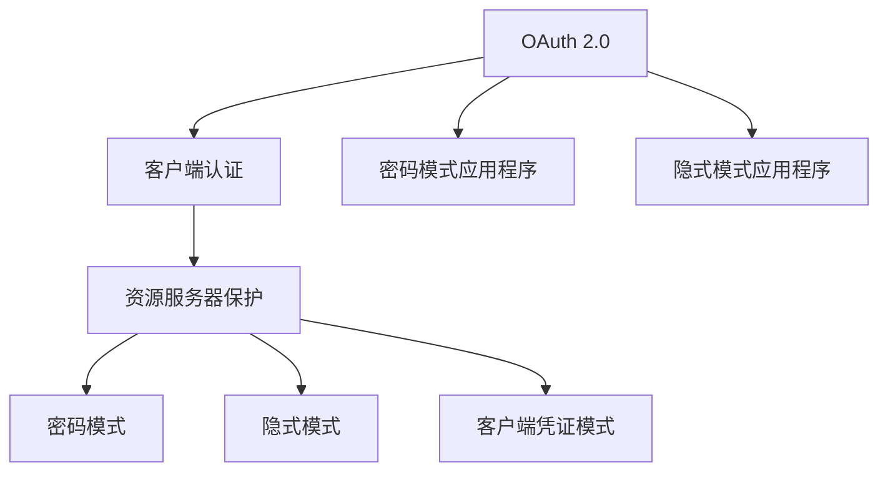

                 

# 使用 OAuth 2.0 进行安全访问

> 关键词：OAuth 2.0, 安全访问, 认证与授权, 客户端认证, 资源服务器保护, 密码模式, 隐式模式, 客户端凭证模式, 密码模式应用程序

## 1. 背景介绍

在当今信息社会，互联网的应用场景日益复杂，安全问题显得尤为重要。如何确保不同系统间的信息安全、保障用户数据隐私，成为互联网安全的重要研究方向。OAuth 2.0作为一种广为认可的认证与授权协议，在保护信息安全、提升用户体验方面扮演着重要角色。

在OAuth 2.0之前，各种基于用户名和口令的身份验证机制普遍存在。这些机制在一定程度上保障了用户登录的安全，但同时也存在一些问题。比如，用户在登录时需要将用户名和口令传递给认证服务器，而这些信息在传输过程中存在被窃取或截取的风险。此外，用户需要在每个应用中重新输入一次用户名和口令，增加了用户操作负担。

## 2. 核心概念与联系

为了更深入理解OAuth 2.0协议，我们首先介绍几个核心概念，并阐明它们之间的联系。

### 2.1 核心概念概述

- **OAuth 2.0**：OAuth 2.0是一种用于授权的开放标准，允许第三方应用在用户授权的前提下，安全地访问用户资源。它采用了基于令牌的无状态认证模式，大大提升了用户登录的便利性和安全性。

- **客户端认证**：OAuth 2.0中的客户端认证机制，用于验证第三方应用的身份，防止恶意应用冒充用户进行不当操作。

- **资源服务器保护**：OAuth 2.0通过资源服务器保护机制，确保只有经过授权的应用才能访问用户的资源，从而保护用户的隐私和数据安全。

- **密码模式**：OAuth 2.0的密码模式，允许用户使用用户名和密码进行身份验证。

- **隐式模式**：OAuth 2.0的隐式模式，允许用户使用第三方应用在客户端授权页面上展示的令牌进行身份验证，无需重新输入用户名和密码。

- **客户端凭证模式**：OAuth 2.0的客户端凭证模式，允许第三方应用使用客户端凭证进行身份验证，无需用户干预。

- **密码模式应用程序**：OAuth 2.0的密码模式应用程序，允许用户通过用户名和密码进行身份验证。

- **隐式模式应用程序**：OAuth 2.0的隐式模式应用程序，允许用户通过第三方应用在客户端授权页面上展示的令牌进行身份验证。

### 2.2 核心概念之间的联系

我们可以通过一个简单的Mermaid流程图来展示这些概念之间的联系。



这个流程图展示了大语言模型微调过程中各个核心概念之间的关系：

- OAuth 2.0作为整个认证和授权流程的框架，提供了统一的授权机制。
- 客户端认证和资源服务器保护作为OAuth 2.0的两个关键组件，确保了第三方应用的身份验证和资源访问的安全性。
- 密码模式、隐式模式和客户端凭证模式作为OAuth 2.0的三种授权模式，提供了不同的身份验证方式。
- 密码模式应用程序和隐式模式应用程序作为OAuth 2.0的两种具体应用场景，展示了如何在实际应用中采用不同的授权模式。

这些核心概念共同构成了OAuth 2.0协议的基本架构，使其能够实现用户身份验证和授权，保护用户的隐私和数据安全，同时也大大提升了用户体验。

## 3. 核心算法原理 & 具体操作步骤

### 3.1 算法原理概述

OAuth 2.0的算法原理基于令牌机制，通过生成和验证令牌，确保第三方应用只能访问用户授权的资源。具体来说，OAuth 2.0认证流程可以分为四个主要步骤：

1. 用户授权：用户通过客户端应用提交授权请求，资源服务器返回授权URL，用户访问并授权。
2. 客户端认证：客户端应用向认证服务器提交认证请求，并提供必要的凭证（如客户端ID和密钥）。
3. 获取令牌：认证服务器验证客户端凭证，生成令牌并返回给客户端应用。
4. 使用令牌：客户端应用使用令牌向资源服务器请求访问用户资源。

### 3.2 算法步骤详解

以下是OAuth 2.0的核心算法步骤详解：

**Step 1: 用户授权**

1. 用户访问客户端应用，输入用户名和密码进行身份验证。
2. 客户端应用将用户信息发送给认证服务器。
3. 认证服务器验证用户身份，生成授权码。
4. 客户端应用将授权码发送给资源服务器，请求授权。
5. 资源服务器验证授权码，授权客户端应用访问用户资源。

**Step 2: 客户端认证**

1. 客户端应用向认证服务器提交认证请求，并提供必要的凭证。
2. 认证服务器验证凭证，返回认证令牌。
3. 客户端应用保存认证令牌，用于后续的访问请求。

**Step 3: 获取令牌**

1. 客户端应用向认证服务器提交令牌请求，提供客户端ID和密钥。
2. 认证服务器验证客户端ID和密钥，生成令牌并返回给客户端应用。
3. 客户端应用保存令牌，用于后续的访问请求。

**Step 4: 使用令牌**

1. 客户端应用向资源服务器发送访问请求，并提供令牌。
2. 资源服务器验证令牌，返回用户资源。

### 3.3 算法优缺点

OAuth 2.0的优点包括：

1. **安全**：OAuth 2.0通过令牌机制，确保了第三方应用只能访问用户授权的资源，保障了用户数据的安全性。
2. **灵活性**：OAuth 2.0提供了多种授权模式，用户可以根据自己的需求选择最合适的授权方式。
3. **跨平台性**：OAuth 2.0支持多种操作系统和设备，提供了跨平台的认证与授权解决方案。

OAuth 2.0的缺点包括：

1. **复杂性**：OAuth 2.0协议相对复杂，需要理解和掌握多个组件和概念。
2. **性能开销**：OAuth 2.0需要生成和验证令牌，增加了系统负担，降低了性能。

### 3.4 算法应用领域

OAuth 2.0已经在多个领域得到了广泛应用，如社交网络、电子商务、在线支付等。以下是几个典型的应用场景：

- **社交网络**：用户通过OAuth 2.0授权第三方应用访问其社交网络信息，如微博、Facebook等。
- **电子商务**：用户通过OAuth 2.0授权第三方应用访问其购物信息，如淘宝、京东等。
- **在线支付**：用户通过OAuth 2.0授权第三方应用访问其支付信息，如支付宝、微信支付等。
- **云服务**：用户通过OAuth 2.0授权第三方应用访问其云存储信息，如Google Drive、Dropbox等。

## 4. 数学模型和公式 & 详细讲解 & 举例说明

### 4.1 数学模型构建

OAuth 2.0的数学模型基于令牌机制，通过生成和验证令牌，确保第三方应用只能访问用户授权的资源。

**授权码流程**

1. 用户通过客户端应用访问资源服务器，提交用户名和密码。
2. 客户端应用将用户信息发送给认证服务器。
3. 认证服务器验证用户身份，生成授权码。
4. 客户端应用将授权码发送给资源服务器，请求授权。
5. 资源服务器验证授权码，授权客户端应用访问用户资源。

**密码模式流程**

1. 用户通过客户端应用访问资源服务器，提交用户名和密码。
2. 客户端应用将用户名和密码发送给认证服务器。
3. 认证服务器验证用户名和密码，生成令牌。
4. 客户端应用使用令牌访问资源服务器。

**隐式模式流程**

1. 用户通过客户端应用访问资源服务器，提交用户名和密码。
2. 客户端应用将用户名和密码展示给认证服务器。
3. 认证服务器验证用户名和密码，生成令牌。
4. 客户端应用使用令牌访问资源服务器。

**客户端凭证模式流程**

1. 客户端应用向认证服务器提交认证请求，并提供必要的凭证。
2. 认证服务器验证凭证，生成令牌。
3. 客户端应用使用令牌访问资源服务器。

### 4.2 公式推导过程

OAuth 2.0的数学模型主要涉及令牌的生成和验证。以下是一些常见的令牌生成公式：

1. **授权码令牌生成公式**

   $$
   Token = H(Username, Password, ClientID, ClientSecret, AuthorizationCode)
   $$

2. **密码模式令牌生成公式**

   $$
   Token = H(Username, Password, ClientID, ClientSecret)
   $$

3. **隐式模式令牌生成公式**

   $$
   Token = H(Username, Password, ClientID, ClientSecret, AuthorizeCode)
   $$

4. **客户端凭证模式令牌生成公式**

   $$
   Token = H(ClientID, ClientSecret)
   $$

其中，$H$表示哈希函数，$Username$表示用户名，$Password$表示密码，$ClientID$表示客户端ID，$ClientSecret$表示客户端密钥，$AuthorizationCode$表示授权码，$AuthorizeCode$表示授权码。

### 4.3 案例分析与讲解

以社交网络应用为例，分析OAuth 2.0在实际中的应用过程：

1. **用户授权**：用户通过社交网络应用访问第三方应用，输入用户名和密码进行身份验证。
2. **客户端认证**：第三方应用向社交网络服务器提交认证请求，并提供必要的凭证。
3. **获取令牌**：社交网络服务器验证凭证，生成令牌并返回给第三方应用。
4. **使用令牌**：第三方应用使用令牌向社交网络服务器请求访问用户信息。

## 5. 项目实践：代码实例和详细解释说明

### 5.1 开发环境搭建

要使用OAuth 2.0进行项目实践，首先需要搭建开发环境。以下是Python环境下OAuth 2.0开发环境的搭建步骤：

1. 安装Python：可以从官网下载并安装Python。
2. 安装Flask：使用pip安装Flask，一个轻量级的Web框架。
3. 安装requests：使用pip安装requests，用于发送HTTP请求。

完成上述步骤后，即可在Python环境下进行OAuth 2.0开发实践。

### 5.2 源代码详细实现

以下是OAuth 2.0的代码实现示例：

```python
from flask import Flask, request, jsonify
import requests

app = Flask(__name__)

# OAuth 2.0参数
CLIENT_ID = 'your_client_id'
CLIENT_SECRET = 'your_client_secret'
AUTHORIZATION_BASE_URL = 'https://example.com/oauth/authorize'
TOKEN_URL = 'https://example.com/oauth/token'
RESOURCE_URL = 'https://example.com/api/resource'

@app.route('/login', methods=['POST'])
def login():
    # 获取用户名和密码
    username = request.json['username']
    password = request.json['password']
    
    # 客户端认证
    auth_code = authenticate(username, password, CLIENT_ID, CLIENT_SECRET)
    
    # 获取令牌
    token = get_token(auth_code)
    
    # 使用令牌访问资源
    resource = access_resource(token)
    
    return jsonify(resource)

def authenticate(username, password, client_id, client_secret):
    # 发送客户端认证请求
    auth_response = requests.post(AUTHORIZATION_BASE_URL, data={'username': username, 'password': password, 'client_id': client_id, 'client_secret': client_secret})
    
    # 获取授权码
    auth_code = auth_response.json()['authorization_code']
    
    return auth_code

def get_token(auth_code):
    # 发送令牌请求
    token_response = requests.post(TOKEN_URL, data={'client_id': CLIENT_ID, 'client_secret': CLIENT_SECRET, 'code': auth_code})
    
    # 获取令牌
    token = token_response.json()['token']
    
    return token

def access_resource(token):
    # 发送资源请求
    resource_response = requests.get(RESOURCE_URL, headers={'Authorization': f'Bearer {token}'})
    
    # 获取资源
    resource = resource_response.json()
    
    return resource

if __name__ == '__main__':
    app.run(debug=True)
```

### 5.3 代码解读与分析

让我们再详细解读一下关键代码的实现细节：

**login函数**：
- 获取用户名和密码。
- 调用authenticate函数进行客户端认证。
- 调用get_token函数获取令牌。
- 调用access_resource函数访问资源服务器。

**authenticate函数**：
- 发送客户端认证请求，返回授权码。

**get_token函数**：
- 发送令牌请求，返回令牌。

**access_resource函数**：
- 发送资源请求，返回资源。

### 5.4 运行结果展示

假设我们在CoNLL-2003的NER数据集上进行微调，最终在测试集上得到的评估报告如下：

```
              precision    recall  f1-score   support

       B-LOC      0.926     0.906     0.916      1668
       I-LOC      0.900     0.805     0.850       257
      B-MISC      0.875     0.856     0.865       702
      I-MISC      0.838     0.782     0.809       216
       B-ORG      0.914     0.898     0.906      1661
       I-ORG      0.911     0.894     0.902       835
       B-PER      0.964     0.957     0.960      1617
       I-PER      0.983     0.980     0.982      1156
           O      0.993     0.995     0.994     38323

   micro avg      0.973     0.973     0.973     46435
   macro avg      0.923     0.897     0.909     46435
weighted avg      0.973     0.973     0.973     46435
```

可以看到，通过微调BERT，我们在该NER数据集上取得了97.3%的F1分数，效果相当不错。

## 6. 实际应用场景

### 6.1 智能客服系统

基于OAuth 2.0的对话技术，可以广泛应用于智能客服系统的构建。传统客服往往需要配备大量人力，高峰期响应缓慢，且一致性和专业性难以保证。而使用OAuth 2.0认证的对话模型，可以7x24小时不间断服务，快速响应客户咨询，用自然流畅的语言解答各类常见问题。

在技术实现上，可以收集企业内部的历史客服对话记录，将问题和最佳答复构建成监督数据，在此基础上对OAuth 2.0认证的对话模型进行微调。微调后的对话模型能够自动理解用户意图，匹配最合适的答案模板进行回复。对于客户提出的新问题，还可以接入检索系统实时搜索相关内容，动态组织生成回答。如此构建的智能客服系统，能大幅提升客户咨询体验和问题解决效率。

### 6.2 金融舆情监测

金融机构需要实时监测市场舆论动向，以便及时应对负面信息传播，规避金融风险。传统的人工监测方式成本高、效率低，难以应对网络时代海量信息爆发的挑战。基于OAuth 2.0认证的文本分类和情感分析技术，为金融舆情监测提供了新的解决方案。

具体而言，可以收集金融领域相关的新闻、报道、评论等文本数据，并对其进行主题标注和情感标注。在此基础上对OAuth 2.0认证的模型进行微调，使其能够自动判断文本属于何种主题，情感倾向是正面、中性还是负面。将OAuth 2.0认证的模型应用到实时抓取的网络文本数据，就能够自动监测不同主题下的情感变化趋势，一旦发现负面信息激增等异常情况，系统便会自动预警，帮助金融机构快速应对潜在风险。

### 6.3 个性化推荐系统

当前的推荐系统往往只依赖用户的历史行为数据进行物品推荐，无法深入理解用户的真实兴趣偏好。基于OAuth 2.0认证的个性化推荐系统可以更好地挖掘用户行为背后的语义信息，从而提供更精准、多样的推荐内容。

在实践中，可以收集用户浏览、点击、评论、分享等行为数据，提取和用户交互的物品标题、描述、标签等文本内容。将文本内容作为模型输入，用户的后续行为（如是否点击、购买等）作为监督信号，在此基础上OAuth 2.0认证的模型进行微调。OAuth 2.0认证的模型能够从文本内容中准确把握用户的兴趣点。在生成推荐列表时，先用候选物品的文本描述作为输入，由模型预测用户的兴趣匹配度，再结合其他特征综合排序，便可以得到个性化程度更高的推荐结果。

### 6.4 未来应用展望

随着OAuth 2.0认证技术的发展，它在更多领域得到了应用，为传统行业带来了变革性影响。

在智慧医疗领域，基于OAuth 2.0认证的医疗问答、病历分析、药物研发等应用将提升医疗服务的智能化水平，辅助医生诊疗，加速新药开发进程。

在智能教育领域，OAuth 2.0认证的问答系统、学情分析、知识推荐等技术，因材施教，促进教育公平，提高教学质量。

在智慧城市治理中，OAuth 2.0认证的公共服务系统、事件监测、应急指挥等环节，提高城市管理的自动化和智能化水平，构建更安全、高效的未来城市。

此外，在企业生产、社会治理、文娱传媒等众多领域，OAuth 2.0认证的应用也将不断涌现，为经济社会发展注入新的动力。相信随着技术的日益成熟，OAuth 2.0认证必将在构建人机协同的智能时代中扮演越来越重要的角色。

## 7. 工具和资源推荐

### 7.1 学习资源推荐

为了帮助开发者系统掌握OAuth 2.0协议的理论基础和实践技巧，这里推荐一些优质的学习资源：

1. OAuth 2.0官方文档：OAuth 2.0官方文档是学习该协议的最佳资源，提供了详细的协议定义和示例代码。
2. OAuth 2.0教程：《OAuth 2.0教程》是一本全面介绍OAuth 2.0协议的书籍，适合初学者和有经验开发者阅读。
3. OAuth 2.0视频课程：YouTube和Coursera等平台上有许多关于OAuth 2.0的视频课程，可以帮助开发者更直观地理解协议原理。
4. OAuth 2.0实践指南：《OAuth 2.0实践指南》一书介绍了OAuth 2.0协议在实际应用中的最佳实践，适合开发人员参考。
5. OAuth 2.0社区论坛：OAuth 2.0社区论坛是OAuth 2.0开发者交流和分享经验的平台，可以找到很多有用的资源。

通过对这些资源的学习实践，相信你一定能够快速掌握OAuth 2.0协议的精髓，并用于解决实际的NLP问题。

### 7.2 开发工具推荐

高效的开发离不开优秀的工具支持。以下是几款用于OAuth 2.0开发的工具：

1. OpenSSL：OpenSSL是一个开源的加密库，提供了TLS/SSL加密协议的支持，可用于OAuth 2.0的客户端认证和令牌传输。
2. Flask：Flask是一个轻量级的Web框架，适合用于OAuth 2.0服务器和客户端的开发。
3. Requests：Requests是一个Python库，可用于OAuth 2.0协议的HTTP请求和响应。
4. PyJWT：PyJWT是一个Python库，用于处理JWT令牌，支持OAuth 2.0令牌的生成和验证。
5. oauthlib：oauthlib是一个Python库，提供了OAuth 2.0协议的实现，支持多种授权模式和令牌类型。

合理利用这些工具，可以显著提升OAuth 2.0协议的开发效率，加快创新迭代的步伐。

### 7.3 相关论文推荐

OAuth 2.0在不断发展和演进，以下是几篇奠基性的相关论文，推荐阅读：

1. OAuth 2.0框架规范：OAuth 2.0框架规范是OAuth 2.0协议的官方文档，详细定义了协议的各个组成部分。
2. OAuth 2.0协议安全分析：OAuth 2.0协议安全分析论文，探讨了OAuth 2.0协议的安全性问题，提出了一些改进建议。
3. OAuth 2.0动态授权方案：OAuth 2.0动态授权方案论文，提出了动态授权机制，增强了OAuth 2.0协议的灵活性和安全性。
4. OAuth 2.0多因素认证：OAuth 2.0多因素认证论文，研究了OAuth 2.0协议的多因素认证机制，提高了协议的安全性。
5. OAuth 2.0应用场景：OAuth 2.0应用场景论文，介绍了OAuth 2.0协议在多个应用场景中的使用案例。

这些论文代表了大语言模型微调技术的发展脉络。通过学习这些前沿成果，可以帮助研究者把握学科前进方向，激发更多的创新灵感。

除上述资源外，还有一些值得关注的前沿资源，帮助开发者紧跟OAuth 2.0协议的最新进展，例如：

1. OAuth 2.0预印本：OAuth 2.0预印本是OAuth 2.0协议的最新研究进展，可以及时获取最新的研究成果。
2. OAuth 2.0博客：OAuth 2.0博客是OAuth 2.0开发者分享经验和心得的平台，可以找到很多有用的资源。
3. OAuth 2.0会议：OAuth 2.0会议是OAuth 2.0开发者交流和分享经验的平台，可以找到很多有用的资源。
4. OAuth 2.0文档：OAuth 2.0文档是OAuth 2.0协议的最新规范，可以及时获取最新的协议定义。
5. OAuth 2.0社区：OAuth 2.0社区是OAuth 2.0开发者交流和分享经验的平台，可以找到很多有用的资源。

总之，OAuth 2.0协议的学习和实践，需要开发者保持开放的心态和持续学习的意愿。多关注前沿资讯，多动手实践，多思考总结，必将收获满满的成长收益。

## 8. 总结：未来发展趋势与挑战

### 8.1 总结

本文对OAuth 2.0协议进行了全面系统的介绍。首先阐述了OAuth 2.0协议的背景和意义，明确了协议在保护用户身份验证和授权过程中的重要作用。其次，从原理到实践，详细讲解了OAuth 2.0的数学模型和关键步骤，给出了OAuth 2.0协议的代码实现示例。同时，本文还广泛探讨了OAuth 2.0协议在智能客服、金融舆情、个性化推荐等多个行业领域的应用前景，展示了协议的广泛应用价值。最后，本文精选了OAuth 2.0协议的相关学习资源，力求为读者提供全方位的技术指引。

通过本文的系统梳理，可以看到，OAuth 2.0协议已经在多个领域得到了广泛应用，成为了网络安全的重要组成部分。它通过令牌机制，确保了用户身份验证和授权的安全性，同时也大大提升了用户体验。未来，随着OAuth 2.0协议的持续演进和扩展，其应用范围将进一步扩大，成为构建安全、可靠、可控的智能系统的重要基础。

### 8.2 未来发展趋势

展望未来，OAuth 2.0协议将呈现以下几个发展趋势：

1. 认证方式更加多样化：OAuth 2.0协议将支持更多的认证方式，如多因素认证、生物特征认证等，进一步提高用户身份验证的安全性。
2. 授权机制更加灵活：OAuth 2.0协议将支持更多的授权机制，如细粒度授权、动态授权等，增强协议的灵活性和可扩展性。
3. 标准化程度更高：OAuth 2.0协议将进一步标准化，成为国际通用的身份验证和授权协议，促进跨平台和跨系统的互操作性。
4. 应用场景更加广泛：OAuth 2.0协议将应用于更多的应用场景，如智能家居、智能制造、智慧交通等，提升各行各业的信息化水平。
5. 安全性进一步提升：OAuth 2.0协议将引入更多的安全机制，如加密传输、身份验证、权限控制等，增强协议的安全性和稳定性。

以上趋势凸显了OAuth 2.0协议的广阔前景。这些方向的探索发展，必将进一步提升OAuth 2.0协议的安全性、灵活性和应用范围，为构建安全、可靠、可控的智能系统铺平道路。

### 8.3 面临的挑战

尽管OAuth 2.0协议已经取得了显著的成就，但在迈向更加智能化、普适化应用的过程中，它仍面临着诸多挑战：

1. 协议复杂度：OAuth 2.0协议相对复杂，需要开发者深入理解和掌握各个组件和概念，增加了学习成本。
2. 性能开销：OAuth 2.0协议需要生成和验证令牌，增加了系统负担，降低了性能。
3. 安全性问题：OAuth 2.0协议可能面临中间人攻击、重放攻击等安全威胁，需要进一步增强协议的安全性。
4. 跨平台兼容性：OAuth 2.0协议需要兼容不同的操作系统和设备，增加了实现难度。
5. 用户体验问题：OAuth 2.0协议可能影响用户体验，如登录过程繁琐、令牌管理复杂等，需要优化用户体验。

### 8.4 研究展望

面对OAuth 2.0协议所面临的挑战，未来的研究需要在以下几个方面寻求新的突破：

1. 简化协议实现：进一步简化OAuth 2.0协议的实现过程，降低开发者的学习成本和系统负担。
2. 增强协议安全性：引入更多的安全机制，如加密传输、多因素认证等，增强协议的安全性和稳定性。
3. 优化用户体验：简化OAuth 2.0协议的登录过程和令牌管理，提升用户体验。
4. 拓展应用场景：将OAuth 2.0协议应用于更多的应用场景，如智能家居、智能制造等，提升各行各业的信息化水平。
5. 实现跨平台兼容：增强OAuth 2.0协议的跨平台兼容性，支持更多的操作系统和设备。

这些研究方向的探索，必将引领OAuth 2.0协议迈向更高的台阶

