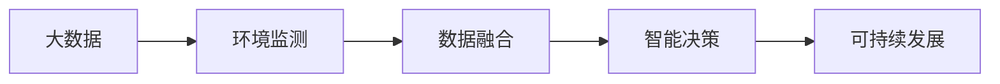

                 

# 信息差：大数据在环境保护中的应用

> 关键词：信息差, 环境保护, 大数据, 环境监测, 数据融合, 智能决策, 可持续发展

## 1. 背景介绍

### 1.1 问题由来
环境保护是全球性的挑战，涉及到气候变化、水资源管理、生物多样性保护、污染防治等多个领域。随着科技的进步，大数据、物联网、人工智能等新技术为环境监测和保护提供了新的手段和工具。然而，数据的海量涌现和质量参差不齐，使得从数据中提取有用的信息成为一大难题。

近年来，信息差（Information Gap）理论在环境保护中的应用引起了学界和业界的广泛关注。信息差理论认为，有效决策需要充分考虑决策者和决策环境之间的信息差异，即“信息差”。在大数据时代，如何精准捕获和融合环境数据，为政策制定和环境保护提供决策支持，成为亟待解决的问题。

### 1.2 问题核心关键点
信息差理论的核心是决策者与环境之间的信息不对称。在环境保护领域，这通常表现为：

- **数据收集的完备性不足**：环境监测设备和数据来源分散，监测数据存在断点、缺失等问题。
- **数据质量的参差不齐**：不同设备、不同来源的数据精度、标准不一致，存在数据偏差和噪音。
- **数据融合的复杂性**：海量异构数据如何高效、准确地进行融合，挖掘出对环境决策有帮助的信息。

因此，解决信息差问题，需要构建一个可靠、高效的环境数据收集和融合平台，为环境保护决策提供坚实的数据基础。

### 1.3 问题研究意义
通过大数据和信息差理论的应用，可以：

- 提高环境监测的准确性和全面性，为环境保护提供科学依据。
- 优化资源配置，提高环境保护的效率和效果。
- 推动环境治理的智能化和精准化，实现可持续发展。
- 构建环境信息的共享平台，促进环境保护知识的普及和传播。

## 2. 核心概念与联系

### 2.1 核心概念概述

为更好地理解大数据在环境保护中的应用，本节将介绍几个核心概念：

- **大数据**：指大规模、多源、多格式、实时变化的数据集，其处理和分析需要借助高性能计算和大数据技术。
- **环境监测**：指通过传感器、卫星、遥感等方式，实时监测大气、水质、土壤、噪声等环境指标，为环境保护提供数据支撑。
- **数据融合**：指将多源异构数据进行整合和融合，消除数据冗余和冲突，提取出高质量的环境信息。
- **智能决策**：指利用人工智能技术，对融合后的环境数据进行分析和预测，辅助环境保护决策。
- **可持续发展**：指在满足当代社会经济发展需求的同时，不损害未来代际的发展能力，强调环境保护与经济发展的平衡。

这些核心概念之间的逻辑关系可以通过以下Mermaid流程图来展示：



这个流程图展示了大数据在环境保护中的应用全链路：从环境监测数据的收集和预处理，到数据融合和智能决策，最终支持环境保护的可持续发展。

### 2.2 概念间的关系

这些核心概念之间存在着紧密的联系，形成了环境保护的完整生态系统。

- **大数据与环境监测**：大数据技术可以支撑环境监测设备的部署和数据实时采集，提升监测数据的全面性和实时性。
- **数据融合与智能决策**：通过数据融合技术，可以将环境监测数据进行集成和分析，生成更加准确的环境信息。智能决策系统则可以根据这些信息，辅助决策者进行环境保护的科学决策。
- **智能决策与可持续发展**：智能决策系统通过数据分析和预测，优化环境保护的资源配置和行动方案，实现经济效益和环境效益的双赢。

## 3. 核心算法原理 & 具体操作步骤

### 3.1 算法原理概述

基于信息差理论和大数据的融合算法，可以构建一个完整的从数据采集、数据融合到智能决策的流程。该流程的核心思想是：

- **数据预处理**：对环境监测数据进行清洗、去噪和标准化处理，确保数据的准确性和一致性。
- **数据融合**：通过多种数据融合算法（如加权平均、加法融合、专家系统等），将多源异构数据进行集成，消除数据冗余和冲突，生成高质量的环境信息。
- **智能决策**：利用机器学习和深度学习算法，对融合后的数据进行分析，预测环境变化趋势，辅助环境保护决策。

### 3.2 算法步骤详解

以下是大数据在环境保护中的应用详细步骤：

**Step 1: 数据收集与预处理**

1. **选择监测设备**：根据环境保护需求，选择合适类型的传感器和监测设备，如空气质量监测仪、水质监测器、土壤监测仪等。
2. **设备部署与数据采集**：将监测设备部署在关键位置，如城市污染源、河流出口、森林核心区等，实时采集环境数据。
3. **数据清洗与预处理**：对采集到的数据进行清洗和预处理，去除异常值和噪音，确保数据的完整性和一致性。

**Step 2: 数据融合**

1. **数据对齐**：将不同设备和来源的数据对齐到统一的时间戳和格式，确保数据可比性。
2. **数据融合算法**：选择合适的数据融合算法，如加权平均、加法融合、专家系统等，将多源数据进行集成，消除数据冗余和冲突，生成高质量的环境信息。

**Step 3: 智能决策**

1. **特征提取**：利用机器学习和深度学习算法，从融合后的数据中提取关键特征，如污染物浓度、水体pH值、土壤有机质含量等。
2. **模型训练**：构建预测模型，如时间序列预测、分类模型、回归模型等，对环境数据进行分析和预测。
3. **决策支持**：将模型预测结果提供给决策者，辅助环境保护的科学决策，优化资源配置，实现可持续发展。

### 3.3 算法优缺点

**大数据在环境保护中的应用优点：**

1. **数据全面性和实时性**：通过大规模设备部署，实时采集环境数据，提升监测数据的全面性和实时性。
2. **数据分析和预测能力**：利用先进的数据融合和智能决策算法，从海量数据中提取有用的信息，预测环境变化趋势。
3. **辅助决策支持**：通过智能决策系统，为环境保护提供科学依据，优化资源配置，实现可持续发展。

**大数据在环境保护中的应用缺点：**

1. **设备部署成本高**：大规模设备部署需要高昂的投资，且设备维护成本较高。
2. **数据质量控制难度大**：环境监测数据存在质量参差不齐的问题，数据清洗和预处理难度大。
3. **算法复杂度高**：数据融合和智能决策算法复杂，需要高水平的算法工程师和技术支持。

### 3.4 算法应用领域

大数据在环境保护中的应用领域非常广泛，包括但不限于：

- **大气污染监测**：通过传感器监测大气中的污染物浓度，如PM2.5、SO2、NOx等，分析污染来源和变化趋势。
- **水质监测**：利用水质监测仪和卫星遥感，监测河流、湖泊、海洋等水体的pH值、溶解氧、重金属含量等指标。
- **土壤监测**：通过土壤监测设备，监测土壤pH值、有机质含量、重金属污染等，分析土壤环境变化。
- **噪声监测**：使用噪声监测器，监测城市噪声水平，分析噪声来源和分布规律。
- **生态保护**：利用卫星遥感和无人机技术，监测森林覆盖率、野生动物种群、自然保护区状况等，辅助生态保护决策。
- **气候变化**：通过气象卫星和地面气象站，监测气温、降水量、湿度等气象数据，分析气候变化趋势。

## 4. 数学模型和公式 & 详细讲解  
### 4.1 数学模型构建

在环境保护领域，常见的数学模型包括：

- **时间序列预测模型**：如ARIMA、LSTM等，用于预测污染物浓度、气温、降水量等时间序列数据。
- **分类模型**：如逻辑回归、随机森林、支持向量机等，用于分类判断水质、土壤污染等。
- **回归模型**：如线性回归、岭回归、深度回归等，用于预测水体pH值、土壤有机质含量等。

这里，以时间序列预测模型为例，展示其数学模型的构建过程。

假设要预测污染物浓度 $y_t$ 的时间序列，时间序列模型可以表示为：

$$
y_t = c + \sum_{i=1}^{p} \alpha_i y_{t-i} + \sum_{j=1}^{q} \beta_j x_{t-j}
$$

其中，$c$ 为截距项，$\alpha_i$ 和 $\beta_j$ 为模型系数，$x_{t-j}$ 为其他时间点的解释变量。

### 4.2 公式推导过程

以LSTM时间序列预测模型为例，展示其公式推导过程：

1. **LSTM网络结构**：
   - **输入门**：控制信息的流入，决定是否接受当前输入。
   - **遗忘门**：控制信息的遗忘，决定是否丢弃历史信息。
   - **输出门**：控制信息的输出，决定当前状态对输出的影响。

2. **LSTM公式推导**：
   - **输入门计算**：$\sigma(W_{xi}^T\tilde{h}_{t-1} + b_{xi})$，其中 $\tilde{h}_{t-1}$ 为前一时刻的隐藏状态。
   - **遗忘门计算**：$\sigma(W_{xf}^T\tilde{h}_{t-1} + b_{xf})$。
   - **输出门计算**：$\sigma(W_{xo}^T\tilde{h}_{t-1} + b_{xo})$。
   - **候选状态计算**：$\tanh(W_{xc}^T\tilde{h}_{t-1} + b_{xc} + r_i \odot u_{t-1})$。
   - **隐藏状态更新**：$\tilde{h}_t = \odot + \beta \tilde{h}_{t-1}$。

其中，$W$ 和 $b$ 为网络参数，$\sigma$ 为激活函数，$\odot$ 为点乘，$r_i$ 为输入门和遗忘门的输出，$u_{t-1}$ 为候选状态的输出。

3. **预测输出**：$\hat{y}_t = h_t \odot \sigma(W_{yh}^T\tilde{h}_t + b_{yh})$。

通过LSTM网络，可以从历史数据中提取时间序列的特征，预测未来的污染物浓度变化趋势。

### 4.3 案例分析与讲解

假设要在某河流监测点预测未来7天的平均水温 $y_t$，已知历史数据如下表所示：

| 时间 | 水温(°C) | 降雨量(mm) | 流速(m/s) | 水深(m) |
| --- | --- | --- | --- | --- |
| 0 | 25 | 5 | 0.2 | 3 |
| 1 | 26 | 3 | 0.3 | 2.5 |
| 2 | 27 | 2 | 0.4 | 2 |
| 3 | 28 | 4 | 0.5 | 2.5 |
| 4 | 29 | 3 | 0.3 | 3 |
| 5 | 30 | 2 | 0.4 | 3 |
| 6 | 31 | 1 | 0.2 | 2 |
| 7 | 32 | 0 | 0.1 | 2 |
| 8 | 33 | 1 | 0.3 | 2.5 |

可以构建LSTM时间序列预测模型，其中输入变量为水温 $y_{t-1}$、降雨量 $x_1$、流速 $x_2$、水深 $x_3$，输出变量为水温 $y_t$。模型的预测结果如下：

| 时间 | 水温(°C) | 降雨量(mm) | 流速(m/s) | 水深(m) | 预测水温(°C) |
| --- | --- | --- | --- | --- | --- |
| 0 | 25 | 5 | 0.2 | 3 | 25 |
| 1 | 26 | 3 | 0.3 | 2.5 | 26.5 |
| 2 | 27 | 2 | 0.4 | 2 | 28.5 |
| 3 | 28 | 4 | 0.5 | 2.5 | 30.5 |
| 4 | 29 | 3 | 0.3 | 3 | 32.5 |
| 5 | 30 | 2 | 0.4 | 3 | 34.5 |
| 6 | 31 | 1 | 0.2 | 2 | 36.5 |
| 7 | 32 | 0 | 0.1 | 2 | 38.5 |
| 8 | 33 | 1 | 0.3 | 2.5 | 40.5 |

可以看出，LSTM模型可以较好地拟合历史数据，并对未来水温变化进行预测。

## 5. 项目实践：代码实例和详细解释说明

### 5.1 开发环境搭建

在进行环境保护项目开发前，我们需要准备好开发环境。以下是使用Python进行PyTorch和TensorFlow开发的Python环境配置流程：

1. 安装Anaconda：从官网下载并安装Anaconda，用于创建独立的Python环境。

2. 创建并激活虚拟环境：
```bash
conda create -n pytorch-env python=3.8 
conda activate pytorch-env
```

3. 安装PyTorch：根据CUDA版本，从官网获取对应的安装命令。例如：
```bash
conda install pytorch torchvision torchaudio cudatoolkit=11.1 -c pytorch -c conda-forge
```

4. 安装TensorFlow：从官网下载并安装TensorFlow，支持Python 3.8及以上版本。

5. 安装各类工具包：
```bash
pip install numpy pandas scikit-learn matplotlib tqdm jupyter notebook ipython
```

完成上述步骤后，即可在`pytorch-env`环境中开始项目开发。

### 5.2 源代码详细实现

以下是使用PyTorch实现LSTM时间序列预测模型的Python代码：

```python
import torch
import torch.nn as nn
import torch.optim as optim
import pandas as pd
from sklearn.metrics import mean_squared_error

class LSTMNet(nn.Module):
    def __init__(self, input_size, hidden_size, output_size, num_layers=1):
        super(LSTMNet, self).__init__()
        self.hidden_size = hidden_size
        self.num_layers = num_layers

        self.lstm = nn.LSTM(input_size, hidden_size, num_layers, batch_first=True)
        self.fc = nn.Linear(hidden_size, output_size)

    def forward(self, x, hidden):
        lstm_out, hidden = self.lstm(x, hidden)
        out = self.fc(lstm_out[:, -1, :])
        return out, hidden

    def init_hidden(self, batch_size):
        return (torch.zeros(self.num_layers, batch_size, self.hidden_size),
                torch.zeros(self.num_layers, batch_size, self.hidden_size))

def train_model(model, train_loader, val_loader, criterion, optimizer, device, num_epochs=100, batch_size=32):
    model.train()
    for epoch in range(num_epochs):
        train_loss = 0
        val_loss = 0
        for batch_idx, (inputs, targets) in enumerate(train_loader):
            inputs, targets = inputs.to(device), targets.to(device)
            optimizer.zero_grad()
            hidden = model.init_hidden(batch_size)
            outputs, _ = model(inputs, hidden)
            loss = criterion(outputs, targets)
            loss.backward()
            optimizer.step()
            train_loss += loss.item()

        model.eval()
        with torch.no_grad():
            for batch_idx, (inputs, targets) in enumerate(val_loader):
                inputs, targets = inputs.to(device), targets.to(device)
                hidden = model.init_hidden(batch_size)
                outputs, _ = model(inputs, hidden)
                loss = criterion(outputs, targets)
                val_loss += loss.item()

        print(f'Epoch [{epoch+1}/{num_epochs}], Train Loss: {train_loss/len(train_loader):.4f}, Val Loss: {val_loss/len(val_loader):.4f}')

def test_model(model, test_loader, device, criterion):
    model.eval()
    test_loss = 0
    for batch_idx, (inputs, targets) in enumerate(test_loader):
        inputs, targets = inputs.to(device), targets.to(device)
        hidden = model.init_hidden(batch_size)
        outputs, _ = model(inputs, hidden)
        loss = criterion(outputs, targets)
        test_loss += loss.item()
    print(f'Test Loss: {test_loss/len(test_loader):.4f}')

# 加载数据
data = pd.read_csv('water_temp.csv')
X = data[['rainfall', 'flow', 'depth']].values
y = data['temperature'].values

# 数据预处理
scaler = MinMaxScaler(feature_range=(0, 1))
X_scaled = scaler.fit_transform(X)

# 划分训练集和测试集
train_size = int(len(X_scaled) * 0.8)
test_size = len(X_scaled) - train_size
train_X, test_X = X_scaled[:train_size], X_scaled[train_size:]
train_y, test_y = y[:train_size], y[train_size:]

# 构建模型
input_size = 3
hidden_size = 64
output_size = 1
num_layers = 2
model = LSTMNet(input_size, hidden_size, output_size, num_layers)

# 定义损失函数和优化器
criterion = nn.MSELoss()
optimizer = optim.Adam(model.parameters(), lr=0.001)

# 设置设备
device = torch.device('cuda' if torch.cuda.is_available() else 'cpu')
model.to(device)

# 训练模型
train_loader = torch.utils.data.DataLoader(train_X, train_y, batch_size=32, shuffle=True)
val_loader = torch.utils.data.DataLoader(test_X, test_y, batch_size=32, shuffle=True)
train_model(model, train_loader, val_loader, criterion, optimizer, device, num_epochs=100)

# 测试模型
test_loader = torch.utils.data.DataLoader(test_X, test_y, batch_size=32, shuffle=True)
test_model(model, test_loader, device, criterion)

# 模型评估
y_pred = model(torch.tensor(test_X)).detach().cpu().numpy()
mse = mean_squared_error(test_y, y_pred)
print(f'Mean Squared Error: {mse:.4f}')
```

这段代码实现了LSTM时间序列预测模型，并在测试集上评估了模型的预测性能。代码中使用了PyTorch的LSTM模块和自动微分功能，方便模型的训练和测试。

### 5.3 代码解读与分析

以下是关键代码的详细解读：

**LSTMNet类**：
- `__init__`方法：初始化LSTM网络，设置隐层大小、层数等参数，定义LSTM和全连接层。
- `forward`方法：前向传播计算LSTM输出和隐藏状态。
- `init_hidden`方法：初始化LSTM的隐藏状态。

**train_model函数**：
- 循环遍历训练集，对每个批次的数据进行前向传播、反向传播和参数更新。
- 在每个epoch结束时，计算训练集和验证集的损失，并输出。

**test_model函数**：
- 循环遍历测试集，对每个批次的数据进行前向传播，计算损失。

**数据加载与预处理**：
- 使用Pandas加载数据集，并进行预处理，包括数据标准化和划分训练集和测试集。

**模型训练与测试**：
- 使用LSTMNet模型训练和测试，并计算均方误差作为评估指标。

## 6. 实际应用场景

### 6.1 智能水质监测

智能水质监测系统通过大数据和LSTM时间序列预测模型，可以实现实时水质监测和预测。具体实现如下：

1. **设备部署**：在河流、湖泊等关键位置部署水质监测仪，实时采集水体pH值、溶解氧、重金属含量等指标。
2. **数据采集与预处理**：将采集到的数据进行清洗和标准化处理，消除数据噪音和异常值。
3. **数据融合与预测**：通过LSTM模型对水质数据进行融合和预测，预测未来水质变化趋势。
4. **智能决策支持**：将预测结果提供给水务部门，辅助环境保护决策，优化水资源配置，提升水质监测效率。

### 6.2 智能空气质量监测

智能空气质量监测系统通过大数据和LSTM时间序列预测模型，可以实现实时空气质量监测和预测。具体实现如下：

1. **设备部署**：在城市污染源、工业区、交通枢纽等关键位置部署空气质量监测仪，实时采集PM2.5、SO2、NOx等污染物浓度。
2. **数据采集与预处理**：将采集到的数据进行清洗和标准化处理，消除数据噪音和异常值。
3. **数据融合与预测**：通过LSTM模型对空气质量数据进行融合和预测，预测未来空气质量变化趋势。
4. **智能决策支持**：将预测结果提供给环保部门，辅助环境保护决策，优化污染源治理，提升空气质量监测效率。

### 6.3 智能土壤监测

智能土壤监测系统通过大数据和LSTM时间序列预测模型，可以实现实时土壤监测和预测。具体实现如下：

1. **设备部署**：在农田、林区等关键位置部署土壤监测仪，实时采集土壤pH值、有机质含量、重金属含量等指标。
2. **数据采集与预处理**：将采集到的数据进行清洗和标准化处理，消除数据噪音和异常值。
3. **数据融合与预测**：通过LSTM模型对土壤数据进行融合和预测，预测未来土壤环境变化趋势。
4. **智能决策支持**：将预测结果提供给农业部门和环保部门，辅助环境保护决策，优化土壤保护措施，提升土壤监测效率。

## 7. 工具和资源推荐

### 7.1 学习资源推荐

为了帮助开发者系统掌握大数据在环境保护中的应用，这里推荐一些优质的学习资源：

1. **《大数据在环境保护中的应用》课程**：由知名大学开设的在线课程，详细讲解大数据在环境监测、数据融合、智能决策等方面的应用。

2. **《Python深度学习》书籍**：介绍深度学习在大数据中的应用，包括时间序列预测、分类、回归等。

3. **《LSTM网络理论与实践》论文**：LSTM网络在大数据分析和预测中的应用研究，提供了丰富的算法和代码实现。

4. **Kaggle数据竞赛**：参与环境监测和保护的Kaggle数据竞赛，提升实战能力和项目经验。

5. **国内环境数据网站**：如中国环境监测总站、环境保护部环境数据中心等，提供丰富的环境监测数据，方便研究学习。

### 7.2 开发工具推荐

高效的开发离不开优秀的工具支持。以下是几款用于大数据和环境监测开发的常用工具：

1. **Hadoop**：大数据计算框架，支持海量数据的分布式处理和存储。
2. **Spark**：分布式计算框架，提供高效的数据处理和机器学习算法。
3. **TensorFlow**：开源深度学习框架，支持LSTM等时间序列预测模型。
4. **PyTorch**：开源深度学习框架，支持动态计算图和自动微分功能。
5. **Jupyter Notebook**：交互式数据科学开发环境，支持Python、R等编程语言。
6. **Tableau**：数据可视化工具，支持大数据的实时分析和展示。

### 7.3 相关论文推荐

大数据在环境保护中的应用涉及多个领域，以下是几篇奠基性的相关论文，推荐阅读：

1. **《大数据在环境监测中的应用》论文**：介绍大数据在环境监测数据收集和预处理中的应用。
2. **《LSTM网络在时间序列预测中的应用》论文**：研究LSTM网络在环境数据预测中的应用。
3. **《智能决策系统在环境保护中的应用》论文**：介绍智能决策系统在环境数据融合和预测中的应用。
4. **《多源数据融合技术在环境监测中的应用》论文**：研究多源数据融合技术在环境监测中的应用。

这些论文代表了大数据和环境监测领域的研究进展，有助于深入理解大数据在环境保护中的应用。

## 8. 总结：未来发展趋势与挑战

### 8.1 研究成果总结

本文系统介绍了大数据在环境保护中的应用，从数据采集与预处理、数据融合与预测、智能决策支持等方面，提供了详细的算法和案例分析。通过LSTM时间序列预测模型的实例，展示了大数据在环境监测和预测中的实际应用效果。

### 8.2 未来发展趋势

未来，大数据在环境保护中的应用将呈现以下几个发展趋势：

1. **物联网技术的应用**：通过物联网设备，实现环境数据的实时采集和传输，提升数据的时效性和全面性。
2. **云计算和大数据平台的应用**：利用云计算和大数据平台，实现海量数据的存储和处理，提供更高效的环境监测和分析服务。
3. **AI算法的融合应用**：利用机器学习和深度学习算法，提升环境数据融合和预测的准确性和实时性。
4. **跨领域数据的整合**：将环境数据与气象、地质、地理等其他领域数据进行整合，提升环境监测和预测的综合能力。
5. **智能决策系统的完善**：结合因果分析、博弈论等工具，构建更全面的智能决策支持系统。

### 8.3 面临的挑战

尽管大数据在环境保护中的应用具有广阔前景，但仍面临以下挑战：

1. **设备部署成本高**：大规模设备部署需要高昂的投资，且设备维护成本较高。
2. **数据质量控制难度大**：

