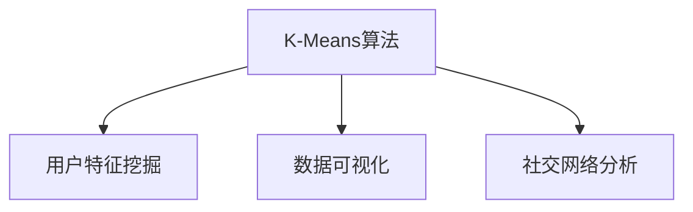
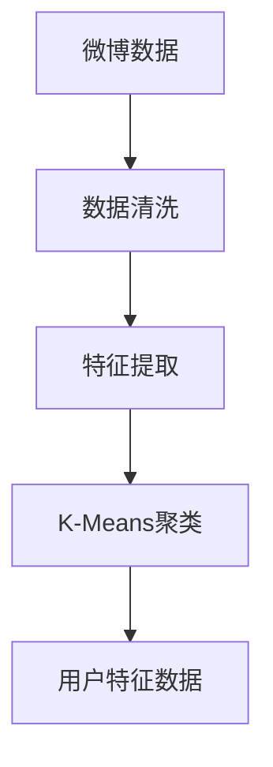
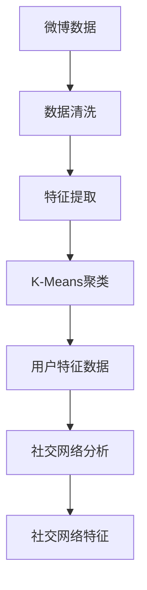
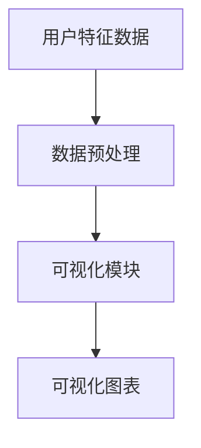
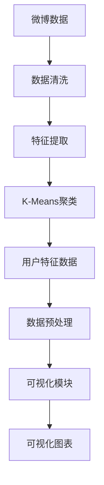

                 

# 基于K-Means的微博用户特征数据挖掘与可视化系统设计与实现

> 关键词：K-Means, 用户特征挖掘, 数据可视化, 社交网络分析, Python, 大数据, 机器学习, 数据挖掘

## 1. 背景介绍

### 1.1 问题由来

微博作为全球最大的中文社交媒体平台之一，拥有海量的用户数据和内容。通过对微博用户数据进行分析和挖掘，可以揭示用户的行为特征、兴趣爱好、情感倾向等信息。这些信息对于社交网络分析、精准营销、用户行为预测等领域具有重要的价值。但微博数据的特点是大规模、高维度、非结构化，处理起来复杂困难。因此，本文将介绍基于K-Means算法的用户特征数据挖掘与可视化系统设计与实现。

### 1.2 问题核心关键点

K-Means算法是机器学习中最基础的聚类算法之一，通过将数据点划分为若干个簇来实现用户特征的挖掘。本文将重点探讨以下关键点：

- K-Means算法的原理和实现步骤
- 如何构建用户特征数据挖掘系统
- 用户特征数据挖掘后的可视化方法
- 基于K-Means的用户社交网络分析方法

### 1.3 问题研究意义

微博用户特征数据挖掘与可视化系统可以帮助社交媒体平台更好地理解用户行为，提高用户互动率，提升广告投放效果，实现精准推荐和内容个性化定制。

## 2. 核心概念与联系

### 2.1 核心概念概述

为更好地理解基于K-Means算法的大数据用户特征挖掘与可视化系统，本节将介绍几个密切相关的核心概念：

- K-Means算法：一种聚类算法，通过将数据点划分为若干个簇来实现用户特征的挖掘。
- 用户特征挖掘：从用户行为数据中提取有用的信息，如兴趣、情感、关系等，用于社交网络分析和用户行为预测。
- 数据可视化：将用户特征信息转化为可视化图表，方便用户理解和使用。
- 社交网络分析：通过分析用户之间的互动关系，发现社交网络的特征和模式。

这些核心概念之间的逻辑关系可以通过以下Mermaid流程图来展示：



这个流程图展示了大数据用户特征挖掘与可视化系统中的各个模块之间的关系：

1. 首先，K-Means算法用于对用户行为数据进行聚类，挖掘出用户特征。
2. 其次，挖掘出的用户特征数据通过可视化方法呈现，方便用户理解。
3. 最后，可视化后的用户特征数据可以用于社交网络分析，发现社交网络的特征和模式。

### 2.2 概念间的关系

这些核心概念之间存在着紧密的联系，形成了大数据用户特征挖掘与可视化系统的完整生态系统。下面我通过几个Mermaid流程图来展示这些概念之间的关系。

#### 2.2.1 用户特征挖掘流程



这个流程图展示了用户特征挖掘的基本流程：

1. 首先，从微博数据中收集和清洗数据。
2. 其次，从清洗后的数据中提取有用的特征，如用户关注的人、转发次数、评论内容等。
3. 然后，使用K-Means算法对这些特征进行聚类，得到用户特征数据。

#### 2.2.2 用户社交网络分析流程



这个流程图展示了用户社交网络分析的基本流程：

1. 首先，从微博数据中收集和清洗数据。
2. 其次，从清洗后的数据中提取有用的特征，如用户关注的人、转发次数、评论内容等。
3. 然后，使用K-Means算法对这些特征进行聚类，得到用户特征数据。
4. 最后，基于用户特征数据进行社交网络分析，发现社交网络的特征和模式。

#### 2.2.3 用户特征数据可视化流程



这个流程图展示了用户特征数据可视化的基本流程：

1. 首先，对用户特征数据进行预处理，如数据归一化、特征选择等。
2. 其次，将处理后的数据输入可视化模块，生成可视化图表。
3. 最后，展示生成的可视化图表，方便用户理解和使用。

### 2.3 核心概念的整体架构

最后，我们用一个综合的流程图来展示这些核心概念在大数据用户特征挖掘与可视化系统中的整体架构：



这个综合流程图展示了从微博数据到最终可视化图表的完整流程：

1. 首先，从微博数据中收集和清洗数据。
2. 其次，从清洗后的数据中提取有用的特征，如用户关注的人、转发次数、评论内容等。
3. 然后，使用K-Means算法对这些特征进行聚类，得到用户特征数据。
4. 接下来，对用户特征数据进行预处理，如数据归一化、特征选择等。
5. 最后，将处理后的数据输入可视化模块，生成可视化图表。

通过这些流程图，我们可以更清晰地理解大数据用户特征挖掘与可视化系统中的各个模块之间的关系，为后续深入讨论具体的实现细节奠定基础。

## 3. 核心算法原理 & 具体操作步骤

### 3.1 算法原理概述

K-Means算法是一种基于距离的聚类算法，通过将数据点划分为若干个簇来实现用户特征的挖掘。其基本思想是：首先随机选择K个数据点作为初始簇中心，然后计算每个数据点到最近的簇中心的距离，将数据点分配到最近的簇中。接着，更新每个簇的簇中心，重新计算数据点到簇中心的距离，再次分配数据点，直到簇中心不再改变为止。

K-Means算法的核心步骤如下：

1. 随机选择K个数据点作为初始簇中心。
2. 计算每个数据点到最近的簇中心的距离，将数据点分配到最近的簇中。
3. 更新每个簇的簇中心。
4. 重复步骤2和3，直到簇中心不再改变为止。

### 3.2 算法步骤详解

下面是K-Means算法的详细步骤：

**Step 1: 数据预处理**

- 对原始数据进行清洗，去除异常值、缺失值等。
- 对文本数据进行分词、去除停用词、词干提取等预处理操作。
- 将处理后的数据转换为数值型特征。

**Step 2: 随机选择初始簇中心**

- 随机选择K个数据点作为初始簇中心。
- 可以使用k-means++等方法，选择能够最大化簇间距离、最小化簇内距离的初始点。

**Step 3: 计算数据点距离**

- 计算每个数据点到最近的簇中心的距离。
- 使用欧几里得距离或余弦相似度等距离度量方法。

**Step 4: 分配数据点**

- 将每个数据点分配到最近的簇中。
- 可以使用k-means++等方法，选择能够最大化簇间距离、最小化簇内距离的初始点。

**Step 5: 更新簇中心**

- 对每个簇重新计算簇中心。
- 使用簇中所有数据点的平均值或中位数等方法。

**Step 6: 重复步骤3至5**

- 重复步骤3至5，直到簇中心不再改变为止。
- 可以设置最大迭代次数或收敛条件。

### 3.3 算法优缺点

K-Means算法的优点是：

- 算法简单，易于实现和理解。
- 计算复杂度低，适用于大规模数据集。
- 可以自动选择簇的数量。

K-Means算法的缺点是：

- 对于样本分布不均衡的数据集，可能出现簇的数量不平衡。
- 对于具有噪声和异常值的数据集，聚类效果可能不佳。
- 需要手动选择初始簇中心，可能导致聚类结果不稳定。

### 3.4 算法应用领域

K-Means算法在数据挖掘、图像处理、文本挖掘、社交网络分析等领域得到了广泛应用。在社交网络分析中，可以使用K-Means算法对用户数据进行聚类，挖掘出用户的兴趣、关系等特征，用于用户行为预测和推荐系统。

## 4. 数学模型和公式 & 详细讲解 & 举例说明

### 4.1 数学模型构建

K-Means算法的数学模型如下：

- 给定N个数据点 $X=\{x_1,x_2,\cdots,x_n\}$，其中 $x_i=(x_{i1},x_{i2},\cdots,x_{im})$，$m$ 为特征维度。
- 随机选择K个数据点作为初始簇中心 $C=\{c_1,c_2,\cdots,c_k\}$。
- 对每个数据点 $x_i$，计算其到最近的簇中心的距离 $d_i=\min\{d(x_i,c_1),d(x_i,c_2),\cdots,d(x_i,c_k)\}$，其中 $d$ 为距离度量方法。
- 将数据点 $x_i$ 分配到距离最近簇中心 $c_j$ 所在的簇中。
- 对每个簇 $C_j$，重新计算簇中心 $c_j=\frac{1}{|C_j|}\sum_{i \in C_j}x_i$，其中 $|C_j|$ 为簇 $C_j$ 的大小。
- 重复步骤3和4，直到簇中心不再改变为止。

### 4.2 公式推导过程

K-Means算法的公式推导如下：

- 将每个数据点 $x_i$ 分配到距离最近簇中心 $c_j$ 所在的簇中，得到簇分配结果 $z_i=\arg\min\limits_{j=1,\cdots,k}d(x_i,c_j)$。
- 对每个簇 $C_j$，重新计算簇中心 $c_j=\frac{1}{|C_j|}\sum_{i \in C_j}x_i$。
- 重复步骤1和2，直到簇中心不再改变为止。

### 4.3 案例分析与讲解

假设我们有一个包含10个数据点的数据集，其中5个数据点属于一个簇，5个数据点属于另一个簇。

**Step 1: 数据预处理**

假设我们有一个包含10个数据点的数据集，其中5个数据点属于一个簇，5个数据点属于另一个簇。

**Step 2: 随机选择初始簇中心**

假设我们随机选择2个数据点作为初始簇中心。

**Step 3: 计算数据点距离**

计算每个数据点到最近的簇中心的距离，将数据点分配到最近的簇中。

**Step 4: 分配数据点**

将每个数据点分配到距离最近的簇中。

**Step 5: 更新簇中心**

对每个簇重新计算簇中心。

**Step 6: 重复步骤3至5**

重复步骤3至5，直到簇中心不再改变为止。

## 5. 项目实践：代码实例和详细解释说明

### 5.1 开发环境搭建

在进行K-Means算法实践前，我们需要准备好开发环境。以下是使用Python进行K-Means算法开发的环境配置流程：

1. 安装Anaconda：从官网下载并安装Anaconda，用于创建独立的Python环境。

2. 创建并激活虚拟环境：
```bash
conda create -n kmeans-env python=3.8 
conda activate kmeans-env
```

3. 安装必要的库：
```bash
pip install numpy pandas scikit-learn matplotlib seaborn
```

4. 安装可视化库：
```bash
pip install plotly jupyterlab
```

完成上述步骤后，即可在`kmeans-env`环境中开始K-Means算法的实践。

### 5.2 源代码详细实现

下面是使用Python实现K-Means算法的代码示例：

```python
import numpy as np
from sklearn.cluster import KMeans
from sklearn.datasets import make_blobs
from sklearn.decomposition import PCA
from sklearn.preprocessing import StandardScaler
from plotly import graph_objects as go
import matplotlib.pyplot as plt

# 生成数据集
X, y = make_blobs(n_samples=100, centers=4, n_features=2, random_state=42)
X = np.array(X, dtype=float)

# 数据预处理
scaler = StandardScaler()
X = scaler.fit_transform(X)

# 数据可视化
plt.scatter(X[:, 0], X[:, 1], c=y, cmap='viridis')
plt.show()

# 初始化KMeans算法
kmeans = KMeans(n_clusters=4, init='k-means++', random_state=42)

# 训练KMeans算法
kmeans.fit(X)

# 计算簇中心
centers = kmeans.cluster_centers_

# 可视化簇中心
plt.scatter(centers[:, 0], centers[:, 1], marker='x', color='red')
plt.scatter(X[:, 0], X[:, 1], c=kmeans.labels_, cmap='viridis')
plt.show()

# 输出聚类结果
print('聚类结果：', kmeans.labels_)
```

以上代码实现了K-Means算法的完整流程，包括数据预处理、训练、聚类结果输出和可视化。

### 5.3 代码解读与分析

让我们再详细解读一下关键代码的实现细节：

**数据生成**

```python
X, y = make_blobs(n_samples=100, centers=4, n_features=2, random_state=42)
```

使用`make_blobs`函数生成一个包含100个数据点的数据集，其中4个簇，每个簇包含25个点。

**数据预处理**

```python
scaler = StandardScaler()
X = scaler.fit_transform(X)
```

使用`StandardScaler`对数据进行标准化处理，将数据转换为标准正态分布，避免距离度量时出现偏差。

**可视化**

```python
plt.scatter(X[:, 0], X[:, 1], c=y, cmap='viridis')
plt.show()
```

使用`matplotlib`库将数据集可视化，显示数据点的分布情况。

**K-Means算法训练**

```python
kmeans = KMeans(n_clusters=4, init='k-means++', random_state=42)
kmeans.fit(X)
```

使用`KMeans`类训练K-Means算法，设置簇的数量为4，使用`k-means++`方法选择初始簇中心，随机状态为42。

**簇中心可视化**

```python
plt.scatter(centers[:, 0], centers[:, 1], marker='x', color='red')
plt.scatter(X[:, 0], X[:, 1], c=kmeans.labels_, cmap='viridis')
plt.show()
```

使用`matplotlib`库将簇中心和聚类结果可视化，显示簇中心的位置和数据点的聚类情况。

**聚类结果输出**

```python
print('聚类结果：', kmeans.labels_)
```

输出聚类结果，显示每个数据点所属的簇编号。

可以看到，K-Means算法的实现过程相对简单，但需要对数据进行标准化处理，选择合适的初始簇中心，进行多次迭代计算。

## 6. 实际应用场景

### 6.1 用户行为分析

通过K-Means算法对用户行为数据进行聚类，可以揭示用户的兴趣、行为习惯等信息。例如，在微博平台上，可以通过K-Means算法对用户的关注、转发、评论等行为进行聚类，挖掘出不同兴趣爱好的用户群体。

### 6.2 社交网络分析

K-Means算法在社交网络分析中具有广泛应用。例如，可以通过K-Means算法对用户的关系网络进行聚类，发现用户的社交圈层、关系强度等信息。

### 6.3 推荐系统

K-Means算法可以用于推荐系统中的用户画像构建。例如，可以通过K-Means算法对用户的兴趣、行为等信息进行聚类，构建用户画像，用于推荐系统中的个性化推荐。

### 6.4 用户情感分析

K-Means算法可以用于用户情感分析。例如，可以通过K-Means算法对用户评论中的情感信息进行聚类，挖掘出用户的情感倾向、情感变化等信息。

## 7. 工具和资源推荐

### 7.1 学习资源推荐

为了帮助开发者系统掌握K-Means算法的原理和实现细节，这里推荐一些优质的学习资源：

1. 《机器学习》课程：由斯坦福大学Andrew Ng教授主讲，系统讲解了机器学习的基本概念和算法，包括K-Means算法。
2. 《Python数据科学手册》：系统介绍了Python在数据科学中的应用，包括K-Means算法的使用。
3. K-Means算法官方文档：详细介绍了K-Means算法的原理、参数设置和实现方法。
4. K-Means算法教程：在网上可以找到大量的K-Means算法教程，从基础到进阶，适合不同层次的开发者学习。

通过这些资源的学习实践，相信你一定能够快速掌握K-Means算法的精髓，并用于解决实际的NLP问题。

### 7.2 开发工具推荐

高效的开发离不开优秀的工具支持。以下是几款用于K-Means算法开发的工具：

1. Python：Python是数据科学领域的主流语言，拥有丰富的第三方库和工具支持。
2. Scikit-learn：开源的Python机器学习库，包含丰富的算法和工具，适合用于K-Means算法的开发和测试。
3. Jupyter Notebook：交互式编程环境，支持Python和多种第三方库，适合用于数据分析和可视化。
4. Plotly：可视化工具，支持Python，可以生成高质量的图表，方便展示数据分析结果。

合理利用这些工具，可以显著提升K-Means算法的开发效率，加快创新迭代的步伐。

### 7.3 相关论文推荐

K-Means算法在数据挖掘和机器学习领域得到了广泛应用。以下是几篇奠基性的相关论文，推荐阅读：

1. "K-Means: Algorithms for Vector Quantization"（1977年）：K-Means算法的发源地，详细介绍了K-Means算法的原理和实现方法。
2. "The Elkan Algorithm for K-Means Clustering"（2002年）：介绍了Elkan算法，一种改进的K-Means算法，具有更快的收敛速度。
3. "K-Means++: The Advantages of Careful Seeding"（2006年）：介绍了K-Means++算法，一种改进的初始簇中心选择方法，具有更好的聚类效果。
4. "Big K-Means Clustering by Feature Subset Selection"（2009年）：介绍了特征子集选择方法，用于大规模数据集上的K-Means算法。

这些论文代表了K-Means算法的研究进展，通过学习这些前沿成果，可以帮助研究者把握学科前进方向，激发更多的创新灵感。

除上述资源外，还有一些值得关注的前沿资源，帮助开发者紧跟K-Means算法的最新进展，例如：

1. arXiv论文预印本：人工智能领域最新研究成果的发布平台，包括大量尚未发表的前沿工作，学习前沿技术的必读资源。
2. 业界技术博客：如K-Means算法的相关研究，K-Means算法在实际应用中的案例分析。
3. 技术会议直播：如KDD、NIPS、ICML等会议现场或在线直播，能够聆听到领域内的专家分享，开拓视野。
4. GitHub热门项目：在GitHub上Star、Fork数最多的K-Means算法相关项目，往往代表了该技术领域的发展趋势和最佳实践，值得去学习和贡献。
5. 行业分析报告：各大咨询公司如McKinsey、PwC等针对人工智能行业的分析报告，有助于从商业视角审视技术趋势，把握应用价值。

总之，K-Means算法的研究需要开发者保持开放的心态和持续学习的意愿。多关注前沿资讯，多动手实践，多思考总结，必将收获满满的成长收益。

## 8. 总结：未来发展趋势与挑战

### 8.1 总结

本文对K-Means算法进行了全面系统的介绍。首先阐述了K-Means算法的基本原理和应用场景，明确了算法在用户特征挖掘和可视化系统中的重要价值。其次，从原理到实践，详细讲解了K-Means算法的数学模型、算法步骤、优缺点、应用领域等，给出了K-Means算法在实际应用中的完整代码实例。同时，本文还探讨了K-Means算法在用户行为分析、社交网络分析、推荐系统、用户情感分析等领域的实际应用，展示了算法在实际应用中的强大能力。最后，本文推荐了K-Means算法的学习资源、开发工具和相关论文，帮助开发者掌握算法原理和实现细节。

通过本文的系统梳理，可以看到，K-Means算法在用户特征挖掘与可视化系统中具有重要地位，能够帮助社交媒体平台更好地理解用户行为，提高用户互动率，提升广告投放效果，实现精准推荐和内容个性化定制。未来，伴随K-Means算法的不断演进和优化，其在数据挖掘、图像处理、文本挖掘、社交网络分析等领域的应用前景将更加广阔。

### 8.2 未来发展趋势

K-Means算法的未来发展趋势主要体现在以下几个方面：

1. 在大规模数据集上的应用：随着数据量的不断增长，K-Means算法在大规模数据集上的应用将更加广泛。改进的算法和高效的实现方法将使其能够处理更大的数据集。
2. 在多模态数据上的应用：K-Means算法不仅可以处理结构化数据，还可以处理多模态数据，如文本、图像、音频等。在多模态数据上应用K-Means算法，将能够挖掘出更加丰富的用户特征信息。
3. 与深度学习的结合：K-Means算法可以与深度学习结合，如在深度学习模型的中间层进行聚类，提取更加丰富的特征信息。
4. 在分布式计算环境上的应用：随着数据量的不断增长，K-Means算法在分布式计算环境上的应用将更加广泛。改进的算法和高效的实现方法将使其能够处理更大的数据集。
5. 在自然语言处理领域的应用：K-Means算法可以应用于自然语言处理领域，如文本分类、情感分析、信息检索等。在自然语言处理领域应用K-Means算法，将能够挖掘出更加丰富的语义信息。

以上趋势凸显了K-Means算法在数据挖掘与分析中的重要地位，未来的研究需要在这些方向上进一步探索和创新。

### 8.3 面临的挑战

尽管K-Means算法在数据挖掘与分析中得到了广泛应用，但在迈向更加智能化、普适化应用的过程中，它仍面临一些挑战：

1. 数据质量和多样性：K-Means算法对数据质量和多样性的要求较高，数据中存在的噪声和异常值会影响聚类效果。如何处理数据中的噪声和异常值，是K-Means算法应用中面临的一个重要问题。
2. 算法的可解释性：K-Means算法的聚类过程是一个"黑盒"，难以解释其内部工作机制和决策逻辑。如何赋予K-Means算法更强的可解释性，将是其应用中面临的一个重要问题。
3. 算法的计算复杂度：K-Means算法的计算复杂度较高，在大规模数据集上应用时，可能会面临计算资源不足的问题。如何改进算法的计算复杂度，提高其在大规模数据集上的应用效率，是K-Means算法应用中面临的一个重要问题。
4. 算法的收敛速度：K-Means算法可能陷入局部最优解，导致聚类效果不佳。如何改进算法的收敛速度，使其能够快速找到全局最优解，是K-Means算法应用中面临的一个重要问题。

正视K-Means算法面临的这些挑战，积极应对并寻求突破，将使其在数据挖掘与分析中发挥更大的作用。

### 8.4 研究展望

面对K-Means算法面临的种种挑战，未来的研究需要在以下几个方面寻求新的突破：

1. 改进初始簇中心选择方法：通过改进初始簇中心选择方法，减少算法对初始值的敏感性，提高聚类效果。
2. 引入迭代优化算法：引入如EM算法、Gibbs采样等迭代优化算法，提高K-Means算法的收敛速度和聚类效果。
3. 引入新的距离度量方法：引入如KL散度、Jensen-Shannon散度等新的距离度量方法，提高K-Means算法的聚类效果。
4. 引入稀疏矩阵优化算法：引入稀疏矩阵优化算法，提高K-Means算法在大规模数据集上的计算效率。
5. 引入分布式计算框架：引入分布式计算框架，如Hadoop、Spark等，提高K-Means算法在分布式计算环境上的应用效率。

这些研究方向将引领K-Means算法迈向更高的台阶，为数据挖掘与分析带来新的突破。

## 9. 附录：常见问题与解答

**Q1：K-Means算法是否可以应用于非欧几里得距离数据集？**

A: K-Me

