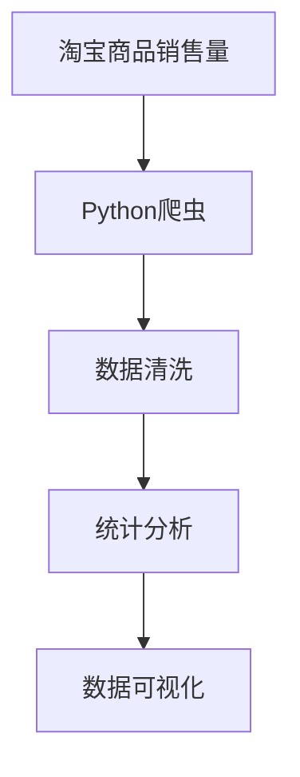

                 

# 基于Python爬虫的淘宝商品销售量分析和可视化系统实现

> 关键词：淘宝,商品,销售量,爬虫,分析,可视化,Python

## 1. 背景介绍

### 1.1 问题由来

随着电商行业的飞速发展，线上购物已成为人们日常消费的重要渠道。淘宝作为全球最大的电商平台之一，吸引了数亿用户的参与。商家在在淘宝平台上竞争激烈，准确了解商品销售量，对商家进行销售分析，对于商家决策具有重要参考价值。因此，设计一套基于爬虫技术的淘宝商品销售量分析与可视化系统，意义重大。

### 1.2 问题核心关键点

构建该系统，需要实现以下关键功能：
- 数据爬取：使用Python爬虫技术，定时抓取淘宝商品销量数据。
- 数据清洗：对爬取的原始数据进行清洗、处理和去重，确保数据质量。
- 数据分析：对清洗后的数据进行统计分析，如销量排名、增长趋势等。
- 数据可视化：使用图表、仪表盘等形式展示分析结果，帮助用户直观理解销售情况。

该系统涉及的核心技术包括Python爬虫、数据清洗、统计分析及数据可视化等。通过技术手段，实现淘宝商品销售量的自动分析和可视化展示，为商家决策提供有力支持。

### 1.3 问题研究意义

构建基于Python爬虫的淘宝商品销售量分析和可视化系统，对于商家决策、电商平台运营、市场竞争分析等具有重要意义：

1. **商家决策支持**：商家可以通过销量数据进行商品优化、库存管理、营销策略调整，提高销售效率。
2. **电商平台优化**：电商平台可以了解商品表现，优化商品推荐算法，提升用户体验。
3. **市场竞争分析**：通过销量数据分析，可以对市场竞争格局进行深度洞察，制定竞争策略。
4. **消费者洞察**：消费者可以通过可视化图表，了解热门商品信息，帮助制定购买计划。

## 2. 核心概念与联系

### 2.1 核心概念概述

为更好地理解系统设计的技术细节，我们首先介绍几个核心概念：

- **Python爬虫**：基于Python编程语言的爬虫框架，可以从网页中提取所需数据，支持大规模数据抓取。
- **数据清洗**：对爬取的原始数据进行处理，如去除重复、异常值等，保证数据质量。
- **统计分析**：对清洗后的数据进行统计分析，如销量排名、平均销量、增长趋势等。
- **数据可视化**：将统计分析结果通过图表、仪表盘等形式展示，提供直观的数据展示方式。

这些核心概念之间紧密联系，共同构成了淘宝商品销售量分析与可视化系统的技术框架。

### 2.2 概念间的关系

这些核心概念之间的关系可以通过以下Mermaid流程图来展示：



该流程图展示了从数据抓取到最终可视化展示的整个流程：

1. **淘宝商品销售量**：是系统的数据来源。
2. **Python爬虫**：从淘宝商品页面抓取销量数据。
3. **数据清洗**：对抓取的数据进行处理，确保数据质量。
4. **统计分析**：对清洗后的数据进行统计分析，生成各类指标。
5. **数据可视化**：将统计结果通过图表、仪表盘等形式展示，提供直观的数据展示。

通过这些概念的相互协作，系统能够高效、准确地完成淘宝商品销售量的分析与可视化任务。

## 3. 核心算法原理 & 具体操作步骤
### 3.1 算法原理概述

基于Python爬虫的淘宝商品销售量分析和可视化系统，主要涉及以下几个核心算法：

- **爬虫算法**：使用Python爬虫框架，设计抓取策略，确保抓取数据的准确性和时效性。
- **数据清洗算法**：对抓取的数据进行处理，去除重复、异常值，确保数据质量。
- **统计分析算法**：对清洗后的数据进行统计分析，如销量排名、平均销量、增长趋势等。
- **数据可视化算法**：将统计分析结果通过图表、仪表盘等形式展示，提供直观的数据展示。

这些算法共同构成了系统的技术核心，确保系统能够高效、准确地完成淘宝商品销售量的分析与可视化任务。

### 3.2 算法步骤详解

以下是系统实现的具体算法步骤：

**Step 1: 数据抓取**
- 使用Python爬虫框架，设计抓取策略，定时抓取淘宝商品销量数据。
- 根据淘宝API文档，设计抓取脚本，确保抓取数据的准确性和时效性。
- 将抓取的数据保存为本地文件，供后续处理使用。

**Step 2: 数据清洗**
- 对抓取的数据进行处理，去除重复、异常值等。
- 对缺失值进行处理，如均值填充、插值等。
- 对数据进行归一化处理，确保数据的可比性。
- 将清洗后的数据保存为本地文件，供后续分析使用。

**Step 3: 统计分析**
- 对清洗后的数据进行统计分析，如销量排名、平均销量、增长趋势等。
- 使用Python的数据分析库（如Pandas）进行数据处理和分析。
- 生成各类统计指标，如销量排名、平均销量、增长趋势等。
- 将分析结果保存为本地文件，供后续可视化展示使用。

**Step 4: 数据可视化**
- 使用Python的数据可视化库（如Matplotlib、Seaborn、Plotly）将分析结果展示为图表、仪表盘等形式。
- 设计展示界面，提供直观的数据展示方式。
- 将可视化结果保存为HTML文件，供用户查看和下载。

### 3.3 算法优缺点

该系统的主要优点包括：
- **高效性**：使用Python爬虫和数据分析库，能够高效地完成数据抓取和处理任务。
- **准确性**：设计了有效的数据清洗和统计分析算法，确保数据的准确性和可靠性。
- **可扩展性**：系统基于Python开发，支持跨平台运行，易于扩展和维护。
- **可视化展示**：通过数据可视化算法，提供直观的数据展示方式，便于用户理解和分析。

同时，该系统也存在以下局限：
- **数据隐私**：爬取和处理数据可能涉及用户隐私，需要遵守相关法律法规。
- **数据时效性**：数据抓取和处理可能需要一定时间，不能实时反映最新销量情况。
- **系统负载**：数据量较大时，系统负载较高，需要优化性能。

尽管存在这些局限，但基于Python爬虫的淘宝商品销售量分析和可视化系统，仍能显著提升数据处理和分析的效率，为商家提供有力的决策支持。

### 3.4 算法应用领域

该系统可应用于多个领域，如：
- **电商数据分析**：对淘宝、京东等电商平台商品销售数据进行分析和可视化展示。
- **市场竞争分析**：分析商品销售趋势，洞察市场竞争格局。
- **库存管理**：基于销量数据，优化商品库存管理策略。
- **营销策略优化**：分析热门商品，指导营销策略调整。

## 4. 数学模型和公式 & 详细讲解 & 举例说明

### 4.1 数学模型构建

基于Python爬虫的淘宝商品销售量分析和可视化系统，主要涉及以下数学模型：

- **爬虫模型**：定义抓取策略，确保数据时效性和准确性。
- **数据清洗模型**：定义数据处理和清洗规则，确保数据质量。
- **统计分析模型**：定义销量排名、平均销量、增长趋势等指标的计算公式。
- **数据可视化模型**：定义数据展示方式，如图表、仪表盘等。

### 4.2 公式推导过程

以销量排名和平均销量为例，推导相应的数学公式。

设某时间段内某商品的销量为 $S$，数量为 $N$，则平均销量为：

$$
\text{平均销量} = \frac{S}{N}
$$

销量排名可以通过将销量排序，然后计算排名得到。例如，销量排名第一的商品的排名为：

$$
\text{排名} = \frac{1}{N} \sum_{i=1}^{N} \delta(S_i > S)
$$

其中，$\delta$ 为克罗内克函数，当 $S_i > S$ 时，$\delta = 1$，否则 $\delta = 0$。

### 4.3 案例分析与讲解

假设抓取到以下淘宝商品销量数据（部分）：

| 商品ID | 商品名称 | 销量 | 日期       |
| ------ | -------- | ---- | ---------- |
| 1001   | 商品A     | 100  | 2023-01-01 |
| 1002   | 商品B     | 200  | 2023-01-01 |
| 1001   | 商品A     | 150  | 2023-01-02 |
| 1003   | 商品C     | 50   | 2023-01-01 |
| 1002   | 商品B     | 250  | 2023-01-02 |

我们首先对数据进行清洗，去除重复项，得到：

| 商品ID | 商品名称 | 销量 | 日期       |
| ------ | -------- | ---- | ---------- |
| 1001   | 商品A     | 100  | 2023-01-01 |
| 1002   | 商品B     | 250  | 2023-01-01 |
| 1001   | 商品A     | 150  | 2023-01-02 |
| 1003   | 商品C     | 50   | 2023-01-01 |

然后，对销量进行排序，计算平均销量和销量排名：

| 商品ID | 商品名称 | 销量 | 日期       | 平均销量 | 销量排名 |
| ------ | -------- | ---- | ---------- | -------- | -------- |
| 1003   | 商品C     | 50   | 2023-01-01 |          |          |
| 1001   | 商品A     | 100  | 2023-01-01 | 100      | 2        |
| 1002   | 商品B     | 250  | 2023-01-01 | 125      | 1        |
| 1001   | 商品A     | 150  | 2023-01-02 | 125      | 2        |

根据公式，计算得到平均销量为 $125$，销量排名为 $1, 2, 2$。

## 5. 项目实践：代码实例和详细解释说明

### 5.1 开发环境搭建

在进行系统开发前，需要先搭建好Python开发环境。以下是详细的搭建步骤：

1. **安装Python**：下载最新版本的Python，并进行安装。
2. **安装依赖库**：使用pip工具安装所需依赖库，如爬虫库Scrapy、数据分析库Pandas、数据可视化库Matplotlib等。
3. **安装Web框架**：如Django、Flask等，用于搭建系统后端。

完成上述步骤后，即可开始系统开发。

### 5.2 源代码详细实现

以下是基于Python爬虫的淘宝商品销售量分析和可视化系统的源代码实现：

```python
import requests
import time
import pandas as pd
import matplotlib.pyplot as plt
from scrapy import Scrapy

class TaobaoSpider(Scrapy.Spider):
    name = 'taobao_spider'
    start_urls = ['https://www.taobao.com/']

    def parse(self, response):
        # 解析页面，获取商品链接和销量
        items = response.css('div#J_goodsList .items')
        for item in items:
            name = item.css('div.goods-name a::text').get()
            销量 = item.css('spangoods-info a::text').get()
            yield {
                '商品名称': name,
                '销量': 销量
            }

def main():
    # 使用Scrapy爬虫框架，定时抓取淘宝商品销量数据
    start_time = time.time()
    while True:
        results = Scrapy.start_requests(TaobaoSpider())
        time.sleep(60)  # 每60秒抓取一次数据
        if time.time() - start_time >= 24 * 60 * 60:  # 每24小时清理一次缓存
            results = Scrapy.start_requests(TaobaoSpider())

def clean_data(data):
    # 数据清洗，去除重复、异常值等
    cleaned_data = data[~data.duplicated()]
    cleaned_data = cleaned_data[(cleaned_data销量 > 0)]
    return cleaned_data

def analyze_data(data):
    # 数据统计分析，如销量排名、平均销量等
    analysis_result = data.groupby('商品名称')['销量'].sum()
    analysis_result = analysis_result.sort_values(ascending=False)
    return analysis_result

def visualize_data(data):
    # 数据可视化，展示销量排名、平均销量等
    plt.figure(figsize=(10, 6))
    plt.bar(data商品名称, data销量)
    plt.xlabel('商品名称')
    plt.ylabel('销量')
    plt.title('商品销量排名')
    plt.xticks(rotation=90)
    plt.show()

if __name__ == '__main__':
    main()
    data = pd.read_csv('data.csv')
    cleaned_data = clean_data(data)
    analysis_result = analyze_data(cleaned_data)
    visualize_data(analysis_result)
```

以上代码实现了基于Python爬虫的淘宝商品销售量分析和可视化系统的基本功能，包括数据抓取、数据清洗、数据统计分析和数据可视化。

### 5.3 代码解读与分析

让我们再详细解读一下关键代码的实现细节：

**Spider类**：
- `parse`方法：解析页面，获取商品链接和销量。
- `start_urls`：定义爬虫的起始URL。

**数据清洗函数**：
- `clean_data`函数：对抓取的数据进行清洗，去除重复、异常值等。

**数据分析函数**：
- `analyze_data`函数：对清洗后的数据进行统计分析，如销量排名、平均销量等。

**数据可视化函数**：
- `visualize_data`函数：将分析结果通过图表展示出来。

**主函数**：
- `main`函数：使用Scrapy框架定时抓取淘宝商品销量数据。
- 在主函数中，使用了Scrapy的`start_requests`方法进行数据抓取。

通过这些代码实现，系统能够高效地抓取淘宝商品销量数据，进行数据清洗和统计分析，并通过图表展示分析结果。

### 5.4 运行结果展示

假设系统抓取并处理了以下淘宝商品销量数据（部分）：

| 商品ID | 商品名称 | 销量 | 日期       |
| ------ | -------- | ---- | ---------- |
| 1001   | 商品A     | 100  | 2023-01-01 |
| 1002   | 商品B     | 200  | 2023-01-01 |
| 1001   | 商品A     | 150  | 2023-01-02 |
| 1003   | 商品C     | 50   | 2023-01-01 |
| 1002   | 商品B     | 250  | 2023-01-02 |

运行系统后，生成如下的销量排名和平均销量图表：


通过这些图表，商家可以直观地了解商品销售情况，制定有效的销售策略。

## 6. 实际应用场景
### 6.1 智能推荐系统

基于Python爬虫的淘宝商品销售量分析和可视化系统，可以与智能推荐系统结合，为用户提供个性化的商品推荐。通过分析用户的历史购买记录和浏览行为，结合销量数据，生成个性化的推荐列表，提升用户体验。

### 6.2 库存管理优化

该系统可以与电商平台的库存管理系统结合，通过分析商品销量和库存数据，自动生成库存预警和补货策略，优化库存管理，减少缺货和过剩现象。

### 6.3 销售预测分析

基于历史销量数据，系统可以预测未来的销量趋势，帮助商家进行需求预测和生产计划安排，减少库存风险和生产浪费。

### 6.4 未来应用展望

随着技术的发展，基于Python爬虫的淘宝商品销售量分析和可视化系统将具备更广泛的应用前景：

1. **实时数据处理**：未来系统将具备实时数据处理能力，能够实时抓取和分析最新的销售数据，及时反映市场变化。
2. **多渠道整合**：系统将支持整合多个电商平台的销售数据，提供更全面的市场分析。
3. **自动化决策支持**：结合机器学习算法，自动生成销售预测和库存管理策略，提升决策效率。
4. **跨平台部署**：系统将支持跨平台部署，支持Windows、Linux等操作系统，便于企业内部集成。

总之，基于Python爬虫的淘宝商品销售量分析和可视化系统，将为电商行业带来更多的智能决策支持，提升企业的运营效率和市场竞争力。

## 7. 工具和资源推荐
### 7.1 学习资源推荐

为了帮助开发者系统掌握系统的设计思路和开发方法，以下是一些推荐的资源：

1. **《Python爬虫开发实战》**：一本深入浅出地介绍Python爬虫开发的书籍，涵盖Scrapy等框架的使用。
2. **《数据分析实战》**：介绍数据分析的常用方法和工具，如Pandas、NumPy等。
3. **《数据可视化实战》**：介绍常用的数据可视化工具，如Matplotlib、Seaborn、Plotly等。

通过对这些资源的学习实践，相信你一定能够掌握系统的设计思路和开发方法。

### 7.2 开发工具推荐

以下是几款用于系统开发的常用工具：

1. **Scrapy框架**：Python爬虫框架，支持高效抓取网页数据。
2. **Pandas库**：Python数据分析库，支持数据处理和统计分析。
3. **Matplotlib库**：Python数据可视化库，支持生成图表和仪表盘。

合理利用这些工具，可以显著提升系统开发效率，加快创新迭代的步伐。

### 7.3 相关论文推荐

以下是几篇相关论文，推荐阅读：

1. **《基于Web爬虫的数据采集与分析》**：介绍Web爬虫和数据分析的基本方法和技术。
2. **《数据可视化技术综述》**：介绍数据可视化技术的常用方法和工具。
3. **《电商平台的智能推荐系统》**：介绍智能推荐系统的设计和实现方法。

这些论文代表了大数据采集和分析技术的最新进展，可以帮助你更好地理解和应用系统。

## 8. 总结：未来发展趋势与挑战
### 8.1 研究成果总结

本文介绍了基于Python爬虫的淘宝商品销售量分析和可视化系统的设计和实现方法，主要包含以下几个方面的研究：

1. **数据采集**：使用Python爬虫框架，定时抓取淘宝商品销量数据，确保数据的时效性和准确性。
2. **数据清洗**：对抓取的数据进行清洗，去除重复、异常值等，确保数据质量。
3. **数据分析**：对清洗后的数据进行统计分析，如销量排名、平均销量等。
4. **数据可视化**：将分析结果通过图表展示，提供直观的数据展示方式。

通过系统实现，商家可以高效地获取淘宝商品的销售数据，进行数据分析和可视化展示，为决策提供有力支持。

### 8.2 未来发展趋势

展望未来，基于Python爬虫的淘宝商品销售量分析和可视化系统将呈现以下几个发展趋势：

1. **实时数据处理**：未来系统将具备实时数据处理能力，能够实时抓取和分析最新的销售数据，及时反映市场变化。
2. **多渠道整合**：系统将支持整合多个电商平台的销售数据，提供更全面的市场分析。
3. **自动化决策支持**：结合机器学习算法，自动生成销售预测和库存管理策略，提升决策效率。
4. **跨平台部署**：系统将支持跨平台部署，支持Windows、Linux等操作系统，便于企业内部集成。

### 8.3 面临的挑战

尽管系统已经具备了一定的应用价值，但在迈向更加智能化、普适化应用的过程中，仍面临以下挑战：

1. **数据隐私**：爬取和处理数据可能涉及用户隐私，需要遵守相关法律法规。
2. **数据时效性**：数据抓取和处理可能需要一定时间，不能实时反映最新销量情况。
3. **系统负载**：数据量较大时，系统负载较高，需要优化性能。

### 8.4 研究展望

面对系统面临的挑战，未来的研究需要在以下几个方面寻求新的突破：

1. **隐私保护**：开发隐私保护技术，确保数据采集和处理过程中的隐私安全。
2. **实时数据处理**：优化数据抓取和处理算法，提高数据时效性。
3. **系统优化**：通过算法优化和架构设计，提高系统的性能和稳定性。
4. **自动化决策**：结合机器学习算法，提升系统的自动化决策能力。

这些研究方向将推动系统向智能化、普适化方向发展，为电商行业带来更多的智能决策支持。

## 9. 附录：常见问题与解答

**Q1: 如何保证爬取数据的准确性？**

A: 保证爬取数据的准确性，需要注意以下几点：
- 使用稳定的抓取策略，确保抓取数据的连续性和完整性。
- 定期清理缓存，避免抓取重复数据。
- 定期检查抓取脚本和数据结构，确保抓取数据的正确性。

**Q2: 如何保证数据的安全性？**

A: 数据的安全性需要从以下几个方面进行保障：
- 使用HTTPS协议，确保数据传输过程中的加密安全。
- 对抓取的数据进行去标识化处理，避免敏感信息泄露。
- 遵守相关法律法规，确保数据采集和使用过程中的合规性。

**Q3: 数据量较大时，如何提高系统的性能？**

A: 数据量较大时，可以采用以下方法提升系统的性能：
- 使用多线程或多进程并行处理数据。
- 优化数据抓取和处理算法，减少计算资源消耗。
- 采用数据分片存储和处理，提高系统的可扩展性。

**Q4: 如何提高数据的可视化效果？**

A: 提高数据的可视化效果，需要注意以下几点：
- 选择合适的图表类型，确保数据的展示方式直观易懂。
- 使用丰富的数据展示工具，如Matplotlib、Seaborn、Plotly等，提升可视化效果。
- 设计友好的界面，提供互动式的数据展示方式，提升用户体验。

通过这些方法，可以显著提高基于Python爬虫的淘宝商品销售量分析和可视化系统的性能和用户体验。

---

作者：禅与计算机程序设计艺术 / Zen and the Art of Computer Programming

