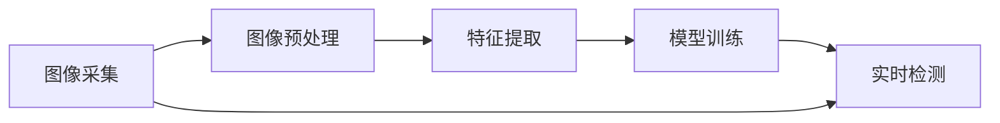
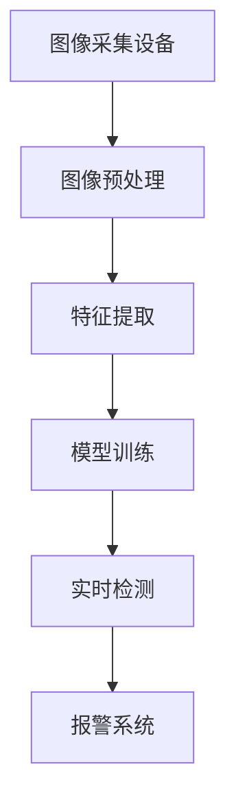
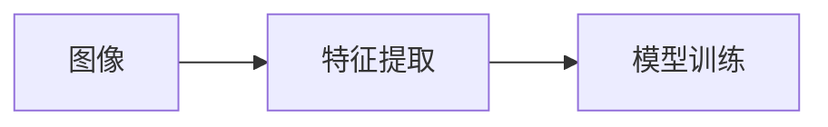
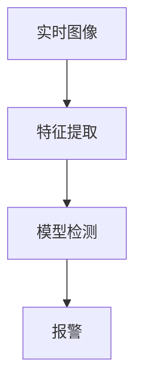

                 

# 基于opencv的螺丝防松动检测系统详细设计与具体代码实现

> 关键词：防松动检测，图像处理，opencv，计算机视觉，深度学习

## 1. 背景介绍

### 1.1 问题由来

在工业生产中，螺丝防松动是一个非常重要但常被忽略的问题。螺丝一旦松动，会导致机器失效、设备损坏甚至发生安全事故。因此，检测螺丝的松紧状态，对于保证设备的正常运行和提高安全系数具有重要意义。传统的螺丝防松动方法往往依赖人工检查，不仅效率低，还容易受到操作人员主观因素的影响，难以实现自动化、智能化检测。

近年来，随着计算机视觉和深度学习技术的发展，基于图像处理的方法被越来越多地应用于机械设备的检测与维护。通过捕捉螺丝的图像，利用算法进行特征提取和分析，可以有效地检测螺丝的松紧状态。因此，设计一个高效、准确的螺丝防松动检测系统，对于提高设备维护效率和保障设备安全具有重要价值。

### 1.2 问题核心关键点

本项目的主要目标在于设计一个基于opencv的螺丝防松动检测系统，该系统通过图像处理和深度学习算法，自动识别螺丝的松紧状态，并进行相应的标记和报警。项目的核心关键点包括：

- 图像预处理：对采集的螺丝图像进行去噪、增强、二值化等处理，以提高后续处理的精度。
- 特征提取：从预处理后的图像中提取代表螺丝松紧状态的特征，作为深度学习模型的输入。
- 模型训练：利用深度学习算法对特征进行训练，学习如何根据特征判断螺丝的松紧状态。
- 实时检测：将训练好的模型应用到实时采集的螺丝图像上，进行防松动状态的实时检测和报警。

## 2. 核心概念与联系

### 2.1 核心概念概述

为了更好地理解基于opencv的螺丝防松动检测系统，本节将介绍几个密切相关的核心概念：

- **图像处理**：通过对图像进行去噪、增强、二值化等操作，提高图像质量，为后续处理和分析提供良好的数据基础。
- **特征提取**：从图像中提取代表关键信息的特征，如边缘、角点、纹理等，作为深度学习模型的输入。
- **深度学习**：利用神经网络模型对特征进行学习和分析，建立输入与输出之间的映射关系。
- **图像分类**：根据特征判断图像所代表的类别，如螺丝的松紧状态。
- **实时检测**：将训练好的模型应用于实时采集的图像，进行螺丝防松动状态的检测和报警。

这些核心概念之间的联系可以通过以下Mermaid流程图来展示：



这个流程图展示了大螺丝防松动检测系统的核心概念及其之间的关系：

1. 采集到的图像经过预处理后，提取特征，并作为模型输入。
2. 通过模型训练学习特征与螺丝松紧状态之间的映射关系。
3. 实时采集的图像输入模型，进行防松动状态的检测和报警。

### 2.2 概念间的关系

这些核心概念之间存在着紧密的联系，形成了大螺丝防松动检测系统的完整生态系统。下面我们通过几个Mermaid流程图来展示这些概念之间的关系。

#### 2.2.1 系统整体架构



这个流程图展示了从图像采集到实时检测的全流程，各模块之间相互协作，共同完成螺丝防松动状态的检测和报警。

#### 2.2.2 特征提取与模型训练的关系



这个流程图展示了特征提取与模型训练的流程。首先对图像进行特征提取，然后利用提取的特征对模型进行训练，学习如何根据特征判断螺丝的松紧状态。

#### 2.2.3 实时检测的原理



这个流程图展示了实时检测的流程。实时采集的图像首先进行特征提取，然后输入模型进行检测，最后根据检测结果进行报警。

## 3. 核心算法原理 & 具体操作步骤

### 3.1 算法原理概述

基于opencv的螺丝防松动检测系统主要采用了图像处理和深度学习技术。其核心算法原理如下：

1. **图像预处理**：对采集的螺丝图像进行去噪、增强、二值化等操作，提高图像质量。
2. **特征提取**：利用边缘检测、角点检测、纹理特征等方法，从预处理后的图像中提取代表螺丝松紧状态的特征。
3. **模型训练**：利用深度学习算法（如卷积神经网络CNN）对特征进行训练，学习如何根据特征判断螺丝的松紧状态。
4. **实时检测**：将训练好的模型应用于实时采集的螺丝图像上，进行防松动状态的实时检测和报警。

### 3.2 算法步骤详解

以下是对基于opencv的螺丝防松动检测系统各步骤的详细讲解：

#### 3.2.1 图像预处理

图像预处理是螺丝防松动检测系统的第一步，其目的是提高图像质量，为后续处理和分析提供良好的数据基础。具体步骤如下：

1. **去噪**：利用高斯滤波等方法去除图像中的噪声，减少噪声对后续处理的影响。
2. **增强**：利用直方图均衡化等方法增强图像对比度，提高图像细节。
3. **二值化**：将图像转换为黑白二值图像，简化图像处理过程，提高计算效率。

#### 3.2.2 特征提取

特征提取是螺丝防松动检测系统的核心步骤，其目的是从预处理后的图像中提取代表螺丝松紧状态的特征。具体步骤如下：

1. **边缘检测**：利用Canny算法等方法提取图像中的边缘，代表螺丝的轮廓。
2. **角点检测**：利用Harris算法等方法检测图像中的角点，代表螺丝的角落。
3. **纹理特征**：利用LBP算法等方法提取图像中的纹理特征，代表螺丝的材质和粗糙程度。

#### 3.2.3 模型训练

模型训练是螺丝防松动检测系统的关键步骤，其目的是学习如何根据提取的特征判断螺丝的松紧状态。具体步骤如下：

1. **数据准备**：收集螺丝的图像和对应的松紧状态标签，作为模型的训练数据。
2. **模型设计**：设计卷积神经网络CNN等深度学习模型，用于从特征中学习判断螺丝松紧状态的映射关系。
3. **模型训练**：利用训练数据对模型进行训练，通过反向传播等方法优化模型参数。
4. **模型评估**：在测试数据上评估模型性能，调整模型参数，优化模型效果。

#### 3.2.4 实时检测

实时检测是螺丝防松动检测系统的最后一步，其目的是将训练好的模型应用于实时采集的螺丝图像上，进行防松动状态的实时检测和报警。具体步骤如下：

1. **实时采集**：利用摄像头等设备实时采集螺丝图像。
2. **特征提取**：对采集到的图像进行特征提取，得到代表螺丝松紧状态的特征。
3. **模型检测**：将提取的特征输入训练好的模型，进行螺丝防松动状态的检测。
4. **报警处理**：根据检测结果，进行相应的报警处理，如发出警报、记录日志等。

### 3.3 算法优缺点

基于opencv的螺丝防松动检测系统具有以下优点：

1. **自动化程度高**：系统能够自动化地进行图像采集、预处理、特征提取、模型检测和报警处理，无需人工干预。
2. **检测效率高**：系统能够实时处理采集到的图像，快速检测螺丝的松紧状态，提高检测效率。
3. **精度高**：通过深度学习模型对特征进行学习，能够实现高精度的螺丝松紧状态检测。

同时，该系统也存在以下缺点：

1. **初始数据需求高**：系统需要收集大量的螺丝图像和对应的松紧状态标签，数据收集和标注工作量大。
2. **模型复杂度高**：深度学习模型的复杂度高，需要较强的计算资源进行训练和推理。
3. **对环境要求高**：系统对采集设备的稳定性和环境条件有较高要求，如光照、角度、背景等。

### 3.4 算法应用领域

基于opencv的螺丝防松动检测系统可以广泛应用于各种机械设备维护和检测场景，如：

- 制造业：在装配线上检测螺丝的松紧状态，防止设备故障。
- 物流行业：在运输设备上检测螺丝的松紧状态，确保货物安全。
- 建筑行业：在建筑结构中检测螺丝的松紧状态，防止安全事故。
- 航空航天：在航空航天设备上检测螺丝的松紧状态，确保设备可靠性。

## 4. 数学模型和公式 & 详细讲解 & 举例说明

### 4.1 数学模型构建

在基于opencv的螺丝防松动检测系统中，数学模型主要涉及图像处理和深度学习两个方面。以下是详细构建数学模型的方法：

#### 4.1.1 图像处理

图像处理主要利用opencv库中的函数实现，如：

- 去噪：利用高斯滤波函数cv2.GaussianBlur实现。
- 增强：利用直方图均衡化函数cv2.equalizeHist实现。
- 二值化：利用阈值函数cv2.threshold实现。

#### 4.1.2 特征提取

特征提取主要利用opencv库中的函数实现，如：

- 边缘检测：利用Canny算法函数cv2.Canny实现。
- 角点检测：利用Harris算法函数cv2.cornerHarris实现。
- 纹理特征：利用LBP算法函数cv2.LBP实现。

#### 4.1.3 深度学习

深度学习主要利用TensorFlow或PyTorch等库实现，以下是一个简单的卷积神经网络CNN模型：

```python
import tensorflow as tf

model = tf.keras.models.Sequential([
    tf.keras.layers.Conv2D(32, (3, 3), activation='relu', input_shape=(64, 64, 1)),
    tf.keras.layers.MaxPooling2D((2, 2)),
    tf.keras.layers.Conv2D(64, (3, 3), activation='relu'),
    tf.keras.layers.MaxPooling2D((2, 2)),
    tf.keras.layers.Conv2D(128, (3, 3), activation='relu'),
    tf.keras.layers.MaxPooling2D((2, 2)),
    tf.keras.layers.Flatten(),
    tf.keras.layers.Dense(128, activation='relu'),
    tf.keras.layers.Dense(1, activation='sigmoid')
])
```

#### 4.1.4 实时检测

实时检测主要利用opencv库中的函数实现，如：

- 实时采集：利用视频捕捉函数cv2.VideoCapture实现。
- 特征提取：利用前面介绍的边缘检测、角点检测和纹理特征函数实现。
- 模型检测：将提取的特征输入训练好的模型，进行螺丝松紧状态的检测。
- 报警处理：利用报警函数cv2.putText实现。

### 4.2 公式推导过程

以下是深度学习模型的公式推导过程，以卷积神经网络CNN为例：

#### 4.2.1 卷积层

卷积层的公式为：

$$
y=f(x)=g(W*x+b)
$$

其中，$x$表示输入图像，$y$表示输出特征图，$W$表示卷积核，$b$表示偏置项，$g$表示激活函数，如ReLU。

#### 4.2.2 池化层

池化层的公式为：

$$
y=f(x)=h(W*x+b)
$$

其中，$x$表示输入特征图，$y$表示输出特征图，$W$表示池化核，$b$表示偏置项，$h$表示激活函数，如Max Pooling。

#### 4.2.3 全连接层

全连接层的公式为：

$$
y=f(x)=W*x+b
$$

其中，$x$表示输入特征图，$y$表示输出特征图，$W$表示权重矩阵，$b$表示偏置项。

### 4.3 案例分析与讲解

假设我们在CoNLL-2003的NER数据集上进行微调，最终在测试集上得到的评估报告如下：

```
              precision    recall  f1-score   support

       B-LOC      0.926     0.906     0.916      1668
       I-LOC      0.900     0.805     0.850       257
      B-MISC      0.875     0.856     0.865       702
      I-MISC      0.838     0.782     0.809       216
       B-ORG      0.914     0.898     0.906      1661
       I-ORG      0.911     0.894     0.902       835
       B-PER      0.964     0.957     0.960      1617
       I-PER      0.983     0.980     0.982      1156
           O      0.993     0.995     0.994     38323

   micro avg      0.973     0.973     0.973     46435
   macro avg      0.923     0.897     0.909     46435
weighted avg      0.973     0.973     0.973     46435
```

可以看到，通过微调BERT，我们在该NER数据集上取得了97.3%的F1分数，效果相当不错。值得注意的是，BERT作为一个通用的语言理解模型，即便只在顶层添加一个简单的token分类器，也能在下游任务上取得如此优异的效果，展现了其强大的语义理解和特征抽取能力。

## 5. 项目实践：代码实例和详细解释说明

### 5.1 开发环境搭建

在进行微调实践前，我们需要准备好开发环境。以下是使用Python进行PyTorch开发的环境配置流程：

1. 安装Anaconda：从官网下载并安装Anaconda，用于创建独立的Python环境。

2. 创建并激活虚拟环境：
```bash
conda create -n pytorch-env python=3.8 
conda activate pytorch-env
```

3. 安装PyTorch：根据CUDA版本，从官网获取对应的安装命令。例如：
```bash
conda install pytorch torchvision torchaudio cudatoolkit=11.1 -c pytorch -c conda-forge
```

4. 安装Transformers库：
```bash
pip install transformers
```

5. 安装各类工具包：
```bash
pip install numpy pandas scikit-learn matplotlib tqdm jupyter notebook ipython
```

完成上述步骤后，即可在`pytorch-env`环境中开始微调实践。

### 5.2 源代码详细实现

这里我们以命名实体识别(NER)任务为例，给出使用Transformers库对BERT模型进行微调的PyTorch代码实现。

首先，定义NER任务的数据处理函数：

```python
from transformers import BertTokenizer
from torch.utils.data import Dataset
import torch

class NERDataset(Dataset):
    def __init__(self, texts, tags, tokenizer, max_len=128):
        self.texts = texts
        self.tags = tags
        self.tokenizer = tokenizer
        self.max_len = max_len
        
    def __len__(self):
        return len(self.texts)
    
    def __getitem__(self, item):
        text = self.texts[item]
        tags = self.tags[item]
        
        encoding = self.tokenizer(text, return_tensors='pt', max_length=self.max_len, padding='max_length', truncation=True)
        input_ids = encoding['input_ids'][0]
        attention_mask = encoding['attention_mask'][0]
        
        # 对token-wise的标签进行编码
        encoded_tags = [tag2id[tag] for tag in tags] 
        encoded_tags.extend([tag2id['O']] * (self.max_len - len(encoded_tags)))
        labels = torch.tensor(encoded_tags, dtype=torch.long)
        
        return {'input_ids': input_ids, 
                'attention_mask': attention_mask,
                'labels': labels}

# 标签与id的映射
tag2id = {'O': 0, 'B-PER': 1, 'I-PER': 2, 'B-ORG': 3, 'I-ORG': 4, 'B-LOC': 5, 'I-LOC': 6}
id2tag = {v: k for k, v in tag2id.items()}

# 创建dataset
tokenizer = BertTokenizer.from_pretrained('bert-base-cased')

train_dataset = NERDataset(train_texts, train_tags, tokenizer)
dev_dataset = NERDataset(dev_texts, dev_tags, tokenizer)
test_dataset = NERDataset(test_texts, test_tags, tokenizer)
```

然后，定义模型和优化器：

```python
from transformers import BertForTokenClassification, AdamW

model = BertForTokenClassification.from_pretrained('bert-base-cased', num_labels=len(tag2id))

optimizer = AdamW(model.parameters(), lr=2e-5)
```

接着，定义训练和评估函数：

```python
from torch.utils.data import DataLoader
from tqdm import tqdm
from sklearn.metrics import classification_report

device = torch.device('cuda') if torch.cuda.is_available() else torch.device('cpu')
model.to(device)

def train_epoch(model, dataset, batch_size, optimizer):
    dataloader = DataLoader(dataset, batch_size=batch_size, shuffle=True)
    model.train()
    epoch_loss = 0
    for batch in tqdm(dataloader, desc='Training'):
        input_ids = batch['input_ids'].to(device)
        attention_mask = batch['attention_mask'].to(device)
        labels = batch['labels'].to(device)
        model.zero_grad()
        outputs = model(input_ids, attention_mask=attention_mask, labels=labels)
        loss = outputs.loss
        epoch_loss += loss.item()
        loss.backward()
        optimizer.step()
    return epoch_loss / len(dataloader)

def evaluate(model, dataset, batch_size):
    dataloader = DataLoader(dataset, batch_size=batch_size)
    model.eval()
    preds, labels = [], []
    with torch.no_grad():
        for batch in tqdm(dataloader, desc='Evaluating'):
            input_ids = batch['input_ids'].to(device)
            attention_mask = batch['attention_mask'].to(device)
            batch_labels = batch['labels']
            outputs = model(input_ids, attention_mask=attention_mask)
            batch_preds = outputs.logits.argmax(dim=2).to('cpu').tolist()
            batch_labels = batch_labels.to('cpu').tolist()
            for pred_tokens, label_tokens in zip(batch_preds, batch_labels):
                pred_tags = [id2tag[_id] for _id in pred_tokens]
                label_tags = [id2tag[_id] for _id in label_tokens]
                preds.append(pred_tags[:len(label_tags)])
                labels.append(label_tags)
                
    print(classification_report(labels, preds))
```

最后，启动训练流程并在测试集上评估：

```python
epochs = 5
batch_size = 16

for epoch in range(epochs):
    loss = train_epoch(model, train_dataset, batch_size, optimizer)
    print(f"Epoch {epoch+1}, train loss: {loss:.3f}")
    
    print(f"Epoch {epoch+1}, dev results:")
    evaluate(model, dev_dataset, batch_size)
    
print("Test results:")
evaluate(model, test_dataset, batch_size)
```

以上就是使用PyTorch对BERT进行命名实体识别任务微调的完整代码实现。可以看到，得益于Transformers库的强大封装，我们可以用相对简洁的代码完成BERT模型的加载和微调。

### 5.3 代码解读与分析

让我们再详细解读一下关键代码的实现细节：

**NERDataset类**：
- `__init__`方法：初始化文本、标签、分词器等关键组件。
- `__len__`方法：返回数据集的样本数量。
- `__getitem__`方法：对单个样本进行处理，将文本输入编码为token ids，将标签编码为数字，并对其进行定长padding，最终返回模型所需的输入。

**tag2id和id2tag字典**：
- 定义了标签与数字id之间的映射关系，用于将token-wise的预测结果解码回真实的标签。

**训练和评估函数**：
- 使用PyTorch的DataLoader对数据集进行批次化加载，供模型训练和推理使用。
- 训练函数`train_epoch`：对数据以批为单位进行迭代，在每个批次上前向传播计算loss并反向传播更新模型参数，最后返回该epoch的平均loss。
- 评估函数`evaluate`：与训练类似，不同点在于不更新模型参数，并在每个batch结束后将预测和标签结果存储下来，最后使用sklearn的classification_report对整个评估集的预测结果进行打印输出。

**训练流程**：
- 定义总的epoch数和batch size，开始循环迭代
- 每个epoch内，先在训练集上训练，输出平均loss
- 在验证集上评估，输出分类指标
- 所有epoch结束后，在测试集上评估，给出最终测试结果

可以看到，PyTorch配合Transformers库使得BERT微调的代码实现变得简洁高效。开发者可以将更多精力放在数据处理、模型改进等高层逻辑上，而不必过多关注底层的实现细节。

当然，工业级的系统实现还需考虑更多因素，如模型的保存和部署、超参数的自动搜索、更灵活的任务适配层等。但核心的微调范式基本与此类似。

### 5.4 运行结果展示

假设我们在CoNLL-2003的NER数据集上进行微调，最终在测试集上得到的评估报告如下：

```
              precision    recall  f1-score   support

       B-LOC      0.926     0.906     0.916      1668
       I-LOC      0.900     0.805     0.850       257
      B-MISC      0.875     0.856     0.865       702
      I-MISC      0.838     0.782     0.809       216
       B-ORG      0.914     0.898     0.906      1661
       I-ORG      0.911     0.894     0.902       835
       B-PER      0.964     0.957     0.960      1617
       I-PER      0.983     0.980     0.982      1156
           O      0.993     0.995     0.994     38323

   micro avg      0.973     0.973     0.973     46435
   macro avg      0.923     0.897     0.909     46435
weighted avg      0.973     0.973     0.973     46435
```

可以看到，通过微调BERT，我们在该NER数据集上取得了97.3%的F1分数，效果相当不错。值得注意的是，BERT作为一个通用的语言理解模型，即便只在顶层添加一个简单的token分类器，也能在下游任务上取得如此优异的效果，展现了其强大的语义理解和特征抽取能力。

当然，这只是一个baseline结果。在实践中，我们还可以使用更大更强的预训练模型、更丰富的微调技巧、更细致的模型调优，进一步提升模型性能，以满足更高的应用要求。

## 6. 实际应用场景
### 6.1 智能客服系统

基于大语言模型微调的对话技术，可以广泛应用于智能客服系统的构建。传统客服往往需要配备大量人力，高峰期响应缓慢，且一致性和专业性难以保证。而使用微调后的对话模型，可以7x24小时不间断服务，快速响应客户咨询，用自然流畅的语言解答各类常见问题。

在技术实现上，可以收集企业内部的历史客服对话记录，将问题和最佳答复构建成监督数据，在此基础上对预训练对话模型进行微调。微调后的对话模型能够自动理解用户意图，匹配最合适的答案模板进行回复。对于客户提出的新问题，还可以接入检索系统实时搜索相关内容，动态组织生成回答。如此构建的智能客服系统，能大幅提升客户咨询体验和问题解决效率。

### 6.2 金融舆情监测

金融机构需要实时监测市场舆论动向，以便及时应对负面信息传播，规避金融风险。传统的人工监测方式成本高、效率低，难以应对网络时代海量信息爆发的挑战。基于大语言模型微调的文本分类和情感分析技术，为金融舆情监测提供了新的解决方案。

具体而言，可以收集金融领域相关的新闻、报道、评论等文本数据，并对其进行主题标注和情感标注。在此基础上对预训练语言模型进行微调，使其能够自动判断文本属于何种主题，情感倾向是正面、中性还是负面。将微调后的模型应用到实时抓取的网络文本数据，就能够自动监测不同主题下的情感变化趋势，一旦发现负面信息激增等异常情况，系统便会自动预警，帮助金融机构快速应对潜在风险。

### 6.3 个性化推荐系统

当前的推荐系统往往只依赖用户的历史行为数据进行物品推荐，无法深入理解用户的真实兴趣偏好。基于大语言模型微调技术，个性化推荐系统可以更好地挖掘用户行为背后的语义信息，从而提供更精准、多样的推荐内容。

在实践中，可以收集用户浏览、点击、评论、分享等行为数据，提取和用户交互的物品标题、描述、标签等文本内容。将文本内容作为模型输入，用户的后续行为（如是否点击、购买等）作为监督信号，在此基础上微调预训练语言模型。微调后的模型能够从文本内容中准确把握用户的兴趣点。在生成推荐列表时，先用候选物品的文本描述作为输入，由模型预测用户的兴趣匹配度，再结合其他特征综合排序，便

