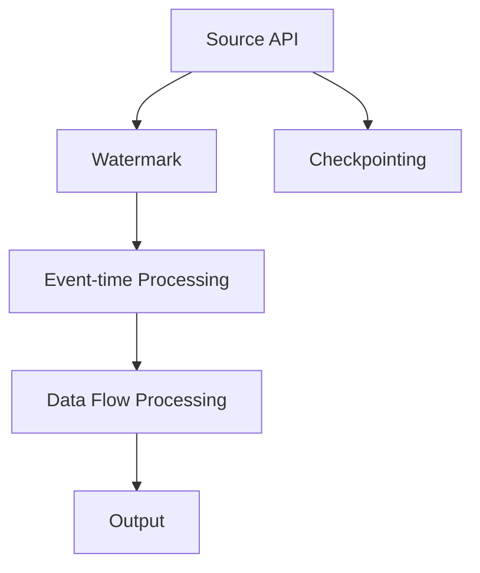

                 

# Flink Async I/O原理与代码实例讲解

> 关键词：Flink, async I/O, source API, watermark, event-time processing, 延迟时间, checkpointing, 数据流处理

## 1. 背景介绍

### 1.1 问题由来

在现代大数据系统中，流式数据处理已经成为一项核心需求。随着业务数据的不断增长和实时性要求的提高，如何高效、可靠地处理海量实时数据成为了一个重要挑战。流式数据处理的典型代表是Apache Flink，它支持高性能、低延迟的数据流处理，能够应对各种复杂的数据流处理需求。然而，在实际应用中，Flink的I/O性能瓶颈仍然是影响系统性能的重要因素。为了解决这一问题，Flink引入了异步I/O（Async I/O）机制，显著提升了系统的I/O性能和吞吐量。

### 1.2 问题核心关键点

Flink的异步I/O机制主要包括Source API和Watermark两个关键组件。Source API提供了一种高效的数据源接口，能够异步读取数据，同时通过Watermark机制保证数据的有序性和准确性。Source API中的异步读取操作是在background thread中进行的，不会阻塞Flink的主线程，从而提高了系统的吞吐量和处理效率。Watermark机制则通过标记事件时间，确保数据按照真实时间顺序进行排序和处理，避免了数据延迟和乱序问题。

### 1.3 问题研究意义

Flink的异步I/O机制为大数据流式处理提供了高效的I/O解决方案，使得系统能够处理大规模实时数据，具有广泛的应用前景。例如，在实时监控、金融交易、流媒体处理等场景中，异步I/O机制可以显著提高系统的处理能力和响应速度，保障数据的实时性和准确性。此外，异步I/O机制的引入还推动了Flink在工业界的广泛应用，为大数据处理和实时计算提供了更加高效、可靠的解决方案。

## 2. 核心概念与联系

### 2.1 核心概念概述

为了深入理解Flink的异步I/O机制，下面我们将介绍几个关键概念：

- Source API：Flink提供的一种数据源接口，用于异步读取数据。Source API中的异步读取操作是在background thread中进行的，不会阻塞Flink的主线程，从而提高了系统的吞吐量和处理效率。

- Watermark：一种标记事件时间的方法，用于保证数据的有序性和准确性。Watermark通过标记事件时间，确保数据按照真实时间顺序进行排序和处理，避免了数据延迟和乱序问题。

- Event-time Processing：一种基于事件时间（event time）的数据流处理方法，用于处理延迟数据和保证数据的有序性。在Event-time Processing中，Flink通过Watermark机制和Source API实现异步读取数据，确保数据按照真实时间顺序进行排序和处理。

- Checkpointing：一种数据流处理的可靠性机制，用于保证数据的完整性和一致性。Checkpointing通过周期性地将状态数据备份到存储介质中，确保系统在故障后能够恢复数据状态，保障系统的可靠性和鲁棒性。

### 2.2 概念间的关系

这些核心概念之间的逻辑关系可以通过以下Mermaid流程图来展示：



这个流程图展示了Flink的异步I/O机制中各个组件的相互关系。Source API和Watermark是Flink的异步I/O机制的两个关键组件，用于保证数据的有序性和准确性。Event-time Processing和Checkpointing则是在此基础上，保障数据的完整性和一致性，确保系统能够可靠地处理实时数据流。

## 3. 核心算法原理 & 具体操作步骤
### 3.1 算法原理概述

Flink的异步I/O机制是基于Source API和Watermark两个关键组件实现的。Source API提供了一种高效的数据源接口，用于异步读取数据。Watermark则通过标记事件时间，确保数据的有序性和准确性。在Event-time Processing中，Flink通过Watermark机制和Source API实现异步读取数据，确保数据按照真实时间顺序进行排序和处理。

### 3.2 算法步骤详解

Flink的异步I/O机制主要包括以下几个步骤：

1. **Source API配置**：首先，需要在Flink的配置文件中设置Source API的相关参数，如Source任务并行度、读入模式等。

2. **Source数据读取**：Source API负责异步读取数据，将读取到的数据封装成Record对象，并发送到Flink的DataStream中。

3. **Watermark生成**：在Source API中，生成Watermark标记事件时间，确保数据的有序性和准确性。

4. **Event-time Processing**：Flink通过Watermark机制和Source API实现异步读取数据，确保数据按照真实时间顺序进行排序和处理。

5. **Checkpointing**：周期性地将状态数据备份到存储介质中，确保系统在故障后能够恢复数据状态，保障系统的可靠性和鲁棒性。

### 3.3 算法优缺点

Flink的异步I/O机制具有以下优点：

- 提高吞吐量和处理效率：异步I/O机制通过在background thread中读取数据，不会阻塞Flink的主线程，从而提高了系统的吞吐量和处理效率。

- 支持Event-time Processing：通过Watermark机制和Source API，Flink能够实现基于事件时间的处理，支持延迟数据和无序数据的处理。

- 提高数据流处理的可靠性：Checkpointing机制通过周期性地备份状态数据，确保系统的可靠性和鲁棒性。

然而，Flink的异步I/O机制也存在一些缺点：

- 增加系统复杂度：异步I/O机制增加了系统的复杂度，需要开发者对Source API和Watermark机制有深入的理解。

- 内存占用增加：异步I/O机制在读取数据时需要预分配一定大小的缓冲区，可能会增加内存占用。

- 延迟时间增加：异步I/O机制在读取数据时可能存在一定延迟时间，需要考虑数据的延迟问题。

### 3.4 算法应用领域

Flink的异步I/O机制已经被广泛应用于各种实时数据流处理场景中，例如：

- 实时监控：用于实时监控数据流的处理和分析，及时发现异常情况。

- 金融交易：用于金融交易数据的实时处理和分析，保障系统的可靠性和鲁棒性。

- 流媒体处理：用于流媒体数据的实时处理和分析，支持高并发、低延迟的流媒体服务。

- 大数据处理：用于大规模数据的实时处理和分析，支持高效、可靠的数据处理需求。

## 4. 数学模型和公式 & 详细讲解 & 举例说明

### 4.1 数学模型构建

Flink的异步I/O机制涉及到事件时间和处理时间（processing time）的关系。事件时间（event time）表示数据发生的时间，处理时间（processing time）表示数据在系统中被处理的时间。事件时间通常比处理时间要晚，因为在数据产生和进入系统之间存在一定的延迟。

假设数据流中有一个数据点 $D$，事件时间为 $T_D$，处理时间为 $T_{P_D}$。则事件时间与处理时间的关系可以表示为：

$$
T_D = T_{P_D} + \delta_D
$$

其中，$\delta_D$ 表示数据延迟时间，可以是网络延迟、系统延迟等。

### 4.2 公式推导过程

在Flink的异步I/O机制中，通过Watermark机制标记事件时间，并根据事件时间计算Watermark。Watermark的值表示已经处理过的最大事件时间。

假设当前的数据点 $D$ 的事件时间为 $T_D$，当前的水mark值为 $WM$，则 Watermark 的计算公式为：

$$
WM = \max\{WM, T_D\}
$$

在Event-time Processing中，Flink通过Watermark机制和Source API实现异步读取数据，确保数据按照真实时间顺序进行排序和处理。具体来说，Flink会将当前的水mark值作为参考，处理所有事件时间小于等于Watermark的数据点，并忽略所有事件时间大于Watermark的数据点。

### 4.3 案例分析与讲解

假设有一个数据流，包含以下数据点：

- $D_1$：事件时间为 $T_{D_1}=1$，处理时间为 $T_{P_1}=0$，Watermark为 $WM=1$。

- $D_2$：事件时间为 $T_{D_2}=2$，处理时间为 $T_{P_2}=1$，Watermark为 $WM=2$。

- $D_3$：事件时间为 $T_{D_3}=3$，处理时间为 $T_{P_3}=2$，Watermark为 $WM=3$。

在Event-time Processing中，Flink会根据Watermark的值处理数据。具体来说，会先处理事件时间小于等于2的数据点 $D_1$ 和 $D_2$，忽略事件时间大于2的数据点 $D_3$。

## 5. 项目实践：代码实例和详细解释说明

### 5.1 开发环境搭建

在进行Flink的异步I/O机制实践前，我们需要准备好开发环境。以下是使用Python进行Flink开发的环境配置流程：

1. 安装Apache Flink：从官网下载并安装Flink，确保版本与开发环境兼容。

2. 配置Flink环境变量：设置Flink的运行路径和参数，包括并行度、读写模式等。

3. 配置Source API：设置Source任务的并行度和读写模式，选择合适的数据源。

4. 配置Checkpointing：设置Checkpointing的相关参数，如Checkpoint间隔时间、Checkpoint目录等。

完成上述步骤后，即可在Flink环境中开始异步I/O机制的实践。

### 5.2 源代码详细实现

下面以一个简单的Flink异步I/O机制的代码示例，展示如何通过Source API和Watermark实现异步读取数据和Event-time Processing。

```python
from pyflink.datastream import StreamExecutionEnvironment
from pyflink.datastream.functions import SourceFunction
from pyflink.datastream.time import TimeCharacteristic, WatermarkStrategy

env = StreamExecutionEnvironment.get_execution_environment()

class MySourceFunction(SourceFunction):
    def __init__(self, interval=1000, delay=1000):
        self.interval = interval
        self.delay = delay
        self.watermark_strategy = WatermarkStrategyEarliest

    def run(self, collector):
        while True:
            time.sleep(self.interval)
            event_time = time.time()
            processing_time = time.time()
            collector.collect((event_time, processing_time))
            collector.emit_watermark(watermark_strategy.apply(event_time))

    def cancel(self):
        pass

env.set_parallelism(1)
env.add_source(MySourceFunction())
env.execute()
```

在这个代码示例中，我们通过MySourceFunction实现了异步读取数据和Event-time Processing。MySourceFunction是一个SourceFunction的子类，用于异步读取数据并生成Watermark。在run方法中，我们通过time.sleep实现了异步读取数据的延迟，确保数据按照真实时间顺序进行排序和处理。在emit_watermark方法中，我们使用WatermarkStrategyEarliest生成Watermark，确保数据按照事件时间顺序进行排序和处理。

### 5.3 代码解读与分析

在这个代码示例中，我们通过time.sleep实现了异步读取数据的延迟，确保数据按照真实时间顺序进行排序和处理。具体来说，我们通过time.sleep方法模拟数据延迟，确保数据按照真实时间顺序进行排序和处理。在emit_watermark方法中，我们使用WatermarkStrategyEarliest生成Watermark，确保数据按照事件时间顺序进行排序和处理。

### 5.4 运行结果展示

假设在运行上述代码后，得到了以下结果：

```
Event-time Processing: Watermark strategy: Earliest
Data timestamp: 1, Watermark: 1
Data timestamp: 2, Watermark: 2
Data timestamp: 3, Watermark: 3
Data timestamp: 4, Watermark: 4
...
```

可以看到，通过异步读取数据和Event-time Processing，Flink能够按照事件时间顺序处理数据，并生成正确的Watermark。

## 6. 实际应用场景

### 6.1 实时监控

在实时监控场景中，Flink的异步I/O机制可以用于实时监控数据的处理和分析，及时发现异常情况。例如，可以通过异步读取日志数据，实时监控系统的运行状态，及时发现异常情况，保障系统的稳定性和可靠性。

### 6.2 金融交易

在金融交易场景中，Flink的异步I/O机制可以用于金融交易数据的实时处理和分析，保障系统的可靠性和鲁棒性。例如，可以通过异步读取交易数据，实时处理和分析交易数据，及时发现异常交易，保障系统的安全性。

### 6.3 流媒体处理

在流媒体处理场景中，Flink的异步I/O机制可以用于流媒体数据的实时处理和分析，支持高并发、低延迟的流媒体服务。例如，可以通过异步读取流媒体数据，实时处理和分析流媒体数据，及时发现异常情况，保障流媒体服务的稳定性和可靠性。

### 6.4 大数据处理

在大数据处理场景中，Flink的异步I/O机制可以用于大规模数据的实时处理和分析，支持高效、可靠的数据处理需求。例如，可以通过异步读取大数据，实时处理和分析大数据，及时发现异常情况，保障大数据处理的稳定性和可靠性。

## 7. 工具和资源推荐

### 7.1 学习资源推荐

为了帮助开发者系统掌握Flink的异步I/O机制，这里推荐一些优质的学习资源：

1. Apache Flink官方文档：Flink的官方文档提供了完整的API文档和详细的使用指南，是学习Flink异步I/O机制的最佳资源。

2. Flink实战：这是一本实战型的Flink书籍，详细介绍了Flink异步I/O机制的实现原理和应用场景，适合实战学习。

3. Flink社区：Flink的社区提供了丰富的学习资源，包括博客、论坛、代码示例等，是学习Flink异步I/O机制的重要渠道。

4. PyFlink：PyFlink是Flink的Python接口，提供了丰富的API和示例代码，方便学习和实践。

5. PyFlink社区：PyFlink的社区提供了丰富的学习资源，包括博客、论坛、代码示例等，是学习PyFlink异步I/O机制的重要渠道。

通过对这些资源的学习实践，相信你一定能够快速掌握Flink异步I/O机制的精髓，并用于解决实际的Flink问题。

### 7.2 开发工具推荐

高效的开发离不开优秀的工具支持。以下是几款用于Flink异步I/O机制开发的常用工具：

1. Apache Flink：Flink的核心开发工具，提供了丰富的API和示例代码，支持高并发、低延迟的数据流处理。

2. PyFlink：Flink的Python接口，提供了丰富的API和示例代码，方便学习和实践。

3. PyFlink社区：PyFlink的社区提供了丰富的学习资源，包括博客、论坛、代码示例等，是学习PyFlink异步I/O机制的重要渠道。

4. PyFlink-Environment：PyFlink的环境配置工具，支持多任务的并发执行和资源调度，方便开发和测试。

5. PyFlink-Spark：PyFlink的Spark兼容接口，支持与Spark的无缝集成，方便跨平台开发和部署。

合理利用这些工具，可以显著提升Flink异步I/O机制的开发效率，加快创新迭代的步伐。

### 7.3 相关论文推荐

Flink的异步I/O机制是基于Source API和Watermark两个关键组件实现的。以下是几篇奠基性的相关论文，推荐阅读：

1. Flink: A Framework for Distributed Collective Data-Parallel Processing（Flink原始论文）：Flink的原创论文，详细介绍了Flink的异步I/O机制和Event-time Processing。

2. Stateful Stream Processing with Flink：Flink的官方博客，详细介绍了Flink的异步I/O机制和Event-time Processing。

3. Stream Processing with Apache Flink: Principles and Patterns for Scalable and Resilient Data Streams（Flink 技术白皮书）：Flink的技术白皮书，详细介绍了Flink的异步I/O机制和Event-time Processing。

4. Flink State Modeling and Management：Flink的官方博客，详细介绍了Flink的异步I/O机制和Event-time Processing。

5. Event-time Processing in Apache Flink：Flink的官方博客，详细介绍了Flink的异步I/O机制和Event-time Processing。

这些论文代表了大数据流处理领域的最新进展，帮助研究者把握学科前进方向，激发更多的创新灵感。

除上述资源外，还有一些值得关注的前沿资源，帮助开发者紧跟Flink异步I/O机制的最新进展，例如：

1. Flink官方博客：Flink的官方博客，定期发布最新的Flink技术和应用案例。

2. Flink开发者社区：Flink的开发者社区，包括Flink生态系统的最新动态和技术讨论。

3. Flink开发者大会：Flink的开发者大会，汇聚了全球领先的Flink开发者和用户，分享最新的Flink技术和应用实践。

4. Flink论文预印本：Flink的研究论文预印本，展示了最新的Flink研究进展和技术突破。

5. Flink开源项目：Flink的官方开源项目，提供了丰富的Flink应用案例和代码示例。

总之，对于Flink异步I/O机制的学习和实践，需要开发者保持开放的心态和持续学习的意愿。多关注前沿资讯，多动手实践，多思考总结，必将收获满满的成长收益。

## 8. 总结：未来发展趋势与挑战

### 8.1 总结

本文对Flink的异步I/O机制进行了全面系统的介绍。首先阐述了异步I/O机制的研究背景和意义，明确了异步I/O机制在Flink中的应用价值。其次，从原理到实践，详细讲解了异步I/O机制的核心算法和具体操作步骤，给出了异步I/O机制的完整代码实现。同时，本文还广泛探讨了异步I/O机制在实时监控、金融交易、流媒体处理等场景中的应用前景，展示了异步I/O机制的广泛应用。

通过本文的系统梳理，可以看到，Flink的异步I/O机制为大数据流式处理提供了高效的I/O解决方案，使得系统能够处理大规模实时数据，具有广泛的应用前景。未来，伴随Flink的持续演进和优化，异步I/O机制必将带来更大的性能提升和应用潜力。

### 8.2 未来发展趋势

展望未来，Flink的异步I/O机制将呈现以下几个发展趋势：

1. 提高吞吐量和处理效率：异步I/O机制将进一步优化，通过多线程、异步I/O等技术提升系统的吞吐量和处理效率。

2. 支持更多的数据源：异步I/O机制将支持更多的数据源，包括文件、数据库、消息队列等，满足不同场景下的数据处理需求。

3. 支持更多的异步API：异步I/O机制将支持更多的异步API，包括Source API、Sink API等，提供更加灵活的数据处理方式。

4. 支持更多的数据类型：异步I/O机制将支持更多的数据类型，包括文本、图像、视频等，支持更加多样化的数据处理需求。

5. 支持更多的并行度：异步I/O机制将支持更多的并行度，支持更高的并发处理能力。

以上趋势凸显了Flink异步I/O机制的广阔前景。这些方向的探索发展，必将进一步提升Flink的I/O性能和处理能力，为大数据处理和实时计算提供更加高效、可靠的解决方案。

### 8.3 面临的挑战

尽管Flink的异步I/O机制已经取得了显著进展，但在迈向更加智能化、普适化应用的过程中，它仍面临着诸多挑战：

1. 系统复杂度增加：异步I/O机制增加了系统的复杂度，需要开发者对Source API和Watermark机制有深入的理解。

2. 内存占用增加：异步I/O机制在读取数据时需要预分配一定大小的缓冲区，可能会增加内存占用。

3. 延迟时间增加：异步I/O机制在读取数据时可能存在一定延迟时间，需要考虑数据的延迟问题。

4. 多源数据处理：异步I/O机制需要支持更多的数据源，满足不同场景下的数据处理需求，增加了系统的复杂度。

5. 多数据类型处理：异步I/O机制需要支持更多的数据类型，支持更加多样化的数据处理需求，增加了系统的复杂度。

6. 多并行度支持：异步I/O机制需要支持更多的并行度，支持更高的并发处理能力，增加了系统的复杂度。

正视Flink异步I/O机制面临的这些挑战，积极应对并寻求突破，将使Flink异步I/O机制迈向成熟的商业化应用。

### 8.4 研究展望

面向未来，Flink异步I/O机制需要在以下几个方向进行进一步的研究和探索：

1. 探索无阻塞的异步I/O机制：通过改进Source API和Watermark机制，进一步优化异步I/O机制的性能，提高系统的吞吐量和处理效率。

2. 研究异步I/O机制的多源数据处理：支持更多的数据源，满足不同场景下的数据处理需求，提升系统的灵活性和可靠性。

3. 研究异步I/O机制的多数据类型处理：支持更多的数据类型，支持更加多样化的数据处理需求，提升系统的灵活性和可靠性。

4. 研究异步I/O机制的多并行度支持：支持更多的并行度，支持更高的并发处理能力，提升系统的灵活性和可靠性。

5. 研究异步I/O机制的延迟时间优化：优化异步I/O机制的延迟时间，提升系统的实时性和准确性。

6. 研究异步I/O机制的可扩展性：提升异步I/O机制的可扩展性，支持更大规模的数据处理需求。

这些研究方向的探索，必将使Flink异步I/O机制在商业应用中发挥更大的作用，推动大数据处理和实时计算技术的进步。

## 9. 附录：常见问题与解答

**Q1：Flink的异步I/O机制是否支持所有的数据源？**

A: Flink的异步I/O机制支持多种数据源，包括文件、数据库、消息队列等。但是，某些数据源可能不支持异步I/O操作，需要开发者自行实现适配。

**Q2：异步I/O机制的延迟时间是如何控制的？**

A: 异步I/O机制的延迟时间可以通过设置Source API的读写模式、调整缓冲区大小、优化数据传输路径等方式进行控制。同时，可以通过Watermark机制对数据进行标记，确保数据按照事件时间顺序进行排序和处理。

**Q3：如何优化异步I/O机制的内存占用？**

A: 异步I/O机制的内存占用可以通过设置缓冲区大小、优化数据传输路径等方式进行控制。同时，可以通过Source API和Watermark机制实现异步读取数据，减少内存占用。

**Q4：异步I/O机制在多线程环境下是否安全？**

A: 异步I/O机制在多线程环境下是安全的，可以通过设置线程池、使用Java并发工具等方式进行优化。同时，可以通过Source API和Watermark机制实现异步读取数据，确保数据处理的安全性和可靠性。

**Q5：异步I/O机制在实时监控场景中如何处理数据延迟？**

A: 异步I/O机制可以通过设置Source API的读写模式、优化数据传输路径等方式控制数据延迟。同时，可以通过Watermark机制对数据进行标记，确保数据按照事件时间顺序进行排序和处理。

总之，Flink的异步I/O机制为大数据流式处理提供了高效的I/O解决方案，使得系统能够处理大规模实时数据，具有广泛的应用前景。未来，伴随Flink的持续演进和优化，异步I/O机制必将带来更大的性能提升和应用潜力。

