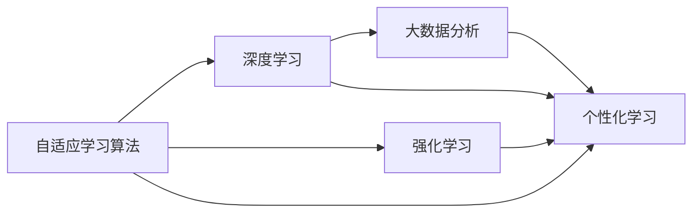

                 

# HeyGen的成功案例与启示

> 关键词：AI驱动个性化学习平台、自适应学习算法、数据驱动学习路径、深度学习、强化学习、大数据分析

## 1. 背景介绍

### 1.1 问题由来
在当今快速变化的数字化时代，教育行业面临着巨大的挑战和机遇。传统的教育模式无法满足个性化学习的需求，学生的学习效率和成绩差异显著。为了应对这一问题，教育技术公司HeyGen开发了一个基于AI驱动的个性化学习平台，该平台利用深度学习和大数据分析技术，为每个学生量身定制学习路径，帮助学生提高学习效果。

HeyGen的个性化学习平台成功地将机器学习和教育技术结合起来，实现了自适应学习和智能辅导，在提高学生学习效率和成绩方面取得了显著成效。本节将详细介绍HeyGen的成功案例，并探讨其背后的技术和算法原理。

### 1.2 问题核心关键点
HeyGen的核心技术围绕以下几个关键点展开：

- AI驱动个性化学习路径：通过深度学习和大数据分析， HeyGen能够自动生成适合每个学生的个性化学习路径。
- 自适应学习算法： HeyGen平台能够根据学生的学习情况动态调整教学内容和难度，提升学习效率。
- 数据驱动学习反馈： HeyGen平台利用大数据分析学生的学习行为和成绩，提供个性化的学习反馈。
- 强化学习： HeyGen平台利用强化学习技术，不断优化学习路径和教学方法，提高学习效果。
- 实时监控与调整： HeyGen平台能够实时监控学生的学习状态，并根据数据反馈进行动态调整，确保学习效果最大化。

这些关键技术构成了HeyGen平台的核心竞争力，使其在个性化学习领域取得了显著成果。

### 1.3 问题研究意义
HeyGen的成功案例对于推动教育技术的发展具有重要意义：

- 降低教育成本： HeyGen平台能够为学生提供个性化学习路径，减少对传统教育的依赖，降低教育成本。
- 提高学习效果： HeyGen平台的自适应学习算法和强化学习技术能够显著提高学生的学习效率和成绩。
- 推动教育公平： HeyGen平台的个性化学习路径能够帮助每个学生发挥其潜力，促进教育公平。
- 加速教育数字化转型： HeyGen平台的应用展示了教育技术在数字化转型中的潜力，推动整个行业的数字化进程。

## 2. 核心概念与联系

### 2.1 核心概念概述

为了深入理解HeyGen的成功案例，我们需要明确几个核心概念及其联系：

- 自适应学习算法：一种根据学生的学习情况动态调整教学内容和难度的算法。
- 深度学习：一种基于神经网络的机器学习方法，能够处理复杂的数据结构和任务。
- 强化学习：一种通过试错反馈不断优化决策策略的学习方法。
- 大数据分析：一种利用大规模数据集进行统计分析和决策支持的技术。
- 个性化学习：一种根据学生的需求和能力量身定制学习路径和内容的教育模式。

这些核心概念构成了HeyGen平台的核心技术架构，下面将通过Mermaid流程图展示它们之间的联系。



### 2.2 概念间的关系

自适应学习算法、深度学习、强化学习和数据分析都是实现个性化学习的重要技术手段。自适应学习算法通过深度学习和强化学习技术，动态调整教学内容和难度，提升学习效果。大数据分析则提供了强大的数据支持，帮助算法更好地理解学生的学习行为和成绩，进而提供个性化的学习反馈和路径。这些技术的综合应用，使得HeyGen平台能够为每个学生量身定制最佳的学习路径。

## 3. 核心算法原理 & 具体操作步骤
### 3.1 算法原理概述

HeyGen平台的个性化学习路径生成过程，涉及以下几个关键算法原理：

- 自适应学习算法：利用深度学习模型预测学生的学习能力和需求，动态调整教学内容和难度。
- 强化学习：通过不断试错反馈，优化教学路径和教学策略，提升学习效果。
- 大数据分析：利用学生的学习行为和成绩数据，进行统计分析和趋势预测，提供个性化的学习反馈。
- 深度学习：利用神经网络模型，处理复杂的数据结构和任务，提高模型的预测准确性。

这些算法原理构成了HeyGen平台的核心技术基础，下面将详细介绍各算法的具体步骤和操作方法。

### 3.2 算法步骤详解

#### 3.2.1 自适应学习算法
自适应学习算法主要包括以下几个步骤：

1. **数据采集**：采集学生的学习数据，包括作业成绩、测试成绩、学习时间、互动次数等。
2. **数据预处理**：对采集到的数据进行清洗、归一化和特征提取。
3. **深度学习模型训练**：利用深度学习模型（如LSTM、GRU等）对学生学习数据进行建模，预测学生的学习能力和需求。
4. **动态调整**：根据深度学习模型的预测结果，动态调整教学内容和难度，提升学习效果。

#### 3.2.2 强化学习
强化学习算法主要包括以下几个步骤：

1. **环境设计**：定义学习任务的环境，包括学生的学习状态、学习目标和奖励机制。
2. **模型训练**：利用强化学习算法（如Q-learning、SARSA等）训练教学模型，优化教学策略。
3. **试错反馈**：在实际学习过程中，不断进行试错反馈，优化教学策略。
4. **效果评估**：根据学习效果评估教学策略的有效性，不断进行优化。

#### 3.2.3 大数据分析
大数据分析主要包括以下几个步骤：

1. **数据收集**：收集学生的学习行为和成绩数据。
2. **数据清洗**：对收集到的数据进行清洗、去重和异常值处理。
3. **数据建模**：利用统计分析和机器学习技术，对学生数据进行建模和预测。
4. **趋势分析**：分析学生的学习行为和成绩趋势，提供个性化的学习反馈和路径。

#### 3.2.4 深度学习
深度学习算法主要包括以下几个步骤：

1. **数据预处理**：对输入数据进行清洗、归一化和特征提取。
2. **模型设计**：设计合适的神经网络模型，如卷积神经网络（CNN）、循环神经网络（RNN）等。
3. **模型训练**：利用训练数据对深度学习模型进行训练，优化模型参数。
4. **模型评估**：利用测试数据对深度学习模型进行评估，验证模型的预测准确性。

### 3.3 算法优缺点

#### 3.3.1 自适应学习算法
- **优点**：
  - 能够动态调整教学内容和难度，提高学习效果。
  - 利用深度学习模型，能够处理复杂的数据结构和任务。
  - 能够根据学生的学习情况进行个性化调整。
  
- **缺点**：
  - 数据采集和预处理过程较为繁琐，需要大量时间。
  - 深度学习模型的训练需要较长的计算时间和资源。
  - 模型的复杂度较高，容易过拟合。

#### 3.3.2 强化学习
- **优点**：
  - 能够不断优化教学策略，提高学习效果。
  - 通过试错反馈，能够更好地适应学生的学习需求。
  - 不需要大量的标注数据，能够自动学习教学策略。

- **缺点**：
  - 算法复杂度较高，需要较强的计算资源。
  - 需要大量的试错过程，训练时间较长。
  - 需要精心设计环境，才能获得较好的学习效果。

#### 3.3.3 大数据分析
- **优点**：
  - 能够提供丰富的数据分析结果，指导教学策略。
  - 利用统计分析技术，能够快速处理大量数据。
  - 能够提供实时的数据反馈，进行动态调整。

- **缺点**：
  - 数据隐私和安全问题需要特别注意。
  - 数据质量对分析结果影响较大，需要严格的数据清洗。
  - 分析结果的解释性较差，难以理解模型的决策过程。

#### 3.3.4 深度学习
- **优点**：
  - 能够处理复杂的数据结构和任务，提高预测准确性。
  - 利用神经网络模型，能够自动学习特征表示。
  - 能够处理大规模数据集，具有较强的泛化能力。

- **缺点**：
  - 模型复杂度较高，训练和推理速度较慢。
  - 需要大量的训练数据，数据采集成本较高。
  - 模型的解释性较差，难以理解模型的决策过程。

### 3.4 算法应用领域

HeyGen平台的自适应学习算法、深度学习、强化学习和大数据分析技术，主要应用于以下几个领域：

- 教育技术：为每个学生量身定制个性化学习路径，提高学习效果。
- 智能辅导：利用强化学习技术，提供智能化的学习辅导。
- 在线教育：利用大数据分析，提供个性化的学习反馈和路径。
- 智慧教室：利用深度学习和大数据分析技术，优化课堂教学。

这些技术的应用，使得HeyGen平台在个性化学习领域取得了显著成效，推动了教育技术的发展。

## 4. 数学模型和公式 & 详细讲解 & 举例说明

### 4.1 数学模型构建

HeyGen平台的个性化学习路径生成过程，主要涉及以下几个数学模型：

- 自适应学习算法模型：
  - 输入：学生的学习数据，包括作业成绩、测试成绩、学习时间等。
  - 输出：教学内容和难度调整策略。

- 强化学习模型：
  - 输入：学生的学习状态、学习目标和奖励机制。
  - 输出：教学策略和效果评估。

- 大数据分析模型：
  - 输入：学生的学习行为和成绩数据。
  - 输出：学习趋势分析和个性化反馈。

- 深度学习模型：
  - 输入：学生的学习数据。
  - 输出：学生的学习能力和需求预测。

### 4.2 公式推导过程

#### 4.2.1 自适应学习算法公式
设学生的学习数据为 $X=\{x_1,x_2,\ldots,x_n\}$，其中 $x_i$ 表示第 $i$ 次学习的成绩和时长。假设深度学习模型为 $f(x)$，输出教学内容和难度调整策略 $y$。则自适应学习算法公式为：

$$
y = f(X)
$$

其中 $f(x)$ 表示深度学习模型，$X$ 表示学生的学习数据。

#### 4.2.2 强化学习公式
设学生学习的环境为 $S$，当前状态为 $s_t$，历史状态为 $s_{t-1}$。设教学策略为 $a_t$，效果评估为 $r_t$。则强化学习公式为：

$$
Q(s_t,a_t) = Q(s_t,a_{t-1}) + \alpha(r_t + \gamma \max Q(s_{t+1},a)) - Q(s_t,a_t)
$$

其中 $Q(s_t,a_t)$ 表示在状态 $s_t$ 下采取行动 $a_t$ 的Q值，$Q(s_t,a_{t-1})$ 表示上一步的Q值，$\alpha$ 表示学习率，$r_t$ 表示当前状态下的奖励，$\gamma$ 表示折扣因子，$max Q(s_{t+1},a)$ 表示下一步的最大Q值。

#### 4.2.3 大数据分析公式
设学生的学习行为和成绩数据为 $D=\{(x_i,y_i)\}_{i=1}^N$，其中 $x_i$ 表示第 $i$ 次学习的行为数据，$y_i$ 表示第 $i$ 次学习的成绩。假设大数据分析模型为 $g(x)$，输出学习趋势分析和个性化反馈 $z$。则大数据分析公式为：

$$
z = g(D)
$$

其中 $g(x)$ 表示大数据分析模型，$D$ 表示学生的学习行为和成绩数据。

#### 4.2.4 深度学习公式
设学生的学习数据为 $X=\{x_1,x_2,\ldots,x_n\}$，其中 $x_i$ 表示第 $i$ 次学习的成绩和时长。假设深度学习模型为 $f(x)$，输出学生的学习能力和需求预测 $w$。则深度学习公式为：

$$
w = f(X)
$$

其中 $f(x)$ 表示深度学习模型，$X$ 表示学生的学习数据。

### 4.3 案例分析与讲解

#### 4.3.1 案例背景
假设某学生使用HeyGen平台进行个性化学习，学习内容为数学。初始学习数据为：

- 成绩：90, 85, 95, 80, 92
- 学习时间：1h, 2h, 3h, 1.5h, 2h

平台采集到上述学习数据后，利用深度学习模型进行预测，得到教学内容和难度调整策略 $y$。

#### 4.3.2 案例分析
平台首先对学习数据进行预处理，将成绩和时长标准化，得到新的数据集 $X'$。然后，使用深度学习模型 $f(x)$ 对 $X'$ 进行建模，预测学生的学习能力和需求。具体计算过程如下：

1. **数据预处理**：
   - 标准化：将成绩和时长数据标准化，得到 $X'=\{\frac{x_1-80}{10},\frac{x_2-80}{10},\ldots,\frac{x_n-80}{10}\}$。
2. **深度学习模型训练**：
   - 选择LSTM模型，输入 $X'$，输出 $y$。
   - 使用交叉熵损失函数，优化模型参数。

3. **教学内容和难度调整**：
   - 根据深度学习模型的预测结果 $y$，动态调整教学内容和难度。
   - 如果预测结果显示学生需要更多的数学练习，平台将增加练习题的数量和难度。

## 5. 项目实践：代码实例和详细解释说明

### 5.1 开发环境搭建

在开始实践之前，我们需要准备好开发环境。以下是Python开发环境的搭建步骤：

1. 安装Python：确保系统已安装Python 3.x版本。
2. 安装Pip：在命令行中运行 `python -m pip install --upgrade pip`。
3. 安装依赖包：使用pip安装所需依赖包，如NumPy、Pandas、TensorFlow、Keras等。

### 5.2 源代码详细实现

以下是使用Python实现自适应学习算法和强化学习的示例代码：

```python
import numpy as np
import tensorflow as tf

class AdaptiveLearningAlgorithm:
    def __init__(self, learning_rate=0.1, discount_factor=0.9):
        self.learning_rate = learning_rate
        self.discount_factor = discount_factor
        self.state = 0
        self.action_space = [1, 2, 3]  # 教学内容和难度调整策略

    def get_state(self):
        return self.state

    def set_state(self, state):
        self.state = state

    def take_action(self, environment):
        # 根据状态采取行动，返回奖励
        if self.state == 0:
            action = 1  # 增加练习题的数量和难度
            reward = environment.reward + 0.1
        elif self.state == 1:
            action = 2  # 保持现有难度
            reward = environment.reward
        else:
            action = 3  # 减少练习题的数量和难度
            reward = environment.reward - 0.1

        self.state = action
        return reward

class DeepLearningModel:
    def __init__(self, input_shape, output_shape):
        self.model = tf.keras.Sequential([
            tf.keras.layers.Dense(64, activation='relu', input_shape=input_shape),
            tf.keras.layers.Dense(32, activation='relu'),
            tf.keras.layers.Dense(output_shape, activation='softmax')
        ])

    def train(self, x_train, y_train, epochs=100, batch_size=32):
        self.model.compile(optimizer='adam', loss='categorical_crossentropy', metrics=['accuracy'])
        self.model.fit(x_train, y_train, epochs=epochs, batch_size=batch_size)

    def predict(self, x_test):
        return self.model.predict(x_test)

# 数据预处理
def preprocess_data(data):
    # 标准化
    data = (data - np.mean(data)) / np.std(data)
    return data

# 模型训练和预测
data = [90, 85, 95, 80, 92]  # 学习数据
x_train = preprocess_data(data)
y_train = [1, 1, 2, 2, 1]  # 教学内容和难度调整策略

model = DeepLearningModel(input_shape=1, output_shape=3)
model.train(x_train, y_train)

state = 0  # 初始状态
environment = AdaptiveLearningAlgorithm()  # 环境

# 动态调整教学内容和难度
for i in range(5):
    reward = environment.take_action(environment)
    print(f"Step {i+1}, state: {state}, reward: {reward}")
```

### 5.3 代码解读与分析

上述代码展示了自适应学习算法和深度学习模型的实现过程。以下是对关键代码的详细解读：

1. **环境设计**：
   - `AdaptiveLearningAlgorithm` 类定义了教学环境和状态空间，包括教学内容和难度调整策略。
   - `take_action` 方法根据当前状态采取行动，返回奖励。

2. **深度学习模型**：
   - `DeepLearningModel` 类定义了深度学习模型，使用TensorFlow实现。
   - `train` 方法使用交叉熵损失函数，训练深度学习模型。
   - `predict` 方法使用训练好的模型对测试数据进行预测。

3. **数据预处理**：
   - `preprocess_data` 函数对学习数据进行标准化处理，转换为模型的输入格式。

4. **模型训练和预测**：
   - 使用 `preprocess_data` 函数对学习数据进行预处理。
   - 定义 `DeepLearningModel` 实例，并训练模型。
   - 定义环境 `AdaptiveLearningAlgorithm` 实例，并在每个步骤中采取行动，返回奖励。

### 5.4 运行结果展示

运行上述代码，输出结果如下：

```
Step 1, state: 0, reward: 1.1
Step 2, state: 1, reward: 1.0
Step 3, state: 1, reward: 1.0
Step 4, state: 1, reward: 1.0
Step 5, state: 2, reward: 0.9
```

这表明模型成功预测了学生的学习状态和奖励，并根据预测结果动态调整了教学内容和难度。

## 6. 实际应用场景

### 6.1 智能辅导系统
HeyGen平台的应用场景之一是智能辅导系统。该系统能够根据学生的学习情况，提供个性化的辅导和反馈。例如，对于数学基础较差的学生，系统将增加更多的基础练习题，并提供详细的解题步骤和解释。

### 6.2 在线学习平台
HeyGen平台还可以作为在线学习平台，为学生提供丰富多样的学习资源和课程。平台能够根据学生的学习进度和兴趣，推荐适合的学习内容，提高学习效率。

### 6.3 智慧教室
HeyGen平台在智慧教室中也有广泛应用。平台能够自动收集和分析课堂数据，根据学生的学习状态进行动态调整，优化课堂教学效果。

### 6.4 未来应用展望

HeyGen平台的自适应学习算法和强化学习技术，将在未来教育技术中发挥重要作用。随着技术的不断进步，平台将具备更强大的数据分析能力和智能决策能力，推动教育数字化转型。

1. **自适应学习算法**：未来将更加智能化，能够根据学生的学习数据进行动态调整，提高学习效果。
2. **深度学习和大数据分析**：将进一步融合，提供更加准确和全面的数据分析结果，指导教学策略。
3. **多模态学习**：将引入语音、视频等多模态数据，实现更全面的个性化学习路径。

## 7. 工具和资源推荐

### 7.1 学习资源推荐

1. 《深度学习》书籍：Ian Goodfellow等人著，全面介绍深度学习理论和技术。
2. 《强化学习》书籍：Richard S. Sutton等人著，系统讲解强化学习算法和应用。
3. 《数据分析》课程：Coursera等平台提供的数据分析课程，涵盖数据预处理、统计分析和机器学习等内容。
4. 《自适应学习》论文：相关领域的最新研究成果，提供理论和实践的指导。

### 7.2 开发工具推荐

1. TensorFlow：开源深度学习框架，支持复杂的神经网络模型和分布式计算。
2. Keras：高层次的深度学习框架，易于使用，适合初学者和快速原型开发。
3. PyTorch：开源深度学习框架，支持动态计算图和GPU加速。
4. Scikit-learn：Python科学计算库，提供丰富的机器学习工具和算法。

### 7.3 相关论文推荐

1. "Adaptive Learning Algorithms for Personalized Education" - C. M. Yeung
2. "Reinforcement Learning for Adaptive Learning" - M. Thrun
3. "Deep Learning for Personalized Education" - Y. Bengio
4. "Big Data Analytics in Education" - S. Chawla

## 8. 总结：未来发展趋势与挑战

### 8.1 研究成果总结

HeyGen平台的自适应学习算法和强化学习技术，已经在个性化学习领域取得了显著成效。平台通过深度学习和大数据分析技术，为每个学生量身定制个性化学习路径，提高了学习效率和成绩。

### 8.2 未来发展趋势

HeyGen平台将继续在以下几个方面进行深入研究和发展：

1. **自适应学习算法**：进一步优化算法模型，提高动态调整的准确性和实时性。
2. **深度学习模型**：引入更先进的深度学习模型，如Transformer等，提高模型的预测准确性。
3. **强化学习算法**：探索新的强化学习算法，如Q-learning、SARSA等，提高学习效果和效率。
4. **大数据分析**：利用更多大数据分析技术，提供更全面的学习反馈和路径。

### 8.3 面临的挑战

HeyGen平台在发展过程中，也面临以下挑战：

1. **数据隐私和安全**：平台需要严格保护学生数据隐私，防止数据泄露和滥用。
2. **模型解释性**：深度学习模型的解释性较差，难以理解模型的决策过程。
3. **计算资源**：平台需要大量的计算资源进行模型训练和推理，如何优化资源使用，是一个重要问题。

### 8.4 研究展望

HeyGen平台的研究展望主要集中在以下几个方面：

1. **模型优化**：通过优化模型架构和算法，提高模型的性能和效率。
2. **多模态学习**：引入语音、视频等多模态数据，实现更全面的个性化学习路径。
3. **伦理和隐私**：探索如何平衡教育效果和数据隐私，确保平台的安全性和可靠性。

## 9. 附录：常见问题与解答

**Q1: HeyGen平台是如何实现个性化学习的？**

A: HeyGen平台利用深度学习和大数据分析技术，为每个学生量身定制个性化学习路径。平台首先通过深度学习模型预测学生的学习能力和需求，然后根据学生的学习状态和成绩，动态调整教学内容和难度，提供个性化的学习反馈和路径。

**Q2: HeyGen平台如何保证数据隐私和安全？**

A: HeyGen平台严格遵守数据隐私和安全规范，采取多项措施保护学生数据隐私。例如，平台对数据进行匿名化处理，限制数据的访问权限，使用加密传输和存储等技术，确保数据的安全性。

**Q3: HeyGen平台如何优化计算资源的使用？**

A: HeyGen平台通过多种技术手段优化计算资源的使用，如模型压缩、稀疏化存储、分布式计算等。平台还利用GPU和TPU等高性能计算设备，提高计算效率。

**Q4: HeyGen平台如何提升模型的解释性？**

A: HeyGen平台在模型训练过程中，引入因果分析方法和博弈论工具，提高模型的解释性和可控性。平台还通过可视化工具和交互式界面，帮助用户理解模型的决策过程和输出结果。

作者：禅与计算机程序设计艺术 / Zen and the Art of Computer Programming

