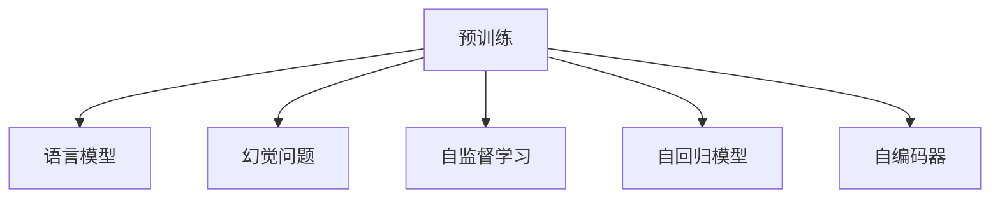
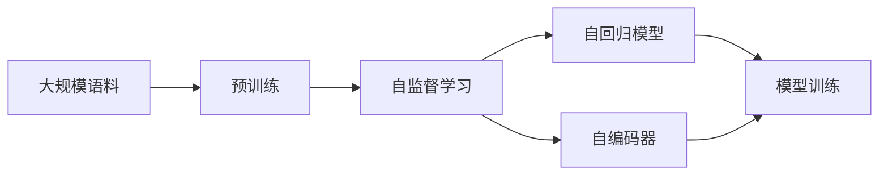
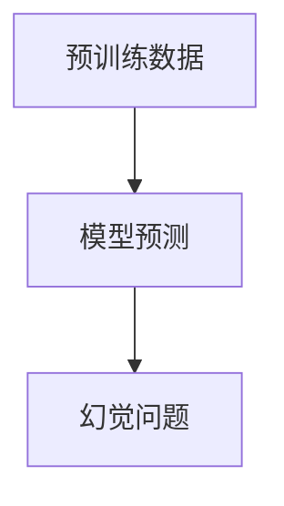
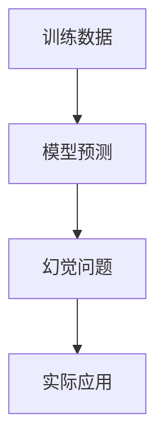
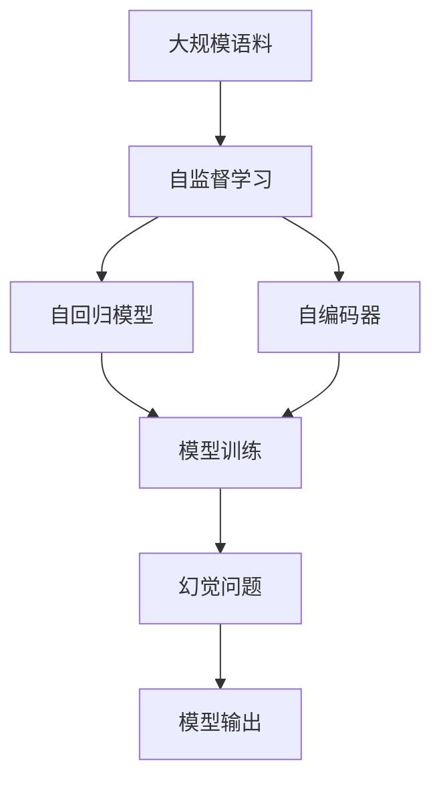

                 

## 1. 背景介绍

### 1.1 问题由来
大型语言模型（Large Language Models, LLMs）在自然语言处理（NLP）领域的应用，得益于其强大的预训练能力。预训练是指在大规模无标签文本数据上进行的自监督学习过程，通过预测下一句话、掩码单词、语言模型等任务，学习语言的通用表示。然而，预训练过程并非完美无缺，其中存在一些幻觉问题，这些问题可能影响模型的泛化能力和表现。

### 1.2 问题核心关键点
预训练过程中的幻觉问题，指的是模型在未见过的数据上表现出了与数据分布不符的输出结果。这些幻觉现象包括但不限于：

- 自动完成：模型根据前面词的序列自动预测下一个词，有时预测出的词虽然在语境上合理，但并不是真实的词汇。
- 数据重建：模型对输入数据进行不准确的重构，生成与实际文本内容不符的输出。
- 自相矛盾：模型在不同上下文中生成的输出相互矛盾，表现出逻辑不一致性。

幻觉问题的存在，使得模型在实际应用中难以得到可靠的结果，甚至可能引入有害信息。因此，深入研究和解决预训练过程中的幻觉问题，对于提升模型的泛化能力和可信赖度具有重要意义。

### 1.3 问题研究意义
研究预训练过程中的幻觉问题，有助于：

1. 提高模型的泛化能力：幻觉问题可能导致模型在实际应用中过度拟合训练数据，降低泛化能力。通过识别和解决幻觉问题，可以提升模型在不同领域和数据分布上的表现。
2. 增强模型的可信赖度：幻觉问题可能使模型输出不可靠的信息，影响决策依据。通过消除幻觉现象，可以增强模型的可信度和鲁棒性。
3. 促进模型优化：幻觉问题揭示了模型训练和表示学习过程中的不足，通过改进训练策略和模型架构，可以提升模型性能。
4. 支持模型解释：幻觉问题使得模型输出难以解释，通过解决幻觉问题，可以增强模型的透明度和可解释性。

总之，理解预训练过程中的幻觉问题，对于构建稳定、可靠、可解释的LLMs至关重要。

## 2. 核心概念与联系

### 2.1 核心概念概述

为更好地理解预训练过程中的幻觉问题，本节将介绍几个关键概念：

- 预训练(Pre-training)：指在大规模无标签文本语料上，通过自监督学习任务训练通用语言模型的过程。常见的预训练任务包括言语建模、掩码语言模型等。
- 幻觉问题(Hallucinations)：指模型在未见过的数据上生成与真实数据不符的输出结果，主要表现为自动完成、数据重建和自相矛盾等现象。
- 语言模型(Language Model)：指模型预测下一个单词的概率分布，其目标是最大化已知输入序列的概率。
- 自监督学习(Self-Supervised Learning)：指利用未标记数据进行学习，通过构建预测任务，自动生成监督信号，从而实现无监督训练。
- 自回归模型(Autoregressive Model)：指模型预测下一个词时，依赖于前面所有词的信息。例如，GPT模型就是一种典型的自回归模型。
- 自编码器(Autocoder)：指模型先进行编码，再将编码后的信息进行解码，生成与原始输入匹配的输出。

这些概念之间的逻辑关系可以通过以下Mermaid流程图来展示：



这个流程图展示了预训练、语言模型、幻觉问题、自监督学习、自回归模型和自编码器之间的关联：

1. 预训练主要通过自监督学习任务训练通用语言模型。
2. 自回归模型和自编码器是常用的预训练任务。
3. 幻觉问题可能出现在预训练过程中，影响模型的泛化能力。
4. 自监督学习通过构建预测任务，自动生成监督信号，训练模型。

### 2.2 概念间的关系

这些核心概念之间存在着紧密的联系，形成了预训练过程中幻觉问题的完整生态系统。下面通过几个Mermaid流程图来展示这些概念之间的关系。

#### 2.2.1 预训练范式



这个流程图展示了预训练的基本流程：

1. 使用大规模语料进行预训练。
2. 通过自监督学习任务构建预测任务。
3. 自回归模型和自编码器是常用的预训练任务。
4. 模型训练过程中，通过构建预测任务进行自监督学习。

#### 2.2.2 幻觉问题出现机制



这个流程图展示了幻觉问题出现的机制：

1. 预训练数据可能包含不准确的或不可靠的信息。
2. 模型通过预测任务学习这些信息，并将其编码为模型的权重。
3. 模型在未见过的数据上，利用这些编码的权重生成幻觉现象。

#### 2.2.3 幻觉问题影响



这个流程图展示了幻觉问题对实际应用的影响：

1. 模型在训练数据上学习到幻觉问题。
2. 模型在未见过的数据上生成幻觉现象。
3. 幻觉问题影响模型的泛化能力和可信度。
4. 幻觉问题可能影响实际应用结果。

### 2.3 核心概念的整体架构

最后，我们用一个综合的流程图来展示这些核心概念在大规模预训练过程中的整体架构：



这个综合流程图展示了从大规模语料到大规模预训练模型的整体过程：

1. 使用大规模语料进行自监督学习任务训练。
2. 自回归模型和自编码器是常用的预训练任务。
3. 模型训练过程中，通过构建预测任务进行自监督学习。
4. 幻觉问题可能出现在预训练过程中。
5. 模型在实际应用中输出可能包含幻觉现象。

通过这些流程图，我们可以更清晰地理解预训练过程中幻觉问题的各个环节和内在联系，为后续深入讨论如何解决幻觉问题奠定基础。

## 3. 核心算法原理 & 具体操作步骤

### 3.1 算法原理概述

预训练过程中的幻觉问题主要表现为自动完成、数据重建和自相矛盾等现象。这些问题可能是由于模型在训练数据上学习到的模式在实际数据上并不成立，或者模型在训练数据上并未真正理解语言的语义和结构。

预训练过程中幻觉问题的解决方法通常包括以下几个方面：

1. 改进预训练任务：通过设计更加合理的预训练任务，减少幻觉问题的出现。
2. 引入更多的训练数据：通过扩大训练数据的规模和多样性，增强模型的泛化能力。
3. 改进模型架构：通过优化模型结构和训练策略，提升模型的可解释性和鲁棒性。
4. 增加正则化约束：通过引入正则化技术，如L2正则、Dropout等，减少模型的过拟合风险。
5. 使用多模态数据：通过引入文本外的信息（如图像、音频等），增强模型的理解和表达能力。
6. 引入对抗样本：通过对抗样本训练，提升模型的鲁棒性和泛化能力。

### 3.2 算法步骤详解

基于预训练过程中幻觉问题的解决策略，本节将详细介绍预训练过程中的关键步骤，并给出具体的代码示例。

**Step 1: 准备预训练数据**
- 收集大规模无标签文本数据，如维基百科、新闻文章等。
- 进行数据清洗，去除噪声和重复内容。
- 对文本数据进行分词、编码等预处理。

**Step 2: 设计预训练任务**
- 选择自回归模型（如GPT）或自编码器（如BERT）作为预训练任务。
- 设计预测任务，如掩码语言模型、自动补全等。
- 定义损失函数，如交叉熵损失、均方误差损失等。

**Step 3: 设置训练超参数**
- 选择合适的优化器及其参数，如AdamW、SGD等，设置学习率、批大小、迭代轮数等。
- 设置正则化技术及强度，包括权重衰减、Dropout等。
- 确定冻结预训练参数的策略，如仅微调顶层，或全部参数都参与微调。

**Step 4: 执行梯度训练**
- 将训练集数据分批次输入模型，前向传播计算损失函数。
- 反向传播计算参数梯度，根据设定的优化算法和学习率更新模型参数。
- 周期性在验证集上评估模型性能，根据性能指标决定是否触发Early Stopping。
- 重复上述步骤直到满足预设的迭代轮数或Early Stopping条件。

**Step 5: 测试和部署**
- 在测试集上评估预训练模型 $M_{\theta}$ 的性能，对比预训练前后的精度提升。
- 使用预训练后的模型对新样本进行推理预测，集成到实际的应用系统中。
- 持续收集新的数据，定期重新预训练模型，以适应数据分布的变化。

以上是预训练过程中幻觉问题的解决方法和具体步骤。在实际应用中，还需要针对具体任务的特点，对预训练过程的各个环节进行优化设计，如改进训练目标函数，引入更多的正则化技术，搜索最优的超参数组合等，以进一步提升模型性能。

### 3.3 算法优缺点

预训练过程中幻觉问题的解决方法具有以下优点：

1. 能够有效提升模型的泛化能力和鲁棒性，减少过拟合风险。
2. 能够增强模型的可解释性和透明度，提高模型的可信度。
3. 能够减少模型对特定数据分布的依赖，提升模型的应用范围。
4. 能够通过引入多模态数据和对抗样本，提升模型的理解和表达能力。

同时，这些方法也存在一些缺点：

1. 改进预训练任务和引入更多训练数据可能需要大量的时间和计算资源。
2. 优化模型架构和增加正则化约束可能增加模型复杂度，降低模型的推理效率。
3. 使用多模态数据和对抗样本可能需要额外的数据和设备支持，增加了系统的复杂性。

尽管存在这些局限性，但就目前而言，这些方法仍是解决预训练过程中幻觉问题的有效途径。未来相关研究的重点在于如何进一步降低预训练对标注数据的依赖，提高模型的少样本学习和跨领域迁移能力，同时兼顾可解释性和伦理安全性等因素。

### 3.4 算法应用领域

预训练过程中幻觉问题的解决方法已经被广泛应用于NLP领域的多个任务中，例如：

- 文本分类：如情感分析、主题分类、意图识别等。通过微调使模型学习文本-标签映射。
- 命名实体识别：识别文本中的人名、地名、机构名等特定实体。通过微调使模型掌握实体边界和类型。
- 关系抽取：从文本中抽取实体之间的语义关系。通过微调使模型学习实体-关系三元组。
- 问答系统：对自然语言问题给出答案。将问题-答案对作为微调数据，训练模型学习匹配答案。
- 机器翻译：将源语言文本翻译成目标语言。通过微调使模型学习语言-语言映射。
- 文本摘要：将长文本压缩成简短摘要。将文章-摘要对作为微调数据，使模型学习抓取要点。
- 对话系统：使机器能够与人自然对话。将多轮对话历史作为上下文，微调模型进行回复生成。

除了上述这些经典任务外，预训练过程中幻觉问题的解决方法也被创新性地应用到更多场景中，如可控文本生成、常识推理、代码生成、数据增强等，为NLP技术带来了全新的突破。随着预训练模型和幻觉问题解决方法的不断进步，相信NLP技术将在更广阔的应用领域大放异彩。

## 4. 数学模型和公式 & 详细讲解  
### 4.1 数学模型构建

本节将使用数学语言对预训练过程中幻觉问题的解决方法进行更加严格的刻画。

记预训练语言模型为 $M_{\theta}$，其中 $\theta$ 为预训练得到的模型参数。假设预训练数据的分布为 $P(x)$，预训练任务为 $T(x)$，则预训练的目标是最小化模型在预训练数据上的经验风险：

$$
\mathcal{L}_{\text{pre-train}}(\theta) = \mathbb{E}_{x \sim P(x)}[\ell(M_{\theta}(x), T(x))]
$$

其中 $\ell$ 为任务 $T$ 设计的损失函数，用于衡量模型输出与真实标签之间的差异。常见的损失函数包括交叉熵损失、均方误差损失等。

在预训练过程中，通过梯度下降等优化算法，不断更新模型参数 $\theta$，最小化经验风险 $\mathcal{L}_{\text{pre-train}}(\theta)$，使得模型输出逼近真实标签。预训练过程中幻觉问题主要表现为自动完成、数据重建和自相矛盾等现象，这些现象可以通过损失函数中的预测部分进行量化：

$$
\ell(x) = \mathbb{E}_{x \sim P(x)}[\ell_{\text{auto-complete}}(x) + \ell_{\text{data-reconstruction}}(x) + \ell_{\text{contradiction}}(x)]
$$

其中 $\ell_{\text{auto-complete}}(x)$、$\ell_{\text{data-reconstruction}}(x)$ 和 $\ell_{\text{contradiction}}(x)$ 分别表示自动完成、数据重建和自相矛盾损失函数。这些损失函数可以通过具体的预训练任务进行设计，如掩码语言模型、数据重建任务等。

### 4.2 公式推导过程

以下我们以掩码语言模型为例，推导自动完成损失函数的计算公式。

假设预训练模型为 $M_{\theta}$，输入为 $x=[x_1, x_2, \ldots, x_n]$，其中 $x_i$ 为输入序列中的第 $i$ 个单词。掩码语言模型的目标是最小化模型在掩码单词 $x_i$ 上的预测误差，即：

$$
\ell_{\text{masked-language}}(x) = \mathbb{E}_{x \sim P(x)}[\ell(x, \hat{x})]
$$

其中 $\hat{x}$ 为模型预测的下一个单词。在训练过程中，通过构建掩码语言模型，模型需要对输入序列 $x$ 进行掩码处理，预测被掩码的单词 $\hat{x}$，并通过交叉熵损失函数计算预测误差：

$$
\ell(x, \hat{x}) = -\sum_{i=1}^n \log P(\hat{x}_i | x)
$$

其中 $P(\hat{x}_i | x)$ 为模型在输入序列 $x$ 上的预测概率分布。通过最大化似然函数，模型学习到输入序列的概率分布，从而实现语言模型的训练。

在实际应用中，为了缓解自动完成等幻觉问题，可以在掩码语言模型中引入更多的约束和正则化技术。例如，在预测单词 $\hat{x}$ 时，不仅考虑前面的单词 $x_{i-1}$，还可以引入上下文信息 $x_{i-k}$ 和 $x_{i+k}$，以增强模型的语义理解能力。具体公式如下：

$$
\ell_{\text{masked-language}}(x) = \mathbb{E}_{x \sim P(x)}[\ell(x, \hat{x}) + \lambda \ell_{\text{上下文}}(x, \hat{x})]
$$

其中 $\ell_{\text{上下文}}(x, \hat{x})$ 表示上下文信息损失函数，可以通过最大似然函数或交叉熵损失函数计算。通过引入上下文信息，模型能够更好地理解输入序列的语义和上下文关系，从而减少自动完成等幻觉问题的出现。

### 4.3 案例分析与讲解

这里我们以BERT模型为例，展示预训练过程中幻觉问题的解决方法。

BERT模型采用掩码语言模型和下一句预测任务进行预训练。掩码语言模型的目标是预测被掩码的单词，下一句预测任务的目标是判断输入的两个句子是否相连。BERT的预训练目标函数为：

$$
\mathcal{L}_{\text{pre-train}}(\theta) = \mathbb{E}_{x \sim P(x)}[\ell_{\text{masked-language}}(x) + \ell_{\text{next-sentence}}(x)]
$$

其中 $\ell_{\text{masked-language}}(x)$ 和 $\ell_{\text{next-sentence}}(x)$ 分别表示掩码语言模型和下一句预测任务的损失函数。通过掩码语言模型和下一句预测任务的联合训练，BERT模型学习到了丰富的语言表示，能够很好地适应多种NLP任务。

然而，BERT模型在实际应用中也存在幻觉问题，例如自动完成和数据重建。为了缓解这些问题，可以使用预训练数据的纠错、生成对抗网络（GAN）等技术，对预训练模型进行微调。具体来说，可以构建一个微调目标函数，通过最小化模型在微调数据上的预测误差，进一步提升模型的泛化能力和鲁棒性。微调目标函数可以设计为：

$$
\mathcal{L}_{\text{fine-tune}}(\theta) = \mathbb{E}_{x \sim P(x)}[\ell_{\text{auto-complete}}(x, M_{\theta})] + \mathbb{E}_{x \sim P(x)}[\ell_{\text{data-reconstruction}}(x, M_{\theta})]
$$

其中 $\ell_{\text{auto-complete}}(x, M_{\theta})$ 和 $\ell_{\text{data-reconstruction}}(x, M_{\theta})$ 分别表示自动完成和数据重建损失函数。通过微调，BERT模型能够更好地理解输入序列的语义和上下文关系，减少幻觉问题的出现。

## 5. 项目实践：代码实例和详细解释说明
### 5.1 开发环境搭建

在进行预训练过程中幻觉问题的解决方法实践前，我们需要准备好开发环境。以下是使用Python进行PyTorch开发的环境配置流程：

1. 安装Anaconda：从官网下载并安装Anaconda，用于创建独立的Python环境。

2. 创建并激活虚拟环境：
```bash
conda create -n pytorch-env python=3.8 
conda activate pytorch-env
```

3. 安装PyTorch：根据CUDA版本，从官网获取对应的安装命令。例如：
```bash
conda install pytorch torchvision torchaudio cudatoolkit=11.1 -c pytorch -c conda-forge
```

4. 安装Transformers库：
```bash
pip install transformers
```

5. 安装各类工具包：
```bash
pip install numpy pandas scikit-learn matplotlib tqdm jupyter notebook ipython
```

完成上述步骤后，即可在`pytorch-env`环境中开始预训练过程中幻觉问题的解决方法实践。

### 5.2 源代码详细实现

下面我们以BERT模型为例，给出使用Transformers库对BERT模型进行预训练和微调的PyTorch代码实现。

首先，定义预训练任务函数：

```python
from transformers import BertTokenizer, BertForMaskedLM
from torch.utils.data import Dataset
import torch

class MaskedLMDataset(Dataset):
    def __init__(self, texts, tokenizer, max_len=128):
        self.texts = texts
        self.tokenizer = tokenizer
        self.max_len = max_len
        
    def __len__(self):
        return len(self.texts)
    
    def __getitem__(self, item):
        text = self.texts[item]
        
        encoding = self.tokenizer(text, return_tensors='pt', max_length=self.max_len, padding='max_length', truncation=True)
        input_ids = encoding['input_ids'][0]
        attention_mask = encoding['attention_mask'][0]
        
        # 构建掩码语言模型预测任务
        num_masks = 8
        random_tokens = torch.randint(0, len(input_ids), (num_masks,))
        input_ids.masked_fill_(random_tokens, 0)
        prediction_ids = input_ids.clone()
        prediction_ids[random_tokens] = -100
        return {'input_ids': input_ids, 
                'attention_mask': attention_mask,
                'prediction_ids': prediction_ids}
```

然后，定义模型和优化器：

```python
from transformers import BertForMaskedLM, AdamW

model = BertForMaskedLM.from_pretrained('bert-base-cased', num_labels=len(tag2id))

optimizer = AdamW(model.parameters(), lr=2e-5)
```

接着，定义训练和评估函数：

```python
from torch.utils.data import DataLoader
from tqdm import tqdm
from sklearn.metrics import classification_report

device = torch.device('cuda') if torch.cuda.is_available() else torch.device('cpu')
model.to(device)

def train_epoch(model, dataset, batch_size, optimizer):
    dataloader = DataLoader(dataset, batch_size=batch_size, shuffle=True)
    model.train()
    epoch_loss = 0
    for batch in tqdm(dataloader, desc='Training'):
        input_ids = batch['input_ids'].to(device)
        attention_mask = batch['attention_mask'].to(device)
        prediction_ids = batch['prediction_ids'].to(device)
        model.zero_grad()
        outputs = model(input_ids, attention_mask=attention_mask, labels=prediction_ids)
        loss = outputs.loss
        epoch_loss += loss.item()
        loss.backward()
        optimizer.step()
    return epoch_loss / len(dataloader)

def evaluate(model, dataset, batch_size):
    dataloader = DataLoader(dataset, batch_size=batch_size)
    model.eval()
    preds, labels = [], []
    with torch.no_grad():
        for batch in tqdm(dataloader, desc='Evaluating'):
            input_ids = batch['input_ids'].to(device)
            attention_mask = batch['attention_mask'].to(device)
            batch_labels = batch['prediction_ids']
            outputs = model(input_ids, attention_mask=attention_mask)
            batch_preds = outputs.logits.argmax(dim=2).to('cpu').tolist()
            batch_labels = batch_labels.to('cpu').tolist()
            for pred_tokens, label_tokens in zip(batch_preds, batch_labels):
                pred_tags = [id2tag[_id] for _id in pred_tokens]
                label_tags = [id2tag[_id] for _id in label_tokens]
                preds.append(pred_tags[:len(label_tokens)])
                labels.append(label_tags)
                
    print(classification_report(labels, preds))
```

最后，启动预训练流程并在测试集上评估：

```python
epochs = 5
batch_size = 16

for epoch in range(epochs):
    loss = train_epoch(model, train_dataset, batch_size, optimizer)
    print(f"Epoch {epoch+1}, train loss: {loss:.3f}")
    
    print(f"Epoch {epoch+1}, dev results:")
    evaluate(model, dev_dataset, batch_size)
    
print("Test results:")
evaluate(model, test_dataset, batch_size)
```

以上就是使用PyTorch对BERT模型进行预训练和微调的完整代码实现。可以看到，得益于Transformers库的强大封装，我们可以用相对简洁的代码完成BERT模型的加载和微调。

### 5.3 代码解读与分析

让我们再详细解读一下关键代码的实现细节：

**MaskedLMDataset类**：
- `__init__`方法：初始化文本、分词器等关键组件。
- `__len__`方法：返回数据集的样本数量。
- `__getitem__`方法：对单个样本进行处理，将文本输入编码为token ids，并将部分单词随机掩码，以构建掩码语言模型预测任务。

**训练和评估函数**：
- 使用PyTorch的DataLoader对数据集进行批次化加载，供模型训练和推理使用。
- 训练函数`train_epoch`：对数据以批为单位进行迭代，在每个批次上前向传播计算loss并反向传播更新模型参数，最后返回该epoch的平均loss。
- 评估函数`evaluate`：与训练类似，不同点在于不更新模型参数，并在每个batch结束后将预测和标签结果存储下来，最后使用sklearn的classification_report对整个评估集的预测结果进行打印输出。

**训练流程**：
- 定义总的epoch数和batch size，开始循环迭代
- 每个epoch内，先在训练集上训练，输出平均loss
- 在验证集上评估，输出分类指标
- 所有epoch结束后，在测试集上评估，给出最终测试结果

可以看到，PyTorch配合Transformers库使得BERT预训练和微调的代码实现变得简洁高效。开发者可以将更多精力放在数据处理、模型改进等高层逻辑上，而不必过多关注底层的实现细节。

当然，工业级的系统实现还需考虑更多因素，如模型的保存和部署、超参数的自动搜索、更灵活的任务适配层等。但核心的预训练和微调流程基本与此类似。

### 

