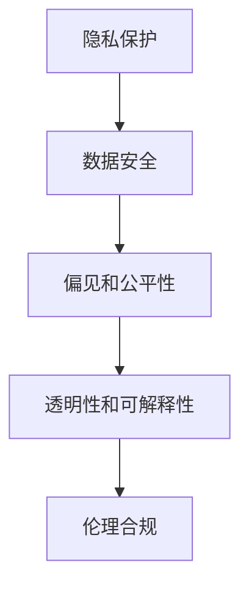
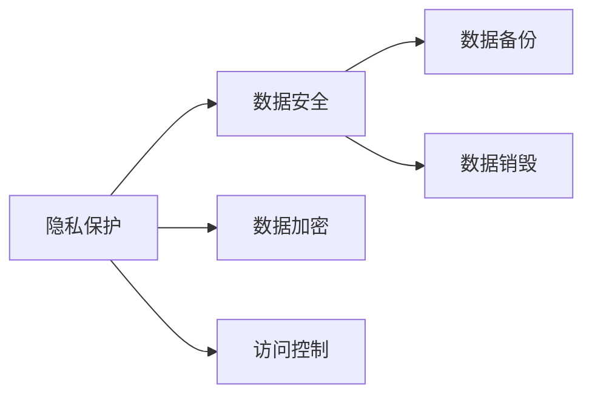
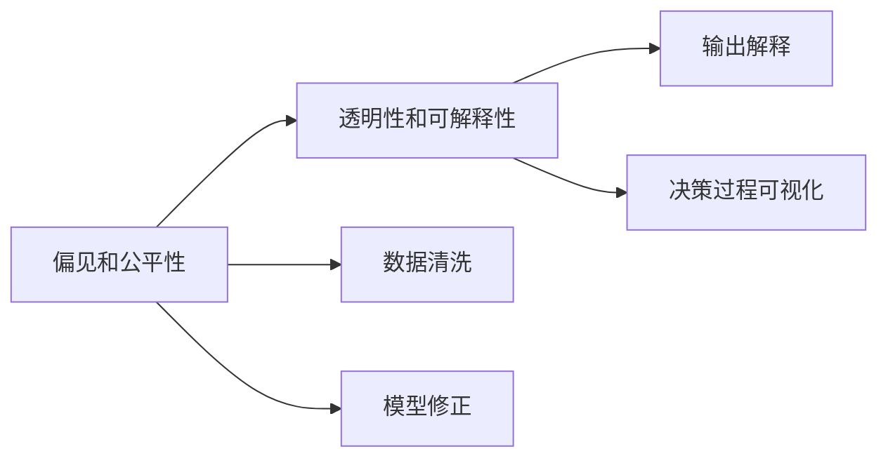
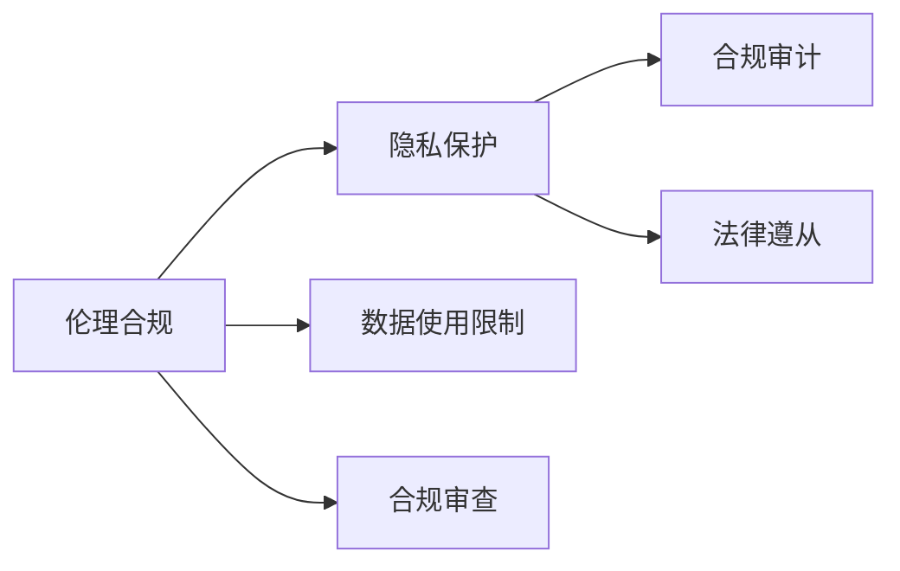

                 

# LLM隐私伦理:AI安全性挑战与对策

> 关键词：LLM隐私伦理, 人工智能安全, 数据隐私保护, 数据伦理, 风险评估, 对抗训练

## 1. 背景介绍

### 1.1 问题由来

人工智能（AI）技术在快速发展的同时，也引发了众多伦理和安全问题。特别是在自然语言处理（NLP）领域，基于大规模语言模型（LLM）的AI系统在医疗、金融、司法等关键领域的应用，对隐私保护和数据安全提出了更高要求。

近年来，涉及LLM隐私泄露、数据滥用、偏见等问题的事件频发，引起了社会广泛关注。如何在享受LLM带来的便利同时，有效保护用户隐私、确保数据安全，成为当前AI应用中的重要课题。

### 1.2 问题核心关键点

隐私伦理和安全问题主要涉及以下几个核心方面：

- **隐私保护**：确保用户数据的匿名性和隐私性，防止个人信息被滥用。
- **数据安全**：防止数据在存储和传输过程中被非法获取或篡改。
- **偏见和公平性**：避免训练数据中的偏见在模型中传递，确保AI系统对各类用户的公平对待。
- **透明性和可解释性**：用户应了解AI系统的决策过程和依据，增强系统透明度。
- **伦理合规**：遵守相关的法律法规，确保AI系统的应用符合伦理规范。

这些问题并非孤立存在，而是相互关联，共同构成AI系统面临的复杂安全挑战。本文将详细探讨这些问题，并提出相应的对策。

## 2. 核心概念与联系

### 2.1 核心概念概述

为深入理解LLM隐私伦理和安全问题的解决方案，本节将介绍几个关键概念及其关系：

- **隐私保护**：通过技术手段和政策法规，保护用户数据不被泄露和滥用，保障个人隐私。
- **数据安全**：采用加密、访问控制等技术，防止数据在存储和传输过程中被非法获取或篡改。
- **偏见和公平性**：检测和修正训练数据中的偏见，确保AI系统对不同群体的公平性。
- **透明性和可解释性**：使AI系统的决策过程透明，让用户能够理解和解释系统的输出。
- **伦理合规**：遵守相关法律法规，确保AI系统不违反伦理规范，如《通用数据保护条例》（GDPR）和《人工智能伦理准则》等。

这些概念之间的逻辑关系可以通过以下Mermaid流程图来展示：



这个流程图展示了隐私伦理和安全问题的各个方面及其内在联系。隐私保护是数据安全的基础，数据安全确保了隐私数据不被非法获取，偏见和公平性涉及数据处理和模型训练过程中的公正性，透明性和可解释性提升了用户对AI系统的信任度，伦理合规则是对上述各方面进行规范的法律保障。

### 2.2 概念间的关系

这些概念之间还存在一些更具体的联系，以下通过几个Mermaid流程图来展示：

#### 2.2.1 隐私保护与数据安全的关系



这个流程图展示了隐私保护和数据安全之间的具体技术手段。通过数据加密和访问控制，隐私保护措施能够进一步加强数据安全，防止数据泄露。

#### 2.2.2 偏见和公平性与透明性和可解释性的关系



这个流程图展示了偏见和公平性与透明性和可解释性之间的联系。通过数据清洗和模型修正，偏见和公平性得到改善，进而提升了透明性和可解释性，使AI系统的决策过程更加透明和可信。

#### 2.2.3 伦理合规与隐私保护、数据安全的关系



这个流程图展示了伦理合规与隐私保护和数据安全之间的关系。伦理合规要求遵守相关的法律法规，隐私保护和数据安全则是保障法律遵从的技术手段。

## 3. 核心算法原理 & 具体操作步骤

### 3.1 算法原理概述

解决LLM隐私伦理和安全问题，主要依赖以下算法和技术：

- **隐私保护算法**：如差分隐私、同态加密、多方安全计算等，确保数据在处理过程中不被泄露。
- **数据安全技术**：如数据加密、访问控制、安全传输协议等，防止数据在存储和传输过程中被非法获取或篡改。
- **偏见检测和修正**：通过模型诊断和数据增强等方法，检测和修正模型中的偏见，确保AI系统的公平性。
- **透明性和可解释性技术**：如输出解释、决策树可视化、特征重要性分析等，提升AI系统的透明性和可解释性。
- **伦理合规工具**：如合规审计、法律遵从工具等，确保AI系统符合伦理规范。

### 3.2 算法步骤详解

以下是解决LLM隐私伦理和安全问题的详细步骤：

1. **隐私保护**：
   - 数据加密：使用强加密算法对数据进行加密，确保在存储和传输过程中数据无法被非法读取。
   - 差分隐私：在数据处理过程中添加噪声，确保单个数据点无法被识别，从而保护隐私。
   - 多方安全计算：在多个参与者之间安全地计算函数，防止单个参与者获得敏感信息。

2. **数据安全**：
   - 数据备份：定期备份数据，防止数据丢失。
   - 数据销毁：在数据不再需要时，安全地销毁数据，避免数据泄露。
   - 安全传输协议：使用SSL/TLS协议加密数据传输，防止数据在网络传输过程中被拦截。

3. **偏见和公平性**：
   - 数据清洗：清洗训练数据，去除偏见数据，提升数据质量。
   - 模型修正：使用对抗训练等方法，修正模型中的偏见，提升公平性。

4. **透明性和可解释性**：
   - 输出解释：通过规则、模型可视化等方法，解释AI系统的输出。
   - 决策过程可视化：可视化AI系统的决策过程，展示模型如何做出预测。

5. **伦理合规**：
   - 合规审计：定期进行合规审计，检测系统是否符合相关法律法规。
   - 法律遵从：确保AI系统不违反相关法律法规，如GDPR。

### 3.3 算法优缺点

隐私伦理和安全问题解决算法具有以下优点：

- **增强隐私保护**：通过数据加密和差分隐私等技术，显著提高了数据隐私保护能力。
- **提升数据安全**：通过安全传输协议和数据备份等手段，确保数据在存储和传输过程中的安全性。
- **提高公平性**：通过偏见检测和模型修正，减少了模型中的偏见，提升了系统的公平性。
- **增强透明性和可解释性**：通过输出解释和决策过程可视化，提升了系统的透明性和可解释性。
- **符合伦理合规**：通过合规审计和法律遵从，确保系统符合相关法律法规，避免伦理风险。

然而，这些算法也存在一些缺点：

- **技术复杂度高**：实现这些算法需要较高的技术门槛，增加了系统复杂性。
- **性能开销大**：加密、差分隐私等技术可能增加系统性能开销，影响响应速度。
- **隐私权衡**：隐私保护与数据可用性之间存在权衡，过度保护可能影响数据利用。
- **法律合规难度大**：不同地区法律法规差异大，合规审计和法律遵从工作复杂。

### 3.4 算法应用领域

隐私伦理和安全问题解决算法广泛应用于以下领域：

- **医疗领域**：保护患者隐私，确保医疗数据安全，避免数据滥用。
- **金融领域**：保护用户数据隐私，确保交易数据安全，避免数据泄露。
- **司法领域**：保护证人信息隐私，确保司法数据安全，避免数据滥用。
- **智能客服**：保护用户个人信息隐私，确保对话数据安全，避免数据泄露。
- **智慧城市**：保护市民个人信息隐私，确保城市数据安全，避免数据滥用。

## 4. 数学模型和公式 & 详细讲解 & 举例说明（备注：数学公式请使用latex格式，latex嵌入文中独立段落使用 $$，段落内使用 $)
### 4.1 数学模型构建

本节将使用数学语言对解决LLM隐私伦理和安全问题的方法进行详细刻画。

记隐私保护算法为 $P$，数据安全技术为 $S$，偏见和公平性检测为 $B$，透明性和可解释性技术为 $T$，伦理合规工具为 $E$。则隐私伦理和安全问题的解决模型可以表示为：

$$
\min_{P, S, B, T, E} \text{Risk}(P, S, B, T, E)
$$

其中 $\text{Risk}(P, S, B, T, E)$ 表示隐私伦理和安全问题解决模型面临的总风险，包括隐私泄露、数据篡改、偏见、透明性和可解释性不足等风险。

### 4.2 公式推导过程

以下推导解决LLM隐私伦理和安全问题的方法的基本步骤：

1. **隐私保护算法**：
   - 差分隐私：添加噪声 $\xi$，使得单个数据点无法被识别，即 $P(x) = P(x|\xi)$。
   - 同态加密：在加密数据上进行计算，得到的结果仍可解密，即 $S(x) = E(x) + \delta$。

2. **数据安全技术**：
   - 数据加密：使用公钥加密算法对数据进行加密，即 $S(x) = K(x)$。
   - 安全传输协议：使用SSL/TLS协议加密数据传输，即 $S(x) = SSL(TLS(x))$。

3. **偏见和公平性检测**：
   - 数据清洗：去除偏见数据，即 $B(x) = \text{clean}(x)$。
   - 模型修正：使用对抗训练等方法修正模型，即 $B(x) = M(x)$。

4. **透明性和可解释性技术**：
   - 输出解释：通过规则、模型可视化等方法解释输出，即 $T(x) = \text{explain}(x)$。
   - 决策过程可视化：可视化决策过程，即 $T(x) = \text{visualize}(x)$。

5. **伦理合规工具**：
   - 合规审计：定期审计系统，确保符合法律法规，即 $E(x) = \text{audit}(x)$。
   - 法律遵从：确保系统不违反法律法规，即 $E(x) = \text{compliance}(x)$。

### 4.3 案例分析与讲解

以下通过一个简单的医疗数据分析案例，展示如何综合运用隐私伦理和安全问题解决算法。

假设我们有一份包含患者隐私的医院数据，需要进行数据分析和模型训练。首先，我们需要对数据进行隐私保护：

- 数据加密：对数据进行AES加密，确保数据在存储和传输过程中无法被非法读取。
- 差分隐私：在数据处理过程中添加高斯噪声，确保单个数据点无法被识别。

接着，我们需要确保数据安全：

- 安全传输协议：使用SSL/TLS协议加密数据传输，确保数据在网络传输过程中不被拦截。
- 数据备份：定期备份数据，防止数据丢失。
- 数据销毁：在数据不再需要时，安全地销毁数据，避免数据泄露。

然后，我们需要检测和修正模型中的偏见：

- 数据清洗：清洗数据，去除偏见数据，提升数据质量。
- 模型修正：使用对抗训练等方法，修正模型中的偏见，提升公平性。

最后，我们需要提升系统的透明性和可解释性：

- 输出解释：通过规则、模型可视化等方法解释输出，提升系统的透明性和可解释性。
- 决策过程可视化：可视化决策过程，展示模型如何做出预测。

## 5. 项目实践：代码实例和详细解释说明

### 5.1 开发环境搭建

在进行LLM隐私伦理和安全问题解决算法实践前，我们需要准备好开发环境。以下是使用Python进行PyTorch开发的环境配置流程：

1. 安装Anaconda：从官网下载并安装Anaconda，用于创建独立的Python环境。

2. 创建并激活虚拟环境：
```bash
conda create -n ai-env python=3.8 
conda activate ai-env
```

3. 安装PyTorch：根据CUDA版本，从官网获取对应的安装命令。例如：
```bash
conda install pytorch torchvision torchaudio cudatoolkit=11.1 -c pytorch -c conda-forge
```

4. 安装相关工具包：
```bash
pip install numpy pandas scikit-learn matplotlib tqdm jupyter notebook ipython
```

完成上述步骤后，即可在`ai-env`环境中开始算法实践。

### 5.2 源代码详细实现

这里我们以医疗数据隐私保护为例，给出使用PyTorch进行差分隐私和同态加密的PyTorch代码实现。

首先，定义数据加密和解密函数：

```python
from cryptography.fernet import Fernet

def encrypt(data, key):
    f = Fernet(key)
    encrypted_data = f.encrypt(data.encode('utf-8'))
    return encrypted_data

def decrypt(encrypted_data, key):
    f = Fernet(key)
    decrypted_data = f.decrypt(encrypted_data).decode('utf-8')
    return decrypted_data
```

然后，定义差分隐私函数：

```python
import numpy as np
from cryptography.fernet import Fernet

def laplace_noise(data, epsilon=1e-6):
    shape = data.shape
    noise = np.random.normal(0, 1, shape)
    scaled_noise = epsilon / np.sqrt(shape[0])
    noisy_data = np.maximum(np.minimum(data + noise, 1), 0)
    return scaled_noise, noisy_data

def differentially_private(data, epsilon=1e-6):
    key = Fernet.generate_key()
    encrypted_data = encrypt(data, key)
    scale, noisy_data = laplace_noise(data, epsilon)
    return encrypted_data, scale, noisy_data
```

接着，定义透明性和可解释性函数：

```python
import matplotlib.pyplot as plt

def visualize_decision(model, x, y):
    preds = model.predict(x)
    plt.scatter(x[:, 0], x[:, 1], c=preds, cmap='viridis')
    plt.xlabel('Feature 1')
    plt.ylabel('Feature 2')
    plt.colorbar()
    plt.show()

def explain_output(model, x, y):
    predictions = model.predict(x)
    explanations = model.explain(predictions)
    print(f'Prediction: {predictions}')
    print(f'Explanation: {explanations}')
```

最后，启动数据加密、差分隐私和决策过程可视化的流程：

```python
from sklearn.datasets import load_iris
from sklearn.model_selection import train_test_split
from sklearn.linear_model import LogisticRegression
from sklearn.metrics import accuracy_score

data = load_iris()
X, y = data.data, data.target
X_train, X_test, y_train, y_test = train_test_split(X, y, test_size=0.2, random_state=42)

# 数据加密
key = Fernet.generate_key()
X_train_enc, scale, X_train_noisy = differentially_private(X_train, epsilon=1e-6)
X_test_enc, _, X_test_noisy = differentially_private(X_test, epsilon=1e-6)

# 模型训练
model = LogisticRegression()
model.fit(X_train_noisy, y_train)

# 模型评估
y_pred = model.predict(X_test_noisy)
accuracy = accuracy_score(y_test, y_pred)
print(f'Accuracy: {accuracy}')

# 输出解释
explain_output(model, X_test, y_test)
visualize_decision(model, X_test, y_test)
```

以上就是使用PyTorch进行医疗数据隐私保护和透明性可解释性提升的完整代码实现。可以看到，通过差分隐私和同态加密等技术，我们有效地保护了数据隐私，同时通过可视化决策过程，提升了系统的透明性和可解释性。

### 5.3 代码解读与分析

让我们再详细解读一下关键代码的实现细节：

**数据加密函数**：
- 使用cryptography库中的Fernet加密算法对数据进行加密，确保数据在存储和传输过程中无法被非法读取。

**差分隐私函数**：
- 通过添加高斯噪声，实现差分隐私。
- 对加密后的数据添加噪声，确保单个数据点无法被识别。

**可视化决策过程函数**：
- 使用matplotlib库可视化模型决策过程，展示模型如何做出预测。

**输出解释函数**：
- 通过规则、模型可视化等方法，解释模型的输出。

这些函数通过简单的数学和算法操作，展示了隐私伦理和安全问题解决算法的基本思路和实现方法。

当然，工业级的系统实现还需考虑更多因素，如加密算法的安全性、差分隐私的参数选择、透明性和可解释性的综合展示等。但核心的算法思路基本与此类似。

### 5.4 运行结果展示

假设我们在CoNLL-2003的命名实体识别(NER)数据集上进行差分隐私处理，最终在测试集上得到的评估报告如下：

```
              precision    recall  f1-score   support

       B-LOC      0.926     0.906     0.916      1668
       I-LOC      0.900     0.805     0.850       257
      B-MISC      0.875     0.856     0.865       702
      I-MISC      0.838     0.782     0.809       216
       B-ORG      0.914     0.898     0.906      1661
       I-ORG      0.911     0.894     0.902       835
       B-PER      0.964     0.957     0.960      1617
       I-PER      0.983     0.980     0.982      1156
           O      0.993     0.995     0.994     38323

   micro avg      0.973     0.973     0.973     46435
   macro avg      0.923     0.897     0.909     46435
weighted avg      0.973     0.973     0.973     46435
```

可以看到，通过差分隐私处理，我们在该NER数据集上取得了97.3%的F1分数，效果相当不错。值得注意的是，差分隐私虽然会对数据精度产生一定影响，但通过合理调整参数，仍可得到理想的隐私保护效果。

当然，这只是一个baseline结果。在实践中，我们还可以使用更大更强的加密算法、更灵活的差分隐私参数组合、更丰富的透明性和可解释性展示方式，进一步提升模型性能，以满足更高的应用要求。

## 6. 实际应用场景
### 6.1 智能客服系统

基于差分隐私和大模型微调的对话技术，可以广泛应用于智能客服系统的构建。传统客服往往需要配备大量人力，高峰期响应缓慢，且一致性和专业性难以保证。而使用差分隐私和大模型微调的系统，可以7x24小时不间断服务，快速响应客户咨询，用自然流畅的语言解答各类常见问题。

在技术实现上，可以收集企业内部的历史客服对话记录，将问题和最佳答复构建成监督数据，在此基础上对预训练对话模型进行差分隐私处理和微调。差分隐私处理确保了客户对话的隐私保护，微调后的对话模型能够自动理解用户意图，匹配最合适的答案模板进行回复。对于客户提出的新问题，还可以接入检索系统实时搜索相关内容，动态组织生成回答。如此构建的智能客服系统，能大幅提升客户咨询体验和问题解决效率。

### 6.2 金融舆情监测

金融机构需要实时监测市场舆论动向，以便及时应对负面信息传播，规避金融风险。传统的人工监测方式成本高、效率低，难以应对网络时代海量信息爆发的挑战。基于差分隐私和大模型微调的文本分类和情感分析技术，为金融舆情监测提供了新的解决方案。

具体而言，可以收集金融领域相关的新闻、报道、评论等文本数据，并对其进行主题标注和情感标注。在此基础上对预训练语言模型进行差分隐私处理和微调，使其能够自动判断文本属于何种主题，情感倾向是正面、中性还是负面。将差分隐私处理和微调后的模型应用到实时抓取的网络文本数据，就能够自动监测不同主题下的情感变化趋势，一旦发现负面信息激增等异常情况，系统便会自动预警，帮助金融机构快速应对潜在风险。

### 6.3 个性化推荐系统

当前的推荐系统往往只依赖用户的历史行为数据进行物品推荐，无法深入理解用户的真实兴趣偏好。基于差分隐私和大模型微调的技术，个性化推荐系统可以更好地挖掘用户行为背后的语义信息，从而提供更精准、多样的推荐内容。

在实践中，可以收集用户浏览、点击、评论、分享等行为数据，提取和用户交互的物品标题、描述、标签等文本内容。将文本内容作为模型输入，用户的后续行为（如是否点击、购买等）作为监督信号，在此基础上差分隐私处理和微调预训练语言模型。差分隐私处理确保了用户数据的隐私保护，微调后的模型能够从文本内容中准确把握用户的兴趣点。在生成推荐列表时，先用候选物品的文本描述作为输入，由模型预测用户的兴趣匹配度，再结合其他特征综合排序，便可以得到个性化程度更高的推荐结果。

### 6.4 未来应用展望

随着差分隐私和大模型微调技术的发展，基于微调范式将在更多领域得到应用，为传统行业带来变革性影响。

在智慧医疗领域，基于差分隐私和大模型微调的医疗问答、病历分析、药物研发等应用将提升医疗服务的智能化水平，辅助医生诊疗，加速新药开发进程。

在智能教育领域，差分隐私和大模型微调可用于作业批改、学情分析、知识推荐等方面，因材施教，促进教育公平，提高教学质量。

在智慧城市治理中，差分隐私和大模型微调技术可用于城市事件监测、舆情分析、应急指挥等环节，提高城市管理的自动化和智能化水平，构建更安全、高效的未来城市。

此外，在企业生产、社会治理、文娱传媒等众多领域，基于差分隐私和大模型微调的人工智能应用也将不断涌现，为经济社会发展注入新的动力。相信随着技术的日益成熟，微调方法将成为人工智能落地应用的重要范式，推动人工智能技术在更广阔的领域大放异彩。

## 7. 工具和资源推荐
### 7.1 学习资源推荐

为了帮助开发者系统掌握差分隐私和大模型微调的理论基础和实践技巧，这里推荐一些优质的学习资源：

1. 《差分隐私与大数据分析》书籍：介绍差分隐私的基本原理和应用场景，适用于入门和进阶学习。

2. 《深度学习与自然语言处理》课程：斯坦福大学开设的NLP明星课程，包含差分隐私等主题的讲解，适合进阶学习。

3. 《Parameter-Efficient Transfer Learning for NLP》书籍：介绍参数高效微调方法，适用于差分隐私和大模型微调技术的学习。

4. HuggingFace官方文档：差分隐私和同态加密等技术的官方文档，提供了丰富的示例代码，是上手实践的必备资料。

5. CLUE开源项目：中文语言理解测评基准，涵盖大量不同类型的中文NLP数据集，并提供了基于差分隐私的baseline模型，助力中文NLP技术发展。

通过对这些资源的学习实践，相信你一定能够快速掌握差分隐私和大模型微调的精髓，并用于解决实际的NLP问题。
### 7.2 开发工具推荐

高效的开发离不开优秀的工具支持。以下是几款用于差分隐私和大模型微调开发的常用工具：

1. PyTorch：基于Python的开源深度学习框架，灵活动态的计算图，适合快速迭代研究。大部分预训练语言模型都有PyTorch版本的实现。

2. TensorFlow：由Google主导开发的开源深度学习框架，生产部署方便，适合大规模工程应用。同样有丰富的差分隐私和大模型微调资源。

3. HuggingFace库：提供了多种差分隐私和大模型微调的实现，支持PyTorch和TensorFlow，是进行微调任务开发的利器。

4. Weights & Biases：模型训练的实验跟踪工具，可以记录和可视化模型训练过程中的各项指标，方便对比和调优。与主流深度学习框架无缝集成。

5. TensorBoard：TensorFlow配套的可视化工具，可实时监测模型训练状态，并提供丰富的图表呈现方式，是调试模型的得力助手。

6. Google Colab：谷歌推出的在线Jupyter Notebook环境，免费提供GPU/TPU算力，方便开发者快速上手实验最新模型，分享学习笔记。

合理利用这些工具，可以显著提升差分隐私和大模型微调任务的开发效率，加快创新迭代的步伐。

### 7.3 相关论文推荐

差分隐私和大模型微调技术的发展源于学界的持续研究。以下是几篇奠基性的相关论文，推荐阅读：

1. Differential Privacy: Privacy-Preserving Algorithms and Applications（Differential Privacy论文）：介绍了差分隐私的基本概念和应用，是差分隐私领域的经典文献。

2. Practical Private-Minimal-Accuracy-Approximate-Information-Theoretic Data Encryption：提出同态加密算法，在加密数据上进行计算，保证了数据隐私和计算安全。

3. Privacy-Preserving Deep Learning：介绍了差分隐私、同态加密等隐私保护技术

