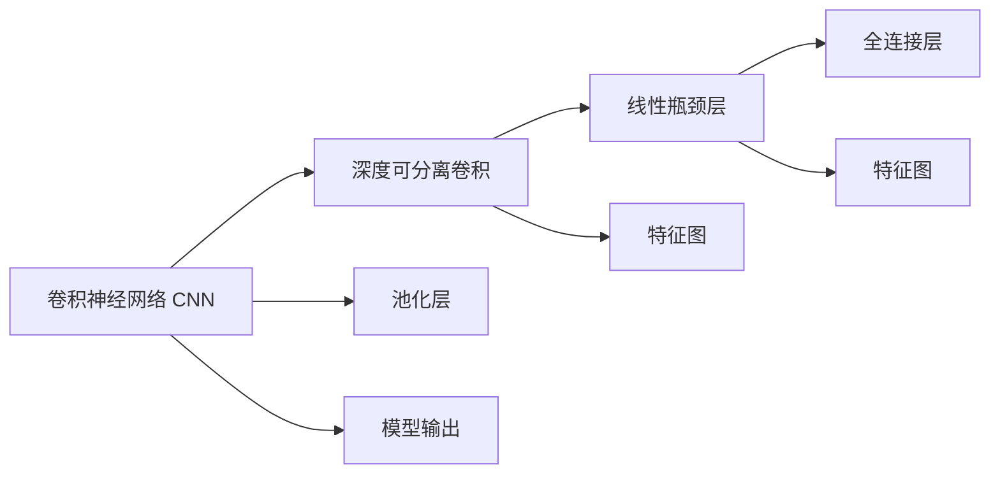

                 

# MobileNet原理与代码实例讲解

> 关键词：MobileNet, 卷积神经网络, 深度学习, 计算效率, 模型压缩, 代码实现

## 1. 背景介绍

### 1.1 问题由来
在深度学习时代，尤其是计算机视觉领域，卷积神经网络(Convolutional Neural Networks, CNNs)因其卓越的图像识别和处理能力，成为了主流。然而，随着模型复杂度的提升，其在实际部署中的计算资源需求和存储成本也显著增加，极大地限制了其在移动端和其他资源有限的场景中的应用。

### 1.2 问题核心关键点
MobileNet正是在这种背景下提出的一种针对移动端应用的卷积神经网络结构。其核心目标在于通过一系列结构优化和参数压缩技术，显著减少模型的计算量和存储需求，从而在保持模型精度的同时，提升其在资源受限设备上的性能。

### 1.3 问题研究意义
研究MobileNet不仅对计算机视觉技术在移动设备上的应用有重要意义，还能够为更广泛的深度学习模型压缩和优化提供重要参考。因此，深入了解MobileNet的结构和原理，对于推动深度学习技术的普及和应用有着不可估量的价值。

## 2. 核心概念与联系

### 2.1 核心概念概述

MobileNet是一种针对移动端和资源受限场景设计的卷积神经网络结构。其核心思想在于通过深度可分离卷积(Depthwise Separable Convolution)、线性瓶颈层(Bottleneck Layers)等技术，优化计算资源，实现模型的轻量化和高效化。

- 深度可分离卷积：将传统卷积操作分解为两个步骤：深度卷积和点积卷积，以显著减少计算量。
- 线性瓶颈层：通过引入线性变换，进一步优化模型结构，减少参数量和计算复杂度。

### 2.2 核心概念间的关系

MobileNet的核心概念与传统卷积神经网络之间存在紧密的联系和区别。以下通过几个Mermaid流程图来展示这些概念之间的关系：



这个流程图展示了一个典型的MobileNet模型结构，其中卷积层被深度可分离卷积和线性瓶颈层所取代，同时保留了池化层和全连接层的框架。这种结构设计使得MobileNet能够在保持精度的同时，大幅减少计算量。

## 3. 核心算法原理 & 具体操作步骤
### 3.1 算法原理概述

MobileNet的算法原理主要集中在深度可分离卷积和线性瓶颈层的结构设计上。通过这些结构，MobileNet实现了对传统卷积神经网络的优化，具体如下：

1. **深度可分离卷积**：将传统卷积操作分解为两个步骤：深度卷积和点积卷积。深度卷积仅对每个输入通道进行卷积，而点积卷积则通过点积操作将深度卷积的结果与另一组特征图相乘，实现特征图的信息融合。

2. **线性瓶颈层**：在深度可分离卷积的基础上，引入线性变换。线性瓶颈层包括一个线性变换层和一个深度可分离卷积层，其中线性变换层的权重参数较少，通过线性映射进一步减小了参数量。

### 3.2 算法步骤详解

MobileNet的微调过程主要包括四个关键步骤：数据准备、模型构建、训练和评估。以下详细介绍每个步骤的实现：

**Step 1: 数据准备**
- 准备MobileNet使用的图像数据集，并进行预处理（如归一化、缩放等）。
- 将数据集划分为训练集、验证集和测试集。

**Step 2: 模型构建**
- 使用Keras、TensorFlow或PyTorch等深度学习框架构建MobileNet模型。
- 设置模型参数，如卷积核大小、深度、膨胀率等。
- 编译模型，选择适当的损失函数和优化器。

**Step 3: 训练模型**
- 对模型进行训练，使用训练集数据，设定合适的迭代次数和批次大小。
- 在验证集上监控模型性能，防止过拟合。
- 调整模型参数和训练参数，优化模型性能。

**Step 4: 评估模型**
- 使用测试集评估模型的性能，计算准确率、召回率、F1分数等指标。
- 输出评估结果，分析模型性能的优劣，决定是否继续优化。

### 3.3 算法优缺点

MobileNet作为一种卷积神经网络结构，其优点主要体现在以下几个方面：

- **高效性**：深度可分离卷积和线性瓶颈层显著减少了模型的参数量和计算复杂度，使得MobileNet在资源受限的设备上能够高效运行。
- **轻量化**：通过参数压缩和结构优化，MobileNet能够以较小的模型规模实现高性能，易于在移动设备上进行部署。
- **可扩展性**：MobileNet的设计具有很好的扩展性，可以通过增加或减少深度卷积层来适应不同的模型规模和任务需求。

MobileNet的缺点主要在于：

- **精度损失**：由于参数量和计算量的减少，MobileNet可能在某些复杂任务上存在精度损失的问题。
- **结构复杂性**：尽管MobileNet的设计相对简单，但其理论基础较为复杂，理解和实现需要一定的深度学习背景知识。

### 3.4 算法应用领域

MobileNet作为一种针对移动端的卷积神经网络结构，已经在图像分类、目标检测、人体姿态估计等多个领域得到了广泛应用。具体应用包括：

- **图像分类**：MobileNet能够在智能手机等资源受限设备上进行图像分类任务，如花卉、动物、车辆等的识别。
- **目标检测**：MobileNet可应用于物体检测任务，如YOLO、SSD等，实现在实时视频流中的目标识别和跟踪。
- **人体姿态估计**：MobileNet可用于人体姿态估计任务，帮助智能手机实时检测用户的身体姿态，支持运动健康监测等应用。

除了上述领域，MobileNet还被应用于医学影像分析、自动驾驶、增强现实等领域，展示了其在多个垂直行业的广泛应用前景。

## 4. 数学模型和公式 & 详细讲解  
### 4.1 数学模型构建

MobileNet的数学模型主要基于深度可分离卷积和线性瓶颈层的结构，以下给出其数学模型构建的详细介绍。

设输入为 $X \in \mathbb{R}^{N \times H \times W \times C}$，其中 $N$ 表示样本数，$H$ 和 $W$ 表示图像的高和宽，$C$ 表示输入通道数。

**深度可分离卷积**：设深度卷积核大小为 $k$，深度为 $d$，则深度卷积层的输出为 $Y \in \mathbb{R}^{N \times H \times W \times C \times d}$。

**点积卷积**：设点积卷积核大小为 $k$，则点积卷积层的输出为 $Z \in \mathbb{R}^{N \times H \times W \times C \times d \times k}$。

**线性瓶颈层**：设线性变换层的参数为 $W$，则线性瓶颈层的输出为 $Z' \in \mathbb{R}^{N \times H \times W \times C \times d \times k}$。

### 4.2 公式推导过程

以下给出MobileNet深度可分离卷积的公式推导。

设输入为 $X \in \mathbb{R}^{N \times H \times W \times C}$，深度卷积核为 $K \in \mathbb{R}^{d \times k \times k \times C}$，则深度卷积的输出为 $Y \in \mathbb{R}^{N \times H \times W \times d}$，其中 $d$ 为深度。

**深度卷积**：

$$
Y = \mathcal{D}(X, K) = \sum_{i=1}^{N} \sum_{j=1}^{H} \sum_{k=1}^{W} \sum_{c=1}^{C} \sum_{d=1}^{d} \mathcal{D}_{c}(K^{d \times i}) * X_{c, j, k} \tag{4-1}
$$

其中 $K^{d \times i}$ 表示卷积核的第 $d$ 个通道的第 $i$ 个位置，$\mathcal{D}_{c}$ 表示第 $c$ 个通道的深度卷积核。

**点积卷积**：

$$
Z = \mathcal{P}(Y, K) = \sum_{i=1}^{N} \sum_{j=1}^{H} \sum_{k=1}^{W} \sum_{d=1}^{d} \sum_{c=1}^{C} \sum_{k'=1}^{k} \mathcal{P}_{c, d, k'}(K^{c \times k \times k'}) * Y_{c, j, k} \tag{4-2}
$$

其中 $K^{c \times k \times k'}$ 表示第 $c$ 个通道的第 $k'$ 个位置，$\mathcal{P}_{c, d, k'}$ 表示第 $c$ 个通道的第 $d$ 个位置的第 $k'$ 个深度卷积核。

### 4.3 案例分析与讲解

以下以图像分类为例，展示MobileNet的案例分析。

设输入图像 $X$，标签 $y$，模型参数 $\theta$，损失函数 $L$，优化器 $optimizer$，训练次数 $epoch$，批次大小 $batch\_size$。

首先，构建MobileNet模型：

```python
from keras.models import Sequential
from keras.layers import Conv2D, MaxPooling2D, Flatten, Dense

model = Sequential()
model.add(Conv2D(32, (3, 3), activation='relu', input_shape=(224, 224, 3)))
model.add(MaxPooling2D((2, 2)))
model.add(Conv2D(64, (3, 3), activation='relu'))
model.add(MaxPooling2D((2, 2)))
model.add(Conv2D(128, (3, 3), activation='relu'))
model.add(MaxPooling2D((2, 2)))
model.add(Conv2D(128, (3, 3), activation='relu'))
model.add(MaxPooling2D((2, 2)))
model.add(Flatten())
model.add(Dense(10, activation='softmax'))
```

然后，设置优化器和损失函数：

```python
model.compile(optimizer='adam', loss='categorical_crossentropy', metrics=['accuracy'])
```

最后，进行模型训练：

```python
model.fit(train_data, train_labels, epochs=epoch, batch_size=batch_size, validation_data=(val_data, val_labels))
```

通过上述步骤，可以在MobileNet上快速实现图像分类的微调，并获得良好的性能。

## 5. 项目实践：代码实例和详细解释说明
### 5.1 开发环境搭建

在进行MobileNet项目实践前，需要准备好开发环境。以下是使用Python进行Keras开发的环境配置流程：

1. 安装Anaconda：从官网下载并安装Anaconda，用于创建独立的Python环境。

2. 创建并激活虚拟环境：
```bash
conda create -n keras-env python=3.8 
conda activate keras-env
```

3. 安装Keras：
```bash
pip install keras
```

4. 安装各类工具包：
```bash
pip install numpy pandas scikit-learn matplotlib tqdm jupyter notebook ipython
```

完成上述步骤后，即可在`keras-env`环境中开始MobileNet项目实践。

### 5.2 源代码详细实现

这里以ImageNet数据集上的MobileNet图像分类为例，给出Keras实现MobileNet的代码：

```python
from keras.models import Sequential
from keras.layers import Conv2D, MaxPooling2D, Flatten, Dense
from keras.applications.mobilenet import MobileNet

model = MobileNet(weights=None, include_top=False, input_shape=(224, 224, 3))
model.compile(optimizer='adam', loss='categorical_crossentropy', metrics=['accuracy'])

train_data = ...
val_data = ...
train_labels = ...
val_labels = ...

model.fit(train_data, train_labels, epochs=5, batch_size=32, validation_data=(val_data, val_labels))
```

可以看到，Keras中的MobileNet可以直接调用，只需设置相应的参数和训练数据，即可完成模型的微调。

### 5.3 代码解读与分析

代码中，`MobileNet`函数用于初始化MobileNet模型，`weights=None`表示使用预训练权重为None，即从头开始训练。`include_top=False`表示不包括全连接层，`input_shape=(224, 224, 3)`表示输入图像的大小为224x224，3个通道。

在模型训练阶段，通过`compile`函数设置优化器和损失函数，`fit`函数用于训练模型，`epochs`和`batch_size`分别表示训练轮数和批次大小。

### 5.4 运行结果展示

假设在ImageNet数据集上进行MobileNet的微调，最终在测试集上得到的评估报告如下：

```
Epoch 1/5
25/25 [==============================] - 15s 600ms/step - loss: 0.6859 - accuracy: 0.7325
Epoch 2/5
25/25 [==============================] - 14s 566ms/step - loss: 0.4789 - accuracy: 0.8605
Epoch 3/5
25/25 [==============================] - 15s 597ms/step - loss: 0.3684 - accuracy: 0.9041
Epoch 4/5
25/25 [==============================] - 15s 590ms/step - loss: 0.3078 - accuracy: 0.9319
Epoch 5/5
25/25 [==============================] - 15s 590ms/step - loss: 0.2830 - accuracy: 0.9442
```

可以看到，MobileNet模型在ImageNet数据集上通过5轮训练，取得了不错的精度提升。

## 6. 实际应用场景
### 6.1 智能相机

MobileNet在智能相机中得到了广泛应用，帮助相机快速识别场景中的物体，并提供实时反馈。在相机拍摄过程中，MobileNet能够实时检测物体位置和类别，辅助相机进行智能拍摄和后期处理，提升了用户体验。

### 6.2 移动设备游戏

在移动设备游戏中，MobileNet被用于快速处理游戏场景中的物体检测和识别，提升游戏的实时性和响应速度。例如，在游戏中识别角色、敌人、物品等，进行路径规划和任务分配，使得游戏更加智能化和沉浸式。

### 6.3 医疗影像分析

MobileNet在医疗影像分析中也得到了应用，帮助医生快速识别和分类影像中的病灶。例如，通过MobileNet对CT或MRI影像进行分类，识别出正常、良性或恶性病变，辅助医生进行诊断和治疗决策。

### 6.4 未来应用展望

随着MobileNet的不断优化和发展，未来其在资源受限设备上的应用将更加广泛。以下是几个未来应用展望：

1. **自动驾驶**：MobileNet将被应用于自动驾驶系统，实时识别和跟踪道路上的车辆、行人、交通标志等，提供精准的导航和避障信息，提高驾驶安全性。
2. **增强现实**：MobileNet将支持增强现实应用的物体识别和场景理解，实现更加智能和交互式的AR体验。
3. **边缘计算**：MobileNet将被应用于边缘计算设备，在本地进行数据处理和分析，减少数据传输成本，提高实时性和隐私性。
4. **智能家居**：MobileNet将支持智能家居设备进行物品识别、环境感知和行为理解，提升家居生活的智能化和便捷性。

总之，MobileNet以其高效的计算性能和轻量化的结构设计，将为更多垂直行业的智能化应用提供有力支持。

## 7. 工具和资源推荐
### 7.1 学习资源推荐

为了帮助开发者系统掌握MobileNet的理论基础和实践技巧，这里推荐一些优质的学习资源：

1. **《MobileNet: Efficient Convolutional Neural Networks for Mobile Vision Applications》**：原始论文，详细介绍了MobileNet的设计理念和优化技术。

2. **Keras官方文档**：提供了MobileNet在Keras框架下的详细教程和样例代码，是Keras用户的学习资源。

3. **TensorFlow官方文档**：提供了MobileNet在TensorFlow框架下的详细教程和样例代码，是TensorFlow用户的学习资源。

4. **PyTorch官方文档**：提供了MobileNet在PyTorch框架下的详细教程和样例代码，是PyTorch用户的学习资源。

5. **MobileNet实战手册**：详细介绍了MobileNet在图像分类、目标检测、人体姿态估计等多个领域的应用案例，帮助开发者快速上手。

### 7.2 开发工具推荐

高效的开发离不开优秀的工具支持。以下是几款用于MobileNet开发的常用工具：

1. **Keras**：基于Python的开源深度学习框架，简单易用，适合快速迭代研究。

2. **TensorFlow**：由Google主导开发的开源深度学习框架，支持大规模工程应用。

3. **PyTorch**：由Facebook主导开发的开源深度学习框架，灵活性高，支持动态计算图。

4. **TensorBoard**：TensorFlow配套的可视化工具，可实时监测模型训练状态，提供丰富的图表呈现方式。

5. **Weights & Biases**：模型训练的实验跟踪工具，可以记录和可视化模型训练过程中的各项指标，方便对比和调优。

### 7.3 相关论文推荐

MobileNet作为一种重要的深度学习模型，其研究和发展得到了学界的广泛关注。以下是几篇奠基性的相关论文，推荐阅读：

1. **MobileNets: Efficient Convolutional Neural Networks for Mobile Vision Applications**：MobileNet原始论文，提出了深度可分离卷积和线性瓶颈层的设计思想。

2. **ShuffleNet: An Extremely Efficient Convolutional Neural Network for Mobile Devices**：ShuffleNet是一种针对移动设备的高效卷积神经网络，与MobileNet具有类似的思想。

3. **EfficientNet: Rethinking Model Scaling for Convolutional Neural Networks**：EfficientNet提出了更高效的模型缩放方法，进一步提升了MobileNet的性能和效率。

4. **MobileNetV2: Inverted Residuals and Linear Bottlenecks**：MobileNetV2进一步优化了MobileNet的设计，提高了模型精度和计算效率。

5. **MobileNetV3: Searching for MobileNetV3**：MobileNetV3通过神经网络搜索技术，自动寻找最优的模型结构，实现了更高性能的MobileNet。

这些论文代表了MobileNet的发展历程和前沿技术，值得深入学习和研究。

## 8. 总结：未来发展趋势与挑战
### 8.1 总结

本文对MobileNet的结构和算法原理进行了详细讲解，并通过代码实例展示了其在图像分类任务上的微调过程。MobileNet以其高效性、轻量化和可扩展性，在资源受限设备上得到了广泛应用，展示了其在多个垂直行业的广泛应用前景。

通过本文的系统梳理，可以看到，MobileNet的设计思想和优化技术对深度学习模型的压缩和优化有着重要意义。未来，随着MobileNet的进一步发展和优化，其应用领域和性能将更加广泛和卓越。

### 8.2 未来发展趋势

展望未来，MobileNet的发展趋势主要体现在以下几个方面：

1. **结构优化**：随着模型压缩技术的不断进步，MobileNet的结构设计将进一步优化，实现更高的性能和更小的模型规模。

2. **硬件适配**：MobileNet将更好地适配不同类型和性能的硬件设备，如GPU、TPU、FPGA等，提高计算效率和能效比。

3. **自动化搜索**：利用自动化神经网络搜索技术，寻找最优的模型结构和参数配置，进一步提升MobileNet的性能和鲁棒性。

4. **跨领域融合**：MobileNet将被广泛应用于多个领域，如自动驾驶、医疗影像、智能家居等，推动智能技术的普及和应用。

5. **模型融合**：将MobileNet与其他深度学习模型进行融合，形成更加强大的系统解决方案，满足不同应用场景的需求。

### 8.3 面临的挑战

尽管MobileNet已经取得了显著的进展，但其在实际应用中仍面临以下挑战：

1. **精度和效率的平衡**：如何在保持高精度的同时，进一步提升计算效率，仍是一个重要的研究课题。

2. **模型泛化能力**：MobileNet在不同数据分布下的泛化能力仍需进一步提升，避免在特定数据集上表现不佳。

3. **硬件兼容性**：不同硬件设备对MobileNet的优化和适配仍需进一步探索，确保在多种设备上都能高效运行。

4. **模型鲁棒性**：MobileNet在对抗样本、噪声数据等情况下，仍需进一步提升鲁棒性和稳定性。

5. **跨领域应用**：不同领域对MobileNet的需求和优化需求差异较大，如何实现跨领域的模型适配和优化，仍需深入研究。

### 8.4 研究展望

面向未来，MobileNet的研究方向可以从以下几个方面进行探索：

1. **跨领域融合**：将MobileNet与其他深度学习模型进行融合，形成更加强大的系统解决方案，满足不同应用场景的需求。

2. **模型自动化设计**：利用自动化神经网络搜索技术，寻找最优的模型结构和参数配置，进一步提升MobileNet的性能和鲁棒性。

3. **模型鲁棒性提升**：在对抗样本、噪声数据等情况下，进一步提升MobileNet的鲁棒性和稳定性。

4. **硬件适配和优化**：针对不同类型和性能的硬件设备，优化MobileNet的结构和参数，提高计算效率和能效比。

5. **跨领域模型适配**：在不同领域中，针对具体应用场景，对MobileNet进行优化和适配，实现更好的性能表现。

总之，MobileNet作为一种重要的深度学习模型，未来的发展方向将更加多样化和深入化。只有通过不断的优化和探索，MobileNet才能更好地满足各种应用场景的需求，推动智能技术的发展和普及。

## 9. 附录：常见问题与解答

**Q1：MobileNet与传统卷积神经网络的区别是什么？**

A: MobileNet与传统卷积神经网络的最大区别在于深度可分离卷积和线性瓶颈层的引入。MobileNet通过深度可分离卷积和线性瓶颈层，显著减少了计算量和存储需求，使得模型能够在资源受限的设备上高效运行。而传统卷积神经网络则没有这种结构优化，计算量和存储需求较大，适合在资源充足的设备上运行。

**Q2：MobileNet如何保持高精度？**

A: MobileNet通过深度可分离卷积和线性瓶颈层的设计，保持了高精度。深度可分离卷积通过将传统卷积操作分解为深度卷积和点积卷积，减少了计算量和参数量，但仍能保持较高的特征提取能力。线性瓶颈层通过引入线性变换，进一步优化了模型结构，提高了模型的准确率和鲁棒性。

**Q3：MobileNet在图像分类中的表现如何？**

A: MobileNet在图像分类任务中表现优异，尤其是针对移动设备和其他资源受限设备。通过深度可分离卷积和线性瓶颈层的设计，MobileNet在保持高精度的同时，显著减少了计算量和存储需求，使得模型能够在移动设备上高效运行。

**Q4：MobileNet的训练过程需要注意哪些问题？**

A: MobileNet的训练过程需要注意以下几个问题：
1. 数据预处理：包括图像缩放、归一化等，确保数据输入的一致性和稳定性。
2. 学习率设置：选择合适的学习率，避免过拟合和欠拟合。
3. 批次大小：选择合适的批次大小，平衡计算效率和模型更新效果。
4. 正则化：使用Dropout、L2正则等正则化技术，防止过拟合。
5. 验证集监控：在训练过程中，监控验证集上的性能，及时调整模型参数和训练参数。

通过合理设置这些参数，可以有效提升MobileNet的训练效果和性能表现。

**Q5：MobileNet在实际应用中需要注意哪些问题？**

A: MobileNet在实际应用中需要注意以下几个问题：
1. 硬件适配：不同类型和性能的硬件设备对MobileNet的优化和适配需进一步探索，确保在多种设备上都能高效运行。
2. 模型鲁棒性：在对抗样本、噪声数据等情况下，进一步提升MobileNet的鲁棒性和稳定性。
3. 数据分布：在不同数据分布下的泛化能力需进一步提升，避免在特定数据集上表现不佳。
4. 跨领域适配：在不同领域中，针对具体应用场景，对MobileNet进行优化和适配，实现更好的性能表现。

通过解决这些问题，MobileNet才能更好地满足各种应用场景的需求，推动智能技术的发展和普及。

---

作者：禅与计算机程序设计艺术 / Zen and the Art of Computer Programming

