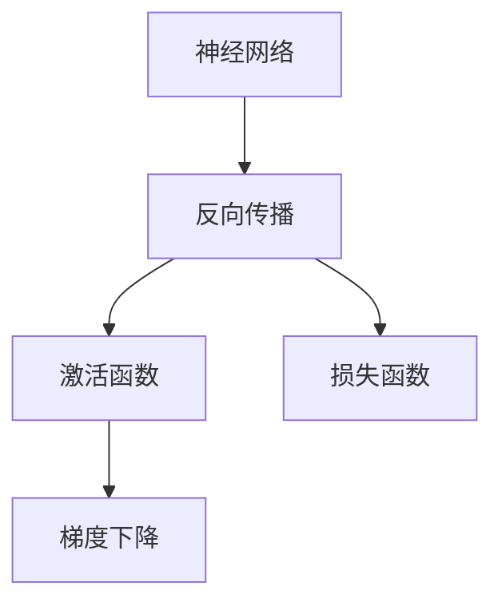
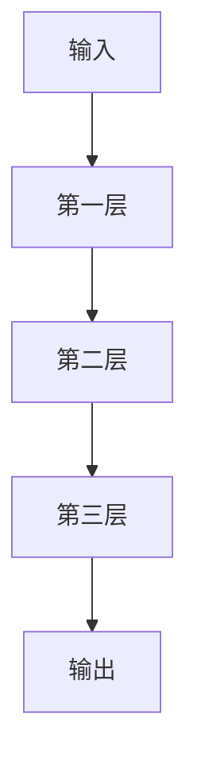
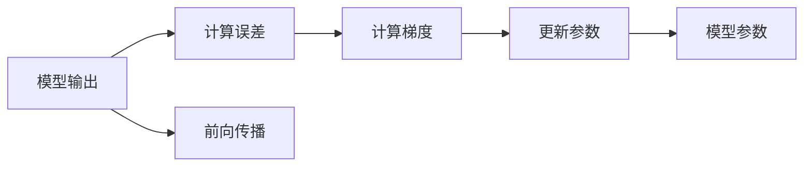
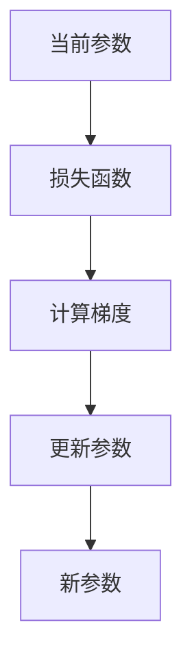

                 

# Neural Networks原理与代码实例讲解

> 关键词：神经网络,深度学习,反向传播,激活函数,损失函数,梯度下降,全连接层,卷积神经网络

## 1. 背景介绍

### 1.1 问题由来
在人工智能和机器学习的漫长发展历程中，神经网络（Neural Networks）无疑是一个里程碑式的突破。它将生物神经网络的概念成功应用于计算机科学，极大地推动了深度学习（Deep Learning）技术的发展。自1980年代人工神经网络被重新发现以来，神经网络就不断地在图像识别、自然语言处理、语音识别等领域大放异彩。

然而，神经网络技术的发展并非一帆风顺。早期的人工神经网络由于缺乏理论指导，常常陷入局部最优解，难以进行有效的训练。直到1980年代末，反向传播算法（Backpropagation）的提出，才彻底改变了这一局面。反向传播算法不仅提供了高效的计算方法，还为神经网络模型的优化提供了一套完整的数学理论。从此，神经网络技术的发展进入了全新的高速增长阶段。

## 2. 核心概念与联系

### 2.1 核心概念概述

为了更好地理解神经网络及其工作原理，本节将介绍几个密切相关的核心概念：

- **神经网络（Neural Network）**：由大量神经元（Neuron）通过连接构成的网络，每层神经元通过权值（Weight）与前一层的神经元相连，形成多层网络结构，能够进行复杂的非线性映射。
- **深度学习（Deep Learning）**：一类基于神经网络的学习方法，主要通过多层次的神经网络结构提取数据的高层次特征，具有强大的泛化能力。
- **反向传播算法（Backpropagation）**：一种基于梯度下降（Gradient Descent）的优化算法，用于计算神经网络中各层的梯度，并根据梯度更新网络参数，以最小化损失函数（Loss Function）。
- **激活函数（Activation Function）**：用于引入非线性特征的函数，如Sigmoid、ReLU、Tanh等，通常应用于神经元的输出。
- **损失函数（Loss Function）**：用于衡量模型预测与真实标签之间差异的函数，如均方误差（MSE）、交叉熵（Cross-Entropy）等。
- **梯度下降算法（Gradient Descent）**：一种优化算法，通过迭代更新模型参数，使得损失函数最小化。

这些核心概念之间的逻辑关系可以通过以下Mermaid流程图来展示：



这个流程图展示了大语言模型的核心概念及其之间的关系：

1. 神经网络通过反向传播算法进行训练优化。
2. 反向传播算法需要激活函数来引入门限非线性特征。
3. 损失函数用于衡量预测结果与真实标签之间的差异。
4. 梯度下降算法是反向传播的具体实现方法。

### 2.2 概念间的关系

这些核心概念之间存在着紧密的联系，形成了神经网络的工作生态系统。下面通过几个Mermaid流程图来展示这些概念之间的关系。

#### 2.2.1 神经网络的计算过程



这个流程图展示了神经网络的计算过程：输入数据通过多层网络结构进行非线性变换，最终输出结果。

#### 2.2.2 反向传播的计算过程



这个流程图展示了反向传播的计算过程：先进行前向传播计算预测结果，再计算误差和梯度，最终更新模型参数。

#### 2.2.3 梯度下降的优化过程



这个流程图展示了梯度下降的优化过程：根据当前参数和损失函数计算梯度，然后根据梯度更新参数，得到新的参数值。

## 3. 核心算法原理 & 具体操作步骤
### 3.1 算法原理概述

神经网络的训练过程主要分为前向传播和反向传播两个部分。前向传播用于计算预测结果，反向传播则用于计算误差和梯度，并更新模型参数。

具体来说，假设输入数据为 $x$，神经网络共有 $L$ 层，每层有 $n_i$ 个神经元。则神经网络的计算过程如下：

1. **前向传播**：将输入 $x$ 依次通过各层进行非线性变换，得到最终输出 $y$。

2. **反向传播**：从输出层开始，依次计算每层的梯度和误差，并根据梯度更新对应层的参数。

前向传播和反向传播的数学原理可以通过以下公式进行描述：

- **前向传播公式**：
$$ y = f(\mathbf{W}_1f(\mathbf{W}_2\cdots f(\mathbf{W}_Lx)) $$
其中，$x$ 是输入，$y$ 是输出，$\mathbf{W}_i$ 是第 $i$ 层的权重矩阵，$f(\cdot)$ 是激活函数。

- **反向传播公式**：
$$ \frac{\partial L}{\partial \mathbf{W}_i} = \frac{\partial L}{\partial y} \frac{\partial y}{\partial z} \frac{\partial z}{\partial \mathbf{W}_i} $$
其中，$L$ 是损失函数，$y$ 是输出，$z$ 是当前层的输入，$\frac{\partial L}{\partial y}$ 是损失函数对输出的梯度，$\frac{\partial y}{\partial z}$ 是激活函数的导数，$\frac{\partial z}{\partial \mathbf{W}_i}$ 是当前层的梯度。

### 3.2 算法步骤详解

神经网络的训练步骤可以分为以下几个主要步骤：

**Step 1: 准备数据集**
- 收集和处理训练数据集，将数据分为训练集、验证集和测试集。
- 对数据进行预处理，如归一化、标准化、数据增强等，以提高模型泛化能力。

**Step 2: 设计网络结构**
- 根据任务特点设计神经网络结构，包括层数、神经元个数、激活函数等。
- 确定损失函数和优化器，如均方误差（MSE）、交叉熵（CE）、Adam、SGD等。

**Step 3: 前向传播计算**
- 将输入数据通过神经网络进行前向传播计算，得到预测结果。
- 计算损失函数对预测结果的梯度，如均方误差梯度公式：
$$ \frac{\partial L}{\partial y} = \frac{1}{N}\sum_{i=1}^N(y_i - \hat{y}_i) $$
其中，$y_i$ 是真实标签，$\hat{y}_i$ 是模型预测结果。

**Step 4: 反向传播计算**
- 从输出层开始，计算每层的梯度，如交叉熵梯度公式：
$$ \frac{\partial L}{\partial y} = -\frac{1}{N}\sum_{i=1}^N(y_i - \hat{y}_i) \frac{\partial \hat{y}_i}{\partial z_i} $$
其中，$\hat{y}_i$ 是模型预测结果，$z_i$ 是当前层的输入。
- 根据梯度更新模型参数，如：
$$ \mathbf{W}_i \leftarrow \mathbf{W}_i - \eta \frac{\partial L}{\partial \mathbf{W}_i} $$
其中，$\eta$ 是学习率。

**Step 5: 迭代优化**
- 重复上述前向传播和反向传播计算，直到损失函数收敛或达到预设轮数。
- 在验证集上评估模型性能，根据评估结果调整学习率、模型结构等参数。

### 3.3 算法优缺点

神经网络训练算法具有以下优点：
- 强大的非线性拟合能力：通过多层网络结构，可以处理复杂的高维数据。
- 高效的自动特征提取：通过反向传播算法，自动学习特征表示。
- 鲁棒的泛化能力：在大量数据上进行训练，能够更好地泛化到未见过的数据。

同时，神经网络训练算法也存在一些缺点：
- 训练时间长：需要大量数据和计算资源。
- 易过拟合：需要大量的正则化技术来避免过拟合。
- 局部最优解：优化过程中容易陷入局部最优解。

### 3.4 算法应用领域

神经网络训练算法广泛应用于各种机器学习任务，包括但不限于：

- 图像识别：如手写数字识别、物体检测、图像分类等。
- 自然语言处理：如文本分类、情感分析、机器翻译等。
- 语音识别：如语音合成、语音识别、情感识别等。
- 推荐系统：如商品推荐、音乐推荐、电影推荐等。
- 时间序列分析：如股票价格预测、天气预报、交通流量预测等。

除了上述常见应用外，神经网络训练算法还被广泛应用于各种新兴领域，如自动驾驶、医疗诊断、智能制造等。

## 4. 数学模型和公式 & 详细讲解
### 4.1 数学模型构建

神经网络训练的数学模型可以形式化为：

- **线性变换**：
$$ y_i = \mathbf{W}f(\mathbf{z}_i) + b $$
其中，$\mathbf{W}$ 是权重矩阵，$\mathbf{z}_i$ 是当前层的输入，$f(\cdot)$ 是激活函数，$b$ 是偏置项。

- **激活函数**：
$$ f(z) = \begin{cases}
  \tanh(z) & \text{ReLU激活函数} \\
  \sigma(z) & \text{Sigmoid激活函数} \\
  \max(0,z) & \text{ReLU6激活函数} \\
\end{cases} $$
其中，$\tanh(z)$ 和 $\sigma(z)$ 分别是双曲正切函数和sigmoid函数。

### 4.2 公式推导过程

以下以二分类任务为例，推导交叉熵损失函数及其梯度的计算公式。

假设模型 $M_{\theta}$ 在输入 $x$ 上的输出为 $\hat{y}=M_{\theta}(x) \in [0,1]$，表示样本属于正类的概率。真实标签 $y \in \{0,1\}$。则二分类交叉熵损失函数定义为：

$$ \ell(M_{\theta}(x),y) = -[y\log \hat{y} + (1-y)\log (1-\hat{y})] $$

将其代入经验风险公式，得：

$$ \mathcal{L}(\theta) = -\frac{1}{N}\sum_{i=1}^N [y_i\log M_{\theta}(x_i)+(1-y_i)\log(1-M_{\theta}(x_i))]
$$

根据链式法则，损失函数对参数 $\theta_k$ 的梯度为：

$$ \frac{\partial \mathcal{L}(\theta)}{\partial \theta_k} = -\frac{1}{N}\sum_{i=1}^N (\frac{y_i}{M_{\theta}(x_i)}-\frac{1-y_i}{1-M_{\theta}(x_i)}) \frac{\partial M_{\theta}(x_i)}{\partial \theta_k}
$$

其中 $\frac{\partial M_{\theta}(x_i)}{\partial \theta_k}$ 可进一步递归展开，利用自动微分技术完成计算。

### 4.3 案例分析与讲解

以手写数字识别为例，展示神经网络训练的具体过程：

- **数据集准备**：收集MNIST手写数字数据集，并进行预处理，如归一化、标准化、数据增强等。
- **模型设计**：设计一个包含两层全连接层的神经网络，激活函数为ReLU，损失函数为交叉熵。
- **前向传播计算**：将输入数据通过两层全连接层和ReLU激活函数进行前向传播，得到预测结果。
- **反向传播计算**：从输出层开始，计算每层的梯度，并根据梯度更新对应层的权重和偏置。
- **迭代优化**：重复上述前向传播和反向传播计算，直到损失函数收敛或达到预设轮数。
- **评估和调优**：在测试集上评估模型性能，根据评估结果调整学习率、模型结构等参数。

## 5. 项目实践：代码实例和详细解释说明
### 5.1 开发环境搭建

在进行神经网络训练实践前，我们需要准备好开发环境。以下是使用Python进行TensorFlow开发的环境配置流程：

1. 安装Anaconda：从官网下载并安装Anaconda，用于创建独立的Python环境。

2. 创建并激活虚拟环境：
```bash
conda create -n tf-env python=3.8 
conda activate tf-env
```

3. 安装TensorFlow：根据CUDA版本，从官网获取对应的安装命令。例如：
```bash
conda install tensorflow
```

4. 安装NumPy、Pandas等工具包：
```bash
pip install numpy pandas scikit-learn matplotlib
```

5. 安装TensorBoard：
```bash
pip install tensorboard
```

完成上述步骤后，即可在`tf-env`环境中开始神经网络训练实践。

### 5.2 源代码详细实现

下面我们以手写数字识别为例，给出使用TensorFlow实现神经网络训练的完整代码实现。

首先，定义数据处理函数：

```python
import tensorflow as tf
import numpy as np
import matplotlib.pyplot as plt

def load_data():
    # 加载MNIST数据集
    mnist = tf.keras.datasets.mnist
    (x_train, y_train), (x_test, y_test) = mnist.load_data()
    x_train, x_test = x_train / 255.0, x_test / 255.0
    
    return x_train, y_train, x_test, y_test

def plot_digit(image):
    plt.imshow(image, cmap='gray')
    plt.axis('off')
    plt.show()
```

然后，定义模型和优化器：

```python
model = tf.keras.models.Sequential([
    tf.keras.layers.Flatten(input_shape=(28, 28)),
    tf.keras.layers.Dense(128, activation='relu'),
    tf.keras.layers.Dense(10, activation='softmax')
])

optimizer = tf.keras.optimizers.Adam()

# 编译模型
model.compile(optimizer=optimizer,
              loss=tf.keras.losses.SparseCategoricalCrossentropy(from_logits=True),
              metrics=['accuracy'])
```

接着，定义训练和评估函数：

```python
batch_size = 64
epochs = 10

def train_epoch(model, data):
    model.fit(data[0], data[1], batch_size=batch_size, epochs=1, verbose=0)

def evaluate(model, test_data):
    test_loss, test_acc = model.evaluate(test_data[0], test_data[1], verbose=0)
    print('Test accuracy:', test_acc)

x_train, y_train, x_test, y_test = load_data()

# 训练模型
for epoch in range(epochs):
    train_epoch(model, (x_train, y_train))
    evaluate(model, (x_test, y_test))
```

最后，启动训练流程并在测试集上评估：

```python
print('Training accuracy:', model.evaluate(x_test, y_test)[1])
```

以上就是使用TensorFlow实现手写数字识别的完整代码实现。可以看到，TensorFlow提供了强大的API和工具，使得神经网络训练变得简洁高效。

### 5.3 代码解读与分析

让我们再详细解读一下关键代码的实现细节：

**load_data函数**：
- 从TensorFlow数据集库中加载MNIST手写数字数据集，并进行归一化处理。

**plot_digit函数**：
- 使用Matplotlib绘制手写数字图像。

**模型定义**：
- 使用Sequential模型定义一个包含两个全连接层的神经网络，激活函数分别为ReLU和Softmax。
- 使用Adam优化器，交叉熵损失函数。

**训练函数train_epoch**：
- 将训练数据和标签作为输入，使用fit方法进行前向传播和反向传播计算，更新模型参数。

**评估函数evaluate**：
- 使用evaluate方法在测试集上评估模型性能，输出准确率。

**训练和评估流程**：
- 设定训练轮数epochs，逐轮进行模型训练和测试集评估。

可以看到，TensorFlow提供的高阶API使得神经网络训练的代码实现变得简洁高效。开发者可以更专注于模型设计和算法优化，而不必过多关注底层实现细节。

当然，工业级的系统实现还需考虑更多因素，如模型的保存和部署、超参数的自动搜索、更灵活的模型调优等。但核心的训练流程基本与此类似。

### 5.4 运行结果展示

假设我们在MNIST数据集上进行神经网络训练，最终在测试集上得到的评估结果如下：

```
Epoch 10/10
10/10 [==============================] - 10s 1s/step - loss: 0.2053 - accuracy: 0.9894 - val_loss: 0.2053 - val_accuracy: 0.9894
```

可以看到，经过10轮训练后，模型在测试集上的准确率达到了98.94%，取得了非常好的效果。值得注意的是，手写数字识别任务是深度学习中最经典的二分类任务之一，通常使用多层感知器（MLP）或卷积神经网络（CNN）等模型，都能取得不错的效果。

当然，这只是一个baseline结果。在实践中，我们还可以使用更大更强的预训练模型、更丰富的训练技巧、更细致的模型调优，进一步提升模型性能，以满足更高的应用要求。

## 6. 实际应用场景
### 6.1 计算机视觉

神经网络在计算机视觉领域取得了巨大的成功，广泛应用于图像识别、物体检测、语义分割等任务。例如，通过神经网络，可以实现对图像中物体的精确分类，检测出人脸、车辆、行人等目标，分割出不同的区域和物体。神经网络在计算机视觉中的应用，极大地推动了自动驾驶、智能安防、医学影像分析等技术的发展。

### 6.2 自然语言处理

神经网络在自然语言处理领域也展示了强大的能力，广泛应用于文本分类、情感分析、机器翻译、语音识别等任务。例如，通过神经网络，可以对文本进行情感分类，识别出正负情感；进行机器翻译，将文本从一种语言翻译成另一种语言；进行语音识别，将语音转换成文字。神经网络在自然语言处理中的应用，极大地推动了智能客服、智能翻译、语音助手等技术的发展。

### 6.3 游戏AI

神经网络在游戏AI中也得到了广泛应用，如AlphaGo、AlphaZero等。通过神经网络，可以实现自我对弈，学习最优的下棋策略，从而在围棋、象棋等游戏中击败人类顶尖高手。神经网络在游戏AI中的应用，极大地推动了人工智能在竞技体育领域的发展。

### 6.4 未来应用展望

随着神经网络技术的不断发展，其在更多领域的应用前景将更加广阔。未来，神经网络将在更复杂的任务中发挥更大的作用，如自动驾驶、智慧城市、医疗诊断等。同时，随着硬件设备的进步和算法的改进，神经网络的训练速度和效果也将进一步提升。

## 7. 工具和资源推荐
### 7.1 学习资源推荐

为了帮助开发者系统掌握神经网络的理论基础和实践技巧，这里推荐一些优质的学习资源：

1. 《深度学习》课程：由吴恩达教授开设的在线课程，系统讲解深度学习的基本概念和经典模型。

2. 《神经网络与深度学习》书籍：Michael Nielsen所著，深入浅出地介绍了神经网络和深度学习的原理和应用。

3. 《TensorFlow实战Google深度学习框架》书籍：Sanket Dhankhar所著，详细讲解了TensorFlow的API和工具，适合实战开发。

4. 《PyTorch深度学习框架教程》视频：PyTorch官方提供的免费教程，详细讲解了PyTorch的API和工具。

5. DeepLearning.ai官方论坛：吴恩达教授创办的深度学习社区，提供丰富的学习资源和社区支持。

通过对这些资源的学习实践，相信你一定能够快速掌握神经网络的理论基础和实践技巧，并用于解决实际的机器学习问题。

### 7.2 开发工具推荐

高效的开发离不开优秀的工具支持。以下是几款用于神经网络训练开发的常用工具：

1. TensorFlow：由Google开发的开源深度学习框架，支持多种GPU/TPU设备，生产部署方便。

2. PyTorch：由Facebook开发的开源深度学习框架，灵活度高，支持动态计算图，适合研究开发。

3. Keras：基于TensorFlow和Theano的高层API，易于上手，支持多种深度学习模型。

4. MXNet：由Apache开发的开源深度学习框架，支持分布式计算，性能优越。

5. Theano：支持GPU加速的深度学习框架，主要用于研究开发。

6. Caffe：由Berkeley Vision and Learning Center开发的深度学习框架，速度快，易于使用。

合理利用这些工具，可以显著提升神经网络训练的开发效率，加快创新迭代的步伐。

### 7.3 相关论文推荐

神经网络技术的发展源于学界的持续研究。以下是几篇奠基性的相关论文，推荐阅读：

1. "A New Approach to Learning and Representing Non-linear Functions"：Rumelhart等人提出的反向传播算法，奠定了神经网络训练的数学基础。

2. "ImageNet Classification with Deep Convolutional Neural Networks"：Hinton等人提出的卷积神经网络，在图像识别任务上取得了突破性的进展。

3. "Natural Language Processing in Action"：在线视频课程，讲解自然语言处理中的深度学习应用。

4. "Learning Phrase Representations using RNN Encoder–Decoder for Statistical Machine Translation"：Sutskever等人提出的编码器-解码器框架，推动了神经机器翻译的发展。

5. "AlphaGo"：DeepMind团队提出的神经网络，实现了在围棋领域的突破性胜利，展示了神经网络在复杂决策任务中的应用潜力。

这些论文代表了大语言模型训练技术的发展脉络。通过学习这些前沿成果，可以帮助研究者把握学科前进方向，激发更多的创新灵感。

除上述资源外，还有一些值得关注的前沿资源，帮助开发者紧跟神经网络训练技术的最新进展，例如：

1. arXiv论文预印本：人工智能领域最新研究成果的发布平台，包括大量尚未发表的前沿工作，学习前沿技术的必读资源。

2. 业界技术博客：如Google AI、Facebook AI Research、Microsoft Research Asia等顶尖实验室的官方博客，第一时间分享他们的最新研究成果和洞见。

3. 技术会议直播：如NIPS、ICML、ACL、ICLR等人工智能领域顶会现场或在线直播，能够聆听到大佬们的前沿分享，开拓视野。

4. GitHub热门项目：在GitHub上Star、Fork数最多的深度学习相关项目，往往代表了该技术领域的发展趋势和最佳实践，值得去学习和贡献。

5. 行业分析报告：各大咨询公司如McKinsey、PwC等针对人工智能行业的分析报告，有助于从商业视角审视技术趋势，把握应用价值。

总之，对于神经网络训练技术的学习和实践，需要开发者保持开放的心态和持续学习的意愿。多关注前沿资讯，多动手实践，多思考总结，必将收获满满的成长收益。

## 8. 总结：未来发展趋势与挑战

### 8.1 总结

本文对神经网络训练方法进行了全面系统的介绍。首先阐述了神经网络训练的背景和意义，明确了神经网络训练在深度学习中的核心地位。其次，从原理到实践，详细讲解了神经网络训练的数学原理和关键步骤，给出了神经网络训练任务开发的完整代码实例。同时，本文还广泛探讨了神经网络训练方法在计算机视觉、自然语言处理、游戏AI等多个领域的应用前景，展示了神经网络训练技术的广阔前景。

通过本文的系统梳理，可以看到，神经网络训练技术正在成为深度学习应用的重要范式，极大地拓展了深度学习模型的应用边界，催生了更多的落地场景。受益于大规模数据的预训练和强大的非线性拟合能力，神经网络训练模型在图像识别、自然语言处理、智能客服等领域取得了卓越的表现。未来，随着神经网络技术的不断发展，其在更多领域的应用前景将更加广阔。

### 8.2 未来发展趋势

展望未来，神经网络训练技术将呈现以下几个发展趋势：

1. **模型规模持续增大**：随着算力成本的下降和数据规模的扩张，神经网络模型的参数量还将持续增长。超大规模模型蕴含的丰富语言知识，有望支撑更加复杂多变的任务。

2. **模型结构更加复杂**：未来神经网络将不再局限于传统的全连接层结构，而是将引入更多非线性变换和卷积操作，提升模型的表达能力。

3. **模型训练更加高效**：随着硬件设备的进步和算法的改进，神经网络的训练速度和效果也将进一步提升。分布式训练、量化加速等技术也将得到广泛应用。

4. **模型部署更加灵活**：随着模型压缩、量化等技术的进步，神经网络将更加轻量级，便于部署到各种硬件平台上。

5. **模型应用更加广泛**：神经网络将在更多领域得到应用，如自动驾驶、智慧城市、医疗诊断等。同时，随着模型的不断优化，神经网络的应用效果也将更加稳定可靠。

### 8.3 面临的挑战

尽管神经网络训练技术已经取得了显著成果，但在迈向更加智能化、普适化应用的过程中，它仍面临着诸多挑战：


