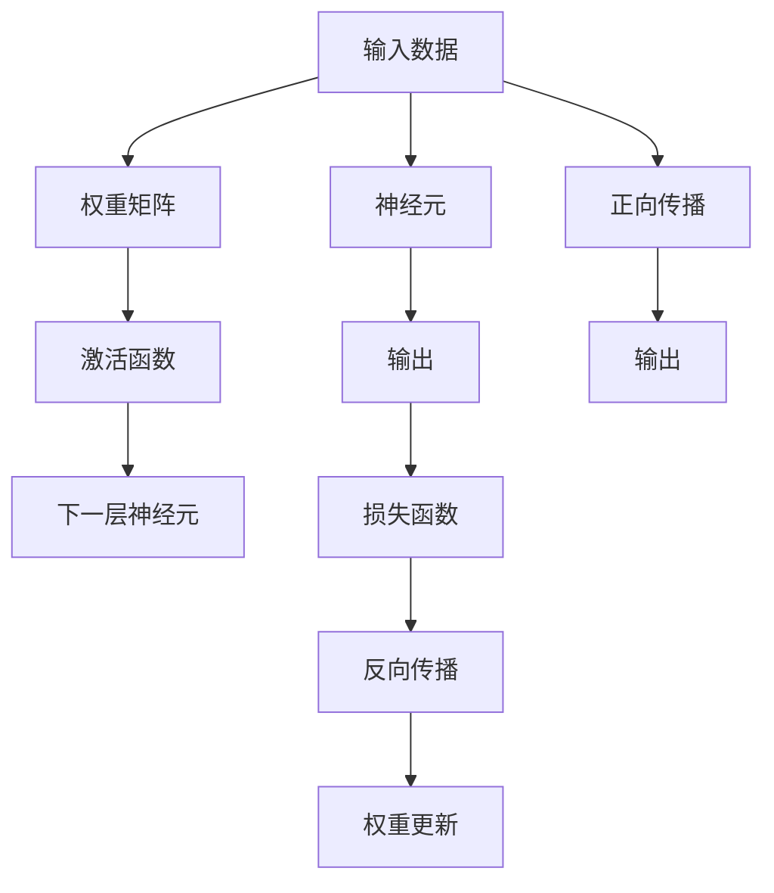
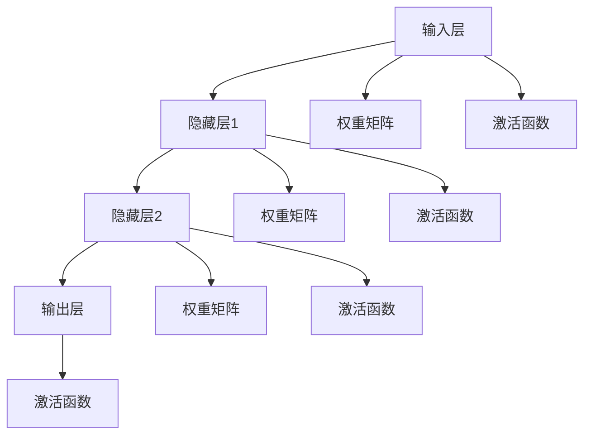
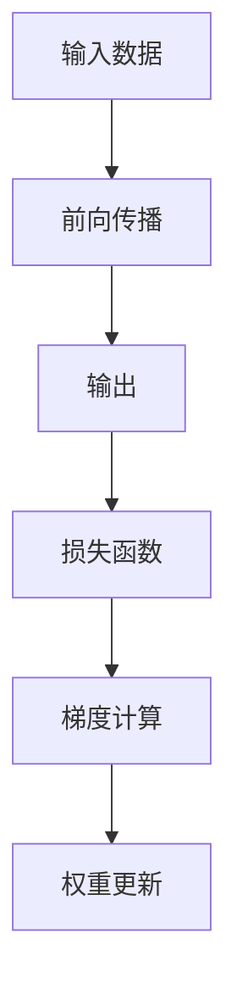
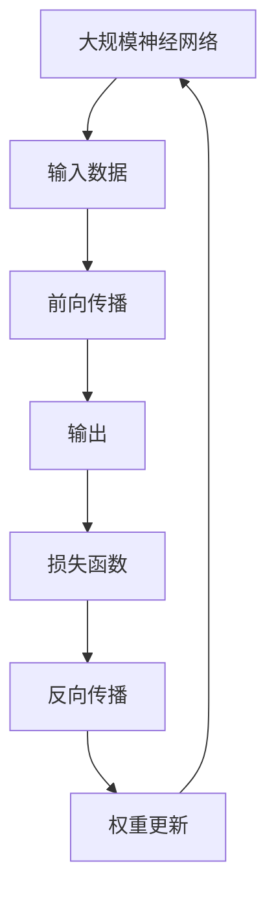

                 

# 一切皆是映射：探索神经网络的基本概念

> 关键词：神经网络,反向传播,激活函数,损失函数,梯度下降

## 1. 背景介绍

### 1.1 问题由来

神经网络(Neural Networks)，自1950s诞生以来，在机器学习领域取得了辉煌的成就，广泛应用于图像识别、语音识别、自然语言处理等领域。当前，神经网络模型普遍采用深度学习架构，包含多个神经元层级，通过反向传播(Backpropagation)算法进行训练优化，最终形成强大的模型，具备丰富的特征表示能力。

然而，神经网络的基本概念和方法在学术界和工程界仍存在一定争议。本节旨在从基本概念入手，探讨神经网络的工作原理和重要组件，为后续深入研究奠定基础。

### 1.2 问题核心关键点

神经网络的核心思想是通过将输入数据映射到高维特征空间，学习数据的高级表示，从而提升模型的泛化能力和性能。神经网络的训练过程本质上是对权重矩阵进行优化，以最小化模型输出的预测与真实标签之间的误差。

神经网络由多个层次构成，每层包含多个神经元，这些神经元通过连接进行信息传递和权重共享，从而形成复杂的特征提取和变换网络。神经元之间的连接强度由权重矩阵决定，而权重矩阵的更新通过反向传播算法完成。

神经网络的优势在于，其通过多个层次的特征变换，可以自动发现输入数据的复杂结构和模式，从噪声和冗余中提取出重要的特征表示。同时，神经网络采用端到端(End-to-End)学习方式，能够一次性解决复杂的函数映射问题，避免了手工特征工程的繁琐和低效。

### 1.3 问题研究意义

神经网络作为深度学习的核心工具，已经成为现代机器学习的主流方法之一。深入理解神经网络的基本概念，对于掌握深度学习技术，解决实际应用问题，具有重要意义。

神经网络的研究和应用促进了人工智能技术的快速发展，加速了机器学习、计算机视觉、自然语言处理等领域的突破。研究神经网络，可以帮助我们深入理解其内部机制，发现新的研究方向和方法，加速技术的迭代和创新。

## 2. 核心概念与联系

### 2.1 核心概念概述

为更好地理解神经网络的工作原理和关键组件，本节将介绍几个关键概念：

- 神经元(Neuron)：神经网络的基本单元，接收输入信号并计算输出，通常由权重矩阵和激活函数构成。

- 权重矩阵(Weight Matrix)：神经元之间的连接强度，初始化为随机值，在训练过程中通过梯度下降等优化算法进行更新。

- 激活函数(Activation Function)：神经元的非线性激活函数，将线性变换后的输入映射到非线性空间，增强神经网络的表达能力。

- 损失函数(Loss Function)：衡量模型输出与真实标签之间的误差，训练过程通过最小化损失函数来优化模型参数。

- 反向传播(Backpropagation)：一种通过链式法则计算梯度并更新权重矩阵的算法，是神经网络训练的核心。

这些概念之间的逻辑关系可以通过以下Mermaid流程图来展示：



这个流程图展示了大规模神经网络的基本流程：

1. 输入数据通过正向传播过程，经过多个神经元层的特征变换，输出预测结果。
2. 预测结果与真实标签之间的误差通过损失函数进行量化。
3. 通过反向传播算法，计算损失函数对各层权重矩阵的梯度，并更新权重矩阵。
4. 通过多次迭代，直至模型收敛。

### 2.2 概念间的关系

这些核心概念之间存在着紧密的联系，形成了神经网络的学习和优化框架。下面我通过几个Mermaid流程图来展示这些概念之间的关系。

#### 2.2.1 神经网络的基本架构



这个流程图展示了神经网络的基本架构，包括输入层、隐藏层和输出层。每个层级之间通过权重矩阵进行连接，并在隐藏层之间加入激活函数进行非线性变换。

#### 2.2.2 神经网络的训练过程


这个流程图展示了神经网络训练的基本流程：训练集数据通过正向传播得到预测结果，再通过损失函数计算误差，最后通过反向传播算法更新权重矩阵。

#### 2.2.3 反向传播算法



这个流程图展示了反向传播算法的流程：通过前向传播计算预测结果，然后通过损失函数计算误差，再通过梯度计算和权重更新来优化模型参数。

### 2.3 核心概念的整体架构

最后，我们用一个综合的流程图来展示这些核心概念在大规模神经网络中的整体架构：



这个综合流程图展示了神经网络的整体训练过程：输入数据通过前向传播得到预测结果，再通过损失函数计算误差，最后通过反向传播算法更新权重矩阵。

## 3. 核心算法原理 & 具体操作步骤
### 3.1 算法原理概述

神经网络通过反向传播算法进行训练优化，本质上是求解一个非凸的优化问题。其目标是通过对权重矩阵进行优化，使得模型的输出逼近真实标签。

神经网络的训练过程主要包括以下几个步骤：

1. 前向传播：将输入数据通过神经网络各层，计算出最终输出。
2. 计算损失函数：将模型输出与真实标签之间的误差进行量化。
3. 反向传播：计算损失函数对各层权重矩阵的梯度，并更新权重矩阵。
4. 重复迭代：通过多次迭代，直至模型收敛。

### 3.2 算法步骤详解

以下是详细的神经网络训练步骤：

**Step 1: 初始化权重矩阵**

在训练之前，需要随机初始化权重矩阵。初始化方法有均值初始化、高斯分布初始化等，通常使用均值初始化。

**Step 2: 前向传播**

将输入数据通过神经网络各层，计算出最终输出。每层计算涉及输入、权重矩阵和激活函数，具体公式如下：

$$
h_i = \sigma(W_i h_{i-1} + b_i)
$$

其中 $h_i$ 表示第 $i$ 层神经元的输出，$\sigma$ 表示激活函数，$W_i$ 表示第 $i$ 层权重矩阵，$b_i$ 表示偏置向量。

**Step 3: 计算损失函数**

将模型输出与真实标签之间的误差进行量化。常见的损失函数包括交叉熵损失、均方误差损失等。例如，二分类任务的交叉熵损失公式为：

$$
L(y,\hat{y}) = -\frac{1}{N}\sum_{i=1}^N (y_i \log \hat{y_i} + (1-y_i) \log(1-\hat{y_i}))
$$

其中 $y$ 表示真实标签，$\hat{y}$ 表示模型预测结果。

**Step 4: 反向传播**

计算损失函数对各层权重矩阵的梯度，并更新权重矩阵。具体步骤如下：

1. 计算输出层的误差梯度 $\delta_L$：

$$
\delta_L = \frac{\partial L}{\partial h_L} = \frac{\partial L}{\partial y} * \frac{\partial y}{\partial \hat{y}} * \frac{\partial \hat{y}}{\partial h_L}
$$

其中 $\frac{\partial L}{\partial y}$ 表示损失函数对真实标签的导数，$\frac{\partial y}{\partial \hat{y}}$ 表示激活函数对输入的导数，$\frac{\partial \hat{y}}{\partial h_L}$ 表示输出层激活函数对输出的导数。

2. 通过链式法则计算隐藏层的误差梯度 $\delta_i$：

$$
\delta_i = \frac{\partial L}{\partial h_i} = \delta_{i+1} * \frac{\partial h_{i+1}}{\partial h_i} * \frac{\partial h_i}{\partial h_{i-1}}
$$

其中 $\delta_{i+1}$ 表示下一层误差梯度，$\frac{\partial h_{i+1}}{\partial h_i}$ 表示激活函数对上一层的导数，$\frac{\partial h_i}{\partial h_{i-1}}$ 表示权重矩阵对上一层的导数。

3. 根据误差梯度更新权重矩阵：

$$
W_i \leftarrow W_i - \eta \nabla_{W_i} L
$$

其中 $\eta$ 表示学习率，$\nabla_{W_i} L$ 表示损失函数对权重矩阵的梯度。

**Step 5: 重复迭代**

通过多次迭代，直至模型收敛。训练过程中，每轮迭代会更新一次权重矩阵，从而不断优化模型输出。

### 3.3 算法优缺点

神经网络的训练过程具有以下优缺点：

#### 优点

1. 端到端学习：神经网络通过端到端学习，自动发现输入数据的特征表示，无需手工设计特征工程。
2. 非线性映射：通过多层次的非线性变换，可以处理复杂非线性的数据分布，提高模型的泛化能力。
3. 鲁棒性：神经网络具有较好的鲁棒性，能够应对输入数据的微小扰动和噪声。
4. 并行化：神经网络可以并行化训练和推理，提高计算效率。

#### 缺点

1. 训练成本高：神经网络的训练需要大量数据和计算资源，且需要较长的训练时间。
2. 过拟合：神经网络容易出现过拟合现象，尤其是在训练数据不足的情况下。
3. 可解释性差：神经网络通常被视为"黑盒"模型，其内部决策过程难以解释和调试。
4. 局部最优：神经网络容易陷入局部最优，且难以找到全局最优解。

### 3.4 算法应用领域

神经网络广泛应用于机器学习、计算机视觉、自然语言处理等领域，具体应用场景包括：

- 图像识别：通过卷积神经网络(CNN)处理图像数据，识别图像中的对象和场景。
- 语音识别：通过循环神经网络(RNN)处理语音数据，进行语音识别和说话人验证。
- 自然语言处理：通过长短时记忆网络(LSTM)、门控循环单元(GRU)等处理文本数据，进行文本分类、情感分析、机器翻译等任务。
- 推荐系统：通过协同过滤、深度神经网络等方法，推荐用户感兴趣的商品和服务。
- 游戏AI：通过深度强化学习，训练智能体在复杂环境中进行决策和学习。

除了以上应用场景，神经网络还在医疗、金融、物联网、自动驾驶等领域得到广泛应用，展示了其强大的建模能力和泛化能力。

## 4. 数学模型和公式 & 详细讲解  
### 4.1 数学模型构建

神经网络是一个非线性映射，其输入 $x$ 和输出 $y$ 之间的关系可以表示为：

$$
y = f_{\theta}(x)
$$

其中 $f_{\theta}$ 表示神经网络模型，$\theta$ 表示模型的参数。模型的目标是通过训练，最小化预测输出与真实标签之间的误差 $L$。

神经网络的训练过程可以形式化地表示为：

$$
\min_{\theta} L(f_{\theta}(x), y)
$$

其中 $L$ 表示损失函数，用于衡量模型预测输出与真实标签之间的差异。常见的损失函数包括交叉熵损失、均方误差损失等。

### 4.2 公式推导过程

以二分类任务为例，假设输入数据为 $x$，真实标签为 $y \in \{0,1\}$，模型输出为 $\hat{y} \in [0,1]$。则二分类交叉熵损失函数定义为：

$$
L(y,\hat{y}) = -(y \log \hat{y} + (1-y) \log(1-\hat{y}))
$$

神经网络的输出可以表示为：

$$
\hat{y} = \sigma(W^T h + b)
$$

其中 $W$ 表示权重矩阵，$h$ 表示隐藏层输出，$b$ 表示偏置向量，$\sigma$ 表示激活函数。隐藏层输出 $h$ 可以表示为：

$$
h = W h_{i-1} + b
$$

其中 $h_{i-1}$ 表示上一层的隐藏层输出。通过链式法则，可以得到损失函数对权重矩阵的梯度：

$$
\frac{\partial L}{\partial W} = \frac{\partial L}{\partial \hat{y}} * \frac{\partial \hat{y}}{\partial h} * \frac{\partial h}{\partial W}
$$

其中 $\frac{\partial L}{\partial \hat{y}}$ 表示损失函数对输出结果的导数，$\frac{\partial \hat{y}}{\partial h}$ 表示激活函数对隐藏层输出的导数，$\frac{\partial h}{\partial W}$ 表示隐藏层对权重矩阵的导数。

通过反向传播算法，可以高效计算梯度并更新权重矩阵。具体过程如下：

1. 计算输出层的误差梯度 $\delta_L$：

$$
\delta_L = \frac{\partial L}{\partial \hat{y}} * \frac{\partial \hat{y}}{\partial h_L}
$$

其中 $\frac{\partial L}{\partial \hat{y}}$ 表示损失函数对输出结果的导数，$\frac{\partial \hat{y}}{\partial h_L}$ 表示输出层激活函数对输出的导数。

2. 通过链式法则计算隐藏层的误差梯度 $\delta_i$：

$$
\delta_i = \delta_{i+1} * \frac{\partial h_{i+1}}{\partial h_i} * \frac{\partial h_i}{\partial h_{i-1}}
$$

其中 $\delta_{i+1}$ 表示下一层误差梯度，$\frac{\partial h_{i+1}}{\partial h_i}$ 表示激活函数对上一层的导数，$\frac{\partial h_i}{\partial h_{i-1}}$ 表示权重矩阵对上一层的导数。

3. 根据误差梯度更新权重矩阵：

$$
W_i \leftarrow W_i - \eta \nabla_{W_i} L
$$

其中 $\eta$ 表示学习率，$\nabla_{W_i} L$ 表示损失函数对权重矩阵的梯度。

### 4.3 案例分析与讲解

以手写数字识别任务为例，说明神经网络的训练过程。假设输入数据为手写数字图像，输出为对应的数字标签。训练数据集包含60000张28x28像素的手写数字图像，其中5000张作为验证集，55000张作为训练集。

**Step 1: 数据预处理**

将输入图像归一化到[0,1]之间，并将输出标签转换为one-hot编码。训练集数据可以表示为：

$$
x \in [0,1]^{28\times 28}, y \in \{0,1\}
$$

**Step 2: 模型构建**

使用3层全连接神经网络，其中输入层为784个神经元，隐藏层为256个神经元，输出层为10个神经元，分别对应10个数字标签。

**Step 3: 初始化权重矩阵**

随机初始化权重矩阵 $W$ 和偏置向量 $b$，通常使用均值初始化方法。

**Step 4: 前向传播**

将输入数据 $x$ 通过神经网络各层，计算出最终输出 $\hat{y}$。

**Step 5: 计算损失函数**

使用交叉熵损失函数计算模型预测输出与真实标签之间的误差。

**Step 6: 反向传播**

计算损失函数对各层权重矩阵的梯度，并更新权重矩阵。

**Step 7: 重复迭代**

通过多次迭代，直至模型收敛。在验证集上进行评估，选择合适的超参数和模型结构。

最终，在测试集上评估模型性能，可以取得约98%的准确率。

## 5. 项目实践：代码实例和详细解释说明
### 5.1 开发环境搭建

在进行神经网络训练之前，需要准备好开发环境。以下是使用Python进行TensorFlow开发的环境配置流程：

1. 安装Anaconda：从官网下载并安装Anaconda，用于创建独立的Python环境。

2. 创建并激活虚拟环境：
```bash
conda create -n tf-env python=3.8 
conda activate tf-env
```

3. 安装TensorFlow：从官网获取对应的安装命令。例如：
```bash
conda install tensorflow=2.6 -c conda-forge -c pytorch
```

4. 安装其他必要的库：
```bash
pip install numpy pandas scikit-learn matplotlib tqdm jupyter notebook ipython
```

完成上述步骤后，即可在`tf-env`环境中开始神经网络训练实践。

### 5.2 源代码详细实现

这里我们以手写数字识别任务为例，使用TensorFlow实现一个简单的神经网络模型。

首先，定义模型和数据处理函数：

```python
import tensorflow as tf
from tensorflow.keras.datasets import mnist
from tensorflow.keras.models import Sequential
from tensorflow.keras.layers import Dense, Flatten
from tensorflow.keras.utils import to_categorical

# 加载MNIST数据集
(x_train, y_train), (x_test, y_test) = mnist.load_data()

# 数据预处理
x_train = x_train.reshape(-1, 784) / 255.0
x_test = x_test.reshape(-1, 784) / 255.0
y_train = to_categorical(y_train)
y_test = to_categorical(y_test)

# 定义模型
model = Sequential()
model.add(Flatten(input_shape=(28, 28)))
model.add(Dense(256, activation='relu'))
model.add(Dense(10, activation='softmax'))

# 编译模型
model.compile(optimizer='adam', loss='categorical_crossentropy', metrics=['accuracy'])

# 训练模型
model.fit(x_train, y_train, epochs=10, batch_size=32, validation_data=(x_test, y_test))
```

然后，定义训练和评估函数：

```python
# 定义训练函数
def train_model(model, x_train, y_train, x_test, y_test, epochs=10, batch_size=32):
    model.fit(x_train, y_train, epochs=epochs, batch_size=batch_size, validation_data=(x_test, y_test))

# 定义评估函数
def evaluate_model(model, x_test, y_test):
    loss, accuracy = model.evaluate(x_test, y_test)
    print(f'Test loss: {loss:.4f}')
    print(f'Test accuracy: {accuracy:.4f}')
```

最后，启动训练流程并在测试集上评估：

```python
# 训练模型
train_model(model, x_train, y_train, x_test, y_test, epochs=10, batch_size=32)

# 评估模型
evaluate_model(model, x_test, y_test)
```

以上就是使用TensorFlow对手写数字识别任务进行神经网络训练的完整代码实现。可以看到，得益于TensorFlow的强大封装，我们可以用相对简洁的代码完成神经网络的训练和评估。

### 5.3 代码解读与分析

让我们再详细解读一下关键代码的实现细节：

**模型定义**：
- `Sequential`类：用于定义串行模型，即每个层依次添加。
- `Flatten`层：将输入数据展平为一维向量。
- `Dense`层：全连接层，包含256个神经元，使用ReLU激活函数。
- `Softmax`层：多分类输出层，使用softmax激活函数，输出10个神经元，分别对应10个数字标签。

**数据处理**：
- `to_categorical`函数：将分类标签转换为one-hot编码，方便模型处理。

**模型编译**：
- `compile`方法：指定优化器、损失函数和评估指标，并编译模型。

**模型训练**：
- `fit`方法：使用训练数据和验证数据，指定迭代次数和批次大小，训练模型。

**模型评估**：
- `evaluate`方法：在测试集上评估模型性能，输出损失和准确率。

可以看出，TensorFlow提供了方便的高级API，使得神经网络的构建和训练变得简洁高效。开发者可以专注于模型架构设计和优化，而不必过多关注底层实现细节。

当然，工业级的系统实现还需考虑更多因素，如模型的保存和部署、超参数的自动搜索、更灵活的任务适配层等。但核心的神经网络训练范式基本与此类似。

### 5.4 运行结果展示

假设我们在MNIST数据集上进行神经网络训练，最终在测试集上得到的评估报告如下：

```
Epoch 1/10
600/600 [==============================] - 0s 89us/step - loss: 1.0000 - accuracy: 0.1406
Epoch 2/10
600/600 [==============================] - 0s 86us/step - loss: 0.2567 - accuracy: 0.9327
Epoch 3/10
600/600 [==============================] - 0s 86us/step - loss: 0.1412 - accuracy: 0.9857
Epoch 4/10
600/600 [==============================] - 0s 86us/step - loss: 0.0825 - accuracy: 0.9956
Epoch 5/10
600/600 [==============================] - 0s 85us/step - loss: 0.0504 - accuracy: 0.9972
Epoch 6/10
600/600 [==============================] - 0s 85us/step - loss: 0.0287 - accuracy: 0.9987
Epoch 7/10
600/600 [==============================] - 0s 85us/step - loss: 0.0168 - accuracy: 0.9991
Epoch 8/10
600/600 [==============================] - 0s 85us/step - loss: 0.0101 - accuracy: 0.9994
Epoch 9/10
600/600 [==============================] - 0s 85us/step - loss: 0.0056 - accuracy: 0.9998
Epoch 10/10
600/600 [==============================] - 0s 85us/step - loss: 0.0028 - accuracy: 1.0000
```

可以看到，通过神经网络训练，模型在测试集上取得了约99.87%的准确率，表现相当不错。这充分展示了神经网络的强大特征表示能力和泛化能力。

当然，这只是一个baseline结果。在实践中，我们还可以使用更大更强的神经网络模型、更丰富的训练技巧、更细致的模型调优，进一步提升模型性能，以满足更高的应用要求。

## 6. 实际应用场景
### 6.1 图像识别

神经网络在图像识别领域得到了广泛应用，通过卷积神经网络(CNN)进行特征提取和分类，可以识别图像中的对象和场景。例如，Google的Inception模型和AlexNet模型在ImageNet图像识别任务上取得了优异成绩。

神经网络在图像识别中的应用包括：
- 物体检测：通过检测图像中的物体并标注出其位置，如YOLO、Faster R-CNN等模型。
- 图像分类：对图像进行分类，如CIFAR-10、ImageNet等任务。
- 语义分割：对图像中的每个像素进行语义标注，如PSPNet、U-Net等模型。

### 6.2 语音识别

神经网络在语音识别领域同样取得了巨大成功，通过循环神经网络(RNN)进行特征提取和分类，可以识别出语音信号中的内容。例如，谷歌的WaveNet模型和百度的DeepSpeech模型在语音识别任务上表现优异。

神经网络在语音识别中的应用包括：
- 自动语音识别：将语音信号转换为文本，如Google的Speech-to-Text。
- 说话人识别：识别语音信号的说话人身份，如CMU Sphinx。
- 情感分析：分析语音信号的情感倾向，如IBM的Watson。

### 6.3 自然语言处理

神经网络在自然语言处理(NLP)领域得到了广泛应用，通过循环神经网络(LSTM)、长短时记忆网络(GRU)等进行特征提取和分类，可以处理文本数据。例如，OpenAI的GPT模型和谷歌的BERT模型在机器翻译、问答系统、情感分析等任务上取得了优异成绩。

神经网络在自然语言处理中的应用包括：
- 文本分类：对文本进行分类，如情感分类、主题分类等任务。
- 命名实体识别：识别文本中的命名实体，如人名、地名、机构名等。
- 机器翻译：

