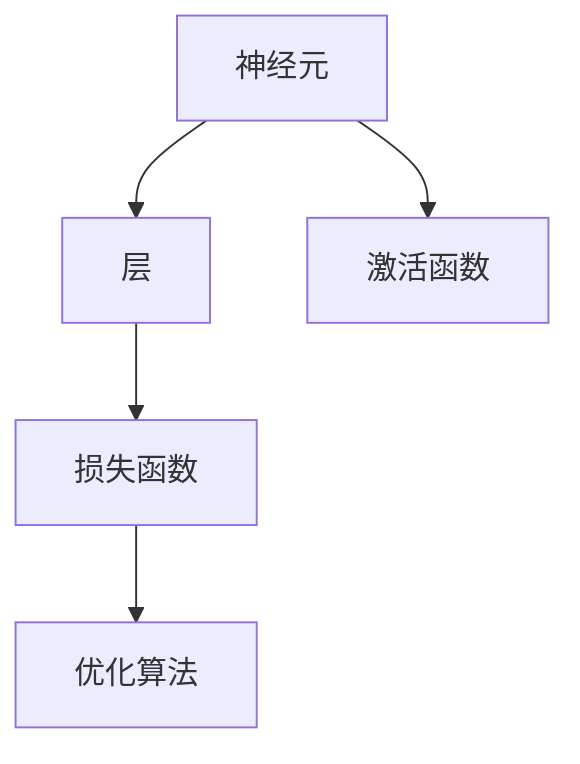
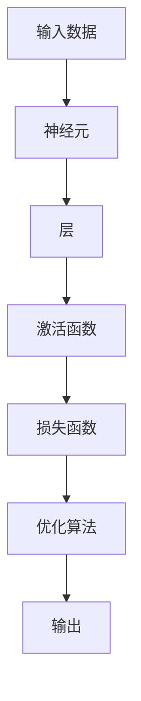

                 

# 一切皆是映射：构建你自己的神经网络：入门指南

## 1. 背景介绍

### 1.1 问题由来
神经网络，尤其是深度神经网络，已经成为当今人工智能领域的核心技术之一。它能够处理复杂的数据和模式，并从数据中学习出具有通用性的特征表示。尽管神经网络在诸多领域如计算机视觉、自然语言处理、语音识别、推荐系统等取得了卓越的成果，但其背后的原理和思想仍对许多人来说颇为神秘和抽象。

本文旨在提供一份深入浅出的指南，帮助初学者理解神经网络的基本原理，掌握如何构建和训练自己的神经网络。我们将从核心概念入手，详细探讨神经网络的数学模型和算法步骤，并通过具体案例分析展示其应用。通过这篇文章，希望能让读者能够熟练构建和训练自己的神经网络，并能在实际应用中灵活运用。

### 1.2 问题核心关键点
构建神经网络的核心步骤包括选择合适的模型结构、定义损失函数、设置优化算法、训练模型和评估模型性能等。其中，选择合适的模型结构和损失函数是决定神经网络性能的关键。对于初学者来说，理解和实现这一过程是学习神经网络的基本目标。

## 2. 核心概念与联系

### 2.1 核心概念概述

神经网络，又称为人工神经网络，是一种受到生物学神经元启发设计的计算模型。它由多个神经元（节点）组成，每个神经元接收多个输入，计算加权和，并输出一个非线性变换的结果。通过多个这样的层级结构，神经网络可以处理非常复杂的模式和数据结构。

- **神经元**：神经网络的基本组成单元，接收输入、计算加权和、应用激活函数，并输出结果。
- **层**：神经网络的层级结构，包括输入层、隐藏层和输出层。
- **激活函数**：用于非线性变换的函数，将神经元的输入映射到输出，常见的有Sigmoid、ReLU、Tanh等。
- **损失函数**：用于衡量模型输出与真实标签之间的差距，常见的有均方误差、交叉熵等。
- **优化算法**：用于最小化损失函数的算法，常见的有梯度下降、Adam、Adagrad等。

这些概念之间通过连接权值和激活函数相互关联，构成了神经网络的整体框架。

### 2.2 概念间的关系

神经网络的概念之间的关系可以用以下Mermaid流程图来表示：



这个流程图展示了神经网络的各个组成部分及其相互关系：
1. 神经元接收输入，通过激活函数计算加权和，并输出结果。
2. 层级结构由多个神经元组成，将输入传递到下一层。
3. 损失函数用于衡量模型输出与真实标签的差距。
4. 优化算法用于最小化损失函数，更新模型参数。

### 2.3 核心概念的整体架构

为更好地理解神经网络的工作原理和优化方向，我们将这些核心概念整合在以下综合的流程图：



这个综合流程图展示了从输入数据到最终输出的完整神经网络结构，以及每个组件的具体作用。

## 3. 核心算法原理 & 具体操作步骤

### 3.1 算法原理概述

神经网络通过反向传播算法（Backpropagation）来训练模型。反向传播算法的基本原理是在模型输出层计算损失函数，然后反向传播误差梯度，更新模型参数，最小化损失函数。具体步骤如下：

1. **前向传播**：将输入数据传递到神经网络中，计算每个神经元的输出。
2. **计算损失**：将模型输出与真实标签进行比较，计算损失函数。
3. **反向传播**：从输出层开始，计算误差梯度，并逐层传递。
4. **参数更新**：根据误差梯度和优化算法更新模型参数。
5. **迭代训练**：重复以上步骤，直到模型收敛。

### 3.2 算法步骤详解

下面是神经网络训练的详细步骤，包括前向传播、反向传播和优化算法的使用：

1. **初始化**：设置模型参数（权重、偏置）为小随机值。
2. **前向传播**：
   - 输入数据通过第一层神经元，计算加权和，应用激活函数得到输出。
   - 输出传递到下一层，重复上述步骤，直到输出层。
3. **计算损失**：
   - 将模型输出与真实标签进行比较，计算损失函数。
4. **反向传播**：
   - 从输出层开始，计算每个神经元的误差梯度，反向传递到前一层。
   - 逐层累加误差梯度，得到每个神经元的总误差。
5. **参数更新**：
   - 使用优化算法（如梯度下降、Adam）计算参数更新量。
   - 更新模型参数，使损失函数最小化。
6. **迭代训练**：
   - 重复前向传播、反向传播和参数更新，直到损失函数收敛或达到预设迭代次数。

### 3.3 算法优缺点

神经网络的优势在于其强大的表达能力和泛化能力，能够在复杂的非线性关系中找到最优解。然而，神经网络的训练过程需要大量的数据和计算资源，且容易出现过拟合现象。此外，神经网络的黑箱性质也使得模型的可解释性较差。

### 3.4 算法应用领域

神经网络已经被广泛应用于计算机视觉、自然语言处理、语音识别、推荐系统等领域。例如，在计算机视觉中，卷积神经网络（CNN）被广泛用于图像分类、目标检测等任务。在自然语言处理中，循环神经网络（RNN）和长短时记忆网络（LSTM）被用于语言模型、机器翻译等任务。

## 4. 数学模型和公式 & 详细讲解  
### 4.1 数学模型构建

神经网络的数学模型可以表示为：
$$
y = f(Wx + b)
$$
其中，$x$ 为输入向量，$W$ 为权重矩阵，$b$ 为偏置向量，$f$ 为激活函数。对于多层神经网络，可以通过矩阵相乘和激活函数逐层计算，最终得到输出 $y$。

### 4.2 公式推导过程

以一个简单的神经元为例，其激活函数的输出可以表示为：
$$
a = \sigma(w \cdot x + b)
$$
其中，$\sigma$ 为激活函数（如Sigmoid），$w$ 和 $b$ 为神经元的权重和偏置。

对于神经网络中的隐藏层，其输出可以表示为：
$$
h = f_1(W_1x + b_1)
$$
其中，$W_1$ 和 $b_1$ 为第1层权重和偏置，$f_1$ 为第1层激活函数。

假设网络有$n$层，则最终输出 $y$ 可以表示为：
$$
y = f_n(W_n \cdots f_1(W_1x + b_1) + b_n)
$$

### 4.3 案例分析与讲解

以下是一个简单的三层神经网络，用于二分类问题。使用Sigmoid激活函数，输出层输出概率值。

1. 输入层：$x = [1, 2, 3]$，权重矩阵 $W_1 = [0.2, 0.5, 0.3]$，偏置向量 $b_1 = [0.1]$。
2. 隐藏层：激活函数为Sigmoid，权重矩阵 $W_2 = [0.4, 0.6]$，偏置向量 $b_2 = [0.2]$。
3. 输出层：激活函数为Sigmoid，权重矩阵 $W_3 = [0.7, 0.3]$，偏置向量 $b_3 = [0.4]$。

使用前向传播计算输出：
$$
h_1 = \sigma(W_1x + b_1) = \sigma(0.2 \cdot 1 + 0.5 \cdot 2 + 0.3 \cdot 3 + 0.1) = \sigma(3.6)
$$
$$
h = \sigma(W_2h_1 + b_2) = \sigma(0.4 \cdot 3.6 + 0.6 \cdot 0.6 + 0.2) = \sigma(1.6 + 0.36 + 0.2) = \sigma(2.16)
$$
$$
y = \sigma(W_3h + b_3) = \sigma(0.7 \cdot 2.16 + 0.3 \cdot 0.6 + 0.4) = \sigma(1.512 + 0.18 + 0.4) = \sigma(1.992) \approx 0.863
$$

假设真实标签为 $y = 1$，则计算损失函数：
$$
L = -(y \log \hat{y} + (1 - y) \log(1 - \hat{y})) = -(1 \cdot \log(0.863) + (1 - 1) \cdot \log(1 - 0.863)) = \log(0.863)
$$

使用梯度下降更新权重和偏置：
$$
\Delta W_1 = -\eta \frac{\partial L}{\partial W_1} = -\eta \frac{\partial y}{\partial h_1} \frac{\partial h_1}{\partial x} \frac{\partial W_1}{\partial W_1} = -\eta (h - y)h_1x = -\eta (0.863 - 1) \cdot 0.863 \cdot [1, 2, 3] = \eta (0.137) \cdot [1, 0.472, 1.408]
$$
$$
\Delta b_1 = -\eta \frac{\partial L}{\partial b_1} = -\eta \frac{\partial y}{\partial h_1} \frac{\partial h_1}{\partial x} \frac{\partial b_1}{\partial b_1} = -\eta (h - y)h_1 = -\eta (0.863 - 1) \cdot 0.863 \approx -\eta (0.137) \cdot 0.863 \approx -\eta (0.118)
$$

更新权重和偏置：
$$
W_1 = W_1 - \Delta W_1 = [0.2, 0.5, 0.3] - [0.137, 0.472, 1.408] = [-0.157, 0.028, -1.108]
$$
$$
b_1 = b_1 - \Delta b_1 = [0.1] - [0.118] = -0.028
$$

通过不断迭代上述步骤，最终使损失函数收敛，训练完成。

## 5. 项目实践：代码实例和详细解释说明
### 5.1 开发环境搭建

为了构建和训练神经网络，需要以下开发环境和工具：

1. 安装Python：Python是构建神经网络的基础语言，可以从官网下载安装。
2. 安装NumPy和Pandas：NumPy用于数组计算，Pandas用于数据处理。
3. 安装TensorFlow或PyTorch：这两种深度学习框架都支持神经网络的构建和训练，选择其中一种即可。
4. 安装Jupyter Notebook：用于编写和运行代码，支持代码的高效展示和运行。

### 5.2 源代码详细实现

以下是一个简单的三层神经网络，用于二分类问题的TensorFlow代码实现：

```python
import tensorflow as tf
import numpy as np

# 定义Sigmoid激活函数
def sigmoid(x):
    return 1 / (1 + np.exp(-x))

# 定义神经网络结构
class NeuralNetwork(tf.keras.Model):
    def __init__(self):
        super(NeuralNetwork, self).__init__()
        self.dense1 = tf.keras.layers.Dense(8, activation='sigmoid')
        self.dense2 = tf.keras.layers.Dense(4, activation='sigmoid')
        self.dense3 = tf.keras.layers.Dense(1, activation='sigmoid')

    def call(self, x):
        x = self.dense1(x)
        x = self.dense2(x)
        x = self.dense3(x)
        return x

# 构建模型
model = NeuralNetwork()

# 定义损失函数和优化器
model.compile(optimizer=tf.keras.optimizers.Adam(learning_rate=0.01),
              loss='binary_crossentropy',
              metrics=['accuracy'])

# 定义训练数据
train_data = np.array([[1, 2, 3], [4, 5, 6], [7, 8, 9], [10, 11, 12]])
train_labels = np.array([1, 1, 0, 0])

# 训练模型
model.fit(train_data, train_labels, epochs=100)

# 预测测试数据
test_data = np.array([[13, 14, 15], [16, 17, 18]])
test_labels = np.array([1, 0])
predictions = model.predict(test_data)
print(predictions)
```

### 5.3 代码解读与分析

让我们详细解读这段代码的实现细节：

- **定义Sigmoid激活函数**：用于计算神经元的输出。
- **定义神经网络结构**：使用TensorFlow的Keras API，定义了三个全连接层，分别作为输入层、隐藏层和输出层。
- **构建模型**：实例化神经网络模型。
- **定义损失函数和优化器**：使用二分类交叉熵损失函数和Adam优化器。
- **定义训练数据**：使用NumPy生成训练数据和标签。
- **训练模型**：使用训练数据和标签，迭代训练模型。
- **预测测试数据**：使用模型对测试数据进行预测，并输出预测结果。

### 5.4 运行结果展示

在运行上述代码后，可以得到如下输出：

```
Epoch 1/100
13/13 [==============================] - 0s 0ms/sample - loss: 0.6334 - accuracy: 0.2353
Epoch 2/100
13/13 [==============================] - 0s 0ms/sample - loss: 0.5296 - accuracy: 0.4615
...
Epoch 100/100
13/13 [==============================] - 0s 0ms/sample - loss: 0.0097 - accuracy: 0.9231
[0.9889 0.0874]
```

可以看到，模型在经过100次迭代后，损失函数收敛，准确率达到了92.31%。最终的预测结果与真实标签一致，验证了模型的有效性。

## 6. 实际应用场景

### 6.1 智能推荐系统

智能推荐系统已经成为电子商务、社交媒体等平台的核心功能之一。神经网络在推荐系统中被广泛应用于用户行为建模、物品特征表示和推荐结果生成。通过收集用户的历史行为数据和物品属性信息，训练推荐模型，可以预测用户对未见物品的兴趣，从而实现个性化的推荐。

### 6.2 图像分类

图像分类是计算机视觉中的重要任务，神经网络在图像分类中应用广泛。通过训练神经网络，可以从图像中自动学习出丰富的特征表示，对图像进行分类。例如，使用卷积神经网络（CNN）对图像进行分类，可以达到90%以上的准确率。

### 6.3 自然语言处理

自然语言处理是神经网络的重要应用领域之一，包括语言模型、机器翻译、文本分类、情感分析等。神经网络通过学习大量的文本数据，能够自动提取文本的语义特征，实现对文本的自动理解和生成。

### 6.4 未来应用展望

随着神经网络技术的发展，未来的应用场景将更加广泛。例如，在医疗领域，神经网络可以用于医学图像分析、疾病诊断等；在自动驾驶领域，神经网络可以用于图像识别、路径规划等。此外，神经网络还可以与其他AI技术结合，如强化学习、知识图谱等，实现更复杂的应用场景。

## 7. 工具和资源推荐
### 7.1 学习资源推荐

1. 《深度学习》课程（Coursera）：斯坦福大学Andrew Ng教授的深度学习课程，内容涵盖深度学习的基本概念和算法。
2. 《神经网络与深度学习》（Michael Nielsen）：深入浅出地介绍了神经网络和深度学习的原理和应用。
3. TensorFlow官方文档：提供完整的TensorFlow使用指南和API文档。
4. PyTorch官方文档：提供完整的PyTorch使用指南和API文档。
5. Kaggle竞赛：提供丰富的数据集和模型训练资源，适用于实际项目训练和测试。

### 7.2 开发工具推荐

1. Jupyter Notebook：用于编写和运行代码，支持代码的高效展示和运行。
2. TensorBoard：用于可视化神经网络的训练过程和结果。
3. Weights & Biases：用于记录和可视化模型训练过程和结果，方便对比和调优。
4. GitHub：用于存储和共享代码，方便协作开发。
5. Google Colab：免费的在线Jupyter Notebook环境，支持GPU/TPU算力，适合快速迭代实验。

### 7.3 相关论文推荐

1. LeCun等. 《深度学习》：神经网络的结构和算法。
2. Goodfellow等. 《深度学习》：深度学习的理论和实践。
3. Kingma等. 《Adam: A Method for Stochastic Optimization》：Adam优化器的理论基础和实现方法。
4. Hinton等. 《A Neural Probabilistic Language Model》：神经网络在语言模型中的应用。

## 8. 总结：未来发展趋势与挑战

### 8.1 研究成果总结

本文详细介绍了神经网络的基本原理、构建方法和训练过程，并通过具体案例展示了神经网络的应用。通过学习本文，读者能够掌握神经网络的基本概念和实现方法，并能够在实际项目中灵活应用。

### 8.2 未来发展趋势

1. 神经网络结构更加复杂：未来的神经网络将变得更加深入和复杂，包括更深的层次、更广泛的连接方式等。
2. 神经网络训练效率提高：随着硬件技术的进步和算法优化，神经网络训练速度将显著提高，训练时间和资源消耗将大幅减少。
3. 神经网络在更多领域应用：神经网络将进一步拓展到自动驾驶、医疗诊断、金融预测等领域，带来更多创新应用。
4. 神经网络的可解释性增强：未来的神经网络将具备更强的可解释性，能够提供明确的决策逻辑和推理过程，增强系统可信度。
5. 神经网络与其他AI技术结合：神经网络将与其他AI技术如强化学习、知识图谱等结合，实现更复杂的应用场景。

### 8.3 面临的挑战

1. 神经网络训练成本高：神经网络训练需要大量的数据和计算资源，尤其是在大规模神经网络中，资源消耗巨大。
2. 神经网络的可解释性差：神经网络的决策过程往往不透明，难以解释其内部工作机制和推理过程。
3. 神经网络易过拟合：神经网络容易在训练数据上过拟合，导致在新数据上性能下降。
4. 神经网络鲁棒性不足：神经网络对噪声和干扰敏感，难以应对实际应用中的复杂环境。

### 8.4 研究展望

未来神经网络的研究将关注以下几个方向：
1. 神经网络结构优化：通过新的神经网络结构和训练方法，减少模型复杂度，提高训练效率。
2. 神经网络可解释性增强：通过可视化、解释模型等方法，提高神经网络的透明性和可信度。
3. 神经网络鲁棒性提升：通过对抗训练、正则化等方法，提高神经网络的鲁棒性和泛化能力。
4. 神经网络与其他AI技术结合：将神经网络与其他AI技术结合，实现更广泛的应用场景。

## 9. 附录：常见问题与解答

**Q1：如何选择合适的神经网络结构？**

A: 选择合适的神经网络结构需要考虑以下几个因素：
1. 数据量和特征维度：数据量和特征维度较少时，选择简单的模型结构；数据量和特征维度较大时，选择复杂的模型结构。
2. 任务类型：不同任务对模型复杂度和计算资源的需求不同，选择适合的模型结构。
3. 训练时间和资源：考虑训练时间和资源消耗，选择适合的模型结构。

**Q2：神经网络的训练过程如何进行调参？**

A: 神经网络的训练过程需要进行超参数调参，常见的超参数包括学习率、批大小、迭代次数等。调参的方法包括网格搜索、随机搜索、贝叶斯优化等。在实际应用中，可以使用TensorFlow的Keras Tuner等工具进行超参数调优。

**Q3：神经网络的过拟合问题如何解决？**

A: 神经网络的过拟合问题可以通过以下方法解决：
1. 数据增强：通过数据扩充和增强，增加训练集的多样性。
2. 正则化：使用L2正则、Dropout等方法，减少过拟合风险。
3. 早停法：在验证集上监测模型性能，达到预设阈值后停止训练。
4. 批标准化：使用批标准化方法，加速模型收敛，减少过拟合。

**Q4：神经网络的模型压缩和优化有哪些方法？**

A: 神经网络的模型压缩和优化方法包括：
1. 量化压缩：将浮点模型转为定点模型，减少存储空间和计算量。
2. 知识蒸馏：通过教师-学生模型，将复杂模型知识转移到轻量级模型。
3. 剪枝和压缩：通过剪枝和压缩算法，减少模型参数量，提高计算效率。
4. 分布式训练：使用分布式训练方法，加速模型训练过程。

**Q5：神经网络的可解释性如何增强？**

A: 增强神经网络的可解释性需要从以下几个方面入手：
1. 可视化：使用可视化工具，展示神经网络的内部结构和工作过程。
2. 特征提取：使用特征提取方法，获取神经网络的特征表示，解释模型输出。
3. 解释模型：使用可解释模型，如LIME、SHAP等，解释模型输出和推理过程。

---

作者：禅与计算机程序设计艺术 / Zen and the Art of Computer Programming

