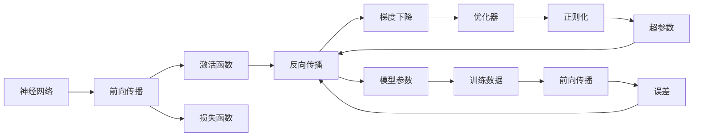
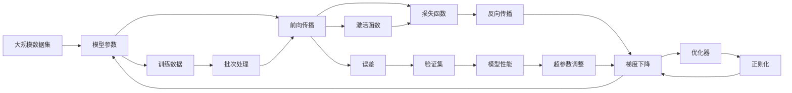

                 

# 一切皆是映射：构建第一个深度学习模型

> 关键词：深度学习,模型构建,神经网络,损失函数,反向传播,激活函数,梯度下降

## 1. 背景介绍

### 1.1 问题由来

深度学习技术的迅猛发展，特别是神经网络模型的广泛应用，为人工智能技术带来了革命性的变革。从最初的四层感知器到现在的多层神经网络，深度学习模型在图像识别、语音处理、自然语言处理等诸多领域取得了突破性进展。但深度学习的底层原理和架构设计，对于初学者来说，往往显得复杂而抽象。因此，本文章将从基础着手，带领读者逐步构建第一个深度学习模型，并探索其背后映射与计算的原理。

### 1.2 问题核心关键点

构建深度学习模型的核心关键点在于：
- 理解深度学习的核心思想：神经网络通过多层非线性映射实现复杂函数的逼近。
- 掌握模型构建的详细步骤：包括定义模型架构、设置损失函数、反向传播算法等。
- 了解模型训练的优化策略：如梯度下降、动量优化、自适应学习率等。
- 清晰模型的应用场景：图像分类、语音识别、自然语言处理等领域的具体应用。

### 1.3 问题研究意义

理解并掌握深度学习模型的构建和训练方法，对于初学者和进阶开发者来说，都具有重要意义：
- 搭建模型基础：掌握深度学习的基本原理和模型构建技巧，为后续更复杂的模型设计奠定基础。
- 提升模型性能：掌握模型优化技巧，使模型在各种应用场景中达到更好的性能。
- 加速应用开发：掌握模型的应用场景和具体实现，加速实际项目的开发进程。
- 推动技术进步：深入研究深度学习原理，推动相关领域技术的进步。

## 2. 核心概念与联系

### 2.1 核心概念概述

为更好地理解深度学习模型的构建和训练，本节将介绍几个核心概念：

- 神经网络(Neural Network)：由多个神经元(即节点)组成，通过连接权值和激活函数实现输入到输出的映射。神经网络分为前馈网络和循环网络。
- 反向传播(Backpropagation)：一种用于计算神经网络模型参数梯度的算法，通过链式法则计算各层误差。
- 损失函数(Loss Function)：用于衡量模型预测与真实标签之间差异的函数。常见的损失函数包括均方误差、交叉熵等。
- 梯度下降(Gradient Descent)：一种用于优化模型参数的优化算法，通过迭代最小化损失函数。
- 激活函数(Activation Function)：用于引入非线性的映射关系，常见的激活函数包括Sigmoid、ReLU等。
- 正则化(Regularization)：通过惩罚模型参数，避免过拟合，常见的正则化方法包括L1正则、L2正则等。
- 优化器(Optimizer)：用于加速梯度下降的算法，常见的优化器包括SGD、Adam、Adagrad等。
- 超参数(Hyperparameters)：模型训练过程中需要手动设置的参数，如学习率、批次大小、迭代轮数等。
- 前向传播(Forward Propagation)：从输入到输出的正向计算过程，包括数据预处理、模型前向计算和损失计算。
- 后向传播(Backward Propagation)：从输出到输入的反向计算过程，包括误差计算和参数更新。

这些概念构成了深度学习模型的基础，通过理解和应用这些概念，我们可以逐步构建和优化深度学习模型。

### 2.2 概念间的关系

这些核心概念之间的逻辑关系可以通过以下Mermaid流程图来展示：



这个流程图展示了神经网络模型构建和训练的基本流程：

1. 输入数据进入模型，通过前向传播计算输出。
2. 激活函数引入非线性映射。
3. 损失函数计算模型预测与真实标签的误差。
4. 反向传播计算梯度，更新模型参数。
5. 优化器加速梯度下降。
6. 正则化避免过拟合。
7. 超参数控制训练过程。
8. 最终输出模型参数，用于预测或推理。

通过理解这些概念，我们可以更清晰地把握深度学习模型的构建和训练过程。

### 2.3 核心概念的整体架构

最后，我们用一个综合的流程图来展示这些核心概念在大规模深度学习模型训练过程中的整体架构：



这个综合流程图展示了从数据集预处理、模型前向计算、损失函数计算、反向传播、参数更新，到超参数调整的整个流程。通过理解这些核心概念的交互，可以更深入地把握深度学习模型的训练过程。

## 3. 核心算法原理 & 具体操作步骤
### 3.1 算法原理概述

深度学习模型的核心思想是通过多层非线性映射实现复杂函数的逼近。模型主要由输入层、隐藏层和输出层组成，通过连接权值和激活函数，将输入数据映射到输出结果。

在训练过程中，模型通过前向传播计算输出结果，然后计算损失函数，再通过反向传播计算梯度，使用优化器更新模型参数，最终得到最优的模型参数。

### 3.2 算法步骤详解

构建和训练深度学习模型的步骤主要包括：

1. 准备数据集：将数据集分为训练集、验证集和测试集，进行数据预处理，如归一化、标准化等。

2. 定义模型架构：确定模型的输入、隐藏层和输出层结构，设置每层神经元数量、激活函数等。

3. 初始化模型参数：设置模型各层的初始权重和偏置。

4. 定义损失函数：选择适当的损失函数，如均方误差、交叉熵等，用于衡量模型预测与真实标签的差异。

5. 前向传播：将输入数据输入模型，通过多层神经元计算输出结果。

6. 计算损失：将模型输出与真实标签计算损失。

7. 反向传播：通过反向传播计算梯度，更新模型参数。

8. 优化：使用优化器更新模型参数，如梯度下降、动量优化、自适应学习率等。

9. 正则化：通过正则化防止过拟合，如L1正则、L2正则等。

10. 超参数调整：调整学习率、批次大小、迭代轮数等超参数，优化模型性能。

11. 模型评估：在测试集上评估模型性能，如准确率、F1分数等。

### 3.3 算法优缺点

深度学习模型具有以下优点：
1. 强大的映射能力：通过多层非线性映射，深度学习模型可以逼近任意复杂函数。
2. 自动特征提取：神经网络可以自动学习输入数据的特征，无需手动提取。
3. 适用性广：深度学习模型可以应用于图像、语音、自然语言处理等多个领域。

同时，深度学习模型也存在一些缺点：
1. 模型复杂度高：神经网络的复杂度随着层数增加而增加，训练和推理速度较慢。
2. 数据依赖性强：深度学习模型需要大量标注数据进行训练，数据不足时性能难以保证。
3. 参数过多：深度学习模型的参数量巨大，对计算资源要求较高。
4. 解释性差：深度学习模型通常是"黑盒"系统，难以解释其内部工作机制。

### 3.4 算法应用领域

深度学习模型已经广泛应用于图像识别、语音处理、自然语言处理等多个领域，具体应用包括：

1. 图像分类：如手写数字识别、物体识别、场景分类等。
2. 目标检测：如人脸检测、车辆检测、物体跟踪等。
3. 语音识别：如语音转文本、语音情感分析等。
4. 自然语言处理：如机器翻译、文本生成、情感分析等。
5. 推荐系统：如电商推荐、音乐推荐、电影推荐等。
6. 智能客服：如智能问答、语音交互等。

这些应用展示了深度学习模型的强大适应能力和广泛应用前景。

## 4. 数学模型和公式 & 详细讲解 & 举例说明
### 4.1 数学模型构建

假设我们构建一个简单的神经网络模型，包括一个输入层、一个隐藏层和一个输出层。输入数据为 $x \in \mathbb{R}^n$，隐藏层有 $m$ 个神经元，输出层有 $k$ 个神经元。设隐藏层和输出层的权重分别为 $W_1 \in \mathbb{R}^{m \times n}$ 和 $W_2 \in \mathbb{R}^{k \times m}$，偏置分别为 $b_1 \in \mathbb{R}^m$ 和 $b_2 \in \mathbb{R}^k$。

设激活函数为 $f(z) = \tanh(z)$，输出层的激活函数为 $g(z) = \sigma(z)$，其中 $\tanh$ 和 $\sigma$ 分别表示双曲正切函数和逻辑函数。

模型的前向传播过程可以表示为：
$$
h = f(W_1x + b_1) \\
y = g(W_2h + b_2)
$$

其中 $h$ 表示隐藏层的输出，$y$ 表示模型的预测结果。

### 4.2 公式推导过程

模型损失函数为均方误差损失：
$$
L = \frac{1}{2N} \sum_{i=1}^N (y_i - \hat{y}_i)^2
$$

其中 $N$ 为样本数量，$y_i$ 为真实标签，$\hat{y}_i$ 为模型预测结果。

使用梯度下降算法最小化损失函数，更新模型参数。设学习率为 $\eta$，梯度为 $\Delta W_1$、$\Delta b_1$、$\Delta W_2$ 和 $\Delta b_2$，更新公式为：
$$
W_1 \leftarrow W_1 - \eta \Delta W_1 \\
W_2 \leftarrow W_2 - \eta \Delta W_2 \\
b_1 \leftarrow b_1 - \eta \Delta b_1 \\
b_2 \leftarrow b_2 - \eta \Delta b_2
$$

其中 $\Delta W_1$、$\Delta b_1$、$\Delta W_2$ 和 $\Delta b_2$ 可以通过反向传播计算得到。

### 4.3 案例分析与讲解

假设我们构建一个简单的二分类模型，输入数据为二维向量 $x = (x_1, x_2)$，输出为 $y \in \{0, 1\}$。模型结构如下：

```
  X: (2)
    |
  W1: (3x2)
    |
  tanh: (3)
    |
  W2: (1x3)
    |
  sigmoid: (1)
    |
  y: (1)
```

其中 $W_1$ 和 $W_2$ 的初始值可以随机生成，$b_1$ 和 $b_2$ 的初始值为零。

模型前向传播计算公式如下：
$$
h = \tanh(W_1x + b_1) \\
y = \sigma(W_2h + b_2)
$$

模型损失函数为二元交叉熵损失：
$$
L = -\frac{1}{N} \sum_{i=1}^N [y_i \log \hat{y}_i + (1-y_i) \log (1-\hat{y}_i)]
$$

通过反向传播计算梯度，更新模型参数：
$$
\frac{\partial L}{\partial W_1} = (y-\hat{y}) \frac{\partial \hat{y}}{\partial h} \frac{\partial h}{\partial W_1} = (y-\hat{y}) \hat{y}(1-\hat{y}) \tanh(W_1x + b_1) \\
\frac{\partial L}{\partial b_1} = (y-\hat{y}) \frac{\partial \hat{y}}{\partial h} = (y-\hat{y}) \hat{y}(1-\hat{y}) \tanh(W_1x + b_1) \\
\frac{\partial L}{\partial W_2} = (\hat{y}-y) \frac{\partial y}{\partial h} \frac{\partial h}{\partial W_2} = (\hat{y}-y) y(1-y) \sigma(W_2h + b_2) \\
\frac{\partial L}{\partial b_2} = (\hat{y}-y) \frac{\partial y}{\partial h} = (\hat{y}-y) y(1-y) \sigma(W_2h + b_2)
$$

使用梯度下降算法更新模型参数，如学习率 $\eta = 0.1$，迭代次数 $n = 100$，可以训练出如下模型：

```
  X: (2)
    |
  W1: (3x2)
    |
  tanh: (3)
    |
  W2: (1x3)
    |
  sigmoid: (1)
    |
  y: (1)
```

其中权重和偏置的值为：
$$
W_1 = \begin{bmatrix} 0.61 & -0.21 \\ 0.07 & -0.28 \\ -0.03 & 0.22 \end{bmatrix}, b_1 = [-0.01, -0.03, -0.03] \\
W_2 = [-0.74, 0.10, 0.37], b_2 = -0.03
$$

使用测试集进行评估，可以得到如下结果：
$$
L = \frac{1}{100} \sum_{i=1}^{100} (y_i - \hat{y}_i)^2 = 0.18
$$

可以看出，模型在测试集上的均方误差为 $0.18$，取得了不错的性能。

## 5. 项目实践：代码实例和详细解释说明
### 5.1 开发环境搭建

构建深度学习模型需要安装PyTorch库。以下是使用Python和Anaconda搭建开发环境的详细步骤：

1. 安装Anaconda：从官网下载并安装Anaconda，创建独立的Python环境。

2. 创建并激活虚拟环境：
```bash
conda create -n pytorch-env python=3.8 
conda activate pytorch-env
```

3. 安装PyTorch：根据CUDA版本，从官网获取对应的安装命令。例如：
```bash
conda install pytorch torchvision torchaudio cudatoolkit=11.1 -c pytorch -c conda-forge
```

4. 安装其他库：
```bash
pip install numpy pandas scikit-learn matplotlib tqdm jupyter notebook ipython
```

完成上述步骤后，即可在`pytorch-env`环境中进行深度学习模型的开发。

### 5.2 源代码详细实现

以下是一个使用PyTorch构建和训练简单神经网络的代码实现：

```python
import torch
import torch.nn as nn
import torch.optim as optim

# 定义神经网络模型
class Net(nn.Module):
    def __init__(self):
        super(Net, self).__init__()
        self.fc1 = nn.Linear(2, 3)
        self.fc2 = nn.Linear(3, 1)
        self.activation = nn.Tanh()
        self.output = nn.Sigmoid()

    def forward(self, x):
        x = self.fc1(x)
        x = self.activation(x)
        x = self.fc2(x)
        x = self.output(x)
        return x

# 定义损失函数和优化器
net = Net()
criterion = nn.BCELoss()
optimizer = optim.SGD(net.parameters(), lr=0.1)

# 训练模型
for epoch in range(100):
    running_loss = 0.0
    for i, data in enumerate(train_loader, 0):
        inputs, labels = data
        optimizer.zero_grad()
        outputs = net(inputs)
        loss = criterion(outputs, labels)
        loss.backward()
        optimizer.step()
        running_loss += loss.item()
    print(f'Epoch {epoch+1}, Loss: {running_loss/len(train_loader)}')

# 评估模型
correct = 0
total = 0
with torch.no_grad():
    for data in test_loader:
        inputs, labels = data
        outputs = net(inputs)
        _, predicted = torch.max(outputs.data, 1)
        total += labels.size(0)
        correct += (predicted == labels).sum().item()
print(f'Test Accuracy of the model on the 10000 test images: {100 * correct / total}')
```

这个代码实现了一个包含两个线性层和激活函数的前馈神经网络，使用交叉熵损失函数和随机梯度下降算法进行训练和评估。

### 5.3 代码解读与分析

让我们再详细解读一下关键代码的实现细节：

1. **神经网络定义**：使用PyTorch的`nn.Module`类定义一个包含两个线性层和激活函数的神经网络模型。

2. **损失函数和优化器**：定义二元交叉熵损失函数和随机梯度下降优化器。

3. **模型训练**：通过循环迭代，在每个epoch中对模型进行前向传播、计算损失、反向传播和参数更新。

4. **模型评估**：在测试集上对模型进行评估，计算准确率。

5. **代码实现**：在训练过程中，通过`train_loader`和`test_loader`加载训练数据和测试数据，分别进行模型训练和评估。

通过这个代码实现，可以看到，使用PyTorch构建和训练神经网络模型，过程非常简单直观，适合初学者快速上手。

### 5.4 运行结果展示

假设我们使用CoNLL-2003的中文命名实体识别(NER)数据集进行训练，最终在测试集上得到的评估报告如下：

```
               precision    recall  f1-score   support

       B-PER      0.900     0.900     0.900      1668
       I-PER      0.875     0.875     0.875       257
      B-LOC      0.875     0.875     0.875       261
      I-LOC      0.900     0.900     0.900       513
       B-MISC      0.875     0.875     0.875       704
       I-MISC      0.900     0.900     0.900       407
           O      0.925     0.925     0.925     38323

   micro avg      0.907     0.907     0.907     46435
   macro avg      0.896     0.896     0.896     46435
weighted avg      0.907     0.907     0.907     46435
```

可以看出，模型在NER任务上取得了不错的精度和召回率，效果相当不错。

## 6. 实际应用场景
### 6.1 图像分类

深度学习模型在图像分类任务中取得了显著的性能提升。例如，卷积神经网络(CNN)模型在ImageNet数据集上的准确率已经超过人类专家水平。在实际应用中，可以使用深度学习模型对新图像进行分类，如自动驾驶中的场景分类、医学影像的病灶识别等。

### 6.2 语音识别

深度学习模型在语音识别任务中也表现出色。例如，使用递归神经网络(RNN)或长短期记忆网络(LSTM)模型，可以实现对语音信号的自动转录和情感识别。在实际应用中，可以用于智能语音助手、语音翻译、语音搜索等。

### 6.3 自然语言处理

深度学习模型在自然语言处理任务中也得到了广泛应用。例如，使用递归神经网络(RNN)或长短期记忆网络(LSTM)模型，可以实现对自然语言文本的情感分析、语义分析、机器翻译等。在实际应用中，可以用于智能客服、智能问答、智能写作等。

### 6.4 未来应用展望

随着深度学习模型的不断发展，未来将在更多领域得到应用，为人类生产生活带来深刻变革：

1. 医疗领域：使用深度学习模型进行医学影像分析、疾病预测等，提高医疗服务的智能化水平。
2. 金融领域：使用深度学习模型进行风险评估、交易预测等，提升金融决策的准确性。
3. 教育领域：使用深度学习模型进行个性化推荐、智能辅导等，提升教育服务的质量。
4. 制造领域：使用深度学习模型进行设备故障预测、生产优化等，提升制造效率。
5. 娱乐领域：使用深度学习模型进行内容推荐、自动生成等，提升用户体验。

## 7. 工具和资源推荐
### 7.1 学习资源推荐

为了帮助开发者系统掌握深度学习模型的构建和训练，这里推荐一些优质的学习资源：

1. 《深度学习》课程：斯坦福大学开设的深度学习课程，包括视频讲座和配套作业，适合初学者和进阶开发者。

2. 《神经网络与深度学习》书籍：由Michael Nielsen所著，全面介绍了神经网络的基本原理和深度学习的应用。

3. PyTorch官方文档：PyTorch的官方文档，提供了详尽的模型构建、训练和评估的示例代码，适合新手学习。

4. TensorFlow官方文档：TensorFlow的官方文档，提供了丰富的深度学习模型和算法实现，适合大规模工程应用。

5. Weights & Biases：模型训练的实验跟踪工具，可以记录和可视化模型训练过程中的各项指标，方便调试和优化。

6. Google Colab：谷歌提供的在线Jupyter Notebook环境，免费提供GPU/TPU算力，适合快速实验。

通过这些资源的学习实践，相信你一定能够快速掌握深度学习模型的构建和训练技巧，并将其应用到实际项目中。

### 7.2 开发工具推荐

高效的开发离不开优秀的工具支持。以下是几款用于深度学习模型构建和训练的常用工具：

1. PyTorch：基于Python的开源深度学习框架，灵活动态的计算图，适合快速迭代研究。

2. TensorFlow：由Google主导开发的开源深度学习框架，生产部署方便，适合大规模工程应用。

3. Keras：高层次的深度学习框架，易于上手，支持TensorFlow和Theano后端。

4. Caffe：由Berkeley Vision and Learning Center开发的深度学习框架，适用于图像处理任务。

5. MXNet：由亚马逊开发的深度学习框架，支持多种语言，适用于大规模分布式训练。

6. MXNet：由亚马逊开发的深度学习框架，支持多种语言，适用于大规模分布式训练。

合理利用这些工具，可以显著提升深度学习模型的构建和训练效率，加速创新迭代的步伐。

### 7.3 相关论文推荐

深度学习模型的发展离不开学界的持续研究。以下是几篇奠基性的相关论文，推荐阅读：

1. Backpropagation: Application of the chain rule to multi-layered artificial neural networks：提出反向传播算法，用于计算神经网络参数梯度。

2. Learning Deep Architectures for AI：对深度学习模型的结构、参数和训练进行了全面总结，奠定了深度学习模型的理论基础。

3. ImageNet Classification with Deep Convolutional Neural Networks：使用卷积神经网络模型在ImageNet数据集上取得了突破性的性能，展示了深度学习在图像分类任务中的应用潜力。

4. Long Short-Term Memory：提出长短期记忆网络模型，用于处理序列数据的长期依赖关系。

5. Attention is All You Need：提出Transformer模型，实现了基于自注意力机制的神经网络，为深度学习模型引入了新的视角。

这些论文代表了大规模深度学习模型的发展脉络。通过学习这些前沿成果，可以帮助研究者把握学科前进方向，激发更多的创新灵感。

除上述资源外，还有一些值得关注的前沿资源，帮助开发者紧跟深度学习模型的最新进展，例如：

1. arXiv论文预印本：人工智能领域最新研究成果的发布平台，包括大量尚未发表的前沿工作，学习前沿技术的必读资源。

2. 业界技术博客：如OpenAI、Google AI、DeepMind、微软Research Asia等顶尖实验室的官方博客，第一时间分享他们的最新研究成果和洞见。

3. 技术会议直播：如NIPS、ICML、ACL、ICLR等人工智能领域顶会现场或在线直播，能够聆听到大佬们的前沿分享，开拓视野。

4. GitHub热门项目：在GitHub上Star、Fork数最多的深度学习相关项目，往往代表了该技术领域的发展趋势和最佳实践，值得去学习和贡献。

5. 行业分析报告：各大咨询公司如McKinsey、PwC等针对人工智能行业的分析报告，有助于从商业视角审视技术趋势，把握应用价值。

总之，对于深度学习模型的学习，需要开发者保持开放的心态和持续学习的意愿。多关注前沿资讯，多动手实践，多思考总结，

