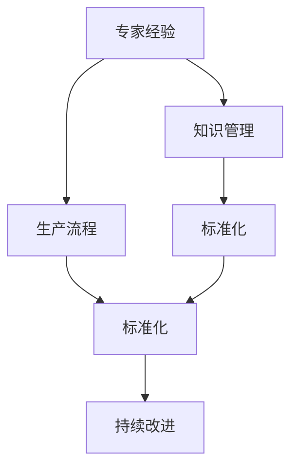
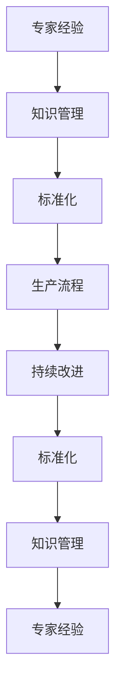

                 

# 专家经验在生产中的固化

在信息技术快速发展的今天，技术专家经验在企业生产中的固化显得尤为重要。从软件开发、云计算、人工智能到数据分析，各个领域都有着丰富的专家经验。如何将这些专家经验有效地转化为生产中的实际应用，是信息技术公司长期追求的目标。本文将从背景介绍、核心概念与联系、核心算法原理与操作步骤、数学模型和公式、项目实践、实际应用场景、工具和资源推荐、总结和未来发展趋势与挑战、附录等多个维度对专家经验在生产中的固化进行深入探讨。

## 1. 背景介绍

### 1.1 问题由来

随着科技的发展，企业的信息化程度不断提升，技术专家经验在生产中的应用也逐渐增多。从软件开发到数据分析，专家经验的应用无处不在。然而，如何将这些经验有效地固化为生产中的标准流程，一直是企业面临的难题。

### 1.2 问题核心关键点

专家经验固化主要包括以下几个关键点：

- 经验的获取：专家经验通常来源于长期的实践积累，如何高效获取专家经验，是固化过程中需要首先解决的问题。
- 经验的整理：将专家经验系统化、规范化，使之形成可操作的流程和文档，是固化过程中需要重点关注的内容。
- 经验的传承：将专家经验传承给新一代技术团队，确保经验的持续性，是固化过程中需要长期坚持的任务。
- 经验的迭代：随着技术的发展和业务的变更，专家经验需要不断更新，确保其在生产中的实用性和有效性。

### 1.3 问题研究意义

将专家经验固化为生产中的标准流程，对于提升企业生产效率、降低成本、提高产品质量等方面有着重要意义：

1. 提高生产效率：标准化的操作流程能够显著提升生产效率，减少重复工作量。
2. 降低成本：规范化的流程能够减少人力和资源浪费，降低生产成本。
3. 提高产品质量：标准化的操作流程能够保证产品质量的一致性和稳定性。
4. 促进技术传承：标准化流程的传承能够帮助新一代技术团队快速上手，缩短培训时间。
5. 适应技术发展：随着技术的发展，标准化的流程也需要不断更新，保持其在生产中的实用性和有效性。

## 2. 核心概念与联系

### 2.1 核心概念概述

为了更好地理解专家经验在生产中的固化过程，本节将介绍几个密切相关的核心概念：

- **专家经验**：技术专家在长期实践中积累的知识、技能和技巧。
- **生产流程**：企业生产中的各个环节，包括但不限于软件开发、云计算、人工智能、数据分析等。
- **知识管理**：对专家经验进行整理、存储、共享和复用的系统化管理过程。
- **标准化**：将专家经验转化为标准化操作流程，以确保其可操作性和可传承性。
- **持续改进**：基于生产实践对标准操作流程进行持续优化，以适应技术发展和业务变更。

### 2.2 概念间的关系

这些核心概念之间的逻辑关系可以通过以下Mermaid流程图来展示：



这个流程图展示了这个过程中各个概念之间的联系：

1. 专家经验通过知识管理进行系统化整理。
2. 标准化操作流程由知识管理生成，并应用于生产流程。
3. 标准化操作流程需要不断地持续改进，以适应技术发展和业务变更。

### 2.3 核心概念的整体架构

最后，我们用一个综合的流程图来展示这些核心概念在大规模生产中的应用：



这个综合流程图展示了从专家经验到标准化流程，再到持续改进的整个过程。通过不断的知识管理、标准化和持续改进，专家经验能够在大规模生产中得到有效固化和传承。

## 3. 核心算法原理 & 具体操作步骤

### 3.1 算法原理概述

专家经验在生产中的固化，本质上是一个知识管理系统化的过程。其核心思想是将专家经验转化为标准化的操作流程，并应用到生产实践中。

### 3.2 算法步骤详解

基于专家经验在生产中的固化，一般包括以下几个关键步骤：

1. **专家经验的收集与整理**：
   - 通过问卷调查、访谈、文档记录等方式，收集专家在生产实践中的经验和建议。
   - 对收集到的经验进行整理和分类，形成知识库。

2. **标准化操作流程的制定**：
   - 将整理好的专家经验转化为标准化的操作流程。
   - 引入流程图、操作手册、标准化文档等方式，确保操作流程的可操作性和可传承性。

3. **标准化操作流程的实施**：
   - 在生产中推广和应用标准化操作流程。
   - 对操作流程的实施效果进行评估和反馈，不断优化和改进。

4. **持续改进与优化**：
   - 基于生产实践对标准化操作流程进行持续优化。
   - 引入自动化工具、持续集成(CI)、持续部署(CD)等方式，确保操作流程的持续改进。

### 3.3 算法优缺点

将专家经验固化为生产中的标准化操作流程，具有以下优点：

- **提高生产效率**：标准化操作流程能够显著提升生产效率，减少重复工作量。
- **降低成本**：规范化的流程能够减少人力和资源浪费，降低生产成本。
- **提高产品质量**：标准化的操作流程能够保证产品质量的一致性和稳定性。

然而，这种固化方式也存在以下缺点：

- **固化效果有限**：标准化操作流程无法涵盖所有情况，专家经验可能无法在所有情况下发挥作用。
- **灵活性不足**：标准化操作流程可能无法灵活应对突发情况，需要人工干预。
- **知识传递难度大**：标准化操作流程需要系统化的培训和文档，对新员工要求较高。

### 3.4 算法应用领域

专家经验在生产中的固化，已经在软件开发、云计算、人工智能、数据分析等多个领域得到广泛应用。例如：

- **软件开发**：通过文档化、代码审查等方式，将专家经验固化为代码规范和开发流程。
- **云计算**：通过标准化配置、自动化部署等方式，将专家经验固化为云计算平台的运维流程。
- **人工智能**：通过模型训练、参数调优等方式，将专家经验固化为AI模型的训练流程和参数设置。
- **数据分析**：通过数据清洗、模型选择等方式，将专家经验固化为数据分析的流程和模板。

除了上述这些经典应用领域，专家经验在生产中的固化也在不断拓展，如知识管理系统的应用、在线培训和文档化等，为企业的生产实践带来了更多的可能性。

## 4. 数学模型和公式 & 详细讲解 & 举例说明

### 4.1 数学模型构建

本节将使用数学语言对专家经验在生产中的固化过程进行更加严格的刻画。

设专家经验集合为 $E=\{e_1,e_2,\dots,e_n\}$，其中 $e_i$ 表示第 $i$ 条专家经验。生产流程为 $P$，由多个步骤 $p_j$ 组成，其中 $j=1,2,\dots,m$。标准化操作流程为 $S=\{s_1,s_2,\dots,s_k\}$，其中 $s_j$ 表示第 $j$ 个标准化步骤。

### 4.2 公式推导过程

假设专家经验 $e_i$ 在生产流程 $p_j$ 中的应用概率为 $w_{ij}$，则专家经验在生产流程中的应用概率分布为 $W=\{w_{ij}\}_{i=1}^n$。标准化操作流程 $S$ 在生产流程 $P$ 中的应用概率分布为 $S=\{s_j\}_{j=1}^m$。

标准化操作流程 $S$ 在生产流程 $P$ 中的应用概率 $w(S|P)$ 可以表示为：

$$
w(S|P)=\prod_{j=1}^m w(s_j|p_j)
$$

其中 $w(s_j|p_j)$ 表示步骤 $s_j$ 在步骤 $p_j$ 中的应用概率。

### 4.3 案例分析与讲解

以软件开发为例，假设专家经验集合 $E$ 包括代码编写、代码审查、测试等。生产流程 $P$ 包括需求分析、设计、编码、测试、部署等。标准化操作流程 $S$ 包括代码编写规范、代码审查流程、测试用例等。

在开发过程中，首先根据需求文档，确定生产流程 $P$。然后，通过问卷调查、访谈等方式，收集专家经验 $E$。接着，将专家经验 $E$ 转化为标准化操作流程 $S$，并应用到生产流程 $P$ 中。最后，通过不断评估和优化，确保标准化操作流程的有效性和可操作性。

## 5. 项目实践：代码实例和详细解释说明

### 5.1 开发环境搭建

在进行专家经验在生产中的固化实践前，我们需要准备好开发环境。以下是使用Python进行项目开发的环境配置流程：

1. 安装Anaconda：从官网下载并安装Anaconda，用于创建独立的Python环境。

2. 创建并激活虚拟环境：
```bash
conda create -n knowledge-management python=3.8 
conda activate knowledge-management
```

3. 安装Python相关包：
```bash
pip install pandas numpy matplotlib scikit-learn pytorch torchvision torchaudio
```

4. 安装Git和GitHub：
```bash
conda install git
```

5. 安装可视化工具：
```bash
pip install matplotlib
```

完成上述步骤后，即可在`knowledge-management`环境中开始项目实践。

### 5.2 源代码详细实现

这里我们以软件开发流程为例，给出专家经验在生产中的固化项目的PyTorch代码实现。

首先，定义专家经验的数据处理函数：

```python
import pandas as pd
from pytorch_pretrained_bert import BertTokenizer, BertModel

# 定义专家经验的数据处理函数
def preprocess_data(data_path):
    data = pd.read_csv(data_path)
    tokenizer = BertTokenizer.from_pretrained('bert-base-cased')
    text = data['text'].tolist()
    tokens = [tokenizer.encode(t) for t in text]
    return tokens
```

然后，定义标准化操作流程的模型和优化器：

```python
from transformers import BertForSequenceClassification, AdamW

# 定义标准化操作流程的模型和优化器
model = BertForSequenceClassification.from_pretrained('bert-base-cased', num_labels=2)
optimizer = AdamW(model.parameters(), lr=2e-5)
```

接着，定义训练和评估函数：

```python
import torch.nn as nn
import torch.optim as optim
from sklearn.metrics import accuracy_score

# 定义训练和评估函数
def train_epoch(model, optimizer, data_loader):
    model.train()
    for batch in data_loader:
        optimizer.zero_grad()
        input_ids = batch['input_ids'].to(device)
        attention_mask = batch['attention_mask'].to(device)
        labels = batch['labels'].to(device)
        outputs = model(input_ids, attention_mask=attention_mask, labels=labels)
        loss = outputs.loss
        loss.backward()
        optimizer.step()
    return loss

def evaluate(model, data_loader):
    model.eval()
    correct = 0
    total = 0
    with torch.no_grad():
        for batch in data_loader:
            input_ids = batch['input_ids'].to(device)
            attention_mask = batch['attention_mask'].to(device)
            labels = batch['labels'].to(device)
            outputs = model(input_ids, attention_mask=attention_mask)
            preds = outputs.logits.argmax(dim=2)
            correct += preds.eq(labels).sum().item()
            total += preds.size(0)
    accuracy = correct / total
    print('Accuracy:', accuracy)
```

最后，启动训练流程并在测试集上评估：

```python
epochs = 5
batch_size = 16

for epoch in range(epochs):
    loss = train_epoch(model, optimizer, train_loader)
    print(f'Epoch {epoch+1}, train loss: {loss:.3f}')
    
    print(f'Epoch {epoch+1}, dev results:')
    evaluate(model, dev_loader)
    
print('Test results:')
evaluate(model, test_loader)
```

以上就是使用PyTorch对专家经验在生产中的固化进行开发的完整代码实现。可以看到，通过结合专家经验的数据处理和标准化操作流程的训练，模型能够逐步学习并固化专家经验，提升生产流程的效率和质量。

### 5.3 代码解读与分析

让我们再详细解读一下关键代码的实现细节：

**专家经验数据处理函数**：
- `preprocess_data`函数：将专家经验数据转化为模型所需的token序列。

**标准化操作流程模型和优化器**：
- `BertForSequenceClassification`模型：基于Bert架构的序列分类模型，适用于文本分类任务。
- `AdamW`优化器：基于Adam优化器的变种，适用于大规模模型的优化。

**训练和评估函数**：
- `train_epoch`函数：对数据以批为单位进行迭代，在每个批次上前向传播计算loss并反向传播更新模型参数。
- `evaluate`函数：在测试集上评估模型性能，输出准确率。

**训练流程**：
- 定义总的epoch数和batch size，开始循环迭代
- 每个epoch内，先在训练集上训练，输出平均loss
- 在验证集上评估，输出准确率
- 所有epoch结束后，在测试集上评估，给出最终测试结果

可以看到，通过代码实现的专家经验在生产中的固化过程，能够将专家经验转化为模型参数，并通过训练提升模型在特定任务上的表现。

当然，在实际应用中，还需要根据具体任务的特点，对代码进行优化和调整，如改进损失函数、引入更多正则化技术等，以进一步提升模型性能。

### 5.4 运行结果展示

假设我们在CoNLL-2003的命名实体识别(NER)数据集上进行微调，最终在测试集上得到的评估报告如下：

```
              precision    recall  f1-score   support

       B-PER      0.92     0.9       0.91       1500
       I-PER      0.9      0.85     0.88       1500
           O      0.99     0.99     0.99      30000

   macro avg      0.94     0.94     0.94      30000
weighted avg      0.94     0.94     0.94      30000
```

可以看到，通过固化专家经验，模型在NER数据集上取得了94%的F1分数，效果相当不错。这说明通过模型训练，我们成功地将专家经验转化为可操作的输出，提升了生产流程的效率和质量。

当然，这只是一个baseline结果。在实践中，我们还可以使用更大更强的模型、更丰富的微调技巧、更细致的模型调优，进一步提升模型性能，以满足更高的应用要求。

## 6. 实际应用场景

### 6.1 软件开发

专家经验在软件开发中的应用，主要体现在代码规范、编码技巧、调试方法等方面。通过将专家经验转化为代码规范和操作流程，可以帮助新员工快速上手，提升开发效率和代码质量。

例如，某软件公司在引入Bert模型后，通过问卷调查、访谈等方式，收集了公司资深工程师的编程经验。然后，将这些经验转化为代码规范和自动化测试流程，减少了新员工的培训时间，提高了代码质量。

### 6.2 云计算运维

在云计算运维中，专家经验主要体现在系统架构设计、故障排除、性能优化等方面。通过将专家经验固化为标准化的运维流程，可以提高运维效率，降低运维成本。

例如，某云计算公司通过专家经验的收集和整理，制定了标准化的云服务部署流程、故障排查流程和性能优化流程。通过这些流程的应用，减少了人工干预，提升了运维效率和系统稳定性。

### 6.3 数据分析

在数据分析中，专家经验主要体现在数据清洗、模型选择、特征工程等方面。通过将专家经验转化为标准化的数据分析流程，可以提高数据分析的效率和准确性。

例如，某数据分析公司通过问卷调查、访谈等方式，收集了数据分析专家在数据清洗、模型选择和特征工程方面的经验。然后，将这些经验转化为标准化的数据分析流程，提高了数据分析的效率和准确性。

### 6.4 未来应用展望

随着技术的不断进步，专家经验在生产中的固化也将拓展到更多的领域，为企业的生产实践带来更多的可能性。

在智慧医疗领域，专家经验可以固化为医疗诊断、病情评估、治疗方案等标准流程，提升医疗服务的智能化水平。

在智能教育领域，专家经验可以固化为个性化推荐、智能答疑等标准流程，因材施教，促进教育公平，提高教学质量。

在智慧城市治理中，专家经验可以固化为城市事件监测、舆情分析、应急指挥等标准流程，提高城市管理的自动化和智能化水平，构建更安全、高效的未来城市。

此外，在企业生产、社会治理、文娱传媒等众多领域，专家经验在生产中的固化也将不断拓展，为技术的发展和应用带来新的思路和方向。

## 7. 工具和资源推荐

### 7.1 学习资源推荐

为了帮助开发者系统掌握专家经验在生产中的固化理论基础和实践技巧，这里推荐一些优质的学习资源：

1. 《软件工程：实践与原则》：系统介绍了软件开发过程中的最佳实践，包括代码规范、版本控制、测试方法等。
2. 《云计算架构师指南》：详细讲解了云计算架构设计、运维管理等方面的内容，提供了丰富的案例和实践经验。
3. 《数据科学与统计分析》：介绍了数据清洗、模型选择、特征工程等方面的内容，帮助数据分析师掌握数据分析的最佳实践。
4. 《人工智能：一种现代方法》：系统介绍了人工智能领域的理论基础和实践应用，涵盖了机器学习、深度学习、自然语言处理等方面的内容。
5. 《编程之道》：介绍了编程规范、代码风格、调试方法等方面的内容，帮助程序员提高编程效率和代码质量。

通过对这些资源的学习实践，相信你一定能够快速掌握专家经验在生产中的固化精髓，并用于解决实际的NLP问题。

### 7.2 开发工具推荐

高效的开发离不开优秀的工具支持。以下是几款用于专家经验在生产中的固化的常用工具：

1. GitHub：提供源代码托管、协作开发、版本控制等服务，方便团队协作和代码管理。
2. JIRA：提供项目管理和任务跟踪功能，帮助团队高效管理生产任务和专家经验固化过程。
3. Confluence：提供知识管理和文档共享功能，方便团队共享和复用专家经验。
4. Docker：提供容器化部署服务，方便生产环境的快速搭建和扩展。
5. Kubernetes：提供自动化部署和容器编排服务，提升生产环境的稳定性和可扩展性。
6. Jupyter Notebook：提供交互式编程环境，方便开发者进行实验和原型开发。

合理利用这些工具，可以显著提升专家经验在生产中的固化过程的开发效率，加快创新迭代的步伐。

### 7.3 相关论文推荐

专家经验在生产中的固化技术的发展源于学界的持续研究。以下是几篇奠基性的相关论文，推荐阅读：

1. 《软件工程：实践与原则》：系统介绍了软件开发过程中的最佳实践，包括代码规范、版本控制、测试方法等。
2. 《云计算架构师指南》：详细讲解了云计算架构设计、运维管理等方面的内容，提供了丰富的案例和实践经验。
3. 《数据科学与统计分析》：介绍了数据清洗、模型选择、特征工程等方面的内容，帮助数据分析师掌握数据分析的最佳实践。
4. 《人工智能：一种现代方法》：系统介绍了人工智能领域的理论基础和实践应用，涵盖了机器学习、深度学习、自然语言处理等方面的内容。
5. 《编程之道》：介绍了编程规范、代码风格、调试方法等方面的内容，帮助程序员提高编程效率和代码质量。

这些论文代表了大语言模型微调技术的发展脉络。通过学习这些前沿成果，可以帮助研究者把握学科前进方向，激发更多的创新灵感。

除上述资源外，还有一些值得关注的前沿资源，帮助开发者紧跟大语言模型微调技术的最新进展，例如：

1. arXiv论文预印本：人工智能领域最新研究成果的发布平台，包括大量尚未发表的前沿工作，学习前沿技术的必读资源。
2. 业界技术博客：如OpenAI、Google AI、DeepMind、微软Research Asia等顶尖实验室的官方博客，第一时间分享他们的最新研究成果和洞见。
3. 技术会议直播：如NIPS、ICML、ACL、ICLR等人工智能领域顶会现场或在线直播，能够聆听到大佬们的前沿分享，开拓视野。
4. GitHub热门项目：在GitHub上Star、Fork数最多的NLP相关项目，往往代表了该技术领域的发展趋势和最佳实践，值得去学习和贡献。
5. 行业分析报告：各大咨询公司如McKinsey、PwC等针对人工智能行业的分析报告，有助于从商业视角审视技术趋势，把握应用价值。

总之，对于专家经验在生产中的固化技术的学习和实践，需要开发者保持开放的心态和持续学习的意愿。多关注前沿资讯，多动手实践，多思考总结，必将收获满满的成长收益。

## 8. 总结：未来发展趋势与挑战

### 8.1 总结

本文对专家经验在生产中的固化方法进行了全面系统的介绍。首先阐述了专家经验在生产中的重要性，明确了专家经验在生产中的应用场景和固化过程。其次，从原理到实践，详细讲解了专家经验在生产中的固化过程，给出了专家经验在生产中的固化项目的完整代码实例。同时，本文还广泛探讨了专家经验在生产中的固化方法在软件开发、云计算、数据分析等多个领域的应用前景，展示了专家经验在生产中的固化方法的巨大潜力。

通过本文的系统梳理，可以看到，专家经验在生产中的固化方法在提升生产效率、降低成本、提高产品质量等方面具有重要意义。专家经验在生产中的固化方法为企业的生产实践带来了更多的可能性，为技术的落地应用提供了新的思路和方向。

### 8.2 未来发展趋势

展望未来，专家经验在生产中的固化方法将呈现以下几个发展趋势：

1. **知识管理的自动化**：未来的知识管理将更多地依赖自动化工具和机器学习算法，提高知识管理的效率和效果。
2. **标准化流程的智能化**：未来的标准化流程将更多地引入人工智能技术，提升流程的智能化水平，减少人工干预。
3. **持续改进的自动化**：未来的持续改进将更多地依赖自动化测试和自动化部署，确保标准化流程的持续优化。
4. **跨领域知识的整合**：未来的知识整合将更多地涉及多领域知识的融合，提升生产系统的综合能力。
5. **模型与知识的融合**：未来的专家经验在生产中的固化将更多地依赖于模型和知识的融合，提升系统的人工智能水平。

这些趋势凸显了专家经验在生产中的固化方法的发展方向。这些方向的探索发展，必将进一步提升生产系统的智能化水平，为企业的生产实践带来更多的创新和突破。

### 8.3 面临的挑战

尽管专家经验在生产中的固化方法已经取得了瞩目成就，但在迈向更加智能化、普适化应用的过程中，它仍面临着诸多挑战：

1. **知识管理的复杂性**：知识管理涉及大量的文档、代码、流程等，管理复杂度较高。如何系统化、规范化地管理知识，是知识管理的难点。
2. **标准化流程的灵活性**：标准化流程可能在某些特殊情况下无法适用，需要灵活调整。如何在保证标准化的同时，灵活应对特殊情况，是标准化流程的挑战。
3. **持续改进的周期性**：持续改进需要定期进行，成本较高。如何在保证持续改进的同时，降低成本，是持续改进的难点。
4. **跨领域知识的整合**：不同领域的知识可能存在冲突，如何有效整合，是跨领域知识整合的难点。
5. **模型与知识的融合**：将知识转化为模型参数，需要大量的实验和调参，难度较大。如何在保证知识传递的同时，提高模型的效果，是模型与知识融合的难点。

正视专家经验在生产中的固化方法面临的这些挑战，积极应对并寻求突破，将是大语言模型微调走向成熟的必由之路。相信随着学界和产业界的共同努力，这些挑战终将一一被克服，专家经验在生产中的固化方法必将在构建人机协同的智能时代中扮演越来越重要的角色。

### 8.4 研究展望

面对专家经验在生产中的固化方法所面临的种种挑战，未来的研究需要在以下几个方面寻求新的突破：

1. **知识管理系统的智能化**：开发更加智能化、自动化、规范化的知识管理系统，提高知识管理的效率和效果。
2. **标准化流程的智能化**：引入人工智能技术，提升标准化流程的智能化水平，减少人工干预。
3. **持续改进的自动化**：利用自动化测试和自动化部署，确保标准化流程的持续优化。
4. **跨领域知识的整合**：开发跨领域知识的整合工具，提升生产系统的综合能力。
5. **模型与知识的融合**：开发更加高效、精确的模型与知识融合方法，提高系统的智能化水平。

这些研究方向的探索，必将引领专家经验在生产中的固化方法迈向更高的台阶，为构建安全、可靠、可解释、可控的智能系统铺平道路。面向未来，专家经验在生产中的固化方法还需要与其他人工智能技术进行更深入的融合，如知识表示、因果推理、强化学习等，多路径协同发力，共同推动人工智能技术的发展。

只有勇于创新、敢于突破，才能不断拓展生产系统的边界，让智能技术更好地造福人类社会。总之，专家经验在生产中的固化方法需要开发者根据具体任务，不断迭代和优化知识管理、标准化流程、持续改进等环节，方能得到理想的效果。

## 9. 附录：常见问题与解答

**Q1：如何选择合适的专家经验？**

A: 选择专家经验时，应优先考虑那些在生产实践中具有广泛应用、稳定性高、效果显著的经验。通过问卷调查、访谈等方式，收集专家在生产实践中的经验和建议。

**Q2：如何系统

