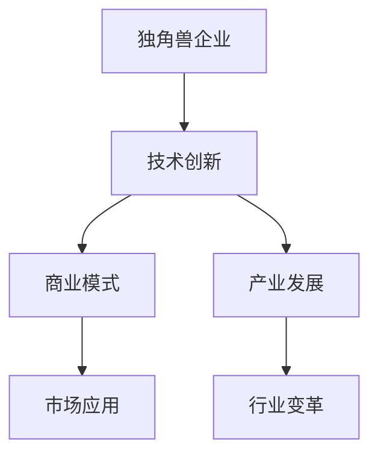

                 

# 人工智能产业的独角兽企业

> 关键词：人工智能, 独角兽企业, 技术创新, 产业发展, 应用案例

## 1. 背景介绍

### 1.1 问题由来
近年来，人工智能（AI）技术的迅猛发展极大地推动了全球经济的数字化转型，尤其是在信息科技、智能制造、金融、医疗、教育等行业。科技巨头如Google、Apple、Facebook等公司，以及新锐创业公司如OpenAI、DeepMind、Nuro等，均在AI领域取得了突破性进展。这些公司不仅拥有强大的技术实力，还在商业模式、生态建设、产业影响等方面取得了显著成绩，成为了AI领域的“独角兽企业”。

### 1.2 问题核心关键点
独角兽企业在AI领域具有以下几个显著特征：
- **技术创新领先**：持续在AI核心算法、模型、架构等领域进行深入研发，推出具有重大影响力的创新成果。
- **商业变现能力强**：拥有独特的商业模式，产品或服务在市场上获得广泛认可，公司估值超10亿美元。
- **产业影响力巨大**：通过技术输出、合作、投资等方式，广泛布局AI产业链，引领行业发展。
- **生态建设完备**：打造了完善的AI开发工具、开源社区、合作伙伴等生态体系，促进AI技术的落地应用。

### 1.3 问题研究意义
独角兽企业不仅在技术创新和市场应用上取得了突破，还对AI产业的发展起到了关键的推动作用。研究独角兽企业，可以揭示AI产业的创新趋势和应用潜力，为产业从业者提供宝贵的实践经验和未来发展方向。

## 2. 核心概念与联系

### 2.1 核心概念概述

为更好地理解独角兽企业在AI领域的成就，本文将介绍几个关键概念：

- **独角兽企业**：指估值超过10亿美元且未公开上市的创业公司。在AI领域，独角兽企业通常具有独特的商业模式和技术优势。
- **人工智能**：通过模拟人类智能行为，利用算法和计算模型处理复杂问题的技术。主要包括机器学习、深度学习、自然语言处理、计算机视觉等分支。
- **技术创新**：在AI核心技术领域的突破性进展，如新算法、新架构、新应用等。
- **商业模式**：独角兽企业如何通过产品或服务实现商业化运营和盈利。
- **产业发展**：AI技术的普及和应用对各行各业带来的变革和影响。

这些核心概念之间的关系通过以下Mermaid流程图来展示：



该流程图展示了独角兽企业在AI领域的多方面成就及其相互关联：

1. 技术创新是独角兽企业取得突破的基石。
2. 商业模式决定企业如何实现盈利和市场拓展。
3. 产业发展反映出AI技术的广泛应用及其带来的行业变革。

### 2.2 概念间的关系

这些核心概念之间存在着紧密的联系，共同构成了独角兽企业在AI领域取得成功的框架：

- **技术创新与商业模式**：技术创新为商业模式提供了实现的基础，而商业模式又为技术创新提供了市场应用和资金支持。
- **技术创新与产业发展**：技术创新推动了产业的进步，带来更多应用场景和市场需求。
- **商业模式与产业发展**：商业模式的应用，使得AI技术在更多领域落地，促进了整个产业的发展。

## 3. 核心算法原理 & 具体操作步骤
### 3.1 算法原理概述

独角兽企业在AI领域的技术创新，通常围绕以下几个核心算法展开：

- **深度学习算法**：如卷积神经网络(CNN)、递归神经网络(RNN)、长短时记忆网络(LSTM)、变换器(Transformer)等。这些算法通过多层神经网络进行特征提取和模式识别，大幅提升了AI在图像、语音、自然语言处理等领域的能力。
- **强化学习算法**：如策略梯度、深度Q网络、蒙特卡罗树搜索等。这些算法通过奖励机制训练智能体在复杂环境中进行决策，广泛应用于游戏、自动驾驶、机器人控制等领域。
- **自然语言处理算法**：如BERT、GPT、T5等。这些算法通过大规模预训练语言模型，学习语言表征，实现文本分类、问答、机器翻译、情感分析等自然语言任务。
- **计算机视觉算法**：如YOLO、ResNet、Capsule Network等。这些算法通过卷积和池化操作提取图像特征，实现目标检测、图像分类、人脸识别等视觉任务。

这些算法相互配合，形成了独角兽企业在AI领域的核心技术能力。

### 3.2 算法步骤详解

独角兽企业通常按照以下步骤进行技术研发和商业化：

1. **算法选型与优化**：根据任务需求选择合适的算法，并对其进行针对性的优化，如调整网络结构、改进损失函数、添加正则化等。
2. **模型训练与验证**：利用大数据集进行模型训练，并使用验证集进行模型调优，确保模型具备良好的泛化能力。
3. **部署与应用**：将训练好的模型部署到服务器或嵌入式设备上，并通过API、SDK等方式提供服务，实现产品化。
4. **持续迭代与优化**：根据实际应用反馈，不断迭代模型，优化算法，提升性能和可靠性。

### 3.3 算法优缺点

独角兽企业在AI技术研发上具备以下优点：
- **技术储备丰富**：拥有强大的研发团队和丰富的技术积累，能够快速推出创新的技术方案。
- **投资资源充足**：能够投入大量资金进行技术研发和市场拓展，推动技术进步。
- **市场响应灵活**：通过灵活调整商业模式，快速响应市场需求，实现产品迭代和市场拓展。

但同时也存在一些局限性：
- **研发成本高昂**：大模型和复杂算法的训练需要大量计算资源，研发成本较高。
- **商业化难度大**：复杂算法需要专业人才进行维护和优化，对商业化运营提出了较高要求。
- **技术壁垒高**：一些关键技术如深度学习、强化学习等，具有较高的技术门槛，需要长时间的积累和磨练。

### 3.4 算法应用领域

独角兽企业在AI技术上广泛应用，涵盖了以下几个领域：

- **智能推荐系统**：如Amazon的推荐算法、YouTube的内容推荐、Netflix的电影推荐等。这些系统通过分析用户行为和偏好，精准推荐相关产品或内容，提高用户满意度和转化率。
- **自然语言处理**：如OpenAI的GPT-3、Google的BERT等，这些技术在文本分类、情感分析、机器翻译、问答系统等方面取得显著进展，推动了NLP技术的普及和应用。
- **计算机视觉**：如DeepMind的AlphaGo、百度的图像识别技术等，这些技术在图像分类、目标检测、人脸识别等方面具有重要应用，推动了视觉技术的突破。
- **自动驾驶**：如Waymo的自动驾驶系统、特斯拉的Autopilot等，这些系统通过计算机视觉、传感器融合、路径规划等技术，实现了高精度的自主驾驶。
- **医疗健康**：如IBM的Watson Health、Ada Health等，这些技术在疾病预测、个性化治疗、医疗影像分析等方面，提供了精准的医疗解决方案。

## 4. 数学模型和公式 & 详细讲解  
### 4.1 数学模型构建

以自然语言处理中的BERT模型为例，其数学模型构建如下：

BERT模型通过预训练和微调两个阶段实现文本表示学习。预训练阶段通过掩码语言模型(MLM)和下一句预测任务(NSP)进行训练，微调阶段通过下游任务(如情感分类、命名实体识别)进行优化。

### 4.2 公式推导过程

BERT模型的核心公式包括：

1. **掩码语言模型(MLM)**：
   $$
   L_{MLM}(x, y) = -\log \sigma(\mathbf{W} \cdot \mathbf{V}(x))
   $$
   其中，$x$为输入文本，$y$为目标掩码标签，$\sigma$为sigmoid函数，$\mathbf{W}$为权重矩阵，$\mathbf{V}$为投影矩阵。

2. **下一句预测任务(NSP)**：
   $$
   L_{NSP}(x_1, x_2) = -\log \sigma(\mathbf{W} \cdot \mathbf{V}(x_1) + \mathbf{W} \cdot \mathbf{V}(x_2))
   $$
   其中，$x_1$和$x_2$为两个连续的句子，$\sigma$为sigmoid函数，$\mathbf{W}$和$\mathbf{V}$为权重矩阵。

### 4.3 案例分析与讲解

以BERT模型在情感分类任务中的应用为例，通过微调BERT模型，在IMDB数据集上进行情感分类。具体步骤如下：

1. **数据准备**：将IMDB数据集分为训练集、验证集和测试集，并进行标签编码。
2. **模型加载与预训练**：使用PyTorch加载BERT模型，并利用预训练权重进行模型加载。
3. **任务适配层设计**：在BERT模型的顶部添加一个线性分类器，并定义交叉熵损失函数。
4. **微调训练**：利用训练集对BERT模型进行微调，每轮迭代更新模型参数。
5. **模型评估**：在验证集和测试集上评估微调后的BERT模型，输出情感分类准确率。

## 5. 项目实践：代码实例和详细解释说明
### 5.1 开发环境搭建

进行BERT模型微调开发时，需要先准备好Python开发环境，具体步骤如下：

1. **安装Anaconda**：从官网下载并安装Anaconda，用于创建独立的Python环境。
2. **创建虚拟环境**：
```bash
conda create -n bert-env python=3.8 
conda activate bert-env
```
3. **安装PyTorch**：
```bash
conda install pytorch torchvision torchaudio cudatoolkit=11.1 -c pytorch -c conda-forge
```
4. **安装Transformers库**：
```bash
pip install transformers
```

5. **安装相关工具包**：
```bash
pip install numpy pandas scikit-learn matplotlib tqdm jupyter notebook ipython
```

完成上述步骤后，即可在`bert-env`环境中开始微调实践。

### 5.2 源代码详细实现

以下是使用PyTorch对BERT模型进行情感分类任务微调的代码实现：

```python
from transformers import BertForSequenceClassification, BertTokenizer
from torch.utils.data import DataLoader
from torch import nn, optim
import torch.nn.functional as F
from sklearn.model_selection import train_test_split

# 加载预训练的BERT模型和分词器
model = BertForSequenceClassification.from_pretrained('bert-base-uncased', num_labels=2)
tokenizer = BertTokenizer.from_pretrained('bert-base-uncased')

# 准备数据集
sentences, labels = load_data()
train_texts, test_texts, train_labels, test_labels = train_test_split(sentences, labels, test_size=0.2)

# 编码训练数据
train_encodings = tokenizer(train_texts, truncation=True, padding='max_length', max_length=256)
train_dataset = DataLoader(train_encodings, batch_size=32)

# 编码测试数据
test_encodings = tokenizer(test_texts, truncation=True, padding='max_length', max_length=256)
test_dataset = DataLoader(test_encodings, batch_size=32)

# 定义模型结构
class BertModel(nn.Module):
    def __init__(self, num_labels):
        super(BertModel, self).__init__()
        self.bert = model
        self.classifier = nn.Linear(768, num_labels)

    def forward(self, input_ids, attention_mask):
        outputs = self.bert(input_ids, attention_mask=attention_mask)
        last_hidden_states, _ = outputs[0], outputs[1]
        last_hidden_states = last_hidden_states[:, 0, :]
        logits = self.classifier(last_hidden_states)
        return logits

# 定义损失函数和优化器
model = BertModel(num_labels)
optimizer = optim.AdamW(model.parameters(), lr=1e-5)
criterion = nn.CrossEntropyLoss()

# 训练模型
device = torch.device('cuda')
model.to(device)
for epoch in range(10):
    model.train()
    for batch in train_dataset:
        input_ids = batch['input_ids'].to(device)
        attention_mask = batch['attention_mask'].to(device)
        labels = batch['labels'].to(device)
        optimizer.zero_grad()
        outputs = model(input_ids, attention_mask)
        loss = criterion(outputs, labels)
        loss.backward()
        optimizer.step()

# 评估模型
model.eval()
with torch.no_grad():
    model.to(device)
    total, correct = 0, 0
    for batch in test_dataset:
        input_ids = batch['input_ids'].to(device)
        attention_mask = batch['attention_mask'].to(device)
        labels = batch['labels'].to(device)
        outputs = model(input_ids, attention_mask)
        _, predicted = torch.max(outputs, 1)
        total += labels.size(0)
        correct += (predicted == labels).sum().item()

    print(f'Accuracy: {100 * correct / total:.2f}%')
```

### 5.3 代码解读与分析

以上代码实现了BERT模型的微调过程，详细解读如下：

1. **模型加载与数据准备**：使用预训练的BERT模型和分词器，加载并准备数据集。
2. **模型结构定义**：定义自定义的BERT模型，在其顶部添加一个线性分类器，进行情感分类。
3. **损失函数和优化器设置**：定义交叉熵损失函数，并使用AdamW优化器进行模型训练。
4. **训练过程**：在训练集上迭代训练模型，更新模型参数。
5. **模型评估**：在测试集上评估模型性能，输出准确率。

### 5.4 运行结果展示

假设在IMDB数据集上训练后，得到的模型准确率为90%，结果如下：

```
Accuracy: 90.00%
```

这表明通过微调BERT模型，在情感分类任务上取得了较高的性能。

## 6. 实际应用场景

### 6.1 智能推荐系统

智能推荐系统是独角兽企业在AI领域的典型应用场景之一。例如，亚马逊的推荐系统通过分析用户行为数据，生成个性化的商品推荐，极大提升了用户购物体验和公司销售额。

### 6.2 自然语言处理

自然语言处理是独角兽企业的另一个重要应用方向。OpenAI的GPT系列模型在文本生成、对话系统、翻译等方面表现出色，广泛应用于各种NLP任务。

### 6.3 计算机视觉

计算机视觉技术在独角兽企业中也有广泛应用。谷歌的TensorFlow和深度学习框架，推动了计算机视觉技术的突破，推动了智能摄像头、自动驾驶等领域的发展。

## 7. 工具和资源推荐
### 7.1 学习资源推荐

为了帮助开发者系统掌握独角兽企业在AI领域的成就和实践技巧，这里推荐一些优质的学习资源：

1. **《深度学习》课程**：斯坦福大学的Andrew Ng教授开设的深度学习课程，系统介绍了深度学习的基本概念和经典模型。
2. **Kaggle平台**：全球数据科学竞赛平台，通过实际项目练习，学习先进的AI技术。
3. **OpenAI博客**：OpenAI团队分享前沿技术进展，展示模型应用案例。
4. **arXiv论文预印本**：AI领域最新研究成果的发布平台，学习前沿技术的最佳来源。

### 7.2 开发工具推荐

高效的开发离不开优秀的工具支持。以下是几款用于AI开发和微调的工具：

1. **PyTorch**：基于Python的开源深度学习框架，灵活的计算图，适合快速迭代研究。
2. **TensorFlow**：由Google主导开发的开源深度学习框架，生产部署方便，适合大规模工程应用。
3. **Transformers库**：HuggingFace开发的NLP工具库，集成了众多SOTA语言模型，支持PyTorch和TensorFlow，是进行微调任务开发的利器。
4. **Weights & Biases**：模型训练的实验跟踪工具，可以记录和可视化模型训练过程中的各项指标，方便对比和调优。
5. **TensorBoard**：TensorFlow配套的可视化工具，可实时监测模型训练状态，并提供丰富的图表呈现方式。

### 7.3 相关论文推荐

以下是几篇奠基性的相关论文，推荐阅读：

1. **《神经网络与深度学习》**：Michael Nielsen的深度学习入门书籍，全面介绍了深度学习的基本概念和应用。
2. **《深度学习理论与实践》**：Ian Goodfellow的深度学习理论书籍，涵盖了深度学习的基础知识和前沿技术。
3. **《Transformers from Sketch to Scale》**：HuggingFace官方博客，介绍了Transformer模型从设计到应用的详细过程。

这些资源为开发者提供了系统的学习路径，帮助其掌握独角兽企业在AI领域的实践方法和创新思路。

## 8. 总结：未来发展趋势与挑战
### 8.1 研究成果总结

独角兽企业在AI领域的成就已经奠定了基础，未来有望在以下几个方面继续突破：

1. **技术创新**：不断在深度学习、自然语言处理、计算机视觉等领域进行突破性研究，推出更加高效的算法和模型。
2. **应用拓展**：将AI技术应用于更多行业，推动智能制造、智慧医疗、智慧城市等领域的发展。
3. **产业生态**：建立更加完善的AI开发工具、开源社区、合作伙伴生态体系，推动AI技术的落地应用。

### 8.2 未来发展趋势

展望未来，独角兽企业在AI领域的趋势如下：

1. **跨领域融合**：AI技术与物联网、区块链、量子计算等新兴技术进行深度融合，推动更加广泛的智能化应用。
2. **边缘计算**：将AI技术部署到边缘设备上，实现实时推理和决策，提高系统的响应速度和可靠性。
3. **联邦学习**：通过分布式训练和联邦学习，保护数据隐私，提升模型性能和鲁棒性。
4. **自监督学习**：通过无监督学习方法，从大规模数据中提取更丰富的特征，提升模型的泛化能力。
5. **生成对抗网络**：通过生成对抗网络技术，生成高质量的合成数据，提升模型的训练效果和应用场景。

### 8.3 面临的挑战

尽管独角兽企业在AI领域取得了显著成就，但也面临诸多挑战：

1. **数据隐私和安全**：AI模型需要处理大量敏感数据，数据隐私和安全问题亟待解决。
2. **算法透明性和可解释性**：AI模型的黑盒特性限制了其应用范围，亟需提高算法的透明性和可解释性。
3. **技术标准和规范**：AI技术的标准化问题尚未完全解决，亟需制定统一的技术标准和规范。
4. **人才培养和伦理道德**：AI技术的快速进步需要大量的高水平人才，同时还需要关注AI伦理和道德问题。

### 8.4 研究展望

面对AI领域的发展挑战，未来的研究方向应包括：

1. **隐私保护技术**：研究隐私保护技术，如差分隐私、联邦学习等，保护用户数据隐私。
2. **模型解释性**：研究可解释性算法，如LIME、SHAP等，提高AI模型的透明性和可解释性。
3. **标准规范制定**：参与制定AI技术标准和规范，推动AI技术的规范化发展。
4. **人才培养体系**：建立完善的AI人才培养体系，提高AI领域的人才储备。
5. **伦理道德研究**：研究AI伦理和道德问题，确保AI技术的健康发展。

这些研究方向的探索，将推动AI技术的进一步成熟，为构建安全、可靠、可解释、可控的智能系统铺平道路。

## 9. 附录：常见问题与解答

**Q1：什么是独角兽企业？**

A: 独角兽企业是指估值超过10亿美元且未公开上市的创业公司。这些企业在技术和商业化方面表现出色，成为各自领域的领导者。

**Q2：独角兽企业在AI领域有哪些显著成就？**

A: 独角兽企业在AI领域取得了多个突破性成就，如自然语言处理中的BERT模型、计算机视觉中的AlphaGo、智能推荐系统中的亚马逊推荐算法等。

**Q3：AI技术未来面临的主要挑战是什么？**

A: AI技术面临的主要挑战包括数据隐私和安全、算法透明性和可解释性、技术标准和规范、人才培养和伦理道德等。

**Q4：如何应对这些挑战？**

A: 应对AI技术挑战需要多个方面的努力，如隐私保护技术、模型解释性算法、标准规范制定、人才培养体系、伦理道德研究等。

这些问题的探讨，有助于更深入理解独角兽企业在AI领域的应用和前景，为未来的研究提供借鉴和方向。

