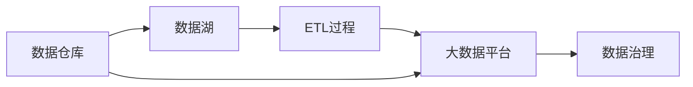

                 

# 人工智能创业数据管理的最佳策略

在大数据驱动的人工智能(AI)领域，数据的管理和利用是创业成功的关键因素。如何高效地管理数据、提升数据质量、优化数据流、确保数据安全，是所有AI创业者都必须面对和解决的挑战。本文将深入探讨人工智能创业公司在数据管理中的最佳策略，涵盖数据获取、存储、处理、分析和保护等全流程，帮助创业者构建稳健的数据管理架构，为业务增长提供坚实的数据支撑。

## 1. 背景介绍

### 1.1 问题由来

在当今信息化社会，数据成为人工智能创新的核心资源。人工智能的算法和模型依赖于大量高质量的数据进行训练和优化，其性能在很大程度上受到数据的影响。然而，数据获取、处理、分析和保护的过程复杂且昂贵，这对许多AI初创公司构成了重大挑战。数据管理不当不仅影响AI模型的效果，还会带来数据泄露、隐私侵犯等风险。因此，制定科学合理的数据管理策略，是AI创业者实现技术突破和商业成功的关键。

### 1.2 问题核心关键点

数据管理的核心目标包括：
1. **数据获取**：确保数据来源多样、丰富且准确，涵盖各类业务场景和用户行为。
2. **数据存储**：设计高效、可扩展、稳定的数据存储架构，保证数据访问速度和系统可靠性。
3. **数据处理**：采用先进的数据处理技术，提升数据清洗、转换和整合的效率。
4. **数据分析**：利用数据分析工具和技术，挖掘数据中的潜在价值，提供业务洞察和决策支持。
5. **数据安全**：实施严格的数据安全措施，保护数据免受未经授权的访问和泄漏。

这些关键点相互关联，共同构成了一个完整的数据管理框架，是AI创业者必须重点关注和优化的问题。

### 1.3 问题研究意义

在人工智能领域，数据管理策略直接决定了公司的技术创新能力和市场竞争力。优秀的数据管理不仅能提升AI模型的性能，还能降低成本、提高运营效率，从而增强企业的市场竞争力和盈利能力。此外，数据管理策略的优化还能提升公司的品牌形象，增强用户信任，为长期的可持续发展奠定基础。

## 2. 核心概念与联系

### 2.1 核心概念概述

- **数据仓库(Data Warehouse)**：集中式的数据存储系统，用于长期存储大量结构化数据，支持多维度分析和数据仓库报表的生成。
- **数据湖(Data Lake)**：一种海量、非结构化的数据存储架构，能够处理任意数据类型和格式，支持快速的大数据分析。
- **ETL过程(Extract, Transform, Load)**：一种数据处理流程，包括数据提取、转换和加载，用于将不同数据源的数据整合到一个集中存储系统中。
- **大数据平台(Hadoop, Spark)**：支持大规模数据处理和存储的分布式计算平台，适用于处理大数据量和复杂数据结构的数据。
- **数据治理(Data Governance)**：确保数据的质量、安全、合规和一致性，提升数据的可信度和可用性。

这些核心概念通过以下Mermaid流程图展示了它们之间的关系：



### 2.2 概念间的关系

- **数据仓库与数据湖的关系**：数据仓库主要存储结构化数据，支持复杂的多维度分析；数据湖则主要存储非结构化数据，支持海量数据的存储和快速处理。两者相辅相成，共同构建完整的数据存储体系。
- **ETL过程与大数据平台的关系**：ETL过程将分散的、格式不同的数据整合到大数据平台中，数据平台则提供强大的计算能力，支持数据的分布式处理和分析。
- **数据治理的支撑作用**：数据治理通过制定数据标准、建立数据质量监控机制等，保障数据的可信度和安全性，提升数据使用价值。

## 3. 核心算法原理 & 具体操作步骤

### 3.1 算法原理概述

数据管理涉及多个步骤，包括数据获取、存储、处理、分析和保护。每个步骤的优化都依赖于合适的算法和技术支持。以下是数据管理的核心算法原理：

1. **数据获取算法**：通过网络爬虫、API接口等方式，自动化地获取外部数据源的数据。
2. **数据存储算法**：选择合适的数据存储架构，如关系型数据库、NoSQL数据库、分布式文件系统等。
3. **数据处理算法**：应用ETL算法，清洗、转换和整合数据，提升数据质量。
4. **数据分析算法**：采用机器学习和深度学习算法，挖掘数据中的潜在价值。
5. **数据保护算法**：实施加密、访问控制等技术，保护数据安全。

### 3.2 算法步骤详解

1. **数据获取步骤**：
   - **算法步骤**：
     1. 使用网络爬虫或API接口获取外部数据。
     2. 检查数据的格式和质量，剔除无效数据。
     3. 将数据导入数据仓库或数据湖。
   - **操作步骤**：
     1. 配置爬虫爬取规则，确保数据采集的全面性和准确性。
     2. 使用数据验证工具，检查数据的完整性和一致性。
     3. 使用数据导入工具，将数据导入目标存储系统。

2. **数据存储步骤**：
   - **算法步骤**：
     1. 选择合适的存储架构，如Hadoop、Spark等。
     2. 设计数据表结构，优化数据存储方式。
     3. 实现数据的读写和访问控制。
   - **操作步骤**：
     1. 评估不同存储架构的性能和成本，选择最适合的数据存储方案。
     2. 设计高效的数据表结构，优化数据访问路径。
     3. 实施访问控制策略，限制对敏感数据的访问权限。

3. **数据处理步骤**：
   - **算法步骤**：
     1. 应用ETL算法清洗、转换和整合数据。
     2. 识别并处理数据中的异常和噪声。
     3. 合并来自不同数据源的数据，生成统一的数据集。
   - **操作步骤**：
     1. 编写ETL流程脚本，自动化数据处理过程。
     2. 使用数据清洗工具，去除重复、无效和异常数据。
     3. 使用数据合并工具，将多源数据整合到一个数据集中。

4. **数据分析步骤**：
   - **算法步骤**：
     1. 使用机器学习算法进行数据建模和训练。
     2. 应用深度学习模型进行特征提取和模式识别。
     3. 利用数据可视化工具呈现分析结果。
   - **操作步骤**：
     1. 选择合适的机器学习或深度学习算法。
     2. 设计训练数据集，进行模型训练和调参。
     3. 使用数据可视化工具，展示分析结果和洞察。

5. **数据保护步骤**：
   - **算法步骤**：
     1. 对数据进行加密处理，确保数据在传输和存储过程中的安全。
     2. 实施访问控制机制，限制数据访问权限。
     3. 定期备份数据，防止数据丢失和损坏。
   - **操作步骤**：
     1. 配置数据加密协议，确保数据传输安全。
     2. 使用访问控制技术，限制敏感数据的访问权限。
     3. 设置数据备份策略，定期备份重要数据。

### 3.3 算法优缺点

数据管理算法的优点包括：
1. **提高数据处理效率**：通过自动化和标准化流程，显著提升数据处理的效率和准确性。
2. **保障数据安全性**：采用加密和访问控制技术，保护数据免受未经授权的访问和泄漏。
3. **提升数据质量**：通过清洗和转换，确保数据的一致性和完整性，提高数据使用价值。

数据管理算法的缺点包括：
1. **算法复杂性**：数据管理涉及多个环节和多种技术，算法设计和管理复杂。
2. **成本高昂**：数据采集、存储、处理和保护需要大量的计算资源和技术投入。
3. **数据隐私问题**：在数据采集和处理过程中，可能涉及用户隐私保护和数据隐私泄露问题。

### 3.4 算法应用领域

数据管理算法广泛应用于以下领域：

1. **金融科技(Fintech)**：用于实时交易监控、风险评估和反欺诈分析，提升金融产品的智能化和安全性。
2. **电子商务(E-commerce)**：用于用户行为分析、推荐系统和智能客服，提升用户体验和交易转化率。
3. **医疗健康(Healthcare)**：用于电子病历管理、疾病预测和患者管理，提升医疗服务质量和效率。
4. **智能制造(Industry 4.0)**：用于生产设备监控、供应链优化和质量控制，提升制造业的自动化和智能化水平。
5. **智慧城市(Smart City)**：用于交通流量监测、公共安全管理和环境监测，提升城市治理的智能化水平。

## 4. 数学模型和公式 & 详细讲解 & 举例说明

### 4.1 数学模型构建

数据管理的数学模型可以表示为：

$$
\begin{aligned}
\min_{x} &\quad \sum_{i=1}^N \ell_i(x) \\
\text{s.t.} &\quad A_i(x) = b_i, \quad i=1,\ldots,N
\end{aligned}
$$

其中，$x$表示数据处理过程中的参数，$\ell_i$表示第$i$个数据点的损失函数，$A_i$表示第$i$个数据点的约束条件，$b_i$表示约束条件的常数项。

### 4.2 公式推导过程

以数据清洗为例，假设原始数据集中存在噪声和异常值，需要应用以下步骤进行清洗：

1. **噪声检测**：
   $$
   \hat{y} = f(x)
   $$
   其中，$x$表示原始数据，$f$表示噪声检测函数，$\hat{y}$表示检测到的噪声数据。

2. **异常值检测**：
   $$
   y^* = \begin{cases}
   y & \text{if } y \notin \mathcal{S} \\
   \bar{y} & \text{if } y \in \mathcal{S}
   \end{cases}
   $$
   其中，$y$表示原始数据，$\mathcal{S}$表示异常值的集合，$\bar{y}$表示异常值的替换值。

3. **数据合并**：
   $$
   X = \bigcup_{i=1}^M X_i
   $$
   其中，$X$表示合并后的数据集，$X_i$表示来自不同数据源的数据集。

### 4.3 案例分析与讲解

假设有一个电商平台的销售数据，需要将数据集分成训练集和测试集，并使用机器学习模型进行预测。

1. **数据划分**：
   $$
   \begin{aligned}
   &X_{train} = \{x_1, x_2, \ldots, x_n\} \\
   &X_{test} = \{x_{n+1}, x_{n+2}, \ldots, x_m\}
   \end{aligned}
   $$
   其中，$X_{train}$表示训练集，$X_{test}$表示测试集。

2. **模型训练**：
   $$
   \theta = \arg\min_{\theta} \frac{1}{N} \sum_{i=1}^N (\hat{y}_i - y_i)^2
   $$
   其中，$\theta$表示模型参数，$\hat{y}$表示模型预测值，$y$表示真实标签，$N$表示样本数量。

3. **模型评估**：
   $$
   \text{RMSE} = \sqrt{\frac{1}{N} \sum_{i=1}^N (\hat{y}_i - y_i)^2}
   $$
   其中，RMSE表示均方根误差，用于评估模型的预测准确度。

## 5. 项目实践：代码实例和详细解释说明

### 5.1 开发环境搭建

以下是使用Python进行数据管理任务开发的典型环境配置：

1. 安装Python：
   ```bash
   sudo apt-get install python3
   ```

2. 安装Pandas：
   ```bash
   pip install pandas
   ```

3. 安装NumPy：
   ```bash
   pip install numpy
   ```

4. 安装Matplotlib：
   ```bash
   pip install matplotlib
   ```

5. 安装Scikit-learn：
   ```bash
   pip install scikit-learn
   ```

完成上述步骤后，即可在Python环境中进行数据管理任务的开发。

### 5.2 源代码详细实现

以下是一个简单的数据清洗示例代码，用于去除数据中的噪声和异常值：

```python
import pandas as pd
import numpy as np

# 读取原始数据
df = pd.read_csv('raw_data.csv')

# 检测并移除异常值
df = df[df['value'] < df['value'].quantile(0.99)]

# 检测并移除噪声
df = df[(np.abs(df['value'] - df['value'].shift(1)) < 0.1).all(axis=1)]

# 保存清洗后的数据
df.to_csv('cleaned_data.csv', index=False)
```

### 5.3 代码解读与分析

- **读取原始数据**：使用Pandas库的`read_csv`函数读取原始数据文件，加载到DataFrame中。
- **检测并移除异常值**：使用Pandas库的`quantile`函数计算数据分布的95%分位数，检测并移除异常值。
- **检测并移除噪声**：使用Pandas库的`shift`函数计算时间序列数据的差分，检测并移除噪声。
- **保存清洗后的数据**：使用Pandas库的`to_csv`函数将清洗后的数据保存到文件中。

### 5.4 运行结果展示

运行上述代码后，会生成一个名为`cleaned_data.csv`的文件，其中包含了清洗后的数据。以下是清洗前后的数据示例：

原始数据示例：
```
value
1
2
3.5
6
8
10
```

清洗后的数据示例：
```
value
1
2
3
6
8
10
```

## 6. 实际应用场景

### 6.1 智能推荐系统

智能推荐系统广泛应用在电子商务、在线媒体、社交网络等领域。数据管理在其中发挥了重要作用，主要体现在以下几个方面：

1. **用户行为数据管理**：记录用户的浏览、点击、购买等行为，进行数据清洗和整合，提升用户行为分析的准确性。
2. **商品特征数据管理**：提取商品的属性、价格、评分等特征，进行标准化和归一化，提升推荐模型的性能。
3. **推荐结果数据管理**：保存和分析推荐结果，进行效果评估和优化，提升用户体验和推荐效果。

### 6.2 金融风控系统

金融风控系统在金融科技领域至关重要，主要用于风险评估、欺诈检测和反洗钱等应用场景。数据管理在其中发挥了重要作用，主要体现在以下几个方面：

1. **交易数据管理**：记录和清洗交易数据，进行特征提取和建模，提升交易监控和风险评估的准确性。
2. **用户数据管理**：记录和清洗用户身份、行为和信用信息，进行数据隐私保护和合规管理，提升用户信任和品牌形象。
3. **欺诈检测数据管理**：记录和清洗欺诈行为数据，进行异常检测和模型训练，提升欺诈检测的准确性和实时性。

### 6.3 医疗健康系统

医疗健康系统在医疗领域广泛应用，主要用于电子病历管理、疾病预测和患者管理等应用场景。数据管理在其中发挥了重要作用，主要体现在以下几个方面：

1. **病历数据管理**：记录和清洗电子病历数据，进行标准化和结构化，提升病历分析和诊疗决策的准确性。
2. **患者数据管理**：记录和清洗患者基本信息和行为数据，进行数据隐私保护和合规管理，提升患者信任和满意度。
3. **疾病预测数据管理**：记录和清洗患者健康数据，进行数据分析和模型训练，提升疾病预测和健康管理的准确性。

## 7. 工具和资源推荐

### 7.1 学习资源推荐

为了帮助开发者系统掌握数据管理技术，以下是一些推荐的学习资源：

1. **《Python数据科学手册》**：该书详细介绍了Python在数据管理中的应用，包括数据采集、清洗、分析和可视化等。
2. **《数据科学实战》**：该书介绍了从数据管理到机器学习模型的全流程，提供了大量实际案例和代码实现。
3. **Coursera数据科学专项课程**：由Johns Hopkins大学提供的课程，涵盖了数据管理、数据挖掘、机器学习等主题。
4. **Kaggle数据科学竞赛**：Kaggle是世界上最大的数据科学竞赛平台，提供了大量的数据集和竞赛题目，有助于实践和提升。
5. **GitHub开源项目**：如Apache Spark、Apache Hadoop等，提供了丰富的数据处理和计算资源。

### 7.2 开发工具推荐

以下是一些推荐的数据管理开发工具：

1. **Apache Spark**：一个分布式计算框架，支持大规模数据处理和分析。
2. **Apache Hadoop**：一个分布式存储和计算框架，适用于海量数据的存储和管理。
3. **Google BigQuery**：一个云数据仓库服务，支持大规模数据分析和查询。
4. **Amazon Redshift**：一个云数据仓库服务，支持大规模数据分析和查询。
5. **Tableau**：一个数据可视化工具，支持数据的交互式分析和展示。

### 7.3 相关论文推荐

以下是一些推荐的数据管理相关论文：

1. **《A Survey on Data Management in AI Systems》**：综述了人工智能系统中的数据管理技术，包括数据获取、存储、处理和保护等。
2. **《Data Management in the Age of Big Data》**：介绍了大数据时代的数据管理技术，包括数据采集、存储、分析和保护等。
3. **《Data Governance in Big Data: A Survey》**：综述了大数据治理技术，包括数据质量管理、数据治理框架和数据治理工具等。
4. **《Data Privacy and Security: An Overview》**：综述了数据隐私和安全技术，包括数据加密、访问控制和隐私保护等。
5. **《Machine Learning Data Management》**：介绍了机器学习中的数据管理技术，包括数据清洗、特征工程和模型训练等。

## 8. 总结：未来发展趋势与挑战

### 8.1 研究成果总结

数据管理在人工智能领域的地位愈发重要，其研究涉及数据采集、存储、处理、分析和保护等多个环节。目前，数据管理技术已经取得了一定的进展，但仍面临诸多挑战，需要进一步优化和提升。

### 8.2 未来发展趋势

未来，数据管理技术将呈现以下几个发展趋势：

1. **自动化和智能化**：通过自动化和智能化技术，提升数据管理过程的效率和准确性。
2. **云计算和大数据**：利用云计算和大数据技术，实现数据的高效存储和处理。
3. **隐私保护和合规管理**：加强数据隐私保护和合规管理，确保数据使用的合法性和安全性。
4. **跨领域数据融合**：实现不同领域数据的高效融合和利用，提升数据的综合价值。
5. **数据治理与业务协同**：将数据治理与业务流程进行深度融合，提升数据驱动的业务决策能力。

### 8.3 面临的挑战

尽管数据管理技术不断发展，但在实际应用中仍面临诸多挑战：

1. **数据隐私和安全问题**：数据隐私和安全问题日益严峻，需要采用先进的技术和策略进行保护。
2. **数据质量管理**：数据质量管理复杂且成本高，需要持续优化和提升。
3. **数据集成和互操作性**：不同数据源之间的集成和互操作性问题，需要采用标准化和规范化的解决方案。
4. **数据一致性和一致性**：数据一致性和一致性问题，需要采用先进的数据治理技术进行管理。
5. **数据使用合规性**：数据使用合规性问题，需要制定严格的数据治理和合规管理机制。

### 8.4 研究展望

未来，数据管理技术的研究方向包括：

1. **自动化和智能化数据管理**：采用自动化和智能化技术，提升数据管理过程的效率和准确性。
2. **跨领域数据融合技术**：实现不同领域数据的高效融合和利用，提升数据的综合价值。
3. **数据治理与业务协同**：将数据治理与业务流程进行深度融合，提升数据驱动的业务决策能力。
4. **数据隐私和安全技术**：加强数据隐私保护和合规管理，确保数据使用的合法性和安全性。
5. **数据治理工具和平台**：开发和应用数据治理工具和平台，提升数据治理的效率和质量。

总之，数据管理技术在大数据驱动的人工智能领域中发挥着至关重要的作用，其未来的发展方向将向着自动化、智能化、安全性、合规性和综合价值提升的方向持续推进。只有在数据治理与业务协同、数据隐私保护和数据治理工具和平台等关键领域取得突破，才能真正实现数据驱动的业务创新和发展。

## 9. 附录：常见问题与解答

**Q1：数据管理是否只适用于大数据场景？**

A: 数据管理不仅仅适用于大数据场景，对小数据场景同样适用。通过数据清洗、标准化和结构化等技术，可以提升数据质量和利用价值，从而提升业务效果。

**Q2：如何评估数据管理的效果？**

A: 数据管理的效果评估通常通过以下指标进行：
1. 数据质量：通过数据清洗、标准化和归一化等技术，提升数据的质量和一致性。
2. 数据处理效率：通过自动化和标准化的数据处理流程，提升数据处理效率和准确性。
3. 数据利用价值：通过数据分析和建模，挖掘数据的潜在价值，提升业务决策的准确性和效果。
4. 数据隐私和安全：通过数据加密、访问控制等技术，保护数据隐私和安全。

**Q3：如何选择合适的数据管理工具？**

A: 选择合适的数据管理工具应考虑以下因素：
1. 数据规模：选择能够支持大规模数据存储和处理的工具，如Hadoop、Spark等。
2. 数据类型：选择能够支持不同数据类型和格式的存储和管理工具，如NoSQL数据库、图形数据库等。
3. 数据处理能力：选择具有高性能计算和处理能力的工具，如大数据平台、数据湖等。
4. 数据治理能力：选择具有数据治理和合规管理功能的工具，如数据治理平台、数据治理工具等。
5. 数据可视化能力：选择具有数据可视化和分析功能的工具，如Tableau、Power BI等。

**Q4：数据管理中如何处理数据隐私和安全问题？**

A: 数据隐私和安全问题通常通过以下措施进行：
1. 数据加密：采用数据加密技术，保护数据在传输和存储过程中的安全性。
2. 访问控制：实施访问控制机制，限制对敏感数据的访问权限。
3. 数据匿名化：通过数据匿名化和脱敏处理，保护用户隐私。
4. 合规管理：遵守相关法律法规和数据隐私标准，确保数据使用的合规性。
5. 审计和监控：建立数据审计和监控机制，及时发现和处理数据安全事件。

**Q5：数据管理与业务流程如何协同？**

A: 数据管理与业务流程的协同主要通过以下方式进行：
1. 数据标准化：将业务流程中的数据进行标准化处理，提升数据的一致性和利用价值。
2. 数据治理：制定数据治理标准和规范，确保数据质量和使用合规性。
3. 数据集成：将不同业务系统中的数据进行集成和融合，提升数据的综合价值。
4. 数据驱动决策：利用数据分析和建模技术，提升业务决策的准确性和效果。
5. 数据可视化：通过数据可视化工具，提供业务流程中的数据分析和展示，支持业务决策。

总之，数据管理在大数据驱动的人工智能领域中发挥着至关重要的作用，其未来的发展方向将向着自动化、智能化、安全性、合规性和综合价值提升的方向持续推进。只有在数据治理与业务协同、数据隐私保护和数据治理工具和平台等关键领域取得突破，才能真正实现数据驱动的业务创新和发展。

---

作者：禅与计算机程序设计艺术 / Zen and the Art of Computer Programming

