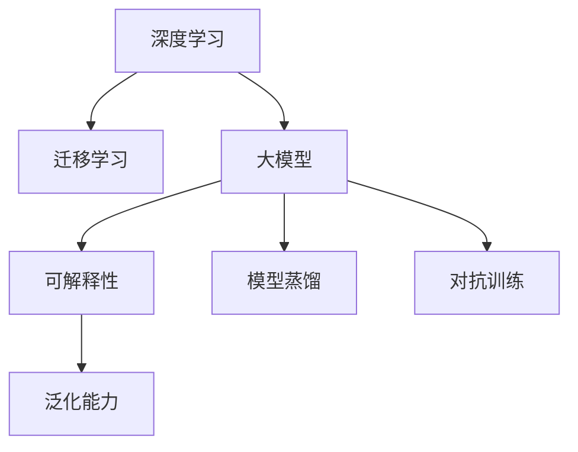
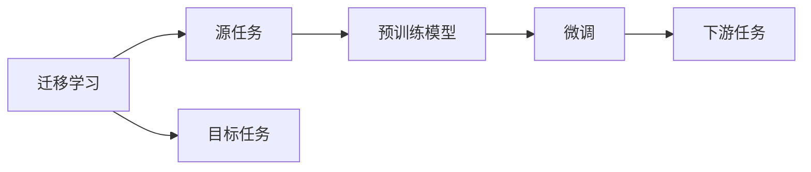
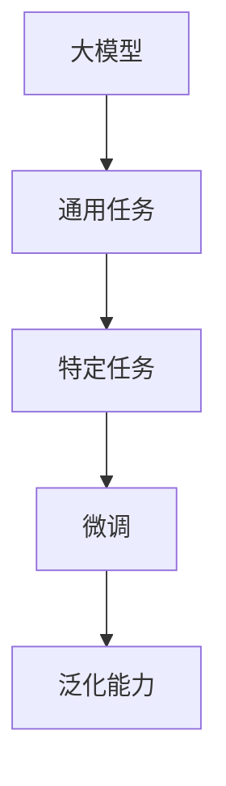
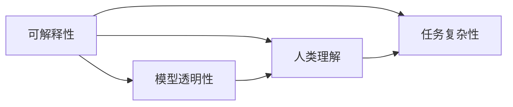
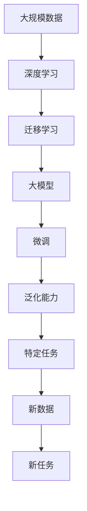

                 

# 从模仿到创新:AI的下一个发展阶段

## 1. 背景介绍

### 1.1 问题由来
近年来，人工智能(AI)技术的发展取得了举世瞩目的成就。从自动驾驶、机器人、智能客服，到医疗影像分析、金融风险预测、科学发现等各个领域，AI正以前所未有的深度和广度影响着人类的生产生活方式。然而，当我们回顾AI的历程，会发现一个有趣的现象：大部分AI技术的突破最初往往依赖于模仿现有系统，而随着时间的推移，逐步走向创新。

比如，在图像识别领域，深度卷积神经网络(DNN)最初模仿生物神经网络的结构和工作原理，取得了巨大的成功。后来，研究人员在实践中不断优化和创新，引入了注意力机制、残差网络、模型蒸馏等技术，实现了更高层次的抽象和推理能力。在自然语言处理(NLP)领域，从基于规则的语法分析器，到基于统计的语言模型，再到如今强大的大语言模型(Large Language Models, LLMs)，每一步都是对前一代技术的继承与超越。

这种从模仿到创新的发展模式，在大数据、大算力的推动下，使AI技术不断突破原有界限，逐渐走向更加智能、普适的阶段。然而，这种模式也带来了新的挑战和风险。如何在模仿中寻找到创新的突破点，如何在创新中保持技术的稳定性和可解释性，成为当前AI发展中亟待解决的问题。本文将从技术、应用、伦理等层面，深入探讨AI的下一个发展阶段，即从模仿到创新的过程及其挑战。

### 1.2 问题核心关键点
从模仿到创新的过程涉及多个关键点，包括：

- **数据与计算资源**：AI的突破离不开大量的数据和计算资源。在技术初创阶段，通常依赖大规模标注数据和强大计算能力进行模型训练。
- **模仿与改进**：初始模型往往模仿现有技术，在实践中不断改进和优化，逐步形成创新。
- **技术泛化**：从特定任务到通用模型的泛化，如从图像分类到通用视觉模型，从NLP任务到通用语言模型。
- **跨领域融合**：AI技术的跨领域融合，如多模态学习、跨学科知识整合等，将大大提升技术的应用范围和深度。
- **伦理与隐私**：AI技术的伦理使用和隐私保护，避免有害影响和滥用风险。
- **可解释性与透明性**：AI模型的可解释性和透明性，使得其决策过程易于理解和调试。

这些关键点共同构成了AI技术从模仿到创新的重要路径，对于理解AI技术的未来发展具有重要的指导意义。

### 1.3 问题研究意义
理解AI技术的从模仿到创新的过程，有助于把握技术的演进规律，预见未来的发展趋势。具体而言：

- **指导实践应用**：通过对模仿与创新路径的剖析，开发者可以更好地选择合适的技术方案，避免盲目跟风。
- **提升创新能力**：了解创新的关键点，可以激发更多创新灵感，提升AI技术的持续改进能力。
- **应对风险挑战**：提前识别和应对模仿和创新过程中可能面临的风险，如过拟合、泛化能力不足、伦理问题等，确保AI技术的健康发展。
- **促进技术与伦理的协同**：强调技术在伦理、隐私、透明性等方面的要求，推动AI技术走向更加普适和可控的未来。

## 2. 核心概念与联系

### 2.1 核心概念概述

为更好地理解AI从模仿到创新的过程，本节将介绍几个密切相关的核心概念：

- **深度学习**：一种基于多层神经网络的机器学习方法，通过学习大量数据，自动提取和建模数据的复杂特征。
- **迁移学习**：指将一个任务上学习到的知识，迁移应用到另一个相关但不同的任务上，提升模型的泛化能力。
- **大模型(Large Models)**：指具有数亿乃至数十亿参数的深度学习模型，通过大规模数据预训练和任务微调，具备强大的学习能力和泛化能力。
- **可解释性**：指AI模型决策过程的透明性和可理解性，使得人类能够理解和信任模型的输出。
- **泛化能力**：指模型在新数据上的表现，能够有效适应未见过的数据分布。
- **模型蒸馏**：一种模型压缩技术，通过让小型模型模仿大型模型，在保证性能的前提下，减少计算资源和存储需求。
- **对抗训练**：通过加入对抗样本训练模型，增强模型的鲁棒性和泛化能力。

这些核心概念之间的关系可以通过以下Mermaid流程图来展示：



这个流程图展示了大模型的核心概念及其之间的关系：

1. 深度学习是模型的基础，通过学习数据获得复杂表示。
2. 迁移学习将知识从一个大规模任务迁移到一个相关但不同的任务。
3. 大模型利用大规模数据预训练和任务微调，具备强大的泛化能力和可解释性。
4. 可解释性和泛化能力是大模型的重要评价指标。
5. 模型蒸馏和对抗训练是优化模型性能的有效技术手段。

### 2.2 概念间的关系

这些核心概念之间存在着紧密的联系，形成了AI技术从模仿到创新的完整生态系统。下面我们通过几个Mermaid流程图来展示这些概念之间的关系。

#### 2.2.1 深度学习的演进

```mermaid
graph LR
    A[深度学习] --> B[卷积神经网络(CNN)]
    A --> C[深度残差网络(ResNet)]
    A --> D[注意力机制(Transformer)]
    A --> E[模型蒸馏]
    A --> F[对抗训练]
    B --> C
    C --> D
```

这个流程图展示了深度学习技术从卷积神经网络到注意力机制的演进过程。深度学习最初借鉴生物神经网络结构，通过卷积神经网络进行图像识别。后来，ResNet、Transformer等技术进一步提升模型的性能，并引入模型蒸馏、对抗训练等优化方法，使得深度学习在各种任务上取得了突破。

#### 2.2.2 迁移学习与微调的关系



这个流程图展示了迁移学习的基本原理，以及它与微调的关系。迁移学习涉及源任务和目标任务，预训练模型在源任务上学习，然后通过微调适应各种下游任务（目标任务）。

#### 2.2.3 大模型的泛化与应用



这个流程图展示了大模型的泛化过程。大模型通过大规模数据预训练，具备泛化到各种特定任务的能力。微调将大模型进一步适配到特定任务，提升模型的泛化能力。

#### 2.2.4 可解释性与模型性能



这个流程图展示了可解释性与模型性能的关系。可解释性使得人类能够理解模型的决策过程，进而提升模型的透明性和可信任度。

### 2.3 核心概念的整体架构

最后，我们用一个综合的流程图来展示这些核心概念在大模型演进过程中的整体架构：



这个综合流程图展示了从深度学习到特定任务的微调过程。大规模数据通过深度学习获得初始模型，然后通过迁移学习和大模型微调，提升模型的泛化能力和特定任务的适配性。最后，模型在新数据和任务上进行泛化，实现从模仿到创新的过程。 通过这些流程图，我们可以更清晰地理解AI从模仿到创新的过程中各个核心概念的关系和作用，为后续深入讨论具体的模仿与创新技术奠定基础。

## 3. 核心算法原理 & 具体操作步骤
### 3.1 算法原理概述

从模仿到创新的AI技术演进过程中，算法原理的变化起到了关键作用。以下是几个核心的算法原理概述：

#### 3.1.1 深度学习与大模型

深度学习通过多层神经网络，自动学习数据的复杂表示。大模型则是通过大规模数据预训练和微调，提升了模型的泛化能力和性能。大模型通常具备以下特点：

- **大规模参数**：数亿乃至数十亿的参数规模，使得大模型可以学习到更加丰富的语义和特征。
- **自我归因**：大模型在每个预测节点上，通过梯度下降等方法不断更新参数，学习到更加准确的特征表示。
- **多任务学习**：大模型可以同时学习多个任务，通过共享的参数和架构，提升任务间的泛化能力。

#### 3.1.2 迁移学习与微调

迁移学习通过将源任务学到的知识迁移应用到目标任务上，提升模型的泛化能力。微调则是在大模型的基础上，通过任务特定的数据进行有监督学习，优化模型在特定任务上的性能。微调过程通常包括：

- **选择预训练模型**：如BERT、GPT等，作为初始化参数。
- **设计任务适配层**：根据任务类型，在顶层设计合适的输出层和损失函数。
- **设置微调超参数**：包括学习率、批大小、迭代轮数等。
- **执行梯度训练**：在训练集上不断更新模型参数，最小化损失函数。
- **评估模型性能**：在验证集和测试集上评估模型性能，防止过拟合。

#### 3.1.3 可解释性与透明性

可解释性是大模型从模仿到创新的重要指标。可解释性通常通过以下方法实现：

- **模型蒸馏**：通过训练小型模型，使得其尽可能模仿大型模型的输出，从而在保证性能的前提下，减少模型复杂度和计算资源。
- **特征可视化**：通过可视化模型的特征图，帮助人类理解模型的决策过程。
- **中间层提取**：通过提取模型中间层的表示，提供对模型的初步解释。

#### 3.1.4 对抗训练与鲁棒性

对抗训练通过加入对抗样本，增强模型的鲁棒性和泛化能力。具体过程如下：

- **生成对抗样本**：通过优化器生成对模型有误导作用的样本。
- **训练模型**：在带有对抗样本的训练集上，不断更新模型参数，提升模型的鲁棒性。
- **测试鲁棒性**：在测试集上评估模型在对抗样本上的性能，防止过拟合。

### 3.2 算法步骤详解

以下是AI技术从模仿到创新的具体算法步骤：

**Step 1: 准备数据与计算资源**

- 收集大规模无标签数据，作为预训练数据集。
- 选择适当的GPU/TPU设备，安装深度学习框架如TensorFlow、PyTorch等。
- 准备标注数据集，用于任务微调。

**Step 2: 构建预训练模型**

- 选择适合的深度学习架构，如卷积神经网络、Transformer等。
- 在预训练数据集上进行无监督学习，如自编码器、自回归模型等。
- 使用大规模预训练模型进行多任务学习，提高模型的泛化能力。

**Step 3: 设计任务适配层**

- 根据目标任务类型，设计合适的输出层和损失函数。
- 对于分类任务，通常在顶层添加线性分类器和交叉熵损失函数。
- 对于生成任务，使用语言模型的解码器输出概率分布，并以负对数似然为损失函数。

**Step 4: 设置微调超参数**

- 选择合适的优化算法及其参数，如AdamW、SGD等，设置学习率、批大小、迭代轮数等。
- 设置正则化技术及强度，包括权重衰减、Dropout、Early Stopping等。
- 确定冻结预训练参数的策略，如仅微调顶层，或全部参数都参与微调。

**Step 5: 执行梯度训练**

- 将训练集数据分批次输入模型，前向传播计算损失函数。
- 反向传播计算参数梯度，根据设定的优化算法和学习率更新模型参数。
- 周期性在验证集上评估模型性能，根据性能指标决定是否触发Early Stopping。
- 重复上述步骤直到满足预设的迭代轮数或Early Stopping条件。

**Step 6: 评估模型性能**

- 在测试集上评估微调后模型性能，对比微调前后的精度提升。
- 使用微调后的模型对新样本进行推理预测，集成到实际的应用系统中。
- 持续收集新的数据，定期重新微调模型，以适应数据分布的变化。

以上是AI技术从模仿到创新的具体算法步骤。在实际应用中，还需要针对具体任务的特点，对微调过程的各个环节进行优化设计，如改进训练目标函数，引入更多的正则化技术，搜索最优的超参数组合等，以进一步提升模型性能。

### 3.3 算法优缺点

从模仿到创新的AI技术演进过程中，算法具有以下优点：

1. **提升泛化能力**：通过迁移学习和微调，大模型在特定任务上可以显著提升泛化能力，适应新的数据分布。
2. **节省标注成本**：利用大模型在预训练阶段的学习能力，可以显著减少任务微调所需的标注数据量。
3. **加速创新进程**：通过大模型的泛化能力，开发者可以快速实现新任务适配，加速创新进程。
4. **提升可解释性**：通过模型蒸馏等方法，可以增强大模型的可解释性，使得其决策过程更加透明。
5. **增强鲁棒性**：通过对抗训练等技术，可以提升大模型的鲁棒性，防止有害信息传播。

同时，该算法也存在一些缺点：

1. **依赖计算资源**：大模型和微调过程需要大量计算资源，成本较高。
2. **数据偏差问题**：预训练数据和微调数据可能存在偏差，导致模型在特定领域表现不佳。
3. **模型复杂性**：大模型参数量巨大，训练和推理过程复杂。
4. **推理效率低**：大规模模型推理速度慢，实时性差。
5. **伦理问题**：大模型可能学习到有害信息，带来伦理和安全风险。
6. **可解释性不足**：大模型通常缺乏可解释性，难以理解和调试。

尽管存在这些缺点，但就目前而言，从模仿到创新的AI技术演进方法仍是大规模应用的主流范式。未来相关研究的重点在于如何进一步降低计算成本，提高模型鲁棒性和可解释性，同时兼顾伦理和安全。

### 3.4 算法应用领域

AI从模仿到创新的技术演进，在多个领域得到了广泛应用，例如：

- **计算机视觉**：从基于规则的检测器到深度卷积神经网络，再到注意力机制的Transformer，图像识别技术不断突破。
- **自然语言处理**：从基于规则的语法分析器，到基于统计的语言模型，再到通用大语言模型，NLP技术日益成熟。
- **智能推荐**：从基于规则的推荐系统，到基于协同过滤的推荐，再到深度学习推荐模型，推荐技术逐渐精准。
- **自动驾驶**：从基于规则的驾驶策略，到基于深度学习的感知和决策，自动驾驶技术日趋可靠。
- **智能客服**：从基于规则的问答系统，到基于深度学习的对话模型，智能客服系统越来越智能。
- **医疗影像**：从基于规则的诊断系统，到深度学习的多模态学习，医疗影像分析技术不断提升。
- **金融预测**：从基于规则的风险评估，到基于深度学习的预测模型，金融风险预测技术逐步精准。

除了上述这些经典领域外，AI技术还在更多创新性应用中展现出巨大潜力，如智能家居、工业自动化、教育娱乐等。随着AI技术的不断演进，其应用场景将变得更加广阔和深入。

## 4. 数学模型和公式 & 详细讲解  
### 4.1 数学模型构建

本节将使用数学语言对AI从模仿到创新的演进过程进行更加严格的刻画。

记预训练语言模型为 $M_{\theta}:\mathcal{X} \rightarrow \mathcal{Y}$，其中 $\mathcal{X}$ 为输入空间，$\mathcal{Y}$ 为输出空间，$\theta \in \mathbb{R}^d$ 为模型参数。假设微调任务的训练集为 $D=\{(x_i,y_i)\}_{i=1}^N, x_i \in \mathcal{X}, y_i \in \mathcal{Y}$。

定义模型 $M_{\theta}$ 在数据样本 $(x,y)$ 上的损失函数为 $\ell(M_{\theta}(x),y)$，则在数据集 $D$ 上的经验风险为：

$$
\mathcal{L}(\theta) = \frac{1}{N} \sum_{i=1}^N \ell(M_{\theta}(x_i),y_i)
$$

微调的优化目标是最小化经验风险，即找到最优参数：

$$
\theta^* = \mathop{\arg\min}_{\theta} \mathcal{L}(\theta)
$$

在实践中，我们通常使用基于梯度的优化算法（如SGD、Adam等）来近似求解上述最优化问题。设 $\eta$ 为学习率，$\lambda$ 为正则化系数，则参数的更新公式为：

$$
\theta \leftarrow \theta - \eta \nabla_{\theta}\mathcal{L}(\theta) - \eta\lambda\theta
$$

其中 $\nabla_{\theta}\mathcal{L}(\theta)$ 为损失函数对参数 $\theta$ 的梯度，可通过反向传播算法高效计算。

### 4.2 公式推导过程

以下我们以二分类任务为例，推导交叉熵损失函数及其梯度的计算公式。

假设模型 $M_{\theta}$ 在输入 $x$ 上的输出为 $\hat{y}=M_{\theta}(x) \in [0,1]$，表示样本属于正类的概率。真实标签 $y \in \{0,1\}$。则二分类交叉熵损失函数定义为：

$$
\ell(M_{\theta}(x),y) = -[y\log \hat{y} + (1-y)\log (1-\hat{y})]
$$

将其代入经验风险公式，得：

$$
\mathcal{L}(\theta) = -\frac{1}{N}\sum_{i=1}^N [y_i\log M_{\theta}(x_i)+(1-y_i)\log(1-M_{\theta}(x_i))]
$$

根据链式法则，损失函数对参数 $\theta_k$ 的梯度为：

$$
\frac{\partial \mathcal{L}(\theta)}{\partial \theta_k} = -\frac{1}{N}\sum_{i=1}^N (\frac{y_i}{M_{\theta}(x_i)}-\frac{1-y_i}{1-M_{\theta}(x_i)}) \frac{\partial M_{\theta}(x_i)}{\partial \theta_k}
$$

其中 $\frac{\partial M_{\theta}(x_i)}{\partial \theta_k}$ 可进一步递归展开，利用自动微分技术完成计算。

在得到损失函数的梯度后，即可带入参数更新公式，完成模型的迭代优化。重复上述过程直至收敛，最终得到适应下游任务的最优模型参数 $\theta^*$。

## 5. 项目实践：代码实例和详细解释说明
### 5.1 开发环境搭建

在进行模仿与创新技术演进实践前，我们需要准备好开发环境。以下是使用Python进行PyTorch开发的环境配置流程：

1. 安装Anaconda：从官网下载并安装Anaconda，用于创建独立的Python环境。

2. 创建并激活虚拟环境：
```bash
conda create -n pytorch-env python=3.8 
conda activate pytorch-env
```

3. 安装PyTorch：根据CUDA版本，从官网获取对应的安装命令。例如：
```bash
conda install pytorch torchvision torchaudio cudatoolkit=11.1 -c pytorch -c conda-forge
```

4. 安装Transformers库：
```bash
pip install transformers
```

5. 安装各类工具包：
```bash
pip install numpy pandas scikit-learn matplotlib tqdm jupyter notebook ipython
```

完成上述步骤后，即可在`pytorch-env`环境中开始模仿与创新技术演进实践。

### 5.2 源代码详细实现

这里我们以图像分类任务为例，给出使用Transformers库对BERT模型进行微调的PyTorch代码实现。

首先，定义图像分类任务的数据处理函数：

```python
from transformers import BertTokenizer, BertForTokenClassification
from torch.utils.data import Dataset
import torch

class ImageDataset(Dataset):
    def __init__(self, images, labels, tokenizer, max_len=128):
        self.images = images
        self.labels = labels
        self.tokenizer = tokenizer
        self.max_len = max_len
        
    def __len__(self):
        return len(self.images)
    
    def __getitem__(self, item):
        image = self.images[item]
        label = self.labels[item]
        
        encoding = self.tokenizer(image, return_tensors='pt', max_length=self.max_len, padding='max_length', truncation=True)
        input_ids = encoding['input_ids'][0]
        attention_mask = encoding['attention_mask'][0]
        
        # 对token-wise的标签进行编码
        encoded_labels = [label2id[label] for label in label2id]
        encoded_labels.extend([label2id['O']] * (self.max_len - len(encoded_labels)))
        labels = torch.tensor(encoded_labels, dtype=torch.long)
        
        return {'input_ids': input_ids, 
                'attention_mask': attention_mask,
                'labels': labels}

# 标签与id的映射
label2id = {'O': 0, 'cat': 1, 'dog': 2, 'bird': 3}
id2label = {v: k for k, v in label2id.items()}

# 创建dataset
tokenizer = BertTokenizer.from_pretrained('bert-base-cased')

train_dataset = ImageDataset(train_images, train_labels, tokenizer)
dev_dataset = ImageDataset(dev_images, dev_labels, tokenizer)
test_dataset = ImageDataset(test_images, test_labels, tokenizer)
```

然后，定义模型和优化器：

```python
from transformers import BertForTokenClassification, AdamW

model = BertForTokenClassification.from_pretrained('bert-base-cased', num_labels=len(label2id))

optimizer = AdamW(model.parameters(), lr=2e-5)
```

接着，定义训练和评估函数：

```python
from torch.utils.data import DataLoader
from tqdm import tqdm
from sklearn.metrics import classification_report

device = torch.device('cuda') if torch.cuda.is_available() else torch.device('cpu')
model.to(device)

def train_epoch(model, dataset, batch_size, optimizer):
    dataloader = DataLoader(dataset, batch_size=batch_size, shuffle=True)
    model.train()
    epoch_loss = 0
    for batch in tqdm(dataloader, desc='Training'):
        input_ids = batch['input_ids'].to(device)
        attention_mask = batch['attention_mask'].to(device)
        labels = batch['labels'].to(device)
        model.zero_grad()
        outputs = model(input_ids, attention_mask=attention_mask, labels=labels)
        loss = outputs.loss
        epoch_loss += loss.item()
        loss.backward()
        optimizer.step()
    return epoch_loss / len(dataloader)

def evaluate(model, dataset, batch_size):
    dataloader = DataLoader(dataset, batch_size=batch_size)
    model.eval()
    preds, labels = [], []
    with torch.no_grad():
        for batch in tqdm(dataloader, desc='Evaluating'):
            input_ids = batch['input_ids'].to(device)
            attention_mask = batch['attention_mask'].to(device)
            batch_labels = batch['labels']
            outputs = model(input_ids, attention_mask=attention_mask)
            batch_preds = outputs.logits.argmax(dim=2).to('cpu').tolist()
            batch_labels = batch_labels.to('cpu').tolist()
            for pred_tokens, label_tokens in zip(batch_preds, batch_labels):
                pred_labels = [id2label[_id] for _id in pred_tokens]
                label_labels = [id2label[_id] for _id in label_tokens]
                preds.append(pred_labels[:len(label_labels)])
                labels.append(label_labels)
                
    print(classification_report(labels, preds))
```

最后，启动训练流程并在测试集上评估：

```python
epochs = 5
batch_size = 16

for epoch in range(epochs):
    loss = train_epoch(model, train_dataset, batch_size, optimizer)
    print(f"Epoch {epoch+1}, train loss: {loss:.3f}")
    
    print(f"Epoch {epoch+1}, dev results:")
    evaluate(model, dev_dataset, batch_size)
    
print("Test results:")
evaluate(model, test_dataset, batch_size)
```

以上就是使用PyTorch对BERT进行图像分类任务微调的完整代码实现。可以看到，得益于Transformers库的强大封装，我们可以用相对简洁的代码完成BERT模型的加载和微调。

### 5.3 代码解读与分析

让我们再详细解读一下关键代码的实现细节：

**ImageDataset类**：
- `__init__`方法：初始化图像、

