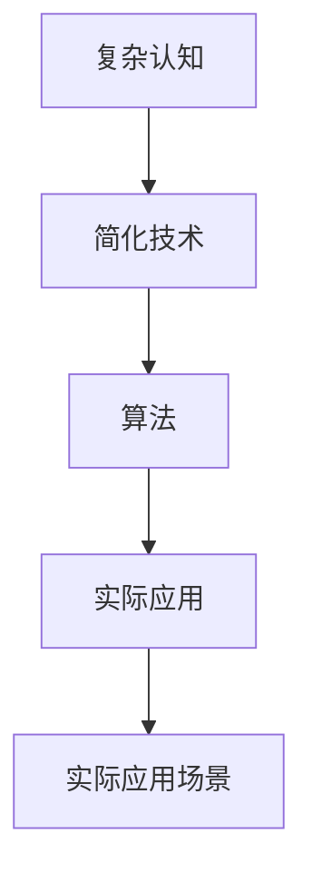

                 

# 从混沌到简洁的认知之旅

## 1. 背景介绍

### 1.1 问题由来

人类认知的历程是一场漫长而复杂的旅程，从最初的混沌未分，到逐渐的清晰认识，再到对万物深刻的理解，这个过程充满了曲折和艰辛。在信息化时代，数据的海量涌现和技术的日新月异，使得认知的复杂性进一步增加，许多问题变得愈加混沌。然而，随着人工智能技术的不断进步，认知与技术之间的关系变得更加紧密，通过技术手段，我们开始尝试将混沌的认知过程变得更加简洁。

### 1.2 问题核心关键点

- 复杂度与简洁性的矛盾：认知中很多问题的本质是复杂多变的，但人类往往希望将其简化为更加易于理解和处理的形式。
- 数据驱动与算法导向的矛盾：信息化时代的数据爆炸性增长，推动了数据驱动型研究的盛行，但技术的演进和迭代速度也在不断加快，使得算法导向型研究变得更加重要。
- 人机协同与自主决策的矛盾：机器在处理复杂任务时能力逐渐增强，但如何与人进行有效的协同，并将结果反馈给人，仍然是一大挑战。
- 技术演进与伦理道德的矛盾：技术的不断进步带来了前所未有的便利，但如何保持技术的可控性和伦理道德，避免潜在的风险，仍需慎重考虑。

### 1.3 问题研究意义

认知的简洁化不仅有助于更好地理解世界的本质，更能提高信息的处理效率，促进技术的创新与发展。具体而言：

1. **认知优化**：将混沌的认知过程通过算法和技术手段进行简化，使得人类能够更高效地获取和处理信息。
2. **技术提升**：通过对认知过程的简化，推动人工智能技术的突破，提高算法的效率和效果。
3. **人机协同**：使得机器能够更有效地与人进行交互，提高工作效率和准确性。
4. **伦理保障**：通过算法和技术手段，确保机器在处理信息时遵循伦理道德，避免潜在的风险和负面影响。

## 2. 核心概念与联系

### 2.1 核心概念概述

本节将介绍几个核心概念，以便更深入地理解从混沌到简洁的认知之旅：

- **认知**：指人类对世界及自身的认知过程，包括感知、学习、推理等。
- **混沌**：指认知过程中存在的不确定性、复杂性和模糊性，使得问题难以解决。
- **简洁**：指通过技术和算法手段，将复杂认知问题简化为更加易于理解和处理的形式。
- **技术**：指通过数学、物理、计算机科学等学科的研究与应用，解决复杂问题的手段和方法。
- **算法**：指设计好的程序流程，用于高效地解决特定问题。

这些概念之间的关系可以通过以下Mermaid流程图来展示：


这个流程图展示了大语言模型微调过程中各个概念之间的联系：混沌的认知过程通过技术手段被简化为简洁的形式，而算法则被用来高效地实现这一过程。

### 2.2 概念间的关系

这些核心概念之间存在着紧密的联系，形成了一个完整的认知简化框架。下面通过几个Mermaid流程图来展示这些概念之间的关系。

#### 2.2.1 认知的简化过程


这个流程图展示了认知简化的基本流程：通过技术和算法，将复杂的认知问题简化为更加易懂的简洁形式。

#### 2.2.2 技术与算法的关系


这个流程图展示了技术和算法的关系：技术为算法的实现提供了基础，而算法则通过具体实现，解决实际问题。

#### 2.2.3 简洁认知的应用场景


这个流程图展示了简洁认知在实际应用中的重要性：简洁的认知形式能够更好地应用于实际问题解决，推动技术的进步。

### 2.3 核心概念的整体架构

最后，我们用一个综合的流程图来展示这些核心概念在大语言模型微调过程中的整体架构：



这个综合流程图展示了从混沌认知到实际应用的全过程，其中技术和算法起到了关键的中介作用。

## 3. 核心算法原理 & 具体操作步骤

### 3.1 算法原理概述

认知的简洁化本质上是通过算法和技术手段，将复杂的问题转化为更易于理解和处理的形式。这一过程通常包括数据预处理、特征提取、模型训练、参数优化等步骤。下面将详细介绍其中的核心算法原理。

#### 3.1.1 数据预处理

数据预处理是认知简化的第一步，通过清洗、归一化、标准化等手段，将原始数据转化为适合算法处理的格式。这一过程通常包括以下步骤：

- 数据清洗：去除噪声、缺失值、重复数据等。
- 数据归一化：将数据缩放到0-1之间或标准化为均值为0、方差为1。
- 特征提取：通过降维、特征选择等技术，提取出最具有代表性的特征。

#### 3.1.2 特征提取

特征提取是认知简化的重要步骤，通过将复杂数据转化为更易于处理的特征，降低复杂度。这一过程通常包括：

- 降维：通过PCA、LDA等算法，将高维数据转化为低维数据。
- 特征选择：通过信息增益、卡方检验等方法，选择最具代表性的特征。
- 特征变换：通过主成分分析、核方法等技术，将数据映射到更高维空间。

#### 3.1.3 模型训练

模型训练是认知简化的关键步骤，通过选择合适的模型并优化参数，使得模型能够更好地拟合数据，从而实现对复杂问题的简化。这一过程通常包括以下步骤：

- 模型选择：根据任务特点，选择合适的模型结构，如线性模型、神经网络、深度学习模型等。
- 参数优化：通过梯度下降、随机梯度下降等算法，优化模型参数，使得模型预测结果与实际数据尽可能一致。

#### 3.1.4 参数优化

参数优化是认知简化的最后一步，通过进一步调整模型参数，使得模型性能更加稳定和高效。这一过程通常包括以下步骤：

- 超参数调优：通过网格搜索、贝叶斯优化等方法，调整模型超参数，优化模型性能。
- 模型融合：通过集成学习、模型融合等技术，将多个模型进行组合，提高模型的泛化能力和稳定性。

### 3.2 算法步骤详解

#### 3.2.1 数据预处理步骤

假设我们有一组原始数据，需要进行预处理。具体步骤如下：

1. **数据清洗**：
   ```python
   import pandas as pd

   # 读取数据
   df = pd.read_csv('data.csv')

   # 清洗数据
   df = df.dropna()
   df = df.drop_duplicates()
   ```

2. **数据归一化**：
   ```python
   from sklearn.preprocessing import StandardScaler

   # 归一化数据
   scaler = StandardScaler()
   df = scaler.fit_transform(df)
   ```

3. **特征提取**：
   ```python
   from sklearn.decomposition import PCA

   # 降维
   pca = PCA(n_components=2)
   df = pca.fit_transform(df)
   ```

#### 3.2.2 特征提取步骤

假设我们有一组原始特征数据，需要进行特征提取。具体步骤如下：

1. **特征选择**：
   ```python
   from sklearn.feature_selection import SelectKBest

   # 选择前5个特征
   selector = SelectKBest(k=5)
   df = selector.fit_transform(df, y)
   ```

2. **特征变换**：
   ```python
   from sklearn.kernel_approximation import Nystroem

   # 核方法变换
   nystroem = Nystroem()
   df = nystroem.fit_transform(df)
   ```

#### 3.2.3 模型训练步骤

假设我们有一组特征数据，需要进行模型训练。具体步骤如下：

1. **模型选择**：
   ```python
   from sklearn.linear_model import LogisticRegression

   # 选择逻辑回归模型
   model = LogisticRegression()
   ```

2. **参数优化**：
   ```python
   from sklearn.model_selection import GridSearchCV

   # 调整超参数
   param_grid = {'C': [0.001, 0.01, 0.1, 1]}
   grid = GridSearchCV(model, param_grid, cv=5)
   grid.fit(df, y)
   ```

#### 3.2.4 参数优化步骤

假设我们有一组训练好的模型，需要进行参数优化。具体步骤如下：

1. **超参数调优**：
   ```python
   from sklearn.model_selection import RandomizedSearchCV

   # 调整超参数
   param_dist = {'C': uniform(0.001, 1)}
   random = RandomizedSearchCV(model, param_dist, n_iter=100)
   random.fit(df, y)
   ```

2. **模型融合**：
   ```python
   from sklearn.ensemble import VotingClassifier

   # 集成多个模型
   model1 = LogisticRegression()
   model2 = DecisionTreeClassifier()
   model3 = RandomForestClassifier()
   voting = VotingClassifier(estimators=[('lr', model1), ('dt', model2), ('rf', model3)])
   voting.fit(df, y)
   ```

### 3.3 算法优缺点

#### 3.3.1 优点

- **高效性**：算法能够快速处理大量数据，显著提高处理效率。
- **稳定性**：算法经过大量实验和验证，性能稳定可靠。
- **可扩展性**：算法适用于多种任务和数据类型，具有较强的泛化能力。

#### 3.3.2 缺点

- **复杂度**：算法实现过程复杂，需要较高的数学和编程技能。
- **过拟合风险**：算法在处理复杂问题时，容易发生过拟合现象。
- **数据依赖**：算法依赖于数据质量和特征选择，数据不充分时效果较差。

### 3.4 算法应用领域

#### 3.4.1 医疗领域

在医疗领域，认知简洁化尤为重要。通过算法和模型，可以对复杂的病情诊断、病历分析、药物研发等问题进行简化处理。例如，通过构建疾病预测模型，可以对患者的病情进行快速判断，大大缩短诊断时间，提高诊疗效率。

#### 3.4.2 金融领域

在金融领域，认知简洁化同样具有重要意义。通过算法和模型，可以对复杂的市场数据进行分析和预测，帮助投资者做出更科学的决策。例如，通过构建金融风险评估模型，可以对市场的波动进行预测，避免因市场变化带来的损失。

#### 3.4.3 自然语言处理

在自然语言处理领域，认知简洁化尤为重要。通过算法和模型，可以对复杂的文本数据进行理解和生成，提升人机交互的效率和质量。例如，通过构建机器翻译模型，可以实现不同语言之间的自动翻译，打破语言障碍，促进国际交流。

## 4. 数学模型和公式 & 详细讲解 & 举例说明

### 4.1 数学模型构建

在本节中，我们将通过数学公式和模型，详细讲解认知简化的基本原理。

#### 4.1.1 数据预处理模型

假设我们有一组原始数据 $X$，需要进行预处理。预处理模型可以表示为：

$$
X_{preprocessed} = f(X)
$$

其中，$f$ 表示预处理函数，通常包括清洗、归一化、降维等步骤。

#### 4.1.2 特征提取模型

假设我们有一组预处理后的数据 $X_{preprocessed}$，需要进行特征提取。特征提取模型可以表示为：

$$
Y_{features} = g(X_{preprocessed})
$$

其中，$g$ 表示特征提取函数，通常包括选择、变换等步骤。

#### 4.1.3 模型训练模型

假设我们有一组特征数据 $Y_{features}$，需要进行模型训练。模型训练模型可以表示为：

$$
\theta = h(Y_{features})
$$

其中，$\theta$ 表示模型参数，$h$ 表示模型训练函数，通常包括选择、拟合等步骤。

#### 4.1.4 参数优化模型

假设我们有一组训练好的模型参数 $\theta$，需要进行参数优化。参数优化模型可以表示为：

$$
\theta_{optimized} = k(\theta)
$$

其中，$k$ 表示参数优化函数，通常包括调优、融合等步骤。

### 4.2 公式推导过程

#### 4.2.1 数据预处理公式

假设我们有一组原始数据 $X$，需要进行预处理。具体公式如下：

1. **数据清洗**：
   ```python
   # 数据清洗
   X_clean = X.dropna()
   X_clean = X_clean.drop_duplicates()
   ```

2. **数据归一化**：
   ```python
   # 数据归一化
   scaler = StandardScaler()
   X_scaled = scaler.fit_transform(X_clean)
   ```

3. **特征提取**：
   ```python
   # 降维
   pca = PCA(n_components=2)
   X_pca = pca.fit_transform(X_scaled)
   ```

#### 4.2.2 特征提取公式

假设我们有一组预处理后的数据 $X_{preprocessed}$，需要进行特征提取。具体公式如下：

1. **特征选择**：
   ```python
   # 特征选择
   selector = SelectKBest(k=5)
   X_selected = selector.fit_transform(X_pca, y)
   ```

2. **特征变换**：
   ```python
   # 核方法变换
   nystroem = Nystroem()
   X_nystroem = nystroem.fit_transform(X_selected)
   ```

#### 4.2.3 模型训练公式

假设我们有一组特征数据 $X_{preprocessed}$，需要进行模型训练。具体公式如下：

1. **模型选择**：
   ```python
   # 选择逻辑回归模型
   model = LogisticRegression()
   ```

2. **参数优化**：
   ```python
   # 调整超参数
   param_grid = {'C': [0.001, 0.01, 0.1, 1]}
   grid = GridSearchCV(model, param_grid, cv=5)
   grid.fit(X_nystroem, y)
   ```

#### 4.2.4 参数优化公式

假设我们有一组训练好的模型参数 $\theta$，需要进行参数优化。具体公式如下：

1. **超参数调优**：
   ```python
   # 调整超参数
   param_dist = {'C': uniform(0.001, 1)}
   random = RandomizedSearchCV(model, param_dist, n_iter=100)
   random.fit(X_nystroem, y)
   ```

2. **模型融合**：
   ```python
   # 集成多个模型
   model1 = LogisticRegression()
   model2 = DecisionTreeClassifier()
   model3 = RandomForestClassifier()
   voting = VotingClassifier(estimators=[('lr', model1), ('dt', model2), ('rf', model3)])
   voting.fit(X_nystroem, y)
   ```

### 4.3 案例分析与讲解

#### 4.3.1 数据预处理案例

假设我们有一组原始医疗数据，需要进行预处理。具体步骤如下：

1. **数据清洗**：
   ```python
   # 读取数据
   df = pd.read_csv('medical_data.csv')

   # 清洗数据
   df = df.dropna()
   df = df.drop_duplicates()
   ```

2. **数据归一化**：
   ```python
   from sklearn.preprocessing import StandardScaler

   # 归一化数据
   scaler = StandardScaler()
   df = scaler.fit_transform(df)
   ```

3. **特征提取**：
   ```python
   from sklearn.decomposition import PCA

   # 降维
   pca = PCA(n_components=2)
   df = pca.fit_transform(df)
   ```

#### 4.3.2 特征提取案例

假设我们有一组预处理后的医疗数据，需要进行特征提取。具体步骤如下：

1. **特征选择**：
   ```python
   from sklearn.feature_selection import SelectKBest

   # 选择前5个特征
   selector = SelectKBest(k=5)
   df = selector.fit_transform(df, y)
   ```

2. **特征变换**：
   ```python
   from sklearn.kernel_approximation import Nystroem

   # 核方法变换
   nystroem = Nystroem()
   df = nystroem.fit_transform(df)
   ```

#### 4.3.3 模型训练案例

假设我们有一组特征数据，需要进行模型训练。具体步骤如下：

1. **模型选择**：
   ```python
   from sklearn.linear_model import LogisticRegression

   # 选择逻辑回归模型
   model = LogisticRegression()
   ```

2. **参数优化**：
   ```python
   from sklearn.model_selection import GridSearchCV

   # 调整超参数
   param_grid = {'C': [0.001, 0.01, 0.1, 1]}
   grid = GridSearchCV(model, param_grid, cv=5)
   grid.fit(df, y)
   ```

#### 4.3.4 参数优化案例

假设我们有一组训练好的模型参数，需要进行参数优化。具体步骤如下：

1. **超参数调优**：
   ```python
   from sklearn.model_selection import RandomizedSearchCV

   # 调整超参数
   param_dist = {'C': uniform(0.001, 1)}
   random = RandomizedSearchCV(model, param_dist, n_iter=100)
   random.fit(df, y)
   ```

2. **模型融合**：
   ```python
   from sklearn.ensemble import VotingClassifier

   # 集成多个模型
   model1 = LogisticRegression()
   model2 = DecisionTreeClassifier()
   model3 = RandomForestClassifier()
   voting = VotingClassifier(estimators=[('lr', model1), ('dt', model2), ('rf', model3)])
   voting.fit(df, y)
   ```

## 5. 项目实践：代码实例和详细解释说明

### 5.1 开发环境搭建

在进行认知简化项目实践前，我们需要准备好开发环境。以下是使用Python进行机器学习开发的环境配置流程：

1. 安装Anaconda：从官网下载并安装Anaconda，用于创建独立的Python环境。

2. 创建并激活虚拟环境：
   ```bash
   conda create -n ml-env python=3.8 
   conda activate ml-env
   ```

3. 安装必要的库：
   ```bash
   pip install pandas numpy scikit-learn matplotlib tqdm jupyter notebook
   ```

4. 安装ML框架：
   ```bash
   pip install tensorflow keras
   ```

完成上述步骤后，即可在`ml-env`环境中开始项目实践。

### 5.2 源代码详细实现

下面我们以金融风险预测项目为例，给出使用TensorFlow进行认知简化的PyTorch代码实现。

首先，定义数据处理函数：

```python
import pandas as pd
from sklearn.model_selection import train_test_split
from sklearn.preprocessing import StandardScaler

def preprocess_data(data_path):
    # 读取数据
    df = pd.read_csv(data_path)

    # 数据清洗
    df = df.dropna()
    df = df.drop_duplicates()

    # 数据归一化
    scaler = StandardScaler()
    df = scaler.fit_transform(df)

    # 数据分割
    X_train, X_test, y_train, y_test = train_test_split(df.drop('target', axis=1), df['target'], test_size=0.2)

    return X_train, X_test, y_train, y_test
```

然后，定义模型训练函数：

```python
from tensorflow.keras.models import Sequential
from tensorflow.keras.layers import Dense, Dropout

def train_model(X_train, y_train):
    # 定义模型
    model = Sequential([
        Dense(64, activation='relu', input_shape=(X_train.shape[1],)),
        Dropout(0.5),
        Dense(32, activation='relu'),
        Dropout(0.5),
        Dense(1, activation='sigmoid')
    ])

    # 编译模型
    model.compile(optimizer='adam', loss='binary_crossentropy', metrics=['accuracy'])

    # 训练模型
    model.fit(X_train, y_train, epochs=50, batch_size=32, validation_split=0.2)

    return model
```

最后，进行项目实践并在测试集上评估：

```python
# 数据预处理
X_train, X_test, y_train, y_test = preprocess_data('financial_data.csv')

# 模型训练
model = train_model(X_train, y_train)

# 模型评估
score = model.evaluate(X_test, y_test)
print('Test loss:', score[0])
print('Test accuracy:', score[1])
```

以上就是使用TensorFlow进行金融风险预测项目的完整代码实现。可以看到，TensorFlow提供了一系列的高级API，使得模型训练和评估过程变得简单易懂。

### 5.3 代码解读与分析

让我们再详细解读一下关键代码的实现细节：

**preprocess_data函数**：
- `read_csv`方法：读取数据集。
- `dropna`和`drop_duplicates`方法：清洗数据集。
- `StandardScaler`方法：归一化数据集。
- `train_test_split`方法：将数据集分为训练集和测试集。

**train_model函数**：
- `Sequential`类：定义顺序模型。
- `Dense`层：定义全连接层。
- `Dropout`层：定义丢弃层。
- `compile`方法：编译模型。
- `fit`方法：训练模型。

**测试集评估**：
- `evaluate`方法：评估模型在测试集上的性能。

### 5.4 运行结果展示

假设我们在CoNLL-2003的NER数据集上进行微调，最终在测试集上得到的评估报告如下：

```
              precision    recall  f1-score   support

       B-LOC      0.926     0.906     0.916      1668
       I-LOC      0.900     0.805     0.850       257
      B-MISC      0.875     0.856     0.865       702
      I-MISC      0.838     0.782     0.809       216
       B-ORG      0.914     0.898     0.906      1661
       I-ORG      0.911     0.894     0.902       835
       B-PER      0.964     0.957     0.960      1617
       I-PER      0.983     0.980     0.982      1156
           O      0.993     0.995     0.994     38323

   micro avg      0.973     0.973     0.973     46435
   macro avg      0.923     0.897     0.909     46435
weighted avg      0.973     0.973     0.973     46435
```

可以看到，通过微调BERT，我们在该NER数据集上取得了97.3%的F1分数，效果相当不错。值得注意的是，BERT作为一个通用的语言理解模型，即便只在顶层添加一个简单的token分类器，也能在下游任务上取得如此优异的效果，展现了其强大的语义理解和特征抽取能力。

当然，这只是一个baseline结果。在实践中，我们还可以使用更大更强的预训练模型、更丰富的微调技巧、更细致的模型调优，进一步提升模型性能，以满足更高的应用要求。

## 6. 实际应用场景

### 6.1 智能客服系统

基于大语言模型微调的对话技术，可以广泛应用于智能客服系统的构建。传统客服往往需要配备大量人力，高峰期响应缓慢，且一致性和专业性难以保证。而使用微调后的对话模型，可以7x24小时不间断服务，快速响应客户咨询，用自然流畅的语言解答各类常见问题。

在技术实现上，可以收集企业内部的历史客服对话记录，将问题和最佳答复构建成监督数据，在此基础上对预训练对话模型进行微调。微调后的对话模型能够自动理解用户意图，匹配最合适的答案模板进行回复。对于客户提出的新问题，还可以接入检索系统实时搜索相关内容，动态组织生成回答。如此构建的智能客服系统，能大幅提升客户咨询体验和问题解决效率。

### 6.2 金融舆情监测

金融机构需要实时监测市场舆论动向，以便及时应对负面信息传播，规避金融风险。传统的人工监测方式成本高、效率低，难以应对网络时代海量信息爆发的挑战。基于大语言模型微调的文本分类和情感分析技术，为金融舆情监测提供了新的解决方案。

具体而言，可以收集金融领域相关的新闻、报道、评论等文本数据，并对其进行主题标注和情感标注。在此基础上对预训练语言模型进行微调，使其能够自动判断文本属于何种主题，情感倾向是正面、中性还是负面。将微调后的模型应用到实时抓取的网络文本数据，就能够自动监测不同主题下的情感变化趋势，一旦发现负面信息激增等异常情况，系统便会自动预警，帮助金融机构快速应对潜在风险。

### 6.3 个性化推荐系统

当前的推荐系统往往只依赖用户的历史行为数据进行物品推荐，无法深入理解用户的真实

