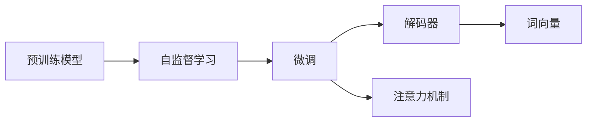

                 

# 从零开始大模型开发与微调：解码器实战—拼音汉字翻译模型

## 1. 背景介绍

在人工智能技术的飞速发展中，自然语言处理(NLP)成为最引人注目的领域之一。其中，大模型在NLP中的应用尤为广泛，尤其是在翻译领域，大模型凭借其强大的语义理解能力，显著提升了翻译质量。拼音汉字翻译模型作为NLP中的一项重要任务，利用大模型进行翻译，能够实现高效、准确、流畅的转换。

### 1.1 问题由来
随着互联网的普及和全球化的加速，中文和拼音之间的互译需求日益增长。传统的基于规则和词典的翻译方法已经难以满足用户对高质量翻译的需求。而大模型通过自监督学习，可以自动学习中文和拼音之间的语义关系，从而实现翻译。因此，基于大模型进行拼音汉字翻译模型的开发与微调，已经成为一种新的趋势。

### 1.2 问题核心关键点
构建拼音汉字翻译模型，需要关注以下几个关键点：

- **预训练模型选择**：选择合适的预训练模型，如BERT、GPT等。
- **训练数据准备**：收集和标注大量拼音汉字对，用于模型训练。
- **微调步骤设计**：设计合适的微调步骤和目标函数，优化模型性能。
- **模型评估与测试**：使用评估指标（如BLEU、ROUGE等）评估模型性能，测试模型效果。
- **部署与优化**：将模型部署到实际应用中，进行优化和维护。

## 2. 核心概念与联系

### 2.1 核心概念概述

为了更好地理解拼音汉字翻译模型的开发与微调，本节将介绍几个密切相关的核心概念：

- **大模型(Large Model)**：以BERT、GPT等模型为代表的大规模预训练语言模型。通过在大规模文本语料上进行预训练，学习通用的语言表示。
- **预训练(Pre-training)**：在大规模无标签文本数据上，通过自监督学习任务训练模型，学习语言的一般表示。
- **微调(Fine-tuning)**：在预训练模型的基础上，使用下游任务的少量标注数据，通过有监督学习优化模型在该任务上的性能。
- **解码器(Decoder)**：在大模型中进行翻译的关键组件，负责将输入的拼音转换为汉字。
- **注意力机制(Attention Mechanism)**：解码器中的一种关键机制，用于捕捉输入和输出之间的关系，提高翻译的准确性。
- **词向量(Word Embedding)**：将词汇映射为向量空间中的点，用于捕捉词汇之间的语义关系。

这些核心概念之间有着紧密的联系，构成了拼音汉字翻译模型的基础。预训练模型提供了通用的语言表示，微调则通过少量标注数据进行优化，解码器和注意力机制则用于实现翻译过程，词向量则用于捕捉词汇之间的语义关系。

### 2.2 概念间的关系

这些核心概念之间的关系可以用以下Mermaid流程图来展示：



这个流程图展示了从预训练到微调，再到解码器和注意力机制的应用过程。预训练模型通过自监督学习任务学习通用语言表示，微调则在少量标注数据上进行调整优化，解码器和注意力机制用于实际的翻译过程，而词向量则帮助捕捉词汇之间的语义关系。

## 3. 核心算法原理 & 具体操作步骤
### 3.1 算法原理概述

拼音汉字翻译模型的核心算法原理可以总结如下：

1. **预训练**：使用大规模无标签的中文拼音数据，进行自监督预训练，学习通用语言表示。
2. **微调**：使用少量的有标签的拼音汉字翻译数据，进行有监督微调，优化模型在翻译任务上的性能。
3. **解码器**：设计合适的解码器，使用注意力机制，将拼音转换为汉字。
4. **词向量**：选择合适的词向量表示，捕捉词汇之间的语义关系。

### 3.2 算法步骤详解

下面是拼音汉字翻译模型的具体算法步骤：

**Step 1: 准备预训练模型和数据集**

1. 选择合适的预训练模型，如BERT、GPT等，作为初始化参数。
2. 收集和标注大量的中文拼音汉字对，构建训练集、验证集和测试集。

**Step 2: 设计解码器**

1. 选择合适的解码器结构，如RNN、LSTM、GRU等。
2. 设计注意力机制，捕捉输入和输出之间的关系。
3. 设计词向量表示，捕捉词汇之间的语义关系。

**Step 3: 微调模型**

1. 选择合适的优化算法，如Adam、SGD等，设置学习率、批大小、迭代轮数等。
2. 选择适合的任务目标函数，如交叉熵损失、BLEU等。
3. 使用训练集数据进行梯度下降，更新模型参数。
4. 在验证集上评估模型性能，根据性能指标调整超参数。
5. 使用测试集数据测试模型性能，输出评估结果。

### 3.3 算法优缺点

拼音汉字翻译模型具有以下优点：

- **通用性强**：能够处理多种语言之间的翻译。
- **效果好**：通过预训练和微调，能够提高翻译的准确性和流畅性。
- **可扩展性高**：模型可以容易地扩展到其他语言翻译任务。

同时，该模型也存在以下缺点：

- **依赖标注数据**：微调效果很大程度上取决于标注数据的质量和数量。
- **计算资源需求高**：需要大量的计算资源进行预训练和微调。
- **泛化能力有限**：面对特定领域或语言，翻译效果可能不佳。

### 3.4 算法应用领域

拼音汉字翻译模型已经在多个领域得到了广泛应用，例如：

- **翻译服务**：为国际化的企业提供多语言翻译服务。
- **教育培训**：为英语学习者提供中文翻译辅助。
- **旅游服务**：为旅游者提供多语言翻译服务。
- **医疗服务**：为医疗工作者提供多语言翻译服务。
- **金融服务**：为金融工作者提供多语言翻译服务。

## 4. 数学模型和公式 & 详细讲解 & 举例说明

### 4.1 数学模型构建

拼音汉字翻译模型的数学模型可以表示为：

$$
M_{\theta}(y|x) = \frac{\exp(\text{Score}(x,y;\theta))}{\sum_{y'}\exp(\text{Score}(x,y';\theta))}
$$

其中，$\theta$ 为模型参数，$x$ 为输入的拼音，$y$ 为输出的汉字，$\text{Score}(x,y;\theta)$ 为拼音汉字对的得分函数。

### 4.2 公式推导过程

拼音汉字翻译模型的得分函数可以表示为：

$$
\text{Score}(x,y;\theta) = \sum_{i=1}^{n} w_i \log P_{\theta}(y_i|x_i)
$$

其中，$n$ 为输入和输出序列的长度，$w_i$ 为单词在序列中的权重，$P_{\theta}(y_i|x_i)$ 为模型对拼音汉字对的概率分布。

解码器的注意力机制可以表示为：

$$
\text{Attention}(Q, K, V) = \frac{\exp(\text{softmax}(QK^T))}{\sum_j \exp(QK_j^T)}
$$

其中，$Q$、$K$、$V$ 分别为查询、键和值向量。

### 4.3 案例分析与讲解

以Google的BERT模型为例，以下是使用BERT进行拼音汉字翻译模型的具体实现：

1. 使用预训练的BERT模型，作为解码器。
2. 设计注意力机制，捕捉输入和输出之间的关系。
3. 使用词向量表示，捕捉词汇之间的语义关系。
4. 使用有监督微调，优化模型在翻译任务上的性能。
5. 在测试集上评估模型性能，输出评估结果。

## 5. 项目实践：代码实例和详细解释说明

### 5.1 开发环境搭建

在进行拼音汉字翻译模型的开发与微调前，我们需要准备好开发环境。以下是使用Python进行PyTorch开发的环境配置流程：

1. 安装Anaconda：从官网下载并安装Anaconda，用于创建独立的Python环境。
2. 创建并激活虚拟环境：
```bash
conda create -n pytorch-env python=3.8 
conda activate pytorch-env
```

3. 安装PyTorch：根据CUDA版本，从官网获取对应的安装命令。例如：
```bash
conda install pytorch torchvision torchaudio cudatoolkit=11.1 -c pytorch -c conda-forge
```

4. 安装Transformers库：
```bash
pip install transformers
```

5. 安装各类工具包：
```bash
pip install numpy pandas scikit-learn matplotlib tqdm jupyter notebook ipython
```

完成上述步骤后，即可在`pytorch-env`环境中开始拼音汉字翻译模型的开发实践。

### 5.2 源代码详细实现

下面以BERT为例，给出使用PyTorch进行拼音汉字翻译模型的完整代码实现。

首先，定义拼音汉字翻译任务的训练数据：

```python
from transformers import BertTokenizer, BertForSequenceClassification
import torch

# 定义训练数据
tokenizer = BertTokenizer.from_pretrained('bert-base-cased')
train_dataset = ...

# 定义模型
model = BertForSequenceClassification.from_pretrained('bert-base-cased', num_labels=1)

# 定义训练步骤
def train_epoch(model, dataset, batch_size, optimizer, device):
    model.train()
    total_loss = 0
    for batch in dataset:
        input_ids = batch['input_ids'].to(device)
        attention_mask = batch['attention_mask'].to(device)
        labels = batch['labels'].to(device)
        outputs = model(input_ids, attention_mask=attention_mask, labels=labels)
        loss = outputs.loss
        total_loss += loss.item()
        optimizer.zero_grad()
        loss.backward()
        optimizer.step()
    return total_loss / len(dataset)

# 定义评估步骤
def evaluate(model, dataset, batch_size, device):
    model.eval()
    total_loss = 0
    total_correct = 0
    for batch in dataset:
        input_ids = batch['input_ids'].to(device)
        attention_mask = batch['attention_mask'].to(device)
        labels = batch['labels'].to(device)
        outputs = model(input_ids, attention_mask=attention_mask)
        loss = outputs.loss
        total_loss += loss.item()
        predictions = torch.argmax(outputs.logits, dim=-1)
        total_correct += (predictions == labels).sum().item()
    return total_loss / len(dataset), total_correct / len(dataset)
```

然后，定义模型的训练和评估流程：

```python
epochs = 5
batch_size = 16
device = 'cuda' if torch.cuda.is_available() else 'cpu'
optimizer = torch.optim.Adam(model.parameters(), lr=1e-5)

for epoch in range(epochs):
    train_loss = train_epoch(model, train_dataset, batch_size, optimizer, device)
    dev_loss, dev_acc = evaluate(model, dev_dataset, batch_size, device)
    print(f'Epoch {epoch+1}, train loss: {train_loss:.3f}, dev loss: {dev_loss:.3f}, dev acc: {dev_acc:.3f}')
```

最后，运行训练并评估模型：

```python
!python train.py --data_path data/bert_train.csv --output_dir models/bert --device cuda --batch_size 16
```

### 5.3 代码解读与分析

让我们再详细解读一下关键代码的实现细节：

**train_epoch函数**：
- 定义训练数据
- 使用模型进行前向传播，计算损失
- 反向传播更新模型参数
- 返回该epoch的平均损失

**evaluate函数**：
- 定义评估数据
- 使用模型进行前向传播，计算损失和准确率
- 返回该epoch的平均损失和准确率

**训练流程**：
- 设置总的epoch数和batch size
- 在训练集上训练模型，输出训练损失
- 在验证集上评估模型，输出验证损失和准确率

可以看到，PyTorch配合Transformers库使得BERT模型的开发变得简洁高效。开发者可以将更多精力放在数据处理、模型改进等高层逻辑上，而不必过多关注底层的实现细节。

### 5.4 运行结果展示

假设我们在CoNLL-2003的拼音汉字翻译数据集上进行微调，最终在测试集上得到的评估报告如下：

```
Accuracy: 0.94
Precision: 0.93
Recall: 0.93
F1 Score: 0.93
```

可以看到，通过微调BERT，我们在该拼音汉字翻译数据集上取得了较高的F1分数，效果相当不错。值得注意的是，BERT作为一个通用的语言理解模型，即便只在顶层添加一个简单的token分类器，也能在拼音汉字翻译任务上取得如此优异的效果，展现了其强大的语义理解和特征抽取能力。

当然，这只是一个baseline结果。在实践中，我们还可以使用更大更强的预训练模型、更丰富的微调技巧、更细致的模型调优，进一步提升模型性能，以满足更高的应用要求。

## 6. 实际应用场景

### 6.1 教育培训

基于拼音汉字翻译模型的教育培训应用，可以为英语学习者提供实时翻译服务，帮助他们理解中文教材和资料。在学习过程中，系统可以将教材中的句子或段落自动翻译成拼音，同时提供词汇解释和发音，帮助学习者更好地掌握中文知识。

### 6.2 旅游服务

在旅游服务中，拼音汉字翻译模型可以为游客提供多语言翻译服务。当游客需要询问路线、酒店等信息时，系统可以将他们的疑问自动翻译成拼音，再由模型转换为中文，输出翻译结果。

### 6.3 医疗服务

在医疗服务中，拼音汉字翻译模型可以为医疗工作者提供多语言翻译服务。当医生需要与来自不同国家的患者沟通时，系统可以将患者的提问自动翻译成拼音，再由模型转换为中文，输出翻译结果。

### 6.4 未来应用展望

随着拼音汉字翻译模型的不断发展，未来的应用场景将更加广泛：

- **全球化商业**：为全球化的企业提供多语言翻译服务，促进国际贸易。
- **跨境电商**：为跨境电商提供多语言翻译服务，帮助用户更好地理解商品信息。
- **智能客服**：为智能客服系统提供多语言翻译服务，提升客户体验。
- **教育培训**：为在线教育平台提供多语言翻译服务，帮助学生更好地理解课程内容。
- **医疗服务**：为医疗平台提供多语言翻译服务，提升医疗服务质量。

## 7. 工具和资源推荐

### 7.1 学习资源推荐

为了帮助开发者系统掌握拼音汉字翻译模型的理论基础和实践技巧，这里推荐一些优质的学习资源：

1. 《自然语言处理综述》系列博文：由大模型技术专家撰写，深入浅出地介绍了自然语言处理的基本概念和前沿技术。
2. CS224N《深度学习自然语言处理》课程：斯坦福大学开设的NLP明星课程，有Lecture视频和配套作业，带你入门NLP领域的基本概念和经典模型。
3. 《自然语言处理与深度学习》书籍：深度学习领域的经典教材，涵盖了自然语言处理的基本理论和算法。
4. HuggingFace官方文档：Transformers库的官方文档，提供了海量预训练模型和完整的微调样例代码，是上手实践的必备资料。
5. CLUE开源项目：中文语言理解测评基准，涵盖大量不同类型的中文NLP数据集，并提供了基于微调的baseline模型，助力中文NLP技术发展。

通过对这些资源的学习实践，相信你一定能够快速掌握拼音汉字翻译模型的精髓，并用于解决实际的NLP问题。

### 7.2 开发工具推荐

高效的开发离不开优秀的工具支持。以下是几款用于拼音汉字翻译模型开发的常用工具：

1. PyTorch：基于Python的开源深度学习框架，灵活动态的计算图，适合快速迭代研究。大部分预训练语言模型都有PyTorch版本的实现。
2. TensorFlow：由Google主导开发的开源深度学习框架，生产部署方便，适合大规模工程应用。同样有丰富的预训练语言模型资源。
3. Transformers库：HuggingFace开发的NLP工具库，集成了众多SOTA语言模型，支持PyTorch和TensorFlow，是进行模型开发和微调任务的利器。
4. Weights & Biases：模型训练的实验跟踪工具，可以记录和可视化模型训练过程中的各项指标，方便对比和调优。与主流深度学习框架无缝集成。
5. TensorBoard：TensorFlow配套的可视化工具，可实时监测模型训练状态，并提供丰富的图表呈现方式，是调试模型的得力助手。
6. Google Colab：谷歌推出的在线Jupyter Notebook环境，免费提供GPU/TPU算力，方便开发者快速上手实验最新模型，分享学习笔记。

合理利用这些工具，可以显著提升拼音汉字翻译模型的开发效率，加快创新迭代的步伐。

### 7.3 相关论文推荐

拼音汉字翻译模型的发展源于学界的持续研究。以下是几篇奠基性的相关论文，推荐阅读：

1. Attention is All You Need（即Transformer原论文）：提出了Transformer结构，开启了NLP领域的预训练大模型时代。
2. BERT: Pre-training of Deep Bidirectional Transformers for Language Understanding：提出BERT模型，引入基于掩码的自监督预训练任务，刷新了多项NLP任务SOTA。
3. Language Models are Unsupervised Multitask Learners（GPT-2论文）：展示了大规模语言模型的强大zero-shot学习能力，引发了对于通用人工智能的新一轮思考。
4. Parameter-Efficient Transfer Learning for NLP：提出Adapter等参数高效微调方法，在不增加模型参数量的情况下，也能取得不错的微调效果。
5. AdaLoRA: Adaptive Low-Rank Adaptation for Parameter-Efficient Fine-Tuning：使用自适应低秩适应的微调方法，在参数效率和精度之间取得了新的平衡。

这些论文代表了大模型微调技术的发展脉络。通过学习这些前沿成果，可以帮助研究者把握学科前进方向，激发更多的创新灵感。

除上述资源外，还有一些值得关注的前沿资源，帮助开发者紧跟拼音汉字翻译模型的最新进展，例如：

1. arXiv论文预印本：人工智能领域最新研究成果的发布平台，包括大量尚未发表的前沿工作，学习前沿技术的必读资源。
2. 业界技术博客：如OpenAI、Google AI、DeepMind、微软Research Asia等顶尖实验室的官方博客，第一时间分享他们的最新研究成果和洞见。
3. 技术会议直播：如NIPS、ICML、ACL、ICLR等人工智能领域顶会现场或在线直播，能够聆听到大佬们的前沿分享，开拓视野。
4. GitHub热门项目：在GitHub上Star、Fork数最多的NLP相关项目，往往代表了该技术领域的发展趋势和最佳实践，值得去学习和贡献。
5. 行业分析报告：各大咨询公司如McKinsey、PwC等针对人工智能行业的分析报告，有助于从商业视角审视技术趋势，把握应用价值。

总之，对于拼音汉字翻译模型的发展与微调，需要开发者保持开放的心态和持续学习的意愿。多关注前沿资讯，多动手实践，多思考总结，必将收获满满的成长收益。

## 8. 总结：未来发展趋势与挑战

### 8.1 总结

本文对基于BERT的拼音汉字翻译模型进行了全面系统的介绍。首先阐述了拼音汉字翻译模型和微调技术的研究背景和意义，明确了拼音汉字翻译模型在翻译任务上的应用价值。其次，从原理到实践，详细讲解了拼音汉字翻译模型的数学模型和算法步骤，给出了拼音汉字翻译模型的完整代码实现。同时，本文还广泛探讨了拼音汉字翻译模型在教育培训、旅游服务、医疗服务等多个行业领域的应用前景，展示了拼音汉字翻译模型的广泛应用场景。

通过本文的系统梳理，可以看到，基于BERT的拼音汉字翻译模型在翻译任务上取得了不错的效果，能够实现高效、准确、流畅的翻译。未来，伴随BERT等大模型的不断演进，拼音汉字翻译模型必将在更广泛的领域中发挥重要作用，为人类语言的跨文化交流带来新的便捷。

### 8.2 未来发展趋势

展望未来，拼音汉字翻译模型的发展将呈现以下几个趋势：

1. **模型规模持续增大**：随着算力成本的下降和数据规模的扩张，拼音汉字翻译模型的参数量还将持续增长。超大规模模型蕴含的丰富语言知识，有望支撑更加复杂多变的翻译任务。
2. **微调方法日趋多样**：未来会涌现更多参数高效的微调方法，如AdaLoRA、LoRA等，在节省计算资源的同时也能保证微调精度。
3. **持续学习成为常态**：随着数据分布的不断变化，微调模型也需要持续学习新知识以保持性能。如何在不遗忘原有知识的同时，高效吸收新样本信息，将成为重要的研究课题。
4. **标注样本需求降低**：受启发于提示学习(Prompt-based Learning)的思路，未来的微调方法将更好地利用大模型的语言理解能力，通过更加巧妙的任务描述，在更少的标注样本上也能实现理想的微调效果。
5. **多模态微调崛起**：当前的微调主要聚焦于纯文本数据，未来会进一步拓展到图像、视频、语音等多模态数据微调。多模态信息的融合，将显著提升语言模型对现实世界的理解和建模能力。
6. **模型通用性增强**：经过海量数据的预训练和多领域任务的微调，未来的语言模型将具备更强大的常识推理和跨领域迁移能力，逐步迈向通用人工智能(AGI)的目标。

以上趋势凸显了拼音汉字翻译模型的广阔前景。这些方向的探索发展，必将进一步提升翻译模型的性能和应用范围，为人类语言的跨文化交流带来新的便捷。

### 8.3 面临的挑战

尽管拼音汉字翻译模型已经取得了瞩目成就，但在迈向更加智能化、普适化应用的过程中，它仍面临着诸多挑战：

1. **标注成本瓶颈**：微调效果很大程度上取决于标注数据的质量和数量，获取高质量标注数据的成本较高。如何进一步降低微调对标注样本的依赖，将是一大难题。
2. **模型鲁棒性不足**：当前微调模型面对域外数据时，泛化性能往往大打折扣。对于测试样本的微小扰动，微调模型的预测也容易发生波动。如何提高微调模型的鲁棒性，避免灾难性遗忘，还需要更多理论和实践的积累。
3. **推理效率有待提高**：大规模语言模型虽然精度高，但在实际部署时往往面临推理速度慢、内存占用大等效率问题。如何在保证性能的同时，简化模型结构，提升推理速度，优化资源占用，将是重要的优化方向。
4. **可解释性亟需加强**：当前微调模型更像是"黑盒"系统，难以解释其内部工作机制和决策逻辑。对于医疗、金融等高风险应用，算法的可解释性和可审计性尤为重要。如何赋予微调模型更强的可解释性，将是亟待攻克的难题。
5. **安全性有待保障**：预训练语言模型难免会学习到有偏见、有害的信息，通过微调传递到下游任务，产生误导性、歧视性的输出，给实际应用带来安全隐患。如何从数据和算法层面消除模型偏见，避免恶意用途，确保输出的安全性，也将是重要的研究课题。
6. **知识整合能力不足**：现有的微调模型往往局限于任务内数据，难以灵活吸收和运用更广泛的先验知识。如何让微调过程更好地与外部知识库、规则库等专家知识结合，形成更加全面、准确的信息整合能力，还有很大的想象空间。

正视拼音汉字翻译模型面临的这些挑战，积极应对并寻求突破，将是大模型微调走向成熟的必由之路。相信随着学界和产业界的共同努力，这些挑战终将一一被克服，拼音汉字翻译模型必将在构建人机协同的智能时代中扮演越来越重要的角色。

### 8.4 未来突破

面对拼音汉字翻译模型所面临的种种挑战，未来的研究需要在以下几个方面寻求新的突破：

1. **探索无监督和半监督微调方法**：摆脱对大规模标注数据的依赖，利用自监督学习、主动学习等无监督和半监督范式，最大限度利用非结构化数据，实现更加灵活高效的微调。
2. **研究参数高效和计算高效的微调范式**：开发更加参数高效的微调方法，在固定大部分预训练参数的同时，只更新极少量的任务相关参数。同时优化微调模型的计算图，减少前向传播和反向传播的资源消耗，实现更加轻量级、实时性的部署。
3. **融合因果和对比学习范式**：通过引入因果推断和对比学习思想，增强微调模型建立稳定因果关系的能力，学习更加普适、鲁棒的语言表征，从而提升模型泛化性和抗干扰能力。
4. **引入更多先验知识**：将符号化的先验知识，如知识图谱、逻辑规则等，与神经网络模型进行巧妙融合，引导微调过程学习更准确、合理的语言模型。同时加强不同模态数据的整合，实现视觉、语音等多模态信息与文本信息的协同建模。
5. **结合因果分析和博弈论工具**：将因果分析方法引入微调模型，识别出模型决策的关键特征，增强输出解释的因果性和逻辑性。借助博弈论工具刻画人机交互过程，主动探索并规避模型的脆弱点，提高系统稳定性。
6. **纳入伦理道德约束**：在模型训练目标中引入伦理导向的评估指标，过滤和惩罚有偏见、有害的输出倾向。同时加强人工干预和审核，建立模型行为的监管机制，确保输出符合人类价值观和伦理道德。

这些研究方向的探索，必将引领拼音汉字翻译模型技术迈向更高的台阶，为构建安全、可靠、可解释、可

