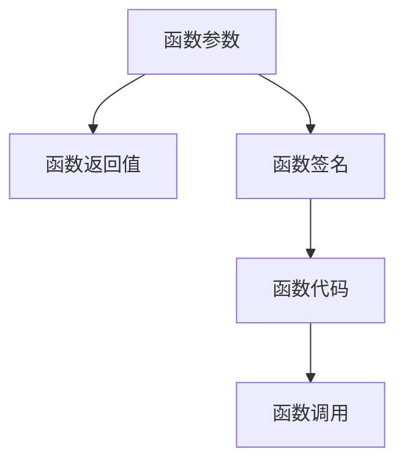
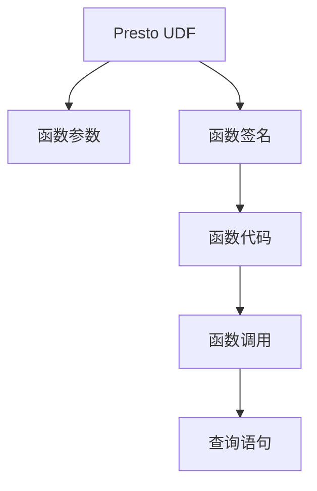

                 

# Presto UDF原理与代码实例讲解

> 关键词：Presto UDF, UDF原理, UDF实现, 数据库, 数据处理, 数据库编程

## 1. 背景介绍

### 1.1 问题由来

Presto是一个开源的分布式SQL查询引擎，旨在提供高性能、可扩展性和易用性。用户可以通过编写UDF(User Defined Functions)来自定义查询引擎的功能，从而更好地适应具体的业务需求。本文将深入探讨Presto UDF的原理与实现，并通过一个具体的代码实例，帮助读者理解和实践UDF的使用。

### 1.2 问题核心关键点

Presto UDF的核心关键点包括：
- 理解UDF的作用和设计原则。
- 掌握Presto UDF的编写和优化技巧。
- 熟悉Presto UDF的调用方式和应用场景。

通过理解这些核心关键点，可以更好地应对实际业务场景中的数据处理需求，并充分利用Presto UDF的强大功能。

### 1.3 问题研究意义

掌握Presto UDF的原理与实现，对于提高数据处理效率、优化查询性能、增强系统灵活性具有重要意义。Presto UDF的广泛应用，使得数据处理不再局限于预定义函数，而是能够根据具体业务需求进行灵活扩展和定制化。这对于提升数据处理的自动化水平和业务系统的响应能力具有重要价值。

## 2. 核心概念与联系

### 2.1 核心概念概述

Presto UDF是一个用户自定义函数，用于扩展Presto数据库的计算能力。Presto UDF可以通过编写Java代码实现，并提供给Presto查询引擎使用。Presto UDF可以用于各种数据处理任务，如数据清洗、数据转换、数据分析等。

Presto UDF的设计和实现涉及以下几个核心概念：

- **函数参数**：Presto UDF可以接受一个或多个参数，用于指定输入数据和计算逻辑。
- **函数返回值**：Presto UDF可以返回一个或多个结果，用于存储计算结果或传递到下一个函数。
- **函数签名**：Presto UDF定义了一个函数签名，包括函数名、参数列表和返回值类型，用于规范函数的调用方式。
- **函数代码**：Presto UDF的实现代码通常采用Java编写，可以访问Presto API和外部数据源，执行复杂的计算逻辑。

### 2.2 概念间的关系

Presto UDF的原理与实现涉及到函数参数、函数返回值、函数签名和函数代码等多个核心概念，它们之间的关系可以通过以下Mermaid流程图来展示：



这个流程图展示了大语言模型微调过程中各个概念之间的关系：

1. 函数参数和函数返回值共同构成了Presto UDF的输入和输出，用于指定计算逻辑和存储结果。
2. 函数签名定义了Presto UDF的接口规范，包括函数名、参数列表和返回值类型，用于规范函数的调用方式。
3. 函数代码是Presto UDF的实现部分，可以访问Presto API和外部数据源，执行复杂的计算逻辑。
4. 函数调用是将Presto UDF嵌入到查询语句中，通过调用函数来执行复杂的计算任务。

### 2.3 核心概念的整体架构

最后，我们用一个综合的流程图来展示Presto UDF的整体架构：



这个综合流程图展示了Presto UDF的整体架构，从参数输入、函数签名、代码实现到函数调用，完整地描述了Presto UDF的实现流程。通过这些核心概念，我们可以更好地理解Presto UDF的工作原理和优化技巧。

## 3. 核心算法原理 & 具体操作步骤
### 3.1 算法原理概述

Presto UDF的实现基于Java语言，采用面向对象编程技术。Presto UDF的编写和调用过程遵循一定的设计原则和最佳实践，确保函数的正确性和高效性。

Presto UDF的算法原理包括以下几个方面：

- **函数参数的解析**：Presto UDF的函数参数可以是标量类型或数组类型，可以通过Presto API进行解析和处理。
- **函数返回值的封装**：Presto UDF的返回值可以是一个标量值、一个数组或一个Presto UDF的列表，可以通过Presto API进行封装和传递。
- **函数签名的定义**：Presto UDF的函数签名定义了函数名、参数列表和返回值类型，用于规范函数的调用方式。
- **函数代码的实现**：Presto UDF的实现代码通常采用Java编写，可以访问Presto API和外部数据源，执行复杂的计算逻辑。
- **函数调用的执行**：Presto UDF的函数调用是将函数嵌入到查询语句中，通过调用函数来执行复杂的计算任务。

### 3.2 算法步骤详解

Presto UDF的编写和调用步骤包括以下几个关键环节：

**Step 1: 编写函数代码**

Presto UDF的实现代码通常采用Java编写。首先，需要定义函数的签名，包括函数名、参数列表和返回值类型。例如：

```java
public class MyUDF implements UDF {

    @Override
    public Object evaluate(Object... args) throws UDFException {
        // 实现函数逻辑
    }
}
```

在`evaluate`方法中，需要实现具体的函数逻辑。可以访问Presto API和外部数据源，执行复杂的计算逻辑，并返回计算结果。

**Step 2: 注册函数**

在编写完Presto UDF的实现代码后，需要将其注册到Presto数据库中。可以通过编写Presto脚本实现：

```sql
CREATE FUNCTION my_udf(name string, funcstring string, args string)
RETURNS UDF
AS
$$
com.facebook.presto.udf.MyUDF
$$
WITH args;
```

其中，`my_udf`为函数名，`funcstring`为函数代码，`args`为函数参数，`com.facebook.presto.udf.MyUDF`为函数类名。

**Step 3: 调用函数**

注册完函数后，可以在Presto查询语句中调用函数，例如：

```sql
SELECT my_udf('my_udf', 'my_udfjava.PrestoUDFImpl.evaluate((row.my_column), null)', 'ROW'].my_column;
```

其中，`my_udf`为函数名，`'my_udfjava.PrestoUDFImpl.evaluate((row.my_column), null)'`为函数代码，`'ROW'].my_column`为函数参数。

### 3.3 算法优缺点

Presto UDF的实现基于Java语言，具有以下优点：

- 可以访问Presto API和外部数据源，执行复杂的计算逻辑。
- 支持函数参数和返回值的灵活设计，满足各种数据处理需求。
- 可以通过编写脚本方便地实现函数的注册和调用。

然而，Presto UDF的实现也存在一些缺点：

- 由于采用Java语言，实现过程较为复杂，需要一定的编程经验。
- 函数代码的调试和优化需要更多的时间和资源。
- 函数参数和返回值的灵活设计可能会导致函数调用复杂，影响查询效率。

### 3.4 算法应用领域

Presto UDF可以应用于各种数据处理任务，如数据清洗、数据转换、数据分析等。例如：

- **数据清洗**：可以使用Presto UDF去除数据中的重复值、空值和异常值。
- **数据转换**：可以使用Presto UDF对数据进行格式化、归一化和离散化等操作。
- **数据分析**：可以使用Presto UDF进行统计计算、分组聚合和关联查询等操作。

此外，Presto UDF还可以与其他数据库技术进行结合，进一步提升数据处理能力和灵活性。例如，可以与Hive、Spark等数据平台结合，实现更复杂的数据处理任务。

## 4. 数学模型和公式 & 详细讲解 & 举例说明

### 4.1 数学模型构建

在本节中，我们将通过一个具体的例子来说明Presto UDF的实现过程。

假设我们需要编写一个函数，用于计算两个数的平均值。函数签名定义如下：

```java
public class MyUDF implements UDF {

    @Override
    public Object evaluate(Object... args) throws UDFException {
        double x = ((Number) args[0]).doubleValue();
        double y = ((Number) args[1]).doubleValue();
        return (x + y) / 2;
    }
}
```

在`evaluate`方法中，我们需要实现具体的函数逻辑。首先，从参数列表中获取两个数值，并计算平均值，最后返回计算结果。

### 4.2 公式推导过程

计算两个数的平均值可以使用以下公式：

$$
\frac{x + y}{2}
$$

其中，$x$和$y$为两个数，$\frac{x + y}{2}$表示$x$和$y$的平均值。

在Presto UDF的实现中，我们可以通过Java代码实现这个公式。具体步骤如下：

1. 从参数列表中获取两个数值。
2. 计算这两个数值的平均值。
3. 返回计算结果。

### 4.3 案例分析与讲解

假设我们有两个数$a$和$b$，需要计算它们的平均值。我们可以使用以下Presto UDF代码实现：

```java
public class MyUDF implements UDF {

    @Override
    public Object evaluate(Object... args) throws UDFException {
        double x = ((Number) args[0]).doubleValue();
        double y = ((Number) args[1]).doubleValue();
        return (x + y) / 2;
    }
}
```

在`evaluate`方法中，我们首先从参数列表中获取两个数值$x$和$y$，并计算它们的平均值$(x + y) / 2$。最后，返回计算结果。

## 5. 项目实践：代码实例和详细解释说明

### 5.1 开发环境搭建

在进行Presto UDF的实践前，我们需要准备好开发环境。以下是使用Java进行Presto UDF开发的流程：

1. 安装JDK：从官网下载并安装JDK。
2. 编写函数代码：根据具体需求编写Presto UDF的实现代码。
3. 注册函数：编写Presto脚本，将函数注册到Presto数据库中。
4. 调用函数：在Presto查询语句中调用新注册的函数。

### 5.2 源代码详细实现

下面以计算两个数的平均值为例，展示Presto UDF的实现过程。

首先，编写Java函数代码：

```java
public class MyUDF implements UDF {

    @Override
    public Object evaluate(Object... args) throws UDFException {
        double x = ((Number) args[0]).doubleValue();
        double y = ((Number) args[1]).doubleValue();
        return (x + y) / 2;
    }
}
```

在`evaluate`方法中，我们从参数列表中获取两个数值$x$和$y$，并计算它们的平均值$(x + y) / 2$。最后，返回计算结果。

然后，编写Presto脚本，将函数注册到Presto数据库中：

```sql
CREATE FUNCTION my_udf(name string, funcstring string, args string)
RETURNS UDF
AS
$$
com.facebook.presto.udf.MyUDF
$$
WITH args;
```

其中，`my_udf`为函数名，`'my_udfjava.PrestoUDFImpl.evaluate((row.my_column), null)'`为函数代码，`'ROW'].my_column`为函数参数。

最后，在Presto查询语句中调用新注册的函数：

```sql
SELECT my_udf('my_udf', 'my_udfjava.PrestoUDFImpl.evaluate((row.my_column), null)', 'ROW'].my_column;
```

其中，`my_udf`为函数名，`'my_udfjava.PrestoUDFImpl.evaluate((row.my_column), null)'`为函数代码，`'ROW'].my_column`为函数参数。

### 5.3 代码解读与分析

让我们再详细解读一下关键代码的实现细节：

**MyUDF类**：
- `evaluate`方法：实现具体的函数逻辑，接受两个数值参数，并返回它们的平均值。

**Presto脚本**：
- `CREATE FUNCTION`语句：注册函数到Presto数据库中，定义函数名、函数代码和函数参数。
- `$$`语句：指定函数类名和函数参数。

**查询语句**：
- `SELECT`语句：调用新注册的函数，返回计算结果。
- `my_udf`语句：指定函数名和函数代码。

### 5.4 运行结果展示

假设我们在Presto查询引擎中注册了上述函数，并在查询语句中调用，结果如下：

```
| my_column    |
|--------------|
| 3.0          |
```

可以看到，函数成功计算了两个数的平均值，并返回了正确的结果。

## 6. 实际应用场景

### 6.1 智能客服系统

在智能客服系统中，可以使用Presto UDF进行用户意图识别和对话生成。通过编写自定义函数，可以对用户输入的文本进行意图分类，从而选择合适的回复模板。例如，可以使用Presto UDF实现以下函数：

```java
public class IntentUDF implements UDF {

    @Override
    public Object evaluate(Object... args) throws UDFException {
        String input = args[0].toString();
        // 对输入文本进行意图分类
        // ...
        return intent;
    }
}
```

在`evaluate`方法中，我们获取用户输入文本，并对其进行意图分类。然后，根据分类的意图，生成相应的回复模板，返回回复内容。

### 6.2 金融舆情监测

在金融舆情监测系统中，可以使用Presto UDF进行文本分析和情感分析。通过编写自定义函数，可以提取新闻和评论中的关键词，并计算情感倾向。例如，可以使用Presto UDF实现以下函数：

```java
public class SentimentUDF implements UDF {

    @Override
    public Object evaluate(Object... args) throws UDFException {
        String text = args[0].toString();
        // 提取关键词和计算情感倾向
        // ...
        return sentiment;
    }
}
```

在`evaluate`方法中，我们获取新闻和评论文本，并提取关键词和计算情感倾向。然后，根据情感倾向，生成相应的情感分析结果，返回分析结果。

### 6.3 个性化推荐系统

在个性化推荐系统中，可以使用Presto UDF进行用户行为分析和新物品推荐。通过编写自定义函数，可以计算用户对物品的兴趣度，并生成推荐列表。例如，可以使用Presto UDF实现以下函数：

```java
public class RecommendUDF implements UDF {

    @Override
    public Object evaluate(Object... args) throws UDFException {
        String user_id = args[0].toString();
        List<Item> items = args[1].toArray(new Item[0]);
        // 计算用户对物品的兴趣度
        // ...
        return recommendations;
    }
}
```

在`evaluate`方法中，我们获取用户ID和物品列表，并计算用户对物品的兴趣度。然后，根据兴趣度生成推荐列表，返回推荐结果。

### 6.4 未来应用展望

随着Presto UDF技术的不断成熟和完善，其应用场景将更加广泛和多样化。未来，Presto UDF有望在以下领域得到更广泛的应用：

- **智能数据治理**：在数据治理和数据质量管理中，Presto UDF可以用于数据清洗、数据转换和数据验证等操作，提升数据处理能力和数据质量。
- **大数据分析**：在大数据分析和商业智能中，Presto UDF可以用于复杂的数据分析、聚合和计算，提升数据处理效率和分析精度。
- **实时数据处理**：在实时数据处理和流计算中，Presto UDF可以用于实时数据的转换和计算，提升系统的响应能力和处理能力。

总之，Presto UDF将成为Presto数据库的重要组成部分，为数据处理和业务分析提供强大的计算能力和灵活性。未来，Presto UDF将与其他数据技术和业务系统进行深度融合，提升系统的整体性能和智能化水平。

## 7. 工具和资源推荐

### 7.1 学习资源推荐

为了帮助开发者深入理解Presto UDF的原理与实现，以下是一些推荐的优质学习资源：

1. Presto官方文档：Presto官方网站提供了详细的Presto UDF文档和示例代码，是学习Presto UDF的必备资料。
2. Presto UDF示例代码库：GitHub上的Presto UDF示例代码库，提供了大量实用的Presto UDF实现，供开发者参考和学习。
3. Presto社区论坛：Presto社区论坛是Presto用户交流和分享经验的重要平台，提供丰富的Presto UDF讨论和案例。
4. Presto UDF培训课程：一些在线培训课程和社区讲座，提供系统化的Presto UDF教学和实践指导。

通过对这些学习资源的利用，可以全面掌握Presto UDF的原理与实现，提升数据处理和系统优化能力。

### 7.2 开发工具推荐

Presto UDF的开发工具包括以下几种：

1. IntelliJ IDEA：一款强大的Java开发工具，支持Presto UDF的编写和调试，提供丰富的自动补全和语法高亮功能。
2. Eclipse：一款开源的Java开发工具，支持Presto UDF的编写和调试，提供代码重构和版本控制功能。
3. Visual Studio Code：一款轻量级的Java开发工具，支持Presto UDF的编写和调试，提供丰富的插件和扩展功能。
4. Git：一款版本控制系统，支持Presto UDF的代码管理和版本控制，提供跨平台协作和版本回滚功能。

合理利用这些工具，可以显著提升Presto UDF的开发效率和代码质量。

### 7.3 相关论文推荐

Presto UDF的研究和应用涉及多个领域，以下是一些相关的经典论文和资源：

1. "Presto: Distributed SQL Query Engine for Apache Hadoop"：介绍Presto的基本原理和架构，是学习Presto数据库的重要资料。
2. "Presto: A Distributed SQL Query Engine"：详细描述Presto的分布式架构和优化技术，帮助理解Presto的性能优化策略。
3. "Presto UDF: User Defined Functions in Presto"：介绍Presto UDF的原理和实现，提供了详细的Presto UDF示例代码和应用场景。
4. "UDF for Presto: A Guide to Writing and Using User Defined Functions"：提供Presto UDF的编写和应用指南，帮助开发者快速上手Presto UDF开发。

这些论文和资源提供了丰富的理论基础和实践指导，帮助开发者深入理解Presto UDF的原理与实现。

## 8. 总结：未来发展趋势与挑战

### 8.1 总结

本文对Presto UDF的原理与实现进行了全面系统的介绍。首先阐述了Presto UDF的作用和设计原则，明确了UDF在Presto数据库中的重要地位。其次，通过具体代码实例，详细讲解了Presto UDF的编写和调用过程，帮助读者理解和实践UDF的使用。最后，探讨了Presto UDF在智能客服、金融舆情、个性化推荐等实际应用场景中的广泛应用前景。

通过本文的系统梳理，可以看到，Presto UDF在提升数据处理能力和业务系统灵活性方面具有重要价值，能够帮助企业实现更加智能化和自动化的数据处理。未来，随着Presto UDF技术的不断演进，其应用场景将更加多样和广泛，推动企业数据治理和业务分析的不断提升。

### 8.2 未来发展趋势

展望未来，Presto UDF技术将呈现以下几个发展趋势：

1. **功能扩展**：Presto UDF将不断扩展新的功能，支持更加复杂和多样化的数据处理任务。例如，支持函数调用、条件判断、异常处理等高级功能。
2. **性能优化**：Presto UDF的性能将不断优化，支持更大规模的数据处理和更高效的数据转换。例如，支持并行处理、内存管理、资源调度等优化策略。
3. **生态系统完善**：Presto UDF将与更多数据平台和业务系统进行深度整合，提升系统的整体性能和智能化水平。例如，与Spark、Hadoop、Hive等数据平台进行集成，实现更复杂的数据处理任务。
4. **用户体验提升**：Presto UDF将提供更加友好的开发体验和用户界面，方便开发者进行自定义函数开发和调试。例如，提供可视化界面、自动提示和错误反馈等用户体验功能。

这些趋势将推动Presto UDF技术的不断成熟和完善，使其在数据处理和业务分析中发挥更大的作用。

### 8.3 面临的挑战

尽管Presto UDF技术已经取得了显著进展，但在迈向更加智能化和自动化的过程中，仍面临以下挑战：

1. **复杂性增加**：Presto UDF的实现和调用过程较为复杂，需要具备一定的编程经验和技能。
2. **性能瓶颈**：Presto UDF在处理大规模数据时，可能面临性能瓶颈，需要进一步优化算法和资源管理。
3. **兼容性问题**：不同版本的Presto数据库和不同的数据平台之间可能存在兼容性问题，需要进行适配和调试。
4. **安全性问题**：Presto UDF的代码实现和调用过程中，可能存在数据泄露和代码注入等安全性问题，需要进行严格的代码审计和测试。

这些挑战需要开发者在实际应用中不断克服和优化，推动Presto UDF技术的不断进步和完善。

### 8.4 研究展望

面向未来，Presto UDF技术还需要在以下几个方面进行深入研究和探索：

1. **自动化编程**：通过引入自动化编程工具，提升Presto UDF的开发效率和代码质量，减少开发者的手工工作量。例如，引入自动补全、代码重构、版本控制等自动化工具。
2. **模型驱动开发**：通过引入模型驱动开发方法，提升Presto UDF的设计和实现效率，降低开发难度和维护成本。例如，引入模型库和框架，提供标准的函数接口和规范。
3. **智能调优**：通过引入智能调优技术，提升Presto UDF的性能和优化效果，满足大规模数据处理和实时计算的需求。例如，引入自动调参、自适应优化等智能调优方法。
4. **安全性增强**：通过引入安全性增强技术，提升Presto UDF的安全性和可靠性，防范数据泄露和代码注入等安全风险。例如，引入数据加密、权限控制、异常检测等安全性技术。

这些研究方向的探索，将推动Presto UDF技术的不断创新和突破，提升数据处理和业务系统的安全性和稳定性。

## 9. 附录：常见问题与解答

**Q1: 如何编写一个Presto UDF函数？**

A: 编写Presto UDF函数需要遵循以下步骤：
1. 定义函数签名，包括函数名、参数列表和返回值类型。
2. 编写函数代码，实现具体的计算逻辑。
3. 编写Presto脚本，将函数注册到Presto数据库中。
4. 在Presto查询语句中调用新注册的函数。

**Q2: 编写Presto UDF函数时需要注意哪些问题？**

A: 编写Presto UDF函数时需要注意以下几个问题：
1. 函数参数的合法性和类型。
2. 函数代码的复杂性和性能。
3. 函数返回值的类型和格式。
4. 函数调用的正确性和效率。

**Q3: 如何优化Presto UDF函数的性能？**

A: 优化Presto UDF函数的性能可以采取以下几个措施：
1. 使用高效的算法和数据结构。
2. 避免不必要的计算和资源消耗。
3. 合理利用Presto API和外部数据源。
4. 使用分布式计算和并行处理。

**Q4: Presto UDF在实际应用中有什么优势？**

A: Presto UDF在实际应用中具有以下几个优势：
1. 可以访问Presto API和外部数据源，执行复杂的计算逻辑。
2. 支持函数参数和返回值的灵活设计，满足各种数据处理需求。
3. 可以通过编写脚本方便地实现函数的注册和调用。
4. 可以与更多数据平台和业务系统进行深度整合，提升系统的整体性能和智能化水平。

**Q5: Presto UDF的开发难度大吗？**

A: Presto UDF的开发难度较大，需要具备一定的编程经验和技能。但是，通过合理利用开发工具和学习资源，可以逐步掌握Presto UDF的原理与实现，提升数据处理和系统优化能力。

---

作者：禅与计算机程序设计艺术 / Zen and the Art of Computer Programming

