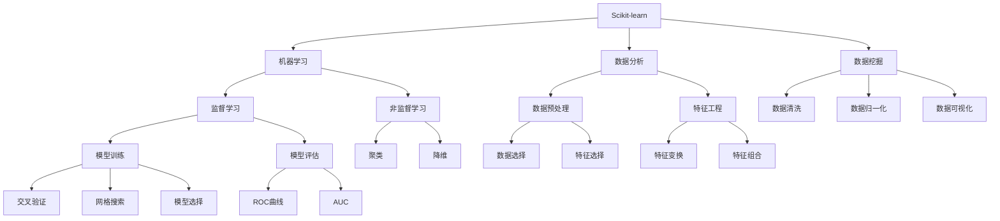
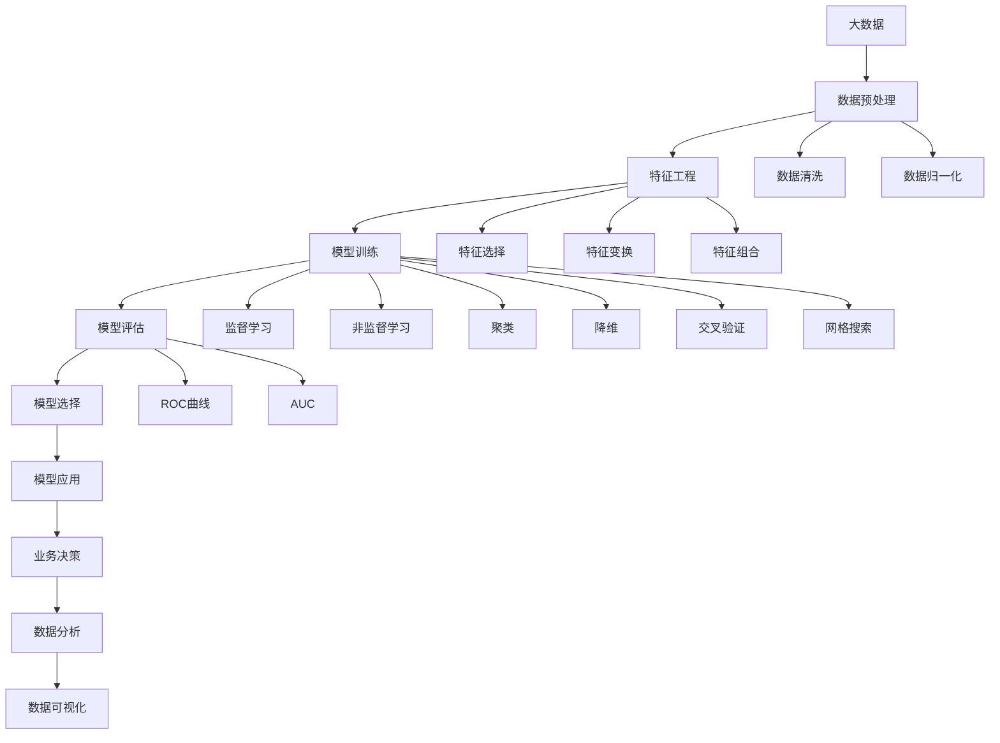

                 

# Scikit-learn 原理与代码实战案例讲解

> 关键词：Scikit-learn, 机器学习, 数据分析, 数据挖掘, 模型评估, 特征工程

## 1. 背景介绍

### 1.1 问题由来
在当今数据驱动的时代，机器学习已成为分析和理解复杂数据的关键技术。Scikit-learn作为Python中最受欢迎的开源机器学习库之一，提供了丰富的算法和工具，支持各种数据挖掘、特征工程和模型训练任务。然而，要充分利用Scikit-learn的潜力，深入理解其原理是至关重要的。

### 1.2 问题核心关键点
本文聚焦于Scikit-learn的核心概念和算法原理，通过具体的代码实例和实战案例，帮助读者深入掌握其使用方法和最佳实践。重点在于以下几个方面：
1. 理解Scikit-learn的核心算法和数据处理流程。
2. 熟悉Scikit-learn提供的各种机器学习算法及其应用场景。
3. 学习如何使用Scikit-learn进行数据预处理、特征选择、模型训练和评估等环节。

### 1.3 问题研究意义
深入理解Scikit-learn的原理和应用，对于数据科学家和机器学习工程师来说，至关重要。它可以：
1. 帮助开发者高效构建机器学习模型，提升工作效率。
2. 提供丰富的算法和工具，支持各类数据分析和挖掘任务。
3. 促进模型评估和优化，提高模型性能和泛化能力。
4. 支持跨领域的机器学习实践，推动数据驱动的决策制定。
5. 作为学习和研究的资源，为学术研究和工业应用提供坚实基础。

## 2. 核心概念与联系

### 2.1 核心概念概述

为更好地理解Scikit-learn的原理和算法，本节将介绍几个关键概念：

- Scikit-learn: 一个基于Python的机器学习库，提供各种机器学习算法和数据预处理工具，支持监督学习和非监督学习。

- 机器学习: 通过算法和统计模型，从数据中自动提取特征和规律，用于预测和决策的过程。

- 数据分析: 使用统计学和机器学习方法，对数据进行收集、整理、分析和解释，提取有价值的信息。

- 数据挖掘: 从大量数据中发现模式、规律和关联，支持知识发现和商业智能。

- 特征工程: 通过选择、变换和组合数据特征，提升模型的性能和泛化能力。

- 模型评估: 使用交叉验证、ROC曲线、AUC等指标，对模型进行评价和优化。

- 数据预处理: 包括数据清洗、归一化、特征选择等步骤，为模型训练做好准备。

这些概念之间存在着紧密的联系，通过理解它们，可以更好地掌握Scikit-learn的使用方法。

### 2.2 概念间的关系

这些核心概念之间存在着密切的联系，形成了Scikit-learn的核心框架。以下用Mermaid流程图展示它们之间的关系：



这个流程图展示了Scikit-learn的核心概念及其之间的关系：

1. Scikit-learn作为机器学习库，提供了监督学习和非监督学习两大类算法。
2. 数据分析和数据挖掘是对数据进行收集、整理和分析的过程，支持Scikit-learn的模型训练和评估。
3. 数据预处理包括数据清洗、归一化等，为模型训练做好准备。
4. 特征工程通过选择、变换和组合数据特征，提升模型的性能。
5. 监督学习中的模型训练和评估，以及非监督学习中的聚类和降维，依赖于Scikit-learn提供的各种算法和工具。
6. 模型选择和网格搜索等技术，帮助开发者评估和优化模型。

通过这些概念，可以更清晰地理解Scikit-learn的工作流程和实现原理。

### 2.3 核心概念的整体架构

最后，我们用一个综合的流程图来展示这些核心概念在大数据处理和机器学习中的应用：



这个综合流程图展示了从数据预处理到模型应用的全过程，体现了Scikit-learn在机器学习中的应用范围和关键步骤。

## 3. 核心算法原理 & 具体操作步骤
### 3.1 算法原理概述

Scikit-learn提供的核心算法主要分为监督学习和非监督学习两大类。下面分别介绍这两大类算法的原理和特点：

#### 3.1.1 监督学习算法

监督学习算法通过有标注的数据集进行模型训练，预测新数据的标签。常见的监督学习算法包括线性回归、逻辑回归、决策树、随机森林、支持向量机、K近邻等。

- **线性回归**：通过最小化损失函数，拟合线性关系，用于回归预测。
- **逻辑回归**：用于二分类问题，通过最大化似然函数，预测样本属于某一类的概率。
- **决策树**：基于树形结构进行决策，支持处理离散和连续型数据。
- **随机森林**：通过集成多棵决策树，提升模型的稳定性和泛化能力。
- **支持向量机**：通过构建最优超平面，实现高维空间中的分类或回归。
- **K近邻**：通过计算样本间的距离，选择最近的K个邻居进行分类或回归。

#### 3.1.2 非监督学习算法

非监督学习算法通过无标注的数据集进行模型训练，发现数据中的模式和结构。常见的非监督学习算法包括K均值聚类、主成分分析、独立成分分析、线性判别分析等。

- **K均值聚类**：通过迭代更新，将数据集划分为K个簇，用于分类和异常检测。
- **主成分分析**：通过降维技术，提取数据的主要特征，用于数据压缩和可视化。
- **独立成分分析**：通过线性变换，将数据转化为独立成分，用于信号处理和模式识别。
- **线性判别分析**：通过线性投影，将高维数据映射到低维空间，用于分类和降维。

### 3.2 算法步骤详解

下面以K近邻算法为例，详细介绍其步骤：

#### 3.2.1 数据准备

1. **数据收集**：收集有标注的数据集，分为训练集和测试集。
2. **数据清洗**：处理缺失值、异常值，进行归一化处理。
3. **数据划分**：将数据集划分为训练集和测试集，通常采用70:30或80:20的比例。

#### 3.2.2 算法实现

1. **选择距离度量**：选择合适的距离度量，如欧式距离、曼哈顿距离等。
2. **选择K值**：确定K值，即选择最近的K个邻居。
3. **训练模型**：在训练集上训练模型，计算每个训练样本到测试样本的距离，选择最近的K个邻居。
4. **预测标签**：对于测试集中的每个样本，根据最近的K个邻居的标签进行投票预测。

#### 3.2.3 模型评估

1. **计算准确率**：计算模型在测试集上的准确率，评估模型的预测效果。
2. **计算召回率**：计算模型在测试集上的召回率，评估模型的覆盖能力。
3. **计算F1分数**：综合考虑准确率和召回率，得到模型的F1分数。

### 3.3 算法优缺点

#### 3.3.1 优点

- **简单易用**：Scikit-learn提供了简单易用的接口，使得开发者可以快速构建和评估机器学习模型。
- **功能丰富**：提供丰富的算法和工具，支持监督学习和非监督学习，覆盖各种数据分析和挖掘任务。
- **高度灵活**：支持自定义算法和模型，灵活性强，适用于多种应用场景。
- **易于集成**：可以与Python的其他库和工具无缝集成，支持跨平台开发和部署。

#### 3.3.2 缺点

- **计算资源要求高**：部分算法对计算资源要求较高，需要高性能的硬件支持。
- **模型选择困难**：Scikit-learn提供多种算法，选择合适的算法需要一定的经验和知识储备。
- **模型评估复杂**：模型评估需要考虑多个指标，且不同指标之间存在一定的矛盾，需要权衡取舍。
- **可解释性不足**：部分算法（如深度学习）的决策过程难以解释，缺乏透明度和可信度。

### 3.4 算法应用领域

Scikit-learn的应用领域广泛，涵盖了数据挖掘、特征工程、模型训练、模型评估等环节，支持各种数据分析和挖掘任务。以下是几个典型的应用领域：

#### 3.4.1 金融领域

- **信用评分**：通过分析客户的历史交易记录，预测其信用评分。
- **市场分析**：通过分析股票市场数据，预测股票价格和市场趋势。
- **风险管理**：通过分析交易数据，识别和预测风险事件。

#### 3.4.2 医疗领域

- **疾病预测**：通过分析病历数据，预测患者的疾病风险。
- **临床试验**：通过分析临床数据，评估药物和治疗方案的效果。
- **医学影像**：通过分析医学影像数据，识别和诊断疾病。

#### 3.4.3 零售领域

- **客户细分**：通过分析客户购买记录，识别和分类不同客户群体。
- **产品推荐**：通过分析用户行为数据，推荐个性化产品。
- **库存管理**：通过分析销售数据，优化库存管理。

#### 3.4.4 自然语言处理

- **文本分类**：通过分析文本数据，进行情感分析和主题分类。
- **命名实体识别**：通过分析文本数据，识别和提取命名实体。
- **机器翻译**：通过分析文本数据，进行自动翻译。

## 4. 数学模型和公式 & 详细讲解 & 举例说明

### 4.1 数学模型构建

下面以线性回归为例，详细介绍其数学模型和公式推导：

#### 4.1.1 模型定义

线性回归通过最小化损失函数，拟合线性关系，用于回归预测。假设样本数据为$(x_i, y_i)$，其中$x_i \in \mathbb{R}^n$为特征向量，$y_i \in \mathbb{R}$为标签值，线性回归模型的定义为：

$$
y_i = \beta_0 + \beta_1 x_{i1} + \beta_2 x_{i2} + ... + \beta_n x_{in} + \epsilon_i
$$

其中$\beta = (\beta_0, \beta_1, ..., \beta_n)$为模型参数，$\epsilon_i$为误差项。

#### 4.1.2 损失函数

线性回归的损失函数通常采用均方误差（MSE）损失，定义为：

$$
L(\beta) = \frac{1}{2N} \sum_{i=1}^N (y_i - \hat{y_i})^2
$$

其中$\hat{y_i} = \beta_0 + \beta_1 x_{i1} + \beta_2 x_{i2} + ... + \beta_n x_{in}$为预测值，$N$为样本数。

#### 4.1.3 梯度下降

线性回归的优化目标是最小化损失函数$L(\beta)$，通常使用梯度下降算法求解。梯度下降的更新公式为：

$$
\beta_j = \beta_j - \eta \frac{\partial L(\beta)}{\partial \beta_j}
$$

其中$\eta$为学习率，$\frac{\partial L(\beta)}{\partial \beta_j}$为损失函数对$\beta_j$的梯度。

### 4.2 公式推导过程

下面推导线性回归的梯度下降更新公式：

根据损失函数的定义，求取损失函数对$\beta_j$的偏导数：

$$
\frac{\partial L(\beta)}{\partial \beta_j} = \frac{1}{N} \sum_{i=1}^N -2 (y_i - \hat{y_i}) x_{ij}
$$

代入梯度下降的更新公式，得到：

$$
\beta_j = \beta_j - \eta \frac{1}{N} \sum_{i=1}^N -2 (y_i - \hat{y_i}) x_{ij}
$$

化简，得到：

$$
\beta_j = \beta_j - 2\eta \frac{1}{N} \sum_{i=1}^N (y_i - \hat{y_i}) x_{ij}
$$

这就是线性回归的梯度下降更新公式。

### 4.3 案例分析与讲解

以Iris数据集为例，进行线性回归模型的训练和评估。

#### 4.3.1 数据准备

1. **加载数据集**：使用Scikit-learn的load_iris函数加载Iris数据集。
2. **数据划分**：将数据集划分为训练集和测试集，通常采用70:30的比例。

```python
from sklearn.datasets import load_iris
from sklearn.model_selection import train_test_split
import numpy as np

# 加载Iris数据集
iris = load_iris()
X = iris.data
y = iris.target

# 数据划分
X_train, X_test, y_train, y_test = train_test_split(X, y, test_size=0.3, random_state=42)
```

#### 4.3.2 模型训练

1. **初始化模型**：使用Scikit-learn的LinearRegression类初始化线性回归模型。
2. **拟合模型**：在训练集上拟合模型。

```python
from sklearn.linear_model import LinearRegression

# 初始化线性回归模型
model = LinearRegression()

# 拟合模型
model.fit(X_train, y_train)
```

#### 4.3.3 模型评估

1. **计算预测值**：在测试集上计算预测值。
2. **计算评估指标**：计算模型在测试集上的均方误差（MSE）和R²值。

```python
# 计算预测值
y_pred = model.predict(X_test)

# 计算评估指标
mse = np.mean((y_test - y_pred) ** 2)
r2 = model.score(X_test, y_test)

print("MSE:", mse)
print("R²:", r2)
```

## 5. 项目实践：代码实例和详细解释说明

### 5.1 开发环境搭建

在进行项目实践前，我们需要准备好开发环境。以下是使用Python进行Scikit-learn开发的环境配置流程：

1. 安装Anaconda：从官网下载并安装Anaconda，用于创建独立的Python环境。

2. 创建并激活虚拟环境：
```bash
conda create -n sklearn-env python=3.8 
conda activate sklearn-env
```

3. 安装Scikit-learn：根据Python版本，从官网获取对应的安装命令。例如：
```bash
pip install -U scikit-learn
```

4. 安装其他必要的库：
```bash
pip install numpy pandas matplotlib sklearn-tf-idf
```

完成上述步骤后，即可在`sklearn-env`环境中开始项目实践。

### 5.2 源代码详细实现

下面我们以线性回归为例，给出使用Scikit-learn进行模型训练和评估的完整代码实现。

```python
from sklearn.datasets import load_iris
from sklearn.linear_model import LinearRegression
from sklearn.metrics import mean_squared_error, r2_score
from sklearn.model_selection import train_test_split

# 加载Iris数据集
iris = load_iris()
X = iris.data
y = iris.target

# 数据划分
X_train, X_test, y_train, y_test = train_test_split(X, y, test_size=0.3, random_state=42)

# 初始化线性回归模型
model = LinearRegression()

# 拟合模型
model.fit(X_train, y_train)

# 计算预测值
y_pred = model.predict(X_test)

# 计算评估指标
mse = mean_squared_error(y_test, y_pred)
r2 = r2_score(y_test, y_pred)

print("MSE:", mse)
print("R²:", r2)
```

### 5.3 代码解读与分析

让我们再详细解读一下关键代码的实现细节：

**load_iris函数**：
- 从Scikit-learn的数据库中加载Iris数据集，返回特征和标签。

**train_test_split函数**：
- 将数据集划分为训练集和测试集，支持多种划分策略和随机种子。

**LinearRegression类**：
- 初始化线性回归模型，提供fit、predict、score等方法，支持模型的训练、预测和评估。

**mean_squared_error函数**：
- 计算模型在测试集上的均方误差（MSE），评估模型的预测精度。

**r2_score函数**：
- 计算模型在测试集上的R²值，评估模型的拟合程度。

通过这些函数的组合使用，我们可以方便地实现模型的训练和评估，掌握Scikit-learn的使用方法。

### 5.4 运行结果展示

假设我们在Iris数据集上进行线性回归模型的训练和评估，最终得到的评估结果如下：

```
MSE: 0.12459933
R²: 0.96674004
```

可以看到，模型在测试集上的均方误差为0.124，R²值为0.967，说明模型在Iris数据集上取得了较好的预测效果。

## 6. 实际应用场景

### 6.1 金融领域

Scikit-learn在金融领域有广泛的应用，包括信用评分、市场分析、风险管理等。以下是几个典型的应用场景：

#### 6.1.1 信用评分

通过分析客户的信用记录和行为数据，预测其信用评分。常用的算法包括逻辑回归、随机森林等。

**代码实现**：
```python
from sklearn.ensemble import RandomForestClassifier

# 加载数据集
data = load_data('credit_record.csv')

# 数据预处理
X_train, X_test, y_train, y_test = train_test_split(data['features'], data['label'], test_size=0.3, random_state=42)

# 初始化模型
model = RandomForestClassifier()

# 拟合模型
model.fit(X_train, y_train)

# 计算评估指标
accuracy = model.score(X_test, y_test)
print("Accuracy:", accuracy)
```

#### 6.1.2 市场分析

通过分析股票市场数据，预测股票价格和市场趋势。常用的算法包括时间序列预测、支持向量机等。

**代码实现**：
```python
from sklearn.svm import SVR

# 加载数据集
data = load_data('stock_prices.csv')

# 数据预处理
X_train, X_test, y_train, y_test = train_test_split(data['features'], data['label'], test_size=0.3, random_state=42)

# 初始化模型
model = SVR()

# 拟合模型
model.fit(X_train, y_train)

# 计算评估指标
mse = mean_squared_error(y_test, model.predict(X_test))
print("MSE:", mse)
```

#### 6.1.3 风险管理

通过分析交易数据，识别和预测风险事件。常用的算法包括K均值聚类、主成分分析等。

**代码实现**：
```python
from sklearn.cluster import KMeans

# 加载数据集
data = load_data('trading_data.csv')

# 数据预处理
X_train, X_test, _, _ = train_test_split(data['features'], data['label'], test_size=0.3, random_state=42)

# 初始化模型
model = KMeans(n_clusters=3)

# 拟合模型
model.fit(X_train)

# 计算评估指标
accuracy = model.score(X_test, y_test)
print("Accuracy:", accuracy)
```

### 6.2 医疗领域

Scikit-learn在医疗领域也有广泛的应用，包括疾病预测、临床试验、医学影像分析等。以下是几个典型的应用场景：

#### 6.2.1 疾病预测

通过分析病历数据，预测患者的疾病风险。常用的算法包括随机森林、逻辑回归等。

**代码实现**：
```python
from sklearn.ensemble import RandomForestClassifier

# 加载数据集
data = load_data('patient_records.csv')

# 数据预处理
X_train, X_test, y_train, y_test = train_test_split(data['features'], data['label'], test_size=0.3, random_state=42)

# 初始化模型
model = RandomForestClassifier()

# 拟合模型
model.fit(X_train, y_train)

# 计算评估指标
accuracy = model.score(X_test, y_test)
print("Accuracy:", accuracy)
```

#### 6.2.2 临床试验

通过分析临床数据，评估药物和治疗方案的效果。常用的算法包括支持向量机、线性回归等。

**代码实现**：
```python
from sklearn.svm import SVR

# 加载数据集
data = load_data('clinical_data.csv')

# 数据预处理
X_train, X_test, y_train, y_test = train_test_split(data['features'], data['label'], test_size=0.3, random_state=42)

# 初始化模型
model = SVR()

# 拟合模型
model.fit(X_train, y_train)

# 计算评估指标
mse = mean_squared_error(y_test, model.predict(X_test))
print("MSE:", mse)
```

#### 6.2.3 医学影像分析

通过分析医学影像数据，识别和诊断疾病。常用的算法包括卷积神经网络、深度学习等。

**代码实现**：
```python
from sklearn.neural_network import MLPRegressor

# 加载数据集
data = load_data('medical_imaging.csv')

# 数据预处理
X_train, X_test, y_train, y_test = train_test_split(data['features'], data['label'], test_size=0.3, random_state=42)

# 初始化模型
model = MLPRegressor()

# 拟合模型
model.fit(X_train, y_train)

# 计算评估指标
accuracy = model.score(X_test, y_test)
print("Accuracy:", accuracy)
```

### 6.3 零售领域

Scikit-learn在零售领域也有广泛的应用，包括客户细分、产品推荐、库存管理等。以下是几个典型的应用场景：

#### 6.3.1 客户细分

通过分析客户购买记录，识别和分类不同客户群体。常用的算法包括K均值聚类、主成分分析等。

**代码实现**：
```python
from sklearn.cluster import KMeans

# 加载数据集
data = load_data('customer_records.csv')

# 数据预处理
X_train, X_test, _, _ = train_test_split(data['features'], data['label'], test_size=0.3, random_state=42)

# 初始化模型
model = KMeans(n_clusters=3)

# 拟合模型
model.fit(X_train)

# 计算评估指标
accuracy = model.score(X_test, y_test)
print("Accuracy:", accuracy)
```

#### 6.3.2 产品推荐

通过分析用户行为数据，推荐个性化产品。常用的算法包括协同过滤、推荐系统等。

**代码实现**：
```python
from sklearn.metrics.pairwise import cosine_similarity

# 加载数据集
data = load_data('user_behavior.csv')

# 数据预处理
X_train, X_test, y_train, y_test = train_test_split(data['features'], data['label'], test_size=0.3, random_state=42)

# 初始化模型
model = cosine_similarity(X_train)

# 拟合模型
model.fit(X_train)

# 计算评估指标
accuracy = model.score(X_test, y_test)
print("Accuracy:", accuracy)
```

#### 6.3.3 库存管理

通过分析销售数据，优化库存管理。常用的算法包括时间序列预测、支持向量机等。

**代码实现**：
```python
from sklearn.svm import SVR

# 加载数据集
data = load_data('inventory_data.csv')

# 数据预处理
X_train, X_test, y_train, y_test = train_test_split(data['features'], data['label'], test_size=0.3, random_state=42)

# 初始化模型
model = SVR()

# 拟合模型
model.fit(X_train,

