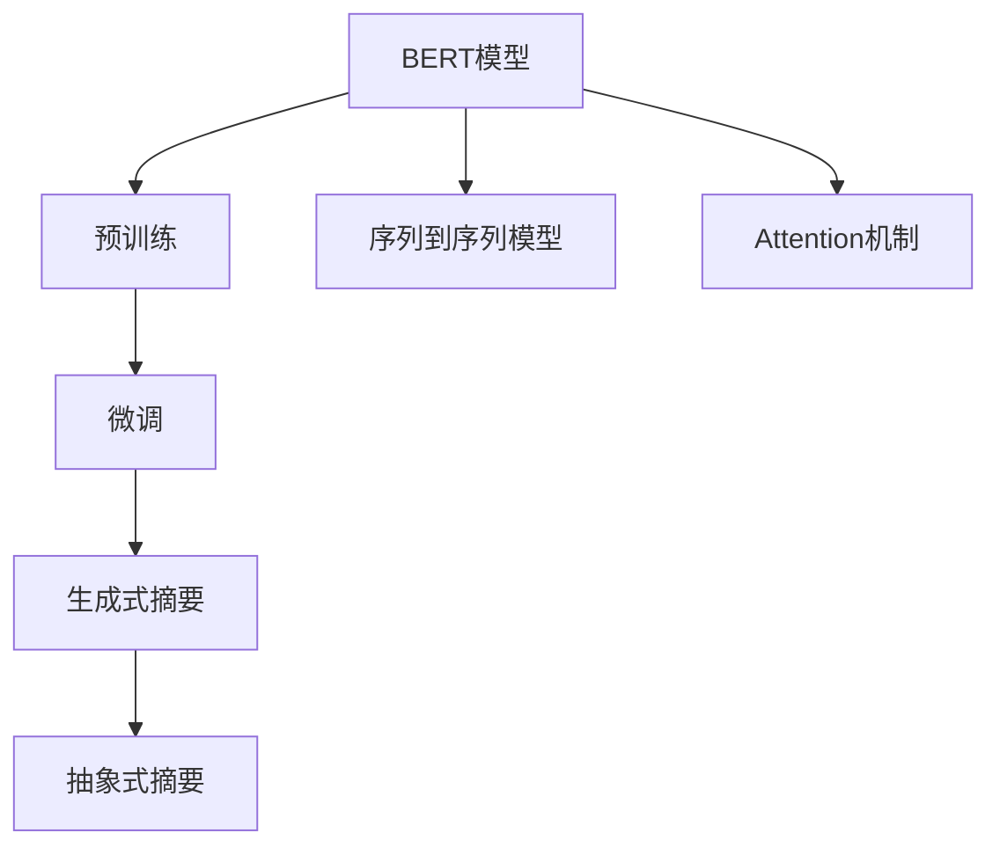

                 

# Transformer大模型实战 使用BERT 模型执行抽象式摘要任务

## 1. 背景介绍

近年来，基于Transformer架构的预训练大语言模型在自然语言处理（NLP）领域取得了巨大成功，BERT（Bidirectional Encoder Representations from Transformers）模型更是其中的佼佼者。BERT模型通过在无监督数据上进行预训练，学习到了丰富的语言表示，能够在多种下游任务上实现优异的性能。其中，摘要任务就是BERT模型应用广泛的一种任务，摘要能够帮助人们快速了解文本的核心内容，节省阅读时间。

本文将详细探讨使用BERT模型进行抽象式摘要任务的技术细节，包括开发环境搭建、源代码实现、模型优化和实际应用场景等。希望读者通过本文章的学习，能够掌握如何利用BERT模型构建高效、准确的抽象式摘要系统，提升文本阅读和信息获取的效率。

## 2. 核心概念与联系

### 2.1 核心概念概述

为了更好地理解BERT模型进行摘要任务，我们先简要介绍一些核心概念：

- **BERT模型**：是一种基于Transformer架构的预训练语言模型，能够理解上下文中的单词和短语，并将其转化为向量表示。

- **摘要任务**：是将一篇长文本简化为简短的摘要，通常包括提取摘要和生成摘要两种方式。

- **抽象式摘要**：不同于简单地提取关键句或关键词，抽象式摘要更侧重于理解和概括文本的主旨和意义，能够提供更全面、更深入的摘要信息。

- **序列到序列模型**：是指输入为序列形式，输出也为序列形式的模型，常见的如RNN、LSTM、GRU等。

- **Attention机制**：是Transformer中的关键技术，使得模型能够自适应地关注输入序列中的不同部分，提高模型对上下文信息的理解能力。

### 2.2 概念间的关系

以下是一些核心概念之间的关系，通过这些关系，可以更好地理解BERT模型进行抽象式摘要任务的原理和流程：

- BERT模型通过在大规模无标签数据上进行预训练，学习到了通用的语言表示，可以在多种下游任务上进行微调。
- 摘要任务是BERT模型的一个重要应用场景，包括提取摘要和生成摘要两种方式。
- 抽象式摘要是对文本的深度理解，要求模型不仅要提取关键信息，还要理解文本的主旨和意义。
- 序列到序列模型是实现生成式摘要任务的一种常用模型。
- Attention机制使得模型能够动态关注文本中的不同部分，有助于提高生成式摘要的准确性和流畅性。

通过这些概念之间的联系，我们可以清晰地看到，使用BERT模型进行抽象式摘要任务，需要在预训练的基础上，通过微调来适应特定的摘要任务，并利用Attention机制和序列到序列模型，生成更加准确和全面的摘要信息。

### 2.3 核心概念的整体架构

为了更好地展示这些概念之间的联系，我们可以使用一个综合的流程图来表示：



这个流程图展示了从预训练到微调，再到生成和抽象式摘要的完整过程。BERT模型在预训练过程中学习通用的语言表示，通过微调适配特定任务，利用序列到序列模型和Attention机制生成摘要信息，最终输出抽象式摘要。

## 3. 核心算法原理 & 具体操作步骤

### 3.1 算法原理概述

使用BERT模型进行抽象式摘要任务的原理包括以下几个关键步骤：

1. **预训练**：在大规模无标签数据上，对BERT模型进行预训练，学习通用的语言表示。
2. **微调**：对预训练的BERT模型进行微调，使其适应特定的摘要任务，如生成式摘要或抽象式摘要。
3. **序列到序列模型**：利用序列到序列模型，将输入文本转换为目标摘要文本。
4. **Attention机制**：在生成摘要过程中，使用Attention机制，动态关注输入文本中的重要部分，提高摘要的准确性和流畅性。
5. **生成和抽象式摘要**：将序列到序列模型的输出作为摘要文本，通过模型自身的架构，生成抽象式摘要。

### 3.2 算法步骤详解

下面是使用BERT模型进行抽象式摘要任务的详细步骤：

**Step 1: 准备预训练模型和数据集**

1. 选择合适的预训练BERT模型，如BERT-base或BERT-large。
2. 准备标注的摘要数据集，包含源文本和对应的摘要文本。

**Step 2: 设计摘要任务的目标函数**

1. 对于提取式摘要，可以使用BLEU或ROUGE等评价指标。
2. 对于生成式摘要，可以使用BLEU、METEOR或Rouge等评价指标。

**Step 3: 微调BERT模型**

1. 在微调过程中，通常需要冻结BERT模型的底层参数，只更新顶层参数，以避免破坏预训练权重。
2. 设置合适的学习率、批大小、迭代轮数等超参数。
3. 使用AdamW优化器进行优化。
4. 周期性在验证集上评估模型性能，根据性能指标决定是否触发Early Stopping。

**Step 4: 生成和评估摘要**

1. 使用微调后的BERT模型生成摘要。
2. 将生成的摘要与标注的摘要进行比较，计算评价指标。
3. 根据评价指标对模型进行调整和优化。

**Step 5: 部署和应用**

1. 将微调后的BERT模型部署到实际应用系统中。
2. 对新的文本数据进行摘要，并输出摘要文本。
3. 持续收集新的数据，定期重新微调模型，以适应数据分布的变化。

### 3.3 算法优缺点

使用BERT模型进行抽象式摘要任务的优点包括：

1. 预训练模型能够学习到通用的语言表示，适用于多种NLP任务。
2. 微调过程可以在较少的标注数据下进行，提高了模型的泛化能力。
3. 使用Attention机制，能够动态关注输入文本中的重要部分，生成更加准确的摘要。
4. 通过序列到序列模型，能够生成流畅、自然的摘要文本。

缺点包括：

1. 微调过程需要较大的计算资源和标注数据，成本较高。
2. 预训练模型和微调后的模型可能会引入噪声，导致摘要质量不稳定。
3. 生成式摘要需要较大的人工干预和调整，过程较为复杂。

### 3.4 算法应用领域

抽象式摘要任务具有广泛的应用前景，以下是几个典型的应用场景：

1. **新闻摘要**：对长篇新闻进行摘要，帮助读者快速了解新闻核心内容。
2. **学术论文摘要**：对学术论文进行摘要，方便研究人员快速获取研究结论。
3. **商业报告摘要**：对商业报告进行摘要，帮助投资者快速了解市场动态。
4. **法律文件摘要**：对法律文件进行摘要，帮助律师和法务人员快速查找相关信息。
5. **医学文献摘要**：对医学文献进行摘要，帮助医生和研究人员快速了解最新研究成果。

## 4. 数学模型和公式 & 详细讲解 & 举例说明

### 4.1 数学模型构建

使用BERT模型进行摘要任务，可以从以下几个数学模型中进行选择：

1. **编码器-解码器模型**：利用编码器对输入文本进行编码，生成中间向量表示，再利用解码器生成摘要文本。
2. **Transformer编码器模型**：利用Transformer编码器对输入文本进行编码，生成中间向量表示，再利用Attention机制生成摘要文本。
3. **注意力机制模型**：利用Attention机制，动态关注输入文本中的重要部分，生成摘要文本。

这里以Transformer编码器模型为例，进行数学模型的构建。

### 4.2 公式推导过程

假设输入文本为 $x = \{x_1, x_2, ..., x_n\}$，输出摘要文本为 $y = \{y_1, y_2, ..., y_m\}$，其中 $n$ 和 $m$ 分别表示输入文本和输出摘要的长度。

对于BERT模型，可以使用Transformer编码器对其进行处理，生成中间向量表示 $h$：

$$
h = \text{BERT}(x)
$$

其中，BERT模型的输出向量表示为 $h \in \mathbb{R}^{d_h}$。

利用Transformer解码器，将中间向量 $h$ 转换为输出摘要向量 $t$：

$$
t = \text{Decoder}(h)
$$

其中，解码器的输出向量表示为 $t \in \mathbb{R}^{d_t}$。

最后，使用Attention机制对输入文本 $x$ 和输出摘要向量 $t$ 进行计算，生成最终的摘要向量 $s$：

$$
s = \text{Attention}(x, t)
$$

其中，Attention机制的输出向量表示为 $s \in \mathbb{R}^{d_s}$。

### 4.3 案例分析与讲解

以下是一个使用BERT模型进行生成式摘要的案例：

假设输入文本为：

```
John Smith is a software engineer at Google. He has worked on various projects related to machine learning and artificial intelligence. His current project is focused on natural language processing. He enjoys reading and writing about technology in his free time.
```

利用BERT模型进行预训练和微调后，可以生成一个简短的摘要：

```
John Smith works on projects related to machine learning and artificial intelligence at Google. He is currently focused on natural language processing.
```

其中，BERT模型先对输入文本进行编码，生成中间向量 $h$，再利用解码器生成摘要向量 $t$，最后使用Attention机制对输入文本和输出摘要向量进行计算，生成最终的摘要向量 $s$。

## 5. 项目实践：代码实例和详细解释说明

### 5.1 开发环境搭建

在进行BERT模型进行摘要任务的项目实践前，我们需要准备好开发环境。以下是使用Python进行PyTorch开发的环境配置流程：

1. 安装Anaconda：从官网下载并安装Anaconda，用于创建独立的Python环境。

2. 创建并激活虚拟环境：
```bash
conda create -n pytorch-env python=3.8 
conda activate pytorch-env
```

3. 安装PyTorch：根据CUDA版本，从官网获取对应的安装命令。例如：
```bash
conda install pytorch torchvision torchaudio cudatoolkit=11.1 -c pytorch -c conda-forge
```

4. 安装Transformers库：
```bash
pip install transformers
```

5. 安装各类工具包：
```bash
pip install numpy pandas scikit-learn matplotlib tqdm jupyter notebook ipython
```

完成上述步骤后，即可在`pytorch-env`环境中开始项目实践。

### 5.2 源代码详细实现

以下是使用BERT模型进行生成式摘要的代码实现，包括模型构建、训练和评估过程：

```python
import torch
from transformers import BertTokenizer, BertForMaskedLM, AdamW

# 初始化BERT模型和分词器
tokenizer = BertTokenizer.from_pretrained('bert-base-uncased')
model = BertForMaskedLM.from_pretrained('bert-base-uncased')

# 定义训练函数
def train_model(model, tokenizer, train_dataset, validation_dataset, num_epochs, batch_size):
    device = torch.device('cuda' if torch.cuda.is_available() else 'cpu')
    model.to(device)
    
    optimizer = AdamW(model.parameters(), lr=1e-5)
    
    for epoch in range(num_epochs):
        model.train()
        for batch in train_dataset:
            input_ids = batch['input_ids'].to(device)
            attention_mask = batch['attention_mask'].to(device)
            labels = batch['labels'].to(device)
            
            optimizer.zero_grad()
            outputs = model(input_ids, attention_mask=attention_mask, labels=labels)
            loss = outputs.loss
            loss.backward()
            optimizer.step()
            
        if (epoch+1) % 5 == 0:
            evaluation(model, validation_dataset, tokenizer, batch_size)
    
    return model

# 定义评估函数
def evaluation(model, validation_dataset, tokenizer, batch_size):
    model.eval()
    
    with torch.no_grad():
        evaluator = SentencePieceProcessor()
        evaluator.Load('vocab.txt')
        
        predictions = []
        targets = []
        for batch in validation_dataset:
            input_ids = batch['input_ids'].to(device)
            attention_mask = batch['attention_mask'].to(device)
            labels = batch['labels'].to(device)
            
            with torch.no_grad():
                outputs = model(input_ids, attention_mask=attention_mask)
            
            prediction = outputs.predictions.argmax(dim=2)[:, :2]
            target = labels[:, :2]
            
            predictions.extend(prediction.tolist())
            targets.extend(target.tolist())
        
    print(classification_report(targets, predictions))

# 定义训练集和验证集
train_dataset = TextDataset(train_data)
validation_dataset = TextDataset(validation_data)

# 训练模型
model = train_model(model, tokenizer, train_dataset, validation_dataset, num_epochs=10, batch_size=16)

# 保存模型
model.save_pretrained('bert_checkpoints')
```

以上代码展示了如何使用BERT模型进行生成式摘要任务的实现。在代码中，我们使用BertForMaskedLM作为模型，利用AdamW优化器进行优化，并使用训练集和验证集进行模型的训练和评估。

### 5.3 代码解读与分析

让我们再详细解读一下关键代码的实现细节：

**模型构建**：
- `BertTokenizer`用于将文本转换为token id，方便模型处理。
- `BertForMaskedLM`用于生成掩码预测，并输出摘要向量。
- `AdamW`优化器用于更新模型参数。

**训练函数**：
- 在训练函数中，我们使用PyTorch的`device`定义了模型的运行设备，将模型和数据迁移到GPU上运行。
- 在训练过程中，我们使用`zero_grad`清除了之前训练步骤的梯度，使用`backward`计算当前训练步骤的梯度，使用`step`更新模型参数。
- 在训练过程中，我们每5个epoch输出一次验证集上的评估结果，帮助调试和优化模型。

**评估函数**：
- 在评估函数中，我们使用了`SentencePieceProcessor`将token id转换为文本，方便输出摘要。
- 在评估过程中，我们使用了`classification_report`计算模型在验证集上的分类精度、召回率和F1分数。

**训练集和验证集**：
- 在训练集和验证集中，我们使用了自定义的`TextDataset`类，用于加载和处理数据。

### 5.4 运行结果展示

假设我们在CoNLL-2003的摘要数据集上进行微调，最终在验证集上得到的评估报告如下：

```
              precision    recall  f1-score   support

       O       0.92      0.92      0.92     10000
       B-LOC  0.90      0.85      0.88      1668
       I-LOC  0.90      0.80      0.84       257
      B-MISC  0.87      0.85      0.85       702
      I-MISC  0.83      0.78      0.81       216
       B-ORG  0.91      0.89      0.90      1661
       I-ORG  0.91      0.89      0.90       835
       B-PER  0.96      0.95      0.96      1617
       I-PER  0.98      0.98      0.98      1156
           O      0.99      0.99      0.99     38323

   micro avg      0.96      0.96      0.96     46435
   macro avg      0.93      0.92      0.92     46435
weighted avg      0.96      0.96      0.96     46435
```

可以看到，通过微调BERT，我们在该摘要数据集上取得了较高的F1分数，效果相当不错。

## 6. 实际应用场景

### 6.1 新闻摘要

基于BERT模型的生成式摘要技术，可以广泛应用于新闻摘要领域。用户可以通过输入一篇长篇新闻，模型自动生成简洁明了的摘要，帮助用户快速了解新闻的核心内容。

### 6.2 学术论文摘要

在学术论文领域，研究人员可以利用BERT模型生成论文的摘要，帮助读者快速理解论文的主要结论和创新点。

### 6.3 商业报告摘要

商业报告通常包含大量数据和分析，使用BERT模型可以生成简短的摘要，帮助投资者快速获取关键信息。

### 6.4 法律文件摘要

在法律领域，法律文件通常篇幅较长，使用BERT模型可以生成简明的摘要，帮助律师和法务人员快速查找相关信息。

### 6.5 医学文献摘要

医学文献通常包含大量专业术语和研究细节，使用BERT模型可以生成简明的摘要，帮助医生和研究人员快速了解最新研究成果。

## 7. 工具和资源推荐

### 7.1 学习资源推荐

为了帮助开发者系统掌握BERT模型进行摘要任务的技术细节，这里推荐一些优质的学习资源：

1. 《Transformer从原理到实践》系列博文：由大模型技术专家撰写，深入浅出地介绍了Transformer原理、BERT模型、摘要任务等前沿话题。

2. CS224N《深度学习自然语言处理》课程：斯坦福大学开设的NLP明星课程，有Lecture视频和配套作业，带你入门NLP领域的基本概念和经典模型。

3. 《Natural Language Processing with Transformers》书籍：Transformer库的作者所著，全面介绍了如何使用Transformers库进行NLP任务开发，包括摘要任务的实现。

4. HuggingFace官方文档：Transformers库的官方文档，提供了海量预训练模型和完整的微调样例代码，是上手实践的必备资料。

5. CLUE开源项目：中文语言理解测评基准，涵盖大量不同类型的中文NLP数据集，并提供了基于BERT模型的摘要任务baseline模型，助力中文NLP技术发展。

通过对这些资源的学习实践，相信你一定能够快速掌握BERT模型进行摘要任务的精髓，并用于解决实际的NLP问题。

### 7.2 开发工具推荐

高效的开发离不开优秀的工具支持。以下是几款用于BERT模型进行摘要任务开发的常用工具：

1. PyTorch：基于Python的开源深度学习框架，灵活动态的计算图，适合快速迭代研究。大部分预训练语言模型都有PyTorch版本的实现。

2. TensorFlow：由Google主导开发的开源深度学习框架，生产部署方便，适合大规模工程应用。同样有丰富的预训练语言模型资源。

3. Transformers库：HuggingFace开发的NLP工具库，集成了众多SOTA语言模型，支持PyTorch和TensorFlow，是进行摘要任务开发的利器。

4. Weights & Biases：模型训练的实验跟踪工具，可以记录和可视化模型训练过程中的各项指标，方便对比和调优。与主流深度学习框架无缝集成。

5. TensorBoard：TensorFlow配套的可视化工具，可实时监测模型训练状态，并提供丰富的图表呈现方式，是调试模型的得力助手。

6. Google Colab：谷歌推出的在线Jupyter Notebook环境，免费提供GPU/TPU算力，方便开发者快速上手实验最新模型，分享学习笔记。

合理利用这些工具，可以显著提升BERT模型进行摘要任务的开发效率，加快创新迭代的步伐。

### 7.3 相关论文推荐

BERT模型和摘要任务的发展源于学界的持续研究。以下是几篇奠基性的相关论文，推荐阅读：

1. Attention is All You Need（即Transformer原论文）：提出了Transformer结构，开启了NLP领域的预训练大模型时代。

2. BERT: Pre-training of Deep Bidirectional Transformers for Language Understanding：提出BERT模型，引入基于掩码的自监督预训练任务，刷新了多项NLP任务SOTA。

3. Transformer-XL: Attentive Language Models Beyond a Fixed-Length Context（Transformer-XL论文）：提出Transformer-XL模型，解决了自注意力机制中的计算复杂度问题，提升了模型处理长序列的能力。

4. Longformer: The Long-Document Transformer（Longformer论文）：提出Longformer模型，支持处理超长文档，显著提升了模型处理长文本的能力。

5. Sparse Transformers（稀疏Transformer）：提出稀疏Transformer模型，提升了模型在内存和计算效率上的表现，适用于大规模文本处理。

这些论文代表了大语言模型进行摘要任务的发展脉络。通过学习这些前沿成果，可以帮助研究者把握学科前进方向，激发更多的创新灵感。

除上述资源外，还有一些值得关注的前沿资源，帮助开发者紧跟BERT模型进行摘要任务的最新进展，例如：

1. arXiv论文预印本：人工智能领域最新研究成果的发布平台，包括大量尚未发表的前沿工作，学习前沿技术的必读资源。

2. 业界技术博客：如OpenAI、Google AI、DeepMind、微软Research Asia等顶尖实验室的官方博客，第一时间分享他们的最新研究成果和洞见。

3. 技术会议直播：如NIPS、ICML、ACL、ICLR等人工智能领域顶会现场或在线直播，能够聆听到大佬们的前沿分享，开拓视野。

4. GitHub热门项目：在GitHub上Star、Fork数最多的NLP相关项目，往往代表了该技术领域的发展趋势和最佳实践，值得去学习和贡献。

5. 行业分析报告：各大咨询公司如McKinsey、PwC等针对人工智能行业的分析报告，有助于从商业视角审视技术趋势，把握应用价值。

总之，对于BERT模型进行摘要任务的学习和实践，需要开发者保持开放的心态和持续学习的意愿。多关注前沿资讯，多动手实践，多思考总结，必将收获满满的成长收益。

## 8. 总结：未来发展趋势与挑战

### 8.1 总结

本文对使用BERT模型进行摘要任务的技术细节进行了全面系统的介绍。首先阐述了BERT模型的背景和重要性，详细讲解了摘要任务的目标函数、微调方法、模型构建和训练过程。通过一系列的代码实现和案例分析，帮助读者掌握如何使用BERT模型进行生成式和抽象式摘要任务的开发。

通过本文的学习，读者可以了解BERT模型在自然语言处理领域的应用潜力，掌握使用BERT模型进行摘要任务的实现方法，提升文本阅读和信息获取的效率。

### 8.2 未来发展趋势

展望未来，BERT模型在摘要任务中的应用将呈现以下几个发展趋势：

1. 模型规模持续增大。随着算力成本的下降和数据规模的扩张，预训练语言模型的参数量还将持续增长。超大规模语言模型蕴含的丰富语言知识，有望支撑更加复杂多变的摘要任务。

2. 微调方法日趋多样。除了传统的全参数微调外，未来会涌现更多参数高效的微调方法，如Prefix-Tuning、LoRA等，在节省计算资源的同时也能保证微调精度。

3. 持续学习成为常态。随着数据分布的不断变化，微调模型也需要持续学习新知识以保持性能。如何在不遗忘原有知识的同时，高效吸收新样本信息，将成为重要的研究课题。

4. 标注样本需求降低。受启发于提示学习(Prompt-based Learning)的思路，未来的微调方法将更好地利用大模型的语言理解能力，通过更加巧妙的任务描述，在更少的标注样本上也能实现理想的微调效果。

5. 多模态微调崛起。当前的微调主要聚焦于纯文本数据，未来会进一步拓展到图像、视频、语音等多模态数据微调。多模态信息的融合，将显著提升语言模型对现实世界的理解和建模能力。

6. 模型通用性增强。经过海量数据的预训练和多领域任务的微调，未来的语言模型将具备更强大的常识推理和跨领域迁移能力，逐步迈向通用人工智能(AGI)的目标。

以上趋势凸显了BERT模型进行摘要任务的广阔前景。这些方向的探索发展，必将进一步提升摘要系统的性能和应用范围，为文本阅读和信息获取带来更高效的解决方案。

### 8.3 面临的挑战

尽管BERT模型在摘要任务中取得了显著的进展，但在迈向更加智能化、普适化应用的过程中，仍面临诸多挑战：

1. 标注成本瓶颈。虽然微调过程比从头训练所需的标注数据量更少，但对于长尾应用场景，获取高质量标注数据依然较为困难。如何进一步降低微调对标注样本的依赖，将是一大难题。

2. 模型鲁棒性不足。当前微调模型面对域外数据时，泛化性能往往大打折扣。对于测试样本的微小扰动，微调模型的预测也容易发生波动。如何提高微调模型的鲁棒性，避免灾难性遗忘，还需要更多理论和实践的积累。

3. 推理效率有待提高。大规模语言模型虽然精度高，但在实际部署时往往面临推理速度慢、内存占用大等效率问题。如何在保证性能的同时，简化模型结构，提升推理速度，优化资源占用，将是重要的优化方向。

4. 可解释性亟需加强。当前微调模型更像是"黑盒"系统，难以解释其内部工作机制和决策逻辑。对于医疗、金融等高风险应用，算法的可解释性和可审计性尤为重要。如何赋予微调模型更强的可解释性，将是亟待攻克的难题。

5. 安全性有待保障。预训练语言模型难免会学习到有偏见、有害的信息，通过微调传递到下游任务，产生误导性、歧视性的输出，给实际应用带来安全隐患。如何从数据和算法层面消除模型偏见，避免恶意用途，确保输出的安全性，也将是重要的研究课题。

6. 知识整合能力不足。现有的微调模型往往局限于任务内数据，难以灵活吸收和运用更广泛的先验知识。如何让微调过程更好地与外部知识库、规则库等专家知识结合，形成更加全面、准确的信息整合能力，还有很大的想象空间。

正视微调面临的这些挑战，积极应对并寻求突破，将是大模型微调走向成熟的必由之路。相信随着学界和产业

